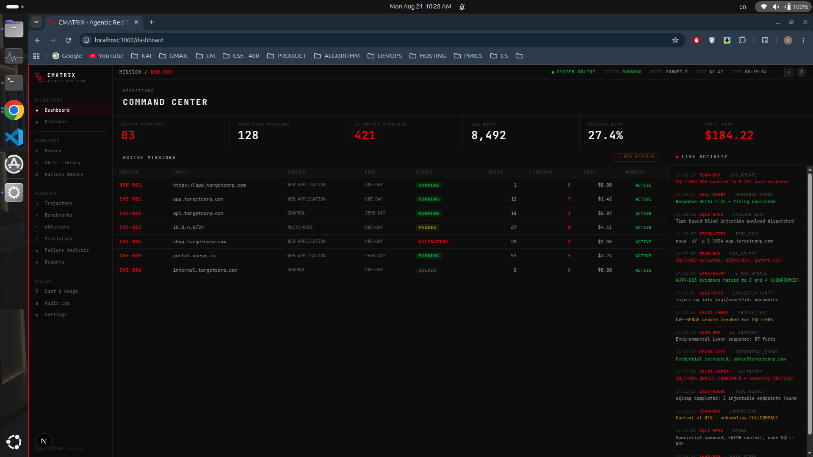
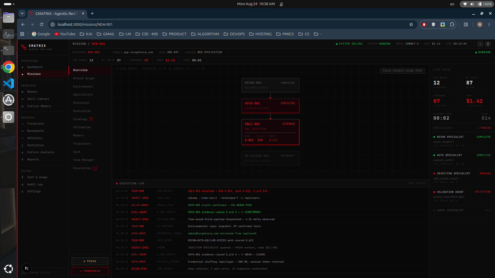
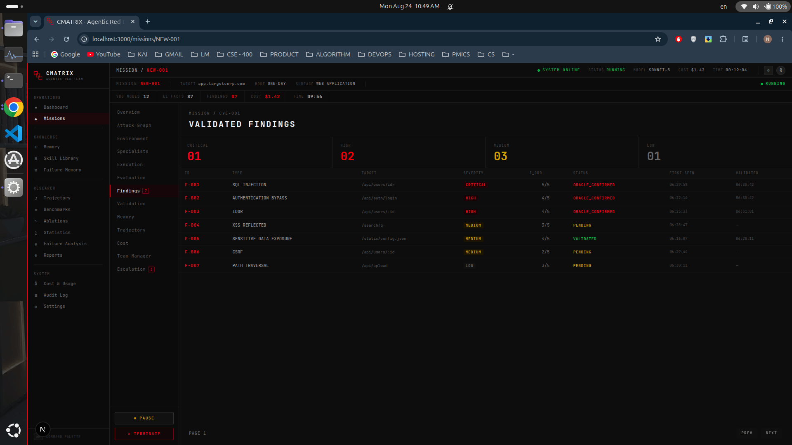
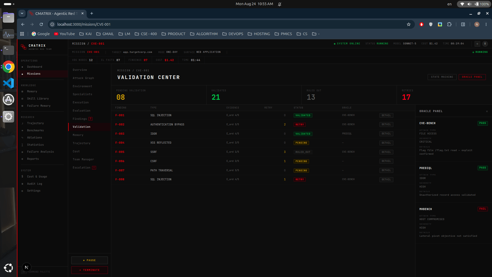
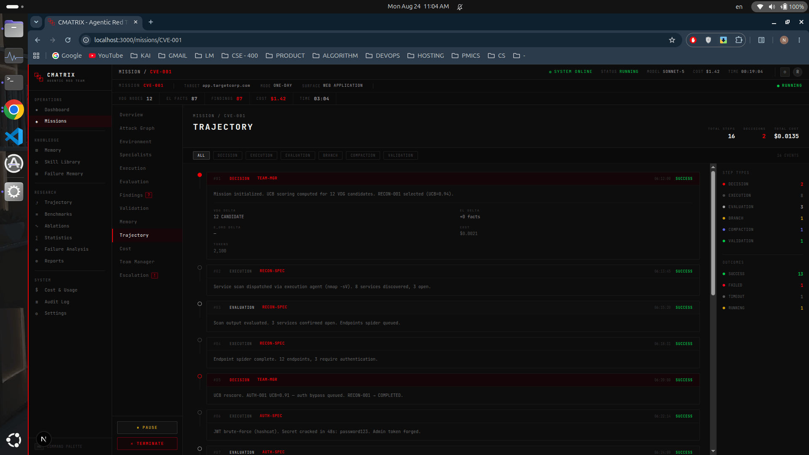
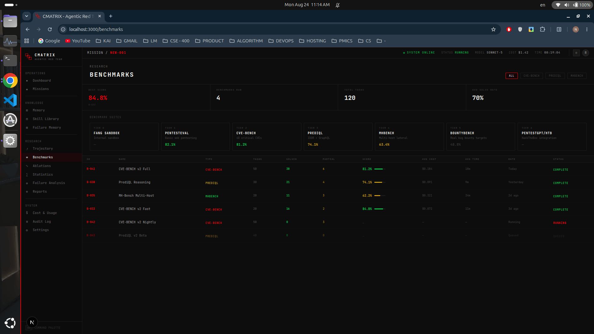

<div align="center">
  
  
  <h1>RedGrid - Agentic Red Team (Frontend)</h1>
  <p><b>Next.js User Interface for the RedGrid Autonomous Vulnerability Assessment Framework</b></p>

  <a href="https://redgrid.kaiofficial.xyz" target="_blank">
    
  </a>
</div>

---

## 📖 Overview

**RedGrid** is a conceptual, advanced LLM-orchestrated multi-agent framework designed for autonomous vulnerability assessment and penetration testing (VAPT). Its core thesis revolves around **Dependency-Constrained UCB Exploration** via a **Vulnerability Dependency Graph (VDG)** and a strictly separated **Dual-Layer World Model**. 

> ⚠️ **Current Status:** This repository currently contains **only the Frontend UI** of the RedGrid architecture. The backend orchestration, AI agents, execution runners, and stateful workflows have **not yet been developed**.

This frontend serves as the visual interface and control surface envisioned for managing the Dual-Layer World Model (Environmental Layer & Attack Layer), monitoring multi-agent task progressions, and visualizing the VDG in real-time.

---

## ✨ Features (Frontend UI)

Our user interface is crafted to provide a commanding, premium experience for autonomous security operations:

- 🎨 **Modern, Responsive Interface**: Built entirely with **Next.js 16**, **React 19**, and **Tailwind CSS v4** for a seamless, ultra-fast experience.
- 🗺️ **World Model Visualization**: UI components specifically tailored to observe the **Environmental Layer** (confirmed discovered facts) and the **Attack Layer** (scored attack hypotheses).
- 📊 **Agent Telemetry & Logs**: Polished data tables and terminal interfaces designed to present agent reasoning, execution traces, and Validation Agent critiques.
- ⚡ **Optimized Rendering**: Uses React Virtualized (`@tanstack/react-virtual`) for smoothly rendering massive lists of nodes and findings without performance drops.

---

## 📸 Application Preview

<div align="center">
  <!-- Main Overview -->
  

  <!-- Collapsible Gallery for more previews -->
  <details>
    <summary><b>✨ Click to expand more application previews</b></summary>
    <br>
    <p align="center">
      
      
    </p>
    <p align="center">
      
      
    </p>
    <p align="center">
      
    </p>
  </details>
</div>

---

## 🛠️ Technology Stack (Current)

| Category | Technology Stack |
| :--- | :--- |
| **Frontend Framework** | <a href="https://nextjs.org/"></a> <a href="https://react.dev/"></a> |
| **Styling & UI** | <a href="https://tailwindcss.com/"></a> |
| **Language & Tooling** | <a href="https://www.typescriptlang.org/"></a>   |

---

## 🚀 Quick Start

Reproducing the current codebase is straightforward. You can run the application natively using Node.js or isolated via Docker. The repository includes a convenient `Makefile` for all common tasks.

### 1. Clone the Repository

```bash
git clone https://github.com/nishan-paul-2022/redgrid-agentic-red-team.git
cd redgrid-agentic-red-team
```

### 2. Option A: Local Native (Node.js)

Ensure you have **Node.js** (v18+) installed. Use the `make` commands for simplified execution:

```bash
# Install dependencies
make install

# Start the Next.js development server
make dev
```

### 3. Option B: Docker Container

Alternatively, you can run the UI using Docker and `docker-compose`:

```bash
# Build the Docker image
make docker-build

# Start the container in the background
make up
```

> 🎯 **Access the Interface:**
> Open your browser and navigate to **[http://localhost:3000](http://localhost:3000)** (or the port specified in your console).

---

## 📜 Theoretical Architecture Overview

Although not yet implemented in backend logic, this UI is fundamentally designed to support the following core architectural pillars of the RedGrid system:

1. **Dual-Layer World Model**: A state paradigm that separates confirmed environmental facts (`Environmental Layer`) from UCB-scored attack hypotheses (`Attack Layer`).
2. **Vulnerability Dependency Graph (VDG)**: A scored DAG mapping out prerequisite/enables edges, enabling path-level impact scoring instead of greedy node selection.
3. **Four-Layer Orchestration**: A scalable hierarchy (Orchestrator → Team Manager → Specialists → Execution/Validation) that resolves context-window inflation.
4. **Validation Agent Loop**: A bounded Diagnosis-Adapt-Cap loop intended to confirm findings using real-world testing oracles before asserting success.

## 📜 Research Works

RedGrid includes a professional, independent LaTeX build system for documenting research findings. We have five specialized research papers covering different aspects of agentic security.

### 📚 Available Research Papers

| Index | Paper Topic | Build Command | Output Path |
| :--- | :--- | :--- | :--- |
| 01 | **LLM Orchestrated Multi-Agent Framework for Autonomous VAPT** | `make paper-01` | `docs/paper-research/paper-structure/paper-01-llm-orch-vapt/paper.pdf` |
| 02 | **Red Teaming** | `make paper-02` | `docs/paper-research/paper-structure/paper-02-governed-agentic-red-teaming/paper.pdf` |
| 03 | **HITL Safety** | `make paper-03` | `docs/paper-research/paper-structure/paper-03-checkpoint-resumable-autonomy/paper.pdf` |
| 04 | **Agent Reasoning** | `make paper-04` | `docs/paper-research/paper-structure/paper-04-hitl-orchestrated-reasoning/paper.pdf` |
| 05 | **Vulnerability Intelligence** | `make paper-05` | `docs/paper-research/paper-structure/paper-05-agentic-vuln-intelligence/paper.pdf` |

### 🏗️ Building the Papers

To build a specific paper, use its corresponding command listed above. To build **all** papers at once, run:

```bash
make paper
```

*(Compiled PDFs will be output to `docs/paper-research/paper-structure/`)*

---

### 🔗 External Resources

- **Hermes Agent**
    > *An open-source, autonomous AI agent designed to run persistently and improve over time.*
    - 🌐 **Website**: [hermes-agent.nousresearch.com](https://hermes-agent.nousresearch.com/)
    - 📂 **GitHub**: [nousresearch/hermes-agent](https://github.com/nousresearch/hermes-agent)
    - 🎥 **Demo**: [Watch on YouTube](https://www.youtube.com/watch?v=9GpWELm3_XI)
- **PentAGI**
    > *A self-hosted, multi-agent AI system designed for autonomous end-to-end penetration testing using sandboxed tools.*
    - 🌐 **Website**: [pentagi.com](https://pentagi.com/)
    - 📂 **GitHub**: [vxcontrol/pentagi](https://github.com/vxcontrol/pentagi)
    - 🎥 **Demo**: [Watch on YouTube](https://www.youtube.com/watch?v=R70x5Ddzs1o)
- **HexStrike AI**
    > *A Model Context Protocol (MCP) server that empowers LLMs with 150+ professional security tools for autonomous offensive workflows.*
    - 🌐 **Website**: [hexstrike.com](https://www.hexstrike.com/)
    - 📂 **GitHub**: [0x4m4/hexstrike-ai](https://github.com/0x4m4/hexstrike-ai)
    - 🎥 **Demo**: [Watch on YouTube](https://www.youtube.com/watch?v=PQOwpjZXzMo)
- **LLM4Pentest Framework**
    > *A curated list of resources on the application of LLMs in automated penetration testing, including academic papers, tools, and benchmarks.*
    - 📂 **GitHub**: [simon-p-j-r/LLM4Pentest](https://github.com/simon-p-j-r/LLM4Pentest)
- **Security Conference Deadlines**
    > *An open-source tracker for upcoming security and privacy academic conference deadlines and Call for Papers (CFPs).*
    - 🌐 **Website**: [sec-deadlines.github.io](https://sec-deadlines.github.io/)

---

<div align="center">
  
  <p>Built with ❤️ by <b><a href="https://kaiofficial.xyz/">KAI</a></b></p>
</div>
