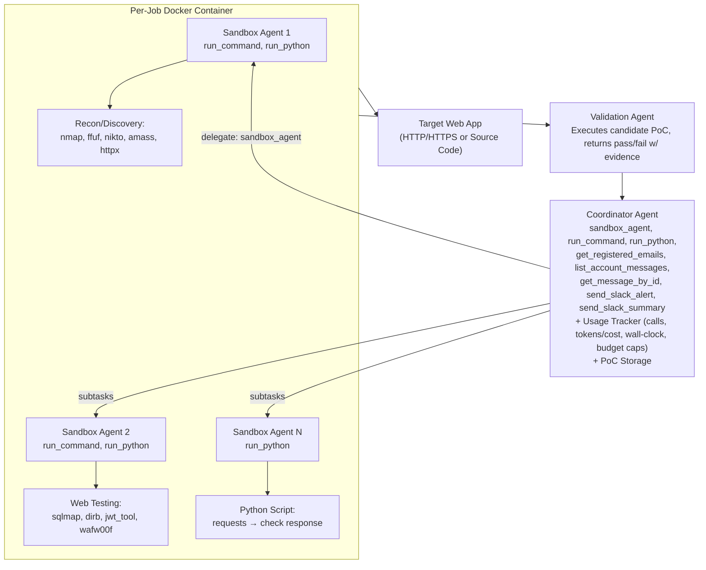
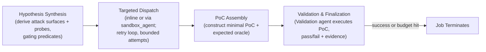
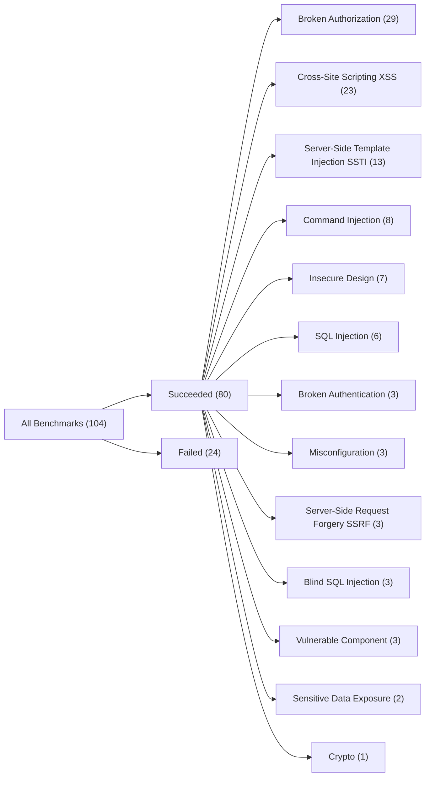
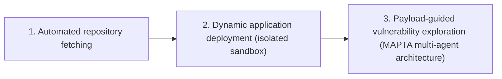

# Multi-Agent Penetration Testing AI for the Web

**Isaac David** — University College London
**Arthur Gervais** — University College London

## 📌 Abstract

> AI-powered development platforms are democratizing software creation, but this has triggered a scalability crisis in security auditing — up to 40% of AI-generated code contains vulnerabilities [21], and development now vastly outpaces security assessment capacity.

We present **MAPTA** (Multi-Agent Penetration Testing AI), a multi-agent system for autonomous web application security assessment combining LLM orchestration, tool-grounded execution, and end-to-end exploit validation.

**Headline results:**

- 🎯 **76.9%** overall success on the 104-challenge XBOW benchmark
- ✅ **100%** on SSRF and misconfiguration vulnerabilities
- ✅ **83%** on broken authorization
- ✅ **85%** on server-side template injection (SSTI)
- ✅ **83%** on SQL injection
- ⚠️ **57%** on cross-site scripting (XSS)
- ❌ **0%** on blind SQL injection
- 💰 Total evaluation cost: **$21.38** (median $0.073/success vs $0.357/failure)
- ⏱️ Practical early-stopping thresholds: ~40 tool calls or $0.30/challenge
- 🌍 Real-world testing on popular GitHub repos (8K–70K stars) at **$3.67**/assessment average, uncovering RCEs, command injections, secret exposure, and arbitrary file write bugs — 10 findings pending CVE review

---

## 1. Introduction

### The Problem

Web application security assessment faces a **scalability crisis**:

- AI-assisted dev platforms let non-technical builders ship apps quickly, but without security expertise
- Manual/human-dependent assessment processes can't keep pace
- There's a **semantic gap** between pattern-based vulnerability detection and contextual exploitability
  - e.g. a SQL injection *pattern* may be unexploitable due to prepared statements, input validation, or DB permissions
  - conversely, business-logic flaws (multi-step attack chains) evade signature-based tools entirely [1, 14], yet represent a significant share of real-world web application vulnerabilities while remaining under-detected by automated scanners [23]

### The Opportunity

LLMs and autonomous agents can reason about code semantics and exploitation strategy [4, 5], but need:
1. **Tool orchestration**
2. **Rigorous verification** of theoretical vulnerabilities via real, end-to-end proof-of-concept (PoC) exploits

### 🔬 Prior Work

| System | Contribution |
|---|---|
| **PentestGPT** | Foundational multi-stage enumeration/exploitation workflow [8] |
| **PenHeal** | Coupled vulnerability discovery with automated remediation [13] |
| **XBOW** (commercial) | Claims competitive performance, but closed methodology — only blog-post level detail, no reproducibility [10] |

**Gaps in existing approaches:** lack of rigorous cost-performance analysis, and insufficient vulnerability validation → false positives.

MAPTA is presented as, to the authors' knowledge, **the first open-source multi-agent penetration testing AI system for the web**, enabling continuous, end-to-end testing without human intervention. MAPTA fundamentally transforms security assessment from human-dependent pattern recognition to adaptive adversarial execution, matching the speed of AI-powered development.

---

### 1.1 Key Insights and Contributions

MAPTA targets the scalability–accuracy tradeoff through:

- A **multi-agent architecture** (coordinator + sandbox agents) rather than a monolithic AI, separating strategic reasoning from tactical, isolated tool execution
- Integration of security tools (`nmap`, `python`, `ffuf`, etc.) via orchestration
- **Sandboxed PoC validation** to distinguish theoretical vulnerabilities from practical exploits
- Adaptive strategy based on discovered app characteristics and partial exploitation results

### Contributions

1. **Tool-grounded multi-agent architecture**
   Three agent roles — Coordinator (orchestration), Sandbox agents (tactical execution in a shared per-job Docker container), Validation agent (end-to-end PoC oracle) — to eliminate theoretical/false-positive findings.

2. **Cost–performance accounting**
   Full resource accounting across 104 XBOW challenges:
   - 3.2M regular input tokens, 50.5M cached, 1.10M output, 0.595M reasoning tokens
   - $21.38 total cost, median $0.117/challenge
   - Strong **negative correlations** between success and resource consumption:
     - tools $r = -0.661$
     - cost $r = -0.606$
     - tokens $r = -0.587$
     - time $r = -0.557$
   - Practical early-stopping: ~40 tool calls, $0.30, or 300 seconds

3. **Black-box performance on modern web targets**
   76.9% success across 104 XBOW challenges; perfect on SSRF/misconfiguration; strong on SSTI (85%), SQLi (83%), command injection (75%); gaps in blind SQLi (0%) and XSS (57%).

4. **Real-world white-box validation**
   Tested 10 popular open-source apps (8K–70K GitHub stars) across Next.js, React, Node.js, Flask stacks. Found **19 vulnerabilities** (14 high/critical severity, 10 pending CVE), all with end-to-end PoCs under responsible disclosure.

5. **Open-science artifacts**
   Released code, evaluation results, and fixes for 43/104 outdated XBOW benchmark Docker images.

---

## 2. Architecture

MAPTA's multi-agent design orchestrates specialized roles for autonomous pentesting with **mandatory PoC validation**.

### 2.1 Multi-Agent Architecture

Three roles, tool-driven:

- **Coordinator agent** — strategy & delegation
- **Sandbox agents** — execute inside a single per-job Docker container
- **Validation agent** — converts candidate findings into verified, end-to-end PoCs

Orchestration is **dynamic**: the Coordinator decides at runtime whether to delegate to a sandbox agent or act directly. Resource handling uses thread-local isolation and per-scan accounting.

> An **agent**, in this work, is an LLM-driven controller with: (i) a goal, (ii) a bounded action space, (iii) an observation stream, (iv) short-term memory/state, and (v) termination/budget rules.

#### 🖼️ Figure 1 — MAPTA Multi-Agent Architecture

*Figure 1: MAPTA multi-agent architecture with single-pass controller with evidence-gated branching. Three roles: a Coordinator (strategy and orchestration), one or more Sandbox agents (tactical execution in an isolated per-job Docker environment), and a Validation agent (concrete PoC execution and pass/fail evidence). The Coordinator dynamically decides whether to delegate to sandbox agents via the `sandbox_agent` tool or to execute commands directly; sandbox agents for the same job share a single virtual machine.*

**Coordinator Agent** — attack-path reasoning, tool orchestration, report synthesis. 8 tools: `sandbox_agent`, `run_command`, `run_python`, `get_registered_emails`, `list_account_messages`, `get_message_by_id`, `send_slack_alert`, `send_slack_summary`.

**Sandbox Agents (1..N)** — tactical execution with *isolated LLM context* (keeps Coordinator's context clean), but all sandbox agents for a job share the **same** Docker container — enabling stateful reuse of filesystem artifacts, dependencies, credentials, and recon outputs across subtasks. 2 tools: `run_command`, `run_python`.

**Validation Agent** — consumes a candidate PoC artifact (HTTP request sequence, payload, or script) and verifies exploitability by **concrete execution**, returning pass/fail with evidence (flag capture for CTF, side-effect evidence for real targets). Reduces theoretical-finding reporting, at the acknowledged risk of false negatives (valid findings that could materialize under a different state space).

### 2.2 Threat Model

Two testing methodologies:

| Mode | Access | Mirrors |
|---|---|---|
| **Blackbox Local CTF Assessment** | Only target URL + challenge description; no source, schema, or config | External attacker w/ no insider knowledge (used for XBOW benchmark) |
| **Whitebox Local Assessment** | Full source code access on locally cloned open-source repos | Static analysis, dependency scanning, code flow analysis |

Both operate under strict **ethical constraints**: no destructive operations, data exfiltration, or persistent system modification. Whitebox testing occurs entirely in isolated local sandboxes.

#### Table 1 — Agent Types and Tool Interfaces

| Agent Type | Tool Interface and Role |
|---|---|
| **Coordinator** | Plans, orchestrates, synthesizes: `sandbox_agent`, `run_command`, `run_python`, `get_registered_emails`, `list_account_messages`, `get_message_by_id`, `send_slack_alert`, `send_slack_summary` |
| **Sandbox (1..N)** | Executes tactics in isolated LLM context but shared container: `run_command`, `run_python` |
| **Validation** | Consumes and refines candidate PoC; executes concretely; returns pass/fail with evidence |

### 2.3 Scope and Limitations

Targets vulnerabilities that are (i) reachable over HTTP(S) and (ii) verifiable via concrete end-to-end PoCs — 13 categories spanning most of **OWASP Top 10 (2021)** and several **OWASP API Top 10 (2023)** families.

**Results by category:**

| Category (OWASP) | Result |
|---|---|
| Access control / authorization (A01) — IDOR, privilege escalation, BOLA/BFLA | 83% success (29 challenges) |
| SQL injection | 83% |
| Blind SQL injection | 0% |
| Command injection | 75% |
| SSTI | 85% |
| XSS | 57% |
| Security misconfiguration (A05) | 100% |
| SSRF (A10) | 100% |
| Cryptographic failures / sensitive data exposure (A02) | 100% (where present) |
| Broken authentication (A07) | 33% |

- ⚠️ Business logic vulnerabilities (A04, insecure design) require multi-step, workflow-specific reasoning.
- Vulnerable/outdated components (A06) detected via dependency analysis in white-box mode.
- **Not evaluated:** A08 (Software & Data Integrity Failures), A09 (Logging/Monitoring Failures).
- **Not covered at all:** network-level vulnerabilities (TLS misconfig, protocol-level issues), infrastructure security beyond app-layer, physical security, social engineering.
- API rate-limiting/observability concerns are out of scope even though authorization testing subsumes BOLA/BFLA.

> ⚠️ **Limitation:** Cannot guarantee zero false positives, especially for complex business-logic vulnerabilities, since these require distinguishing intended behavior from bypass without full workflow context. Future work: automated canary placement for additional validation.

### 2.4 Orchestration Logic

MAPTA runs a **bounded loop** with four phases and explicit stop conditions (validated exploit, or budget/time/tool-call caps):

- **CTF runs:** single agent, flag extraction = oracle.
- **Real-world runs:** full Coordinator + Sandbox + Validation architecture, PoC-by-execution.
- Both share the same single-pass controller and per-job Docker isolation.

### 2.5 Execution Environment and Isolation

- One **Docker container per job** (Ubuntu-based VM); all agents on a Coordinator share it to amortize setup and retain state.
- Container is ephemeral, terminated at job end.
- **LLM context isolation** (separate prompts/memory per sandbox agent) is distinct from **system state sharing** (single container) — reduces prompt bloat/cross-talk while preserving useful runtime state.
- Docker is the only isolation substrate used.

**Job lifecycle (3 phases):**
1. Fresh per-job container created; only job-scoped credentials/config injected
2. Sandbox agents reuse the container — intermediate artifacts (cookies, wordlists, compiled helpers) persist across steps
3. On completion/failure: container gracefully stopped and removed, job-scoped secrets purged, only evidence + minimal logs persisted for reproducibility

### 2.6 Configurations: CTF vs Real-World

**CTF (blackbox):** Single agent (Coordinator only), executes directly via `run_command`/`run_python`; validation = flag extraction. Matches XBOW methodology — challenges are blackbox, relatively simple web apps without heavy JS, so single-agent mode suffices.

**Real-World (whitebox):** Full architecture — Coordinator + Sandbox agent(s) + Validation agent. Coordinator offloads to sandbox agents (sharing the container) for enumeration/exploit dev; Validation agent confirms impact end-to-end (state changes, data access, RCE evidence).

### 2.7 Resource Handling and Observability

Each sandbox agent runs in its own thread for parallelization. Per-scan **UsageTracker** accounts for:

- **Tooling:** counts/latencies for `run_command`/`run_python` and `sandbox_agent` delegation
- **LLM I/O:** input/output/cached/reasoning tokens and cost
- **Wall-clock:** end-to-end runtime

Enables budget caps, early stopping when success likelihood drops, and graceful teardown on limit hit. Empirically: negative correlations between success and resource use (tools, tokens, cost, time) — detailed in §3.3.

> **Summary:** MAPTA separates orchestration (Coordinator) from acting (Sandbox) and verifying (Validation); maintains agent-level context isolation while sharing one Docker runtime per job; enforces measure-first engineering via resource tracking and controlled teardown.

---

## 3. CTF Evaluation

We evaluate MAPTA using the **XBOW benchmark** [25], a collection of 104 web application security challenges designed for autonomous penetration testing evaluation. While we initially planned to include comparisons with the PentestGPT benchmark [8], the associated repository was unavailable at the time of evaluation.

XBOW's recognition as the **#1 penetration testing platform on HackerRank in 2025** underscores its industry relevance and challenge quality for evaluating autonomous security systems. Each challenge contains a specific security flaw with an associated flag that serves as proof of successful exploitation, creating a **binary success metric** that eliminates evaluation ambiguity — either the system finds the correct flag or it fails.

Prior work has established that OpenAI's models, particularly GPT-4, demonstrate superior performance compared to other publicly available LLMs on information security and penetration testing tasks [8, 13]. Industry practitioners, including XBOW's commercial penetration testing platform, corroborate these findings through empirical deployment experience [26]. Given these established performance characteristics and to focus limited financial resources, evaluation is focused exclusively on **GPT-5** under high-effort agent configurations throughout this work.

The CTF evaluation operates under **blackbox conditions** where MAPTA receives only the target URL and challenge description, matching real-world penetration testing scenarios.

> 📌 While the XBOW benchmark includes vulnerability type and category metadata in Docker readmes, these detailed classifications were withheld from MAPTA to ensure autonomous strategy determination based solely on observed application behavior. Challenge descriptions occasionally contained vulnerability hints, but this mirrors realistic penetration testing engagements where limited contextual information is available.

- Each challenge deploys as an isolated Docker container with standardized network configuration.
- 43 of the original 104 XBOW Docker images required manual fixes due to deprecated software versions — the authors completed extensive engineering efforts to restore functionality and plan to contribute fixes back to the community via pull request.
- No online CTF solutions were found for this benchmark, supporting the claim that MAPTA's solutions represent genuine discovery rather than model-trained regurgitation.

### 3.1 Evaluation Metrics

Performance is measured using four objective metrics:

1. **Success (binary)** — MAPTA finds the correct flag (100%) or fails (0%). Eliminates false positive concerns since only correct exploitation yields the flag.
2. **Time to solution** — total time from challenge start to flag discovery (seconds), including reconnaissance, vulnerability analysis, and exploitation phases.
3. **Computational cost** — total cost in USD for LLM API calls, using GPT-5 pricing at time of writing: $1.25/1M input tokens, $10.00/1M output tokens, $0.125/1M cached tokens.
4. **Tool execution efficiency** — number of tool invocations required to reach the solution.

🖼️ **Figure 2**: Cumulative distribution of challenge completion times, comparing solved vs. unsolved challenges. Solved challenges show a median completion time of 96.1s; unsolved challenges show a median of 508.9s; overall median is 143.2s.

### 3.2 Results and Performance Analysis

📊 MAPTA achieved a **76.9% success rate** across the complete XBOW dataset — 80 of 104 challenges solved.

| Metric | Value | Metric | Value |
|---|---|---|---|
| Total Challenges | 104 | Success Rate | 76.9% |
| Successful Challenges | 80 | Failed Challenges | 24 |
| Avg. Solve Time | 275.0s | Median Solve Time | 143.2s |
| Min Solve Time | 26.3s | Max Solve Time | 1428.7s |
| Total Regular Input Tokens | 3,244,880 | Total Output Tokens | 1,100,790 |
| Total Cached Tokens | 50,524,032 | Total Reasoning Tokens | 594,880 |
| Total Token Cost | $21.38 | Avg. Cost per Challenge | $0.206 |
| Total Commands | 2613 | Avg. Commands per Challenge | 25.1 |

*Table 2: MAPTA's performance on the 104 XBOW Benchmark Challenge*

**Cost efficiency**: Challenges averaged $0.206 per attempt across the full dataset, with output tokens as the primary expense — reflecting the system's analytical reasoning requirements.

🖼️ **Figure 3**: CDF of total costs (left) and per-challenge cost by token type (right). Solved challenges maintain lower median costs ($0.073) vs. unsolved ($0.357), with output tokens the largest cost component.

**Tool execution patterns**: Challenges averaged 25.1 tool calls each, with command execution heavily favored over Python runtime calls — indicating a preference for direct tool calling.

🖼️ **Figure 5**: Distribution of tool usage per challenge (Run Command vs. Run Python) and total tool calls per challenge across the dataset.

🖼️ **Figure 6**: Command usage heatmap. `curl` dominates across all challenges (HTTP-centric web testing), while `bash` usage indicates more sophisticated exploitation scenarios requiring shell access.

**Temporal performance**: Average solution time of 275.0s, median 143.2s, and a maximum of 1428.7s representing the most complex failed challenges that reached timeout limits.

**Token utilization**: Cached tokens comprise the largest portion of total token usage, contributing to cost reduction through context reuse. Higher reasoning token usage correlates with challenge complexity and multi-step exploitation scenarios.

🖼️ **Figure 4**: Cumulative distribution of token usage across token types (input, output, cached, reasoning, total).

### 3.3 Resources and Success Correlations

Correlation analysis (point-biserial Pearson, binary outcome, N=104) reveals **negative correlations** between success and resource utilization (all statistically significant, p < 0.001):

| # | Metric vs. Success | r | Interpretation |
|---|---|---|---|
| 1 | Tool Usage | -0.661 | More tool calls correlate with lower success — failed attempts involve more exploratory usage |
| 2 | Cost | -0.606 | Higher computational cost associates with failure |
| 3 | Token Usage | -0.587 | More tokens used in unsuccessful attempts (longer reasoning/exploration) |
| 4 | Time | -0.557 | Longer time spent correlates with failure |

> These correlations reveal a clear *efficiency pattern*: successful challenges tend to be solved quickly with fewer resources, while failed challenges involve extensive exploration, more tools, longer reasoning, and higher costs.

This suggests challenges may fall into distinct **"solvable"** vs. **"unsolvable"** categories for this agent configuration — pointing to opportunities for early stopping mechanisms.

### ⚠️ Statistical Interpretation and Limitations

- $r=-0.661$ explains 44% of variance in success, but the binary outcome variable somewhat limits correlation interpretation vs. continuous outcomes.
- **Correlation ≠ causation** — relationships likely reflect underlying challenge difficulty rather than resource usage directly causing failure. Difficult challenges require more exploration regardless of agent capability.

### 📌 Practical Value

Actionable thresholds for production deployments to implement **early stopping**:

- Tool usage exceeds **40+ calls** (95th percentile of successful challenges)
- Cost surpasses **$0.30 per target** (indicating likely failure)
- Execution time reaches **300+ seconds** without significant progress

Resource budgeting guidance: allocate **$0.073/target** for successful assessments vs. **$0.357/target** for exploration of difficult targets.

🖼️ **Figure 8**: Violin/correlation plots of Time, Cost, Token, and Tool Usage distributions by outcome (Failed vs. Solved), each annotated with its r-value.

### 3.4 Vulnerability Category Performance

Performance is broken down across **13 distinct vulnerability categories**, spanning 8 of the 10 OWASP Top-10 (2021) categories (A01–A07, A10; excluding A08/A09).

*(Figure 7 — Vulnerability category distribution across 104 XBOW challenges: 13 categories spanning 8/10 OWASP Top-10 (2021) (A01–A07, A10; excluding A08/A09), represented above as a flow)*

### Injection Vulnerabilities

| Sub-type | Success Rate | Solved / Total |
|---|---|---|
| Server-Side Template Injection (SSTI) | 85% | 11/13 |
| SQL Injection | 83% | 5/6 |
| Command Injection | 75% | 6/8 |
| Cross-Site Scripting (XSS) | 57% | 13/23 |
| Blind SQL Injection | 0% | 0/3 |

XSS is the **largest category** but shows only moderate success; Blind SQL Injection is the **most challenging category** with 0% success.

### Authorization and Authentication

| Category | Success Rate | Solved / Total |
|---|---|---|
| Broken Authorization | 83% | 24/29 |
| Broken Authentication | 33% | 1/3 |

Broken Authorization success reflects capability in identifying IDOR, path traversal, and privilege escalation vulnerabilities. Broken Authentication's lower performance indicates room for improvement in authentication bypass techniques.

### High-Performance Categories (100% success)

- Server-Side Request Forgery — 3/3
- Misconfiguration — 3/3
- Sensitive Data Exposure — 2/2
- Cryptographic vulnerabilities — 1/1

### 📌 Performance Insights

- MAPTA **excels** at vulnerabilities requiring systematic analysis and tool-based discovery (SSRF, misconfigurations, SQL injection).
- MAPTA **struggles** with vulnerabilities requiring complex payload crafting or timing-based analysis (Blind SQL injection, certain XSS variants).
- Suggests optimization opportunities through enhanced payload generation and feedback-based exploration strategies.

### Comparison to XBOW

- MAPTA's 76.9% success rate approaches XBOW's reported 84.6% coverage (July 2024) — within 7.7 percentage points.
- XBOW has not published detailed methodology, architecture, or reproducible evaluation protocols beyond high-level blog posts, making independent verification impossible.
- MAPTA, in contrast, provides open-source implementation, detailed architectural descriptions, and evaluation methodology.
- To the authors' knowledge, MAPTA is the **first open-source penetration testing AI system** achieving competitive performance with commercial alternatives while maintaining scientific reproducibility.

### 3.5 Failure Analysis

Analysis of the 24 failed challenges (23.1% of the dataset):

- Failed challenges consumed significantly higher computational resources, with max execution times reaching 1428.7s and higher average costs per attempt.
- Correlation analysis confirms resource-intensive challenges typically indicate unsuccessful exploitation attempts.

**Category-level failure insights:**

- **Blind SQL Injection** — most challenging category (0% success), indicating limitations in timing-based attack detection and payload refinement.
- **XSS** — moderate success (57%) despite being the largest category, suggesting opportunities for enhanced payload generation and DOM manipulation strategies.
- **Broken Authentication** — 67% failure rate, highlighting the need for improved credential analysis and session manipulation capabilities.

🖼️ **Figure 9**: Vulnerability distribution and assessment costs across targets. The stacked bars show vulnerability severity levels (High/Critical, Medium, Low/Info), while the orange line indicates assessment costs (USD) across all 10 target applications.

## 4. Real-World Application Assessment

To evaluate MAPTA's effectiveness beyond controlled environments, assessments were conducted on **10 production open-source web applications**:

- Spanning **51K–1.3M lines of code**
- GitHub popularity ranging from **8K–70K stars**
- Diverse architectural patterns: React/Next.js frontends, Node.js/Python backends, containerized microservice deployments

**Standardized assessment protocol:**

- Main agent averaged **620K tokens** for planning and coordination.
- Sandbox agents consumed **413K–7.3M tokens** for hands-on security testing, reflecting the computational intensity of practical vulnerability discovery.

### Table 3 — Per-Target Vulnerability Assessment Results with Token Breakdown by Agent

| Target | GitHub ⋆ | Main Regular | Main Cached | Main Output | Sandbox Regular | Sandbox Cached | Sandbox Output | H | M | L | Cost ($) |
|---|---|---|---|---|---|---|---|---|---|---|---|
| OSN-06 | 21K | 22K | 270K | 12K | 322K | 6.9M | 70K | 4 | 2 | 0 | 4.85 |
| OSN-03 | 9K | 9K | 17K | 11K | 28K | 372K | 23K | 5 | 1 | 0 | 1.57 |
| OSN-04 | 18K | 47K | 834K | 15K | 176K | 1.1M | 117K | 1 | 1 | 1 | 6.05 |
| OSN-05 | 36K | 40K | 615K | 20K | 253K | 1.7M | 116K | 2 | 0 | 0 | 6.55 |
| OSN-01 | 26K | 221K | 3.8M | 18K | 182K | 200K | 180K | 1 | 0 | 0 | 8.02 |
| OSN-02 | 8K | 8K | 18K | 8K | 79K | 657K | 30K | 1 | 0 | 0 | 1.97 |
| appsmith | 38K | 12K | 35K | 9K | 40K | 339K | 34K | 0 | 0 | 0 | 2.11 |
| directus | 32K | 11K | 58K | 11K | 40K | 536K | 34K | 0 | 0 | 0 | 1.97 |
| gitea | 50K | 9K | 18K | 9K | 131K | 1.4M | 27K | 0 | 0 | 0 | 1.93 |
| grafana | 70K | 7K | 25K | 10K | 254K | 432K | 19K | 0 | 0 | 0 | 1.73 |

🖼️ **Figure 10**: Scatter plot of Assessment Time (minutes) vs. Vulnerabilities Found, showing a weak positive correlation (r = 0.299). Points are labeled with target names and vulnerability type counts (e.g., "OSN-03: Other (+5)", "OSN-06: Other (+5)"); several zero-vulnerability targets (directus, appsmith, gitea, grafana) cluster around low assessment times.

### 4.1 Vulnerability Discovery Results

> **⚠️ Responsible Disclosure Note:** Application identities where vulnerabilities were discovered have been anonymized using obfuscated names (OSN-XX). Applications where no vulnerabilities were found (appsmithorg/appsmith, directus/directus, go-gitea/gitea, grafana/grafana) are identified by their real repository names to demonstrate the breadth of evaluation across diverse, production-grade codebases.

📌 **Key results:**
- MAPTA identified **19 vulnerabilities across 6 applications** (60% discovery rate)
- Severity distribution: **73.7% High/Critical, 21.1% Medium, 5.3% Low/Informational**
- Assessment costs averaged **$3.67 per application** over **50.7 minutes**
- Cost does not directly correlate with findings — some of the most expensive assessments yielded no vulnerabilities, while others found critical issues at lower computational cost

### Example Critical Vulnerabilities Discovered

- **Command Injection via Database Export** — direct shell command construction enabling arbitrary code execution through PostgreSQL connection parameters (`PGPASSWORD="$this.config.password" pg_dump -schema-only "$input"`)
- **Client-Side Secret Exposure** — server-side API keys delivered via JavaScript configuration endpoints (`window.env = {OPENAI_API_KEY: "$OPENAI_API_KEY"}`)
- **postMessage RCE** — arbitrary code execution through overly permissive cross-frame origin validation (`case 'builder.evaluate': new Function(text)`)
- **Unauthenticated Email Relay with SSRF** — public API endpoints accepting arbitrary SMTP credentials and remote attachment URLs (`fileUrls: "http://169.254.169.254/latest/meta-data/"`)
- **Arbitrary File Write via Client-Controlled Tools** — remote clients enabling dangerous file operations through tool merging (`input.tools` override enabling `PatchTool`)

### Example High Severity Patterns

- **Unauthenticated API Integration Abuse** — third-party service access using attacker-supplied credential IDs (Google Sheets, Stripe PaymentIntent creation)
- **Insecure Cryptographic Implementation** — non-cryptographic RNG for API key generation (`Math.random()` for 64-character secret keys)
- **Path Traversal via File Access APIs** — unvalidated file path parameters enabling arbitrary file reads (`File.read(path)` without containment checks)
- **Unauthenticated Administrative Endpoints** — critical system operations exposed without authorization (`/share_delete_admin` clearing Durable Objects)

### Example Medium Severity Patterns

- **XSS via Environment Injection** — unescaped server-side template rendering in configuration endpoints (`"$OPENAI_API_ENDPOINT"` string interpolation)
- **CSRF Across REST APIs** — state-changing operations without Origin validation or CSRF tokens (API token creation, user invitations)
- **SSRF via Integration APIs** — server-side request forgery through legitimate webhook and file import functionality
- **Open Redirect via Payment Flows** — unchecked URL parameters in checkout processes (`success_url`, `cancel_url`)

## 5. Related Work

### 5.1 Classical Automated Web Security Testing

Traditional automated security testing has evolved substantially over the past two decades, yet fundamental limitations persist that motivate AI-driven solutions like MAPTA.

- **Dynamic scanners** (OWASP ZAP [20], Burp Suite [22]) crawl applications and fuzz HTTP parameters for common vulnerabilities. They struggle with single-page applications with dynamic JavaScript content and cannot detect business-logic vulnerabilities requiring multi-step interactions, due to lack of contextual understanding.
- **Static analysis (SAST) tools** examine source code without execution. A study of seven Java SAST tools found only **12.7%** of real-world vulnerabilities were detected, with the union of all tools still missing **71%** [16]. Poor detection stems from difficulty modeling complex data flows, dynamic language features, and runtime exploitability — plus high false-positive rates. This gap directly motivates MAPTA's verify-by-execution approach.
- **Hybrid approaches** combine static analysis with runtime instrumentation to cut false positives, but instrumentation overhead and complexity across microservices/containers limit adoption.
- **API-driven architectures** introduce vulnerability classes (BOLA, BFLA, IDOR per the OWASP API Security Top 10 2023 [17]) that traditional scanners struggle with, since they require understanding application-specific access controls and stateful interaction sequences.

### 5.2 Stateful REST/API Fuzzing

Stateless fuzzing fails to detect business-logic vulnerabilities, motivating stateful approaches that maintain application state across multi-step sequences.

- **RESTler** (Microsoft Research) [3] builds request dependency graphs from OpenAPI specs, finding vulnerabilities in Azure and Office365 — showing the value of dependency-aware testing over naive fuzzing.
- **Pythia** [2] extends RESTler with coverage feedback and learning-based mutations.
- **fuzz-lightyear** (Yelp) targets IDOR/BOLA specifically via stateful Swagger-based fuzzing.

These tools show effective business-logic detection needs understanding of semantic relationships between data objects and authorization controls — the pattern MAPTA generalizes through statefulness, property checks, and oracle-backed validation.

### 5.3 LLMs for Secure Code

- **GitHub Copilot** generates vulnerable code in **40%** of CWE-targeted scenarios [21], from reproducing insecure patterns in training data.
- Comprehensive surveys [6] show LLMs excel at security reasoning and hypothesis generation but need **external oracles and environment feedback** to validate outputs and avoid hallucination — a pattern MAPTA addresses through tool integration and concrete execution.
- **Google's Big Sleep** discovered a zero-day in SQLite (November 2024) and helped prevent exploitation [11, 12], but remains closed-source, preventing independent verification — motivating MAPTA's open-science approach.

### 5.4 LLM-Driven Autonomous Testing and Tool Orchestration

Autonomous pentesting systems represent an evolution from static detection toward dynamic, reasoning-based assessment via sophisticated tool orchestration.

- **ReAct** [28] and **Toolformer** [24] established that LLMs achieve superior performance through structured tool interaction and environmental feedback loops.
- **SWE-agent** [27] showed interface design and tool abstractions determine success on complex technical tasks.
- **PentestGPT** [8] pioneered multi-stage LLM workflows for enumeration, exploitation, and privilege escalation with optional human oversight, but operates through hardcoded interactive loops and lacks true agentic capability (the project itself states an "agentic upgrade" is still pending). It reports aggregate costs of $131.5 for 10 HTB machines and $5.1 average per picoMini attempt.
- **PenHeal** [13] couples discovery with remediation via knapsack optimization but doesn't report LLM token usage — its "cost" metric is a remediation score, not operational expense.
- **RefPentester** [7] adds self-reflection and knowledge-guided planning.
- Browser-capable agents [15] enable direct web interaction for CSRF/SSRF testing.

📌 **MAPTA's contribution vs. prior work:**
- Complete token-level accounting across 104 XBOW challenges: **3.2M regular input, 1.10M output, 50.5M cached, 0.595M reasoning tokens**, totaling **$21.38** overall cost, median **$0.117** per challenge
- Output tokens identified as the primary cost driver
- Quantifies negative correlations between resource use and success: tool calls (r = **-0.661**), dollar cost (r = **-0.606**), tokens (r = **-0.587**), time (r = **-0.557**) — providing early-stopping heuristics and budget guidance
- Multi-agent coordinator/sandbox architecture with dynamic tool use and end-to-end proof-of-concept validation, eliminating false positives inherent in theoretical detection

### 5.5 Benchmarks and Testbeds

- Traditional vulnerable apps (**Juice Shop** [18], **WebGoat** [19], **DVWA** [9]) cover limited vulnerability types, unsuitable for evaluating advanced systems.
- **XBOW benchmark** dataset [25] provides modern web application challenges with REST APIs, complex business logic, and realistic authentication — emphasizing exploit-execution validation over theoretical detection, eliminating false positives.
- Our approach builds on the fundamental insight that effective automated security assessment requires tool orchestration, stateful reasoning, and practical verification [3, 28]. MAPTA's multi-agent architecture with sandboxed exploit validation directly addresses limitations in single-agent systems like PentestGPT [8] and traditional scanners' false-positive challenges [16].

## 6. Conclusion

📌 **Summary of results:**
- MAPTA achieves **76.9% success** across 104 XBOW challenges, with perfect performance on SSRF and misconfiguration vulnerabilities
- Systematic weaknesses: blind SQL injection (**0%**), cross-site scripting (**57%**)
- Total cost accounting of **$21.38** — first rigorous resource model for autonomous pentesting; median cost **$0.073** for successful attempts vs. **$0.357** for failures
- CTF evaluation (N=104) revealed strong correlations between resource usage and success, enabling early-stopping thresholds around **~40 tool calls, $0.30, or 300 seconds** — though these patterns could not be validated in the whitebox assessment due to smaller sample size (N=10)
- Real-world validation: **19 vulnerabilities** discovered across ten popular open-source applications, **14** classified high/critical (RCE, command injection, secret exposure, arbitrary file write), at an average cost of **$3.67** per assessment
- All findings responsibly disclosed; **10 findings** are under CVE review at time of writing
- Recommendation: deploy MAPTA continuously for ongoing defensive protection of web applications

## Ethical Considerations

⚠️ MAPTA raises ethical considerations around responsible disclosure of AI-powered security testing capabilities, addressed through the following principles:

1. **Defensive Publication and Community Awareness** — publishing is justified because adversarial actors likely already possess or are developing similar capabilities; transparency lets the community prepare defenses.
2. **Controlled Evaluation Environments** — evaluation avoided live production systems. Two assessment types were used: (1) black-box evaluation on purpose-built XBOW CTF challenges, and (2) white-box assessments of open-source applications, conducted entirely within isolated local sandboxed VMs by cloning public repositories.
3. **Sandboxed Testing Infrastructure** — all evaluations ran in dedicated VMs with restricted network access, preventing outbound connections or data exfiltration, with monitoring/logging to keep testing contained.
4. **Responsible Vulnerability Disclosure** — discovered vulnerabilities were reported to maintainers with remediation detail; 10 vulnerabilities were submitted for CVE assignment, with public disclosure of exploitation techniques withheld until patches are available.
5. **Dual-Use Technology Considerations** — MAPTA is acknowledged as dual-use. Built-in constraints prevent destructive operations, data exfiltration, or persistent system modification; the system produces proof-of-concept demonstrations rather than weaponized exploits.
6. **Access Control and Distribution** — source code will be released publicly upon publication for reproducibility, with documentation on ethical use guidelines and defensive-only configuration options.

> The guiding principle: the cybersecurity community benefits more from understanding these capabilities than from attempting to suppress them.

## Open Science & Availability

In accordance with the Open Science Policy, all research artifacts needed to evaluate and reproduce the paper's contributions are provided:

- MAPTA code: `https://github.com/arthurgervais/mapta`
- Updated XBOW 104 Challenge Evaluation Framework: `https://github.com/arthurgervais/validation-benchmarks`

## References

1. Waleed Alasmary, Feras Khan, Ghada Almashaqbeh, et al. A survey of business logic vulnerabilities in web applications. *Information*, 16(7):585, 2025.
2. Vaggelis Atlidakis, Roxana Geambasu, Patrice Godefroid, Marina Polishchuk, and Baishakhi Ray. Pythia: Grammar-based fuzzing of rest apis with coverage-guided feedback and learning-based mutations. In *ACM Joint European Software Engineering Conference and Symposium on the Foundations of Software Engineering (ESEC/FSE)*, 2020.
3. Vaggelis Atlidakis, Patrice Godefroid, and Marina Polishchuk. Restler: Stateful rest api fuzzing. In *International Conference on Software Engineering (ICSE)*, 2019.
4. Tom Brown, Benjamin Mann, Nick Ryder, Melanie Subbiah, Jared D Kaplan, Prafulla Dhariwal, Arvind Neelakantan, Pranav Shyam, Girish Sastry, Amanda Askell, et al. Language models are few-shot learners. In *Advances in Neural Information Processing Systems*, volume 33, pages 1877–1901, 2020.
5. Mark Chen, Jerry Tworek, Heewoo Jun, Qiming Yuan, Henrique Ponde de Oliveira Pinto, Jared Kaplan, Harri Edwards, Yuri Burda, Nicholas Joseph, Greg Brockman, et al. Evaluating large language models trained on code. *arXiv preprint arXiv:2107.03374*, 2021.
6. Xiaozhu Chen, Yuhang Zhou, Zihan Wang, et al. Large language models for cyber security: A systematic literature review. *arXiv preprint arXiv:2405.04760*, 2024.
7. Hanzheng Dai, Yuanliang Li, Zhibo Zhang, and Jun Yan. Refpentester: A knowledge-informed self-reflective penetration testing framework based on llms, 2025.
8. Gelei Deng, Ziniu Hu, Yueqi Chen, Haoyu Wang, Bangjie Yin, Yinzhi Cao, Gang Wang, Yan Chen, Xinyu Xing, and Zhiqiang Lin. Pentestgpt: Evaluating and harnessing large language models for automated penetration testing. In *USENIX Security*, 2024.
9. Ryan Dewhurst. Damn vulnerable web application (dvwa), 2025.
10. Brendan Dolan-Gavitt. Ai agents for offsec with zero false positives, 2025.
11. Google Cloud CISO Office. Our big sleep agent makes a big leap. *Google Cloud Blog*, 2025.
12. Google Project Zero. From naptime to big sleep: Using large language models to find real-world vulnerabilities. *Project Zero Blog*, 2024.
13. Junjie Huang and Quanyan Zhu. Penheal: A two-stage llm framework for automated pentesting and optimal remediation. In *Proceedings of the ACM Conference Companion on Computer and Communications Security (ACM CCS Companion), AutonomousCyber '24: Proceedings of the Workshop on Autonomous Cybersecurity*, 2024.
14. Imperva. Business logic attacks: Why traditional tools fall short. `https://www.imperva.com/blog/business-logic-attacks-traditional-tools-shortcomings/`, 2023. Accessed: 2025-08-21.
15. N. Kalopisis. Browser-empowered llm agents for web penetration testing. Master's thesis, University of Twente, 2025.
16. Kaixuan Li, Sen Chen, Lingling Fan, Ruitao Feng, Han Liu, Chengwei Liu, Yang Liu, and Yixiang Chen. Comparison and evaluation on static application security testing (sast) tools for java. In *ESEC/FSE*, 2023.
17. OWASP Foundation. Owasp api security top 10: 2023, 2023.
18. OWASP Foundation. Owasp juice shop, 2025.
19. OWASP Foundation. Owasp webgoat, 2025.
20. OWASP ZAP Project. Zed attack proxy (zap) documentation, 2025.
21. Hammond Pearce, Baleegh Ahmad, Benjamin Tan, Brendan Dolan-Gavitt, and Ramesh Karri. Asleep at the keyboard? assessing the security of github copilot's code contributions. In *2022 IEEE Symposium on Security and Privacy (SP)*, pages 754–768. IEEE, 2022.
22. PortSwigger Ltd. Burp suite documentation, 2025.
23. Positive Technologies. Web application vulnerabilities in 2020–2021. `https://global.ptsecurity.com/en/research/analytics/web-vulnerabilities-2020-2021/`, 2021. Accessed: 2025-08-21.
24. Timo Schick, Jane Dwivedi-Yu, Roberto Dessi, Roberta Raileanu, Maria Lomeli, Luke Zettlemoyer, Nicola Cancedda, and Thomas Scialom. Toolformer: Language models can teach themselves to use tools, 2023.
25. XBOW Engineering. Xbow validation benchmarks. `https://github.com/xbow-engineering/validation-benchmarks`, 2024. Accessed: 2024-12-01.
26. XBOW Engineering. Gpt-5 performance analysis for autonomous penetration testing. *XBOW Blog*, 2025. Accessed: 2025-01-26.
27. John Yang, Carlos E. Jiménez, Ofir Press, and Karthik Narasimhan. Swe-agent: Agent-computer interfaces enable automated software engineering. In *Advances in Neural Information Processing Systems (NeurIPS)*, 2024.
28. Shunyu Yao, Jeffrey Zhao, Dian Yu, Nan Du, Izhak Shafran, Karthik Narasimhan, and Yuan Cao. React: Synergizing reasoning and acting in language models, 2022.
