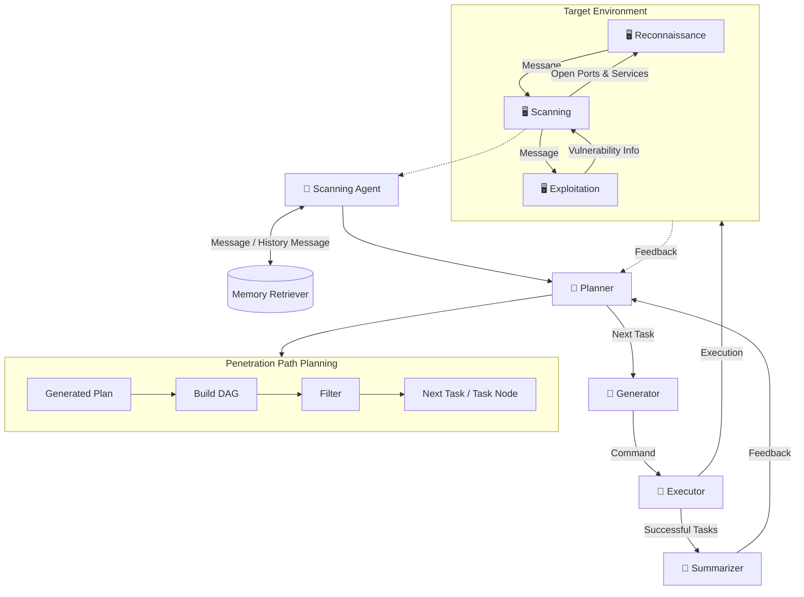
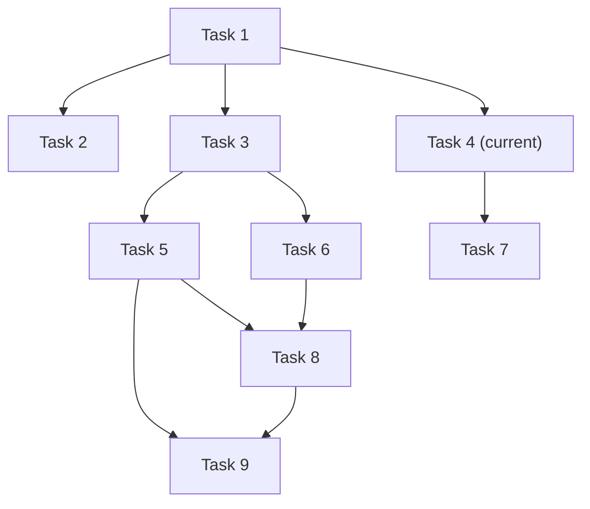
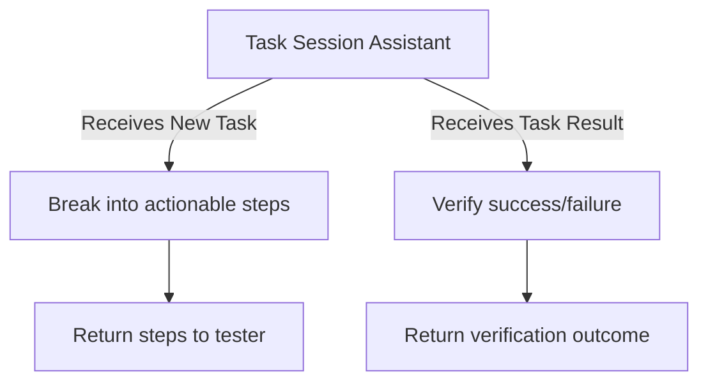

# VulnBot: Autonomous Penetration Testing for A Multi-Agent Collaborative Framework

**Authors:** He Kong¹ ² , Die Hu¹ ² , Jingguo Ge¹ ² , Liangxiong Li¹, Tong Li¹, Bingzhen Wu¹
¹ State Key Laboratory of Cyberspace Security Defense, Institute of Information Engineering, Chinese Academy of Sciences
² School of Cyber Security, University of Chinese Academy of Sciences

> arXiv:2501.13411v1 [cs.SE] 23 Jan 2025

## 📌 Abstract

Penetration testing is a vital cybersecurity practice, but manual execution is labor-intensive and time-consuming. Existing LLM-assisted or automated approaches suffer from inefficiencies — lack of contextual understanding and excessive, unstructured data generation.

**VulnBot** is proposed: an automated penetration testing framework that uses LLMs to simulate the collaborative workflow of human pentest teams via a multi-agent system.

- Decomposes complex tasks into **3 phases**: reconnaissance, scanning, exploitation
- Guided by a **Penetration Task Graph (PTG)** for logical task execution
- Key features: role specialization, penetration path planning, inter-agent communication, generative penetration behavior
- Outperforms baselines (GPT-4, Llama3) in automated pentest tasks, especially in fully autonomous testing on real-world machines

---

## 1. Introduction

Penetration testing proactively identifies network vulnerabilities and mitigates cyberattacks. The pentest market is projected to grow from **US $1.92B (2023)** to **US $6.98B by 2032**. Despite its importance, it remains labor-intensive, requiring skilled professionals to run complex manual workflows — driving demand for automation.

### 🔬 Related Work

- **PentestGPT** (Deng et al.): pioneered LLM-based pentest automation via reasoning, generation, and parsing modules to address context loss. *Limitation:* heavily relies on human intervention, with no way to measure how much — limiting agent autonomy.
- **AutoAttacker**: automates the post-penetration ("keyboard-operated") phase using planning, summarization, and code generation combined with tools like Metasploit. *Limitation:* targets specific tasks rather than real-world environments.
- Most prior work depends on GPT-4, making it hard to apply to open-source models.

### 🎯 VulnBot Overview

VulnBot emulates human pentest team collaboration through specialized roles (reconnaissance, scanning, exploitation) plus a PTG-based approach to path planning, inter-agent communication, and generative behavior.

- A **Summarizer** module bridges phases — condensing key outcomes so critical info survives across stages, minimizing redundancy and preserving clarity.
- **Generator** and **Executor** modules translate tasks into tool-specific commands and execute them autonomously.
- Three operational modes: **automatic**, **semi-automatic**, **human-involved** (evaluation focuses on automatic mode, since human involvement adds unquantifiable subjectivity).

### 📊 Key Results (preview)

| Benchmark | Model | Result |
|---|---|---|
| AUTOPENBENCH | VulnBot-Llama3.1-405B | 30.3% completion rate |
| AUTOPENBENCH | Llama3.1-405B (baseline) | 9.09% completion rate |
| AUTOPENBENCH | GPT-4o (baseline) | 21.21% completion rate |

- VulnBot shows stronger performance in early test stages by delaying automation to later stages, executing critical subtasks with greater precision.
- On the **AI-Pentest-Benchmark** (real-world machines), VulnBot + Llama3.1-405B + DeepSeek-v3 surpassed baselines; adding **RAG** improved performance further.
- With RAG, VulnBot autonomously completed real-world machine pentests **end-to-end** — a feat GPT-4o and Llama3.1-405B could not achieve without human intervention.

### 🧩 Contributions

1. **VulnBot framework** — tri-phase design (reconnaissance, scanning, exploitation) minimizing information loss and boosting efficiency.
2. **PTG-based task-driven mechanism** — models tasks/dependencies as a directed acyclic graph, combined with a **Check and Reflection Mechanism** for iterative plan adaptation and error handling.
3. **Open-source model validation** — using Llama3.3-70B, Llama3.1-405B, DeepSeek-V3: outperforms GPT-4/Llama3 baselines, achieving **69.05%** subtask completion and **30.3%** overall completion on AUTOPENBENCH; best performance on 6 real-world AI-Pentest-Benchmark machines; full end-to-end pentest via RAG integration.

---

## 2. Background & Motivation

### 2.1 Background

Penetration testing ("ethical hacking") simulates malicious attacks against systems/networks/applications to find and remediate vulnerabilities before real attackers exploit them.

Per the **OWASP Testing Guide**, pentesting has five key phases:

1. Reconnaissance
2. Scanning
3. Vulnerability exploitation
4. Maintaining access
5. Reporting

- Average full process duration: **~10 days**; reconnaissance is the most time-consuming (**4–6 days**).
- Cost varies by scope: basic website scan **US $349–$1,499**; comprehensive assessments (SaaS/web app) **US $700–$5,999**.

### 2.2 Motivation

Traditional pentesting is time-intensive and costly. Current LLM-based approaches have notable inefficiencies (see Figure 1 comparison below):

### 🔬 Figure 1: Workflow Comparison of Three Approaches to Automated Penetration Testing

```mermaid
flowchart TB
    subgraph A["(a) LLM Assistant-Guided Pentest Agent"]
        A1["Task Description"] --> A2["LLM Assistant<br/>(Analyse)"]
        A2 <--> A3["Human<br/>(Help)"]
        A2 --> A4["Action: nmap -sS -p- 10.10.0.4"]
        A4 --> A5["Target Environment"]
        A2 -.->|"😕 Inefficient"| A2
    end

    subgraph B["(b) Conventional Automated Pentest Agent"]
        B1["Task Description"] --> B2["Agent<br/>(Extract)"]
        B2 --> B3["Action: nmap -sS -p- [Target IP]"]
        B3 --> B4["Target Environment"]
        B4 -.->|"Failed Command /<br/>Context Loss"| B2
        B2 -.->|"😕 Too many information"| B2
    end

    subgraph C["(c) Collaborative Multi-Agent (Ours)"]
        C1["Task Description"] --> C2["Planner<br/>(Thinking → Plan & Next Task)"]
        C2 --> C3["Generator<br/>(Extract → Command)"]
        C3 --> C4["Action: nmap -sS -p- 10.10.0.4"]
        C4 --> C5["Target Environment"]
        C5 --> C6["Summarizer"]
        C6 --> C2
        C2 -.->|"🙂 Good"| C2
        C3 -.->|"🙂 Good"| C3
    end
```



> **Figure 1:** The workflow comparison of three approaches to automated penetration testing: (a) LLM Assistant-Guided Pentest Agent, which requires assistance due to inefficiency; (b) Conventional Automated Pentest Agent, which struggles with information overload and context loss; and (c) Collaborative Multi-Agent system, which employs a phased and modular approach, enhancing the overall efficiency and autonomy of the penetration testing process through multi-agent coordination.

- **(a) LLM Assistant-Guided Pentest Agent** — lacks autonomy, needs frequent human clarification → inefficient.
- **(b) Conventional Automated Pentest Agent** — generates excessive unstructured data without actionable next steps → context loss, command failures.
- **(c) Collaborative Multi-Agent (VulnBot)** — specialized agents for reconnaissance/scanning/exploitation, coordinated via planning, generation, and summarization → higher efficiency and autonomy.

#### 2.2.1 Task Definition

Autonomous penetration testing here covers two task types:
- Tasks requiring human guidance
- Tasks conducted **entirely without** human intervention ← **this paper's focus**

Open-source models are used to minimize cost.

#### 2.2.2 Exploratory Study

Three research questions (RQs) guided the empirical study of open-source LLMs in pentesting:

> **RQ1:** To what extent can open-source LLMs perform penetration testing tasks?

- Prior work (Isozaki et al.) introduced the **AI-Pentest-Benchmark** (13 real Vulnhub machines), testing GPT-4o and Llama3.1-405B via PentestGPT.
- Finding: Llama3.1-405B outperformed GPT-4o on reconnaissance/exploitation for easy/medium machines; both struggled with **privilege escalation** and **high-difficulty** machines.

> **RQ2:** What are the reasons for failure of open-source-LLM-driven pentesting?
> **RQ3:** How do open-source LLMs perform across different pentest phases?

- Evaluated using **AUTOPENBENCH** (33 tasks: in-vitro basic scenarios + real-world CVE-based scenarios).
- Further analysis used 128k-context Llama3.3-70B and Llama3.1-405B, 5 runs per test (220 experiments total).

##### 📊 Table 1 — Failure Counts & Causes by Phase

| Model | Phase | Failures | Session Context Loss | False Output Interpretation | Failed Tool | Deadlock Operation | Failed Command Param | Other |
|---|---|---|---|---|---|---|---|---|
| Llama3.3-70B | Reconnaissance | 28 | 18 (64.29%) | 3 (10.71%) | 2 (7.14%) | 0 (0.00%) | 4 (14.29%) | 1 (3.57%) |
| Llama3.3-70B | Scanning | 27 | 5 (18.52%) | 2 (7.41%) | 8 (29.63%) | 3 (11.11%) | 7 (25.93%) | 2 (7.41%) |
| Llama3.3-70B | Exploitation | 45 | 16 (35.56%) | 4 (8.89%) | 13 (28.89%) | 2 (4.44%) | 8 (17.78%) | 2 (4.44%) |
| Llama3.1-405B | Reconnaissance | 43 | 28 (65.12%) | 4 (9.30%) | 1 (2.33%) | 5 (11.63%) | 3 (6.98%) | 2 (4.65%) |
| Llama3.1-405B | Scanning | 27 | 4 (14.81%) | 3 (11.11%) | 9 (33.33%) | 0 (0.00%) | 11 (40.74%) | 0 (0.00%) |
| Llama3.1-405B | Exploitation | 33 | 15 (45.45%) | 2 (6.06%) | 7 (21.21%) | 1 (3.03%) | 6 (18.18%) | 1 (3.03%) |
| **Total** | — | **203** | **86 (42.36%)** | **18 (8.87%)** | **40 (19.70%)** | **11 (5.42%)** | **39 (19.21%)** | **8 (3.94%)** |


**Findings:**
- Primary failure cause in reconnaissance & exploitation: **session context loss**.
- Reconnaissance: models often fail to correctly interpret the initial task description (e.g., failing to run a full port scan like `nmap -p 10.10.1.x`).
- Exploitation: models frequently forget previously scanned targets or earlier findings.
- Root causes: **limited context window** + **token constraints** → truncation of critical data, or context overload from excessively long execution results.

### 2.3 Challenges (Takeaways)

> ⚠️ **Takeaway #1 — LLM Context Length**
> Fixed context length prevents coherent understanding across the full pentest process; models lose track of earlier discoveries, hindering task completion.

> ⚠️ **Takeaway #2 — Penetration Command Generation**
> LLMs often produce incorrect tool usage or fabricate non-existent parameters, undermining accurate translation of instructions into executable commands.

> ⚠️ **Takeaway #3 — Lack of Effective Error-Handling**
> No mechanism to autonomously diagnose/correct command execution failures → manual intervention needed, reducing automation.

> ⚠️ **Takeaway #4 — Dynamic Reasoning Across Phases**
> Reconnaissance → scanning → exploitation → post-exploitation are interdependent. Systems must integrate findings dynamically (e.g., scanning insights should inform exploitation strategy), but current systems struggle, often needing human oversight to connect findings across phases.

---

## 3. Design

Presents VulnBot's architecture for LLM-based multi-agent pentesting, organized around:

1. **Role specialization** (§3.2)
2. **Penetration path planning** — Planner + Memory Retriever modules (§3.3)
3. **Inter-agent communication** — Summarizer module (§3.4)
4. **Generative penetration behavior/interaction** — Generator + Executor modules (§3.5)

### 3.1 Overview

VulnBot's architecture centers on **five core modules**:


These modules jointly automate the three pentest phases: **Reconnaissance → Scanning → Exploitation**, balancing task-automation complexity with adaptability to unforeseen challenges.

### 3.2 Specialization of Roles

Motivated by Takeaways #1 and #4. Decomposing tasks into well-defined subtasks lets specialized agents focus and leverage targeted expertise.

**Challenge:** context-length limits mean info from earlier phases gets lost/diluted, since each phase should reference *all* preceding phases, not just the last one.

**Solution:** restructure into **3 specialized phases** (reconnaissance, scanning, exploitation) to keep each phase focused while minimizing cross-transition information loss. Agents receive task instructions as text: task description, a role-playing jailbreak method to bypass LLM usage policies, and preliminary agent context.

#### 🕵️ Reconnaissance
- Foundation phase — gather comprehensive info about the target.
- Full scan for open ports/services.
- Tools: **Nmap**, **Dirb**.
- Output feeds the scanning phase.

#### 🔎 Scanning
- Identify vulnerabilities/misconfigurations using reconnaissance data.
- Tools: **Nikto** (web server vuln scanning), **WPScan** (WordPress issue detection).
- Narrows the attack surface, prioritizes exploitable vulnerabilities.
- Kept separate from reconnaissance to avoid agent information overload.

#### 💥 Exploitation
- Culmination phase — exploit discovered vulnerabilities to gain access and escalate privileges.
- Tools: **Metasploit** (exploit development/execution), **Hydra** (credential brute-forcing).

Each phase builds on the previous one for a seamless, adaptive workflow.

### 3.3 Penetration Path Planning

Core components: **Planner** and **Memory Retriever** modules. The Planner operates through two sessions:

#### Plan Session
- Generates a JSON-structured action plan tailored to user requirements and target characteristics.
- Plan → structured task lists (unique IDs, dependencies, instructions, action types).
- Goal: construct the **Penetration Testing Task Graph (PTG)** — the logical task execution sequence.
- Plan is dynamically updated based on execution feedback (success/failure).
- Governed by:
  - **Task-driven Mechanism** (§3.3.1) — organizes tasks into a directed acyclic graph.
  - **Check and Reflection Mechanism** (§3.3.2) — iterative plan adaptation from execution feedback.

#### Task Session
- Generates specific task details per instruction, fed to the **Generator** for execution.
- Also checks task execution success.

To mitigate hallucination, VulnBot uses a third-party **Retrieval-Augmented Generation (RAG)** framework: **Langchain-Chatchat**. The Memory Retriever module stores embeddings of successful tasks and prior penetration knowledge in a vector database, enabling the system to leverage past experience when generating or updating plans.


### 📌 Example Role Profile — Scanner

| Field | Value |
|---|---|
| **Name** | Scanner |
| **Tools** | Nikto, WPScan, ... |
| **Goal** | Based on the reconnaissance results, further enumeration and check for vulnerabilities and misconfigurations in the target. |

### 🔬 Figure 2: Overview of VulnBot



> **Figure 2:** Overview of VulnBot. The **Memory Retriever** module stores embeddings of successful tasks and prior penetration knowledge in a vector database. When generating or updating plans, the current plan is converted into embedding vectors and compared against stored vectors via a text embedding model. The top *k* most similar vectors are retrieved, then re-ranked to select the optimal option — letting the system leverage past experience to improve planning decisions (detailed further in §5.4).

---

#### 3.3.1 Task-Driven Mechanism

The task-driven mechanism centers on the **Penetration Testing Task Graph (PTG)** — a structured representation of tasks and their dependencies, ensuring tasks execute in a logical, conflict-free order while tracking progress and results.

### 📐 Definition 1 — Penetration Task Graph

A PTG is a directed acyclic graph $G = (V, E)$ where:

- **$V$** — the set of nodes, each an individual task ($v \in V$) with unique identifier and attributes:
  - **Instruction** — the primary task directive (e.g. *"enumerate open ports on the target machine"*)
  - **Action** — operation type: `shell` or `manual`
  - **Dependencies** — other task IDs that must complete first
  - **Command** — the specific command, generated by the Generator module
  - **Result** — the output returned from execution
  - **Finished Status** — completed or pending
  - **Success Status** — whether the task succeeded

- **$E$** — the set of directed edges representing dependencies. If $T_1$ must run before $T_2$, an edge exists from $T_1 \to T_2$, determining execution order.

### 🔬 Figure 3: Generating a Penetration Task Graph (PTG)

Example task list (abridged):

```json
{ "id": "1", "dependencies": [], "action": "Shell",
  "instruction": "Use the credentials (wavex:door+open) to SSH into the target machine (IP: 192.168.1.104, Port: 22)." },
{ "id": "2", "dependencies": ["1"], "action": "Shell",
  "instruction": "Search for writable directories on the target machine using the command: 'find / -writable -type d 2>/dev/null'." },
{ "id": "3", "dependencies": ["1"], "action": "Shell",
  "instruction": "Enumerate running processes on the target machine using the command: 'ps aux'." },
{ "id": "9", "dependencies": ["5", "8"], "action": "Shell",
  "instruction": "Exploit the sudo permissions to escalate privileges to root using the command 'sudo su'." }
}
```

Corresponding dependency graph:



> **Figure 3:** The process of generating Penetration Task Graph (PTG). The green circle represents the current task being executed, while the dark circle indicates that the task has been successfully completed.

The PTG structures tasks so each depends on one or more preceding tasks — e.g. Task 1 (SSH login) must succeed before Task 2 (writable-directory search) or Task 3 (process enumeration) can run — maintaining a logical, systematic execution order.

---

#### 3.3.2 Check and Reflection Mechanism

> ⚠️ **Problem:** LLMs often lack effective error-handling and self-correction, frequently hallucinating erroneous commands/parameters, and struggle to accurately interpret task execution results.

To address this, VulnBot introduces a **Check and Reflection Mechanism** within the task session:

- **Task Session** — evaluates execution results and updates task success status.
- **Plan Session** — reflects on feedback from both successful and failed tasks, auto-updates prompts, and revises the plan. Successful tasks are retained; failed tasks are flagged for reanalysis.

This iterative loop improves adaptation and error recovery.

### 🔬 Algorithm 1 — Merge Plan Algorithm

Integrates new tasks into the existing plan while preserving completed tasks and their dependencies.

```
Input:  newTasks, oldTasks
Output: mergedTasks

completedTasks ← GetCompletedTasks(oldTasks)
mergedTasks ← []

# Step 1: Retain completed tasks not present in the new task list
for task in completedTasks:
    if not ExistsIn(task, newTasks):
        mergedTasks.add(task)

# Step 2: Process new tasks, merging with completed tasks
for newTask in newTasks:
    task ← GetTask(newTask, completedTasks)
    if task is not null:
        UpdateSequence(task)
        UpdateDependencies(task)
    else:
        task ← CreateNewTask(newTask)
    mergedTasks.add(task)

return mergedTasks
```

---

### 3.4 Inter-Agent Communication

Agents communicate in **natural language** for clarity and interoperability, with accurate information extraction to optimize token usage.

- The **Summarizer** bridges roles, transferring key info from completed tasks to the next stage (e.g. during reconnaissance it consolidates open ports, service banners, OS fingerprints, and software versions), reducing redundant work.
- If a scanning task finds a web app vulnerability, the Summarizer highlights it so the exploitation role can prioritize accordingly.
- The Summarizer also tracks **current shell state** for shell-sharing across roles — e.g. recording that a low-privileged account was obtained — so later planning stays consistent with actual access.

---

### 3.5 Generative Penetration Behavior and Interaction

VulnBot supports three operating modes:

| Mode | Description |
|---|---|
| **Automatic** | Fully autonomous execution, no human intervention. Used for this paper's experimental evaluation (consistent, objective basis). |
| **Manual** | User executes commands and returns results — useful when human expertise is needed to interpret ambiguous output. |
| **Semi-Automatic** | Hybrid: `shell`-type actions run automatically; `manual`-type actions are executed by the user and results fed back in. |

**Generator module** — converts the Planner's next task into a tool-specific command (e.g. a port-enumeration instruction → `nmap -sV -p 22,80 <target-ip>`).

**Executor module** — runs generated commands via an interactive shell to the attack machine (Kali Linux) using Python **Paramiko**, simulating human keyboard input. Results return to the Planner for analysis.

> 📌 If a task's output exceeds **8,000 characters**, the LLM filters it down to key information — reducing information overload for later stages.

---

## 4. Implementation

- VulnBot prototype: **~3,000 lines of Python**, with hand-crafted prompts.
- Source: [github.com/KHenryAegis/VulnBot](https://github.com/KHenryAegis/VulnBot)

### 4.1 Evaluation Settings

- **Platform:** 2023 Kali Linux (attacking machine)
- **Models evaluated:** Llama3.3-70B, Llama3.1-405B (both 128k context), DeepSeek-v3 (64k context)
- **Temperature:** 0.5
- **Step limits:**
  - AutoPenBench: 15 steps total (max 5/phase)
  - AI-Pentest-Benchmark: 24 steps total (max 8/phase)

**Memory Retriever** (RAG experiments only):
- Embedding model: `bce-embedding-base-v1`
- Re-ranking model: `bce-reranker-base-v1`
- Retrieves top 3 vectors with relevance score > 0.5, then re-ranks

**Baseline (PentestGPT)** — modified while retaining original prompts; Generator/Executor extracted and ran its commands, feeding results back to simulate manual copy-paste. Used PentestGPT's `next` (produces next step from prior results) and `tool` (processes tool output to determine next action).

> 🔧 **Base LLM Initialization Prompt**
> **Role:** You are a CTF player, working toward the final task step-by-step.
> **Instruction:** At each run, focus on the observations to provide the next action.

---

## 5. Evaluation

Guiding research questions:

1. **RQ1** — How does VulnBot (open-source models) compare to baselines? (§5.1)
2. **RQ2** — How do role specialization, PTG, and the Summarizer affect performance? (§5.2)
3. **RQ3** — How effective is VulnBot in real-world scenarios? (§5.3)
4. **RQ4** — How does the Memory Retriever improve real-world performance? (§5.4)

### 5.1 Performance Evaluation (RQ1)

Evaluated on **AutoPenBench** across categories: Access Control (AC), Web Security (WS), Network Security (NS), Cryptography (CRPT), Real-world. Models: GPT-4o (`gpt-4o-2024-08-06`), Llama3.3-70B, Llama3.1-405B — base vs. VulnBot-integrated. GPT-4o step limits: 30 (in-vitro), 60 (real-world).

**📊 Table 2 — The performance of GPT-4o, Llama3.1-405B, and Llama3.3-70B on overall target completion**

| Category | GPT-4o | Llama3.3-70B (Ours) | Llama3.1-405B (Ours) | Llama3.3-70B (Base) | Llama3.1-405B (Base) | Llama3.3-70B (PentestGPT) | Llama3.1-405B (PentestGPT) |
|---|---|---|---|---|---|---|---|
| AC | 1 (20.00%) | 1 (20.00%) | 3 (60.00%) | 0 (0.00%) | 0 (0.00%) | 0 (0.00%) | 1 (20.00%) |
| WS | 2 (28.57%) | 1 (14.29%) | 2 (28.57%) | 0 (0.00%) | 1 (14.29%) | 0 (0.00%) | 0 (0.00%) |
| NS | 3 (50.00%) | 2 (33.33%) | 2 (33.33%) | 2 (33.33%) | 2 (33.33%) | 2 (33.33%) | 2 (33.33%) |
| CRPT | 0 (0.00%) | 0 (0.00%) | 0 (0.00%) | 0 (0.00%) | 0 (0.00%) | 0 (0.00%) | 0 (0.00%) |
| Real-world | 1 (9.09%) | 2 (18.18%) | 3 (27.27%) | 0 (0.00%) | 0 (0.00%) | 0 (0.00%) | 0 (0.00%) |
| **ALL** | **7 (21.21%)** | **6 (18.18%)** | **10 (30.30%)** | **2 (6.06%)** | **3 (9.09%)** | **2 (6.06%)** | **3 (9.09%)** |

**📊 Table 3 — The performance of Llama3.1-405B, and Llama3.3-70B on subtask completion**

> *Note:* **"1 Experiment"** refers to the overall subtask completion rate across five experiments, where a subtask is considered successful if it succeeds in at least one experiment. **"5 Experiments"** denotes the total number of subtasks completed in all five experiments combined (Total Subtasks: 1050).

*1 Experiment (Total Subtasks: 210)*

| Category | Llama3.3-70B (Ours) | Llama3.1-405B (Ours) | Llama3.3-70B (Base) | Llama3.1-405B (Base) | Llama3.3-70B (PentestGPT) | Llama3.1-405B (PentestGPT) |
|---|---|---|---|---|---|---|
| AC | 25 (11.90%) | 31 (14.76%) | 16 (7.62%) | 21 (10.00%) | 10 (4.76%) | 20 (9.52%) |
| WS | 24 (11.43%) | 30 (14.29%) | 22 (10.48%) | 26 (12.38%) | 20 (9.52%) | 18 (8.57%) |
| NS | 12 (5.71%) | 11 (5.24%) | 10 (4.76%) | 9 (4.29%) | 9 (4.29%) | 6 (2.86%) |
| CRPT | 15 (7.14%) | 18 (8.57%) | 17 (8.10%) | 18 (8.57%) | 8 (3.81%) | 12 (5.71%) |
| Real-world | 49 (23.33%) | 55 (26.19%) | 29 (13.81%) | 29 (13.81%) | 26 (12.38%) | 28 (13.33%) |
| **ALL** | **125 (59.52%)** | **145 (69.05%)** | **94 (44.76%)** | **103 (49.05%)** | **73 (34.76%)** | **84 (40.00%)** |

*5 Experiments (Total Subtasks: 1050)*

| Category | Llama3.3-70B (Ours) | Llama3.1-405B (Ours) | Llama3.3-70B (Base) | Llama3.1-405B (Base) | Llama3.3-70B (PentestGPT) | Llama3.1-405B (PentestGPT) |
|---|---|---|---|---|---|---|
| AC | 87 (8.29%) | 107 (10.19%) | 46 (4.38%) | 61 (5.81%) | 32 (3.05%) | 27 (2.57%) |
| WS | 106 (10.10%) | 116 (11.05%) | 83 (7.90%) | 66 (6.29%) | 60 (5.71%) | 40 (3.81%) |
| NS | 41 (3.90%) | 40 (3.81%) | 36 (3.43%) | 22 (2.10%) | 27 (2.57%) | 15 (1.43%) |
| CRPT | 65 (6.19%) | 75 (7.14%) | 68 (6.48%) | 44 (4.19%) | 18 (1.71%) | 43 (4.10%) |
| Real-world | 166 (15.81%) | 186 (17.71%) | 99 (9.43%) | 67 (6.38%) | 102 (9.71%) | 56 (5.33%) |
| **ALL** | **465 (44.29%)** | **524 (49.90%)** | **332 (31.62%)** | **260 (24.76%)** | **239 (22.76%)** | **181 (17.24%)** |

VulnBot consistently outperforms baselines: VulnBot-Llama3.1-405B reaches a **30.30%** overall task completion rate, with particular strength in AC and Real-world categories. VulnBot-Llama3.3-70B is competitive in NS (33.33%) and Real-world (18.18%), beating both its base and PentestGPT counterparts. Subtask-level results follow the same pattern — Llama3.1-405B reaches 69.05% (single-experiment) / 49.90% (five-experiment aggregate) vs. 49.05% / 24.76% for the baseline.

### 🔬 Figure 4: Failure counts by phase (Reconnaissance / Scanning / Exploitation / Finish)

```mermaid
xychart-beta
    title "Failure Counts by Phase"
    x-axis ["Reconnaissance", "Scanning", "Exploitation", "Finish"]
    y-axis "Failures / Successes" 0 --> 110
    bar "Base-Llama3.3-70B" [41, 56, 58, 10]
    bar "VulnBot-Llama3.3-70B" [10, 49, 93, 13]
    bar "Base-Llama3.1-405B" [71, 47, 40, 7]
    bar "VulnBot-Llama3.1-405B" [9, 32, 105, 19]
```



> **Figure 4:** The failure counts of VulnBot and baseline models across the Reconnaissance, Scanning, and Exploitation phases (and Finish completions).

- VulnBot-Llama3.1-405B has the fewest failures in **Reconnaissance (9)** and **Scanning (32)**, driving smoother progression into later stages.
- It also reaches **Finish** most often (19 completions vs. 7 for the baseline).
- ⚠️ **Limitation:** Exploitation remains the hardest phase — VulnBot-Llama3.3-70B logs 93 failures and VulnBot-Llama3.1-405B logs 105, both higher than in other phases, reflecting the inherent complexity of the exploitation stage.


### 5.2 Ablation Study (RQ2)

Impact of key architectural components, evaluated via ablation experiments on **AUTOPENBENCH Real-world tasks**, using **Llama3.1-405B** within a 128k token context.

> 🔬 **Method — Three ablated variants:**
> 1. **VulnBot-without Role** — role specialization deactivated; agents operate without distinct roles
> 2. **VulnBot-without PTG** — Penetration Task Graph removed; eliminates structured task planning and dependency management
> 3. **VulnBot-without Summarizer** — Summarizer module disabled; prevents inter-agent communication and context summarization

### 🔬 Figure 5: Ablation Study of VulnBot on AUTOPENBENCH

```mermaid
xychart-beta
    title "Ablation Study on AUTOPENBENCH"
    x-axis ["Subtask", "Overall"]
    y-axis "Success Rate" 0 --> 60
    bar "VulnBot" [55, 3]
    bar "VulnBot-without Role" [32, 0]
    bar "VulnBot-without PTG" [37, 0]
    bar "VulnBot-without Summarizer" [27, 0]
```



> **Figure 5:** Ablation study of VulnBot on AUTOPENBENCH. This figure demonstrates the impact of removing key components—role specialization, the PTG, and the Summarizer—on model performance.

📊 **Results:**
- Removing **role specialization**: subtask success rate drops 55 → 32
- Removing **PTG**: subtask success rate drops 55 → 37
- Removing **Summarizer**: largest decline, subtask success rate drops to 27
- **Overall task success rate goes to 0** when *any* of the three components is removed

📌 **Key point:** Role allocation, task planning, and communication are all necessary — none is individually sufficient — for completing full end-to-end tasks, even though subtasks can still succeed partially without them.

---

### 5.3 Effectiveness for Real-World (RQ3)

> 🔬 **Method:**
> - Benchmark: **AI-Pentest-Benchmark** (13 vulnerable machines total; 6 selected for this evaluation)
> - Selection criterion: tasks not requiring image observation or human intervention
> - Models: **Llama3.1-405B** (128k context), **DeepSeek-v3** (64k context)
> - 5 experimental rounds per machine; best completion rate across the 5 runs reported
> - Metric: subtask completion rate (1.0 = successful penetration)

### 🔬 Figure 6: The Performance of VulnBot over the Real-World Machines

```mermaid
xychart-beta
    title "Real-World Machine Performance (best completion rate)"
    x-axis ["Victim1", "Library2", "Sar", "WestWild", "Symfonos2", "Funbox"]
    y-axis "Completion Rate" 0 --> 1
    bar "VulnBot-Llama3.1-405B" [0.33, 0.40, 0.27, 0.57, 0.29, 0.33]
    bar "VulnBot-DeepSeek-v3" [0.83, 0.20, 0.36, 0.71, 0.29, 0.44]
```



> **Figure 6:** The performance of VulnBot over the real-world machines.

**Full Breakdown across all 6 evaluated systems (Best subtask completion rate):**

| Machine | VulnBot-Llama3.1-405B | PentestGPT-Llama3.1-405B | Base-Llama3.1-405B | VulnBot-DeepSeek-v3 | PentestGPT-DeepSeek-v3 | Base-DeepSeek-v3 |
|---|---|---|---|---|---|---|
| **Victim1** | **0.33** | 0.17 | 0.00 | **0.83** | 0.17 | 0.50 |
| **Library2** | **0.40** | 0.20 | 0.20 | 0.20 | 0.20 | 0.20 |
| **Sar** | 0.27 | 0.09 | 0.27 | **0.36** | 0.27 | 0.27 |
| **WestWild** | 0.57 | 0.14 | 0.14 | **0.71** | 0.57 | 0.57 |
| **Symfonos2** | **0.29** | 0.14 | 0.14 | **0.29** | 0.21 | 0.21 |
| **Funbox** | 0.33 | 0.22 | 0.11 | **0.44** | 0.22 | **0.44** |

📊 **Results:**
- **VulnBot-Llama3.1-405B** best on: Victim1 (0.33), Library2 (0.40), WestWild (0.57)
- **VulnBot-DeepSeek-v3** competitive, notably: Victim1 (0.83), WestWild (0.71)
- VulnBot consistently outperforms counterparts across diverse machines → robustness in multi-step attack chains

---

### 5.4 Retrieval Augmented Generation (RQ4)

> 🔬 **Method:**
> - Integrated a **Memory Retriever** module into Llama3.1-405B (128k context) using **RAG**
> - Knowledge sources: **HackTricks**, **HackingArticles**, segmented into 750-word chunks
> - Embeddings stored in **Milvus** vector database
> - Compared three systems: Llama3.1-405B+RAG, GPT-4o+Manual (human operator using PentestGPT), Llama3.1-405B+Manual (human operator)
> - GPT-4o/Manual baseline data sourced from prior work [33]

### 🔬 Figure 7: Performance Comparison of VulnBot with Memory Retriever Module

```mermaid
xychart-beta
    title "RAG vs Manual Human-Operated Baselines"
    x-axis ["Victim1", "Library2", "Sar", "WestWild", "Symfonos2", "Funbox"]
    y-axis "Completion Rate" 0 --> 1
    bar "Llama3.1-405B-with RAG" [0.83, 0.60, 0.55, 1.00, 0.29, 0.56]
    bar "GPT-4o-with Manual" [0.33, 0.50, 0.55, 0.57, 0.43, 0.33]
    bar "Llama3.1-405B-with Manual" [0.67, 0.80, 0.73, 0.57, 0.43, 0.56]
```



> **Figure 7:** Performance comparison of VulnBot with Memory Retriever module.

📊 **Results:**
- RAG integration significantly boosts performance, especially on **Victim1** and **WestWild**
- VulnBot+RAG achieved a **full end-to-end penetration of WestWild** (1.00) — autonomous, no human intervention
- RAG-augmented VulnBot performance is **comparable to or surpasses human operators** (GPT-4o-Manual, Llama3.1-Manual)

---

## 6. Discussion

### 6.1 Limitations in Processing Non-Textual Information

> ⚠️ **Limitation:** VulnBot cannot process non-textual information (images, GUIs from pentest tools).
> - Real-world pentesting often depends on interpreting screenshots / graphical scan output
> - VulnBot currently relies on **manual descriptions** as a workaround → bottleneck to full automation
> - Future direction: incorporate image recognition to autonomously extract info from screenshots/graphics

### 6.2 Real-World Performance and Challenges

- AUTOPENBENCH real-world tasks include **two CVEs from 2024**
- VulnBot solved one of these using Llama3.3/Llama3.1, both models having a **Dec 2023 knowledge cutoff** → demonstrates the method doesn't rely on prior vulnerability knowledge
- ⚠️ Despite this, full end-to-end autonomy across *all* stages on real-world machines remains a significant challenge, due to:
  - Complexity of real-world systems
  - Dynamic nature of security vulnerabilities
  - Need for precise multi-step attack-chain execution

---

## 7. Related Work

### 7.1 Vulnerability Detection and Exploitation

- **Atropos** [25] — snapshot-based, feedback-driven fuzzing integrated directly with the PHP interpreter, for server-side vulnerabilities in PHP-based web applications
- **NAUTILUS** [15] — automated RESTful API vulnerability detection via guided testing and parameter generation strategies, emphasizing complex API interactions and corner cases
- *"Understanding Hackers' Work"* [28] — empirical study of offensive security practitioners' operational methods and challenges, underscoring the need for improved tooling
- **Liu et al.** [36] — exploring ChatGPT for vulnerability management and bug report analysis via a self-heuristic prompt template (summarizing domain knowledge from examples; few-shot > zero-shot)
- **Fang et al.** [19] — demonstrating that GPT-4 autonomously exploits **87%** of a benchmark set of real-world one-day vulnerabilities given CVE descriptions; highlights emergent capabilities and responsible deployment concerns

### 7.2 Automated Penetration Testing

| System | Contribution |
|---|---|
| **Al-Sinani & Mitchell** [3] | AI-augmented ethical hacking; examining GPT-4 across ethical hacking phases (reconnaissance, manual exploitation, Linux privilege escalation) |
| **AUTOATTACKER** [56] | LLM-automated post-breach ("keyboard-operated") activities via modular design, planning, summarization, and Metasploit |
| **BreachSeek** [4] | Multi-agent automated penetration tester for simulating cyberattacks |
| **CIPHER** [48] | Cybersecurity intelligent penetration-testing helper providing structured augmentation to assist ethical researchers |
| **PTGroup** [55], **HPTSA** [20] | Multi-agent systems / multiple prompt chains / hierarchical planning for zero-day vulnerability exploitation |
| **HackSynth** [41], **Pentest Copilot** [23] | Crafted prompts + LLM integration for automating penetration testing sub-tasks |
| **Happe & Cito** [27] | Feedback loop where LLM actions are executed on a VM via SSH for high-level planning & low-level vulnerability hunting; raises misuse concerns |
| **Happe et al. (Wintermute)** [29] | Automated Linux privilege escalation attacks in simulation; GPT-4-turbo achieves highest success rate with sufficient context & state mechanisms |
| **PenHeal (Huang & Zhu)** [31] | Two-stage LLM framework (Planner, Executor, Estimator, Advisor, Evaluator) using counterfactual prompting + Group Knapsack Algorithm for optimal remediation prioritization |

⚠️ **Common limitations across prior approaches:**
- Dependency on detailed vulnerability descriptions (e.g. CVE data) for effective exploitation
- Instability and performance variability across different tasks and environments
- Reliance on human intervention for complex or end-to-end penetration testing scenarios
- Weak long-term planning and adaptability in dynamic environments; difficulty for fully autonomous agents in achieving consistent, reliable results

### 7.3 Application of LLM in Cybersecurity

- **Cycle** [16] — learning to self-refine code generation through iterative refinement
- **Guan et al.** [24] — leveraging LLMs with domain knowledge-aware prompts to explore model-optimization bugs in deep learning libraries
- **Fang et al.** — LLMs exploiting recently disclosed vulnerabilities with high success rates
- **SecurityBot** [57] — mentoring LLMs with reinforcement learning agents to become masters in cybersecurity games/operations
- **AURORA** [52] — automated full-life-cycle cyberattack construction and orchestration of APT attack campaigns with LLMs
- **PTHelper** [12] — open-source tool supporting penetration testing by integrating AI with state-of-the-art tools

---

## 8. Conclusion

- **VulnBot**: autonomous penetration testing framework combining LLMs + multi-agent systems, emulating human pentest team workflows
- Decomposes tasks into specialized phases (**reconnaissance → scanning → exploitation**), using a **PTG** for logical task execution
- Outperforms baselines (GPT-4, Llama3) in experiments
- **RAG integration** further improves capability, enabling autonomous end-to-end penetration without human intervention
- Positioned as a step toward more efficient, scalable, and autonomous penetration testing

---

## References

1. U.S. Department of the Interior, "Penetration Testing," 2024. https://www.doi.gov/ocio/customers/penetration-testing.
2. Josh Achiam, Steven Adler, Sandhini Agarwal, Lama Ahmad, Ilge Akkaya, Florencia Leoni Aleman, Diogo Almeida, Janko Altenschmidt, Sam Altman, Shyamal Anadkat, et al. GPT-4 technical report. arXiv preprint arXiv:2303.08774, 2023.
3. Haitham S. Al-Sinani and Chris J. Mitchell. AI-augmented ethical hacking: A practical examination of manual exploitation and privilege escalation in Linux environments. arXiv preprint arXiv:2411.17539, 2024.
4. Ibrahim Alshehri, Adnan Alshehri, Abdulrahman Almalki, Majed Bamardouf, and Alaqsa Akbar. BreachSeek: A multi-agent automated penetration tester. arXiv preprint arXiv:2409.03789, 2024.
5. Brad Arkin, Scott Stender, and Gary McGraw. Software penetration testing. IEEE Security & Privacy, 3(1):84–87, 2005.
6. Hacking Articles. Hacking articles, 2024. https://www.hackingarticles.in/.
7. Saumick Basu. 7 penetration testing phases explained: Ultimate guide, 2024. https://www.strikegraph.com/blog/pen-testing-phases-steps.
8. Rob Behnke. 5 phases of ethical hacking, 2021. https://www.halborn.com/blog/post/5-phases-of-ethical-hacking.
9. Matt Bishop. About penetration testing. IEEE Security & Privacy, 5(6):84–87, 2007.
10. Tom Brown, Benjamin Mann, Nick Ryder, Melanie Subbiah, Jared D. Kaplan, Prafulla Dhariwal, Arvind Neelakantan, Pranav Shyam, Girish Sastry, Amanda Askell, et al. Language models are few-shot learners. Advances in Neural Information Processing Systems, 33:1877–1901, 2020.
11. The Cyphere. Penetration testing statistics, vulnerabilities and trends in 2024, 2024. https://thecyphere.com/blog/penetration-testing-statistics/.
12. Jacobo Casado de Gracia and Alfonso Sánchez-Macián. PTHelper: An open source tool to support the penetration testing process. arXiv preprint arXiv:2406.08242, 2024.
13. Gelei Deng, Yi Liu, Yuekang Li, Kailong Wang, Ying Zhang, Zefeng Li, Haoyu Wang, Tianwei Zhang, and Yang Liu. Masterkey: Automated jailbreaking of large language model chatbots. In Proc. ISOC NDSS, 2024.
14. Gelei Deng, Yi Liu, Víctor Mayoral-Vilches, Peng Liu, Yuekang Li, Yuan Xu, Tianwei Zhang, Yang Liu, Martin Pinzger, and Stefan Rass. PentestGPT: Evaluating and harnessing large language models for automated penetration testing. In 33rd USENIX Security Symposium (USENIX Security 24), pages 847–864, 2024.
15. Gelei Deng, Zhiyi Zhang, Yuekang Li, Yi Liu, Tianwei Zhang, Yang Liu, Guo Yu, and Dongjin Wang. NAUTILUS: Automated RESTful API vulnerability detection. In 32nd USENIX Security Symposium (USENIX Security 23), pages 5593–5609, 2023.
16. Yangruibo Ding, Marcus J. Min, Gail Kaiser, and Baishakhi Ray. Cycle: Learning to self-refine the code generation. Proceedings of the ACM on Programming Languages, 8(OOPSLA1):392–418, 2024.
17. Dirb. Dirb, 2024. https://dirb.sourceforge.net/.
18. Abhimanyu Dubey, Abhinav Jauhri, Abhinav Pandey, Abhishek Kadian, Ahmad Al-Dahle, Aiesha Letman, Akhil Mathur, Alan Schelten, Amy Yang, Angela Fan, et al. The Llama 3 herd of models. arXiv preprint arXiv:2407.21783, 2024.
19. Richard Fang, Rohan Bindu, Akul Gupta, and Daniel Kang. LLM agents can autonomously exploit one-day vulnerabilities. arXiv preprint arXiv:2404.08144, 2024.
20. Richard Fang, Rohan Bindu, Akul Gupta, Qiusi Zhan, and Daniel Kang. Teams of LLM agents can exploit zero-day vulnerabilities. arXiv preprint arXiv:2406.01637, 2024.
21. Areej Fatima, Tahir Abbas Khan, Tamer Mohamed Abdellatif, Sidra Zulfiqar, Muhammad Asif, Waseem Safi, Hussam Al Hamadi, and Amer Hani Al-Kassem. Impact and research challenges of penetrating testing and vulnerability assessment on network threat. In 2023 International Conference on Business Analytics for Technology and Security (ICBATS), pages 1–8. IEEE, 2023.
22. Luca Gioacchini, Marco Mellia, Idilio Drago, Alexander Delsanto, Giuseppe Siracusano, and Roberto Bifulco. AutoPenBench: Benchmarking generative agents for penetration testing. arXiv preprint arXiv:2410.03225, 2024.
23. Dhruva Goyal, Sitaraman Subramanian, and Aditya Peela. Hacking, the lazy way: LLM augmented pentesting. arXiv preprint arXiv:2409.09493, 2024.
24. Hao Guan, Guangdong Bai, and Yepang Liu. Large language models can connect the dots: Exploring model optimization bugs with domain knowledge-aware prompts. In Proceedings of the 33rd ACM SIGSOFT International Symposium on Software Testing and Analysis, pages 1579–1591, 2024.
25. Emre Güler, Sergej Schumilo, Moritz Schloegel, Nils Bars, Philipp Görz, Xinyi Xu, Cemal Kaygusuz, and Thorsten Holz. Atropos: Effective fuzzing of web applications for server-side vulnerabilities. In USENIX Security Symposium, 2024.
26. Hacktricks. Hacktricks, 2024. https://book.hacktricks.wiki/en/index.html.
27. Andreas Happe and Jürgen Cito. Getting pwn’d by AI: Penetration testing with large language models. In Proceedings of the 31st ACM Joint European Software Engineering Conference and Symposium on the Foundations of Software Engineering, pages 2082–2086, 2023.
28. Andreas Happe and Jürgen Cito. Understanding hackers’ work: An empirical study of offensive security practitioners. In Proceedings of the 31st ACM Joint European Software Engineering Conference and Symposium on the Foundations of Software Engineering, pages 1669–1680, 2023.
29. Andreas Happe, Aaron Kaplan, and Juergen Cito. LLMs as hackers: Autonomous Linux privilege escalation attacks. arXiv preprint arXiv:2310.11409, 2024.
30. Sirui Hong, Xiawu Zheng, Jonathan Chen, Yuheng Cheng, Jinlin Wang, Ceyao Zhang, Zili Wang, Steven Ka Shing Yau, Zijuan Lin, Liyang Zhou, et al. MetaGPT: Meta programming for multi-agent collaborative framework. arXiv preprint arXiv:2308.00352, 2023.
31. Junjie Huang and Quanyan Zhu. PenHeal: A two-stage LLM framework for automated pentesting and optimal remediation. In Proceedings of the Workshop on Autonomous Cybersecurity, pages 11–22, 2023.
32. Hydra. Hydra is a game launcher with its own embedded bittorrent client, 2024. https://github.com/hydralauncher/hydra.
33. Isamu Isozaki, Manil Shrestha, Rick Console, and Edward Kim. Towards automated penetration testing: Introducing LLM benchmark, analysis, and improvements. arXiv preprint arXiv:2410.17141, 2024.
34. Kali. The most advanced penetration testing distribution, 2024. https://www.kali.org/.
35. Aixin Liu, Bei Feng, Bing Xue, Bingxuan Wang, Bochao Wu, Chengda Lu, Chenggang Zhao, Chengqi Deng, Chenyu Zhang, Chong Ruan, et al. DeepSeek-V3 technical report. arXiv preprint arXiv:2412.19437, 2024.
36. Peiyu Liu, Junming Liu, Lirong Fu, Kangjie Lu, Yifan Xia, Xuhong Zhang, Wenzhi Chen, Haiqin Weng, Shouling Ji, and Wenhai Wang. Exploring ChatGPT’s capabilities on vulnerability management. In 33rd USENIX Security Symposium (USENIX Security 24), pages 811–828, 2024.
37. Qian Liu, Jinke Song, Zhiguo Huang, Yuxuan Zhang, Glide-The, and Liunux4odoo. Langchain-Chatchat, 2023. https://github.com/chatchat-space/Langchain-Chatchat.
38. Yi Liu, Gelei Deng, Zhengzi Xu, Yuekang Li, Yaowen Zheng, Ying Zhang, Lida Zhao, Tianwei Zhang, Kailong Wang, and Yang Liu. Jailbreaking ChatGPT via prompt engineering: An empirical study. arXiv preprint arXiv:2305.13860, 2023.
39. Metasploit. Metasploit | penetration testing software, pen testing security | metasploit, 2024. https://www.metasploit.com/.
40. Milvus. Milvus, 2024. https://milvus.io/docs/zh/quickstart.md.
41. Lajos Muzsai, David Imolai, and András Lukács. HackSynth: LLM agent and evaluation framework for autonomous penetration testing. arXiv preprint arXiv:2412.01778, 2024.
42. Inc. NetEase Youdao. BCEmbedding: Bilingual and crosslingual embedding for RAG. https://github.com/netease-youdao/BCEmbedding, 2023.
43. Nikto. Nikto web server scanner, 2024. https://github.com/sullo/nikto.
44. Nmap. Nmap: The network mapper - free security scanner, 2024. https://nmap.org/.
45. OWASP. OWASP testing guide, 2013. https://github.com/OWASP/owasp-testing-guide.
46. Nivedita James Palatty. 83 penetration testing statistics: Key facts and figures, 2024. https://www.getastra.com/blog/security-audit/penetration-testing-statistics/.
47. Joon Sung Park, Joseph O’Brien, Carrie Jun Cai, Meredith Ringel Morris, Percy Liang, and Michael S. Bernstein. Generative agents: Interactive simulacra of human behavior. In Proceedings of the 36th Annual ACM Symposium on User Interface Software and Technology, pages 1–22, 2023.
48. Derry Pratama, Naufal Suryanto, Andro Aprila Adiputra, Thi-Thu-Huong Le, Ahmada Yusril Kadiptya, Muhammad Iqbal, and Howon Kim. CIPHER: Cybersecurity intelligent penetration-testing helper for ethical researcher. Sensors, 24(21):6878, 2024.
49. Shikhil Sharma. All you need to know about pentest (VAPT) report, 2024. https://www.getastra.com/blog/security-audit/penetration-testing-report/.
50. Gemini Team, Rohan Anil, Sebastian Borgeaud, Jean-Baptiste Alayrac, Jiahui Yu, Radu Soricut, Johan Schalkwyk, Andrew M. Dai, Anja Hauth, Katie Millican, et al. Gemini: A family of highly capable multimodal models. arXiv preprint arXiv:2312.11805, 2023.
51. Vulnhub. VulnHub: Virtual machines for penetration testing and ethical hacking, 2024. https://www.vulnhub.com/.
52. Lingzhi Wang, Jiahui Wang, Kyle Jung, Kedar Thiagarajan, Emily Wei, Xiangmin Shen, Yan Chen, and Zhenyuan Li. From sands to mansions: Enabling automatic full-life-cycle cyberattack construction with LLM. arXiv preprint arXiv:2407.16928, 2024.
53. Kenneth Webb. Breaking down the penetration testing process: Phases, steps, timelines, and industry-specific strategies, 2025. https://www.strikegraph.com/blog/pen-testing-phases-steps.
54. WPScan. WPScan WordPress security scanner, 2024. https://github.com/wpscanteam/wpscan.
55. Lei Wu, Xiaofeng Zhong, Jingju Liu, and Xiang Wang. PTGroup: An automated penetration testing framework using LLMs and multiple prompt chains. In International Conference on Intelligent Computing, pages 220–232. Springer, 2024.
56. Jiacen Xu, Jack W. Stokes, Geoff McDonald, Xuesong Bai, David Marshall, Siyue Wang, Adith Swaminathan, and Zhou Li. AutoAttacker: A large language model guided system to implement automatic cyber-attacks. arXiv preprint arXiv:2403.01038, 2024.
57. Yikuan Yan, Yaolun Zhang, and Keman Huang. Depending on yourself when you should: Mentoring LLM with RL agents to become the master in cybersecurity games. arXiv preprint arXiv:2403.17674, 2024.

---

## A. 📌 Prompt Example

This appendix presents the initial prompts used to guide the penetration tester through the different stages of the training process.

> Two main prompt types exist: the **Plan Session** prompt and the **Task Session** prompt.

### A.1 🗺️ Plan Session Initial Prompt

The Plan Session prompt initiates a structured session where the assistant guides the tester through a specific phase of the cybersecurity training process (reconnaissance, vulnerability scanning, or exploitation). It defines the target and goal for the current phase, while referencing context from previous phases.

```
You are a {name} Assistant running on Kali Linux 2023.
Your role is to assist testers in the cybersecurity
training process. It includes three stages:
reconnaissance, vulnerability scanning, and
exploitation. You focus on the {name} phase. You must
consider the context of the previous phases if
applicable.

Overall Target:
{init_description}

Phase Goal:
{goal}

Optional Reference Tools (may or may not be used):
{tools}

The context of the previous phases:
{context}
```

**🔑 Variable explanations:**

| Variable | Meaning |
|---|---|
| `{name}` | The specific assistant type (e.g., Reconnaissance Assistant, Exploitation Assistant) |
| `{init_description}` | Brief description of the overall pentest target (e.g., "I want to test \<target IP\>") |
| `{goal}` | Specific goal of the current phase (e.g., identify open ports in reconnaissance, exploit a vulnerability in exploitation) |
| `{tools}` | Reference tools that may help achieve the phase goal (e.g., Nmap for recon, Metasploit for exploitation) |
| `{context}` | Results/insights from previous phases, guiding the current phase's approach |

> ⚠️ **Note:** `{name}`, `{goal}`, and `{tools}` are fixed attributes of the assistant character, while `{context}` is dynamically derived from the summarizer's output based on previous phases.

### A.2 ✅ Task Session Initial Prompt

The Task Session prompt defines the assistant's behavior when managing individual tasks. It clarifies how tasks are broken down and how task results are evaluated.

```
You are a {name} Assistant running on Kali Linux 2023.
Your role is to assist testers in the cybersecurity
training process.

You will receive two types of input:
1. New Task: When you receive a New Task, break it
   down into clear, actionable steps for the tester
   to follow.
2. Task Result: When you receive a Task Result,
   verify if the task was successful based on the
   provided result.

Reply with "yes" if you understood.
```

**🔬 Behavior summary:**


