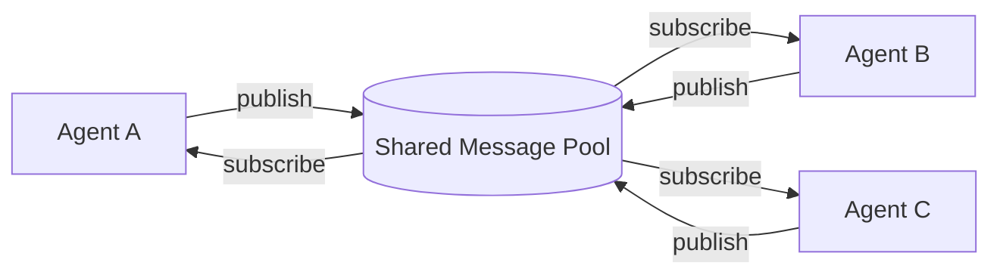
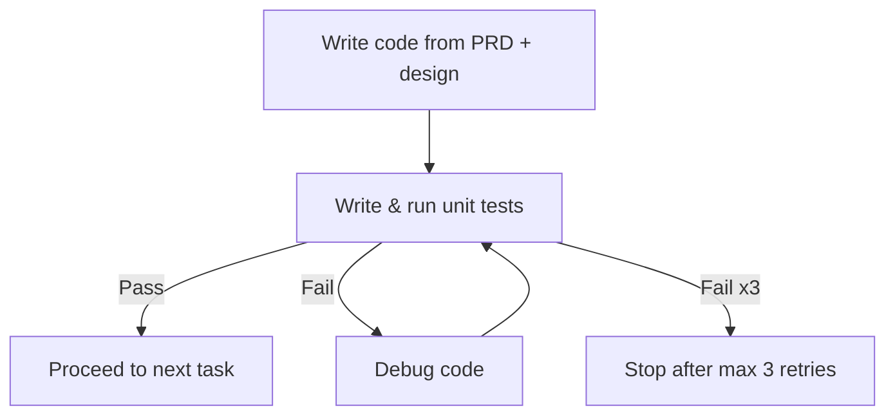
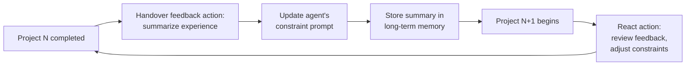
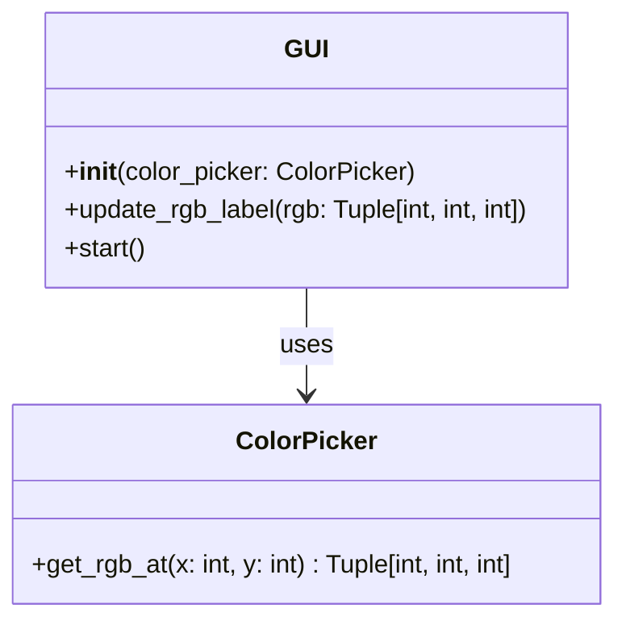
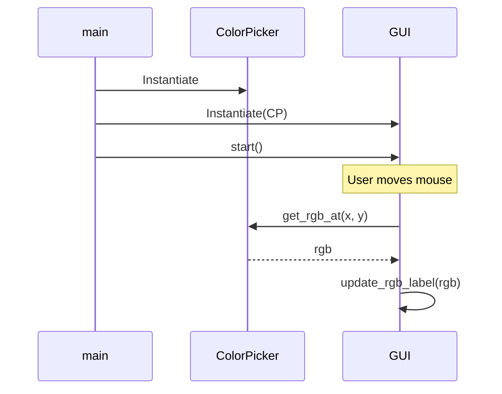
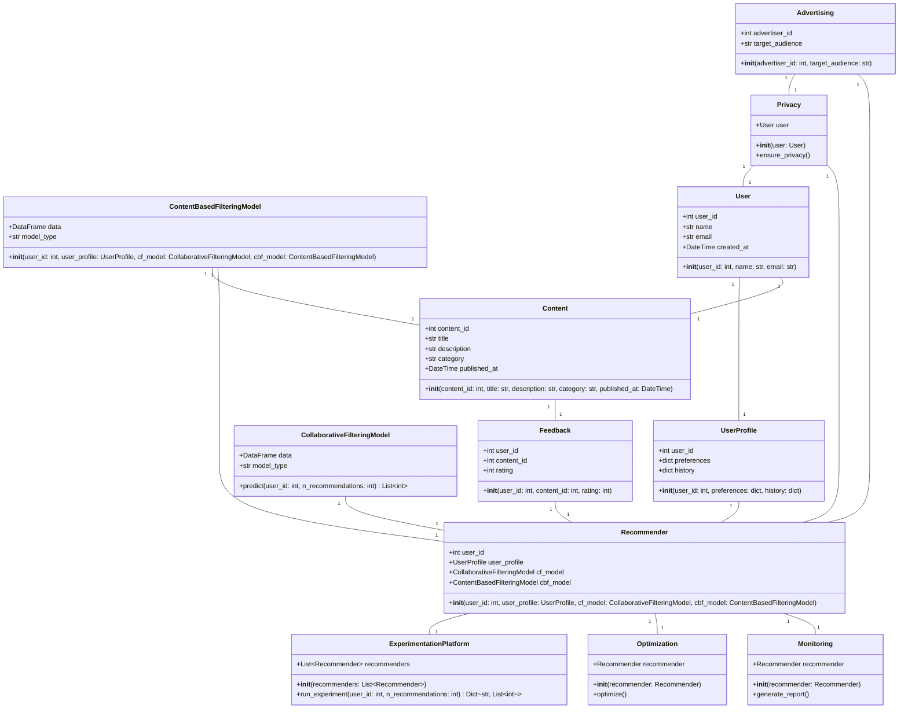
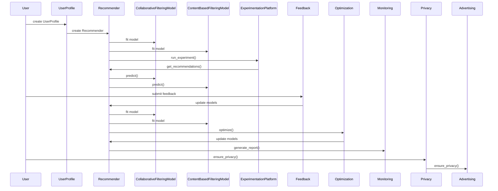

# MetaGPT: Meta Programming for a Multi-Agent Collaborative Framework

**Authors:** Sirui Hong¹\*, Mingchen Zhuge²\*, Jiaqi Chen¹, Xiawu Zheng³, Yuheng Cheng⁴, Ceyao Zhang⁴, Jinlin Wang¹, Zili Wang, Steven Ka Shing Yau⁵, Zijuan Lin⁴, Liyang Zhou⁶, Chenyu Ran¹, Lingfeng Xiao¹'⁷, Chenglin Wu¹†, Jürgen Schmidhuber²,⁸

**Affiliations:**
¹ DeepWisdom  
² AI Initiative, King Abdullah University of Science and Technology  
³ Xiamen University  
⁴ The Chinese University of Hong Kong, Shenzhen  
⁵ Nanjing University  
⁶ University of Pennsylvania  
⁷ University of California, Berkeley  
⁸ The Swiss AI Lab IDSIA/USI/SUPSI  

\* Equal contribution.  
† Corresponding author: Chenglin Wu (`alexanderwu@fuzhi.ai`), affiliated with DeepWisdom.

**Venue:** Published as a conference paper at ICLR 2024  
**Project:** https://github.com/geekan/MetaGPT

## 📌 Abstract

- LLM-based multi-agent systems can handle simple dialogue tasks, but complex tasks suffer from **logic inconsistencies** caused by cascading hallucinations from naive LLM chaining.
- **MetaGPT** is introduced as a meta-programming framework that embeds efficient human workflows into LLM-based multi-agent collaboration.
- Core mechanism: encodes **Standardized Operating Procedures (SOPs)** into prompt sequences, letting agents with human-like domain expertise verify intermediate results and cut down on errors.
- Uses an **assembly-line paradigm**: distinct roles are assigned to different agents, breaking complex tasks into subtasks handled collaboratively.
- On collaborative software engineering benchmarks, MetaGPT produces more coherent solutions than prior chat-based multi-agent systems.

---

## 1. Introduction

Autonomous LLM-based agents aim to enhance and replicate human workflows, but existing systems tend to oversimplify complexity and struggle with coherent, accurate, collaborative problem-solving.

> 🔬 **Key idea:** Humans rely on **Standardized Operating Procedures (SOPs)** to decompose tasks and coordinate teams. SOPs define role responsibilities and set standards for intermediate outputs — MetaGPT borrows this idea for multi-agent LLM systems.

Example given in the paper: in a software company, Product Managers analyze competition/user needs to write Product Requirement Documents (PRDs) in a standardized structure to guide development.

### Why SOPs matter for MetaGPT
- Requires agents to generate **structured outputs** (requirement docs, design artifacts, flowcharts, interface specs) rather than free-form chat.
- Structured intermediate outputs improve **consistency in communication**, reducing ambiguity/errors during collaboration.
- Reduces the risk of unproductive "idle chatter" hallucinations between role-playing agents — the paper humorously contrasts this with agents having pointless small talk like *"Hi, hello and how are you?"* vs *"Great! Have you had lunch?"*

### Meta-programming framing
- The paper defines **meta-programming** as "programming to program" ([Wikipedia](https://en.wikipedia.org/w/index.php?title=Metaprogramming)), distinct from the broader fields of meta-learning and "learning to learn" (Schmidhuber, 1987; 1993a; Hochreiter et al., 2001; Schmidhuber, 2006; Finn et al., 2017).
- Related meta-programming lineage: CodeBERT (Feng et al., 2020), CodeLlama (Rozière et al., 2023), and WizardCoder (Luo et al., 2023).
- MetaGPT's distinction: a well-organized group of **specialized agents**, each with a specific role/expertise following established standards, enabling automatic requirement analysis, system design, code generation, modification, execution, and runtime debugging.

### 📊 Headline Results
- Evaluated on **HumanEval** and **MBPP** code generation benchmarks.
- Achieves new **state-of-the-art (SoTA)**: **85.9%** (HumanEval) and **87.7%** (MBPP) Pass@1.
- Compared against AutoGPT, LangChain, AgentVerse, and ChatDev for complex software project generation — MetaGPT handles higher software complexity with more extensive functionality.
- Achieves a **100% task completion rate** in experimental evaluations, showing robustness and efficiency (time & token cost).

### Contributions Summary
1. Introduces MetaGPT — a meta-programming framework for LLM-based multi-agent collaboration, with well-defined role definition and message-sharing mechanisms.
2. Integrates human-like SOPs to reduce unproductive agent collaboration; introduces a novel **executive feedback mechanism** that debugs/executes code at runtime (+5.4% absolute improvement on MBPP).
3. Achieves SoTA on HumanEval and MBPP, validating MetaGPT as a promising framework for LLM-based multi-agent systems.

---

## 2. Related Work

### 🔬 Automatic Programming
- Roots trace back to 1969's "PROW" system (predicate calculus → algorithms → LISP).
- Later contributions from Balzer (1985) and Soloway (1986).
- Modern NLP-driven approaches have grown automatic programming into an industry (e.g., Microsoft Copilot).
- LLM-agent approaches advancing the field:
  - **ReAct** and **Reflexion** — use chain-of-thought prompting to generate reasoning trajectories and action plans, demonstrating effectiveness of ReAct-style reasoning loops.
  - **ToolFormer** and **ToolLLM** — agents learning to use external tools via simple APIs.
  - Closely related prior work (Li et al., 2023) proposes a role-play framework for programming via inter-agent communication; Qian et al. (2023) uses multiple agents for software development.
- ⚠️ **Gap identified:** prior works improved productivity but did not fully exploit structured-output workflows, limiting their ability to handle complex software engineering issues.

### 🔬 LLM-Based Multi-Agent Frameworks
- Growing interest across industry/academia in LLM-based autonomous agents.
- **Stable-Alignment** — builds instruction datasets via consensus on value judgments through sandboxed multi-agent interactions.
- **Generative Agents** (Park et al., 2023) — simulates a "town" of 25 agents to study language interaction, social understanding, and collective memory.
- **Natural Language-Based Society of Mind (NL-SoM)** — agents with different functions interact through multiple rounds of "mindstorms" to solve complex tasks.
- Other work (Cai et al., 2023) reduces cost by pairing large models as tool-makers with small models as tool-users.
- Some works address cooperation/competition in planning and strategy, or propose LLM-based economies.
- ⚠️ **Distinction from MetaGPT:** most of this line of work focuses on open-world human behavior simulation, whereas MetaGPT focuses on injecting human software-development practice into multi-agent frameworks.
- Known challenges in LLM-agent collaboration: **repeated instructions** and **infinite message loops**, which are especially problematic in task-oriented collaboration requiring consistent, mutually beneficial interaction — this motivates MetaGPT's SOP-based design.

---

## 3. MetaGPT: A Meta-Programming Framework

Three main components:
- **§3.1** Role specialization, workflow, and structured communication within SOPs.
- **§3.2** Communication protocol for efficient role communication (structured interfaces + publish-subscribe mechanism).
- **§3.3** Executable feedback — a self-correction mechanism improving runtime code generation quality.

### 3.1 Agents in Standard Operating Procedures

**Specialization of Roles**
- Complex work is broken into smaller tasks via unambiguous role specialization.
- MetaGPT defines **five roles** in its simulated software company:

| Role | Responsibility |
|---|---|
| Product Manager | Business-oriented analysis, writes PRD (Action: WritePRD) |
| Architect | Translates requirements into system design (file lists, data structures, interfaces) |
| Project Manager | Task distribution (Action: WriteTasks) |
| Engineer | Executes designated classes/functions; writes & debugs code |
| QA Engineer | Writes test cases, enforces code quality (Action: WriteCodeReview) |

- Each agent has a defined **profile**: name, profile/role, goal, and constraints, plus initialized context and skills.
  - Example: Product Manager can use web search tools; Engineer can execute code.
- All agents follow **ReAct-style behavior** (Yao et al., 2022): every agent monitors the environment (the shared message pool) for observations that trigger actions or assist task completion.

**Workflow across Agents**
- Roles + operational skills → basic workflows.
- MetaGPT follows the software-development SOP, enabling agents to work **sequentially**:
  1. Product Manager analyzes user requirements → writes detailed **PRD** (User Stories + Requirement Pool).
  2. PRD passed to **Architect** → produces system design (File Lists, Data Structures, Interface Definitions).
  3. System design passed to **Project Manager** → distributes tasks.
  4. **Engineers** execute designated classes/functions.
  5. **QA Engineer** writes test cases to enforce code quality.
  6. Final output: a complete software solution.


🖼️ **Figure 1:** Side-by-side comparison of the MetaGPT agent collaboration pipeline (Define → Design → Plan & Code → Test → Acceptance Check) against a human boss giving a one-line requirement ("Write a classic and simple Flappy Bird game") and later approving the finished product.

🖼️ **Figure 2 (left):** Diagram of the communication protocol — agents publish structured messages (with content, instruction, cause_by, sent_from, send_to fields) to a **shared message pool**; other agents subscribe to relevant messages based on their profile. Tools shown: web search tool, debugging tool, diagram tool.

🖼️ **Figure 2 (right):** Diagram of iterative programming with **executable feedback** — the Engineer agent (profile "Alex," goal: write elegant/readable/extensible/efficient PEP8-conformant code) writes code, executes it, and if errors occur, retrieves relevant past messages (PRD, System Design, Code) from memory to debug.

🖼️ **Figure 3:** Detailed schematic of the full software development process (2048 game example) showing Architect's program call flow diagrams and file list, Engineer's code output, Product Manager's product goals/user stories/competitive analysis (with a competitive quadrant chart), Project Manager's task list and logic analysis, and QA Engineer's code review — culminating in direct human interaction with the finished game.

### 3.2 Communication Protocol

**Structured Communication Interfaces**
- Most current LLM-based multi-agent frameworks rely on **unconstrained natural language** for communication.
- ⚠️ Open question the paper raises: is pure natural language communication sufficient for solving complex tasks? The paper draws an analogy to the "telephone game" (or [Chinese whispers](https://en.wikipedia.org/wiki/Chinese_whispers) where information distorts after several rounds) to motivate structured alternatives.

> 📌 **Key Point:** Free-form dialogue between agents degrades information over multiple rounds — so MetaGPT instead uses structured, role-specific outputs.

Drawing on human organizational structures, MetaGPT formalizes agent-to-agent communication with a defined **schema and format per role**, so each agent produces outputs tailored to its responsibilities.

- The **Architect** agent produces two structured deliverables:
  - A system interface design
  - A sequence flow diagram
- These artifacts capture module design and interaction order, and serve as key inputs for the **Engineer** role.
- Unlike ChatDev, which relies on dialogue, MetaGPT agents exchange **documents and diagrams** — structured outputs that reduce ambiguity and omission.

#### 🔬 Publish-Subscribe Mechanism

Efficient information sharing is central to multi-agent collaboration. Architects and Engineers, for example, frequently need to consult Product Requirement Documents (PRDs).

- Prior approaches exchanged this information one-to-one, which made the communication topology unwieldy and inefficient.
- MetaGPT's solution: a **shared global message pool** where every agent can publish and retrieve messages directly, without needing to query other agents and wait for replies.



⚠️ **Limitation:** Broadcasting all information to all agents risks information overload, since agents generally only need task-relevant content.

**Subscription mechanism:** to solve the overload problem, each agent subscribes to information relevant to its role profile rather than receiving everything.

- An agent's action only fires once all of its prerequisite dependencies have arrived.
- Example: the Architect primarily follows PRDs from the Product Manager, while output from the QA Engineer is comparatively low priority for that role.

---

### 3.3 Iterative Programming with Executable Feedback

Debugging and optimization are core to real-world programming, yet many prior multi-agent methods lack a genuine self-correction loop, resulting in code that ultimately fails to run.

- Earlier non-executable review/self-reflection approaches still struggled with **runtime correctness**, since LLM hallucination could cause errors to slip past a purely textual review.
- MetaGPT's fix: an **executable feedback mechanism** that lets the Engineer iteratively refine code using actual execution results.

**Workflow:**
1. Engineer writes code based on the PRD and design documents.
2. Engineer writes and runs unit tests against the code.
3. If tests pass → move on to the next development task.
4. If tests fail → debug the code and retry.
5. Loop continues until tests pass or a **maximum of 3 retries** is reached.



---

## 4. Experiments

### 4.1 Experimental Setting

**📊 Datasets**

| Dataset | Size | Description |
|---|---|---|
| HumanEval | 164 tasks | Handwritten programming problems with specs, descriptions, reference code, and tests |
| MBPP | 427 tasks | Python tasks covering core concepts/standard library, with descriptions, reference code, and automated tests |
| SoftwareDev (self-generated) | 70 tasks | Diverse, realistic software development tasks (mini-games, image processing, data visualization, etc.), focused on engineering rather than isolated functions |

For the comparison experiments, seven representative SoftwareDev tasks were sampled for evaluation.

**Evaluation Metrics**

- HumanEval / MBPP: the unbiased **Pass@k** metric is used to measure functional correctness of the top-k generated solutions:

$$\text{Pass@}k = \mathbb{E}_{\text{Problems}}\left[1 - \frac{\binom{n-c}{k}}{\binom{n}{k}}\right]$$

- SoftwareDev: evaluated through a mix of human judgment and statistical analysis across five dimensions:

| Metric | What it captures |
|---|---|
| (A) Executability | Human-rated code quality, 1 (non-functional) → 4 (flawless) |
| (B) Cost | Running time, token usage, and expense |
| (C) Code Statistics | Number of code files, lines per file, total lines |
| (D) Productivity | Tokens consumed per line of code (token usage ÷ lines of code) |
| (E) Human Revision Cost | Number of manual fixes needed (e.g. import errors, wrong class names, broken reference paths); each fix typically touches up to 3 lines |

**Baselines**

- Domain-specific code-generation LLMs: AlphaCode, Incoder, CodeGeeX, CodeGen, Codex, CodeT.
- General-purpose LLMs: PaLM, GPT-4.
- Some baseline numbers (e.g. Incoder, CodeGeeX) were taken from prior published work rather than re-run.
- Prompts for HumanEval/MBPP were slightly adjusted to fit Python-specific response formatting.
- On SoftwareDev, MetaGPT is compared against AutoGPT (Torantulino et al., 2023), LangChain (Chase, 2022) with Python [Read-Eval-Print Loop (REPL)](https://en.wikipedia.org/wiki/Read–eval–print_loop) tool, AgentVerse (Chen et al., 2023), and ChatDev (Qian et al., 2023).

---

### 4.2 Main Result

🖼️ **Figure 4:** Pass rates on the MBPP and HumanEval with a single attempt (Pass@1, %).

| Model / Framework | HumanEval (%) | MBPP (%) |
|---|---|---|
| AlphaCode (1.1B) | 17.1 | — |
| Incoder (6.7B) | 15.2 | 17.6 |
| CodeGeeX (13B) | 18.9 | 26.9 |
| CodeGeeX-Mono (16.1B) | 32.9 | 38.6 |
| PaLM Coder (540B) | 36.0 | 47.0 |
| Codex (175B) | 47.0 | 58.1 |
| Codex + CodeT | 65.8 | 67.7 |
| GPT-4 | 67.0 | — |
| MetaGPT (w/o Feedback) | 81.7 | 82.3 |
| **MetaGPT** | **85.9** | **87.7** |

> 📌 MetaGPT outperforms every prior method on both benchmarks, and its combination with GPT-4 produces a large jump over plain GPT-4's Pass@1.

On the harder **SoftwareDev** benchmark, MetaGPT also beats ChatDev on nearly every metric:

**Table 1 — Statistical analysis on SoftwareDev**

| Statistical Index | ChatDev | MetaGPT (w/o Feedback) | MetaGPT |
|---|---|---|---|
| (A) Executability | 2.25 | 3.67 | **3.75** |
| (B) Cost#1: Running Time (s) | 762 | **503** | 541 |
| (B) Cost#2: Token Usage | 19,292 | 24,613 | 31,255 |
| (C) Code Files | 1.9 | 4.6 | **5.1** |
| (C) Lines of Code per File | 40.8 | 42.3 | **49.3** |
| (C) Total Code Lines | 77.5 | 194.6 | **251.4** |
| (D) Productivity (tokens/line) | 248.9 | 126.5 | **124.3** |
| (E) Human Revision Cost | 2.5 | 2.25 | **0.83** |

Notable takeaways:

- Executability of **3.75** is very close to the maximum "flawless" score of 4.
- MetaGPT finishes faster than ChatDev (503–541s vs 762s).
- Despite using more total tokens than ChatDev, MetaGPT is far more token-efficient **per line of code** (124–127 tokens/line vs ChatDev's 249).
- Human revision effort drops sharply with MetaGPT, especially with the feedback mechanism enabled (0.83 vs 2.25–2.5).

🖼️ **Figure 5:** A grid of screenshots showing example software artifacts autonomously generated by MetaGPT — including a sentiment analysis tool, data analysis/visualization tools, small games, a music website, an Excel data processor, a CSV processor, and other utility apps.

---

### 4.3 Capabilities Analysis

Compared to AutoGPT, LangChain, AgentVerse, and ChatDev, MetaGPT supports a broader set of software-engineering-specific capabilities, driven by its **Standard Operating Procedures (SOPs)** — role specialization, structured communication, and a defined workflow.

**Table 2 — Capability comparison**

| Capability | AutoGPT | LangChain | AgentVerse | ChatDev | MetaGPT |
|---|:---:|:---:|:---:|:---:|:---:|
| PRD generation | ✗ | ✗ | ✗ | ✗ | ✅ |
| Technical design generation | ✗ | ✗ | ✗ | ✗ | ✅ |
| API interface generation | ✗ | ✗ | ✗ | ✗ | ✅ |
| Code generation | ✅ | ✅ | ✅ | ✅ | ✅ |
| Precompilation execution | ✗ | ✗ | ✗ | ✗ | ✅ |
| Role-based task management | ✗ | ✗ | ✗ | ✅ | ✅ |
| Code review | ✗ | ✗ | ✅ | ✅ | ✅ |

> Other frameworks could plausibly adopt SOP-style designs too — the authors compare this to how chain-of-thought prompting has been layered onto general LLMs.

---

### 4.4 Ablation Study

**🔬 Effectiveness of Roles**

Two tasks (code generation + statistics calculation) were used to test how adding roles beyond a lone Engineer affects output quality.

**Table 3 — Role ablation** (✅ = role included)

| Engineer | Product Manager | Architect | Project Manager | # Agents | Avg. Lines | Expense | Revisions | Executability |
|:---:|:---:|:---:|:---:|:---:|---:|---:|---:|---:|
| ✅ | ✗ | ✗ | ✗ | 1 | 83.0 | $0.915 | 10 | 1.0 |
| ✅ | ✅ | ✗ | ✗ | 2 | 112.0 | $1.059 | 6.5 | 2.0 |
| ✅ | ✅ | ✅ | ✗ | 3 | 143.0 | $1.204 | 4.0 | 2.5 |
| ✅ | ✅ | ✗ | ✅ | 3 | 205.0 | $1.251 | 3.5 | 2.0 |
| ✅ | ✅ | ✅ | ✅ | 4 | 191.0 | $1.385 | 2.5 | **4.0** |

- Removing all roles except Engineer produces non-functional code.
- Adding each additional role steadily improves both revision cost and executability.
- Costs rise only modestly as roles are added, while output quality improves substantially — supporting the value of role specialization.

**🔬 Effectiveness of the Executable Feedback Mechanism**

- Adding executable feedback raises Pass@1 by **+4.2%** (HumanEval) and **+5.4%** (MBPP).
- It also improves SoftwareDev executability (3.67 → 3.75) and cuts human revision cost (2.25 → 0.83).
- Additional quantitative detail is provided in [Table 4](#c2-additional-results) and [Table 9](#-additional-results--pure-metagpt-wo-feedback-on-softwaredev).

---

## 5. Conclusion

MetaGPT is a meta-programming framework that applies **Standard Operating Procedures (SOPs)** to multi-agent LLM systems, modeling a team of agents as a simulated software company — in the same spirit as prior simulated-society and simulated-agent work (e.g. generative agent towns, Voyager's Minecraft sandbox).

- Combines role specialization, workflow management, and efficient information sharing (message pools + subscriptions) into a flexible, portable multi-agent platform.
- Uses an executable feedback loop to improve code quality at runtime.
- Achieves state-of-the-art results across the benchmarks tested.
- The authors frame human-inspired SOPs as a promising direction for future multi-agent research, and position this work as an early step toward **regulating** LLM-based multi-agent frameworks (see also [Appendix A](#a-outlook)).

---

## Acknowledgement

We thank Sarah Salhi, the Executive Secretary of KAUST AI Initiative, and Yuhui Wang, Postdoctoral Fellow at the KAUST AI Initiative, for helping to polish some of the text. We would like to express our gratitude to Wenyi Wang, a PhD student at the KAUST AI Initiative, for providing comprehensive feedback on the paper and for helping to draft the outlook (Appendix A) with Mingchen. We also thank Zongze Xu, the vice president of DeepWisdom, for providing illustrative materials for AgentStore.

## Author Contributions

- **Sirui Hong** conducted most of the experiments and designed the executable feedback module. She also led the initial version of the write-up, supported by Ceyao Zhang, and also by Jinlin Wang and Zili Wang.
- **Mingchen Zhuge** designed the self-improvement module, discussed additional experiments, and led the current write-up.
- **Jiaqi Chen** helped with the MBPP experiments, outlined the methods section, and contributed to the current write-up.
- **Xiawu Zheng** provided valuable guidance, reviewed and edited the paper.
- **Yuheng Cheng** contributed to the evaluation metric design and HumanEval experiments.
- **Steven Ka Shing Yau, Zijuan Lin, Liyang Zhou, Lingfeng Xiao** helped with the MBPP experiments and comparisons to open-source baseline methods.
- **Chenyu Ran** created most of the illustrative figures.
- **Chenglin Wu** is the CEO of DeepWisdom, initiated MetaGPT, made the most significant code contributions to it, and advised this project.
- **Jürgen Schmidhuber**, Director of the AI Initiative at KAUST and Scientific Director of IDSIA, advised this project and helped with the write-up.

---

## 📚 References

- Elif Akata, Lion Schulz, Julian Coda-Forno, Seong Joon Oh, Matthias Bethge, and Eric Schulz. *Playing repeated games with large language models*. arXiv preprint, 2023.
- Jacob Austin, Augustus Odena, Maxwell Nye, Maarten Bosma, Henryk Michalewski, David Dohan, Ellen Jiang, Carrie Cai, Michael Terry, Quoc Le, and Charles Sutton. *Program synthesis with large language models*, 2021.
- Anton Bakhtin, Noam Brown, Emily Dinan, Gabriele Farina, Colin Flaherty, Daniel Fried, Andrew Goff, Jonathan Gray, Hengyuan Hu, et al. *Human-level play in the game of diplomacy by combining language models with strategic reasoning*. Science, 2022.
- Robert Balzer. *A 15 year perspective on automatic programming*. TSE, 1985.
- R. M. Belbin. *Team Roles at Work*. Routledge, 2012. URL https://books.google.co.uk/books?id=MHIQBAAAQBAJ.
- Tianle Cai, Xuezhi Wang, Tengyu Ma, Xinyun Chen, and Denny Zhou. *Large language models as tool makers*. arXiv preprint, 2023.
- Harrison Chase. *LangChain*. https://github.com/hwchase17/langchain, 2022.
- Bei Chen, Fengji Zhang, Anh Nguyen, Daoguang Zan, Zeqi Lin, Jian-Guang Lou, and Weizhu Chen. *CodeT: Code generation with generated tests*, 2022.
- Jiaqi Chen, Yuxian Jiang, Jiachen Lu, and Li Zhang. *S-agents: self-organizing agents in open-ended environment*. arXiv preprint, 2024.
- Mark Chen, Jerry Tworek, Heewoo Jun, Qiming Yuan, Henrique Ponde de Oliveira Pinto, Jared Kaplan, Harri Edwards, Yuri Burda, Nicholas Joseph, Greg Brockman, Alex Ray, Raul Puri, Gretchen Krueger, Michael Petrov, Heidy Khlaaf, Girish Sastry, Pamela Mishkin, Brooke Chan, Scott Gray, Nick Ryder, Mikhail Pavlov, Alethea Power, Lukasz Kaiser, Mohammad Bavarian, Clemens Winter, Philippe Tillet, Felipe Petroski Such, Dave Cummings, Matthias Plappert, Fotios Chantzis, Elizabeth Barnes, Ariel Herbert-Voss, William Hebgen Guss, Alex Nichol, Alex Paino, Nikolas Tezak, Jie Tang, Igor Babuschkin, Suchir Balaji, Shantanu Jain, William Saunders, Christopher Hesse, Andrew N. Carr, Jan Leike, Josh Achiam, Vedant Misra, Evan Morikawa, Alec Radford, Matthew Knight, Miles Brundage, Mira Murati, Katie Mayer, Peter Welinder, Bob McGrew, Dario Amodei, Sam McCandlish, Ilya Sutskever, and Wojciech Zaremba. *Evaluating large language models trained on code*, 2021a.

- Weize Chen, Yusheng Su, Jingwei Zuo, Cheng Yang, Chenfei Yuan, Chen Qian, Chi-Min Chan, Yujia Qin, Yaxi Lu, Ruobing Xie, Zhiyuan Liu, Maosong Sun, and Jie Zhou. *Agentverse: Facilitating multi-agent collaboration and exploring emergent behaviors in agents*, 2023.
- Xinyun Chen, Chang Liu, and Dawn Song. *Execution-guided neural program synthesis*. ICLR, 2018.
- Xinyun Chen, Dawn Song, and Yuandong Tian. *Latent execution for neural program synthesis beyond domain-specific languages*. NeurIPS, 2021b.
- Aakanksha Chowdhery et al. *PaLM: Scaling language modeling with pathways*, 2022.
- T. DeMarco and T.R. Lister. *Peopleware: Productive Projects and Teams*. Addison-Wesley, 2013.
- Yihong Dong, Xue Jiang, Zhi Jin, and Ge Li. *Self-collaboration code generation via ChatGPT*. arXiv preprint, 2023.
- Yilun Du, Shuang Li, Antonio Torralba, Joshua B. Tenenbaum, and Igor Mordatch. *Improving factuality and reasoning in language models through multiagent debate*, 2023.
- Yanai Elazar, Nora Kassner, Shauli Ravfogel, Abhilasha Ravichander, Eduard Hovy, Hinrich Schütze, and Yoav Goldberg. *Measuring and improving consistency in pretrained language models*. TACL, 2021.
- Zhangyin Feng et al. *CodeBERT: A pre-trained model for programming and natural languages*. arXiv preprint, 2020.
- Chrisantha Fernando, Dylan Banarse, Henryk Michalewski, Simon Osindero, and Tim Rocktäschel. *Promptbreeder: Self-referential self-improvement via prompt evolution*. arXiv preprint, 2023.
- Chelsea Finn, Pieter Abbeel, and Sergey Levine. *Model-agnostic meta-learning for fast adaptation of deep networks*. ICML, 2017.
- Daniel Fried et al. *InCoder: A generative model for code infilling and synthesis*. arXiv preprint, 2022.
- Irving John Good. *Speculations concerning the first ultraintelligent machine*. Adv. Comput., 1965.
- Rui Hao, Linmei Hu, Weijian Qi, Qingliu Wu, Yirui Zhang, and Liqiang Nie. *ChatLLM network: More brains, more intelligence*. arXiv preprint, 2023.
- S. Hochreiter, A. S. Younger, and P. R. Conwell. *Learning to learn using gradient descent*. ICANN, Springer, 2001, pp. 87–94.
- Sirui Hong et al. *Data interpreter: An LLM agent for data science*. arXiv:2402.18679, 2024.
- Xue Jiang, Yihong Dong, Lecheng Wang, Qiwei Shang, and Ge Li. *Self-planning code generation with large language model*. arXiv preprint, 2023.
- Guohao Li, Hasan Abed Al Kader Hammoud, Hani Itani, Dmitrii Khizbullin, and Bernard Ghanem. *CAMEL: Communicative agents for "mind" exploration of large scale language model society*. arXiv preprint, 2023.
- Yujia Li et al. *Competition-level code generation with AlphaCode*. Science, 2022.
- Tian Liang, Zhiwei He, Wenxiang Jiao, Xing Wang, Yan Wang, Rui Wang, Yujiu Yang, Zhaopeng Tu, and Shuming Shi. *Encouraging divergent thinking in large language models through multiagent debate*. arXiv preprint, 2023.
- Bill Yuchen Lin et al. *SwiftSage: A generative agent with fast and slow thinking for complex interactive tasks*. arXiv preprint, 2023.
- Ruibo Liu, Ruixin Yang, Chenyan Jia, Ge Zhang, Denny Zhou, Andrew M Dai, Diyi Yang, and Soroush Vosoughi. *Training socially aligned language models in simulated human society*. arXiv preprint, 2023a.
- Yuliang Liu et al. *ML-Bench: Large language models leverage open-source libraries for machine learning tasks*. arXiv:2311.09835, 2023b.
- Ziyang Luo et al. *WizardCoder: Empowering code large language models with Evol-Instruct*. arXiv preprint, 2023.
- Potsawee Manakul, Adian Liusie, and Mark JF Gales. *SelfCheckGPT: Zero-resource black-box hallucination detection for generative large language models*. arXiv preprint, 2023.
- Agile Manifesto. *Manifesto for agile software development*. Snowbird, UT, 2001.
- John McCarthy. *History of Lisp*. In *History of Programming Languages*, 1978.
- Niklas Muennighoff et al. *OctoPack: Instruction tuning code large language models*. arXiv:2308.07124, 2023.
- Ansong Ni, Srini Iyer, Dragomir Radev, Veselin Stoyanov, Wen-tau Yih, Sida Wang, and Xi Victoria Lin. *Lever: Learning to verify language-to-code generation with execution*. ICML, 2023.
- Erik Nijkamp et al. *CodeGen: An open large language model for code with multi-turn program synthesis*, 2023.
- OpenAI. *GPT-4 technical report*, 2023.
- Joon Sung Park, Joseph C O'Brien, Carrie J Cai, Meredith Ringel Morris, Percy Liang, and Michael S Bernstein. *Generative agents: Interactive simulacra of human behavior*. arXiv preprint, 2023.
- Chen Qian, Xin Cong, Cheng Yang, Weize Chen, Yusheng Su, Juyuan Xu, Zhiyuan Liu, and Maosong Sun. *Communicative agents for software development*, 2023.
- Yujia Qin et al. *ToolLLM: Facilitating large language models to master 16000+ real-world APIs*. arXiv:2307.16789, 2023.
- Baptiste Rozière et al. *Code Llama: Open foundation models for code*. arXiv preprint, 2023.
- Timo Schick, Jane Dwivedi-Yu, Roberto Dessì, Roberta Raileanu, Maria Lomeli, Luke Zettlemoyer, Nicola Cancedda, and Thomas Scialom. *Toolformer: Language models can teach themselves to use tools*. arXiv preprint, 2023.
- J. Schmidhuber. *A self-referential weight matrix*. ICANN, Springer, 1993a, pp. 446–451.
- J. Schmidhuber. *Gödel machines: self-referential universal problem solvers making provably optimal self-improvements*. Technical Report IDSIA-19-03, arXiv:cs.LO/0309048 v3, IDSIA, 2003.
- J. Schmidhuber. *Gödel machines: Fully self-referential optimal universal self-improvers*. In *Artificial General Intelligence*, Springer, 2006, pp. 199–226.
- J. Schmidhuber. *Ultimate cognition à la Gödel*. Cognitive Computation, 1(2):177–193, 2009.
- Jürgen Schmidhuber. *Evolutionary principles in self-referential learning, or on learning how to learn: the meta-meta-... hook*. PhD thesis, 1987.
- Jürgen Schmidhuber. *A 'self-referential' weight matrix*. ICANN, 1993b.
- Jürgen Schmidhuber. *On learning to think: Algorithmic information theory for novel combinations of reinforcement learning controllers and recurrent neural world models*. arXiv preprint, 2015.
- Jürgen Schmidhuber, Jieyu Zhao, and Nicol N Schraudolph. *Reinforcement learning with self-modifying policies*. In *Learning to Learn*, 1998.
- Noah Shinn, Beck Labash, and Ashwin Gopinath. *Reflexion: an autonomous agent with dynamic memory and self-reflection*. arXiv preprint, 2023.
- Marta Skreta, Naruki Yoshikawa, Sebastian Arellano-Rubach, Zhi Ji, Lasse Bjørn Kristensen, Kourosh Darvish, Alan Aspuru-Guzik, Florian Shkurti, and Animesh Garg. *Errors are useful prompts: Instruction guided task programming with verifier-assisted iterative prompting*. arXiv preprint, 2023.
- Elliot Soloway. *Learning to program = learning to construct mechanisms and explanations*. Communications of the ACM, 1986.
- Yashar Talebirad and Amirhossein Nadiri. *Multi-agent collaboration: Harnessing the power of intelligent LLM agents*, 2023.
- Xiangru Tang, Bill Qian, Rick Gao, Jiakang Chen, Xinyun Chen, and Mark Gerstein. *BioCoder: A benchmark for bioinformatics code generation with contextual pragmatic knowledge*. arXiv:2308.16458, 2023a.
- Xiangru Tang, Anni Zou, Zhuosheng Zhang, Yilun Zhao, Xingyao Zhang, Arman Cohan, and Mark Gerstein. *MedAgents: Large language models as collaborators for zero-shot medical reasoning*. arXiv:2311.10537, 2023b.
- Torantulino et al. *Auto-GPT*. https://github.com/Significant-Gravitas/Auto-GPT, 2023.
- R. J. Waldinger and R. C. T. Lee. *PROW: a step toward automatic program writing*. IJCAI, 1969.
- Guanzhi Wang, Yuqi Xie, Yunfan Jiang, Ajay Mandlekar, Chaowei Xiao, Yuke Zhu, Linxi Fan, and Anima Anandkumar. *Voyager: An open-ended embodied agent with large language models*. arXiv preprint, 2023a.
- Lei Wang et al. *A survey on large language model based autonomous agents*. arXiv preprint, 2023b.
- Xuezhi Wang, Jason Wei, Dale Schuurmans, Quoc Le, Ed Chi, Sharan Narang, Aakanksha Chowdhery, and Denny Zhou. *Self-consistency improves chain of thought reasoning in language models*. arXiv preprint, 2022.
- Zhenhailong Wang, Shaoguang Mao, Wenshan Wu, Tao Ge, Furu Wei, and Heng Ji. *Unleashing cognitive synergy in large language models: A task-solving agent through multi-persona self-collaboration*. arXiv preprint, 2023c.
- Jason Wei, Xuezhi Wang, Dale Schuurmans, Maarten Bosma, Fei Xia, Ed Chi, Quoc V Le, Denny Zhou, et al. *Chain-of-thought prompting elicits reasoning in large language models*. NeurIPS, 2022.
- Michael Wooldridge and Nicholas R. Jennings. *Pitfalls of agent-oriented development*. 2nd Intl. Conf. on Autonomous Agents, 1998.
- Shunyu Yao, Jeffrey Zhao, Dian Yu, Nan Du, Izhak Shafran, Karthik Narasimhan, and Yuan Cao. *ReAct: Synergizing reasoning and acting in language models*. arXiv preprint, 2022.
- Eric Zelikman, Eliana Lorch, Lester Mackey, and Adam Tauman Kalai. *Self-taught optimizer (STOP): Recursively self-improving code generation*. arXiv preprint, 2023.
- Hongxin Zhang, Weihua Du, Jiaming Shan, Qinhong Zhou, Yilun Du, Joshua B Tenenbaum, Tianmin Shu, and Chuang Gan. *Building cooperative embodied agents modularly with large language models*. arXiv preprint, 2023a.
- Zhuosheng Zhang et al. *Igniting language intelligence: The hitchhiker's guide from chain-of-thought reasoning to language agents*. arXiv:2311.11797, 2023b.
- Xufeng Zhao, Mengdi Li, Cornelius Weber, Muhammad Burhan Hafez, and Stefan Wermter. *Chat with the environment: Interactive multimodal perception using large language models*. arXiv preprint, 2023.
- Qinkai Zheng et al. *CodeGeeX: A pre-trained model for code generation with multilingual evaluations on HumanEval-X*, 2023.
- Shuyan Zhou, Frank F Xu, Hao Zhu, Xuhui Zhou, Robert Lo, Abishek Sridhar, Xianyi Cheng, Yonatan Bisk, Daniel Fried, Uri Alon, et al. *WebArena: A realistic web environment for building autonomous agents*. arXiv preprint, 2023a.
- Wangchunshu Zhou et al. *Agents: An open-source framework for autonomous language agents*. arXiv:2309.07870, 2023b.
- Mingchen Zhuge, Haozhe Liu, Francesco Faccio, Dylan R Ashley, Robert Csordás, Anand Gopalakrishnan, Abdullah Hamdi, Hasan Abed Al Kader Hammoud, Vincent Herrmann, Kazuki Irie, et al. *Mindstorms in natural language-based societies of mind*. arXiv preprint, 2023.

---

## Appendix A: Outlook

### A.1 Self-Improvement Mechanisms

> 📌 **Key Point:** The current MetaGPT implementation treats each software project independently — teams don't yet accumulate experience across projects.

Ideally, a software development team would learn from each completed project, becoming progressively more compatible and effective over time. This connects to the long-standing idea of **recursive self-improvement**:

- First proposed informally in 1965 (Good, 1965)
- First concrete implementations from 1987 onward (Schmidhuber, 1987; 1993b; Schmidhuber et al., 1998)
- Culminating in formal notions of mathematically optimal self-referential self-improvers (Schmidhuber, 2003; 2009)

The general principle: a system learns from real-world experience, meta-learns better learning algorithms from its learning experiences, and meta-meta-learns better meta-learning algorithms — recursively, bounded only by computability and physics.

More recent LLM-focused work applies this idea by recursively refining prompts to improve downstream task performance (Fernando et al., 2023; Zelikman et al., 2023), echoing the 2015 concept of an adaptive prompt engineer — one network learning to generate queries/prompts to help another network learn faster (Schmidhuber, 2015).

#### 🔬 Method: Self-Referential Constraint Updates in MetaGPT

The authors' initial implementation of a self-referential mechanism works as follows:

1. **Handover feedback action** — each agent critically summarizes information gathered during a completed project.
2. This summary is folded into an **updated constraint prompt** for that agent.
3. Summaries are stored in **long-term memory**, inheritable by future constraint updates.
4. At the start of a new project, each agent runs a **react action**, reviewing prior feedback and adjusting its constraint prompt accordingly.



> ⚠️ **Limitation:** These summary-based optimizations currently only adjust **role specialization constraints** (Sec. 3.1), not the **structured communication interfaces** defined in the communication protocols (Sec. 3.2). Extending self-improvement to protocol structure remains future work.

### A.2 Multi-Agent Economies

> 📌 **Key Point:** Real-world team collaboration procedures (SOPs) aren't fixed — they evolve dynamically. MetaGPT's current SOP is hardcoded.

One proposed mechanism for such self-organization is the **"Economy of Minds" (EOM)** framework, introduced in the *Natural Language-Based Society of Mind* (NLSOM) paper (Zhuge et al., 2023):

- Rather than optimizing total system reward via neural network parameter updates (as in standard RL), EOM applies **free-market supply-and-demand principles** to assign credit (money) to agents that contribute to economic success (reward).

#### 📊 Related Platform: AgentStore (DeepWisdom)

- Compatible with the EOM credit-assignment concept ([AgentStore](http://beta.deepwisdom.ai)).
- Each agent lists its **services with associated costs**.
- A convenient API lets human users or other agents **purchase services** from agents to accomplish tasks.
- Individual developers can build and contribute new agents, enabling **community-driven collaborative development**.
- Users can **subscribe to agents** based on their needs and pay according to usage, or purchase additional capabilities to expand plug-and-play functions and gradually upgrade agents.
- Within the MetaGPT framework, AgentStore supports multi-agent collaboration — users can combine multiple agents for complex projects, with all agents complying with MetaGPT development and communication protocols.

🖼️ **Figure 6:** AgentStore platform interface — dedicated to creating and developing agents within MetaGPT, providing an operational marketplace interface to manage agents with different emotions, personalities, and capabilities (e.g., Marvin Minsky, ML Engineer, Comic Artist, Tutorial Assistant, Equity Analyst). Panels include Conversations, Agents marketplace with filter tabs (Official Selection, Western Celebrity, Historical Figure, Movie & TV), and Celebrities' Planet.

> 📌 **Key Point:** AgentStore is positioned as an operational marketplace layer on top of MetaGPT, letting users manage agents with different emotions, personalities, and capabilities for specific tasks.

---

## Appendix B: A Demo of the Execution

This section walks through the complete MetaGPT software development process, starting from a user's input command and ending with software built to specification.

### B.1 User Input

Once MetaGPT receives an instruction, it collaborates with a simulated professional development team to complete the task.

**Example user input:**
```
write a python3 GUI app such that you can draw an image with it
```

### B.2 MetaGPT Development Process

A step-by-step account of the standardized output produced by each agent role follows.

#### 🧑‍💼 Product Manager

The Product Manager produces a **Product Requirement Document (PRD)** covering goals, user stories, competitive analysis, requirement analysis, and the requirement pool, plus a competitive quadrant chart (Figure 7). This is then passed to the architect for system design.

**Example PRD (for a color-meter app variant):**

- **Original Requirements:** A Python3 GUI color meter that outputs RGB values as it moves.
- **Product Goals:**
  1. Create a user-friendly GUI color meter
  2. Ensure the color meter accurately outputs RGB values
  3. Ensure the color meter updates RGB values in real-time as it moves
- **User Stories:**
  - As a user, I want to select any color on the screen, so I can get its RGB values
  - As a user, I want RGB values to update in real-time as I move the color meter
  - As a user, I want a simple, intuitive interface
- **Competitive Analysis:**

| Product | Strengths | Weaknesses |
|---|---|---|
| Color Cop | Simple, easy to use | No real-time RGB updates |
| Just Color Picker | Real-time picking, multiple formats | Cluttered interface |
| Instant Eyedropper | Convenient system-tray tool | Lacks advanced features |
| ColorZilla | Convenient for web design | Not suitable for desktop apps |
| ColorPic | Feature-rich (palettes, mixer) | Overwhelming for simple tasks |

🖼️ **Figure 7:** Quadrant chart titled "Reach and engagement of campaigns," plotting competitor tools (Corel Painter, Adobe Photoshop, Krita, SketchBook, GIMP, Paint.NET, MS Paint) and "Our Target Product" across axes of Reach (low→high) and Engagement (low→high), divided into quadrants: *Need to promote*, *We should expand*, *Re-evaluate*, *May be improved*.

**Full PRD text block:**

- **Requirement Analysis:** The product should be a Python3 GUI application serving as a color meter, allowing users to select any color on screen and view corresponding RGB values, updating in real time, with a simple and user-friendly interface.
- **Requirement Pool:**

| Requirement | Priority |
|---|---|
| Design a user-friendly GUI for the color meter | P0 |
| Implement color selection functionality | P0 |
| Display RGB values of the selected color | P0 |
| Update RGB values in real-time as the color meter moves | P0 |
| Test the application for accuracy and performance | P1 |

- **UI Design draft:** Minimalistic and intuitive — primarily a color meter (a magnified screen area the user can move), with prominently displayed, real-time-updating RGB values. Clean, uncluttered layout focused on functionality and ease of use.
- **Anything UNCLEAR:** None.

#### 🏗️ Architect

Based on the PRD, the Architect devises technical specifications — system architecture diagrams and interface definitions. It first sets the overarching technical trajectory, then designs the project's architecture (files, classes — Figure 8) and the sequence flow chart (Figure 9/12). This documentation then passes to the project manager for task allocation.

**System design output:**

- **Implementation approach:** Use Python's **Tkinter** for the GUI (standard, simple, powerful enough). Use **PIL/Pillow** to capture screen pixel data for color selection — moving the mouse retrieves RGB values under the cursor in real time. RGB values display via Tkinter's `Label` widget, updated in real time using Python's **threading** library. Testing performed with Python's **unittest** library.
- **Python package name:** `color_meter`
- **File list:**
  - `main.py`
  - `color_picker.py`
  - `gui.py`
  - `tests.py`
- **Anything UNCLEAR:** None — requirement is clear.

🖼️ **Figure 8 (converted to class diagram):**



**Figure 9 — program call flow (sequence diagram):**



#### 📋 Project Manager

The Project Manager breaks the project into a task list. Each code file is analyzed for its intended functionality and assigned as a separate task to Engineers.

**Tasks output:**

- **Required Python third-party packages:**
  - `tkinter==8.6`
  - `Pillow==8.3.1`
- **Required Other language third-party packages:** None.
- **Full API spec:** None — no APIs used in this project.
- **Logic Analysis:**

| File | Responsibility |
|---|---|
| `main.py` | Contains the main application loop and initializes all other components |
| `canvas.py` | Implements the drawing canvas, responds to mouse events, uses selected tool and color |
| `tools.py` | Implements the tool selection interface |
| `color_picker.py` | Implements the color selection interface |
| `file_manager.py` | Implements the file saving and opening functionality |

**Task list:**
```python
[
    "main.py",
    "canvas.py",
    "tools.py",
    "color_picker.py",
    "file_manager.py"
]
```

**Shared Knowledge**
```python
"""
The 'Tkinter' library is used for creating the GUI of the application. It provides various widgets
like frames and canvases which are used in this project.
The 'Pillow' library is used for handling image files. It is used in the 'file_manager.py' for
saving and opening image files.
The 'main.py' file is the entry point of the application. It initializes all the other components
and starts the application loop.
"""
```

**Anything UNCLEAR**
> The project requirements and implementation approach are clear. However, we need to ensure that all team members are familiar with the Tkinter and Pillow libraries. If not, they may need some time to learn these libraries before starting the development.

#### 🔧 Engineer Role

Given the provided file structure and function definitions, an Engineer agent requires only fundamental development skills to complete the development tasks. Due to the large number of files, only one auto-generated code file is presented here.

**Generated code (`color_picker.py`)**
```python
import tkinter as tk
from tkinter import colorchooser

class ColorPicker:
    def __init__(self, root: tk.Tk, color: str = 'black'):
        self.frame = tk.Frame(root)
        self.color = color

        self.color_button = tk.Button(self.frame, text='Color', command=self.select_color)
        self.color_button.pack(fill='x')

    def select_color(self):
        color = colorchooser.askcolor()[1]
        if color is not None:
            self.color = color

    def pack(self, **kwargs):
        self.frame.pack(**kwargs)

    def get_color(self):
        return self.color
```

#### 🧪 QA Engineer Role

Upon receiving the code output from the Engineer, the QA Engineer generates unit test code and reviews it to identify and fix any bugs, ensuring high-quality software.

**Generated Unit tests (`test.py`)**
```python
import unittest
import tkinter as tk
# You might want to move the ColorPicker class to another file, let's say color_picker.py
# from color_picker import ColorPicker

class TestColorPicker(unittest.TestCase):

    def setUp(self):
        self.root = tk.Tk()
        self.cp = ColorPicker(self.root)

    def tearDown(self):
        # This is important to close the tk window after tests
        self.root.destroy()

    def test_initial_color(self):
        # Test the default color during initialization
        self.assertEqual(self.cp.get_color(), 'black')

    def test_set_and_get_color(self):
        # Test setting a new color and retrieving it
        new_color = '#ffffff'  # white color
        self.cp.color = new_color
        self.assertEqual(self.cp.get_color(), new_color)


if __name__ == '__main__':
    unittest.main()
```

**Output:** MetaGPT generates a functional application named **"Drawing App"**.

🖼️ Figure 10: Screenshot of the generated "Drawing App" — a Tkinter window with a blank canvas, Save/Open/Color buttons, and Pencil/Brush/Eraser tools, alongside a separate color-picker window showing a color wheel, brightness slider, and OK/Cancel buttons.

---

## Appendix C: Experiments

### C.1 Details of the SoftwareDev Dataset

- The **SoftwareDev dataset** includes **70 diverse software development tasks**.
- [Table 8](#-softwaredev-dataset--example-tasks) displays names and detailed prompts for 11 of these tasks.
- The **first seven tasks** listed are used in the main experiments of this paper.

### C.2 Additional Results

#### 📊 Quantitative Results of MetaGPT

- MetaGPT achieves an **average score of 3.9**, surpassing ChatDev's score of **2.1** (Zhao et al., 2023 / Qian et al., 2023).
- General intelligent algorithms (AutoGPT, LangChain, AgentVerse) all score **1.0**, failing to generate executable code.
  - Generated code from these baselines is often short, lacks comprehensive logic, and fails to handle cross-file dependencies correctly.
- **Key gap in baselines:** AutoGPT, Langchain, and AgentVerse show robust general problem-solving but lack systematic requirement deconstruction — essential for complex system development.
- **MetaGPT's advantage:** simplifies transforming abstract requirements into detailed class/function designs via specialized division of labor and SOPs workflow.
- Compared to ChatDev, MetaGPT's **structured messaging and feedback mechanisms** reduce communication information loss and improve code execution.

**Table 4 — Executability Comparison**
*(Scale: 1 = complete failure, 2 = executable code, 3 = largely satisfies expected workflow, 4 = perfect match with expectations)*

| Task | AutoGPT | LangChain | AgentVerse | ChatDev | MetaGPT |
|---|---|---|---|---|---|
| Flappy bird | 1 | 1 | 1 | 2 | 3 |
| Tank battle game | 1 | 1 | 1 | 2 | 4 |
| 2048 game | 1 | 1 | 1 | 1 | 4 |
| Snake game | 1 | 1 | 1 | 3 | 4 |
| Brick breaker game | 1 | 1 | 1 | 1 | 4 |
| Excel data process | 1 | 1 | 1 | 4 | 4 |
| CRUD manage | 1 | 1 | 1 | 2 | 4 |
| **Average score** | **1.0** | **1.0** | **1.0** | **2.1** | **3.9** |

#### 🔬 MetaGPT w/o Executable Feedback

- [Table 9](#-additional-results--pure-metagpt-wo-feedback-on-softwaredev) presents performance of MetaGPT with **GPT-4 32K** on 11 SoftwareDev tasks, plus average across all 70 tasks.
- This version is the **basic version without the executable feedback mechanism**.

#### 🔬 MetaGPT with Different LLM Backends

- 5 SoftwareDev tasks were randomly selected to test **GPT-3.5** and **[Deepseek Coder 33B](https://deepseekcoder.github.io)** as backends.
- MetaGPT can complete tasks with these LLMs, but **GPT-4 yields superior performance**.

**Table 5 — Performance of MetaGPT Using Different LLM Backends**

| Model | Open source | Time (s) | # Lines | Executability | Revisions |
|---|---|---|---|---|---|
| MetaGPT (w/ GPT-3.5) | ✗ | 75.18 | 161.6 | 2.8 | 2.4 |
| MetaGPT (w/ GPT-4) | ✗ | 552.94 | 178.2 | 3.8 | 1.2 |
| MetaGPT (w/ Deepseek Coder 33B) | ✓ | 1186.20 | 120.2 | 1.4 | 2.6 |

#### 📌 Impact of Instruction Levels (High-level vs. Detailed Instructions)

**Question:** Does the level of detail in the initial human input significantly influence performance?

**Examples:**
1. **High-level prompt:** "Create a brick breaker game."
2. **Detailed prompt:** "Creating a brick breaker game. In a brick breaker game, the player typically controls a paddle at the bottom of the screen to bounce a ball towards a wall of bricks. The goal is to break all the bricks by hitting them with the ball."

5 tasks from SoftwareDev were selected, with detailed prompts constructed for comparison.

**Table 6 — Impact of Instruction Levels**
*(Executability scale: 1 = complete failure, 2 = runnable code, 3 = largely expected workflow, 4 = perfect match to expectations)*

| Model | # Word | Time (s) | Token usage | # Lines | Executability | Productivity | Revisions |
|---|---|---|---|---|---|---|---|
| High-level | 13.2 | 552.9 | 28384.2 | 178.2 | 3.8 | 163.8 | 1.2 |
| Detailed | 42.2 | 567.8 | 29657.0 | 257.0 | 4.0 | 118.0 | 1.6 |

> **Note:** $\text{Productivity} = \dfrac{\text{Token usage}}{\text{Total Code Lines}}$ — lower is better.

**Findings:**
- Detailed prompts lead to better software projects with **lower productivity ratios** due to clearer requirements and functions.
- Simple (high-level) inputs can still generate good-enough software using MetaGPT, with an executability rating of **3.8** — comparable to the detailed prompt scenario.

#### 🔬 GPT Variants on HumanEval Benchmark

- Baseline: GPT-4's **67% HumanEval score** (OpenAI, 2023).
- Experiments run **5 times** with `gpt-4-0613` and `gpt-3.5-turbo-0613` under three conditions:
  - **(A)** Direct OpenAI API call with the HumanEval prompt.
  - **(B)** OpenAI API call + regex parsing of code from the response.
  - **(C)** Additional system prompt added: *"You are an AI that only responds with Python code, NOT ENGLISH. You will be given a function signature and its docstring by the user. Write your full implementation (restate the function signature)."*
- **Finding:** GPT-4 is more sensitive to prompt design, code parsing, and post-processing on HumanEval. GPT-3.5-Turbo struggles to return correct completions without prompt engineering.

**Table 7 — Performance of GPT Models on HumanEval**
*(5 runs each)*

| Settings | Model | 1 | 2 | 3 | 4 | 5 | Avg. | Std. |
|---|---|---|---|---|---|---|---|---|
| A | gpt-4-0613 | 0.732 | 0.707 | 0.732 | 0.713 | 0.738 | 0.724 | 0.013 |
| A | gpt-3.5-turbo-0613 | 0.360 | 0.366 | 0.360 | 0.348 | 0.354 | 0.357 | 0.007 |
| B | gpt-4-0613 | 0.787 | 0.811 | 0.817 | 0.829 | 0.817 | 0.812 | 0.016 |
| B | gpt-3.5-turbo-0613 | 0.348 | 0.354 | 0.348 | 0.335 | 0.348 | 0.346 | 0.007 |
| C | gpt-4-0613 | 0.805 | 0.805 | 0.817 | 0.793 | 0.780 | 0.800 | 0.014 |
| C | gpt-3.5-turbo-0613 | 0.585 | 0.567 | 0.573 | 0.579 | 0.579 | 0.577 | 0.007 |

#### 🎨 Qualitative Results

- [Figure 11](#figure-11-system-interface-design) and [Figure 12](#figure-12-program-call-flow) illustrate the outcomes of the Architect agent's efforts to design a complex **recommender system**, showcasing comprehensive system interface design (class diagram) and program call flow (sequence diagram).
- Program call flow is essential for creating sophisticated automated systems, emphasizing the importance of this division of labor in developing an automated software framework.

---

## Appendix D: Limitation and Ethics Concerns

### D.1 Limitations

**System side:**
- Cannot fully cater to specific scenarios such as **UI and frontend**, since UI/multimodal agents/tools have not yet been incorporated.
- Despite generating the most code among comparable frameworks, it remains challenging to fulfill real-world applications' diverse and complex requirements.

**Human user side:**
- A key challenge is the ability to **interrupt the running process** of each agent, or set a starting checkpoint for each agent.

### D.2 Ethics Concerns

**Unemployment and Skill Obsolescence**
- MetaGPT enables more people to program using natural language, lowering the barrier to entry for engineers.
- Programming languages have historically evolved (punched cards → assembly → C → Java → Python → natural language), each step making humans more proficient and increasing demand for programming-related roles.
- Natural language programming may offer an easier learning curve, broadening accessibility.

**Transparency and Accountability**
- MetaGPT is open-source and facilitates interactive multi-agent communication via natural language.
- Humans can initiate, observe, and stop execution with full control.
- Real-time interpretation/operation is displayed on-screen and logged, ensuring transparency.
- Human engineers remain the users and are responsible for outcomes.

**Privacy and Data Security**
- MetaGPT operates **locally**, ensuring user data privacy/security, and does not collect user data.
- For third-party LLM interactions (e.g., OpenAI), users are encouraged to review the relevant privacy policies.
- An **open-source LLM backend option** is also provided.


### Figure 11: System Interface Design

🖼️ **Figure 11:** The system interface design (class diagram) for "recommendation engine development" generated by the *architect* agent.


 
### Figure 12: Program Call Flow

🖼️ **Figure 12:** The program call flow (sequence diagram) for "recommendation engine development" generated by the *architect* agent.



## Appendix E: More Discussions

### E.1 Deep-Seated Challenges

MetaGPT also alleviates or solves these deep-seated challenges with its unique designs:

**Use Context Efficiently**
Two sub-challenges are present:
1. **Unfolding short natural language descriptions accurately** — eliminating ambiguity from terse task specs.
2. **Maintaining information validity in lengthy contexts** — enabling LLMs to concentrate on relevant data without distraction.

**Reduce Hallucinations**
> Using LLMs to generate entire software programs faces **code hallucination** problems — including incomplete implementation of functions, missing dependencies, and potential undiscovered bugs, which may be more serious.

LLMs often struggle with software generation due to vague task definitions. Focusing on granular tasks like requirement analysis and package selection offers guided thinking, which LLMs lack in broad task solving.

### E.2 Information Overload

In MetaGPT, we use a global message pool and a subscription mechanism to address **"information overload,"** which refers to the problem of receiving excessive or irrelevant information. This issue is dependent on specific applications.

- **Global message pool** — streamlines communication and ensures efficiency.
- **Subscription mechanism** — filters out irrelevant contexts, enhancing the relevance and utility of the information received by each agent.

⚠️ This design is particularly crucial in software design scenarios and standard operating procedures (SOPs) where effective communication between agents is essential.

---

## 📊 SoftwareDev Dataset — Example Tasks

Table 8 displays the names and detailed prompts of 11 tasks within the 70-task SoftwareDev dataset. (The first seven tasks listed are used in the main experiments of this paper).

| Task ID | Task Name | Task Prompt |
|---|---|---|
| 0 | Snake game | Create a snake game. |
| 1 | Brick breaker game | Create a brick breaker game. |
| 2 | 2048 game | Create a 2048 game for the web. |
| 3 | Flappy bird game | Write p5.js code for Flappy Bird where you control a yellow bird continuously flying between a series of green pipes. The bird flaps every time you left click the mouse. If it falls to the ground or hits a pipe, you lose. This game goes on indefinitely until you lose; you get points the further you go. |
| 4 | Tank battle game | Create a tank battle game. |
| 5 | Excel data process | Write an excel data processing program based on streamlit and pandas. The screen first shows an excel file upload button. After the excel file is uploaded, use pandas to display its data content. The program is required to be concise, easy to maintain, and not over-designed. It uses streamlit to process web screen displays, and pandas is sufficient to process excel reading and display. Please make sure others can execute directly without introducing additional packages. |
| 6 | CRUD manage | Write a management program based on the crud addition, deletion, modification and query processing of the customer business entity. The customer needs to save this information: name, birthday, age, sex, and phone. The data is stored in `client.db`, and there is a judgement whether the customer table exists. If it doesn't, it needs to be created first. Querying is done by name; same for deleting. The program is required to be concise, easy to maintain, and not over-designed. The screen is realized through streamlit and sqlite — no need to introduce other additional packages. |
| 7 | Music transcriber | Develop a program to transcribe sheet music into a digital format; providing error-free transcribed symbolized sheet music intelligence from audio through signal processing involving pitch and time slicing then training a neural net to run Onset Detected CWT transforming scalograms to chromagrams decoded with Recursive Neural Network focused networks. |
| 8 | Custom press releases | Create custom press releases; develop a Python script that extracts relevant information about company news from external sources, such as social media; extract update interval database for recent changes. The program should create press releases with customizable options and export writings to PDFs, NYTimes API JSONs, media format styled with interlink internal fixed character-length metadata. |
| 9 | Gomoku game | Implement a Gomoku game using Python, incorporating an AI opponent with varying difficulty levels. |
| 10 | Weather dashboard | Create a Python program to develop an interactive weather dashboard. |

---

## 📊 Additional Results — Pure MetaGPT (w/o Feedback) on SoftwareDev

**Table 9:** Additional results of pure MetaGPT w/o feedback on SoftwareDev. Averages (Avg.) of 70 tasks are calculated and 10 randomly selected tasks are included. (`#` denotes "The number of", `ID` denotes "Task ID").

| ID | #Code Files | #Lines of Code | Lines/Code File | #Doc Files | #Lines of Doc | Lines/Doc File | #Prompt Tokens | #Completion Tokens | Time Cost (s) | Money Cost | Cost of Revision (Issues / Cost) | Code Executability |
|---|---|---|---|---|---|---|---|---|---|---|---|---|
| 0 | 5.00 | 196.00 | 39.20 | 3.00 | 210.00 | 70.00 | 24,087.00 | 6,157.00 | 582.04 | $1.09 | 1. TypeError | 4 |
| 1 | 6.00 | 191.00 | 31.83 | 3.00 | 230.00 | 76.67 | 32,517.00 | 6,238.00 | 566.30 | $1.35 | 1. TypeError | 4 |
| 2 | 3.00 | 198.00 | 66.00 | 3.00 | 235.00 | 78.33 | 21,934.00 | 6,316.00 | 553.11 | $1.04 | 1. lack `@app.route('/')` | 3 |
| 3 | 5.00 | 164.00 | 32.80 | 3.00 | 202.00 | 67.33 | 22,951.00 | 5,312.00 | 481.34 | $1.01 | 1. PNG file missing<br>2. Compile bug fixes | 2 |
| 4 | 6.00 | 203.00 | 33.83 | 3.00 | 210.00 | 70.00 | 30,087.00 | 6,567.00 | 599.58 | $1.30 | 1. PNG file missing<br>2. Compile bug fixes<br>3. `pygame.surface` not initialize | 3 |
| 5 | 6.00 | 219.00 | 36.50 | 3.00 | 294.00 | 96.00 | 35,590.00 | 7,336.00 | 585.10 | $1.51 | 1. dependency error<br>2. ModuleNotFoundError | 4 |
| 6 | 4.00 | 73.00 | 18.25 | 3.00 | 261.00 | 87.00 | 25,673.00 | 5,832.00 | 398.83 | $0.90 | 0 | 4 |
| 7 | 4.00 | 316.00 | 79.00 | 3.00 | 332.00 | 110.67 | 29,139.00 | 7,104.00 | 435.83 | $0.92 | 0 | 4 |
| 8 | 5.00 | 215.00 | 43.00 | 3.00 | 301.00 | 100.33 | 29,372.00 | 6,499.00 | 621.73 | $1.27 | 1. tensorflow version error<br>2. model training method not implement | 2 |
| 9 | 5.00 | 215.00 | 43.00 | 3.00 | 270.00 | 90.00 | 24,799.00 | 5,734.00 | 550.88 | $1.27 | 1. dependency error<br>2. URL 403 error | 3 |
| 10 | 3.00 | 93.00 | 31.00 | 3.00 | 254.00 | 84.67 | 24,109.00 | 5,363.00 | 438.50 | $0.92 | 1. dependency error<br>2. missing main func. | 4 |
| **Avg.** | **4.71** | **191.57** | **42.98** | **3.00** | **240.00** | **80.00** | **26,626.86** | **6,218.00** | **516.71** | **$1.12** | **0.51** *(only consider items scored 2, 3 or 4)* | **3.36** |
