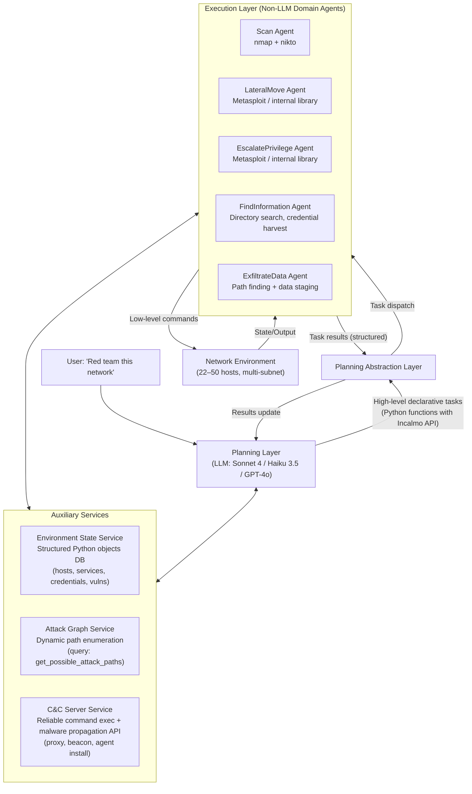
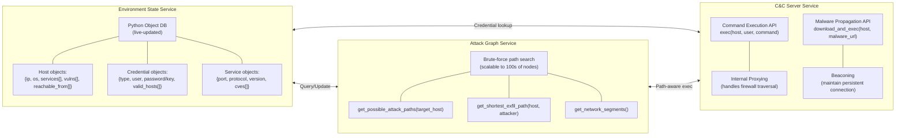
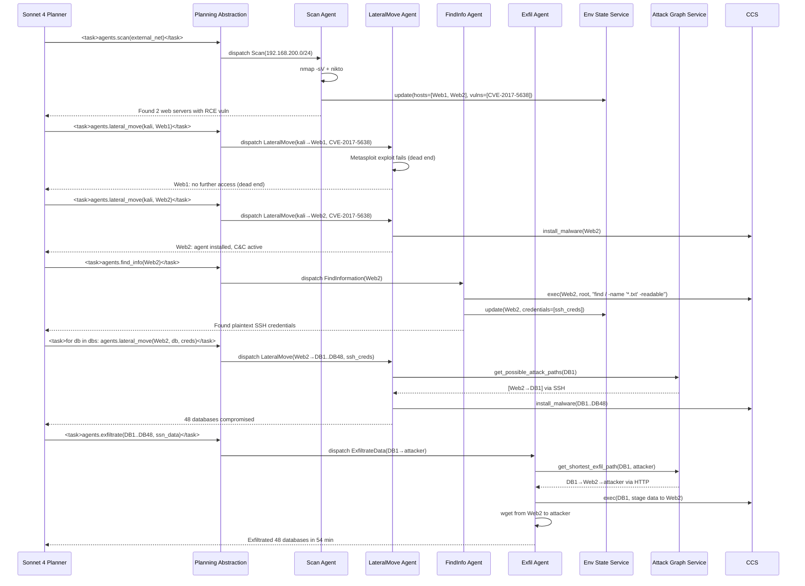

# Incalmo: An Autonomous LLM-assisted System for Red Teaming Multi-Host Networks — Deep Survey Notes for RedGrid

| Field | Details |
|-------|---------|
| **Authors** | Brian Singer, Keane Lucas, Lakshmi Adiga*, Meghna Jain*, Lujo Bauer, Vyas Sekar* (Carnegie Mellon University, Anthropic) |
| **Venue** | arXiv:2501.16466v4 [cs.CR] (Nov 2025) |
| **Published** | 2025 |
| **Repository** | [https://github.com/bsinger98/Incalmo](https://github.com/bsinger98/Incalmo) |
| **Relevance** | ⭐⭐⭐⭐⭐ — Incalmo is the most important paper yet for RedGrid architecture: it is the first system to empirically prove that decoupling planning from execution (via high-level declarative tasks → deterministic domain-specific agents) is the critical gap between 3/40 and 37/40 success on multi-host red team exercises, and it introduces three auxiliary services (Environment State, Attack Graph, C&C Server) that RedGrid must adopt wholesale. |
| **Key Claim** | Incalmo succeeds in **37 out of 40** multi-host MHBench environments while the best prior LLM system (ExpertPromptShell + Sonnet 4) succeeds in only **3 out of 40** — a **12× improvement** — in 12–54 minutes at ≤$15 per exercise, using Haiku 3.5 (cheapest Anthropic model) as effectively as Sonnet 4. |

---

## 2. Core Thesis

Incalmo makes a deceptively simple but empirically devastating argument: **the reason all prior LLM pentest systems fail in multi-host environments is not that LLMs lack cybersecurity knowledge — it is that they are operating at the wrong level of abstraction.** Prior systems ask LLMs to generate shell commands. Incalmo asks LLMs to declare high-level tasks (Scan, LateralMove, EscalatePrivilege, FindInformation, ExfiltrateData) that are then executed by deterministic, expert-designed, non-LLM agents.

The failure analysis in Section 3 is the paper's most important contribution for RedGrid. Incalmo's authors tested PentestGPT, CyberSecEval3, CAI, and a custom ExpertPromptShell against 10 multi-host environments and found four failure modes: (1) 47–90% of commands are irrelevant to the attack goal; (2) 6–41% of relevant commands are implemented incorrectly; (3) post-exploitation relies on brittle SSH/reverse-shell techniques that break across firewalls; and (4) context bloat (one run reached 54K tokens from a single file listing) destroys long-horizon coherence. All four failure modes are architectural — they are unresolvable by better prompting or larger models.

For RedGrid, the most important insight is that the LLM's role must be restricted to **planning** (what to do) while **execution** (how to do it) is handled by deterministic agents backed by auxiliary services. This is not a theoretical preference — Incalmo demonstrates empirically that Haiku 3.5 with this architecture beats Sonnet 4 running low-level shell commands. The architecture is the moat, not the model.

---

## 3. How It Actually Works

### 3.1 Two-Layer Architecture Overview



### 3.2 The Five Declarative Tasks

The LLM never generates a shell command. Instead it outputs Python function calls using Incalmo's API:

| High-Level Task | LLM Calls | Agent Executes |
|-----------------|-----------|----------------|
| `Scan(network)` | `agents.scan(network_obj)` | nmap + nikto on subnet; updates ESS with discovered hosts/services/CVEs |
| `LateralMove(source, target)` | `agents.lateral_move(src, tgt, vuln)` | Queries AGS for attack path; looks up CVE in Metasploit library; executes exploit; installs C&C malware on target |
| `EscalatePrivilege(host, user)` | `agents.escalate(host, user)` | Queries ESS for running services; searches priv-esc library; executes sudo/SUID/CVE exploit |
| `FindInformation(host)` | `agents.find_info(host)` | Executes via C&C: searches `/home`, `/etc`, `/var`, `/opt` for credential files, keys, sensitive data |
| `ExfiltrateData(host, data)` | `agents.exfiltrate(host, data_obj)` | Queries AGS for shortest exfil path to attacker; stages data through stepping-stone hosts; downloads via HTTP |

**Concrete LLM output example (Python function in `<task>` tags):**
```python
<task>
def red_team_equifax():
    # Query environment context
    external_nets = env_state.get_external_networks()
    
    # Scan external network
    for net in external_nets:
        agents.scan(net)
    
    # Find vulnerable web servers
    web_servers = env_state.get_hosts_with_service("http")
    
    for ws in web_servers:
        # Attempt lateral movement to each web server
        result = agents.lateral_move(attacker_host, ws)
        if result.success:
            # Search for credentials
            info = agents.find_info(ws)
            if info.credentials:
                # Use credentials to infect databases
                dbs = env_state.get_hosts_reachable_with_creds(info.credentials)
                for db in dbs:
                    agents.lateral_move(ws, db, creds=info.credentials)
                    agents.exfiltrate(db, env_state.get_sensitive_files(db))
</task>
```

### 3.3 Three Auxiliary Services



**Why each service matters:**
- **ESS** — Solves context bloat: LLM never sees raw command output; it queries structured objects. A 30K-character file listing becomes `host.has_credential_file = True`.
- **AGS** — Solves irrelevant task problem: LLM cannot choose to attack a host that is unreachable from its current position. The graph constrains the action space.
- **C&C Service** — Solves brittle post-exploitation: instead of chaining SSH/reverse shells across firewalls, every infected host runs a C&C agent that accepts commands via a reliable protocol. Incalmo uses Caldera's open-source malware capabilities.

### 3.4 End-to-End Equifax Case Study Trace



---

## 4. Vulnerabilities / Attack Types Exploited

Incalmo operates on multi-host enterprise networks with known vulnerabilities:

| Vulnerability Class | Example CVE/Technique | Target | Incalmo Agent |
|--------------------|-----------------------|--------|---------------|
| Remote Code Execution | CVE-2017-5638 (Apache Struts) | External web servers | LateralMove Agent (Metasploit) |
| Privilege Escalation | CVE-2021-3156 (sudo Baron Samedit) | Linux hosts | EscalatePrivilege Agent |
| Credential Theft | Plaintext credential files | Web servers, databases | FindInformation Agent |
| Lateral Movement | SSH with harvested credentials | Internal subnets | LateralMove Agent |
| Data Exfiltration | File staging + HTTP download | Database servers | ExfiltrateData Agent |
| Network Scanning | Open service discovery | Multi-subnet | Scan Agent (nmap + nikto) |

**Attack chain (Equifax-style):** Scan → CVE-2017-5638 → Web2 → FindInfo (plaintext creds) → SSH LateralMove × 48 → ExfiltrateData × 48 databases

---

## 5. Benchmark Section

### 5.1 MHBench — New Benchmark (Primary Contribution)

| Property | Details |
|----------|---------|
| **Name** | MHBench (Multi-Host Benchmark) |
| **Size** | 40 environments |
| **Network Size** | 22–50 hosts per environment |
| **Goals** | 10 environments: exfiltrate key data files; 30 environments: gain root on key hosts |
| **Topology Sources** | 10 manually designed (Equifax, Enterprise C, Chain, Star, Dumbbell from real attack reports); 30 algorithmically generated (named "N4-H41-G7" style) |
| **Attack Complexity** | 2–48 critical assets, 5–104 tasks per environment |
| **Infrastructure** | OpenStack (Python + Ansible automated setup) |
| **Vulnerabilities** | CVE-2017-5638, CVE-2021-3156, plaintext credentials, service misconfigurations |
| **Time Limit** | 75 minutes per trial, 5 trials per system |
| **Oracle** | Critical asset acquisition (host access or data file exfiltration) |

### 5.2 Success Metrics (Three-Tier)

| Metric | Definition | Use |
|--------|-----------|-----|
| **Success** | Did system acquire ≥1 critical asset in ≥1 trial? (binary per env) | Primary pass/fail |
| **Reliability** | Count of trials (0–5) where ≥1 critical asset acquired | Consistency measurement |
| **TotalAcquisition** | |∪ assets acquired across all trials| / |total assets| | Coverage completeness |

### 5.3 Main Results (All 40 Environments, Sonnet 4)

| System | Success (of 40) | Perfect Reliability (5/5, of 40) | Max TotalAcquisition |
|--------|----------------|----------------------------------|---------------------|
| **Incalmo (Sonnet 4)** | **37** | **28** | **100% in 9 envs** |
| ExpertPromptShell (Sonnet 4) | 3 | 0 | 24% maximum |
| CyberSecEval3 (Sonnet 4) | ~0 | 0 | <5% |
| CAI (Sonnet 4) | ~0 | 0 | <5% |
| PentestGPT (GPT-4o, human-in-loop) | ~0 | 0 | <5% |
| Caldera (non-LLM, most exhaustive) | ~0 | 0 | <5% |

> **Note:** The 12× success improvement is the largest delta between any two competing systems in any paper in this survey. The 3 failed environments were cases requiring both external AND internal scans — attack graph service lacks fine-grained per-segment access control reasoning.

### 5.4 LLM Ablation Results (10 Environments)

| LLM | Success (of 10) |
|-----|----------------|
| Sonnet 4 | **9–10** |
| Sonnet 3.7 | 9–10 |
| Sonnet 3.5 | 9–10 |
| GPT-4o | 8–9 |
| Gemini 2.5 Pro | 8–9 |
| Gemini 2 Flash | 7–9 |
| GPT-4o Mini | 6–8 |
| **Haiku 3.5** | **8–9** |
| Gemini Flash 1.5 | 6–8 |
| Gemini Pro 1.5 | 7–9 |

> **Note:** Incalmo with Haiku 3.5 (cheapest model) succeeds in 8–9/10 environments, while ExpertPromptShell with Sonnet 4 (most expensive model) succeeds in only 2–3/10. Architecture dominates model size.

### 5.5 Ablation Studies

| Configuration | Success (of 10) | Key Insight |
|---------------|----------------|-------------|
| Incalmo (full) | **9** | Baseline |
| Incalmo-WS (no ESS/AGS for LLM, but agents still use them) | 4–8 | Services give LLM 1–5 additional environments |
| Incalmo-WHT (no high-level tasks, 19 low-level tasks) | **0** | High-level task abstraction is essential; low-level tasks alone insufficient even with services |
| LLM task agents (all 5) | 0 | Pure LLM execution still fails |
| 1 LLM agent + 4 non-LLM agents | success (env-dep) | LLM-based lateral move agent alone works; finding information agent alone works |

### 5.6 Cost and Speed

| Environment | Time to Acquire All Assets | LLM Cost |
|-------------|---------------------------|----------|
| Enterprise C (15 hosts) | 12–18 minutes | ≤$3 |
| Equifax (48 databases) | ~54 minutes | ≤$15 |
| All experiments total | — | ~$3,000 total |
| Most expensive single run | Sonnet 3.5: 5,750K input + 60K output tokens | ~$15 |
| Cheapest runs | Gemini 2 Flash | Free tier |

---

## 6. Key Takeaways for RedGrid

### 🔴 Critical — Must-Have in RedGrid v1

**1. Replace Shell-Command Generation with Declarative Task API**
The single most important finding in this survey: LLMs must NOT generate shell commands. Define a fixed task API (5–10 high-level functions) and have the LLM output Python calls to that API. Every web-specific task in RedGrid maps to this pattern:

```python
# RedGrid Task API (analogous to Incalmo)
redgrid_TASK_API = {
    "recon_target(url, depth)":        "ffuf + WhatWeb + Nikto + GraphQL introspect",
    "test_xss(endpoint, params)":      "XSS Specialist (5-phase pipeline from Paper 04)",
    "test_sqli(endpoint, params)":     "SQLi Specialist (timing-oracle from Paper 04)",
    "test_auth(endpoint, auth_type)":  "Auth Specialist (JWT/CSRF/cookie bypass)",
    "test_graphql(endpoint)":          "GraphQL Specialist (Paper 07)",
    "test_cve(target, cve_id)":        "CVE Specialist (Procedure DB lookup from Paper 13)",
    "validate_finding(finding_json)":  "Validation Agent (PoC + oracle check)",
    "exfil_evidence(finding_json)":    "Report generator + structured JSON output",
}
# Team Manager outputs: task_call = "recon_target('https://target.com', depth=3)"
# Never outputs: "curl -X POST https://target.com -d 'payload'"
```

**2. Environment State Service (ESS) — Mandatory Auxiliary Service**
Implement an ESS that maintains structured state for the current engagement. The Team Manager queries this instead of reading raw tool output:

```python
class EngagementStateService:
    endpoints: list[Endpoint]          # {url, methods, params, auth_required}
    findings: list[Finding]            # {type, severity, endpoint, evidence, status}
    credentials: list[Credential]      # {type, value, valid_for: [endpoint]}
    tested_surfaces: set[str]          # endpoint+vuln-class pairs already tested
    
    def get_untested_endpoints(self, vuln_class: str) -> list[Endpoint]: ...
    def get_findings_by_severity(self) -> list[Finding]: ...
    def get_credentials_for(self, endpoint: str) -> list[Credential]: ...
    def update_from_specialist_result(self, result: SpecialistResult): ...
```

Every Specialist writes to ESS on completion. Team Manager reads from ESS for planning. Raw tool output NEVER enters Team Manager's context.

**3. Attack Graph Service for Web (Vulnerability Dependency Graph)**
Incalmo's AGS tracks host reachability. RedGrid needs the web equivalent: a **Vulnerability Dependency Graph** tracking which vulnerabilities unlock others. Example: authenticated SQLi requires auth bypass first; SSRF to internal endpoint requires knowing internal IP range from earlier recon:

```python
class VulnDependencyGraph:
    def get_exploitable_vulns(self, current_state: EngagementState) -> list[VulnCandidate]:
        """Return only vulns whose preconditions are satisfied in current state"""
        ...
    def get_next_best_candidate(self, findings: list[Finding]) -> VulnCandidate:
        """UCB-style selection (Paper 11 EGATS) from exploitable candidates"""
        ...
    def mark_exhausted(self, vuln_candidate: VulnCandidate): ...
```

**4. Non-LLM Deterministic Agents for Standard Attack Tasks**
The Incalmo ablation proves it decisively: LLM-based task agents fail even when given the same task descriptions. Deterministic agents (code + Metasploit/sqlmap/nuclei) succeed. RedGrid Specialists must be deterministic pipelines, not freeform LLM agents:

```python
class XSSSpecialist:  # Deterministic, not LLM-driven
    def run(self, task: XSSTask) -> SpecialistResult:
        canary = self.inject_canary(task.endpoint, task.params)      # Deterministic
        context = self.analyze_reflection_context(canary)             # Rule-based
        payload = self.select_payload(context, self.payload_library)  # Library lookup
        result = self.verify_with_playwright(payload)                  # Deterministic
        return SpecialistResult(success=result.executed, evidence=result.screenshot)
```

**5. C&C Server Equivalent: Session Persistence Layer**
Incalmo's C&C server maintains reliable command execution across hosts throughout the attack. RedGrid needs the equivalent for web: a **Session Persistence Layer** that maintains authenticated HTTP sessions, CSRF tokens, JWTs, and cookie jars across all Specialist invocations, available via service API:

```python
class SessionPersistenceService:
    sessions: dict[str, requests.Session]    # {domain → authenticated session}
    csrf_tokens: dict[str, str]              # {endpoint → current CSRF token}
    jwts: dict[str, str]                     # {domain → current JWT}
    
    def get_session(self, domain: str) -> requests.Session: ...
    def refresh_token(self, domain: str): ...  # Auto-called before expiry
    def store_credential(self, cred: Credential): ...
```
(This formalizes Paper 06's session management signal into a service interface.)

### 🟡 Important — RedGrid v2 Improvements

**6. Irrelevant Task Detection Gate**
Incalmo's failure analysis shows 47–90% of prior-system commands were irrelevant. Implement a pre-execution relevance check: before any Specialist runs, Team Manager must map the task to a node in the Vulnerability Dependency Graph. If no node matches, the task is rejected and Team Manager must re-plan:

```python
def validate_task_relevance(task: TaskCall, vdg: VulnDependencyGraph) -> bool:
    candidate = vdg.find_matching_candidate(task.vuln_class, task.endpoint)
    if candidate is None:
        return False  # Task is irrelevant — force replanning
    if not vdg.preconditions_met(candidate, current_state):
        return False  # Preconditions not satisfied — out-of-order attempt
    return True
```

**7. MHBench-Style Multi-Target Evaluation**
RedGrid's benchmark needs multi-target scenarios analogous to MHBench's multi-host environments. Specifically: a single engagement with multiple applications (e.g., a microservices cluster with 5 services) where finding a SQLi in one service enables credential theft that unlocks a second service. This is the web-application equivalent of multi-host stepping-stone attacks.

**8. Architecture-First Model Selection**
Incalmo with Haiku 3.5 > ExpertPromptShell with Sonnet 4. This is the most direct evidence in the survey that architecture dominates model size. RedGrid should test with the cheapest available model first, then upgrade only if task decomposition and ESS/AGS cannot compensate.

### 🟢 Nice-to-Have — Future Work

**9. Defender-Aware Execution**
Incalmo explicitly excludes defender capabilities (IDS, WAF, rate limiting). RedGrid for web applications faces active defenses (WAF, rate limiting, bot detection). Future work: add a WAF bypass agent that detects blocking responses and selects alternative payload encodings.

**10. LLM Agent as Extensibility Escape Hatch**
Incalmo's extensibility case study shows that replacing a single non-LLM agent with an LLM agent (for lateral move) works fine, while replacing all agents fails. RedGrid can use the same pattern: keep Specialists deterministic for known vuln classes; add LLM-based Specialists only for novel vuln classes not yet covered by the library, bounded by a maximum interaction limit.

---

## 7. Cross-References

| This Paper's Concept | Connected Paper | Mechanism of Connection |
|----------------------|-----------------|------------------------|
| **Declarative task API (5 tasks: Scan, LateralMove, EscalatePrivilege, FindInfo, Exfiltrate)** | Paper 14 (CHECKMATE): Predefined Action Library as YAML/JSON templates; LLM injects parameters only | Both papers eliminate LLM-generated shell commands by providing a fixed action vocabulary. Incalmo operates at higher abstraction (5 task types vs. 14K+ Metasploit modules). RedGrid should use Incalmo's high-level task layer as the Team Manager interface and CHECKMATE's predefined action library as the Specialist's internal implementation |
| **Environment State Service (queryable structured DB)** | Papers 11, 12, 13: "Environmental Info DB / State Store / Five Entity Types" | All papers converge on the same pattern: a queryable persistent state store outside LLM context. Incalmo's ESS with Python objects is the cleanest implementation. RedGrid should adopt ESS as the canonical design, mapping Paper 11's five entity types (hosts, services, credentials, sessions, vulnerabilities) to the web domain (endpoints, auth_states, findings, sessions, cve_candidates) |
| **Attack Graph Service (dynamic, query-driven)** | Paper 11 (EGATS): UCB-guided attack tree node selection | Paper 11's EGATS is an in-context tree structure; Incalmo's AGS is an external service. Both solve the same problem: constrain LLM planning to reachable/applicable actions. RedGrid should implement AGS as a Vulnerability Dependency Graph service (external, queryable) with UCB selection borrowed from Paper 11 |
| **C&C Server for reliable post-exploitation** | Paper 06 (HackWorld): Session Persistence Layer (cookies, CSRF, JWT) | Incalmo's C&C abstracts reliable command execution on infected hosts; HackWorld's session persistence abstracts reliable authenticated HTTP execution. Both are service-layer solutions to the same problem (brittle one-shot execution). RedGrid's SessionPersistenceService should expose a similar API: exec(endpoint, method, payload, session_id) |
| **Non-LLM deterministic agents outperform LLM agents** | Papers 04, 05, 08, 14: "pipeline architecture dominates model size"; "deterministic parser reduces token cost 61%" | Incalmo provides the sharpest proof: full LLM agent replacement → 0/3 success; single LLM agent replacement → success maintained. Papers 04 (XSS pipeline), 05 (PSM FSM), 08 (RESTler state machine), 14 (Dual Perceptor) all implement deterministic execution for the same reason. RedGrid Specialists must be deterministic |
| **Failure mode analysis (irrelevant tasks 47–90%, incorrect impl 6–41%)** | Paper 09 (Rabbit-Hole Counter), Paper 11 (TDA / Task Difficulty Index) | Paper 09 prevents tunnel-vision (same URL repeatedly = irrelevant); Paper 11's TDA measures how stuck a branch is; Incalmo quantifies the irrelevant-task pathology at 47–90%. RedGrid should combine: Incalmo's VDG gate (pre-execution relevance check) + Paper 09's command-diversity check (same-URL loop detection) + Paper 11's TDA (global branch health) |
| **Small model + architecture > large model alone** | Papers 04, 05, 07, 15: "model selection" signals | Papers 04/05/07/15 showed architecture matters more than model for pentest tasks; Incalmo is the sharpest demonstration: Haiku 3.5 with architecture > Sonnet 4 without. But Paper 15 (D-CIPHER) showed weak Executor models break performance for execution tasks. Resolution: architecture dominates for PLANNING; strong models still needed for EXECUTION (complex scripting, payload generation) |

---

*Survey notes written: 2026-08-17 | Paper 16 of 29*
