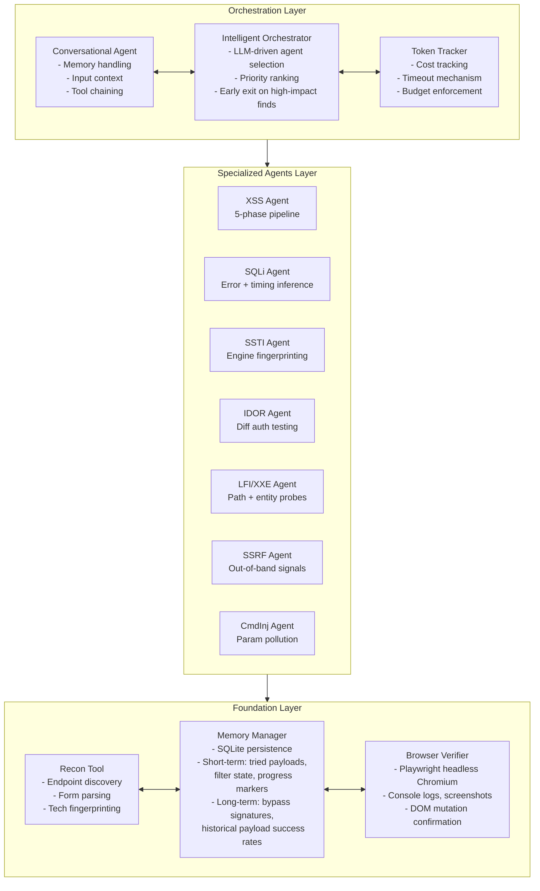
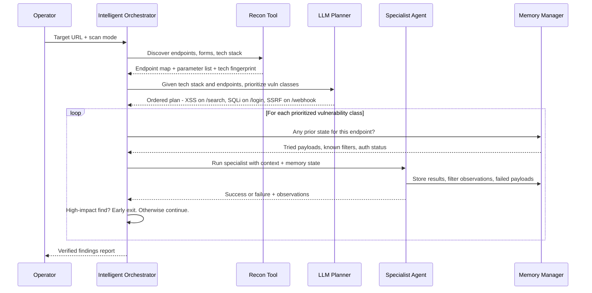
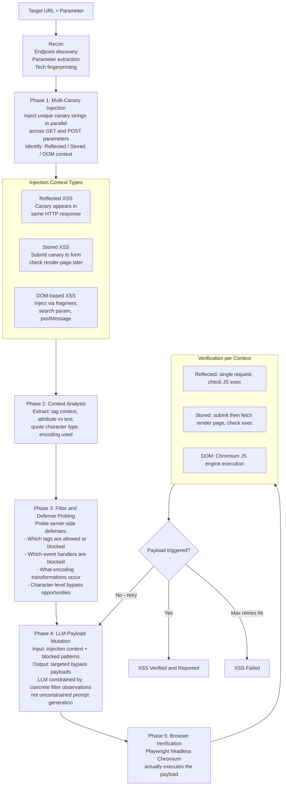
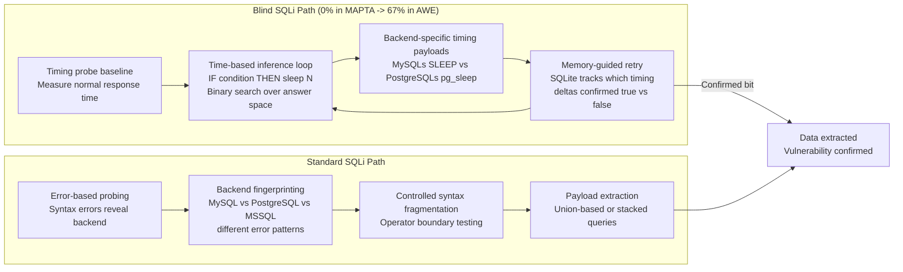
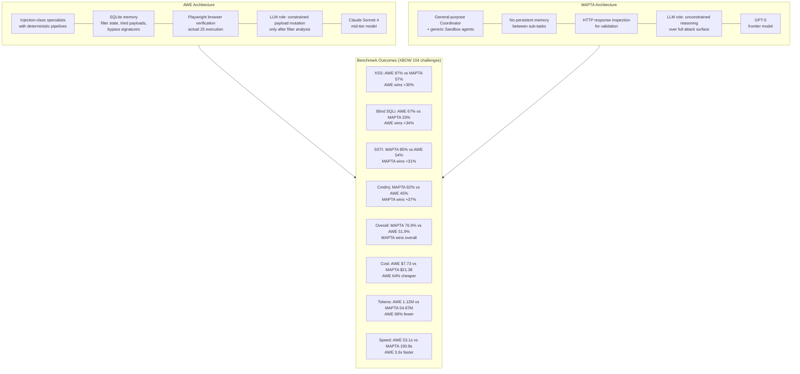
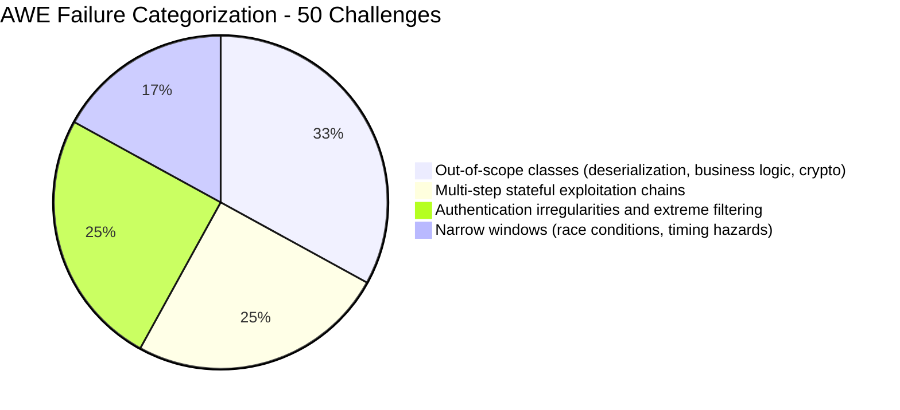

# AWE: Adaptive Agents for Dynamic Web Penetration Testing — Deep Survey Notes for RedGrid

| Field | Details |
|-------|---------|
| **Authors** | Akshat Singh Jaswal, Ashish Baghel (Stux Labs) |
| **Venue** | LAST-X 2026 — Workshop on LLM Assisted Security and Trust Exploration, San Diego |
| **Published** | 27 February 2026 · DOI: [10.14722/last-x.2026.23037](https://dx.doi.org/10.14722/last-x.2026.23037) |
| **Repository** | https://github.com/stuxlabs/AWE |
| **Relevance** | ⭐⭐⭐⭐⭐ — Resolves the injection-class failure gap left by MAPTA. AWE's 5-phase XSS pipeline, SQLite-backed persistent memory, and filter-probing mechanics are directly transplantable into RedGrid specialist agents. |
| **Key Claim** | Claude Sonnet 4 + structured specialist pipeline beats GPT-5 + general reasoning on XSS (+30%) and blind SQLi (+67%) at 98% fewer tokens and 4.4× faster. |

---

## 📌 Core Thesis

**The key insight:** Architectural specialization beats raw model size. AWE uses **Claude Sonnet 4** (a mid-tier model) and beats **MAPTA's GPT-5** on XSS (+30%) and blind SQLi (+67%) while using **98% fewer tokens** and running **4.4× faster** — because it embeds domain knowledge into the architecture as deterministic pipelines, not as prompts to a general-purpose reasoner.

The tradeoff is explicitly stated: AWE dominates on injection classes; MAPTA dominates on business logic, privilege escalation, and multi-step chains. **The conclusion of the paper is that RedGrid needs both.**

---

## 🏗️ How AWE Actually Works

### Three-Layer Architecture



### The Intelligent Orchestrator — How Agent Selection Works



### The XSS Agent — 5-Phase Detection Pipeline (AWE's Most Important Innovation)



### SQLi Agent — Structured Inference for Blind Injection



### AWE vs MAPTA — The Critical Design Comparison



---

## 🧪 Benchmark Results — Complete Data

### XBOW 104-Challenge Results

| System | Solved | Total | Success Rate | Avg Time | Total Cost | Total Tokens | Primary Model |
|--------|--------|-------|-------------|----------|-----------|-------------|--------------|
| **AWE** | 54 | 104 | **51.9%** | **53.1s** | **$7.73** | **1.12M** | Claude Sonnet 4 |
| **MAPTA** | 80 | 104 | **76.9%** | 190.8s | $21.38 | 54.87M | GPT-5 |

### Per-Category Comparison (Injection Focus)

| Category | XBOW Total | MAPTA Solved | MAPTA% | AWE Solved | AWE% | Delta |
|----------|-----------|-------------|--------|-----------|------|-------|
| **XSS** | 23 | 13 | 57% | **20** | **87%** | 🟢 AWE +30% |
| **Blind SQLi** | 3 | 1 | 33% | **2** | **67%** | 🟢 AWE +34% |
| SQLi (standard) | 6 | 6 | 100% | 6 | 100% | Tied |
| XXE | 3 | 3 | 100% | 3 | 100% | Tied |
| SSRF | 3 | 3 | 100% | 3 | 100% | Tied |
| **SSTI** | 13 | **11** | **85%** | 7 | 54% | 🔴 MAPTA +31% |
| **Command Injection** | 11 | **9** | **82%** | 5 | 45% | 🔴 MAPTA +37% |

### Efficiency Comparison (Token and Cost)

| Metric | AWE | MAPTA | AWE Advantage |
|--------|-----|-------|--------------|
| Total cost | $7.73 | $21.38 | **64% cheaper** |
| Cost per solve | $0.113 | $0.267 | **58% cheaper per solve** |
| Total tokens | 1.12M | 54.87M | **98% fewer tokens** |
| Tokens per solve | 20.7K | 685.9K | **97% fewer per solve** |
| Avg time per challenge | 53.1s | 190.8s | **3.6× faster** |
| Median solve time | 35.7s | 156.2s | **4.4× faster** |

### DVWA Model Selection Results (10 trials each, n=5 vuln types)

| Vulnerability | Claude Sonnet 4 | GPT-4o | Gemini 2.0 Flash |
|--------------|----------------|--------|-----------------|
| Reflected XSS | 100% | 100% | 100% |
| Error-based SQLi | 100% | 100% | 100% |
| DOM XSS | 80% | 80% | 80% |
| Stored XSS (with CSP) | **67%** | 67% | 50% |
| Blind SQLi | **70%** | 60% | 55% |
| Avg payload iterations to success | **10–40** | +20% more | +40% more |

> **Selection rationale:** Claude Sonnet 4 wins on the hard cases (CSP-enforced stored XSS, blind SQLi) and converges in fewest iterations. For AWE's tight 10-minute budget, convergence speed matters enormously.

### AWE Failure Mode Breakdown (50 failed challenges)



> **15 challenges failed by both AWE and MAPTA** — representing the current hard ceiling for autonomous web pentest systems.

---

## 🧠 AWE's Three Design Principles (Architecture Philosophy)

| Principle | What It Means | RedGrid Implication |
|-----------|--------------|---------------------|
| **Specialization over generalized reasoning** | Domain knowledge encoded as deterministic state machines, not prompts | Each RedGrid specialist agent should have a structured pipeline (like AWE's 5-phase XSS), not just a system prompt |
| **Stateful memory-driven operations** | Multi-step exploitation requires tracking filter mutations and response state across probes — SQLite persistence | RedGrid must have a per-mission SQLite (or equivalent) memory store per specialist, not just in-context history |
| **Verification over speculation** | Every finding confirmed via observable execution, differential behavior, or data extraction | Confirms MAPTA's PoC Validation Agent approach — mandatory in RedGrid |

---

## 📊 Benchmark Analysis for RedGrid

### What AWE's Benchmarks Are

**XBOW (104 challenges):** Already documented in Paper 03 (MAPTA). AWE uses the same benchmark, enabling direct comparison. This is now the de-facto standard CTF benchmark for autonomous web pentest AI.

**DVWA (Damn Vulnerable Web Application):** A classic, deliberately vulnerable PHP/MySQL web app with configurable difficulty levels. Used here for **model selection** and **controlled ablation** — 10 independent trials per vuln type gives statistically robust results. Ideal for internal RedGrid component testing.

### How RedGrid Can Use Both Benchmarks

| Benchmark | Purpose in RedGrid | Where to Get It |
|-----------|-------------------|----------------|
| XBOW (104 challenges) | Primary performance benchmark for end-to-end evaluation | https://github.com/arthurgervais/validation-benchmarks (fixed version) |
| DVWA | Model selection experiments, specialist agent ablations, regression testing per vuln class | https://github.com/digininja/DVWA |
| Paper 01's 15 CVEs | Real-world one-day CVE exploitation | Manual Docker setup |
| Paper 02's 14 CVEs | Zero-day autonomous discovery | Manual Docker setup |

**Combined base benchmark set for RedGrid:** 104 (XBOW) + 15 (Paper 01) + 14 (Paper 02) = **133 challenges**

### Gaps to Address in RedGrid Benchmarks

1. **Business logic and deserialization (33% of AWE failures)** — no benchmark covers these well; Paper 25 (BountyBench) is the closest
2. **Multi-step exploit chains** — XBOW has some but not systematically labeled
3. **WAF/IDS bypass testing** — none of these benchmarks include adaptive defenses
4. **Network-layer vulns** — all benchmarks are HTTP application-layer only

---

## 🔑 Key Takeaways for RedGrid (Ranked by Impact)

### 🔴 Critical — Must-have in RedGrid v1

#### 1. Every Injection Specialist Must Have a Deterministic Pipeline, Not Just a Prompt
AWE's 5-phase XSS pipeline (+30% over MAPTA's unconstrained approach) proves this conclusively. RedGrid's XSS specialist must implement:
- Phase 1: Multi-canary injection (reflected / stored / DOM detection)
- Phase 2: Injection context analysis (tag, attribute, quote type)
- Phase 3: Filter and WAF probing (which characters/tags/events are blocked)
- Phase 4: LLM payload mutation constrained by Phase 3 output
- Phase 5: Playwright browser execution to verify JS actually ran

This is not a prompt engineering problem — it's an architecture problem.

#### 2. SQLite Persistent Memory is Mandatory for Injection Specialists
AWE's memory system tracks, per engagement:
- **Short-term:** tried payloads, server filter behavior, encoding transformations, auth state
- **Long-term:** effective bypass signatures, payload success rates across targets

Without this, agents repeat failed payloads. RedGrid must implement a per-mission SQLite memory store that all specialist agents can read and write.

#### 3. Blind SQLi Needs a Timing-Oracle Loop — Not a One-Shot Agent
AWE goes from 0% (MAPTA) to 67% on blind SQLi by implementing a binary search over time-differential responses. The agent sends `IF condition THEN SLEEP(N)` payloads and measures actual response time deltas. This requires:
- A baseline timing measurement
- Iterative binary search with memory of confirmed bits
- Backend-specific timing payloads (MySQL SLEEP vs PostgreSQL pg_sleep)

RedGrid's SQLi specialist must implement this as a structured loop, not hope that the LLM figures it out.

#### 4. Claude Sonnet 4 Outperforms GPT-4o on the Hard Injection Cases
On CSP-enforced stored XSS and blind SQLi, Claude Sonnet 4 > GPT-4o > Gemini 2.0 Flash. RedGrid should use Claude Sonnet 4 as the default backbone for injection-specialist agents, with GPT-4/GPT-5 for the orchestration layer.

### 🟡 Important — RedGrid v2

#### 5. The Hybrid Architecture Is the Paper's Conclusion — Build It
AWE and MAPTA are explicitly complementary. The paper's own conclusion says the next step is combining them. RedGrid is that hybrid:

```
RedGrid Hybrid Design:
- MAPTA-style: Coordinator + Validation Agent + Docker isolation + cost accounting
- AWE-style: Specialist agents with deterministic pipelines + SQLite memory + browser verification
- HPTSA-style: Domain documents per specialist + team manager synthesis
```

#### 6. Time Budget (10 min per challenge) + Early Exit Strategy
AWE uses a strict 10-minute budget per challenge. Combined with MAPTA's early-stopping heuristics (40 tool calls, $0.30, 300s), RedGrid should implement tiered budget management: fast specialists first, escalate to expensive general-purpose reasoning only if specialists fail.

#### 7. Use DVWA for RedGrid Internal Regression Testing
Before deploying any change to RedGrid specialist agents, run the DVWA suite (10 trials × 5 vuln types) as a fast, cheap regression test. If success rates drop, the change broke something.

### 🟢 Nice-to-have

#### 8. AWE's Failure Surface Defines RedGrid's Research Agenda
The 33% of failures from out-of-scope classes (deserialization, business logic, crypto) and 25% from multi-step chains are exactly what Papers 12–18 in this survey address. AWE's failure analysis is a direct roadmap for what RedGrid needs to tackle next.

---

## 📐 The Complete Architecture Picture So Far (Papers 01–04)

After four papers, the RedGrid architecture is now largely defined:

```
RedGrid Multi-Agent VAPT Framework
│
├── Mission Planner (HPTSA-style)
│   - Explores target, maps attack surface
│   - Generates prioritized vulnerability plan
│   - Dispatches to Team Manager
│
├── Team Manager (HPTSA-style)
│   - Routes tasks to specialists
│   - Synthesizes results across runs
│   - Refines specialist instructions using prior findings
│
├── Specialist Agents (AWE-style deterministic pipelines)
│   ├── XSS Agent (5-phase: canary → context → filter probe → mutation → browser verify)
│   ├── SQLi Agent (error-based + timing-oracle binary search for blind SQLi)
│   ├── SSTI Agent (engine fingerprinting + syntax probes)
│   ├── CSRF Agent
│   ├── SSRF Agent (out-of-band signals)
│   ├── CmdInj Agent (parameter pollution + payload chaining)
│   ├── IDOR Agent (differential auth testing)
│   ├── LFI/XXE Agent (encoding bypasses + wrapper manipulation)
│   ├── Recon Agent (endpoint fuzzing + form parsing + tech fingerprinting)
│   └── Generic Fallback Agent (MAPTA-style unconstrained reasoning)
│
├── Validation Agent (MAPTA-style)
│   - Executes PoC concretely in Docker sandbox
│   - Returns pass/fail + evidence
│   - Required before any finding is reported
│
├── Foundation Services (AWE-style)
│   ├── SQLite Memory (short-term: per-mission state; long-term: bypass history)
│   ├── Playwright Browser Engine (JS-aware, DOM mutation, console logs)
│   ├── Per-mission Docker Container (ephemeral, shared state, isolated)
│   ├── HTML Pre-processor (strip rendering tags before LLM input)
│   ├── CVE/NVD RAG Layer (inject context before mission launch)
│   └── UsageTracker (tokens, cost, tool calls, wall-clock, early-stop)
│
└── Backbone LLMs
    ├── Orchestration: GPT-4 or GPT-5
    └── Injection Specialists: Claude Sonnet 4
```

---

## 🔗 Cross-References to Other Papers in This Survey

| Paper | What to confirm or look for | Why |
|-------|---------------------------|-----|
| **Paper 03** (MAPTA) | Coordinator + Validation Agent + Docker isolation | AWE is directly compared to MAPTA; RedGrid combines both |
| **Paper 02** (HPTSA) | Team manager synthesis + domain documents | AWE lacks team manager coordination — HPTSA fills that gap |
| **Paper 10** (PentestGPT) | Multi-stage pentest workflow | AWE cites PentestGPT as precursor; check what MAPTA/AWE improve over it |
| **Paper 12** (VulnBot) | Role specialization in multi-agent pentest | Does VulnBot have injection pipelines comparable to AWE? |
| **Paper 22** (Reflexion) | Verbal RL for self-improvement | AWE's filter-probing loop is a manual version of what Reflexion automates — could improve AWE |
| **Paper 24** (PentestEval) | Benchmarking injection-class agents | Compare PentestEval coverage to XBOW and DVWA for RedGrid |
