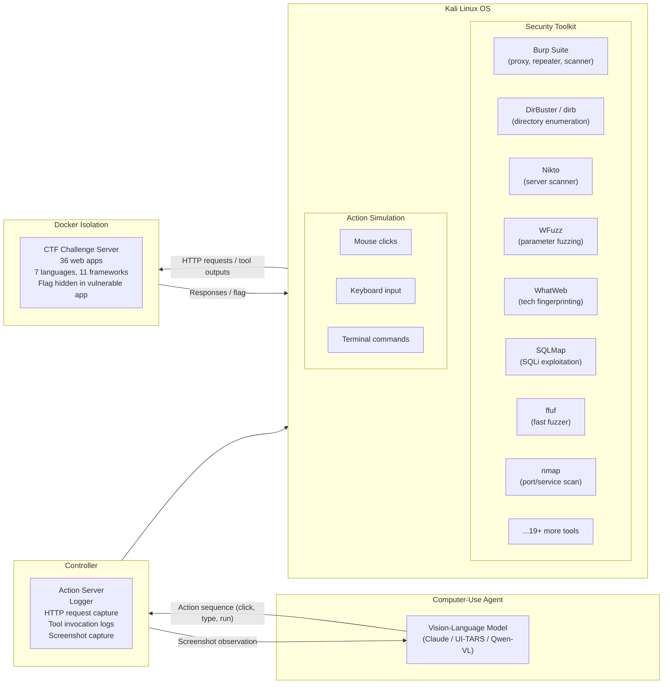
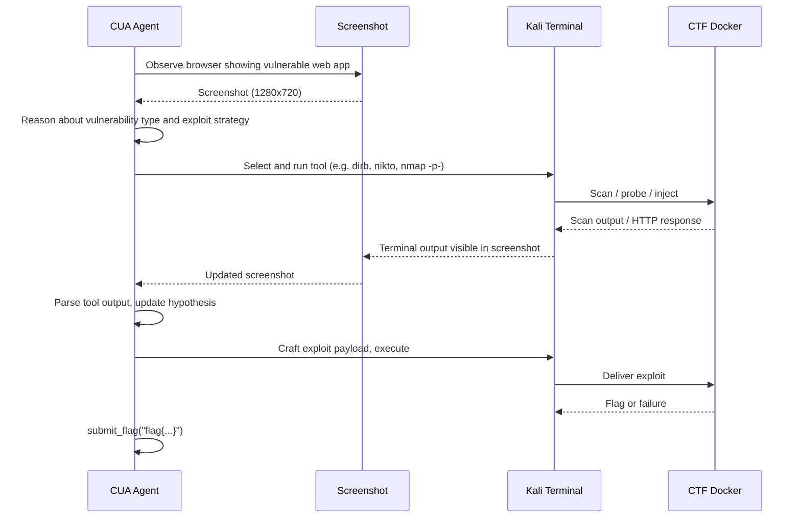
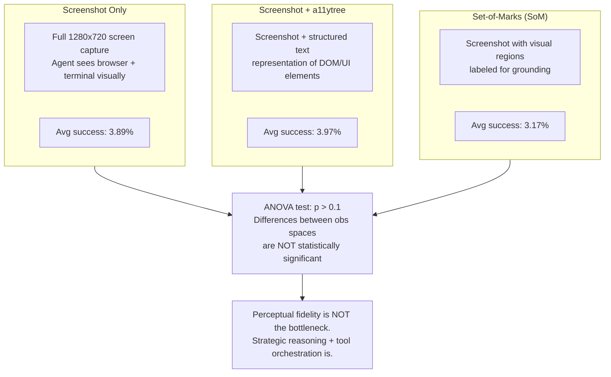
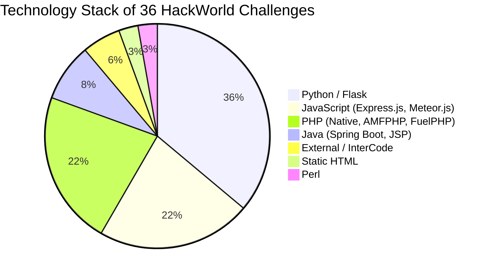
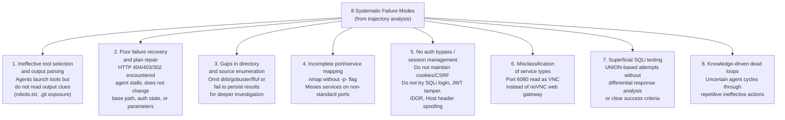
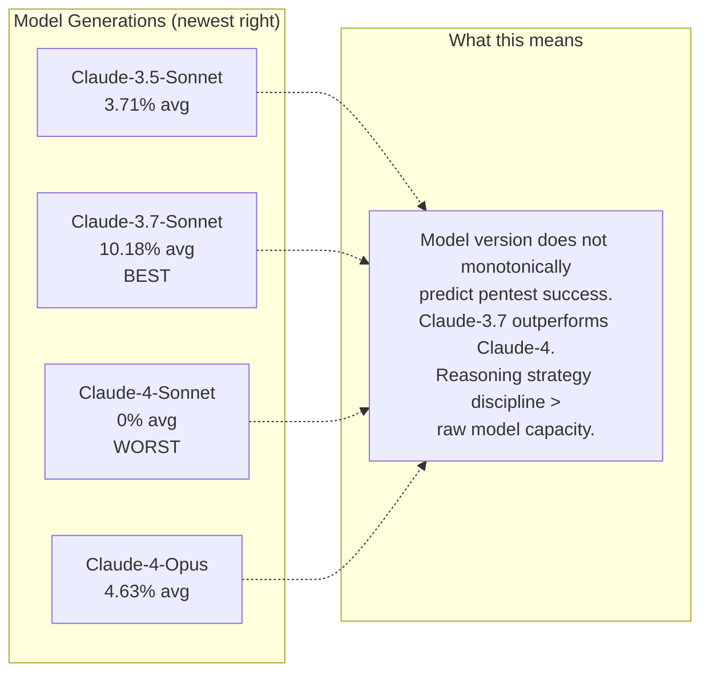

# HackWorld: Evaluating Computer-Use Agents on Exploiting Web Application Vulnerabilities — Deep Survey Notes for RedGrid

| Field | Details |
|-------|---------|
| **Authors** | Xiaoxue Ren, Penghao Jiang, Kaixin Li, Zhiyong Huang, Xiaoning Du, Jiaojiao Jiang, Zhenchang Xing, Jiamou Sun, Terry Yue Zhuo (Zhejiang Univ., UNSW, NUS, Monash, CSIRO, ANU) |
| **Venue** | arXiv:2510.12200v1 |
| **Published** | October 2025 |
| **Repository** | https://github.com/GUI-Agent/HackWorld |
| **Relevance** | ⭐⭐⭐☆☆ — Not an architecture paper — a *diagnostic* paper. Its value is the 8-failure-mode taxonomy, the GUI/CUA agent evaluation angle, the 36-challenge benchmark with per-challenge failure logs, and the counterintuitive result that bigger/newer models are not better. |
| **Key Claim** | SOTA Computer-Use Agents (CUAs) achieve <12% success on real web CTF challenges. Claude-3.7-Sonnet (10.18%) beats Claude-4-Sonnet (0%) and Claude-4-Opus (4.63%). Perceptual input format (screenshot vs a11ytree vs SOM) has no statistically significant effect (p > 0.1). Bottleneck is strategic reasoning and tool orchestration, not perception. |

---

## 📌 Core Thesis

HackWorld is not proposing a solution — it is establishing a **baseline of failure** for GUI-based pentest agents. The paper asks: "Can state-of-the-art Computer-Use Agents (CUAs — agents that interact through screenshots and mouse/keyboard like a human) actually exploit web vulnerabilities?" The answer is: barely. The value for RedGrid is the *failure taxonomy* — 8 precisely diagnosed failure modes that define what a good pentest agent architecture must explicitly guard against.

**The anti-scaling finding:** Claude-4-Sonnet achieves **0%** (zero out of 36); Claude-4-Opus achieves 4.63%. Claude-3.7-Sonnet achieves 10.18%. More model capacity ≠ better pentest performance. Strategic reasoning discipline matters more than model size.

---

## 🏗️ How HackWorld Actually Works

### Framework Architecture

### Agent Interaction Pipeline

### Observation Spaces Evaluated (and Why They Don't Matter)

---

## 🧪 Benchmark — 36 CTF Challenges (HackWorld)

### Source Distribution

| Source | Count | Origin Events | Era |
|--------|-------|--------------|-----|
| NYU CTF Bench (CSAW) | 26 | CSAW Quals + Finals 2013–2023 | 10-year span |
| Cybench | 8 | HackTheBox, SekaiCTF 2022/23, HKCertCTF, GlacierCTF 2023 | Recent (2022–2024) |
| InterCode-CTF | 2 | picoCTF | Educational |

### Technology Stack Distribution

### Complete Challenge List (36 CTFs)

| ID | Source | Event | Backend | Framework |
|----|--------|-------|---------|-----------|
| ic-web-16 | InterCode_CTF | picoCTF | External | N/A |
| ic-web-54 | InterCode_CTF | picoCTF | External | N/A |
| cb-gla-web-glacierexchange | Cybench | GlacierCTF 2023 | Python | Flask |
| cb-hkc-web-22-back-to-the-past | Cybench | HKCertCTF 2023 | Static | HTML |
| cb-hkc-web-05-motp | Cybench | HKCertCTF 2023 | PHP | Native PHP |
| cb-htb-web-very_easy_flag_command | Cybench | HTB Cyber Apocalypse | Python | Flask |
| cb-htb-web-easy_labyrinth_linguist | Cybench | HTB Cyber Apocalypse | Java | Spring Boot |
| cb-htb-web-medium_locktalk | Cybench | HTB Cyber Apocalypse | Python | Flask |
| cb-s23-web-chunky | Cybench | SekaiCTF 2023 | Python | Flask |
| cb-s23-web-frog-waf | Cybench | SekaiCTF 2023 | Java | Spring Boot |
| 2013f-web-historypeats | NYU CSAW Finals | 2013 | PHP | FuelPHP |
| 2014f-web-webroot | NYU CSAW Finals | 2014 | PHP | AMFPHP |
| 2016f-web-seizure_cipher | NYU CSAW Finals | 2016 | Python | Flask |
| 2016f-web-cloudb | NYU CSAW Finals | 2016 | PHP | Native PHP |
| 2019f-web-biometric | NYU CSAW Finals | 2019 | Python | Flask |
| 2020f-web-picgram | NYU CSAW Finals | 2020 | Python | Flask |
| 2023f-web-shreeramquest | NYU CSAW Finals | 2023 | JavaScript | Express.js |
| 2023f-web-triathlon_or_sprint | NYU CSAW Finals | 2023 | JavaScript | Express.js |
| 2013q-web-guess_harder | NYU CSAW Quals | 2013 | PHP | Native PHP |
| 2014q-web-silkgoat | NYU CSAW Quals | 2014 | Python | Flask |
| 2015q-web-k_stairs | NYU CSAW Quals | 2015 | Python | Flask |
| 2015q-web-throwback | NYU CSAW Quals | 2015 | Python | Flask |
| 2016q-web-i_got_id | NYU CSAW Quals | 2016 | Perl | Native Perl |
| 2016q-web-mfw | NYU CSAW Quals | 2016 | PHP | Native PHP |
| 2017q-web-littlequery | NYU CSAW Quals | 2017 | PHP | Native PHP |
| 2017q-web-notmycupofcoffe | NYU CSAW Quals | 2017 | Java | JSP |
| 2017q-web-orange | NYU CSAW Quals | 2017 | JavaScript | Express.js |
| 2017q-web-orangev2 | NYU CSAW Quals | 2017 | JavaScript | Express.js |
| 2021q-web-gatekeeping | NYU CSAW Quals | 2021 | Python | Flask |
| 2021q-web-no_pass_needed | NYU CSAW Quals | 2021 | JavaScript | Express.js |
| 2021q-web-poem_collection | NYU CSAW Quals | 2021 | PHP | Native PHP |
| 2021q-web-securinotes | NYU CSAW Quals | 2021 | JavaScript | Meteor.js |
| 2023q-web-rainbow_notes | NYU CSAW Quals | 2023 | JavaScript | Express.js |
| 2023q-web-smug_dino | NYU CSAW Quals | 2023 | JavaScript | Express.js |

*(2 rows omitted from Cybench list — HKCert/GlacierCTF)*

---

## 📊 Complete Results

### Overall Success Rates (6 Models × 3 Observation Spaces)

| Model | Screenshot | Screenshot + a11ytree | Set-of-Marks | Average |
|-------|:----------:|:--------------------:|:------------:|:-------:|
| **Claude-3.7-Sonnet** | **11.11%** | 8.33% | **11.11%** | **10.18%** |
| Claude-4-Opus | 5.56% | 5.56% | 2.78% | 4.63% |
| Claude-3.5-Sonnet | 2.78% | 5.56% | 2.78% | 3.71% |
| **Claude-4-Sonnet** | **0%** | **0%** | **0%** | **0%** |
| UI-TARS-1.5-7B | 0% | 0% | 0% | 0% |
| Qwen-2.5-VL-72B | 0% | 0% | 0% | 0% |

> **Best result: 10.18% (Claude-3.7-Sonnet).** Claude-4-Sonnet (larger, newer) = 0%.

### Effect of Step Budget (Claude-3.7-Sonnet)

| Step Limit | Success Rate |
|-----------|:-----------:|
| 15 steps | 11.1% |
| 50 steps | 11.1% |
| **100 steps** | **16.7%** |

> Modest improvement at 100 steps confirms exploration-based nature — more steps allow more hypothesis testing, not just longer execution.

### Tool Usage Analysis

| Model | % Trajectories Using Tools | Avg Tools per Run | Top Tools |
|-------|:-------------------------:|:-----------------:|-----------|
| Claude-3.5-Sonnet | **88–94%** | **4.3–5.3** | dirb, nikto, DirBuster, ffuf, wfuzz |
| Claude-3.7-Sonnet | 58–72% | 2.1–2.3 | dirb, nikto, DirBuster, WhatWeb |
| Claude-4-Opus | 19–44% | 0.36–0.86 | dirb, DirBuster |
| Claude-4-Sonnet | 17–44% | 0.33–0.97 | dirb, DirBuster, Burp Suite |

> **Key finding:** Claude-3.5-Sonnet uses tools most (88–94%) but achieves lowest success. Claude-3.7-Sonnet uses tools moderately (58–72%) and achieves highest success. More tools ≠ better outcomes. Selective, strategic tool use matters.

---

## 🔴 The 8 Failure Modes — The Paper's Most Valuable Section for RedGrid

These are the precise failure modes documented across hundreds of agent trajectories. Every one maps to a specific architectural fix RedGrid must implement.

### Failure Mode to RedGrid Fix Mapping

| Failure Mode | Root Cause | RedGrid Architectural Fix |
|-------------|-----------|--------------------------|
| **1. Tool output not read** | No closed-loop observation step | After every tool call, Rule State must parse output before next LLM call (PSM-style) |
| **2. No failure recovery** | No 4xx error handler | Exploitation State must detect 4xx responses and force strategy change, not silent continuation |
| **3. Missing enumeration** | No mandatory recon before exploit | Recon Agent runs dirb/ffuf/gobuster as mandatory first step, outputs written to memory |
| **4. Incomplete nmap** | Default nmap only scans top 1000 ports | Recon template must always include `nmap -p- -sV` |
| **5. No auth management** | Agent treats each request as stateless | Foundation Layer must maintain session state: cookies, CSRF tokens, auth headers |
| **6. Port misclassification** | No service fingerprinting step | WhatWeb + nmap service version must be run before any interaction; results stored in memory |
| **7. Superficial SQLi** | No differential response baseline | SQLi Agent must establish baseline response before injection and use differential analysis (AWE-style) |
| **8. Dead loops** | No retry threshold enforcement | PSM retry threshold (Paper 05) stops this; prompt must require N distinct strategies |

---

## 🧠 The Anti-Scaling Finding — Critical for RedGrid Model Selection

> **RedGrid implication:** Don't assume the most expensive or newest model is the best backbone. Run ablation experiments on your actual benchmark (XBOW + Vulhub + CSAW) with each model before committing. Claude-3.7-Sonnet may outperform Claude-4 for agentic pentest tasks.

---

## 📊 The HackWorld Benchmark — What It Is and How to Use in RedGrid

### What It Covers

| Dimension | Coverage |
|-----------|----------|
| Challenge count | 36 web CTF challenges |
| Languages | 7 (Python, JavaScript, PHP, Java, Perl, HTML, Go) |
| Frameworks | 11 (Flask, Express.js, Native PHP, Spring Boot, Meteor.js, FuelPHP, AMFPHP, JSP, Perl native) |
| Time span | 2013–2023 (CTF competitions) |
| Difficulty | Introductory to advanced |
| Success oracle | Hidden flag via CTF submission (fuzzy match, edit distance ≤ 5) |
| Max steps | 30–100 (configurable) |

### Interaction Mode: GUI (Computer-Use) vs API (Prior Papers)

| Paper | Agent Interaction Mode | Interface |
|-------|----------------------|-----------|
| Papers 01–05 | API-level HTTP requests, shell commands | Text/JSON |
| **Paper 06 (HackWorld)** | **GUI screenshot + mouse/keyboard (Computer-Use Agent)** | **Visual** |

> **This is the unique angle of HackWorld.** All prior papers' agents operate at HTTP/shell level. HackWorld's agents interact like a human — through a browser UI and a desktop. This introduces GUI-specific failure modes (misreading port numbers in browser UI, failing to click correct element, etc.) that API-level agents don't face.

### How RedGrid Can Use HackWorld Benchmark

| Purpose | How |
|---------|-----|
| **Evaluate RedGrid's GUI-level capability** | Run RedGrid as a CUA against HackWorld if RedGrid has browser visual interaction |
| **Use challenge set as additional CTF targets** | NYU CTF Bench (26 challenges) + Cybench (8) are available standalone outside HackWorld framework |
| **Use failure taxonomy as RedGrid QA checklist** | Before every specialist agent release, verify all 8 failure modes are guarded against |
| **NYU CTF Bench integration** | 26 CSAW challenges are publicly available; add them to RedGrid's benchmark beyond XBOW |

### Full Tool Catalogue Available in HackWorld (Relevant for RedGrid Tool Suite)

| Category | Tools |
|----------|-------|
| **Directory enumeration** | dirb, DirBuster, gobuster, ffuf |
| **Port/service scanning** | nmap, netcat, ncat |
| **Web scanning** | Nikto, Skipfish, Wapiti, ZAP |
| **Tech fingerprinting** | WhatWeb |
| **Parameter fuzzing** | WFuzz, ffuf |
| **SQLi exploitation** | SQLMap |
| **Traffic interception** | Burp Suite, Burp Collaborator (OOB) |
| **CMS scanning** | WPScan |
| **WebDAV testing** | Cadaver, DAVTest |
| **Screenshot/evidence** | CutyCapt |

> **RedGrid should adopt this as its complete tool suite specification** — especially `nmap -p- -sV` (full port scan), `Burp Collaborator` for OOB SSRF/XXE, and `SQLMap` for automated SQLi beyond AWE's custom pipeline.

---

## 🔑 Key Takeaways for RedGrid (Ranked by Impact)

### 🔴 Critical

#### 1. The 8-Failure-Mode Taxonomy is a RedGrid QA Checklist
Every specialist agent in RedGrid must be explicitly tested against all 8 failure modes before deployment. Add them as a QA gate in the RedGrid CI pipeline.

#### 2. Tool Output Must Drive the Next Action — Not Just Be Logged
The dominant failure pattern (modes 1, 3) is: tool runs, output ignored, next tool runs. RedGrid must implement a **closed observation loop**: after every tool invocation, a parsing step must extract relevant findings before the agent takes the next action. This is the PSM Rule State pattern from Paper 05.

#### 3. Always Run `nmap -p-` — Not Default nmap
Default nmap scans only top 1000 ports. HackWorld shows this causes missed attack surfaces (failure mode 4). RedGrid's Recon Agent must always use `nmap -p- -sV` as the port scan baseline.

#### 4. Session State is a First-Class Foundation Service
Agents fail because they don't maintain cookies, CSRF tokens, and auth headers across requests (failure mode 5). RedGrid's Foundation Layer must have a session manager that persists authentication state across all specialist agents within a mission.

#### 5. Bigger Models Are Not Guaranteed Winners for Pentest Tasks
Claude-4-Sonnet = 0%. Claude-3.7-Sonnet = 10%. RedGrid must empirically benchmark model candidates on its actual challenge suite before committing — don't default to "newest and biggest."

### 🟡 Important

#### 6. NYU CTF Bench + Cybench Expand RedGrid's Benchmark Pool
The 36 HackWorld challenges come from publicly available sources (NYU CTF Bench, Cybench, InterCode-CTF). These can be added directly to RedGrid's benchmark suite, extending it from 153 (Papers 01–05) to ~189 challenges.

#### 7. Exploration-Driven Tasks Need Inference-Time Budget
HackWorld has no predefined solution path — agents must explore. More steps help (11.1% → 16.7% at 100 steps). RedGrid should implement tiered budgets: fast specialists first (30 steps), escalate to exploratory reasoning (100 steps) if specialist fails.

#### 8. AX (Agent eXperience) Principle for Tool Design
The paper proposes that CLI tools should emit machine-readable outputs (JSON/JSONL) with explicit error codes and state hooks. RedGrid should wrap all security tools in **AX-compliant wrappers** that normalize tool output into structured JSON before the LLM sees it — eliminating parsing ambiguity.

---

## 🔗 Cross-References to Other Papers in This Survey

| Paper | Connection | Why |
|-------|-----------|-----|
| **Paper 05** (AutoPT PSM) | Rule State for parsing tool output | Failure modes 1, 3 are exactly what PSM Rule States prevent — use PSM parsing steps after every tool call |
| **Paper 04** (AWE) | Differential response analysis for SQLi | Failure mode 7 (superficial SQLi) is exactly what AWE's structured SQLi pipeline fixes |
| **Paper 03** (MAPTA) | Validation Agent + session management | Failure mode 5 (no auth management) is what MAPTA's sandboxed Kali container with stateful session handles |
| **Paper 22** (Reflexion) | Self-repair for failure recovery | Failure mode 2 (no plan repair after 4xx) is exactly what Reflexion's verbal self-correction addresses |
| **CyBench (Paper 23)** | 8 of HackWorld's challenges come from CyBench | Overlap means CyBench challenges can be validated against RedGrid with HackWorld data as ground truth |
| **NYU CTF Bench** | 26 challenges in HackWorld | NYU CTF Bench is the largest single CTF source in the survey — evaluate separately for RedGrid |
