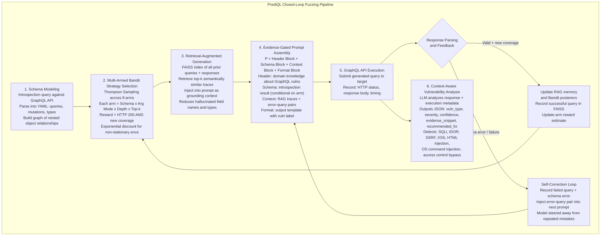
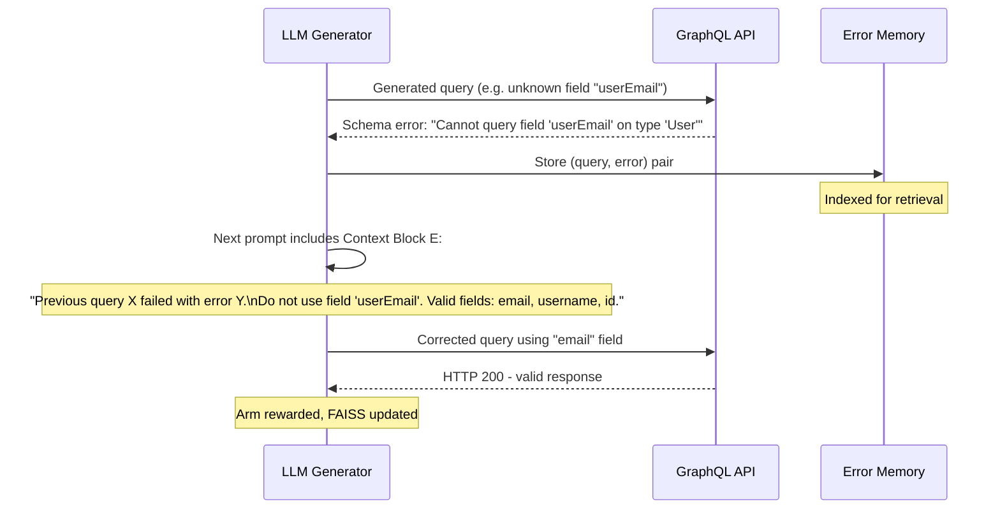
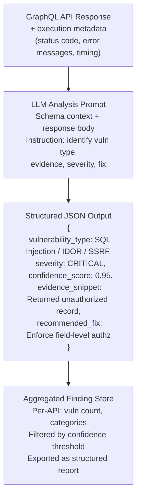

# PrediQL: Automated Testing of GraphQL APIs with LLMs — Deep Survey Notes for RedGrid

| Field | Details |
|-------|---------|
| **Authors** | Shaolun Liu, Sina Marefat, Omar Tsai, Yu Chen, Zecheng Deng, Jia Wang, Mohammad A. Tayebi (Simon Fraser University + K. N. Toosi University of Technology) |
| **Venue** | arXiv:2510.10407v2 |
| **Published** | October 2025 |
| **Repository** | https://github.com/SLL288/prediql |
| **Relevance** | ⭐⭐⭐☆☆ — Niche but important. GraphQL is a growing attack surface (61% production adoption, 69% of public APIs vulnerable to DoS). PrediQL's RAG + multi-armed bandit + self-correction loop is a directly transplantable pattern for RedGrid's API specialist agents. The architecture ideas generalize beyond GraphQL to REST and gRPC. |
| **Key Claim** | PrediQL achieves avg +16% (max +50%) schema coverage over best baseline (GraphQLer) and finds 20–40% more vulnerabilities on complex APIs, by combining FAISS-backed RAG traces, Thompson Sampling arm selection, and LLM-driven self-correction — not by using a bigger model. LLaMA-3.1-8B (free) competes with GPT-5 Mini when the pipeline is in place. |

---

## 📌 Core Thesis

Existing GraphQL fuzzers fail because they treat the API as a flat input space. GraphQL is a **graph** with producer-consumer relationships between queries and mutations, nested types, and dependency-rich schemas. PrediQL treats fuzzing as a **multi-armed bandit problem**: each arm is a distinct prompt strategy (different schema depth, argument mode, RAG top-k), and Thompson Sampling dynamically allocates budget to the strategies that keep expanding coverage. A FAISS vector store of past execution traces grounds the LLM in real API behavior, and self-correction loops inject failed query-error pairs back into the prompt as supervision.

**The generalizable insight for RedGrid:** This exact architecture — RAG memory + adaptive strategy selection + self-correction — is not GraphQL-specific. It applies to any agent that needs to explore a structured interface (REST endpoint, web form, CLI tool) without burning budget on dead-end strategies.

---

## 🏗️ How PrediQL Actually Works

### Closed-Loop Fuzzing Architecture



### The 8 Bandit Arms — Strategy Space

```mermaid
flowchart LR
    subgraph Arms["8 Thompson Sampling Arms"]
        A1["schema_min_known\nSchema: Yes | Args: known | Depth: 1 | Top-k: 3\nConservative: reuse known values, shallow"]
        A2["schema_min_real\nSchema: Yes | Args: real | Depth: 1 | Top-k: 3\nSynthesize realistic literals, shallow"]
        A3["schema_mod_known\nSchema: Yes | Args: known | Depth: 2 | Top-k: 5\nModerate depth, more RAG context"]
        A4["noschema_min_known\nSchema: No | Args: known | Depth: 1 | Top-k: 3\nTest LLM generalization without schema"]
        A5["noschema_min_real\nSchema: No | Args: real | Depth: 1 | Top-k: 0\nPure LLM synthesis, no schema, no RAG"]
        A6["schema_min_nulls\nSchema: Yes | Args: null | Depth: 1 | Top-k: 3\nTest optional field null handling"]
        A7["schema_deep_known\nSchema: Yes | Args: known | Depth: 3 | Top-k: 5\nDeep nesting, known values, most RAG"]
        A8["schema_deep_real\nSchema: Yes | Args: real | Depth: 3 | Top-k: 5\nAggressive: deep + new values + most RAG"]
    end

    Bandit["Thompson Sampling\nReward: HTTP 200 AND new coverage\nExponential discount on old rewards\nDynamically reallocates budget to\nhigh-performing arms"]
    Arms --> Bandit
```



### Self-Correction Loop — How Failures Become Supervision



### Context-Aware Vulnerability Detection Output



---

## 🧪 GraphQL Vulnerability Taxonomy (redgrid-Relevant)

| Category | Vulnerability | GraphQL-Specific? | RedGrid Action |
|----------|--------------|:-----------------:|----------------|
| **Query Abuse** | Introspection enabled (schema disclosure) | ✅ | Recon agent: always run introspection first |
| **Query Abuse** | Unbounded query depth (DoS) | ✅ | Test with depth 5–10 nested queries |
| **Query Abuse** | Batched query abuse (bypass rate limits) | ✅ | Test batch execution bypasses |
| **Injection** | SQL Injection via arguments | ❌ | Standard SQLi specialist applies |
| **Injection** | XSS in response fields | ❌ | Standard XSS specialist applies |
| **Injection** | OS command injection | ❌ | Standard CmdInj specialist applies |
| **Injection** | Path injection via file arguments | ❌ | Standard LFI specialist applies |
| **Access Control** | IDOR via object ID manipulation | ❌ | Standard IDOR specialist applies |
| **Access Control** | Batched auth bypass | ✅ | GraphQL-specific: batch multiple auth mutations |
| **Access Control** | Unauthorized field access via mutation chain | ✅ | Dependency graph traversal required |
| **Information Disclosure** | Schema exposure via introspection | ✅ | Test if introspection is disabled in prod |

---

## 📊 Complete Benchmark Results

### Coverage Comparison (PrediQL vs Baselines)

| API | ZAP | Burp Suite | EvoMaster | GraphQLer | PrediQL | Delta vs Best Baseline |
|-----|:---:|:----------:|:---------:|:---------:|:-------:|:----------------------:|
| **UserWallet** | 50% | 7.69% | 61.54% | 92.31% | **96.15%** | +3.84% |
| **Countries** | 33.33% | 50% | 50% | 50% | **100%** | **+50%** |
| **Rick&Morty** | 33.33% | 0% | 66.67% | 66.67% | **100%** | **+33.33%** |
| **GraphQLZero** | 93.75% | 93.75% | 71.88% | 93.75% | **100%** | +6.25% |
| **EHRI** | 10.53% | 0% | 84.21% | 94.74% | **100%** | +5.26% |
| **TCGDex** | 66.67% | 33.33% | **100%** | **100%** | **100%** | Tied |

**Average improvement over best baseline: +16%. Maximum: +50% (Countries).**

### Coverage by LLM Model

| API | LLaMA 3.1 (8B) | Gemini 2.5 Flash | GPT-5 Mini | DeepSeek R1 (671B) |
|-----|:--------------:|:----------------:|:----------:|:------------------:|
| UserWallet | 88.46% | 96.15% | **96.15%** | 88.46% |
| Countries | 100% | 100% | 100% | 100% |
| Rick&Morty | 100% | 100% | 100% | 100% |
| GraphQLZero | 100% | 100% | 100% | 100% |
| EHRI | 78.94% | **100%** | **100%** | **100%** |
| TCGDex | **100%** | 83.33% | **100%** | **100%** |

> **LLaMA 3.1 (8B, free) competes with GPT-5 Mini and DeepSeek R1 (671B) on most APIs.** The pipeline matters more than model size.

### Ablation Study — Contribution of Each Component (GPT-5 Mini)

| API | BASE only | +SCL (self-correction) | +AQG (bandit+RAG) | Full PrediQL | Gain |
|-----|:---------:|:---------------------:|:-----------------:|:------------:|:----:|
| UserWallet | 19.23% | 38.46% | 61.53% | **96.15%** | +76.92% |
| GraphQLZero | 81% | 100% | 87.5% | **100%** | +19% |
| EHRI | 100% | 100% | 100% | **100%** | — |

> **Biggest single gain: UserWallet +76.92% from BASE to full PrediQL.** SCL alone: +19.23%. AQG alone: +42.3%. Combined: +76.92% — superadditive. Self-correction and adaptive arm selection are complementary, not substitutes.

### Vulnerability Detection (PrediQL vs GraphQLer)

| API | GraphQLer (vulns / cats) | LLaMA 3.1 | Gemini 2.5 | GPT-5 Mini | DeepSeek R1 |
|-----|:------------------------:|:---------:|:----------:|:----------:|:-----------:|
| UserWallet | 26 / 7 | 31 / 11 | **41 / 7** | 20 / 6 | 34 / 8 |
| Countries | 6 / 2 | 7 / 3 | 9 / 2 | 9 / 4 | 7 / 3 |
| Rick&Morty | 12 / 3 | 10 / 10 | 13 / 4 | 11 / 4 | **14 / 6** |
| GraphQLZero | 37 / 8 | 35 / 7 | 37 / 7 | **44 / 6** | 34 / 7 |
| EHRI | 11 / 3 | 15 / 12 | 21 / 2 | **26 / 2** | 3 / 3 |
| TCGDex | 6 / 1 | 7 / 1 | **10 / 2** | 8 / 2 | 7 / 2 |

> **Best overall: Gemini 2.5 and GPT-5 Mini** depending on the API. DeepSeek R1 underperforms on EHRI despite its 671B size.

---

## 🔑 Key Takeaways for RedGrid (Ranked by Impact)

### 🔴 Critical

#### 1. RedGrid Needs a GraphQL Specialist Agent — Not Just REST/HTTP
61% of organizations use GraphQL in production. GraphQL-specific vulnerabilities (introspection, depth abuse, batched auth bypass, producer-consumer IDOR chains) are invisible to HTTP-layer agents. RedGrid must implement a dedicated **GraphQL Specialist Agent** that:
- Runs introspection query first (schema extraction)
- Builds a dependency graph of query-mutation relationships
- Tests injection via arguments, batched bypass, and IDOR via ID manipulation
- Tests if introspection is disabled in production (and probes blind schemas)

#### 2. The RAG + Self-Correction + Adaptive Strategy Pattern is the RedGrid Learning Loop
PrediQL's three-component system is directly generalizable to any RedGrid specialist agent:

```
RedGrid Adaptive Agent Pattern (from PrediQL):
1. FAISS memory of prior (request, response) pairs per target
2. Multi-armed bandit (Thompson Sampling) over prompt strategies
3. Self-correction: inject (failed_query, error_message) pairs into next prompt
4. Reward = meaningful new coverage expansion (not just HTTP 200)
```

This is especially valuable for the **Recon Agent** and **SQLi Agent** — both benefit from learning which parameter patterns succeed on a given target.

#### 3. Self-Correction Turns Failures into Training Signal — Implement This
The single biggest coverage gain in the ablation (UserWallet: +19% from SCL alone) comes from error-supervised prompting. RedGrid's agents currently have no mechanism to use failed tool calls as positive signal. Add this:
- After every failed tool invocation, log `(tool_call, error_message)` to SQLite
- Inject these pairs into the next agent prompt: "You tried X which failed with Y. Try Z instead."
- This prevents repeated identical failures and accelerates convergence.

#### 4. LLaMA-3.1-8B Competes with GPT-5 Mini When Pipeline is in Place
For GraphQL testing specifically, LLaMA-3.1 achieves comparable coverage to GPT-5 Mini. Combined with Paper 05 (GPT-4o mini outperforms GPT-4o on AutoPT) and Paper 06 (Claude-3.7 beats Claude-4), this is now the third paper confirming that **pipeline architecture dominates model size** for pentest tasks. RedGrid should run regular ablations with cheap models before defaulting to expensive ones.

### 🟡 Important

#### 5. Multi-Armed Bandit for Prompt Strategy Selection is Underused in Pentest Agents
No prior paper in this survey (Papers 01–06) uses bandit learning to select between prompt strategies. PrediQL shows it works: Thompson Sampling adapts in real time as the target reveals which attack angles are productive. RedGrid's orchestrator could implement this at the mission level — treating each specialist agent dispatch as an arm, learning which specialists are most productive for a given target's tech stack.

#### 6. Vulnerability Detection Output Should Be Structured JSON, Not Prose
PrediQL's detector outputs `{vulnerability_type, severity, confidence_score, evidence_snippet, recommended_fix}` as JSON. RedGrid's Validation Agent should adopt this exact schema for all finding reports — it enables programmatic deduplication, CVSS scoring, and structured reporting without further LLM processing.

#### 7. Hybrid Model Strategy: Large for Seeds, Small for Iteration
PrediQL's Discussion section explicitly recommends: use large models for seed generation and schema understanding, then small models for iterative fuzzing. RedGrid can adopt this directly:
- **Mission start:** GPT-4/5 for initial recon synthesis and attack surface mapping
- **Iterative fuzzing:** GPT-4o mini / LLaMA for rapid hypothesis testing
- **Validation:** Claude Sonnet 4 for final PoC confirmation (best on hard cases per Paper 04)

#### 8. GraphQL APIs Need a Dependency Graph, Not Just Endpoint Enumeration
Unlike REST endpoints that are largely independent, GraphQL queries and mutations have producer-consumer dependencies (e.g., `createUser` mutation produces a `userId` that `getUser` query consumes). RedGrid's GraphQL specialist must build this dependency graph from the introspection schema and test chains, not individual operations in isolation.

### 🟢 Nice-to-have

#### 9. PrediQL's Architecture Generalizes to REST, gRPC, JSON-RPC
The paper explicitly states this. RedGrid's Recon Agent and any API-fuzzing specialist can use the same RAG + bandit + self-correction loop for REST API discovery, not just GraphQL. This is the "intelligent REST fuzzer" that no prior paper has implemented.

#### 10. FAISS for Execution Trace Memory — Better Than Plain SQLite for Similarity Search
AWE (Paper 04) uses SQLite for filter/payload memory. PrediQL uses FAISS (vector similarity search) for trace retrieval. For RedGrid's long-term memory layer, FAISS is better suited for "retrieve most similar past attack trace" queries, while SQLite is better for structured lookups (e.g., "all payloads tried on /login"). Use both: SQLite for structured state + FAISS for semantic similarity retrieval.

---

## 📐 PrediQL Pattern vs Prior Papers — Where This Fits

| Design Element | Papers 01–06 (Before PrediQL) | PrediQL (Paper 07) | RedGrid Synthesis |
|---------------|-------------------------------|-------------------|-------------------|
| Agent memory | SQLite (flat key-value) | FAISS vector store (semantic similarity) | SQLite + FAISS hybrid |
| Learning from failures | No mechanism | Self-correction: (query, error) → next prompt | Mandatory: inject failed calls as supervision |
| Strategy adaptation | Fixed pipeline | Thompson Sampling bandit over 8 prompt strategies | Bandit at mission level (specialist dispatch) |
| Vulnerability output | Text report | Structured JSON per finding | Adopt JSON schema for all RedGrid findings |
| API type covered | HTTP/web app | GraphQL specifically | Add GraphQL specialist to RedGrid toolkit |
| Model choice | Empirical (Claude/GPT) | LLaMA-8B competes with GPT-5 | Always ablate cheap models first |

---

## 🔗 Cross-References to Other Papers in This Survey

| Paper | Connection | Why |
|-------|-----------|-----|
| **Paper 04** (AWE) | SQLite memory for payload/filter state | FAISS extends this with semantic similarity — use both in RedGrid Foundation Layer |
| **Paper 05** (AutoPT) | Self-correction via state injection | AutoPT passes inter-state summaries; PrediQL injects (query, error) pairs — same principle, different granularity |
| **Paper 06** (HackWorld) | Tool output normalization (AX principle) | PrediQL's JSON vulnerability output is the AX principle applied — machine-readable findings |
| **Paper 08** (RESTler) | Stateful REST API fuzzing | PrediQL for GraphQL + RESTler for REST = complete API fuzzing coverage for RedGrid |
| **Paper 22** (Reflexion) | Verbal self-reflection for plan repair | PrediQL's self-correction is a lightweight, non-verbal version of Reflexion — Reflexion would generalize this further |
