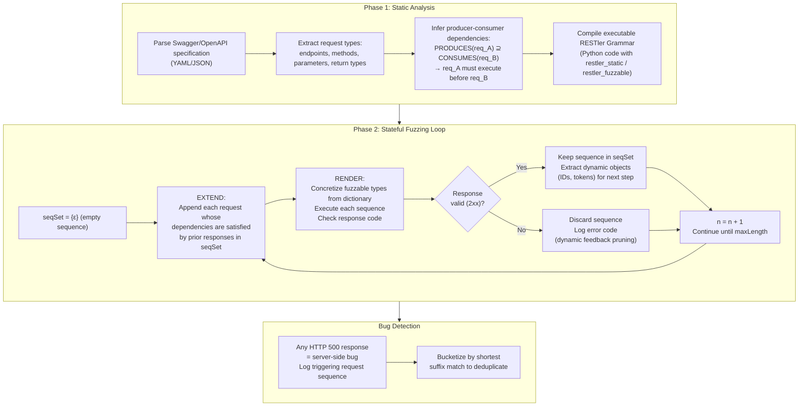
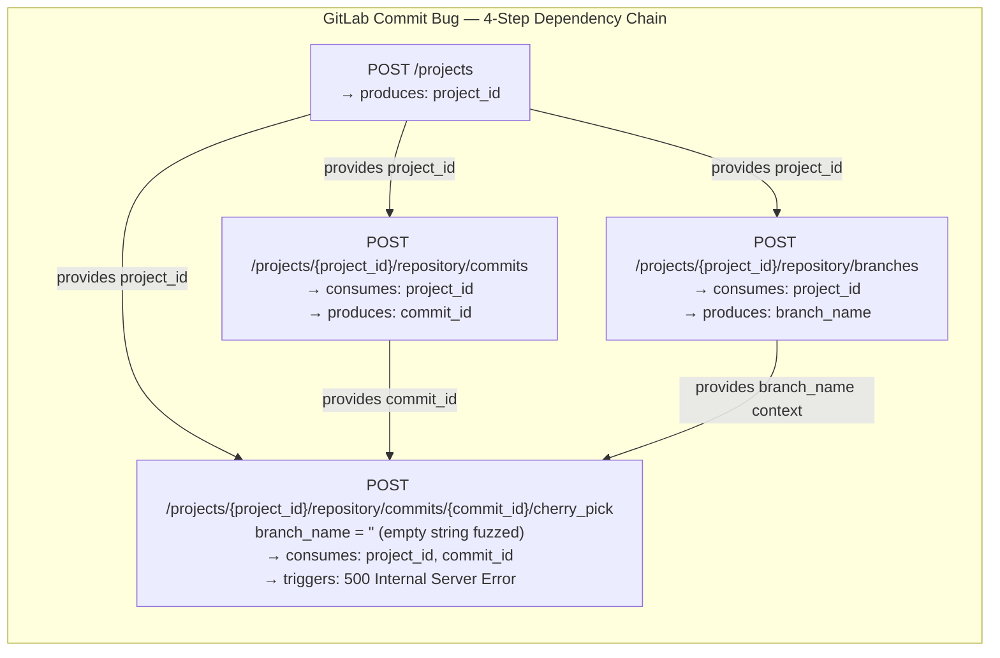
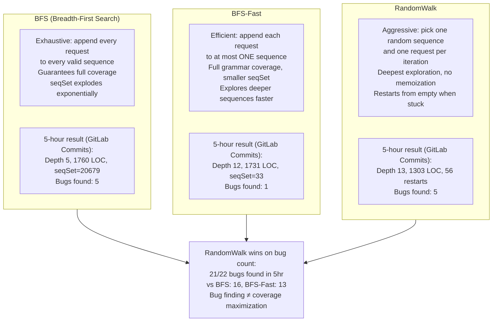
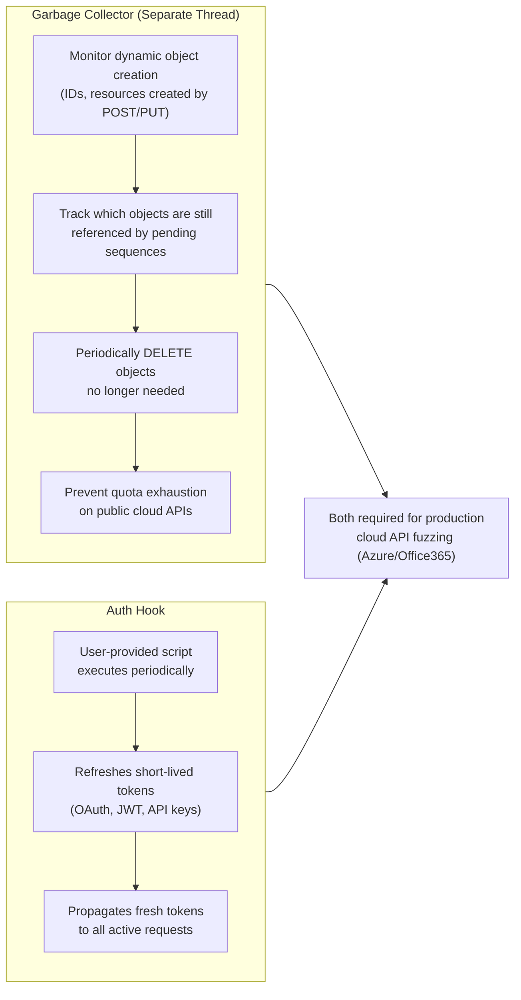

# RESTler: Stateful REST API Fuzzing — Deep Survey Notes for RedGrid

| Field | Details |
|-------|---------|
| **Authors** | Vaggelis Atlidakis (Columbia University), Patrice Godefroid, Marina Polishchuk (Microsoft Research) |
| **Venue** | IEEE/ACM ICSE 2019 (International Conference on Software Engineering) |
| **Published** | 2019 (foundational work; RESTler is now deployed at Microsoft) |
| **Repository** | https://github.com/microsoft/restler-fuzzer |
| **Relevance** | ⭐⭐⭐☆☆ — Foundational REST API fuzzing paper. Two core techniques (producer-consumer dependency inference + dynamic feedback pruning) are directly relevant to RedGrid's REST API attack surface. The three search strategies (BFS / BFS-Fast / RandomWalk) and the garbage collector design are immediately applicable to RedGrid's REST specialist agent. |
| **Key Claim** | Two techniques are necessary for effective stateful REST API fuzzing: (1) inferring producer-consumer dependencies from the Swagger/OpenAPI spec to generate valid request sequences, and (2) using dynamic response feedback to prune invalid sequences. Together they reduce test cases needed to reach full coverage by 6× (179s vs 1750s, <800 vs 4600 tests). RandomWalk strategy finds most bugs (21/22) despite lower coverage than BFS. RESTler found 28 confirmed bugs in GitLab and multiple bugs in Azure/Office365. |

---

## 📌 Core Thesis

Most API fuzzers treat REST APIs as isolated endpoints and fuzz them with random values. This misses the entire class of **stateful bugs** — bugs that only manifest when a sequence of requests drives the service into a particular state. The canonical example: you can only cherry-pick a commit if you first (1) create a project, (2) create a branch, (3) post a commit, and (4) cherry-pick it to an empty-string branch name. No single-request fuzzer reaches step 4.

RESTler's insight: the **Swagger/OpenAPI specification** already encodes which request produces which resource (producer) and which request requires that resource (consumer). Parse these dependencies statically, use dynamic response codes to prune dead sequences at runtime, and you can explore stateful API behavior automatically.

**For RedGrid:** Every modern web target exposes a REST API documented with OpenAPI/Swagger. RedGrid's REST specialist agent must implement RESTler's two core techniques to discover server-side logic bugs invisible to HTTP-only scanners.

---

## 🏗️ How RESTler Actually Works

### Core Algorithm Flow



### Producer-Consumer Dependency Inference



### Three Search Strategies



### Garbage Collector — Essential for Long-Running Fuzzing



---

## 🧪 Benchmark — GitLab (6 API Groups)

### Coverage vs Sequence Length (BFS, 5h budget)

| API Group | Requests | Depth | Coverage (LOC added) | Tests | seqSet | Dynamic Objects |
|-----------|:--------:|:-----:|:--------------------:|:-----:|:------:|:---------------:|
| **Commits** | 11 | 1→5 | 598→1760 | 1→3667 | 1→20679 | 1→12518 |
| **Branches** | 7 | 1→5 | 598→1185 | 1→3644 | 1→5528 | 1→9336 |
| **Issues** | 22 | 1→3 | 816→1163 | 37→4156 | 37→15658 | 37→8870 |
| **Repos** | 10 | 1→3 | 598→1181 | 1→5153 | 1→2194 | 1→15472 |
| **Groups** | 50 | 1→3 | 887→1177 | 39→4817 | 39→79518 | 38→8946 |
| **Projects** | 48 | 1→3 | 934→1203 | 42→3226 | 41→18173 | 38→7374 |

> All coverage figures are additional LOC on top of **16,836 lines** executed at service boot.

### Bug Buckets by Search Strategy (5-hour run)

| API Group | BFS | BFS-Fast | RandomWalk | Unique (Union) |
|-----------|:---:|:--------:|:----------:|:--------------:|
| Commits | 5 | 1 | 5 | 5 |
| Branches | 7 | 7 | 7 | 8 |
| Issues | 0 | 1 | 1 | 1 |
| Repos | 2 | 3 | 3 | 3 |
| Groups | 0 | 0 | 2 | 2 |
| Projects | 2 | 1 | 3 | 3 |
| **Total** | **16** | **13** | **21** | **22** |

> **RandomWalk finds the most bugs (21/22) despite lower coverage.** Coverage ≠ bug density. RandomWalk's deep-sequence exploration reaches stateful conditions that BFS never reaches within the time budget.

### Two-Technique Necessity Experiment (Blog Posts Service)

| Configuration | Code Coverage | Tests Needed | Time to Coverage | 40x Rate | Bugs Found |
|--------------|:------------:|:------------:|:---------------:|:--------:|:----------:|
| No Dependencies (random IDs) | ~130 LOC | any | Plateaus immediately | 26% | 0 |
| No Dynamic Feedback | ~150 LOC | >4600 | 1750s | **~60%** | 1 |
| **RESTler (Both)** | **~150 LOC** | **<800** | **179s** | **20%** | **1** |

> **6× fewer tests, 10× faster than no-dynamic-feedback.** Both techniques are independently necessary.

---

## 🔑 Key Takeaways for RedGrid (Ranked by Impact)

### 🔴 Critical

#### 1. RedGrid's REST Specialist Must Implement Producer-Consumer Dependency Inference
HTTP-only agents send isolated requests. A REST specialist must:
1. Download the target's OpenAPI/Swagger spec (or infer it from traffic)
2. Parse `PRODUCES(req)` and `CONSUMES(req)` for every endpoint
3. Generate request sequences in dependency order — never send `DELETE /resource/{id}` without first `POST /resource` to get a real `id`
4. Use the dynamically returned `id`/`token` as input to subsequent requests

Without this, the agent will never reach deep service states where logic bugs hide.

#### 2. Dynamic Feedback Pruning is the Context Budget Saver
RESTler's rule: if a sequence returns a non-2xx response, discard it and do not extend it further. This keeps the `seqSet` manageable and focuses budget on productive paths. RedGrid's REST specialist must implement this: after each request, check the response code. 4xx/5xx from a non-target endpoint → prune and pivot. Only 2xx responses advance the sequence.

#### 3. Use RandomWalk as the Default Strategy — Not BFS
BFS explores exhaustively and gets stuck at depth 3 on complex APIs within a 5-hour budget. RandomWalk reaches depth 13–22 in the same time and finds more bugs. For RedGrid's REST specialist:
- **Start:** RandomWalk for initial deep exploration (first N minutes)
- **Escalate:** BFS-Fast for grammar coverage if RandomWalk stalls
- **Never:** Full BFS on large APIs (seqSet explodes to 79K+ sequences)

#### 4. Bug Oracle = HTTP 500 — Implement This as the REST Specialist's Primary Signal
RESTler's bug detector is simple: any `500 Internal Server Error` = a server-side bug. RedGrid's REST specialist should log every 500 response with its full triggering sequence as a confirmed finding. This is the REST equivalent of the CTF flag oracle — objective, automatic, no human needed.

#### 5. Garbage Collector is Required for Any Long-Running Mission
APIs have resource quotas. If RedGrid creates 1000 test resources and never cleans up, the API will start returning 429/403 for all subsequent requests. Implement a GC thread that periodically DELETEs aging resources created during a mission.

### 🟡 Important

#### 6. Short-Lived Auth Tokens Need an Auth Refresh Hook
Modern REST APIs use OAuth/JWT with short-lived tokens (15–60 min). RedGrid's REST specialist must implement an auth hook that periodically runs a token-refresh script and propagates the new token to all pending requests. Without this, the agent will silently fail after the token expires mid-mission.

#### 7. Bug Bucketization — Deduplication by Shortest Suffix Match
When fuzzing finds the same bug via 5 different request sequences, you don't want 5 separate reports. RESTler's bucketization: compare the non-rendered suffix of each bug-triggering sequence; if a suffix matches a previously recorded sequence, add to the same bucket. RedGrid's Validation Agent should implement this to avoid duplicate findings in reports.

#### 8. Annotations for Non-Standard Dependencies
Some APIs use `PUT` to create resources with user-provided names in the URL path — not standard REST. RESTler supports Swagger extension annotations to declare these manually. RedGrid's REST specialist needs a mechanism to accept manual dependency hints for non-standard APIs.

### 🟢 Nice-to-have

#### 9. RESTler + PrediQL = Complete API Fuzzing Stack for RedGrid
- **RESTler** → stateful REST API fuzzing (sequence-based, 500-error oracle)
- **PrediQL (Paper 07)** → GraphQL fuzzing (schema-aware, LLM-guided)
- Together: **complete API attack coverage** for RedGrid

#### 10. Brute-Force is Intractable — Always Use Dependency Pruning
For GitLab's Commits API (11 request types, avg 4 render combinations), all possible sequences of length 4 = **164 million**. Even with RESTler's pruning, seqSet reaches 20K at depth 5. This confirms that naive brute-force REST fuzzing is computationally infeasible — dependency inference is non-negotiable.

---

## 📐 RESTler Core Algorithm — Formal Reference for RedGrid

The full RESTler algorithm (simplified for RedGrid implementation):

```python
# RedGrid REST Specialist — RESTler-style Algorithm
def rest_specialist(swagger_spec, max_depth=5, strategy="RandomWalk"):
    req_set = parse_swagger(swagger_spec)       # Extract request types + dependencies
    seq_set = [[] ]                             # Start with empty sequence
    bugs = []

    for depth in range(1, max_depth + 1):
        # EXTEND: only sequences with satisfied dependencies
        new_seq_set = extend(seq_set, req_set, strategy)

        # RENDER: concretize fuzzable types from dictionary
        for seq in new_seq_set:
            for values in fuzzable_combinations(seq):
                response = execute(seq, values)        # Send HTTP request sequence

                if response.status == 500:
                    bugs.append(bucketize(seq, bugs))  # Bug found

                if response.status in range(200, 300):
                    seq_set.append(seq)                # Valid: keep for extension
                    update_dynamic_objects(response)   # Extract IDs, tokens

                # Prune: non-2xx not added to seq_set (dynamic feedback)

        garbage_collect()    # Delete aging resources periodically
        refresh_auth_token() # Refresh expired tokens

    return bugs
```

---

## 📊 RESTler Benchmark for RedGrid

| Target | Size | API Groups | Bugs Found | Notes |
|--------|------|-----------|-----------|-------|
| GitLab (self-hosted) | 376K LOC Ruby | 6 (Commits, Branches, Issues, Repos, Groups, Projects) | **28 bugs** | All confirmed + fixed |
| Microsoft Azure (4 services) | Undisclosed | Resource management + data aggregation | Multiple per service | All confirmed + fixed |
| Microsoft Office365 (1 service) | Undisclosed | Undisclosed | Multiple | All confirmed + fixed |

---

## 🔗 Cross-References to Other Papers in This Survey

| Paper | Connection | Why |
|-------|-----------|-----|
| **Paper 07** (PrediQL) | GraphQL fuzzing with RAG + bandit | RESTler (REST) + PrediQL (GraphQL) = complete API fuzzing stack; RESTler's dependency inference is the REST analog of PrediQL's producer-consumer schema graph |
| **Paper 05** (AutoPT PSM) | Rule State for response filtering | RESTler's dynamic feedback pruning (discard non-2xx) maps exactly to PSM's Rule State — deterministic, zero LLM cost |
| **Paper 07** (PrediQL) | Self-correction loop | PrediQL's error-query injection is the LLM version of RESTler's dynamic feedback; same principle, different mechanism |
| **Paper 06** (HackWorld) | nmap + WhatWeb before exploit | RESTler's spec parsing step (load Swagger) is the API-level equivalent of HackWorld's reconnaissance step — always profile first |
| **Paper 03** (MAPTA) | Validation Agent | MAPTA's validation agent can validate REST bugs found by RESTler by re-executing the triggering sequence and confirming 500 |
| **Paper 22** (Reflexion) | Verbal self-correction | Reflexion's verbal repair loop could replace RESTler's hard-coded dynamic feedback pruning with LLM-guided sequence repair |
