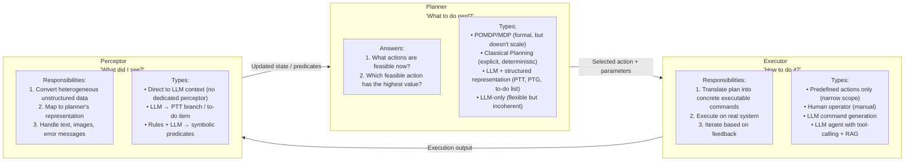
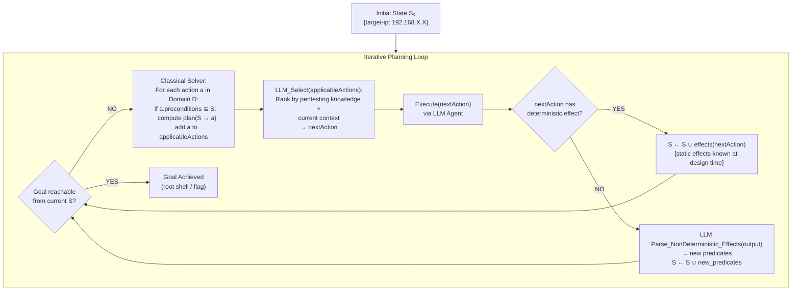
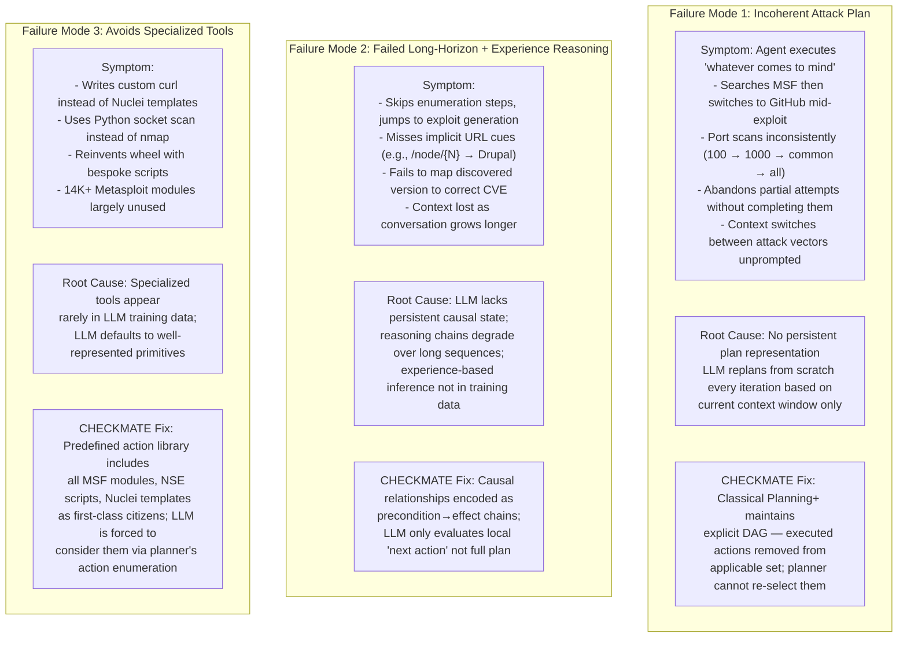

# Automated Penetration Testing with LLM Agents and Classical Planning — Deep Survey Notes for RedGrid

| Field | Details |
|-------|---------|
| **Authors** | Lingzhi Wang*, Xinyi Shi*, Ziyu Li* (Northwestern University), Yi Jiang†, Shiyu Tan†, Junjie Cheng†, Wenyuan Chen†, Zhenyuan Li† (Zhejiang University), Yuhao Jiang*, Yan Chen* (Northwestern University), Xiangmin Shen‡ (Hofstra University) |
| **Venue** | arXiv:2512.11143v1 [cs.CR], December 11, 2025 |
| **Key System** | CHECKMATE — Classical Planning+ integrated with LLM agents |
| **Relevance** | ⭐⭐⭐⭐⭐ — This paper is the most architecturally rigorous of all surveyed so far. It delivers (1) the PEP paradigm as a unified design framework applicable directly to RedGrid, (2) Classical Planning+ as a concrete, implementation-ready replacement for LLM-only planning, (3) empirical proof that classical planning beats RAG-augmented LLM by 35% on cost and outperforms Claude Code+Sonnet 4.5 on milestone success with 100% stability vs 75%, and (4) the definitive teardown of Claude Code's three failure modes that RedGrid must explicitly guard against. |
| **Key Claim** | CHECKMATE achieves **88% M7 milestone rate** on Vulhub (120 targets), vs Claude Code ~65%; costs **$0.56 median** vs Claude Code's **$1.43** (61% cheaper); time **6.9 min** vs **11.8 min** (42% faster); stability **100%** vs **75%** success across repeated runs; all three improvements from classical planning+ alone. |

---

## 2. Core Thesis

This paper's central claim is that **LLMs are structurally incapable of long-horizon planning** — not because of model capability, but because of the fundamental mechanism of next-token prediction. Every LLM planner (PentestGPT's PTT, VulnBot's PTG, PentestAgent's CVE mapping) tries to compensate for this by giving the LLM a structured intermediate representation, but the LLM still makes the planning decision. CHECKMATE's insight is to invert this: **classical planning makes the structural decision, the LLM executes and perceives**. The LLM's role is narrowed to two tasks it is actually good at — (1) generating precise commands for a given action slot, and (2) parsing heterogeneous tool outputs into symbolic predicates. It is explicitly removed from the planning loop.

The paper also delivers the first large-scale (120-target) head-to-head evaluation of all major LLM pentest systems on the same dataset, with an explicit minimal-human-intervention policy. This is the most methodologically clean benchmark in the entire field.

For RedGrid, this paper forces a critical architectural question: **Is the Team Manager's current LLM-based planning layer sufficient, or should RedGrid replace it with Classical Planning+?** The evidence strongly suggests a hybrid: keep LLM for reconnaissance summarization and output parsing, but replace the core planning strategy with a predefined action graph guided by Classical Planning+.

---

## 3. PEP Paradigm — A Unified Design Framework

This is the paper's most important conceptual contribution. Every automated pentest system can be decomposed into exactly three components:



**Taxonomy of all surveyed systems:**

| System | Planner | Executor | Perceptor |
|--------|---------|----------|-----------|
| ChainReactor | Classical Planning (static) | Predefined actions + Human | Rules + LLM (PDDL) |
| PentestGPT | LLM + Penetration Tree | LLM + Human | LLM |
| AutoPT | LLM + Finite State Machine | LLM + Agents | LLM |
| PentestAgent | LLM + CVE-Exploit mapping | LLM + RAG (code) + Agents | LLM |
| AutoAttacker | LLM + Situation Summary | LLM + RAG (prev tasks) + Agents | LLM |
| VulnBot | LLM + PTG | LLM + RAG (prev tasks) + Agents | LLM |
| PenHeal | LLM + Penetration Tree | LLM + RAG (prev cmds) + Agents | LLM |
| CAI | LLM (multi-agent) | Tool Agents | — |
| AutoPentester | LLM + Modified PTT | LLM + RAG (articles) + Agents | LLM |
| **CHECKMATE** | **Classical Planning+** | **LLM + Predefined Actions + Agents** | **LLM** |
| **RedGrid (target)** | **LLM + PTG (Papers 11–12) + Classical Planning+ (this paper)** | **Specialists + RAG** | **LLM (Summarizer Bridge)** | 

> **RedGrid implication:** RedGrid's Planner (Layer 2 Team Manager) should implement the hybrid: Classical Planning+ for known action sequences (recon → surface → exploit), LLM for dynamic updates when non-deterministic effects (exploit outcome, discovered service) update the state graph.

---

## 4. CHECKMATE — How It Actually Works

### 4.1 Classical Planning+ — The Core Innovation

Traditional classical planning requires a complete, static, fully-observable world model. Pentesting violates all three conditions. Classical Planning+ extends it with one key mechanism: **non-deterministic action effects resolved at runtime by an LLM**.



**Concrete example (Apache ActiveMQ CVE-2023-46604):**

| Step | Current State | Applicable Actions | Selected | Effect | State Update |
|------|--------------|-------------------|----------|--------|-------------|
| 1 | `{target-ip: X.X}` | nmap-full-scan, nmap-top1000, nmap-common | `nmap-full-scan X.X` | NON-DET | LLM parses output → `{suspicious-app: activemq, url: :8191, port: 22}` |
| 2 | `{suspicious-app: activemq, url: :8191}` | whatweb-scan, msf-search-activemq, nuclei-activemq | `whatweb :8191` | NON-DET | LLM parses → `{app-running: activemq-5.11.1}` |
| 3 | `{app-running: activemq-5.11.1}` | msf-use-cve-2023-46604, ... | `msf-use multi/misc/apache_activemq_rce_cve_2023_46604` | DET | `{root-shell: true}` |

**3 steps. Claude Code used 26 steps for the same target.**

---

### 4.2 Predefined Attack Actions

Rather than letting the LLM generate commands from scratch (which causes inconsistency), CHECKMATE predefines every specialized pentesting action with fixed command templates:

```
Action: nmap-full-port-scan
  Preconditions: [target-ip]
  Effects: NON-DETERMINISTIC
  Command: "nmap -Pn -sC -sV -p- -oN- {target_ip}"
  
Action: msf-use-{module_name}
  Preconditions: [msf-module-available:{module_name}, target-ip]
  Effects: NON-DETERMINISTIC  
  Command: "use {module_name}\nset RHOSTS {target_ip}\nrun"

Action: whatweb-scan-{url}
  Preconditions: [url-accessible:{url}]
  Effects: NON-DETERMINISTIC
  Command: "whatweb {url}"
```

The action library covers:
- **14,000+ Metasploit modules** (as potential action nodes)
- **NSE scripts** (Nmap Scripting Engine)
- **Nuclei templates** (vulnerability scanners)
- **Web enumeration tools** (whatweb, gobuster, feroxbuster)

**Critical insight:** Predefined actions are *more accurate* at tool knowledge retrieval than RAG because:
- RAG retrieves based on embedding similarity → wrong module for edge cases
- Predefined action preconditions are exact symbolic matches → deterministic retrieval
- Command template fills only `#{parameter}` slots → near-zero hallucination in command generation

---

### 4.3 Three LLM Failure Modes in Pentesting

The paper's analysis of Claude Code + Sonnet 4.5 (strongest baseline) identifies three structural LLM failure modes that RedGrid must explicitly address:



---

### 4.4 Executor and Perceptor Design

**Executor:**
- LLM agent receives: `{action_template, parameters_from_planner, action-specific prompt}`
- Action-specific prompt specifies tool + command structure + placeholders
- Critical parameters (module name, exploit path) are **injected by the classical planner**, not generated by LLM → eliminates hallucination for critical fields
- LLM only fills generic parameters (target IP, port) that are in current state predicates

**Perceptor — Two types:**

| Type | Trigger | Mechanism | Example |
|------|---------|-----------|---------|
| **Rule-based** | Structured output (JSON, XML) | Deterministic parser → predicate | `msf-search` JSON → `(msf-module-available atlassian_confluence_ognl)` |
| **LLM-based** | Unstructured output (text, banners) | LLM → predicate generation | nmap text output → `(suspicious-app confluence)`, `(url-accessible http://x.x:8090)` |

**Perceptor output format:** PDDL-style symbolic predicates:
```
(target-ip "192.168.X.X")
(open-port 22)
(open-port 8191)
(suspicious-app "activemq")
(url-accessible "http://192.168.X.X:8191")
(app-running "activemq-5.11.1")
(msf-module-available "multi/misc/apache_activemq_rce_cve_2023_46604")
(root-shell true)
```

---

## 5. Benchmark Section

### CHECKMATE/PEP Benchmark (Vulhub 120-target)

| Property | Value |
|----------|-------|
| **Name** | CHECKMATE Vulhub Benchmark |
| **Source** | Vulhub (containerized CVE environments) |
| **Size** | 120 targets (randomly sampled) — largest pentest benchmark to date |
| **Contamination control** | HTB/CTF excluded (extensive public writeups → data contamination risk); Docker images anonymized |
| **Deployment** | Docker containers, same as PentestAgent but 120 targets vs 67 |
| **Human intervention policy** | STRICT: only "select default options / execute provided commands / report outcomes" — no external knowledge injection |
| **Metric** | 11 milestones M1–M11 (sequential M1→M9 with parallel M10+M11) |

**11 Milestones:**

| # | Milestone | Description |
|---|-----------|-------------|
| M1 | Enumeration | Enumerate hosts, open ports, running services |
| M2 | Surface Discovery | Multiple potential attack vectors identified (unconfirmed) |
| M3 | Vector Confirmation | Specific, exploitable attack vector precisely localized |
| M4 | Exploit Generation | Exploitation command/code/method obtained or generated |
| M5 | Exploit Execution | Exploit triggers vulnerability / verifies PoC |
| M6 | Arbitrary Command Execution | Execute arbitrary commands on target |
| M7 | User Shell | Interactive shell with user-level privileges |
| M8 | PrivEsc Discovery | Viable privilege escalation method found |
| M9 | Root Shell | Interactive shell with elevated privileges (root/SYSTEM) |
| M10 | Lateral Movement | Successful pivot to other systems |
| M11 | Credential/Data Exfil | Authentication credentials or private data obtained |

**Comparative Performance (all systems, 120 Vulhub targets):**

| System | M1 | M3 | M5 | M7 | Notes |
|--------|----|----|----|----|-------|
| **CHECKMATE** | ~95% | ~90% | ~88% | **88%** | Best at all milestones |
| **Claude Code + Sonnet 4.5** | ~90% | ~75% | ~65% | ~65% | Best prior system |
| PentestAgent | ~85% | ~50% | ~30% | ~25% | Falls off at M4-M5 |
| CAI | ~80% | ~40% | ~20% | ~15% | Limited beyond M2 |
| Codex + o4-mini | ~70% | ~25% | ~10% | ~5% | Fails after enumeration |
| Gemini Code Assist | ~70% | ~20% | ~10% | ~5% | Fails after enumeration |
| PentestGPT | ~75% | ~15% | ~5% | ~3% | Collapses without human |

> **Note:** M8–M11 rates are low for all systems because Vulhub simulates single-application vulnerabilities — privesc and lateral movement paths rarely exist in the benchmark targets.

**Efficiency Comparison (20 matched tasks where both CHECKMATE and Claude Code succeeded):**

| Metric | CHECKMATE | Claude Code | Improvement |
|--------|-----------|-------------|-------------|
| Median API Cost | **$0.56** | $1.43 | **61% cheaper** |
| Median Time | **6.9 min** | 11.8 min | **42% faster** |
| Cost IQR | [0.49, 0.79] | [1.02, 1.88] | Much tighter variance |
| Time IQR | [6.6, 8.6] | [11.7, 15.1] | Much tighter variance |

**Stability (3 repeated runs per task, 20 tasks):**

| Metric | CHECKMATE | Claude Code |
|--------|-----------|-------------|
| **All-3-runs success rate** | **100%** | 75% (25% fail in at least one run) |
| **Cost CoV** | **0.129** | 0.451 (3.5× more variable) |
| **Time CoV** | **0.093** | 0.325 (3.5× more variable) |

**Ablation Study Results (20 tasks × 3 runs, median values):**

| Method | Median Cost | Median Time | Notes |
|--------|-------------|-------------|-------|
| **CHECKMATE** | **$0.56** | **6.9 min** | Best on all dimensions |
| Claude Code + RAG (14K tools) | $0.86 | 10.6 min | +53% cost, +54% time vs CHECKMATE |
| Claude Code + Structured Planning JSON | $1.11 | 12.6 min | +98% cost, +83% time vs CHECKMATE |
| Claude Code (baseline) | $1.43 | 11.8 min | Worst cost, comparable time to struct |

> **Critical finding:** Even giving Claude Code structured planning files (which is what PentestGPT, VulnBot, etc. do) does NOT close the performance gap. Classical Planning+ is categorically better than LLM-based planning, not just marginally better.

---

## 6. Key Takeaways for RedGrid

### 🔴 Critical — Must-Have in RedGrid v1

**1. Adopt the PEP Paradigm as RedGrid's Canonical Design Language**
RedGrid must formally identify every component as Planner, Executor, or Perceptor:
- **Layer 2 Team Manager = Planner:** Decides what specialists to invoke and in what order
- **Layer 3 Specialists = Executor:** Translates plan step into tool commands, executes them
- **Summarizer Bridge (Papers 05, 12) = Perceptor:** Converts tool output to structured state handoff

All future RedGrid architecture decisions should be evaluated against these three roles. A component that tries to be both Planner and Executor is a design flaw.

**2. Classical Planning+ as the Team Manager Core**
Replace the Team Manager's LLM-only planning with a Classical Planning+ hybrid:
```
Domain: {Recon, ScanWeb, SearchCVE, SearchExploit, Execute, Validate, Escalate}
Each action has: preconditions[], effects_deterministic[], effects_nondeterministic: bool
State: Set of predicates updated by Perceptor after each action
Planner: Enumerate all actions with satisfied preconditions → LLM ranks → execute best
```

Concrete example preconditions for RedGrid:
```
Action: web-fingerprint(url)
  Preconditions: [url-accessible(url)]
  Effects: NON-DET → LLM parses → {app-running(X), version(Y)}

Action: search-cve(app, version)
  Preconditions: [app-running(app), version(v)]
  Effects: DET → [attack-surface-found(cve_id)]  (or via EPSS search)

Action: fetch-exploit(cve_id)
  Preconditions: [attack-surface-found(cve_id)]
  Effects: DET → [exploit-available(repo_path)]

Action: execute-exploit(cve_id, repo_path, target_ip)
  Preconditions: [exploit-available(repo_path), target-ip(ip)]
  Effects: NON-DET → LLM parses → {user-shell(true)} or {exploit-failed(cve_id)}
```

**3. Predefined Action Library with Parameter Templates**
Build RedGrid's action library as a YAML/JSON registry with command templates:
```yaml
- id: nmap_full_scan
  description: "Full TCP port scan with service detection"
  command: "nmap -Pn -sC -sV -p- -oN output.txt {target_ip}"
  preconditions: [target-ip]
  effect_type: nondeterministic
  
- id: msf_use_module
  description: "Execute Metasploit module"
  command: "msfconsole -q -x 'use {module}; set RHOSTS {target_ip}; run; exit'"
  preconditions: [msf-module-available:{module}, target-ip]
  effect_type: nondeterministic
  
- id: nuclei_scan
  description: "Nuclei vulnerability template scan"
  command: "nuclei -u {target_url} -t {template_path} -o output.json"
  preconditions: [url-accessible:{url}]
  effect_type: nondeterministic
```

Never let an LLM generate the command flags/structure — only inject the `{parameter}` values from current state predicates. This alone eliminates a major class of hallucination errors.

**4. Dual Perceptor: Rule-Based + LLM**
RedGrid Summarizer Bridge should distinguish output types:
- Structured outputs (JSON, nmap XML, MSF module list) → **rule-based parser** → predicates
- Unstructured outputs (banner text, web page HTML, error messages) → **LLM perceptor** → predicates
Use LLM perceptor only when necessary; deterministic parsing is always preferred for reliability. This directly reduces the token consumption that makes Claude Code expensive.

**5. Anti-Drift: Executed Action De-registration**
Once an action is executed (regardless of outcome), remove it from the applicable action set. Never re-execute the same action in the same session unless the LLM explicitly re-adds it with a fresh justification. This eliminates "port scan loops" and "repeated tool invocations" — the most visible failure mode in Claude Code's 26-step trace.

**6. 11-Milestone Progress Metric for RedGrid Evaluation**
Adopt this paper's M1–M11 milestone framework for RedGrid's own benchmarking. It is strictly better than:
- Sub-task completion (paper 12's metric) — doesn't show meaningful progress
- Binary success/failure — too coarse
- Stage completion (papers 11, 13) — only 3 stages, misses intermediate progress

Report RedGrid performance as: "% of targets reaching each milestone M1–M11."

---

### 🟡 Important — RedGrid v2

**7. Explicit Causal Relationship Encoding**
RedGrid's planning layer must explicitly encode: "discovering web app X with version Y is a **precondition** of searching for CVEs for X@Y." Do not leave this to LLM inference. Concrete causal chain:
```
target-ip → port-scan → open-ports → service-detection → app-version → CVE-search → exploit-fetch → exploit-exec → shell
```
Each arrow is a predefined causal edge, not an LLM inference. Once an edge is traversed, its effect predicate is added to the state — never inferred twice.

**8. Parallel Action Execution where Preconditions Independent**
When multiple actions have satisfied preconditions and no mutual dependencies, CHECKMATE's DAG structure naturally identifies them. RedGrid should execute these in parallel:
- Port scan + credential search (if previous creds found) can run simultaneously
- Nuclei template scan + MSF module search can run simultaneously
- Multiple CVE exploit attempts can be parallelized if they don't conflict

This is Claude Code's "parallel multitasking" strength — RedGrid must implement it systematically via the DAG structure rather than ad-hoc LLM decisions.

**9. Guard Against Tool Preference Bias**
Explicitly block the LLM from writing custom scripts when a specialized tool already exists for the task. Implement as a precondition check: before any "write-custom-script" action is added to the applicable set, verify that no predefined tool action covers the same preconditions. If one exists, that predefined action takes priority. This addresses Claude Code's "writes curl instead of Nuclei" failure.

**10. Claude Code + Sonnet 4.5 as Executor Backend**
The paper proves Claude Code + Sonnet 4.5 is the strongest available executor. RedGrid's Specialist (Executor) role should use Sonnet 4.5 as the LLM backbone. The key insight is: Claude Code's **execution capabilities** are excellent; its **planning** is bad. RedGrid uses Classical Planning+ for planning and Claude Code for execution — best of both worlds.

---

### 🟢 Nice-to-Have — Future Work

**11. Multimodal Perceptor for GUI-Based Attacks**
The paper identifies "no existing system handles visual pentesting" as a gap. RedGrid's Browser/Playwright agent (already planned for XSS verification) should be extended with screenshot analysis: take screenshot → GPT-4o/Gemini Pro 2.5 vision → extract form fields, button labels, error messages → add to predicate state. This enables CSRF, clickjacking, and file-upload exploit vectors that CLI tools miss.

**12. PDDL Domain File as RedGrid Knowledge Base**
Classical Planning+ uses a domain file (PDDL-compatible) that defines all actions, preconditions, and effects. RedGrid should maintain this as a structured YAML/JSON file that is version-controlled and extendable. New attack techniques = new action entries. New vulnerability classes = new predicate types. This makes RedGrid's knowledge base explicit, auditable, and improvable without retraining any LLM.

**13. Automatic Causal Extraction from Attack Writeups**
Future: given a HackTheBox/VulnHub writeup, automatically extract the action sequence and predicate transitions, then add new predicate types and action templates to the domain file. This would make RedGrid's knowledge base self-expanding from successful pentest history — combining PentestAgent's live search with CHECKMATE's explicit causal encoding.

---

## 7. Cross-References

| This Paper's Concept | Related Paper | Connection |
|---------------------|---------------|-----------|
| **PEP Paradigm** | All prior papers | PEP provides the unified lens for evaluating every prior design. Paper 10 (PentestGPT): Planner=LLM+PTT, Executor=LLM+Human, Perceptor=LLM. Paper 12 (VulnBot): Planner=LLM+PTG, Executor=LLM+RAG+Agents, Perceptor=LLM. RedGrid target: Planner=Classical Planning+, Executor=Specialists+RAG, Perceptor=Summarizer Bridge. |
| **Classical Planning+** | Paper 05 (AutoPT FSM) | AutoPT uses a Finite State Machine to constrain planning — same motivation (prevent LLM drift), different implementation (FSM is linear; Classical Planning+ is DAG with arbitrary preconditions). RedGrid should use Classical Planning+ over FSM because DAG handles parallel attack paths and partial observability. |
| **Predefined Action Library** | Paper 13 (Two-Tier Knowledge DB) | Paper 13's Procedure DB stores exploit repos; this paper's action library stores tool commands. Both are structured alternatives to RAG for knowledge retrieval. RedGrid needs both: action library for tool commands (this paper) + Procedure DB for CVE-specific exploit code (Paper 13). |
| **Anti-Drift De-registration** | Paper 11 (EGATS branch pruning) | Paper 11 prunes high-TDI branches; this paper de-registers executed actions. Both prevent the agent from revisiting failed paths. RedGrid should implement both: TDI threshold for exploit abandonment (Paper 11) + action de-registration for completed steps (this paper). |
| **Dual Rule+LLM Perceptor** | Paper 12 (Summarizer Bridge) | Paper 12's Summarizer distills raw outputs into JSON handoff; this paper's Perceptor translates to symbolic predicates. Both implement the same idea: do not pass raw tool output to the planner. RedGrid should chain them: rule-based parse → LLM summarize → predicate state update. |
| **11-Milestone Evaluation** | Paper 12 (AUTOPENBENCH subtasks) | AUTOPENBENCH uses 210 subtasks; this paper uses 11 milestones. Milestones are preferred because they measure *meaningful impact* not task completion. RedGrid should adopt M1–M11 milestones as its primary metric, supplemented by subtask completion for granular debugging. |
| **Tool Preference Bias** | Paper 09 (Getting Pwnd by AI) | Paper 09 notes LLMs default to familiar tools; this paper shows Claude Code writes curl instead of Nuclei. Both papers independently identify the same bias. RedGrid's predefined action library is the fix — specialized tools are first-class citizens enumerated by the planner, not discovered by LLM search. |
| **Stability as a First-Class Metric** | All prior papers | No prior paper measured CoV of cost/time across repeated runs. 25% of Claude Code runs fail inconsistently. RedGrid must measure stability (all-3-runs success rate + CoV) alongside accuracy. A system that succeeds 75% of the time but fails randomly is unacceptable for production VAPT. |
