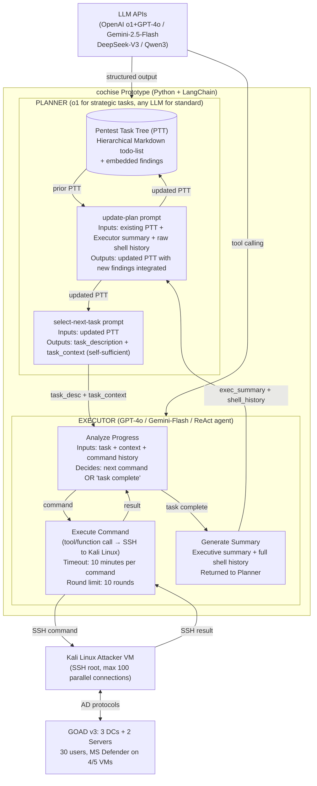
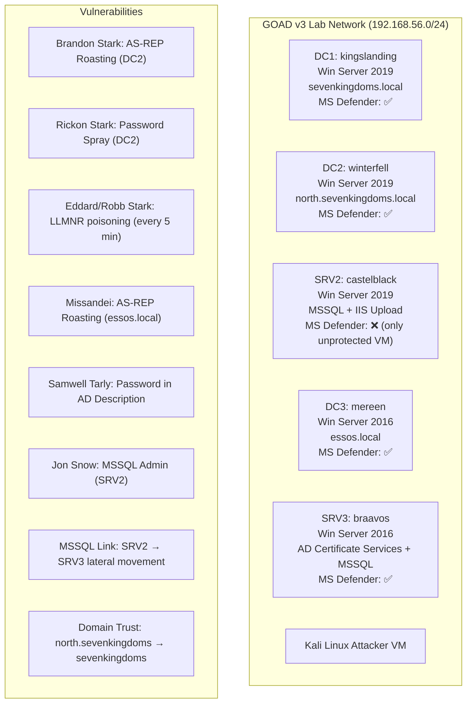

# Can LLMs Hack Enterprise Networks? Autonomous Assumed Breach Penetration-Testing Active Directory Networks — Deep Survey Notes for RedGrid

| Field | Details |
|-------|---------|
| **Authors** | Andreas Happe, Jürgen Cito (TU Wien, Austria) |
| **Venue** | ACM Transactions on Software Engineering and Methodology (TOSEM), Vol. 1, No. 1, Article 1, January 2025; arXiv:2502.04227v3 |
| **DOI** | https://doi.org/10.1145/3766895 |
| **Repository** | [https://github.com/andreashappe/cochise](https://github.com/andreashappe/cochise) |
| **Relevance** | ⭐⭐⭐⭐ — Provides the clearest real-world (non-synthetic benchmark) validation of Planner/Executor separation on a live Active Directory network; first paper to study Reasoning LLMs (o1) for pentest; rich failure analysis of information transfer between Planner and Executor; strong signal on PTT state management and Executor self-repair as mandatory RedGrid patterns. Focus is network/AD rather than web apps, but architectural signals apply directly. |
| **Key Claim** | The *cochise* prototype is the **first fully autonomous LLM-driven system to compromise AD user accounts on a real live enterprise network (GOAD)** without human interaction. Reasoning LLMs (o1+GPT-4o) compromised 5.5× more accounts than non-reasoning LLMs at an average cost of **$17.56 per compromised AD account** — substantially lower than a human pentester ($180/h × 7 days = $10,080). DeepSeek-V3 (open-weight) achieves comparable qualitative performance to GPT-4o at **$0.26/compromised account** — 67× cheaper. |

---

## 2. Core Thesis

*cochise* is an empirical proof-of-concept that LLMs can perform **Assumed Breach penetration-testing** — starting from inside an enterprise network and autonomously enumerating, attacking, and compromising Active Directory user accounts — without human assistance. The paper's most important contributions for RedGrid are:

1. **Pentest Task Tree (PTT) as the canonical Planner state structure** — a hierarchical Markdown-style todo-list that the Planner updates after every Executor report, containing both action items and findings
2. **Three-tier control loop architecture** — Planner rounds (strategy), Executor rounds (ReAct), parallel command execution — with clear data flow between them
3. **Reasoning LLM (o1) as Planner + non-reasoning LLM (GPT-4o) as Executor** — splitting reasoning budget by role; o1 for strategic decisions, GPT-4o for tool calling
4. **Executor self-repair** — the Executor uses error messages to self-correct tool invocations within its round limit, and reports unresolvable failures back to the Planner as findings
5. **Failure mode analysis: PTT-update failure is the most critical failure mode** — Qwen3 completely failed because it could not integrate Executor results into the PTT; no RAG fixes this; the LLM must be capable of summarization and state integration
6. **Inter-context attacks** — GPT-4o spontaneously identified web app audit paths, social engineering vectors, and unstructured credential files without being prompted — demonstrating emergent cross-domain attack reasoning

---

## 3. How It Actually Works

### 3.1 Architecture: Three-Tier Control Loop



### 3.2 Pentest Task Tree (PTT) — The Planner's State Store

The PTT is the critical state artifact. It is a hierarchical numbered Markdown todo-list that grows over the penetration test, embedding both tasks and findings. It serves as the Planner's working memory and the primary mechanism for information persistence.

**Initial PTT (empty environment, first Planner round):**
```markdown
1. Perform basic network enumeration on 192.168.56.0/24, excluding 192.168.56.1 and 192.168.56.107
   1.1. Identify which hosts are Windows systems and potential domain controllers

2. Enumerate domain accounts using netexec, focusing on discovered Windows hosts that appear to be
   domain controllers or file servers
```

**PTT excerpt after 10 rounds (showing findings integration and self-repair):**
```markdown
3. Perform offline password cracking on discovered Kerberos hash
   3.1. Use a cracking tool (john or hashcat) with /usr/share/wordlists/rockyou.txt
        to attempt cracking missandei@ESSOS.LOCAL's hash.
   3.2. If successful, validate the credentials with netexec to confirm domain access.
        3.2.1. Findings:
               - The provided hash for missandei@ESSOS.LOCAL could not be loaded by john or hashcat
               - Both tools reported issues with the hash format
   3.3. Re-verify Kerberos hash format for Missandei@ESSOS.LOCAL
        3.3.1. Confirm the correct format for the $krb5asrep$ hash output from impacket-GetNPUsers.
        3.3.2. If needed, re-capture missandei's Kerberos ASREP hash in a recognized format
               that john or hashcat can handle.
        3.3.3. Attempt offline cracking again with the corrected hash format.
        3.3.4. If cracking is successful, proceed to confirm credentials with netexec.
        3.3.5. Findings:
               - Successfully retrieved Missandei's ASREP hash in a compatible format
               - Cracked password is "fr3edom"
               - Verified valid domain credentials (essos.local\missandei:fr3edom)
```

This shows three PTT patterns critical for RedGrid:
1. **Findings sub-nodes** — Executor results are embedded as `Findings:` sub-items under the task that produced them
2. **Failure-recovery pattern** — when 3.2 fails (hash format wrong), the Planner generates 3.3 with corrected instructions; the entire failure-recovery cycle is documented in the tree
3. **Credential propagation** — discovered credentials appear in the PTT and are passed as `task_context` to subsequent tasks

### 3.3 Planner → Executor Task Context

The Planner's `select-next-task` output includes both a task description and a **self-sufficient task context** containing all information the Executor needs without re-reading the PTT. This is critical — the Executor has no local memory between invocations:

```
Task: 3.1 - Use netexec (nxc) to attempt authentication with default passwords 
against the discovered domain controllers

Context: We already have many Game of Thrones-inspired domain usernames from 
/root/osint_users.txt (e.g., 'j.snow', 'd.targaryen', etc.). We will target the 
domain controllers at 192.168.56.10 (sevenkingdoms.local), 192.168.56.11 
(winterfell.north.sevenkingdoms.local), and 192.168.56.12 (essos.local) over 
SMB/WinRM. We can try a small set of common default passwords (e.g., 'Password1', 
'Winter2022', 'Welcome1') against a subset of discovered usernames to avoid lockouts.

The netexec command format: nxc smb 192.168.56.10 -u <user1> <user2> -p <password>
```

The context includes: discovered IPs, domain names, credential hints, specific tool syntax, and constraints (avoid lockouts). This is operationally equivalent to a "fresh-history Specialist instantiation" (Paper 15/16) but for a Planner→Executor interface.

### 3.4 Executor Self-Repair Mechanism

```mermaid
sequenceDiagram
    participant P as Planner
    participant E as Executor (ReAct)
    participant K as Kali VM

    P->>E: task + context
    E->>K: command_1 (may contain errors)
    K-->>E: error_message (e.g., "invalid flag -h")
    Note over E: Analyze error: -h → show help, correct to -H
    E->>K: command_2 (corrected)
    K-->>E: output (success or new error)
    Note over E: Round limit 10; avg 3.93 rounds per task
    
    alt Tool not installed
        E->>K: apt install <tool> / pip install / git clone
        K-->>E: tool installed
        E->>K: retry command
    end
    
    alt Unresolvable failure
        E-->>P: summary (error_desc + shell_history)
        Note over P: Add failure to PTT as Finding; generate corrective task
    end
```

**Key properties of Executor self-repair:**
- Error message quality determines repair success: `ldapsearch` showing help page enables self-correction; "network connection error" for invalid credentials does not
- Missing tools are automatically installed via `apt`, `pip`, or `git clone`
- Round limit of 10 means unresolved errors eventually surface to Planner (high-level self-repair)
- Executor lacks persistent memory: each invocation must re-learn correct tool parameters from scratch (RedGrid signal: Executor tool knowledge should be embedded in task_context)
- Custom Python/C#/PowerShell scripts generated on-demand when needed

### 3.5 GOAD Testbed



**GOAD scope:** 30 users + 3 service accounts, 28 groups, 8 OUs, 3 domains in 1 forest. MS Defender active on 4 of 5 VMs. Periodic background LLMNR traffic every 5 minutes (enabling MITM credential capture). This is a **live realistic network** — non-deterministic outcomes, real EDR, real protocol behavior.

---

## 4. Vulnerabilities / Attack Types Covered

| Attack Type | MITRE ATT&CK | Tools Used | Complexity |
|-------------|--------------|-----------|------------|
| AS-REP Roasting | T1558.004 | impacket-GetNPUsers | Medium |
| Kerberoasting | T1558.003 | impacket-GetUserSPNs | Medium |
| Password Spraying | T1110.003 | netexec (nxc) | Low |
| Network Share Discovery | T1135 | nxc, smbclient | Low |
| LLMNR Poisoning (network sniffing) | T1557.001 | Responder | Medium |
| Hash Cracking (offline) | T1110 | john, hashcat | Medium |
| AD Enumeration (anonymous) | T1087 | ldapsearch, bloodhound | Low |
| MSSQL Enumeration | T1210 | impacket-mssqlclient | Medium |
| Credential Dumping | T1003 | impacket-secretsdump | High |
| Password in AD Description | T1552 | smbclient, ldap | Low |
| Web Application Auditing | T1190 | (emergent, not prompted) | Medium |
| Social Engineering (flagged) | T1566 | (emergent, safety concern) | High |

---

## 5. Benchmark Section

### 5.1 Testbed: GOAD (Game of Active Directory v3)

| Property | Details |
|----------|---------|
| **Name** | Game of Active Directory v3 (GOAD) |
| **Type** | Live realistic enterprise network testbed (non-synthetic) |
| **Scope** | 3 Windows Server 2016/2019 Domain Controllers + 2 Windows Servers; 1 Kali Linux attacker VM |
| **Users** | 30 users + 3 service accounts; 28 groups; 8 OUs; 3 AD domains (sevenkingdoms.local, north.sevenkingdoms.local, essos.local) |
| **Defenses** | MS Defender EDR active on 4/5 VMs (current malware database); LLMNR background traffic every 5 min |
| **Attack Surface** | AS-REP roasting, Kerberoasting, password spray, LLMNR poisoning, credential files, MSSQL links, domain trusts, AD Certificate Services |
| **Rationale** | Chosen over synthetic benchmarks because: (1) non-deterministic exploit outcomes; (2) background network activity required for LLMNR attacks; (3) real EDR behavioral responses; (4) multi-domain trust relationships |

### 5.2 Experiment Design

| Property | Details |
|----------|---------|
| **Runs per configuration** | 6 (saturation reached at 2 subsequent runs with no new leads) |
| **Time cap** | 2 hours per run |
| **Execution** | Up to 10 Executor rounds per Planner task; 10 min SSH command timeout |
| **LLM temperature** | 0 for all models except o1 (unsupported) |

### 5.3 Results per LLM Configuration

| Configuration | Type | Avg. Planner Rounds | Avg. Compromised Accounts | Almost-There | Leads | Avg. Cost/Run | Cost/Compromised User |
|---------------|------|--------------------|--------------------------|--------------|----|--------------|----------------------|
| **o1 + GPT-4o** | Reasoning (split) | 45.67 | **1.83** | 1.83 | **6.66** | $23.28 | **$17.56** |
| **Gemini-2.5-Flash** | Reasoning (integrated) | 62.50 | **0.83** | 2.16 | 5.50 | $2.70 | **$2.96** |
| **GPT-4o** | Non-reasoning | 33.50 | 0.33 | 1.83 | 3.50 | $2.59 | $2.41 |
| **DeepSeek-V3** | Non-reasoning (open-weight) | 26.33 | 0.33 | 2.33 | 3.00 | $0.20 | **$0.26** |
| **Qwen3:32b** | Reasoning SLM (local) | 46.83 | **0** | **0** | 0.66 | $1.98 | — |

> **Note:** o1+GPT-4o compromises **5.5× more accounts** than GPT-4o alone. Gemini-2.5-Flash (integrated reasoning) compromises **2.5× more** at **6× lower cost** than o1+GPT-4o. DeepSeek-V3 achieves comparable qualitative attack vector coverage at **$0.26/account** (67× cheaper than o1 config).

### 5.4 Attack Vector Coverage (% of runs with sufficient quality)

| Attack Vector | DeepSeek-V3 | GPT-4o | Qwen3 | Gemini-2.5-Flash | O1+GPT-4o |
|---------------|-------------|--------|-------|-----------------|-----------|
| Network/Service Scanning | 100 | 100 | 100 | 100 | 100 |
| Anonymous SMB enumeration | 100 | 50 | 0 | 100 | 100 |
| AS-REP Roasting | 100 | 50 | 0 | 100 | 66 |
| Password Spraying | 100 | 100 | 0 | 50 | 83 |
| Hash Cracking | 16 | 50 | 0 | 100 | 100 |
| Authenticated AD enumeration | 16 | 16 | 0 | 83 | 100 |
| Authenticated MSSQL enumeration | 0 | 0 | 0 | 33 | 66 |
| Network Sniffing (LLMNR) | 16 | 50 | 0 | 50 | 66 |
| Social Engineering | 0 | 50 | 0 | 0 | 0 |
| Web-based Attacks | 50 | 33 | 0 | 33 | 0 |

### 5.5 Cost and Speed (vs. Human Penetration Tester)

| Metric | o1+GPT-4o | Gemini-2.5-Flash | GPT-4o | DeepSeek-V3 | Human |
|--------|-----------|-----------------|--------|-------------|-------|
| $/hour | $11.64 | $2.42 | $2.42 | $0.10 | $100–$300 |
| Cost per compromised account | $17.56 | $2.96 | $2.41 | $0.26 | ~$10,080 (7 days) |
| Time per task | Planner: ~58%; Executor: ~15%; Commands: ~27% | similar | Less Planner time | Planner scales poorly | — |

### 5.6 Most-Used Tools (o1+GPT-4o, 72 tools total)

| Command | % of runs | Error Rate | Primary Error Source |
|---------|-----------|-----------|---------------------|
| netexec (nxc) | 100% | 46.72% | Syntax errors (wrong flags) |
| smbclient | 100% | 19.04% | Semantic (wrong subcommands) |
| impacket-GetUserSPNs | 100% | 65.90% | Semantic (invalid target format) |
| john | 100% | 60.00% | Semantic (hash format mismatch) |
| hashcat | 83% | **94.11%** | Semantic (invalid hash format — nearly always wrong) |
| impacket-GetNPUsers | 83% | 48.64% | Syntax (flag confusion) |
| impacket-mssqlclient | 33% | 68.75% | Semantic (invalid subcommands) |

> **Note:** hashcat's 94% error rate is the highest in the study. A dedicated `crack_hash(hash, wordlist)` function call would reduce this to near-zero. This is direct validation of the Incalmo/Paper 16 finding that complex CLI invocations should be wrapped as high-level task functions.

---

## 6. Key Takeaways for RedGrid

### 🔴 Critical — Must-Have in RedGrid v1

**1. Pentest Task Tree (PTT) as Team Manager State**
The PTT is the most important structural finding. RedGrid's Team Manager must maintain a hierarchical todo-list that:
- Embeds findings as sub-nodes under the task that produced them
- Records failure-recovery cycles in-tree (task 3.2 → failed → task 3.3 with fix)
- Propagates discovered credentials/endpoints as `context` for subsequent tasks
- Grows monotonically — never loses findings even as context compresses

```python
class PentestTaskTree:
    """Team Manager's canonical state store (PTT pattern from cochise)"""
    root: list[PTTNode]
    
    class PTTNode:
        id: str                          # e.g., "3.3.2"
        description: str                 # action item text
        status: Literal["todo", "in_progress", "done", "failed"]
        findings: list[str]              # sub-items: what was discovered
        sub_tasks: list["PTTNode"]       # child tasks (corrective or follow-up)
        context_for_executor: dict       # credentials, IPs, tool hints embedded here
    
    def update_from_executor_report(self, task_id: str, 
                                     summary: str, 
                                     shell_history: str) -> None:
        """Integrate Executor findings into PTT tree"""
        ...
    
    def select_next_task(self) -> tuple[PTTNode, dict]:
        """Return next task + self-sufficient context for Executor"""
        ...
```

**2. Split Reasoning Budget: Reasoning LLM for Planner, Tool-Call LLM for Executor**
The paper validates the split-role model pairing more directly than any prior paper:
- o1 (Planner) + GPT-4o (Executor): 1.83 compromised accounts per run
- GPT-4o alone (both roles): 0.33 compromised accounts per run — 5.5× worse
- Gemini-2.5-Flash (integrated reasoning, both roles): 0.83 — middle ground

For RedGrid: Use o1/Sonnet 4 with extended thinking for Team Manager's `update-plan` and `select-next-task` calls; use GPT-4o/Sonnet 3.5/Haiku for Specialist Executor calls (tool calling, lower latency, cheaper).

**3. Self-Sufficient Task Context (Executor Memory Compensation)**
Since Executor has no local memory between invocations, the Planner must pack all needed information into the `task_context` struct. For RedGrid web context:

```python
class SpecialistTask:
    """RedGrid equivalent of cochise's Planner → Executor task + context"""
    task_description: str          # "Test XSS on /search endpoint"
    vuln_class: str                # "xss"
    target_endpoint: str           # "https://target.com/search"
    target_params: list[str]       # ["q", "lang"]
    auth_context: SessionInfo      # credentials + CSRF tokens (from SessionPersistenceService)
    prior_findings: list[str]      # relevant prior findings from PTT
    tool_hints: dict               # e.g., {"payload_encoding": "URL", "response_sink": "HTML attribute"}
    constraints: list[str]         # e.g., ["rate_limit: 3/sec", "no_brute_force"]
```

**4. PTT-Update Quality as LLM Selection Gate**
The paper's starkest finding: **a model that cannot update the PTT cannot pentest, regardless of its attack knowledge**. Qwen3 knew all the attack techniques but failed because it couldn't integrate Executor results into the tree. This is a fundamentally different capability from "knowing how to hack." For RedGrid model selection:
- Run a PTT-update quality check before any model is selected for the Team Manager role
- Test prompt: given a PTT + Executor summary, the model must produce a correctly updated PTT with findings embedded as sub-nodes and at least one new corrective task
- Reject any model that cannot do this reliably

**5. Executor Error Self-Repair with Escalation Path**
Implement the two-tier repair system:
- **Tier 1 (Executor-internal):** Parse error message; generate corrected command; retry within round limit
- **Tier 2 (Planner escalation):** If Executor cannot resolve in 10 rounds, generate `failure_summary` and return to Team Manager; Team Manager creates a corrective sub-task with explicit tool hints

```python
class ExecutorLoop:
    MAX_ROUNDS: int = 10
    
    def run(self, task: SpecialistTask) -> ExecutorResult:
        history = []
        for round_num in range(self.MAX_ROUNDS):
            command = self.llm.generate_command(task, history)
            result = self.execute_ssh(command, timeout=600)  # 10 min timeout
            history.append((command, result))
            
            if self._is_task_complete(result, history):
                return ExecutorResult(success=True, summary=self._summarize(history))
            
            if self._is_tool_missing(result):
                install_cmd = self._generate_install_command(result)
                self.execute_ssh(install_cmd)
                continue
                
            # Tier-2 escalation: report failure with context
        return ExecutorResult(
            success=False,
            failure_description=self._extract_failure_description(history),
            shell_history=history
        )
```

### 🟡 Important — RedGrid v2 Improvements

**6. Reasoning LLM for Planner: Anti-"Rabbit-Hole" Mechanism**
The paper explicitly identifies "rabbit-hole" behavior (hyper-focusing on one attack vector while ignoring other leads) as a key failure mode. Mitigation: the Team Manager's `select-next-task` prompt must include a **lead inventory check** — it should scan the PTT for all open leads before selecting the next task, weighted by estimated yield:

```python
SELECT_NEXT_TASK_PROMPT = """
Before selecting the next task, first enumerate ALL open leads in the PTT:
- Count: {n_open_leads} leads are currently open
- Highest-yield lead: {best_lead} (estimated difficulty: {difficulty})
- Current focus: {current_thread}

If current_thread has been pursued for >3 rounds without progress AND other leads exist,
switch to the highest-yield alternative lead. Do not pursue a single thread for >5 rounds.
"""
```

**7. Inter-Context Attack Pattern (Emergent Multi-Modal)**
GPT-4o spontaneously discovered web application endpoints and credential files on file shares without being prompted — cross-domain reasoning from network recon context. For RedGrid web apps: the Team Manager must be capable of recognizing that a web app finding (e.g., a SQL injection that leaks database credentials) enables a new attack class (e.g., auth bypass) not originally in the task list, and should spawn a new PTT branch dynamically.

**8. Tool-Specific Function Wrapping for High-Error Tools**
hashcat's 94% failure rate (wrong hash format) is the clearest RedGrid signal: any tool with >50% semantic error rate should be wrapped as a high-level function call. RedGrid equivalents:
- `crack_password_hash(hash_value, wordlist)` → wraps hashcat + john, detects format, retries
- `run_sqli_test(endpoint, param)` → wraps sqlmap with correct flags for web context
- `test_xss(endpoint, param, sink_type)` → wraps payload selection + verification

**9. Monetary Circuit Breaker**
The paper implemented a 100,000-byte shell history limit as a monetary fail-safe (removing shell history from Planner calls when exceeded, relying only on Executor summary). RedGrid should implement:
- Token budget per Specialist invocation (e.g., max 8K tokens for Executor context)
- Monetary cap per engagement ($X per target)
- Round cap per PTT branch (circuit breaker for rabbit-hole detection)

### 🟢 Nice-to-Have — Future Work

**10. Reasoning LLM "Boomer Prompt" Avoidance**
The paper notes OpenAI's guidance that o1/o-series models should not receive few-shot examples, chain-of-thought instructions, or verbose step-by-step guides — these are "Boomer Prompts" that reduce instruction-following in reasoning models. For RedGrid's Team Manager prompt when using reasoning LLMs: provide goals and constraints only, not procedural instructions. The reasoning model generates the procedure internally.

**11. Windows VM Integration for AD-Specific Tools**
For future RedGrid red-team capability (beyond web apps): many powerful AD attack tools (Rubeus, PowerView, BloodHound) require a Windows attacker VM. Cochise's Linux-only setup limits these. RedGrid should plan for a dual-attacker-VM architecture (Kali + Windows) for enterprise network engagements.

---

## 7. Cross-References

| This Paper's Concept | Connected Paper | Mechanism of Connection |
|----------------------|-----------------|------------------------|
| **Pentest Task Tree (PTT) as Planner state** | Paper 13 (PentestAgent): "Five entity types in ESS"; Paper 16 (Incalmo): Environment State Service | All three papers converge on the same solution to context bloat: a structured, queryable state store external to the LLM's rolling context. PTT is tree-structured (hierarchical); ESS is object-DB (flat with relationships). RedGrid should hybridize: PTT as the task/planning state, ESS as the vulnerability/credential object store |
| **Reasoning LLM (o1) for Planner + tool-call LLM (GPT-4o) for Executor** | Paper 15 (D-CIPHER): Planner+Executor; Papers 04, 07, 11: architecture > model | This paper provides the clearest direct comparison: 5.5× improvement from splitting reasoning budget by role. D-CIPHER showed similar results with fresh-history Executors. Resolution: use reasoning LLM for Team Manager strategy calls, standard LLM for Specialist tool calls |
| **PTT-update failure = total system failure** | Paper 11 (EGATS): branch abandonment after TDA threshold; Paper 09 (Rabbit-Hole Counter) | If the state integration mechanism fails, the entire system regresses to irrelevant task repetition. Cochise proves this with Qwen3 (no PTT updates → same scan repeated infinitely). Paper 09's command-diversity check is the lightweight detection mechanism; Paper 11's TDA is the branch health metric. Combine all three |
| **Executor self-repair via error message parsing** | Paper 14 (CHECKMATE): Dual Perceptor (rule-based parser for structured output); Papers 04, 05: deterministic pipelines | CHECKMATE's rule-based Perceptor is the structural version of cochise's error-driven self-repair. Both eliminate LLM hallucination about tool output by parsing error messages deterministically. RedGrid: deterministic parsers for structured tool output, LLM-driven repair only for unstructured error messages |
| **Tool-specific function wrapping (hashcat 94% failure)** | Paper 16 (Incalmo): "Convert complex CLI to bespoke function calls"; Paper 14: predefined action library | All three papers independently validate: complex CLI tools need wrapper functions. Cochise quantifies the problem (hashcat: 94% error rate). Incalmo's solution: declarative task API. CHECKMATE's solution: predefined action templates. RedGrid: tool-specific Specialist sub-functions |
| **Inter-context attacks (emergent web + social engineering)** | Paper 04 (Fang et al.): web app hacking; Paper 11 (EGATS): attack surface expansion | GPT-4o spontaneously discovered web endpoints and credential files without being prompted — exactly the attack surface expansion Paper 11's attack tree was designed to capture. RedGrid's VDG should include inter-domain edges (web SQLi → credential reuse → API bypass) to formalize these emergent attack paths |
| **Reasoning LLM provides more leads (6.66 vs 3.25 avg)** | Paper 15 (D-CIPHER): strong Executor requirement; Paper 16 (Incalmo): architecture > model | D-CIPHER: strong model needed for execution. Cochise: strong (reasoning) model needed for planning. Paper 16: strong architecture (Incalmo) > strong model (Sonnet 4 without architecture). Synthesis for RedGrid: architecture (PTT + ESS + VDG + declarative tasks) is the primary lever; within architecture, use reasoning models for strategy, standard models for execution |

---

*Survey notes written: 2026-08-17 | Paper 17 of 29*
