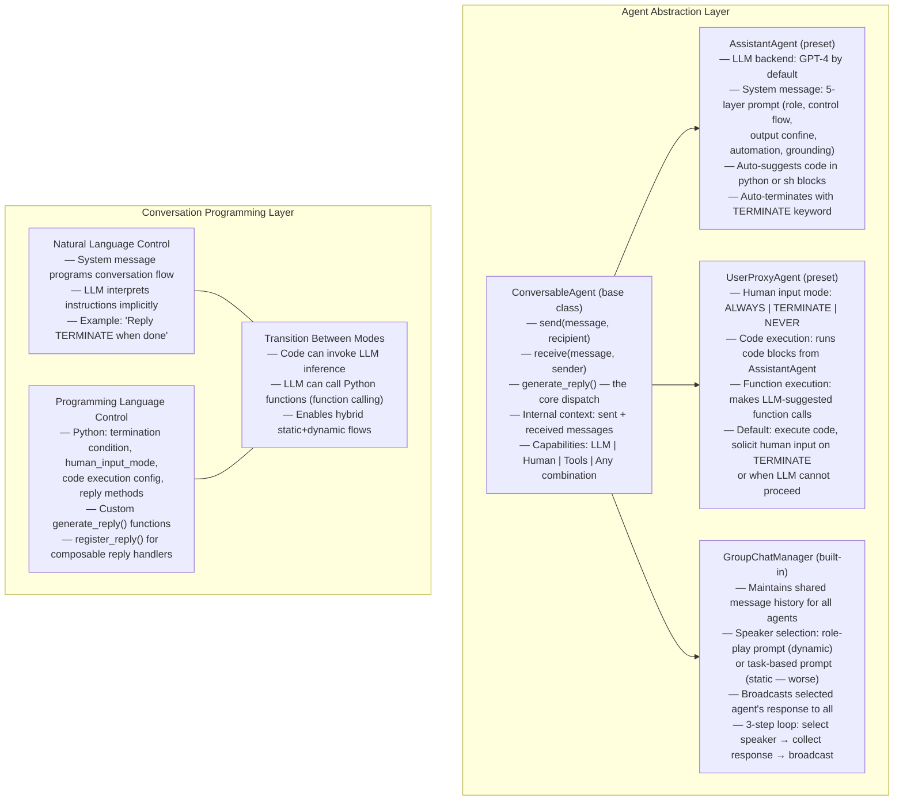
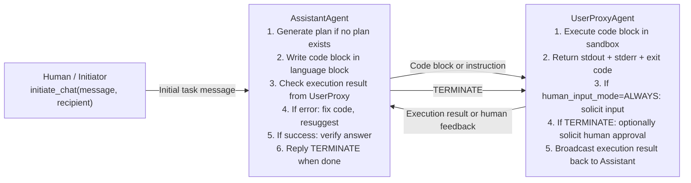
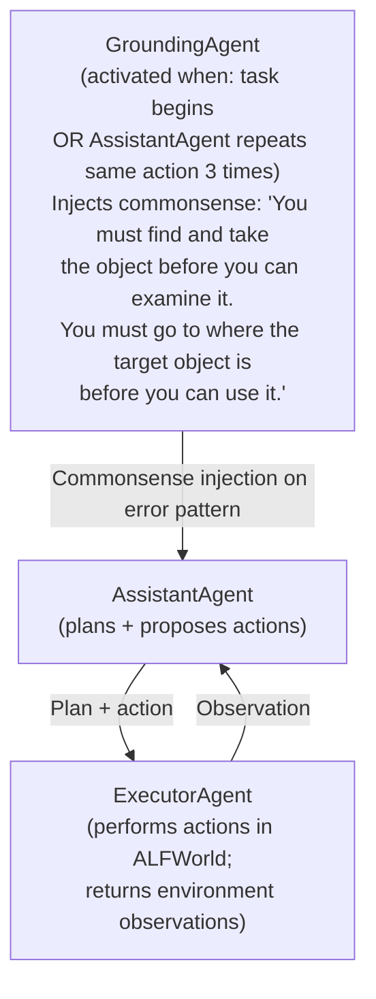
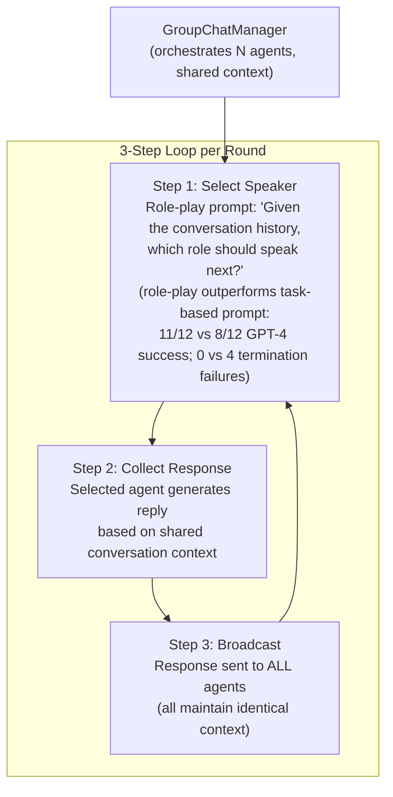
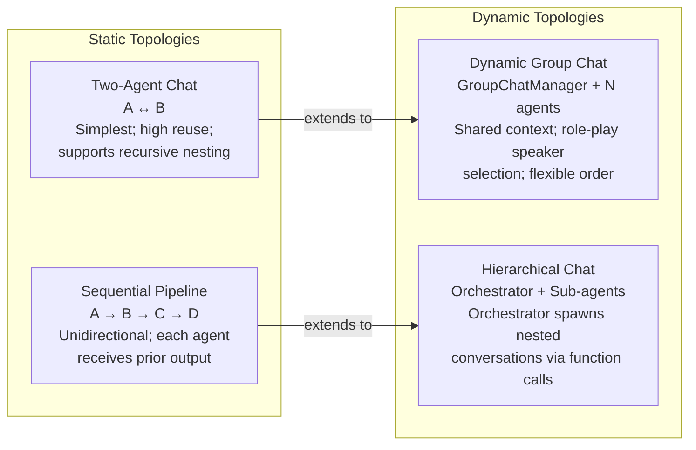

# AutoGen: Enabling Next-Gen LLM Applications via Multi-Agent Conversation — Deep Survey Notes for RedGrid

| Field | Details |
|-------|---------|
| **Authors** | Qingyun Wu, Gagan Bansal, Jieyu Zhang, Yiran Wu, Beibin Li, Erkang Zhu, Li Jiang, Xiaoyun Zhang, Shaokun Zhang, Jiale Liu, Ahmed Awadallah, Ryen W. White, Doug Burger, Chi Wang (Microsoft Research, Penn State, UW, Xidian University) |
| **Venue** | arXiv preprint arXiv:2308.08155 / ICLR 2024 |
| **Published** | 2023 (August) |
| **Repository** | https://github.com/microsoft/autogen |
| **Relevance** | ⭐⭐⭐☆☆ — AutoGen is the foundational multi-agent infrastructure framework on which many VAPT systems (Papers 03, 12, 13, 15, 16) are built. Understanding its primitives (ConversableAgent, UserProxyAgent, GroupChatManager, conversation programming) is essential for RedGrid's orchestration layer and human-in-the-loop design, though the paper itself is domain-agnostic. |
| **Key Claim** | AutoGen's two-agent AssistantAgent+UserProxyAgent achieves **69.48% on the full MATH dataset** (vs GPT-4 alone at 55.18%); adding a third Grounding Agent to ALFWorld yields **+15 pp** improvement (54%→69% average); multi-agent OptiGuide reduces code from **430 lines to 100 lines** (4× reduction); multi-agent design boosts unsafe-code detection F1 by **+35 pp** over single-agent with GPT-3.5-turbo. |

---

## Core Thesis

AutoGen's central claim is that complex LLM application workflows can be **unified as multi-agent conversations**: instead of building bespoke orchestration code for each task, every workflow is expressed as a sequence of messages between conversable agents. The framework provides two primitives — `ConversableAgent` (agent abstraction with unified send/receive/generate_reply interface) and conversation programming (controlling who speaks when, via natural language or Python code) — from which arbitrarily complex multi-agent topologies can be composed.

The key insight driving the design is that chat-optimized LLMs (GPT-4 class) are remarkably good at incorporating feedback through conversation, which means that the "plan → execute → observe → repair" loop that makes single-agent systems work can be extended to multiple agents simply by having them converse. This collapses what would otherwise be complex orchestration code (if-else logic, state machines, callback handlers) into LLM-driven conversation routing. The auto-reply mechanism — where receiving a message automatically triggers `generate_reply` — is the single mechanism that enables both simple two-agent feedback loops and complex dynamic group chats without changing the agent abstraction.

For RedGrid specifically, AutoGen is the **infrastructure layer** that Papers 03, 12, 13, and 16 build on top of. Understanding AutoGen's design choices — particularly the `AssistantAgent`/`UserProxyAgent` split, the `GroupChatManager` for dynamic speaker selection, the `human_input_mode` parameter, and the system message prompt structure — is essential for RedGrid's orchestration layer. RedGrid will not use AutoGen directly (it needs tighter FSM control from Paper 05 and security-specific patterns), but it inherits AutoGen's agent conversation primitives and extends them with security-specific control structures.

---

## How It Actually Works

### Core Architecture: Two Primitives



---

### The Two-Agent Conversation Pattern (Foundational Loop)



**Concrete output from Math problem solving (Appendix E)**:
```python
# AssistantAgent generates:
from sympy import sqrt
fraction = (sqrt(160)/sqrt(252))*(sqrt(245)/sqrt(108))
simplified = fraction.simplify()
print(simplified)

# UserProxyAgent executes and returns:
# exitcode: 0 (execution succeeded)
# Code output: 5*sqrt(42)/27
# TERMINATE
```
Result: **correct symbolic answer**, whereas LangChain ReAct returns decimal `1.2001...` (wrong), Multi-Agent Debate returns `7√1050/189` (wrong), AutoGPT fails due to missing `print` statement.

---

### The Grounding Agent Pattern (Third-Agent for Domain Knowledge)



**Result**: Adding Grounding Agent → +15 pp on ALFWorld (54%→69% avg, 63%→77% best-of-3). The grounding agent activates on **detected error loops** (same action repeated 3×), injecting domain constraints that the planner was ignoring.

**RedGrid implication**: This is the same pattern as RedGrid's Rabbit-Hole counter (Papers 09, 17) — detecting repeated actions — but here the response is **injecting corrective knowledge** rather than forcing FSM transition. Both mechanisms should exist: knowledge injection (Paper 19) + forced transition (Papers 09, 17).

---

### GroupChatManager — Dynamic Speaker Selection



**Comparison of speaker selection strategies (12 tasks)**:
- Role-play prompt (dynamic): GPT-4 **11/12** success, **0** termination failures, **4.5** avg LLM calls
- Task-based prompt: GPT-4 **8/12** success, **4** termination failures, **4.0** avg LLM calls
- Two-agent baseline: GPT-4 **9/12** success, **3** termination failures, **6.8** avg LLM calls

> **Key finding**: Role-play prompt consistently beats task-based prompt despite fewer LLM calls per task. Dynamic speaker selection requires the right prompting strategy.

---

### AssistantAgent Default System Message (5-Layer Structure)

The default AssistantAgent system message in AutoGen v0.1.1 encodes five distinct prompting techniques simultaneously:

| Layer | Example | Purpose |
|-------|---------|---------|
| **Role Play** | "You are a helpful AI assistant" | Persona + capability declaration |
| **Control Flow** | "Solve the task step by step. If a plan is not provided, explain your plan first." | Determines when to plan vs. execute |
| **Output Confine** | "Don't include multiple code blocks in one response. Use print for output." | Constrains format for machine parsing |
| **Facilitate Automation** | "The user cannot provide any other feedback... Don't suggest incomplete code." | Tells agent to produce complete, runnable code |
| **Grounding** | "If the result indicates there is an error, fix the error and output the code again." | Self-repair instruction |

Terminal keyword: `Reply "TERMINATE" in the end when everything is done.`

The paper notes: **GPT-4 follows these instructions significantly better than GPT-3.5-turbo**. This is the most important practical finding for RedGrid's system prompt design.

---

### Conversation Topology Comparison



---

## Vulnerabilities Exploited

Not applicable — AutoGen is a general-purpose infrastructure framework. It has been applied to math problem solving, code generation, question answering, decision making, and chess. No vulnerability exploitation is demonstrated in the paper itself. Papers 03, 12, 13, 16, and 18 apply AutoGen (or AutoGen-inspired patterns) to security tasks.

---

## Benchmark Section

### Benchmarks Used

| Benchmark | Task | Method | Result | Baseline |
|-----------|------|--------|--------|----------|
| **MATH Dataset (120 level-5 problems)** | Symbolic math problem solving | AssistantAgent+UserProxyAgent (GPT-4) | **52.5%** | GPT-4 vanilla: 45.0%; Multi-Agent Debate: 26.67%; LangChain ReAct: 23.33%; ChatGPT+Code: 30.0% |
| **MATH Dataset (5000 full test set)** | Symbolic math problem solving | AssistantAgent+UserProxyAgent (GPT-4) | **69.48%** | GPT-4 vanilla: 55.18% (+14.3pp) |
| **Natural Questions (6,775 queries)** | Open-domain QA with retrieval | RAG Chat (interactive retrieval) | **66.65% F1** | No interactive retrieval: 62.59%; DPR: 58.56% |
| **ALFWorld (134 tasks)** | Text-world interactive decision making | 3-agent (+ GroundingAgent) | **69% avg / 77% best-of-3** | 2-agent: 54%/63%; ReAct: 54%/66% |
| **OptiGuide (100 coding tasks)** | Safe code generation + safety check | 3-agent (Commander+Writer+Safeguard) GPT-4 | **98% F1** (safe/unsafe) | Single-agent GPT-4: 96% F1 |
| **OptiGuide (100 coding tasks)** | Safe code generation + safety check | 3-agent GPT-3.5-turbo | **88% F1** (+35pp) | Single-agent GPT-3.5: 83% F1; Recall: 72% vs 48% |
| **Dynamic Group Chat (12 tasks)** | Complex multi-step tasks | 4-agent group + role-play speaker | **11/12 GPT-4** | Two-agent: 9/12; Task-based speaker: 8/12 |
| **MiniWob++ (web manipulation)** | Browser interaction tasks | MiniWobChat (2-agent) | **52.8% success** | RCI (specialized): 56.4% (only 3.6% gap) |

> **Note**: The most important result for RedGrid is the ALFWorld grounding agent experiment — adding a third specialist agent for domain knowledge injection yields +15pp. This generalizes: specialized "knowledge injection" agents are more effective than stuffing all knowledge into a single agent's system prompt.

### System Comparison Table (from paper Table 1)

| Aspect | AutoGen | Multi-Agent Debate | CAMEL | BabyAGI | MetaGPT |
|--------|---------|-------------------|-------|---------|---------|
| Generic Infrastructure | ✓ | ✗ | ✓ | ✗ | ✗ |
| Conversation Pattern | **Flexible** | Static | Static | Static | Static |
| Execution-Capable | ✓ | ✗ | ✗ | ✗ | ✓ |
| Human Involvement | Chat/Skip | ✗ | ✗ | ✗ | ✗ |

> **Note**: CAMEL fails to solve math problems because it lacks tool/code execution capability. This confirms RedGrid's design decision: LLM-only multi-agent systems without execution grounding are insufficient for security tasks (see also Paper 18's −41.6pp ablation on removing execution feedback).

---

## Key Takeaways for RedGrid

### 🔴 Critical — Must-have in RedGrid v1

**1. Agent Interface Standard: send/receive/generate_reply**
RedGrid must implement the same unified agent interface as AutoGen's `ConversableAgent`: every agent exposes `send(message, recipient)`, `receive(message, sender)`, and `generate_reply() → message`. This unified interface is what enables composable, reusable agent topologies without bespoke integration code. RedGrid's Layer 3 Specialists should all implement this interface, allowing the Layer 2 Team Manager to dispatch to any specialist via the same API.
```python
class RedGridAgent:
    def send(self, message: dict, recipient: "RedGridAgent") -> None: ...
    def receive(self, message: dict, sender: "RedGridAgent") -> None: ...
    def generate_reply(self, messages: list[dict]) -> dict | None: ...
```

**2. UserProxyAgent Pattern: Separation of Code Generation from Code Execution**
RedGrid must enforce strict separation between the agent that generates commands/code (AssistantAgent equivalent = LLM Specialist) and the agent that executes them (UserProxyAgent equivalent = Execution Agent). The Execution Agent's job is: execute code, return stdout+stderr+exit_code as structured message, never re-interpret the result. This matches RedGrid's Validation→Execution→Evaluation pipeline from Paper 18 and the role-scoped tool whitelist from Paper 15. The LLM never executes; the executor never reasons.

**3. 5-Layer System Message Structure for All Specialist Agents**
Every RedGrid Specialist agent's system prompt must include all five layers from AutoGen's AssistantAgent prompt:
- **Role Play**: "You are a Senior SQL Injection Specialist..."
- **Control Flow**: "If no plan exists, create one first. Work step by step."
- **Output Confine**: "Output only one command per response. Use JSON for findings."
- **Facilitate Automation**: "Generate complete, runnable commands. Never generate partial commands requiring modification."
- **Grounding**: "If execution returns an error, analyze the error, adjust the approach, and generate a corrected command."

Missing any layer degrades reliability (GPT-4 follows all five; GPT-3.5-turbo follows them less reliably — use GPT-4-class models for specialists).

**4. Domain Knowledge Grounding Agent (Third Specialist for Error Recovery)**
The ALFWorld experiment proves that a dedicated "grounding agent" that injects domain-specific constraints when error patterns are detected outperforms stuffing all knowledge into one system prompt. In RedGrid: implement a Domain Knowledge Agent per vuln class that activates when a Specialist has repeated the same type of action 3× without progress. The Domain Knowledge Agent injects authoritative knowledge: "SSRF requires the payload to reach an internal endpoint. Confirm with `curl http://internal-target` first." This is complementary to (not a replacement for) the Rabbit-Hole counter from Papers 09/17.

**5. Human-in-the-Loop via `human_input_mode` Equivalent**
RedGrid must implement configurable human involvement identical to AutoGen's `human_input_mode: ALWAYS | TERMINATE | NEVER`:
- `NEVER`: Fully autonomous mode (default for automated VAPT)
- `TERMINATE`: Human approval required before final report is emitted (default for production VAPT)
- `ALWAYS`: Human reviews every specialist action (training/auditing mode)
This maps directly to Paper 12's `action_type: escalate` and Paper 11's `ESCALATE_TO_OPERATOR`. The difference: AutoGen's model is at the conversation level; RedGrid's should be at the FSM state level.

### 🟡 Important — RedGrid v2

**6. Hierarchical Chat for RedGrid Orchestration Layer**
The hierarchical conversation pattern (Orchestrator → Team Manager → Specialist nested conversations) maps directly to RedGrid's 4-layer architecture. Implementation: Team Manager initiates a nested conversation with each Specialist via `initiate_chat(specialist, message=task_context)`; Specialist returns its result as the conversation summary; Team Manager incorporates result into PTT. This keeps Specialist contexts isolated while maintaining Team Manager's global state — aligning with Paper 10's session isolation design.

**7. Role-Play Speaker Selection for Dynamic Dispatch**
When RedGrid's Team Manager needs to select the next specialist for a given finding, use a role-play style prompt (not task-based): "Given the current penetration testing state and findings, which specialist role should investigate next: [list with descriptions]?" AutoGen's ablation shows role-play beats task-based by 3/12 tasks and eliminates termination failures. The Team Manager's dispatch prompt should frame specialists as roles in a red team exercise, not as task executors.

**8. Interactive RAG with "Update Context" Signal**
AutoGen's RAG system introduces an "Update Context" protocol: when the LLM cannot find relevant information in the retrieved context, it signals `UPDATE CONTEXT` which triggers another retrieval round. RedGrid's Two-Stage RAG (Paper 12) should incorporate this: if the Specialist cannot find a matching exploit procedure in the Procedure DB (Tier 2 from Paper 13), it signals `RETRIEVAL_FAILED` to trigger a broader search before declaring no exploit available. 19.4% of queries benefit from this — significant for an exploitation system.

**9. register_reply() Composable Reply Handler Pattern**
AutoGen's `register_reply()` method allows adding reply functions to agents at runtime, with each function checked in priority order until one returns a non-None response. RedGrid should implement the same pattern for Specialists: register handlers for known error patterns (e.g., `404_handler`, `auth_failure_handler`, `timeout_handler`) that fire before the default LLM handler, enabling deterministic error recovery without LLM calls for common cases. Maps to Paper 05's Rule States.

**10. LLM Inference Layer: Caching, Error Handling, Token Tracking**
AutoGen's enhanced LLM inference layer provides: result caching (identical prompts return cached responses), error handling (retry on rate limits), message templating, and token tracking. RedGrid must implement equivalent features before production deployment — especially caching (for repeated recon queries) and token tracking (for per-mission cost accounting from Paper 03).

### 🟢 Nice-to-Have

**11. Natural Language as Control Flow Medium**
AutoGen demonstrates that complex control flows (when to request human input, when to terminate, when to retry) can be encoded in natural language system messages rather than explicit Python if-else logic. For RedGrid's simpler control decisions (e.g., "if you have tried 3 payloads and all failed, stop and summarize what you learned"), natural language instructions in system messages are often sufficient and faster to iterate than FSM code.

**12. Composability via Nesting and Function Calls**
AutoGen's `GroupChatManager` can be used as a sub-agent within a larger conversation — enabling nested multi-agent conversations. RedGrid could use this pattern for complex sub-tasks (e.g., a full SQLi extraction sub-mission as a nested group chat between Recon + Exploit + Verify agents) while the outer Team Manager treats the whole sub-mission as a single agent interaction.

**13. Human Study: 3× Time Saving as RedGrid ROI Metric**
The OptiGuide case study quantifies AutoGen's value: 3× time saving for users, 3–5× fewer manual interactions. RedGrid should establish equivalent ROI metrics for VAPT: time-to-first-finding, manual interactions required per engagement, and cost-per-confirmed-vulnerability — to quantify the value of automation over manual pentesting.

---

## Cross-References

| This Paper's Idea | Connected Paper(s) | Mechanism of Connection |
|-------------------|--------------------|------------------------|
| **AssistantAgent + UserProxyAgent two-agent loop** | Papers 03, 12, 13, 16, 18 | All four papers build directly on AutoGen's two-agent pattern. Paper 03 uses AssistantAgent+UserProxyAgent for web pentesting. Paper 12 (VulnBot) uses AutoGen's agent classes. Paper 18 (CO-REDTEAM) independently arrives at the same Planner→Execution split. The two-agent pattern is the universal foundation; RedGrid's Layer 3→4 relationship is the security-specific instantiation. |
| **Grounding Agent for error-loop detection + knowledge injection** | Papers 09, 17 (Rabbit-Hole counter), Paper 18 (memory retrieval on BLOCKED step) | Paper 09's Rabbit-Hole counter detects repeated actions and forces FSM transition. Paper 17's lead inventory check detects single-vector focus. AutoGen's Grounding Agent also detects repeated actions (same action 3×) but responds with **knowledge injection** rather than FSM transition. Paper 18's memory retrieval on BLOCKED steps also provides knowledge injection. The correct RedGrid design uses all three in sequence: detect → inject knowledge → if still stuck, force FSM transition. |
| **5-Layer system message structure** | Paper 09 (verification framing), Paper 10 (two-step CoT + four-layer prompt discipline), Paper 13 (four-technique prompt discipline) | Paper 09 mandates verification framing (Role-Play layer). Paper 10's four-layer prompt discipline (Role-play, CoT, RAG, Structured Output) is an extension of AutoGen's 5 layers. Paper 13's four-technique discipline is nearly identical. AutoGen is the origin point for this multi-layer prompt design — all security-specific refinements build on its foundation. |
| **GroupChatManager dynamic speaker selection** | Papers 02, 15 (D-CIPHER Team Manager), Paper 16 (Incalmo orchestrator) | Paper 02's Team Manager selects the next specialist based on findings. Paper 15's D-CIPHER uses a similar orchestrator for CTF challenges. Paper 16's Incalmo orchestrator dispatches deterministic agents. AutoGen's role-play speaker selection (11/12 vs 8/12 tasks) explains WHY Papers 02/15 use LLM-based dispatch: it outperforms rule-based dispatch for complex, context-dependent routing decisions. |
| **human_input_mode configurable human involvement** | Papers 11, 12 (action_type: escalate), Paper 16 (human escalation) | Paper 11's `ESCALATE_TO_OPERATOR` and Paper 12's `action_type: escalate` are both FSM-level instantiations of AutoGen's `human_input_mode` at the conversation level. AutoGen provides the general mechanism; security papers provide the trigger conditions (TDI > 0.8, captcha/MFA, ambiguous GUI). RedGrid must merge both: AutoGen-style configurable modes + Paper 11/12-style condition triggers. |
| **Interactive RAG with "Update Context" signal** | Papers 01, 02, 04, 07, 12 (Two-Stage RAG) | Prior papers use one-shot RAG retrieval. AutoGen's interactive retrieval adds a feedback loop: when the LLM cannot answer from retrieved context, it signals for more retrieval. Paper 12's Two-Stage RAG (cosine top-20 → cross-encoder top-3) adds ranking precision. The ideal RedGrid RAG combines both: two-stage ranking (Paper 12) + interactive update-context loop (Paper 19) for cases where the top-3 results are still insufficient. |
| **Code execution capability as prerequisite** | Papers 14, 16, 18 (execution feedback primacy) | AutoGen identifies CAMEL's failure mode: "primarily because it lacks the capability to execute tools or code." Paper 14 shows 0/10 success without action library. Paper 18 shows −41.6pp without execution feedback. AutoGen's insight predates and explains all these results: LLM reasoning alone is insufficient; execution grounding is the load-bearing capability. |

---

*Survey note written for RedGrid systematic literature review.*
*Paper 19 of 29 — next: Paper 20 (MetaGPT: Meta-Programming for Multi-Agent Frameworks)*
