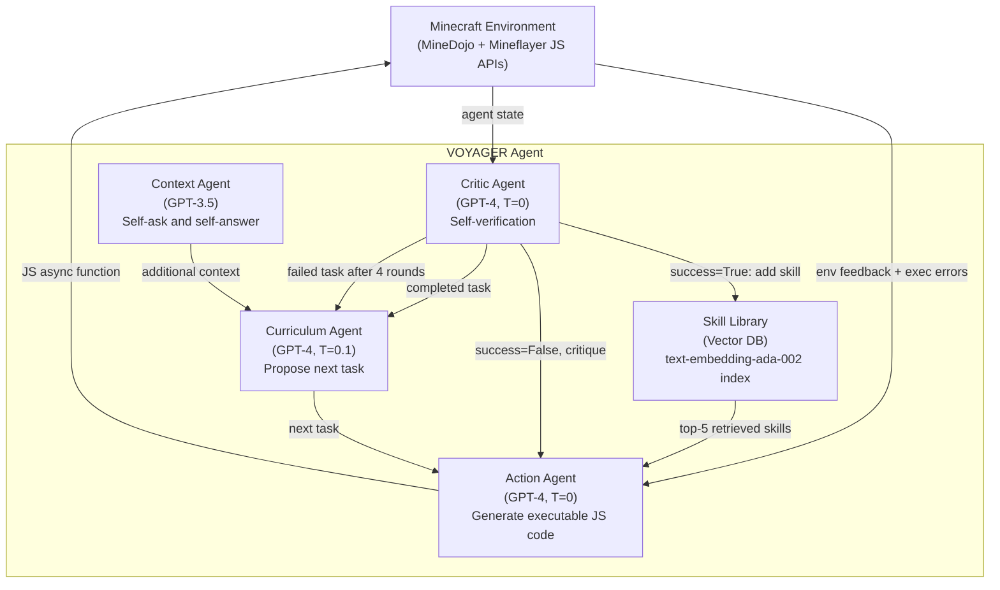
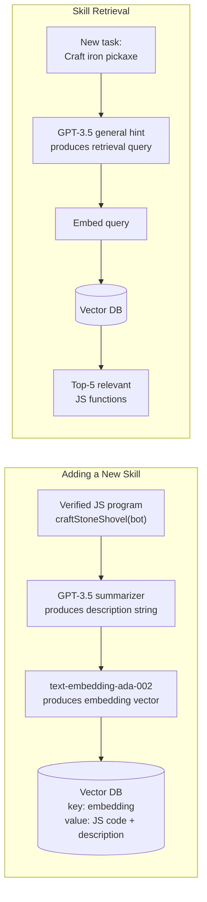
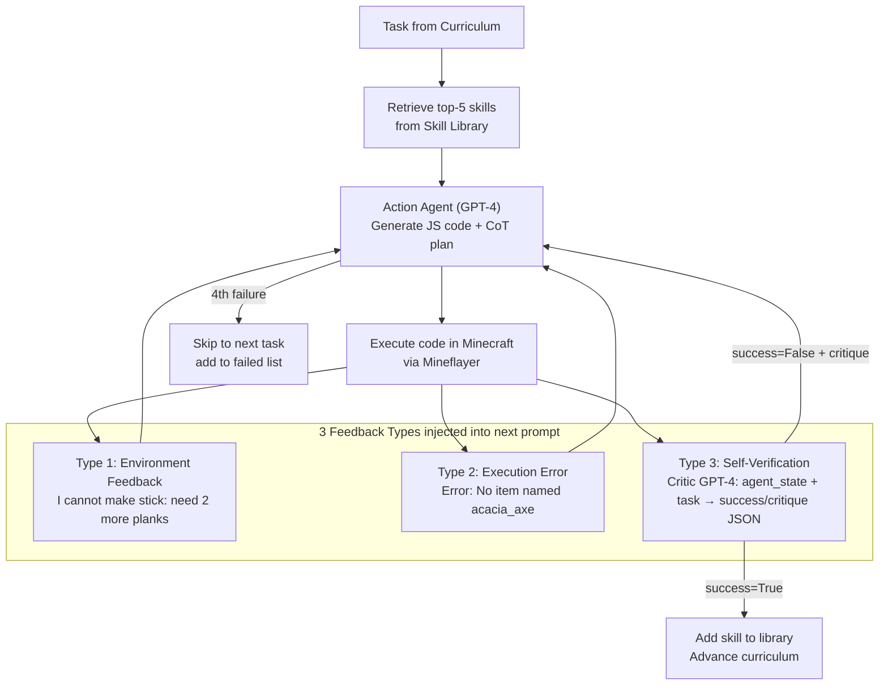

# Voyager: An Open-Ended Embodied Agent with Large Language Models — Deep Survey Notes for RedGrid

| Field | Details |
|-------|---------|
| **Authors** | Guanzhi Wang (NVIDIA, Caltech), Yuqi Xie (UT Austin), Yunfan Jiang (NVIDIA), Ajay Mandlekar (NVIDIA), Chaowei Xiao (NVIDIA, UW Madison), Yuke Zhu (NVIDIA, UT Austin), Linxi "Jim" Fan (NVIDIA), Anima Anandkumar (NVIDIA, Caltech) |
| **Venue** | NeurIPS 2023 / arXiv:2305.16291 |
| **Published** | 2023 (May) |
| **Repository** | https://github.com/MineDojo/Voyager |
| **Relevance** | ⭐⭐⭐⭐☆ — Voyager's three-part lifelong-learning loop (curriculum → skill library → iterative refinement with self-verification) is the cleanest prior art for RedGrid's Specialist skill accumulation and automatic attack-surface curriculum generation across multi-session engagements. |
| **Key Claim** | VOYAGER discovers **3.3× more unique items** than best baseline, unlocks tech tree **15.3× faster**, traverses **2.3× longer distances**, and achieves **100% zero-shot task solve rate** vs 0% for all baselines (ReAct, Reflexion, AutoGPT) in a new world using only the learned skill library. |

---

## Core Thesis

Voyager tackles the fundamental problem of **lifelong open-ended learning**: how can an agent operating in an unbounded environment continuously acquire new skills, avoid forgetting old ones, and generalize to novel tasks — all without gradient updates or human labels? The key insight is that **code is the ideal action space** for an LLM agent: programs are temporally extended (one function call can encode hundreds of low-level actions), compositional (complex skills are built from simpler subroutines), and interpretable (humans and the LLM itself can read them). Storing verified programs in a vector-indexed library and retrieving relevant ones at task time solves catastrophic forgetting cheaply — no continual learning math required.

For RedGrid, this is directly analogous to: each successful exploit chain is a "skill" (e.g., `exploit_sqlmap_auth_bypass()`, `chain_idor_to_privilege_escalation()`). The library grows across missions, and when a new target is encountered the RedGrid planner retrieves the top-K relevant past exploit programs and injects them as in-context examples for the current specialist. The key RedGrid translation is: **Minecraft's automatic curriculum ≡ RedGrid's attack-surface curriculum** (what vulnerability class to probe next given current ESS state); **Minecraft's code execution feedback ≡ RedGrid's tool stdout/stderr + HTTP response codes**.

What makes Voyager critical for RedGrid is the **iterative prompting loop with three feedback types**: environment feedback (what happened mid-execution), execution errors (stack traces), and self-verification (LLM critic checking success postcondition against observed state). This is architecturally superior to single-shot Reflexion because it triggers refinement *within* a task attempt, not just *between* task attempts. The 4-round limit before advancing prevents rabbit-hole behavior — directly confirmed as correct by RedGrid's own rabbit-hole counter (Paper 09).

---

## How It Actually Works

### Architecture Overview



### Curriculum Agent — Adaptive Task Proposal

The curriculum agent takes: (1) agent state (inventory, biome, position, health, time), (2) completed and failed task history, (3) self-asked Q&A from GPT-3.5 about current situation, (4) fixed directive: *"discover as many diverse things as possible; next task must not be too hard."*

Output: a single concrete task sentence such as "Mine 5 coal ore" or "Craft a stone pickaxe". The **warm-up schedule** is critical — context fields are gated by tasks-completed count (biome only after 10 tasks, health/hunger after 15) so the agent is not confused by irrelevant information early on.

**RedGrid equivalent:** The Team Manager's dispatch-priority queue is the curriculum. Rather than a free-text task sentence, RedGrid uses a structured `{vuln_class, target_endpoint, priority_score, preconditions}` object. The adaptive element is identical: base next-task selection on current ESS state (what has been found), not a fixed script.

### Skill Library — Executable Code + Semantic Index



Each skill is stored as: embedding of description → executable code. The description is generated by GPT-3.5 (cheaper model) summarizing what the GPT-4-generated program does. Retrieval uses the embedding of a GPT-3.5-generated "general suggestion" for the current task + environment feedback. Top-5 retrieved skills are injected into the Action Agent prompt as in-context examples.

**Retrieval accuracy** (Table A.4, n=309 samples): Top-1=80.2%, Top-3=93.2%, **Top-5=96.5%**. This validates the semantic indexing — the right skills are almost always in the retrieved set.

**RedGrid implementation:** Skill library maps to the **Tier-3 Technical Action memory** (Paper 18) plus the **FAISS store of (task, exploit_code) pairs** (Papers 01, 04, 07, 12). The key Voyager improvement: generate a natural-language description of the code first, embed that description, and retrieve by embedding a generated description of the *new task*. This description-to-description matching is semantically richer than embedding raw code or tool outputs. RedGrid should use GPT-4o-mini to generate a `{vuln_class, target_context, technique_summary}` description of each successful exploit, embed that, and retrieve by embedding a generated description of the current attack sub-task.

### Iterative Prompting Mechanism — Three Feedback Channels



The **self-verification critic** is the most important component: it gets current agent state + task description and outputs `{reasoning, success: bool, critique}`. Removing it causes a **73% drop** in discovered items. The critic uses few-shot examples covering edge cases: "Mining iron_ore gives raw_iron — inventory shows raw_iron, therefore success=True despite not having iron_ore in inventory." This pattern of *verifying postcondition by proxy evidence* (not just direct oracle match) is exactly what RedGrid's Validation Agent needs for non-obvious success signals (e.g., blind injection timing delays as proxy for successful SQLi).

**Prompt discipline for Action Agent:** (1) Explain — what is missing or wrong, (2) Plan — numbered step decomposition, (3) Code — complete async function. This maps directly to RedGrid's Two-Step CoT (Paper 10) and Four-Technique Prompt Discipline (Paper 13).

**4-round hard limit:** After 4 refinement rounds with continued failure, task is marked failed and system advances. This is the rabbit-hole counter (Paper 09) implemented at the loop boundary.

### Pseudocode Architecture

```python
def voyager(environment, curriculum_agent, action_agent, critic_agent, skill_manager):
    agent_state = environment.reset()
    while True:
        # 1. Curriculum proposes next task based on state + history
        exploration_progress = curriculum_agent.get_exploration_progress(
            completed_tasks, failed_tasks
        )
        task = curriculum_agent.propose_next_task(agent_state, exploration_progress)

        code = env_feedback = exec_errors = critique = None
        success = False

        # 2. Up to 4 refinement rounds per task
        for i in range(4):
            skills = skill_manager.retrieve_skills(task, env_feedback)  # top-5
            code = action_agent.generate_code(
                task, code, env_feedback, exec_errors, critique, skills
            )
            agent_state, env_feedback, exec_errors = environment.step(code)
            success, critique = critic_agent.check_task_success(task, agent_state)
            if success:
                break

        # 3. Update skill library and curriculum history
        if success:
            skill_manager.add_skill(code)         # index by description embedding
            curriculum_agent.add_completed_task(task)
        else:
            curriculum_agent.add_failed_task(task) # informs future curriculum proposals
```

**RedGrid mapping:**

| Voyager Component | RedGrid Equivalent |
|-------------------|--------------------|
| `curriculum_agent.propose_next_task()` | Team Manager `select_next_task()` via EGATS UCB or PTT priority |
| `skill_manager.retrieve_skills()` | Two-Stage RAG on Tier-3 Technical Action memory (Paper 12) |
| `action_agent.generate_code()` | Specialist Two-Step CoT: plan → command (Paper 10) |
| `environment.step(code)` | RedGrid tool executor with stdout/stderr capture |
| `critic_agent.check_task_success()` | Validation Agent with structured JSON output (Papers 03, 05) |
| `skill_manager.add_skill(code)` | Write-back to Tier-3 memory + FAISS index update |
| `curriculum_agent.add_failed_task()` | Mark PTG node failed; feed into Team Manager lead inventory |

---

## Vulnerabilities Exploited

Not applicable — Voyager is a Minecraft embodied-agent paper. No CVEs, attack types, or security targets. All RedGrid relevance is extracted from architectural patterns, not domain content.

---

## Benchmark Section

| Benchmark | Size | Deployment | Success Oracle | Key Result |
|-----------|------|------------|----------------|------------|
| MineDojo Exploration | 160-iteration sessions, 3 trials | Minecraft Java via Mineflayer + GPT-4 API | Unique items collected | **VOYAGER: 63 items; best baseline: ~19 items (3.3×)** |
| Tech Tree Mastery | 4 milestones × 3 trials | Same environment | Milestone reached in minimum iterations | **VOYAGER: 6 iters to wooden; only system to reach diamond** |
| Map Traversal | 3 trials | Same environment | Distance traveled in Minecraft blocks | **VOYAGER: 2.3× longer than baselines** |
| Zero-Shot Generalization | 4 novel tasks × 3 trials × 50 max iters | Fresh Minecraft world | Task completed within 50 iterations | **VOYAGER: 100% (12/12); all baselines: 0%** |
| Skill Retrieval Accuracy | 309 annotated queries | Offline evaluation | Top-k accuracy | **Top-5 accuracy: 96.5%** |

### Tech Tree Mastery Table

| Method | Wooden (iters) | Stone (iters) | Iron (iters) | Diamond |
|--------|----------------|---------------|--------------|---------|
| ReAct | N/A (0/3) | N/A (0/3) | N/A (0/3) | N/A (0/3) |
| Reflexion | N/A (0/3) | N/A (0/3) | N/A (0/3) | N/A (0/3) |
| AutoGPT | 92±72 (3/3) | 94±72 (3/3) | 135±103 (3/3) | N/A (0/3) |
| VOYAGER w/o Skill Library | 7±2 (3/3) | 9±4 (3/3) | 29±11 (3/3) | N/A (0/3) |
| **VOYAGER** | **6±2 (3/3)** | **11±2 (3/3)** | **21±7 (3/3)** | **102 (1/3)** |

> **Note:** Skill library impact is most visible at Iron level: 21±7 vs 29±11 iterations (28% reduction from accumulated sub-skills). AutoGPT with skill library in zero-shot: 3/4 tasks vs 0/4 without — confirms skill library is a **plug-and-play asset** independent of the rest of the architecture.

### Ablation Study Summary

| Component Removed | Impact on Unique Items Discovered |
|-------------------|------------------------------------|
| Automatic curriculum → random | **−93%** |
| Skill library | Performance plateau in later stages |
| **Self-verification** | **−73% (most critical single component)** |
| Environment feedback | Partial degradation |
| Execution errors | Partial degradation |
| GPT-4 → GPT-3.5 for code gen | **5.7× fewer unique items** |

> **Note:** Self-verification is the single most critical component (−73%), followed by code model quality (5.7× degradation with GPT-3.5). This validates RedGrid Validation Agent as non-optional and confirms Strong Executor Requirement from Papers 04, 05, 11, 15.

---

## Key Takeaways for RedGrid

### 🔴 Critical — RedGrid v1 Must-Haves

**1. Skill Library as Executable Exploit Code Store**
Store every successful exploit chain as a Python/Bash function with: (a) natural-language description, (b) embedding of description, (c) function body. On new task, retrieve top-5 by embedding similarity to a GPT-4o-mini-generated description of the current sub-task. Inject top-5 as in-context examples into Specialist prompt.
```python
# On exploit success:
desc = llm_mini(f"Summarize: exploit of {vuln_class} on {endpoint}: {exploit_code}")
skill_db.insert(embedding=embed(desc), code=exploit_code, description=desc)

# On new task:
query_desc = llm_mini(f"Suggest approach for: {sub_task}; ESS context: {ess_state}")
top5 = skill_db.retrieve(embed(query_desc), k=5)
# inject top5 as in-context examples into Specialist system prompt
```

**2. Three-Type Feedback Loop Inside Every Specialist Execution Cycle**
Every Specialist execution round must capture and feed back all three types:
- **Type 1 — Tool feedback:** stdout/stderr from tool (sqlmap output, HTTP response body, curl headers)
- **Type 2 — Execution errors:** Python exceptions, JSON decode errors, tool-not-found errors, timeout errors
- **Type 3 — Validation Agent critique:** structured `{reasoning, success: bool, critique}` JSON from Validation Agent checking postcondition

All three types injected into Specialist's next-round prompt before generating corrected action. Missing any type degrades reliability (each contributes independently per ablation).

**3. Proxy-Evidence Self-Verification in Validation Agent**
The Validation Agent must verify success via *proxy evidence* (side-effects), not just direct string match:
- SQLi success: look for data exfiltration in response body, time delay in timing attack, error banner revealing DB version
- XSS success: DOM mutation confirmation, JavaScript alert execution, cookie exfiltration callback received
- Auth bypass: HTTP 200 on protected endpoint, admin-role token in response, privilege-specific data in response body

Validation Agent prompt uses few-shot examples of proxy-evidence reasoning, similar to Voyager's critic examples.

**4. Hard Attempt Limit: 4 Refinement Rounds per Sub-Task**
No Specialist sub-task gets more than 4 refinement rounds. After 4 failures:
```python
if attempt_count >= 4:
    failure_report = {
        "task": sub_task, "attempts": 4,
        "last_code": last_exploit_code,
        "errors": [e1, e2, e3, e4],
        "last_critique": last_critique
    }
    team_manager.report_failure(failure_report)  # PTG node → failed
    advance_to_next_ptg_candidate()
```

**5. Description-to-Description Semantic Retrieval (Not Code-to-Code)**
Do not embed raw exploit code or raw tool output. Always:
1. Generate natural-language description of new exploit: `describe_exploit(vuln_class, technique, code)` → string
2. Embed that description as the library entry key
3. Generate natural-language description of current sub-task: `describe_task(sub_task, ess_context)` → string
4. Embed that description as the retrieval query

Description-to-description matching is more semantically stable than code embedding or output embedding.

### 🟡 Important — RedGrid v2

**6. Adaptive Attack Curriculum from ESS State**
Implement `propose_next_attack(ess_state, completed_attacks, failed_attacks)` at Team Manager level:
- Input: current ESS (services, credentials, found vulns), completed branches, failed branches with error summaries
- Output: `{vuln_class, target_endpoint, rationale, difficulty_estimate}`
- Replaces hardcoded OWASP Top-10 scan order with ESS-driven adaptive ordering

**7. Context Warm-Up Schedule for Specialists**
Gate information injected into Specialist context by phase depth:
- Phase 1 (initial): target URL + vuln class only
- Phase 2 (post-recon): + discovered endpoints + technology stack
- Phase 3 (exploitation): + full ESS state + session cookies + prior findings
Starting with too much information confuses early-phase reasoning.

**8. Skill Library Indexed by Vuln-Class, Not Target URL**
Index skills as `{vuln_class, tech_stack_hint, technique}` — NOT `{specific_target_url}`. This enables zero-shot cross-target generalization: same exploit functions work on new targets with no modifications. Voyager's strongest result (100% zero-shot task solve) demonstrates this principle.

**9. Failed Attack History as Negative Curriculum Signal**
Persist failed exploits with error signatures alongside successes. Team Manager's `select_next_task()` receives both `successful_branches` and `failed_branches_with_error_summaries` to avoid replanning dead ends.

**10. Skill Composition for Multi-Step Attack Chains**
Compose atomic skills into complex chains and store the composition as a new skill entry:
- `scan_endpoint()` + `extract_form_params()` + `test_xss_canary()` + `verify_xss_execution()` → `exploit_reflected_xss(endpoint, param)`
- Composite skills become library entries retrievable as single units — compounds RedGrid capabilities over time.

### 🟢 Nice-to-Have — Future Work

**11. Mid-Execution Progress Events from Tool Wrappers**
Voyager instruments game API with `bot.chat()` progress reporting inside primitive actions. RedGrid equivalent: tool wrappers emit structured mid-execution progress JSON (not just final stdout). E.g., sqlmap emits stage-completion events (crawling done, union-based tested, time-based confirmed) that Specialist can process incrementally.

**12. Human-as-Critic / Human-as-Curriculum for Consistently Failing Chains**
When TDI > 0.8 on all branches (Paper 11 Human Escalation Protocol), human operator can:
- Review current exploit attempt and provide visual critique → human-as-critic
- Break complex chain into smaller milestones → human-as-curriculum

**13. Curriculum Diversity Constraint**
Voyager's curriculum actively avoids repeating already-discovered items. RedGrid equivalent: Team Manager must actively avoid re-testing already-confirmed-negative attack surfaces. Track `tested_surfaces` in ESS and exclude from next-task proposals.

---

## Cross-References

| This Paper's Concept | Connected Paper(s) | Mechanism of Connection |
|----------------------|-------------------|------------------------|
| **Skill Library (executable code + vector index)** | Papers 01, 04, 07, 12, 18 | All papers use FAISS vector stores for memory. Voyager is the canonical source for *code-as-indexed-skill*. Paper 12's Two-Stage RAG extends Voyager's top-5 cosine to two-stage cosine→reranker pipeline. Paper 18's Tier-3 Technical Action memory is Voyager's skill library with typed metadata added. |
| **Iterative prompting with 3 feedback types** | Papers 09, 10, 14, 18 | Paper 09's Reflection Filter is Voyager's "environment feedback" channel formalized as structured JSON extractor. Paper 10's Two-Step CoT is the "Explain + Plan + Code" structure from Voyager's Action Agent prompt. Paper 18's Evaluation Agent 3-Part Output is Voyager's self-verification critic with richer structure. Paper 14's Dual Perceptor is Voyager's execution-error vs environment-feedback split made explicit. |
| **Hard attempt limit (4 rounds) + failed task history** | Papers 09, 11, 17 | Paper 09's Rabbit-Hole Counter (K=5 same-resource calls → FSM transition) is the same mechanism triggered by diversity. Paper 11's TDI > 0.8 → human escalation is the same safety valve generalized. Paper 17's circuit breaker (>3 rounds without progress → switch lead) is 4-round limit with progress signal substituted for count. |
| **Self-verification critic (LLM checks own success)** | Papers 03, 05, 11, 14 | Papers 03/05 Validation Agent is Voyager's critic applied to VAPT — checking exploit oracle instead of inventory state. Paper 11's Evidence Confidence scoring (verified=1.0, confirmed=0.8, plausible=0.5) extends Voyager's binary success/fail to probabilistic evidence quality. Paper 14's Pre-Execution Validation Gate is the Voyager critic inverted: applied before execution (syntax/precondition) rather than after (postcondition). |
| **Automatic curriculum (state-adaptive task proposal)** | Papers 05, 11, 14, 16 | Paper 05's PSM FSM is a deterministic curriculum. Paper 11's EGATS UCB is a learned curriculum. Paper 14's Classical Planning+ is a precondition-based curriculum. Paper 16's VDG-gated dispatch is a dependency-constrained curriculum. Voyager's GPT-4-driven curriculum is the most open-ended variant — most suitable for novel target classes RedGrid has not seen before. |
| **Code as action space** | Papers 11, 14, 16 | Paper 14's Predefined Action Library is Voyager's code-as-action with templates replacing free-form code. Paper 16's Declarative Task Vocabulary is Voyager's code-as-action with a fixed 5-verb API. Paper 11's Typed Tool Interfaces are Voyager's control primitives formalized with input/output schemas. RedGrid should use templates for known tool patterns and free-form for novel LLM-generated scripts. |
| **GPT-4 for complex reasoning, GPT-3.5 for cheap sub-tasks** | Papers 04, 05, 07, 11, 15, 17 | Voyager quantifies it most cleanly: GPT-3.5 code gen → 5.7× degradation. Paper 17's Split Reasoning Budget (reasoning LLM for planner, standard LLM for executor) is Voyager's GPT-4/GPT-3.5 role split formalized with role names. Strong Executor Requirement confirmed across 6 papers. |
| **Zero-shot generalization via carried skill library** | Papers 01, 02, 13, 18 | Papers 01/02 domain knowledge injection and Paper 13's Two-Tier Knowledge DB are domain analogues of Voyager's skill library for VAPT. Paper 18's Warm-Start+Evolving memory (pre-populated + updated after every mission) is Voyager's skill-library-at-mission-start pattern. Voyager's 100% zero-shot transfer is the strongest prior-art argument for RedGrid cross-target exploit library. |
