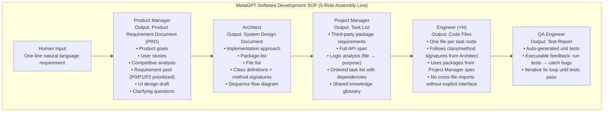
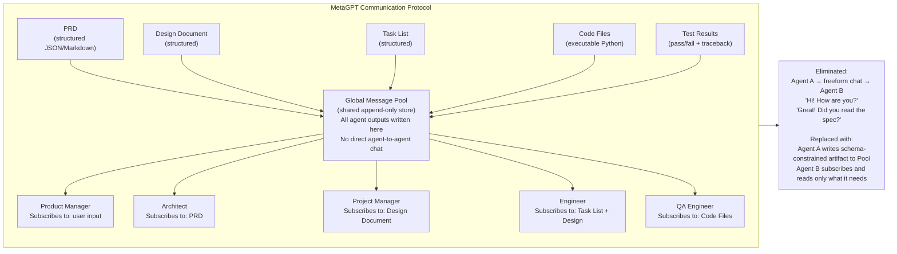
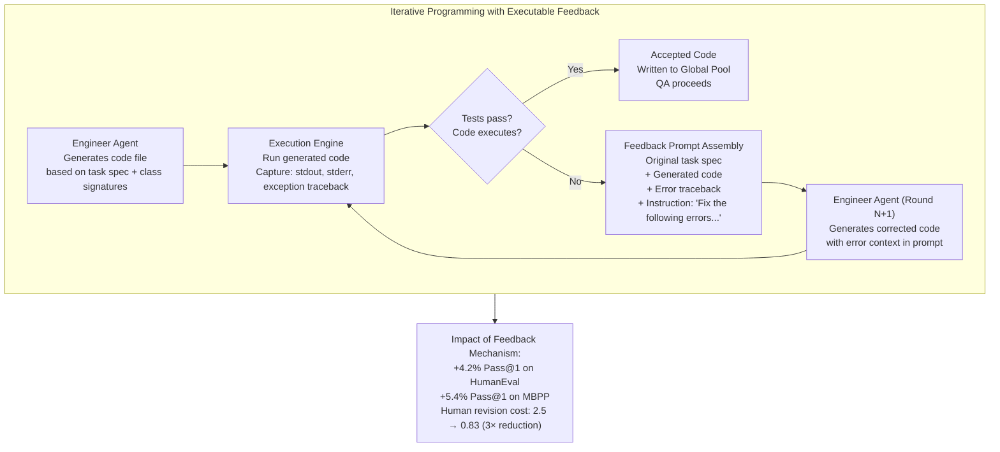

# MetaGPT: Meta-Programming for a Multi-Agent Collaborative Framework — Deep Survey Notes for RedGrid

| Field | Details |
|-------|---------|
| **Authors** | Sirui Hong, Mingchen Zhuge, Jiaqi Chen, Xiawu Zheng, Yuheng Cheng, Ceyao Zhang et al. (DeepWisdom / KAUST AI Initiative / UC Berkeley / UPenn) |
| **Venue** | ICLR 2024 (arXiv:2308.00352v7) |
| **Published** | November 2024 (v7); originally August 2023 |
| **Repository** | https://github.com/geekan/MetaGPT |
| **Relevance** | ⭐⭐⭐⭐☆ — MetaGPT is the canonical proof that encoding human workflows as **Standardized Operating Procedures (SOPs)** into multi-agent systems eliminates cascading hallucinations from freeform LLM chaining. Its structured communication protocol (global message pool + subscription filtering) and executable feedback loop are directly applicable to RedGrid's inter-agent handoffs and Validation Agent design. |
| **Key Claim** | SOPs encoded into prompt sequences + structured intermediate outputs (not freeform chat) reduce hallucinations and human revision cost by 3× (0.83 vs 2.5 revisions). MetaGPT achieves 85.9%/87.7% Pass@1 on HumanEval/MBPP (SOTA at time of publication) and executability score of 3.9/4.0 vs ChatDev's 2.1 and AutoGPT's 1.0 on the SoftwareDev benchmark. |

---

## 📌 Core Thesis

When multiple LLMs collaborate without structure, they hallucinate — not just individually but *cascadingly*: one agent's hallucinated output becomes the next agent's incorrect premise. The resulting cascade amplifies errors through the chain. MetaGPT's fix is to encode **human Standardized Operating Procedures (SOPs)** into the agent system: each role produces a structured, schema-constrained intermediate artifact (PRD, design doc, task list, code, test report) that the next role consumes. Freeform chat between agents is eliminated.

**The insight for RedGrid:** The same cascading hallucination problem exists in pentest pipelines. When a Recon Agent delivers a freeform text summary to a Specialist Agent, the Specialist inherits any errors or ambiguities. MetaGPT's answer — structured handoff artifacts between every agent transition — is exactly what RedGrid needs between its FSM states.

---

## 🏗️ How MetaGPT Actually Works

### The SOP-Driven Assembly Line



### Communication Protocol — Global Message Pool + Subscription



### Executable Feedback Loop (Self-Correction)



---

## 📊 Benchmark Results

### SoftwareDev Executability (7-task subset, 1–4 scale)

| Task | AutoGPT | LangChain | AgentVerse | ChatDev | MetaGPT |
|------|:-------:|:---------:|:----------:|:-------:|:-------:|
| Flappy Bird | 1 | 1 | 1 | 2 | 3 |
| Tank Battle | 1 | 1 | 1 | 2 | **4** |
| 2048 Game | 1 | 1 | 1 | 1 | **4** |
| Snake Game | 1 | 1 | 1 | 3 | **4** |
| Brick Breaker | 1 | 1 | 1 | 1 | **4** |
| Excel Processing | 1 | 1 | 1 | **4** | **4** |
| CRUD Manager | 1 | 1 | 1 | 2 | **4** |
| **Average** | **1.0** | **1.0** | **1.0** | **2.1** | **3.9** |

> Scale: 1=complete failure, 2=executable, 3=largely satisfying, 4=perfect match.

### Ablation: Role Contribution

| Engineer | Product Mgr | Architect | Project Mgr | Agents | Lines | Cost | Revisions | Executability |
|:--------:|:-----------:|:---------:|:-----------:|:------:|:-----:|:----:|:---------:|:-------------:|
| ✓ | ✗ | ✗ | ✗ | 1 | 83 | $0.92 | 10 | 1.0 |
| ✓ | ✓ | ✗ | ✗ | 2 | 112 | $1.06 | 6.5 | 2.0 |
| ✓ | ✓ | ✓ | ✗ | 3 | 143 | $1.20 | 4.0 | 2.5 |
| ✓ | ✓ | ✗ | ✓ | 3 | 205 | $1.25 | 3.5 | 2.0 |
| ✓ | ✓ | ✓ | ✓ | **4** | **191** | **$1.39** | **2.5** | **4.0** |

> Each additional role with a well-defined SOP reduces human revisions and improves executability. Architect + Project Manager together are critical: Architect without Project Manager (row 3) gets 2.5; Project Manager without Architect (row 4) gets only 2.0.

### MetaGPT vs ChatDev (Statistical Comparison)

| Metric | ChatDev | MetaGPT (no feedback) | MetaGPT (full) |
|--------|:-------:|:---------------------:|:--------------:|
| Executability (1–4) | 2.25 | 3.67 | **3.75** |
| Running Time (s) | 762 | 503 | 541 |
| Token Usage | 19,292 | 24,613 | 31,255 |
| Code Files | 1.9 | 4.6 | **5.1** |
| Total Code Lines | 77.5 | 194.6 | **251.4** |
| Human Revision Cost | 2.5 | 2.25 | **0.83** |

> MetaGPT costs more tokens (31K vs 19K) but produces 3× more code and requires 3× fewer human revisions. The tradeoff is worthwhile.

---

## 🔑 Key Takeaways for RedGrid (Ranked by Impact)

### 🔴 Critical

#### 1. Every RedGrid Agent Transition Must Produce a Structured Handoff Artifact — Not a Chat Message
MetaGPT's #1 result: replacing freeform agent-to-agent chat with schema-constrained structured documents eliminates cascading hallucinations and reduces human correction cost by 3×.

**RedGrid implementation — the 5 mandatory handoff artifacts:**

| FSM Transition | Producing Agent | Artifact Schema | Consuming Agent |
|---------------|-----------------|-----------------|-----------------|
| Recon → Planner | Recon Agent | `{targets[], open_ports{}, services{port:version}, graphql_endpoints[], swagger_url, tech_stack[]}` | Team Manager |
| Planner → Specialist | Team Manager | `{task_id, vuln_class, target_endpoint, params{}, context{creds, session_id}, constraints[], expected_oracle}` | Specialist Agent |
| Specialist → Summarizer | Specialist | `{task_id, tool_calls[], findings[], shell_state{}, success: bool, raw_evidence[]}` | Summarizer Bridge |
| Summarizer → Validator | Summarizer | `{task_id, compact_finding{vuln_type, endpoint, payload, expected_response}, confidence}` | Validation Agent |
| Validator → Reporter | Validation Agent | `{vuln_type, severity, confidence_score, evidence_snippet, reproduction_steps[], recommended_fix}` | Report Generator |

Every schema field must be explicitly validated before the next agent reads it. An invalid field stops the pipeline and triggers a structured error back to the producing agent.

#### 2. Global Message Pool + Role Subscription Eliminates Context Flooding
MetaGPT's publish-subscribe mechanism: all agent outputs go to a shared append-only pool; each agent subscribes only to message types relevant to its role. An Engineer never sees the PRD competitive analysis. A QA engineer never sees the business requirement.

**RedGrid adaptation:** The Environment State Service (ESS from Paper 16) IS the RedGrid global message pool. Every specialist writes its structured finding to the ESS; the Team Manager subscribes to ESS updates; specialists subscribe only to their task context. The Team Manager must NEVER forward raw tool output to another specialist — only ESS-mediated structured updates.

#### 3. Executable Feedback Loop is the Validation Agent's Core Mechanism
MetaGPT's self-correction: run the code → if exception, inject `(code, traceback)` into next Engineer prompt → re-generate → repeat until pass. +4.2%/+5.4% on HumanEval/MBPP from this loop.

**RedGrid adaptation:** The Validation Agent runs the PoC → if oracle not triggered, inject `(payload, response_diff, oracle_string)` into next Specialist prompt → re-generate attack → repeat up to N_max rounds. This is the executable feedback loop applied to exploit validation, not code compilation.

#### 4. Role Decomposition Must Be Maximal — More Roles = Better Output (Up to a Point)
MetaGPT's ablation shows: 4-role system (Engineer+PM+Architect+ProjMgr) executability=4.0 vs 3-role (Engineer+PM+Architect) executability=2.5. Splitting Project Manager from Architect alone gives +1.5 executability.

**RedGrid implication:** The current 4-layer architecture (Planner → Team Manager → Specialist → Validator) should NOT be compressed. Do not merge Team Manager and Specialist to save tokens — the ablation proves that each handoff boundary catches a class of errors the previous role couldn't. The Summarizer Bridge is the RedGrid "Project Manager" — the translation layer that makes structured output parseable by the next role.

### 🟡 Important

#### 5. Structured Intermediate Outputs are the Anti-Hallucination Mechanism
MetaGPT's PRDs, design docs, and task lists force each agent to produce a machine-readable artifact that the *next* agent validates structurally before acting on it. Freeform text that "sounds correct" but contains wrong API names/endpoints is caught at schema validation time, not at execution time.

**RedGrid:** Every Specialist's output must be schema-validated by the Summarizer Bridge before entering the Team Manager's context. A `{vuln_type: "xss", endpoint: null}` output should be rejected and returned to the Specialist for completion — not forwarded.

#### 6. SOP Encoding Separates Domain Knowledge from Execution Logic
MetaGPT's roles embed domain SOPs: the Product Manager "knows" to produce a PRD with competitive analysis and user stories — this knowledge is in the role's system prompt, not re-derived each time. Similarly, the Architect "knows" to produce class diagrams and sequence flows.

**RedGrid:** Each Specialist's system prompt should encode the SOP for its vulnerability class:
- **XSS Specialist SOP:** `[canary injection → context analysis → filter probe → LLM mutation → Playwright verify]`
- **SQLi Specialist SOP:** `[baseline timing → SLEEP probe → bit extraction → data exfil]`
- **REST Specialist SOP:** `[spec parse → dependency graph → RandomWalk sequence → 500 oracle]`

The SOP is not generated per-mission — it is fixed in the specialist's system prompt and parameterized with target-specific values from the Task Context artifact.

#### 7. Token Cost Increases With More Structure — Budget Accordingly
MetaGPT (full) uses 31,255 tokens vs ChatDev's 19,292 (+62%). The extra tokens buy a 3× reduction in human revision cost and a 1.75× executability improvement. Structure is not free.

**RedGrid budget implication:** Expect ~1.5–2× token cost vs a naive ReAct loop. This is acceptable given the reduction in false positives and re-runs. Track "cost per confirmed finding" not "cost per run" — MetaGPT's model is more expensive per token but cheaper per correct output.

#### 8. Role-Specific Interests for Subscription Filtering = Context Relevance Gate
MetaGPT's subscription mechanism: agents declare `_watch = [SomeAction, AnotherAction]` — they only receive messages of types they've subscribed to. The Engineer never gets distracted by competitive analysis; the QA agent never debates product requirements.

**RedGrid implementation:** Add an explicit `interested_in` field to each agent's config:
- Team Manager: `interested_in = [ReconSummary, SpecialistFinding, ValidationResult]`
- XSS Specialist: `interested_in = [TaskContext, XSSSubtask]`
- Validation Agent: `interested_in = [ExploitPayload, OracleSpec]`

Any message not in the agent's `interested_in` list must not enter its context.

### 🟢 Nice-to-have

#### 9. Self-Referential SOP Improvement (A.1) — RedGrid Memory Write-Back
MetaGPT's Appendix A describes a self-improvement mechanism: after each project, agents retrospectively modify their own constraint prompts based on what they observed worked and failed. This is MetaGPT's version of the Three-Tier Long-Term Memory (Paper 18).

**RedGrid:** After each mission, run a Reflection Agent that: reads all specialist findings and tool call logs → identifies which SOP steps were skipped or caused failures → writes updated SOP variants to the Tier-2 Strategy Memory Store → next mission uses updated SOPs.

#### 10. High-Level Prompts Work Almost as Well as Detailed Ones (When SOPs Are in Place)
MetaGPT Table 6: high-level prompt (13 words) achieves executability 3.8 vs detailed prompt (42 words) executability 4.0. With SOPs, the system itself expands ambiguous requirements into structured specs.

**RedGrid:** A user can say "pentest this web app at http://target.com" and RedGrid's Recon Agent + Planner SOP should expand this into a full structured attack plan. The user does not need to specify vuln classes, tools, or methodology.

---

## 📐 RedGrid SOP Template (from MetaGPT)

The MetaGPT pattern, translated to RedGrid's pentest domain:

```
MetaGPT Role       → RedGrid Equivalent      → Structured Output Artifact
─────────────────────────────────────────────────────────────────────────
Product Manager    → Recon Agent              → AttackSurfaceDoc (JSON)
Architect          → Team Manager (Plan)       → AttackPlan (PTG/DAG JSON)
Project Manager    → Team Manager (Dispatch)   → TaskContext (per-specialist)
Engineer           → Specialist Agent          → SpecialistReport (JSON)
QA Engineer        → Validation Agent          → ValidatedFinding (JSON)
```

Each artifact is schema-validated at the boundary. Invalid artifacts are rejected and returned for correction. No freeform chat between roles. The Global Message Pool is the RedGrid ESS. Subscription filtering is the RedGrid `interested_in` field.

---

## 🔗 Cross-References to Other Papers in This Survey

| Paper | Connection | Mechanism |
|-------|-----------|-----------|
| **Paper 10** (PentestGPT) | PTT JSON State Object as structured handoff | PentestGPT's PTT is MetaGPT's task list — a schema-constrained intermediate output consumed by the next role; PTT must be validated before Team Manager reads it |
| **Paper 14** (CHECKMATE) | Predefined Action Library + Dual Perceptor | CHECKMATE's action YAML templates are MetaGPT's class/method signatures — both force structured parameterization over freeform generation; CHECKMATE's Dual Perceptor is MetaGPT's QA feedback loop applied to pentest tool output |
| **Paper 16** (Incalmo) | Environment State Service (ESS) | Incalmo's ESS is MetaGPT's Global Message Pool for pentest — centralized append-only store that all agents write to and subscribe from; both eliminate direct agent-to-agent freeform communication |
| **Paper 18** (CO-REDTEAM) | Explicit Exploit Plan Object + Pre-Execution Validation Gate | CO-REDTEAM's persisted `research_plan` JSON is MetaGPT's PRD — a structured artifact that evolves across iterations; CO-REDTEAM's Validation Agent is MetaGPT's QA Engineer with executable feedback |
| **Paper 09** (Getting Pwnd) | Reflection Filter | MetaGPT's subscription filtering (ignore irrelevant messages) is the architectural equivalent of Paper 09's Reflection Filter (raw output → GPT-4o-mini → structured finding or null) — both solve the same information overload problem |
| **Paper 19** (AutoGen) | Unified agent interface + 5-layer system message | AutoGen's ConversableAgent is MetaGPT's Role agent abstraction; both use a unified send/receive interface; AutoGen's 5-layer system message encodes the equivalent of MetaGPT's role profile + SOP |
