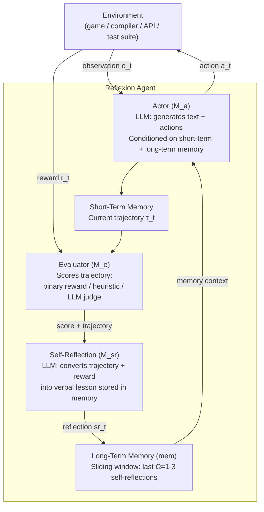
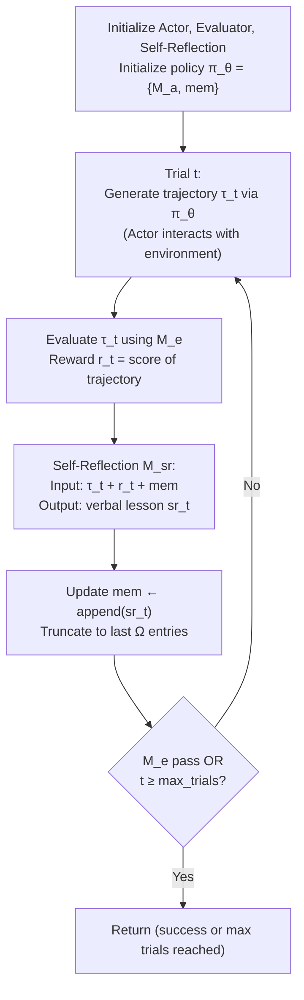
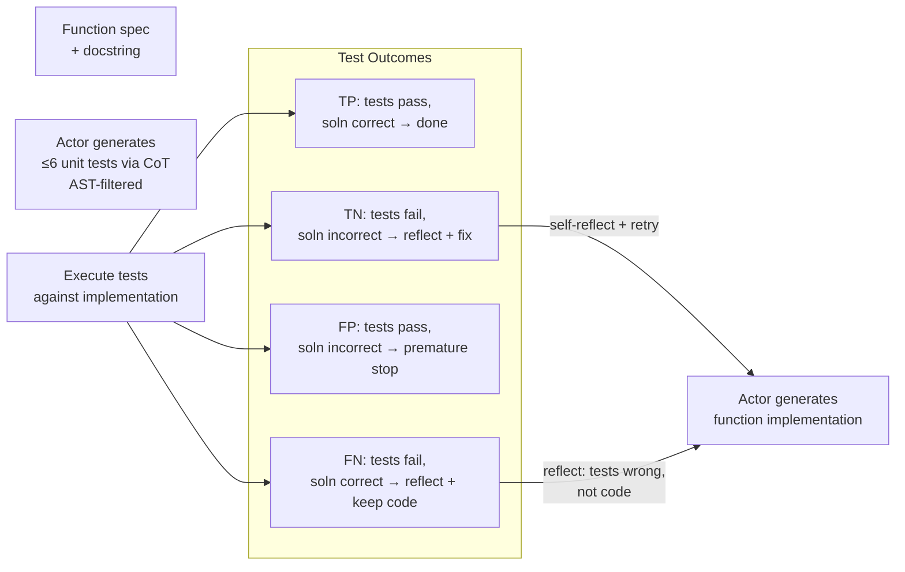

# Reflexion: Language Agents with Verbal Reinforcement Learning — Deep Survey Notes for RedGrid

| Field | Details |
|-------|---------|
| **Authors** | Noah Shinn, Edward Berman, Federico Cassano (Northeastern University); Karthik Narasimhan, Shunyu Yao (Princeton University); Ashwin Gopinath (MIT) |
| **Venue** | NeurIPS 2023 / arXiv:2303.11366 |
| **Published** | 2023 (March) |
| **Repository** | https://github.com/noahshinn024/reflexion |
| **Relevance** | ⭐⭐⭐⭐☆ — Reflexion formalizes the inter-episode verbal self-reflection loop that underlies RedGrid's between-attempt failure analysis: converting a binary success/fail oracle into a natural-language "lesson learned" that persists in episodic memory and improves the next attempt — without any gradient updates. |
| **Key Claim** | Reflexion achieves **91% pass@1 on HumanEval** (vs GPT-4 baseline 80%), **+22pp absolute on AlfWorld** decision-making over 12 trials, and **+20pp on HotPotQA reasoning** — all without fine-tuning, using only verbal self-reflection stored in a sliding-window episodic memory. |

---

## Core Thesis

Reflexion asks a deceptively simple question: if an agent fails a task, can it *describe what went wrong in words* and use that description to do better next time — without changing any model weights? The answer is yes, and the mechanism is called **verbal reinforcement**: convert any feedback signal (binary success/fail, heuristic score, test output) into a first-person natural-language "lesson" stored in a sliding-window episodic memory buffer (Ω ≤ 3 entries). On the next attempt, this buffer is prepended to the agent's context. The agent effectively "remembers" its own failures as prose summaries and reasons about them during planning.

This contrasts with standard RL (weight updates, expensive, black-box) and with single-shot self-refinement (no episodic memory, only within-trial feedback). Reflexion operates *between* episodes: it is a between-trial mechanism, not a within-trial one. This distinction is critical for RedGrid: Voyager (Paper 21) handles within-trial refinement (3 feedback types, up to 4 rounds); Reflexion handles between-trial learning (what did I learn from the last attempt that I should remember for the next attempt?). Both mechanisms are needed and they are orthogonal.

For RedGrid, Reflexion maps to: when a Specialist exhausts its 4-round limit on a sub-task without success, the Team Manager does not simply move on — it invokes a Self-Reflection step that generates a `{lesson_learned, failed_approach_summary, suggested_alternative}` JSON. This gets stored in the mission's episodic memory and injected into the *next* Specialist's context when that same vuln class is attempted again (possibly on a different endpoint, or in a later session against the same target). This eliminates repeated identical failures — the single most common failure mode in all pentest agent systems (Papers 09, 10, 11, 12).

---

## How It Actually Works

### Architecture Overview: Three-Model Framework



### The Reflexion Loop — Algorithm



**Key design choices:**
- `mem` is bounded by Ω (typically 1–3) to avoid exceeding LLM context limits
- Self-reflection is always written in **first person** ("I should have...") — this framing is essential for the LLM to reason about its own past actions
- The Evaluator can be: binary env signal, a heuristic function, or another LLM instance — all three are valid

### Three Evaluator Types

| Evaluator Type | Domain | Mechanism | RedGrid Equivalent |
|----------------|--------|-----------|-------------------|
| **Binary environment signal** | AlfWorld (task complete?) | True/False from environment | HTTP 500 oracle / flag match |
| **Heuristic function** | AlfWorld (stuck detection) | If same action repeated ≥3 times OR >30 actions: reflect | Rabbit-Hole Counter + attempt limit |
| **LLM self-evaluation** | Decision-making, coding | LLM judge rates trajectory quality | Validation Agent structured JSON |
| **Test suite execution** | Programming (HumanEval, MBPP) | Run self-generated unit tests; pass/fail signals | PoC script execution oracle |

### Self-Reflection Output Format

The Self-Reflection model takes: `{trajectory, reward, current_mem}` → generates a first-person prose lesson:

**AlfWorld example:**
> "In this environment, my plan was to find a mug then find and use a desklamp. However, the task says to examine the mug *with* the desklamp. I should have looked for the desklamp first, then looked for the mug. In the next trial, I will go to desk 1, find the lamp, then look for the mug and examine it with the desklamp."

**HotPotQA example:**
> "I searched the wrong title for the show, \"'Allo 'Allo!\", which resulted in no results. I should have searched the show's main character, Gorden Kaye, to find the role he was best known for."

**RedGrid equivalent:**
> "I attempted time-based blind SQLi on /api/login using `SLEEP(5)` injected into the `username` field with a 5s baseline threshold. The server responded with 200 in 0.8s for all payloads — either WAF stripping the payload or parameterized queries. In the next attempt I should test error-based SQLi using `'` to trigger a syntax error banner, or target the `id` GET parameter which appears unvalidated. Avoid the `username` field entirely."

### Programming Domain: Test-Driven Self-Reflection

For code tasks, the evaluator is a **self-generated unit test suite** (up to 6 tests), built with CoT and filtered for syntactic validity (AST parse check). This creates a ground-truth-free evaluation loop:



**Critical finding:** False positives (tests pass, code wrong) are the main failure mode — MBPP Python has 16.3% FP rate vs HumanEval Python 1.4%, explaining MBPP's lower accuracy despite similar base model performance.

**RedGrid implication:** When RedGrid generates a PoC exploit script and runs it, if the script exits 0 but actual exploitation failed (e.g., the tool ran but didn't extract data), this is the exact false-positive problem. Validation Agent must go beyond `exit 0` checking — it must verify the *postcondition* of exploitation, not just the execution success.

### AlfWorld Stuck Detection Heuristic

The AlfWorld evaluator uses a simple but powerful heuristic to detect failure without waiting for explicit task-fail signal:

```python
def should_reflect(trajectory):
    # Detect tight loops: same action, same response, ≥3 times
    last_3 = trajectory[-3:]
    if all(a == last_3[0].action for a in last_3) and \
       all(o == last_3[0].observation for o in last_3):
        return True
    # Detect inefficient planning: too many steps
    if len(trajectory) > 30:
        return True
    return False
```

**RedGrid direct implementation:** This heuristic maps to the Rabbit-Hole Counter (Paper 09) already in RedGrid architecture, now with an additional formalization: when the counter triggers, the Self-Reflection step generates a verbal analysis of *why* the loop occurred, not just a forced FSM transition.

---

## Vulnerabilities Exploited

Not applicable — Reflexion is a general agent learning framework, not a security paper. No CVEs or attack types. All RedGrid relevance is architectural.

---

## Benchmark Section

| Benchmark | Domain | Size | Deployment | Oracle | Key Result |
|-----------|--------|------|------------|--------|------------|
| AlfWorld | Sequential decision-making | 134 environments, 6 task types | Text-based interactive household (TextWorld) | Task completion (binary) | **ReAct+Reflexion: 130/134 (97%); ReAct only: ~75%; +22pp absolute** |
| HotPotQA | Multi-hop reasoning | 100 questions (subset) | Wikipedia API retrieval | Exact match answer | **ReAct+Reflexion: 51% vs ReAct 39%; CoT(GT)+Reflexion: 80% vs 68% baseline** |
| HumanEval (Python) | Code generation | 164 problems | Python interpreter + self-generated unit tests | pass@1 (all hidden tests pass) | **Reflexion: 91% vs GPT-4 80%; previous SOTA: 65.8%** |
| HumanEval (Rust, 50 hardest) | Code generation | 50 problems | Rust compiler | pass@1 | **Reflexion: 68% vs GPT-4 base 60%** |
| MBPP (Python) | Code generation | Subset | Python interpreter | pass@1 | **Reflexion: 77.1% vs GPT-4 80.1%** (slight regression due to FP rate) |
| MBPP (Rust) | Code generation | Subset | Rust compiler | pass@1 | **Reflexion: 75.4% vs GPT-4 70.9%** |
| LeetcodeHardGym (40 new problems) | Competitive programming | 40 problems (post-Oct 2022) | Online judge | pass@1 | **Reflexion: 15% vs GPT-4 7.5% (2× improvement)** |

### Model Sensitivity (Table 5 — HotPotQA)

| Model | Baseline Acc | Reflexion Acc | Gain |
|-------|-------------|---------------|------|
| text-davinci-003 CoT(GT) | 0.60 | **0.77** | +17pp |
| gpt-3.5-turbo CoT(GT) | 0.57 | **0.71** | +14pp |
| gpt-4 CoT(GT) | 0.68 | **0.80** | +12pp |
| text-davinci-003 ReAct | 0.30 | **0.55** | +25pp |
| gpt-3.5-turbo ReAct | 0.26 | **0.38** | +12pp |
| gpt-4 ReAct | 0.39 | **0.51** | +12pp |

> **Note:** Reflexion helps across ALL model sizes, but **smaller models gain MORE** from verbal reflection (+25pp for text-davinci-003 ReAct vs +12pp for GPT-4). This is critical for RedGrid: cheap models with Reflexion can approach expensive models without Reflexion. However, starchat-beta (Table 4) shows 0% gain — reflection is an **emergent capability** requiring a minimum model quality threshold (roughly GPT-3.5-turbo class).

### Ablation Study (HumanEval Rust, 50 hardest)

| Approach | Test Generation | Self-Reflection | pass@1 |
|----------|----------------|-----------------|--------|
| Base model | ❌ | ❌ | 0.60 |
| Test gen omission | ❌ | ✅ | **0.52** (worse than base!) |
| Self-reflection omission | ✅ | ❌ | 0.60 (no improvement) |
| **Reflexion** | ✅ | ✅ | **0.68** |

> **Critical Note:** Test generation WITHOUT self-reflection is **worse than baseline** (0.52 vs 0.60). The agent receives failure signals but cannot synthesize actionable lessons — it makes random edits that degrade the implementation. Self-reflection WITHOUT test generation shows no improvement (0.60). Both components are required; neither works alone. This validates RedGrid's requirement for Validation Agent critique feeding into Team Manager's Self-Reflection step.

### WebShop Failure Analysis

Reflexion **fails on WebShop** (e-commerce product search): no improvement over baseline after 4 trials. Root cause: Reflexion cannot escape local minima requiring high *diversity* of search strategies. The agent's reflections converge to the same search approach. **RedGrid implication:** Reflexion works for tasks with clear error identification (wrong order of operations, wrong parameter) but fails for tasks requiring random exploration (fuzz parameter space, try random payloads). For those, RedGrid needs Thompson Sampling bandit (Paper 07), not Reflexion alone.

---

## Key Takeaways for RedGrid

### 🔴 Critical — RedGrid v1 Must-Haves

**1. Between-Trial Self-Reflection Step (distinct from within-trial Three-Type Feedback)**
When a Specialist exhausts its 4-round within-trial limit (Paper 21 hard limit) without success, the Team Manager MUST invoke a Self-Reflection step before either: (a) retrying the same sub-task later, or (b) moving to a different attack vector. The Self-Reflection step generates:
```python
reflection_prompt = f"""
You are analyzing a failed penetration testing attempt.

Failed task: {sub_task}
Target: {endpoint}
Attempts made: {attempt_count}
Execution trace: {tool_calls_and_outputs}
Final error: {last_error}
Current episodic memory: {episodic_memory[-3:]}  # last Ω=3

Generate a first-person reflection covering:
1. What specifically failed and why (with evidence from the execution trace)
2. What approach was attempted and why it didn't work
3. A concrete alternative approach for the next attempt
4. Any target-specific observations that should inform future attempts

Output as JSON: {{"lesson": str, "failed_approach": str, "alternative_approach": str, "target_observations": str}}
"""
reflection = llm(reflection_prompt)
episodic_memory.append(reflection)
episodic_memory = episodic_memory[-3:]  # keep last Ω=3 entries
```

**2. Episodic Memory Sliding Window (Ω=3) Injected Into Specialist Context**
Every Specialist launched for the same vuln class / same target MUST receive the current episodic memory as part of its context. The episodic memory contains past Self-Reflections from previous attempts. This is the mechanism by which RedGrid avoids repeating identical failures:
```python
specialist_prompt = f"""
{role_description}
{task_description}

Previous attempts on similar tasks (episodic memory):
{json.dumps(episodic_memory, indent=2)}

These represent lessons learned from past failed attempts.
Avoid the approaches marked as 'failed_approach'. 
Prioritize the 'alternative_approach' suggestions.
"""
```

**3. Reflexion Heuristic: Detect Stuck Before Oracle Signal**
Do not wait for explicit task-fail oracle to trigger self-reflection. Use the AlfWorld-style proactive heuristic adapted for VAPT:
```python
def should_reflect_early(tool_call_history):
    # Loop detection: same tool, same args, same output, ≥3 times
    if detect_identical_consecutive_calls(tool_call_history, threshold=3):
        return True, "stuck_loop"
    # Step budget: too many calls without new findings
    if len(tool_call_history) > 30 and no_new_findings_in_last_10_calls():
        return True, "budget_exhaustion"
    # Diversity: all calls hitting same URL prefix
    if url_diversity(tool_call_history[-5:]) < 0.2:
        return True, "tunnel_vision"
    return False, None
```

**4. First-Person Self-Reflection Framing Is Not Optional**
Self-reflection prompt MUST use first-person framing: "I attempted...", "I should have...", "In my next attempt I will...". This is not stylistic — LLMs follow first-person reflection more reliably than third-person analysis. The model is reasoning about its own prior behavior, not analyzing an external agent.

**5. Reflexion Is Between-Trial; Voyager's 3-Feedback Is Within-Trial — Both Required**
These are orthogonal mechanisms at different time scales:
- **Within trial (Voyager Paper 21):** 3 feedback types (tool output, exec errors, validation critique) → up to 4 refinement rounds → one attempt
- **Between trials (Reflexion Paper 22):** Self-reflection on complete failed attempt → lesson stored in Ω=3 episodic memory → injected into next attempt

RedGrid needs both. Missing either one is a correctness gap, not just a performance gap.

### 🟡 Important — RedGrid v2

**6. Self-Generated Exploit Verification Test Suite**
Adapt Reflexion's self-generated unit test pattern to VAPT: before executing an exploit, the Specialist generates 3–5 "verification predicates" describing what exploitation success looks like, filtered for validity:
```python
# Specialist generates verification predicates before exploit execution
predicates = [
    "HTTP response contains 'admin' in JSON body",
    "Response status is 200 on /admin endpoint (previously 403)",
    "Error banner in response contains 'MySQL' or 'SQLite'",
    "Response time > 5s (for timing-based blind injection)"
]
# After execution: check each predicate
# If all fail AND self-reflection says predicates were correct → exploit failed, reflect
# If all fail AND self-reflection says predicates were wrong → fix predicates, retry
```

**7. Reflexion Minimum Model Quality Threshold**
Self-reflection is an emergent capability — starchat-beta (weaker model) shows 0% gain. Run a one-shot self-reflection quality check before deploying any model as Team Manager: given a synthetic failed pentest trace, can it generate a specific, actionable, non-generic lesson? If output is generic ("I should try harder next time"), the model cannot self-reflect and must not be used as Team Manager.

**8. Failure Mode Taxonomy from Episodic Memory**
After every N missions, synthesize all episodic memory entries into a **failure taxonomy** stored in Tier-1 Vulnerability Pattern memory (Paper 18):
```python
failure_taxonomy = {
    "WAF_blocking": {"signatures": [...], "mitigations": [...]},
    "parameterized_queries": {"signatures": [...], "mitigations": [...]},
    "rate_limiting": {"signatures": [...], "mitigations": [...]},
    "encoding_issues": {"signatures": [...], "mitigations": [...]}
}
```
New attempts consult this taxonomy before generating the first exploit attempt — preventing the failure from occurring rather than learning from it after the fact.

**9. Reflexion Failure Condition: High-Diversity Search Tasks**
Reflexion fails when the search space is high-diversity and requires random exploration (WebShop: −0% improvement). For RedGrid sub-tasks requiring broad surface scanning (parameter fuzzing, endpoint enumeration), use Thompson Sampling bandit (Paper 07) instead of Reflexion. Reflexion is appropriate only for tasks with identifiable causal failures (wrong endpoint, wrong injection point, wrong encoding, wrong authentication method).

**10. Memory Capacity: Sliding Window vs Full Retention**
Use Ω=3 as the default sliding window (Reflexion default). For high-value, long-running engagements: store all reflections in FAISS (Tier-1 Vulnerability Pattern memory) and use semantic retrieval to inject the top-3 *most relevant* past reflections (not just the most recent 3). More recent ≠ more relevant for exploit failure lessons.

### 🟢 Nice-to-Have — Future Work

**11. Value Learning in Natural Language**
Reflexion authors explicitly suggest future work on "value learning in natural language" — assigning numerical priority scores to reflection-stored lessons based on how many subsequent attempts they helped. RedGrid: assign a `utility_score` to each episodic memory entry, updated after each mission where it was retrieved; decay utility over time; retire low-utility entries.

**12. Verbal Reflection as Interpretability Layer**
Reflexion's self-reflections are human-readable explanations of agent failures. RedGrid should expose the episodic memory in the mission report as a "failure analysis" section, giving human operators direct insight into *why* each attack vector was abandoned — significantly better than raw tool output logs.

**13. Off-Policy Exploration via Reflexion**
Use reflections from previous missions on *different* targets to inform current mission planning. E.g., a reflection from target A ("the login endpoint validates token length before processing — tried to inject before token is consumed, should inject in token body instead") may be relevant for target B with similar tech stack. This requires cross-mission episodic memory retrieval by tech-stack similarity.

---

## Cross-References

| This Paper's Concept | Connected Paper(s) | Mechanism of Connection |
|----------------------|-------------------|------------------------|
| **Between-trial verbal self-reflection (episodic memory)** | Papers 09, 10, 12, 17, 18 | Paper 09's Reflection Filter (within-trial) is orthogonal — Reflexion operates between trials. Paper 10's PTT failure recovery (3.2 fails → 3.3 corrective sub-task) is Reflexion instantiated in the PTT data structure. Paper 12's Summarizer Bridge is the Evaluator step in Reflexion — distilling trajectory to compact JSON before reflection. Paper 18's Explicit Exploit Plan marking `BLOCKED` steps is Reflexion's memory update applied to plan objects rather than episodic text. |
| **Sliding-window episodic memory (Ω=3)** | Papers 01, 18, 21 | Paper 01's RAG retrieval over CVE descriptions is long-term memory (semantic). Paper 18's Three-Tier Long-Term Memory is structured Reflexion memory. Paper 21's skill library is procedural long-term memory. Reflexion adds *episodic* memory (failure traces) as a fourth memory type. All four types are now identified for RedGrid: (1) semantic CVE/technique knowledge, (2) procedural skill library, (3) strategic plan library, (4) episodic failure reflections. |
| **AlfWorld stuck detection heuristic** | Papers 09, 11, 17, 21 | Paper 09's Rabbit-Hole Counter (K=5 same-resource calls) is the same heuristic with a diversity trigger. Paper 11's TDI > 0.8 branch pruning is the same heuristic generalized to a probabilistic score. Paper 17's circuit breaker (>3 rounds no progress) is the same with a progress signal. Paper 21's 4-round hard limit is the same as a fixed count boundary. Reflexion adds: when the heuristic fires, generate a verbal lesson rather than just transitioning state. |
| **Self-generated test suite evaluation** | Papers 03, 05, 11, 14, 21 | Papers 03/05 Validation Agent with oracle/verification string is Reflexion's external binary evaluator applied to VAPT. Paper 11's Evidence Confidence scoring extends the binary evaluator to a probabilistic scale. Paper 21's Validation Agent critic uses the same LLM-judge pattern as Reflexion's LLM evaluator. Paper 14's Dual Perceptor (rule-based vs LLM) is Reflexion's evaluator type selection (heuristic vs LLM evaluator) made explicit. |
| **Verbal RL vs weight-based RL** | Papers 04, 07, 11 | Paper 04's Thompson Sampling bandit is gradient-free optimization (like Reflexion) but operates over discrete strategy space rather than verbal memory. Paper 07's adaptive strategy selection is the same gradient-free optimization. Paper 11's EGATS UCB is gradient-free over attack tree nodes. Reflexion is gradient-free over episodic memory — all four are alternatives to gradient descent that work with frozen LLMs. |
| **Reflexion fails on high-diversity search** | Papers 07, 08 | Paper 07's Thompson Sampling bandit excels exactly where Reflexion fails: tasks requiring diverse random exploration of a large strategy space (fuzzing parameter spaces). Paper 08's RandomWalk REST fuzzing strategy is the same high-diversity search pattern. RedGrid should use bandit/random strategies for exploration phases and Reflexion for exploitation phases where failure has clear causal structure. |
| **First-person lesson generation** | Papers 09, 10, 13, 17 | Paper 09's Verification Prompt Framing (audit/verification language) is the same prompt framing discipline applied to output format. Paper 10's Two-Step CoT requires explicit Step 1 (expand) → Step 2 (execute) reasoning before action. Paper 17's Reasoning LLM Prompt Hygiene (no few-shot for reasoning models) conflicts with Reflexion's few-shot examples for reflection — RedGrid should ablate whether reasoning models (o1, Sonnet extended thinking) need few-shot reflection examples or benefit from zero-shot goal-and-constraint prompting. |
| **Emergent self-reflection quality threshold** | Papers 04, 05, 15, 17 | Papers 04/05 model selection empiricism. Paper 15's Strong Executor Requirement. Paper 17's PTT-Update Quality Gate (model must update PTT correctly before selection). Reflexion adds: model must generate specific, actionable reflections before being used as Team Manager — a separate self-reflection quality gate distinct from PTT-update quality. |
