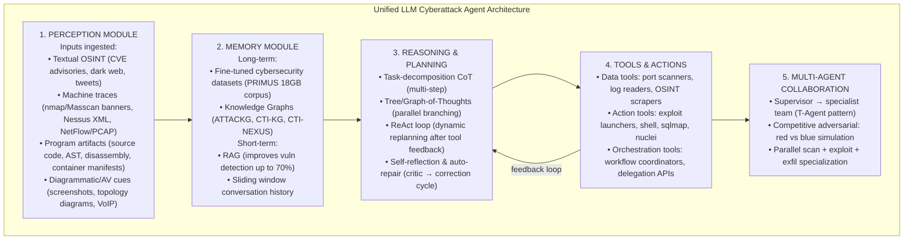
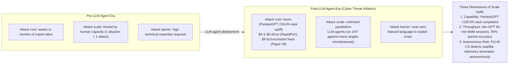

# Forewarned is Forearmed: A Survey on LLM-Based Agents in Autonomous Cyberattacks — Survey Notes for RedGrid

| Field | Details |
|-------|---------|
| **Authors** | Minrui Xu, Jiani Fan, Xinyu Huang, Conghao Zhou, Jiawen Kang, Dusit Niyato, Shiwen Mao, Zhu Han, Xuemin Shen, Kwok-Yan Lam (NTU Singapore / U. Waterloo / Auburn / U. Houston) |
| **Venue** | arXiv (ACM-style survey); May 2025 |
| **Published** | 2025 |
| **Repository** | Not available |
| **Relevance** | ⭐⭐☆☆☆ — Broad survey of LLM-based cyberattack agents across all network types (enterprise, IoT, satellite, blockchain, UAV, etc.). Most primary papers it covers have already been processed in depth (Papers 01–19). Primary value for RedGrid: (1) the unified 5-component agent architecture taxonomy, (2) Table 4's comprehensive LLM attack agent catalogue (40+ frameworks), and (3) the "Cyber Threat Inflation" framing for RedGrid's positioning. |
| **Key Claim** | LLM-based agents cause "Cyber Threat Inflation" — a drastic reduction in attack cost alongside a tremendous increase in attack scale and accessibility. All 8 cyberattack categories (CTI, Penetration Testing, Vuln Detection, Phishing, Malware, Exploitation, Honeypot, CTF) require all 5 agent capabilities (Perception, Memory, Reasoning, Tool Use, Multi-agent Collaboration) at high intensity. Existing defenses are operationally imbalanced and inadequate against this threat class. |

---

## 📌 What This Survey Adds (Over Papers Already Processed)

This survey's primary value is not empirical results (it has none) but **taxonomic synthesis** — it provides three resources not available elsewhere in the 29-paper corpus:

1. **The 5-component agent architecture taxonomy** (validated against 40+ frameworks)
2. **Table 4** — the most comprehensive catalogue of LLM attack agent frameworks in the survey (40 systems, classified by attack type, model, context, reasoning, tools, and team role)
3. **The "Cyber Threat Inflation" concept** — the framing RedGrid should use in its positioning section

---

## 🏗️ The 5-Component Cyberattack Agent Architecture

This survey proposes a unified architecture that abstracts over all 40+ LLM-based cyberattack agents it reviews. RedGrid maps exactly onto it:

### RedGrid vs Unified Architecture Mapping

| Architecture Layer | RedGrid Component | Coverage |
|-------------------|------------------|----------|
| Perception | Recon Agent (nmap, WhatWeb, GraphQL introspect, ZAP) | ✅ |
| Memory | SQLite (short-term state) + FAISS (semantic traces) + ESS | ✅ |
| Reasoning & Planning | Team Manager (FSM/PTG) + EGATS UCB + CoT specialists | ✅ |
| Tools & Actions | Tool Suite per specialist (sqlmap, nuclei, Playwright, curl) | ✅ |
| Multi-agent Collaboration | Team Manager → Specialist dispatch + Validation Agent | ✅ |

> **RedGrid satisfies all 5 components.** This is a useful sanity check for the architecture section of the RedGrid paper.

---

## 📊 Table 4 — LLM Attack Agent Framework Catalogue (redgrid-relevant only)

From the survey's comprehensive Table 4, filtered to web/pentest agents most relevant to RedGrid:

| Agent | Attack Type | Model | Multi-Agent | Reasoning | Tools | Team Role |
|-------|------------|-------|:-----------:|:---------:|-------|:---------:|
| PentestGPT | Penetration Testing | backend | ✗ | Advanced | Metasploit CLI | Purple |
| RapidPen | Penetration Testing | GPT-4 | ✗ | SoTA CoT | RAG executor | Red |
| VulnBot | Penetration Testing | GPT-4o-mini | ✗ | Advanced | Multi-agent | Red |
| AutoPT | Penetration Testing | GPT-4 | ✗ | Advanced | FSM executor | Red |
| Breachseek | Penetration Testing | GPT-4 | ✗ | Advanced | LangGraph planner | Red |
| CIPHER | Penetration Testing | GPT-4 | ✗ | Basic | Function calls | Red |
| Hackphyr | Penetration Testing | 7–13B | ✗ | Advanced | Internal cmds | Red |
| AttackLLM | Penetration Testing | GPT-4 | ✗ | Advanced | Agent actions | Red |
| Vul-RAG | Vulnerability Exploit | GPT-4 | ✗ | Advanced | RAG (2,174 CVEs) | Blue |
| CheatAgent | Vulnerability Exploit | GPT-3.5/4 | ✗ | Advanced | Function calls | Red |
| hackingBuddyGPT | Vulnerability Exploit | GPT-4 | ✗ | Basic | Bug-bounty assist | Red |
| SEVENLLM | Vulnerability Exploit | 13B | ✗ | Advanced | JSON tools | Blue |
| HackSynth | CTF | GPT-4 | ✗ | Advanced | Plan / summarize | Red |
| EnIGMA | CTF | GPT-4o | ✗ | SoTA CoT | GDB / nc tools | Purple |

**Papers not yet in RedGrid survey (citations from Table 4 that are new):**
- **RapidPen** [132] — shell access in 200–400s, $0.3–$0.6/run; ReAct + RAG executor
- **Breachseek** [19] — LangGraph multi-agent planner (128k context)
- **Hackphyr** [159] — 7B fine-tuned model matching GPT-4 on network intrusion
- **HackSynth** [131] — CTF agent with plan+summarize loop
- **WitheredLeaf** [43] — LLM vuln detection: 123 previously unknown flaws in 154 GitHub projects
- **LProtector** [173] — GPT-4o + RAG + CoT: 89.68% accuracy on C/C++ vulnerability detection

---

## 🧠 Cyber Threat Inflation — RedGrid's Positioning Framework

The survey's key conceptual contribution is the "Cyber Threat Inflation" framing. RedGrid should use this in its introduction and positioning:

---

## 📊 8-Category Attack Taxonomy with Capability Requirements

The survey's Table 3 maps attack categories to the 5 agent capabilities. All 8 require all 5 at high intensity — there are no "easy" attack categories that RedGrid can skip:

| Attack Category | Perception | Memory | Reasoning | Tool Use | Multi-agent |
|----------------|:----------:|:------:|:---------:|:--------:|:-----------:|
| Threat Intelligence | ● | ● | ● | ● | ◐ |
| **Penetration Testing** | **●** | **●** | **●** | **●** | **●** |
| Vulnerability Detection | ● | ● | ● | ● | ◐ |
| Malware Generation | ● | ● | ● | ● | ● |
| **One-/Zero-day Exploitation** | **●** | **●** | **●** | **●** | **◐** |
| Phishing & Social Engineering | ● | ● | ● | ● | ◐ |
| Honeypot Deployment | ● | ● | ● | ● | ● |
| CTF Challenges | ● | ● | ● | ● | ◐ |

> **Multi-agent collaboration** is rated ● (required) only for Penetration Testing, Malware Generation, and Honeypot Deployment. For RedGrid's web exploitation focus (Pentest + Zero-day Exploitation), multi-agent is mandatory — confirming the RedGrid 4-layer architecture is correct.

---

## 🔑 Key Takeaways for RedGrid (Focused — Incremental Value Only)

### 🟡 Important

#### 1. LLM Capability Table — Use for Model Selection Justification
Table 2 provides the most current (May 2025) LLM comparison in the survey corpus:

| Model | Context | Speed (tok/s) | Input $ / 1M | MMLU |
|-------|:-------:|:-------------:|:------------:|:----:|
| GPT-4o | 128k | 164 | $5.00 | 0.803 |
| Llama 4 Maverick | 1M | 121 | $0.20 | 0.809 |
| Gemini 2.5 | 1M | 160 | $1.25 | 0.800 |
| Claude 3.7 Sonnet | 200k | 77 | $3.00 | 0.803 |
| **DeepSeek R1** | 130k | 24.6 | **$0.55** | **0.844** |
| Grok 3 | 1M | 49 | $3.00 | 0.799 |

RedGrid's model selection rationale: DeepSeek R1 has highest MMLU (0.844) at $0.55/1M input — strongest reasoning-per-dollar for Team Manager. Llama 4 Maverick at $0.20 is cheapest for Specialist execution. Gemini 2.5 at 1M context window is best for long-horizon missions.

#### 2. Blue-Team Deception Tactics RedGrid Should Document for Defenders
The survey provides three blue-team lessons that are useful for RedGrid's limitations/ethics section:
- **Exploit LLM weaknesses:** Defenders who know an attacker uses GPT-4o can inject confusing context-length exhaustion payloads into honeypot responses
- **OODA loop timing:** Introduce artificial reasoning delays at critical decision points to disrupt attack chain execution
- **LLM-augmented honeypots:** Deploy shelLM-style responses (90% deception rate in SSH sessions) to waste attacker agent budget

#### 3. Fine-Tuned Small Model (Hackphyr 7B = GPT-4 on Intrusion) — RedGrid Evaluation Target
Hackphyr fine-tunes a 7B model to match GPT-4 performance on network intrusion tasks. If RedGrid's architecture is correct (pipeline dominates model size — confirmed in Papers 04, 05, 06, 07), RedGrid with a fine-tuned 7B Specialist should approach GPT-4o performance on CVE-Bench. This is a future experiment: RedGrid + Hackphyr-style fine-tuned Specialist vs RedGrid + GPT-4o Specialist.

### 🟢 Nice-to-have

#### 4. Knowledge Graph Memory (CTI-NEXUS, ATTACKG) — Alternative to FAISS
This survey documents Knowledge Graph-based memory (ATTACKG, CTI-NEXUS) as an alternative to FAISS vector stores. KGs preserve relational structure between attack techniques, CVEs, and ATT&CK TTPs that FAISS cannot represent. For RedGrid's future memory tier upgrade: FAISS for semantic trace retrieval + KG for ATT&CK technique relationships.

#### 5. Papers Not Yet in RedGrid Corpus Worth Reading
From Table 4, these agents are NOT covered in Papers 01–25/28/29 but may be worth consulting:
- **RapidPen** — $0.3–$0.6/run shell access, fastest cost-per-shell in literature
- **HackSynth** — CTF with plan+summarize (similar to RedGrid's SummarizePhase but CTF-specific)
- **WitheredLeaf** — 123 unknown flaws in 154 GitHub repos (source-code vuln detection at scale)

---

## 🔗 Cross-References to Other Papers in This Survey

| Paper | Connection | What This Survey Adds |
|-------|-----------|----------------------|
| **Papers 01–02** (Fang/Kang UIUC) | Cited as [542a/b/c] in references | Survey validates their taxonomy position: one-/zero-day exploitation requires all 5 capabilities ● |
| **Papers 09–19** (Pentest agents) | PentestGPT, VulnBot, AutoPT, D-CIPHER all appear in Table 4 | Survey classifies them by architecture — confirms RedGrid's multi-agent (●) requirement for Pentest |
| **Paper 20** (MetaGPT) | Not explicitly cited but MetaGPT's SOP pattern is Table 4's "orchestration tools" category | MetaGPT's structured handoffs are the "orchestration tools" layer in the unified architecture |
| **Paper 22** (Reflexion) | Self-reflection and auto-repair (Section 2.1.4) — the Crimson agent uses it | Survey confirms self-reflection is a standard component of advanced reasoning (⊛) agents |
| **Paper 28** (CVE-Bench) | CVE-Bench T-Agent is survey's top PT performer | Survey's Table 4 shows T-Agent as the most capable multi-agent PT framework — CVE-Bench quantifies it |
