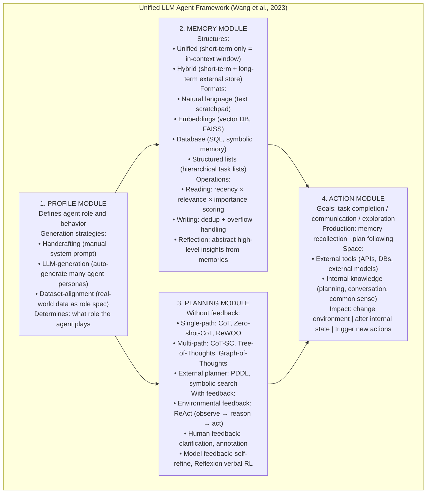
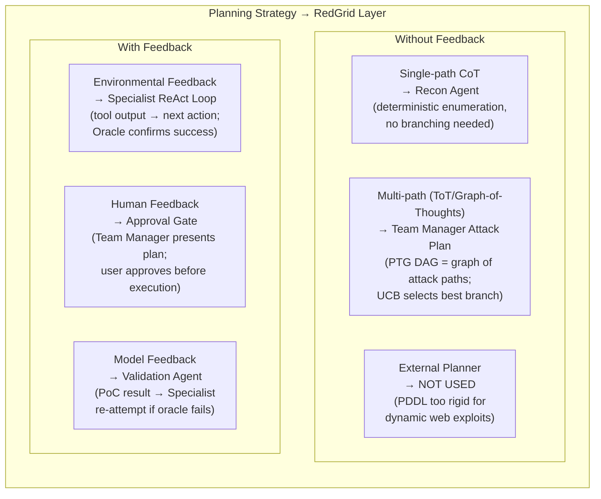

# A Survey on Large Language Model Based Autonomous Agents — Survey Notes for RedGrid

| Field | Details |
|-------|---------|
| **Authors** | Lei Wang, Chen Ma, Xueyang Feng, Zeyu Zhang, et al. (Renmin University of China) |
| **Venue** | Frontiers in Computer Science, 2025; arXiv:2308.11432v7 |
| **Published** | August 2023 (v1); March 2025 (v7) |
| **Repository** | https://github.com/Paitesanshi/LLM-Agent-Survey |
| **Relevance** | ⭐⭐☆☆☆ — General (non-security) survey of LLM-based autonomous agents. Its primary value for RedGrid is a single artifact: the **4-component unified agent framework** (Profile + Memory + Planning + Action). RedGrid maps onto all 4 components. Most primary papers it covers (ReAct, Reflexion, Voyager, MetaGPT, AutoGen) have been processed in depth already. Used here purely as an architecture validation tool. |
| **Key Claim** | Proposes a unified framework for all LLM-based autonomous agents comprising 4 modules: Profile (role), Memory (structure + format + operations), Planning (with/without feedback), and Action (goal + production + space + impact). Maps 30+ agent systems onto this taxonomy. Identifies 6 open challenges: role-playing capability, generalized human alignment, prompt robustness, hallucination, knowledge boundary, efficiency. |

---

## 📌 What This Survey Adds (Over Papers Already Processed)

This survey's single highest-value contribution for RedGrid is the **4-component unified architecture taxonomy** — the most principled, widely-cited framework for classifying agent design decisions. Everything else (individual paper summaries, application domains) is already covered in depth through the primary papers.

---

## 🏗️ The 4-Component Unified Agent Framework

This is the canonical general agent taxonomy against which RedGrid should be validated:

### Memory Reading Formula — Recency × Relevance × Importance

The survey formalizes the memory retrieval scoring used in Generative Agents and applicable to RedGrid's FAISS tier:

$$m^* = \arg\max_{m \in M} \left( \alpha \cdot s_{rec}(q, m) + \beta \cdot s_{rel}(q, m) + \gamma \cdot s_{imp}(m) \right)$$

Where:
- $s_{rec}$: recency score (exponential decay from last access time)
- $s_{rel}$: relevance score (cosine similarity between query embedding and memory embedding)
- $s_{imp}$: importance score (LLM-rated significance of memory at write time, 1–10)
- $\alpha, \beta, \gamma$: tunable balancing weights

**RedGrid default weights:** $\alpha=0.3, \beta=0.5, \gamma=0.2$ — weight relevance highest (security context specificity matters most), recency second (recent tool calls most actionable), importance least (reserve importance for validated findings only).

---

## 📊 RedGrid vs Unified Framework — Validation Mapping

| Framework Component | RedGrid Implementation | Coverage | Gap? |
|--------------------|----------------------|:--------:|------|
| **Profile** | Specialist system prompts (Handcrafting); Team Manager generates subtask descriptions (LLM-generation) | ✅ Full | None |
| **Memory — Unified** | In-context tool call history within each Specialist (sliding window) | ✅ Full | None |
| **Memory — Hybrid** | SQLite (short-term session state) + FAISS (long-term semantic traces) + ESS (cross-agent pool) | ✅ Full | None |
| **Memory — Operations** | Memory Reading (FAISS similarity search), Writing (SQLite append), Reflection (Summarizer Bridge distillation) | ✅ Full | None |
| **Planning without feedback** | Recon Agent (single-path CoT) + Team Manager (multi-path attack plan with PTG DAG) | ✅ Full | None |
| **Planning with feedback** | ReAct loop in each Specialist (environmental feedback) + Validation Agent (model feedback) + User approval gates (human feedback) | ✅ Full | None |
| **Action — External Tools** | sqlmap, nuclei, ZAP, Playwright, curl, bash — all role-scoped | ✅ Full | None |
| **Action — Internal Knowledge** | LLM reasoning within each specialist for payload mutation and context interpretation | ✅ Full | None |

> **RedGrid satisfies all 4 components at full coverage.** This can be stated directly in the RedGrid architecture paper: "RedGrid implements all components of the unified LLM agent framework proposed by Wang et al. (2023), adapted for autonomous penetration testing."

---

## 🔑 The 6 Open Challenges — RedGrid's Position

The survey identifies 6 challenges that remain unsolved in 2023. Check RedGrid's status on each:

| Challenge | Description | RedGrid Status |
|-----------|------------|---------------|
| **Role-playing Capability** | LLMs struggle with uncommon or newly-emerging roles | ✅ Addressed — Specialist SOPs encode domain-specific role behavior explicitly; specialists are not expected to role-play organically |
| **Generalized Human Alignment** | Safety vs simulation tension — agents need different value constraints for different purposes | ✅ Addressed — ethical framing prompt (white-hat authorized pentest) + target scope enforcement |
| **Prompt Robustness** | Minor prompt changes produce wildly different behavior | ⚠️ Partial — RedGrid uses fixed SOP templates but has not formally evaluated prompt sensitivity; future work |
| **Hallucination** | Agents produce false information confidently | ✅ Addressed — Validation Agent runs executable PoC; oracle-based confirmation eliminates unverified hallucinated findings |
| **Knowledge Boundary** | LLMs know too much — may make decisions based on training data contamination | ⚠️ Partial — CVE-Bench benchmark uses post-training-cutoff CVEs to minimize contamination; but RedGrid has no explicit knowledge-bounding mechanism |
| **Efficiency** | LLM autoregressive inference is slow; agents query LLMs many times per task | ✅ Addressed — Cheap/fast models (GPT-4o-mini) for Specialist execution; expensive models (o1/Sonnet-thinking) only for Team Manager planning |

---

## 📐 Planning Taxonomy — RedGrid's Planning Layer Positioning

The survey's most useful structural contribution is distinguishing 6 planning strategies across 2 dimensions. RedGrid uses different strategies at different layers:

---

## 🔑 Key Takeaways for RedGrid (Minimal — Incremental Value Only)

### 🟡 Important

#### 1. Memory Reflection = RedGrid's Mission Debrief Step (Not Yet Implemented)
The survey defines Memory Reflection as: after each mission, generate 3 key questions from recent memories, query memory for relevant information, generate 5 high-level insights. This is distinct from the Three-Tier memory (Paper 18) but complementary.

**RedGrid implementation gap:** After every completed CVE-Bench mission, a Debrief Agent should:
1. Generate 3 questions from the mission log: "What worked?", "What failed?", "What was unexpected?"
2. Query FAISS for similar past missions
3. Write 3 insights to the Strategy Memory tier (Tier 2)
4. Update the specialist's SOP if a new effective technique was discovered

#### 2. Capability Acquisition Hierarchy: Fine-Tuning > Prompting > Mechanism Engineering
The survey's most useful design principle: capability can be acquired through model fine-tuning (best but requires open-source), prompt engineering (flexible, works with any model), or mechanism engineering (trial-and-error, crowd-sourcing, experience accumulation). These form a stack:

- **RedGrid now:** Prompt engineering + mechanism engineering (ReAct loop, FSM, oracle)
- **RedGrid future:** Fine-tuning specialists on mission success logs (Hackphyr pattern) — converts accumulated experience into model weights

#### 3. Action Space Classification — Data Tools vs Action Tools vs Orchestration
The survey's 3-category tool classification aligns perfectly with RedGrid's tool architecture:
- **Data tools** = passive recon: nmap, WhatWeb, ZAP scan, curl GET (no write access)
- **Action tools** = active exploitation: sqlmap `--dump`, Playwright form fill, curl POST, payload injection
- **Orchestration tools** = workflow: Team Manager dispatch, FSM state transitions, ESS write

Enforce this classification at the API layer: data tools are available to all specialists; action tools require Team Manager authorization; orchestration tools are Team Manager-only.

### 🟢 Nice-to-have

#### 4. Multi-Task Evaluation Protocol — RedGrid Should Report Generalization
The survey identifies "multi-task evaluation" as the gold standard protocol: evaluate across diverse task types to measure generalization. RedGrid should report not just per-CVE pass rates but **generalization metrics** across CVE-Bench's 8 attack types and 10 application categories. A system that achieves 30% only on WordPress + DB Access is less general than one that achieves 15% uniformly across all 8 attack types and all 10 app categories.

#### 5. Hybrid Memory (Short + Long-term) is Universal — RedGrid Has It Right
Every competitive agent system in the survey uses hybrid memory. The survey confirms: "Unified (short-term only) memory is primarily suitable for simple tasks that only require a small number of reasoning steps." RedGrid's Specialist context window (short-term) + FAISS (long-term) + ESS (shared pool) is the correct architecture for multi-step exploitation.

---

## 🔗 Cross-References to Other Papers in This Survey

| Paper | Connection | What Survey 27 Validates |
|-------|-----------|-------------------------|
| **Paper 19** (AutoGen) | ConversableAgent = survey's unified agent with all 4 modules | Survey confirms AutoGen covers all 4 components; RedGrid's AutoGen-based specialists are properly grounded |
| **Paper 20** (MetaGPT) | SOPs = Profile (handcrafting) + structured Memory Writing | Survey's Profile module is MetaGPT's role definition; structured handoffs are Memory Writing in database format |
| **Paper 21** (Voyager) | Skill library = long-term memory in natural language + embeddings format | Survey classifies Voyager's skill library as hybrid memory with natural language + code formats |
| **Paper 22** (Reflexion) | Verbal RL = model feedback in planning-with-feedback | Survey explicitly classifies Reflexion under "Model Feedback" planning; RedGrid's Validation Agent is the same mechanism |
| **Paper 10** (PentestGPT) | PTT JSON State = structured list memory format | Survey's "structured lists" memory format covers PTT — hierarchical tree structure capturing goal-plan relationships |
