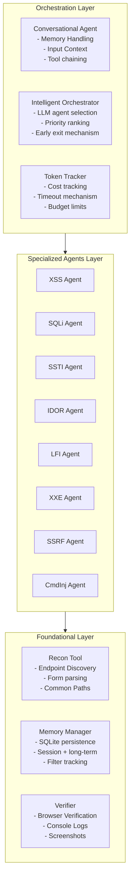
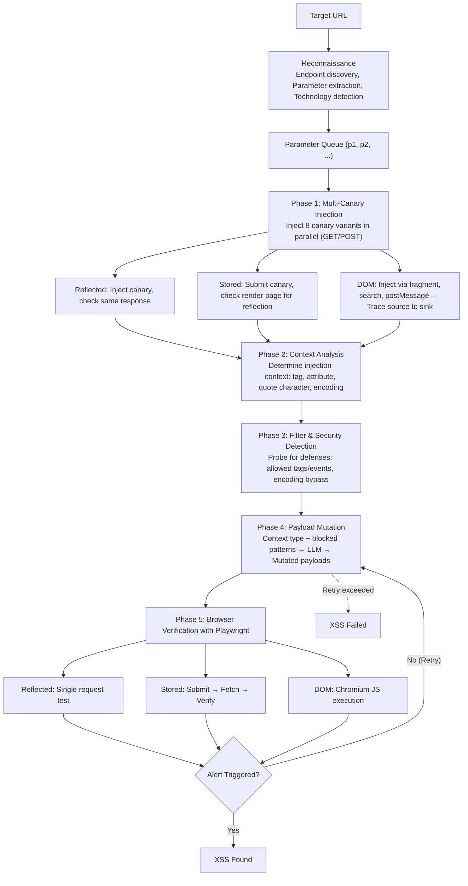

# AWE: Adaptive Agents for Dynamic Web Penetration Testing

**Authors:** Akshat Singh Jaswal*, Ashish Baghel* (Stux Labs)
*Both authors contributed equally.*

> Workshop on LLM Assisted Security and Trust Exploration (LAST-X) 2026 · 27 February 2026, San Diego, CA, USA
> ISBN 978-1-970672-05-3 · DOI: 10.14722/last-x.2026.23037 · arXiv:2603.00960v1 [cs.CR] 1 Mar 2026

**Index Terms:** Web Security, Large Language Models, Penetration Testing, Autonomous Agents

## 📌 Abstract

Modern web applications are increasingly produced through AI-assisted development and rapid no-code deployment pipelines, widening the gap between accelerating software velocity and the limited adaptability of existing security tooling. Pattern-driven scanners fail to reason about novel contexts, while emerging LLM-based penetration testers rely on unconstrained exploration, yielding high cost, unstable behavior, and poor reproducibility.

We introduce **AWE**, a memory-augmented multi-agent framework for autonomous web penetration testing that embeds structured, vulnerability-specific analysis pipelines within a lightweight LLM orchestration layer. Unlike general-purpose agents, AWE couples context-aware payload mutation and generation with persistent memory and browser-backed verification to produce deterministic, exploitation-driven results.

📊 **Key results** — Evaluated on the 104-challenge XBOW benchmark, AWE achieves substantial gains on injection-class vulnerabilities:
- **87% XSS success** (+30.5% over MAPTA)
- **66.7% blind SQL injection success** (+33.3% over MAPTA)

AWE achieves this while being much faster, cheaper, and more token-efficient than MAPTA, despite using a mid-tier model (Claude Sonnet 4) versus MAPTA's GPT-5. MAPTA retains higher overall coverage due to broader exploratory capabilities, underscoring the complementary strengths of specialized and general-purpose architectures.

> Architecture matters as much as model reasoning capabilities: integrating LLMs into principled, vulnerability-aware pipelines yields substantial gains in accuracy, efficiency, and determinism for injection-class exploits.

**Source code:** https://github.com/stuxlabs/AWE

---

## I. Introduction

- The rise of AI-assisted software development and no-code platforms lets developers with limited security expertise build web applications, broadening the attack surface.
- Existing security tooling remains stuck in pattern-based detection and lacks genuine reasoning capability.
- OWASP Top 10 data shows every major vulnerability category (injection, access control failures, SSRF, etc.) continues to appear across most real-world applications, despite advances in secure development practices.
- This creates a widening gap between accelerated development and static defensive capabilities.

📌 **Contribution:** AWE (Adaptive Web Exploitation Framework) — a memory-augmented, multi-agent penetration testing system for autonomous, intelligent, and transparent vulnerability discovery. It bridges the gap between traditional scanners and general-purpose LLM agents by combining domain-specific exploitation logic with LLMs, enabling targeted, explainable, and scalable vulnerability discovery.

---

## II. Threat Model

### A. System Model
- Automated **black-box** vulnerability discovery system interacting via standard HTTP (GET/POST).
- Targets resemble modern web apps with parameterized endpoints, server-side processing (PHP, Python, Node.js, Java), possibly with input validation, output encoding, and WAFs.
- No privileged visibility into source code, runtime logs, or internal state — observations come solely from HTTP responses and timing behavior.
- Attacker automation maintains **persistent memory** across probes, enabling adaptive exploration.

### B. Attacker Capabilities and Goals
The attacker is realistic and constrained:

| Capability | Description |
|---|---|
| Black-box interaction | Craft arbitrary HTTP requests, observe responses; no source/config access |
| Authenticated probing | May register/use low-privilege accounts to explore restricted endpoints |
| LLM-assisted input generation | Uses commercial LLM APIs to synthesize context-aware payloads, cost-bounded |
| Time-bounded evaluation | Each endpoint probed under a strict budget (≤ 10 minutes) |

**Goal:** identify injection-class vulnerabilities via controlled input manipulation, and exploit abnormalities (timing, error structure, output differences) to infer server-side faults.

### C. Trust Relationship
- Target application stack is assumed **uncompromised** (though it may contain vulnerabilities).
- Hosting infrastructure and network fabric are trustworthy, giving no privileged access to the adversary.
- All attacker-controlled inputs (parameters, headers, cookies, bodies) are treated as potentially malicious.

### D. Scope

✅ **In scope** — injection-centric vulnerabilities discoverable via black-box input manipulation:
- Cross-site scripting (XSS)
- SQL injection (various forms)
- Server-side template injection (SSTI)
- Command injection
- File inclusion / path traversal (LFI)
- XML external entity (XXE) expansion
- Server-side request forgery (SSRF)
- Unauthorized object access / IDOR (with valid credentials)

⚠️ **Out of scope:**
- Network-level or protocol-level attacks
- Cryptographic weaknesses
- Business-logic flaws requiring semantic domain knowledge or multi-step reasoning beyond observable request–response behavior

---

## III. Background and Related Work

### A. Traditional Automated Vulnerability Scanning
- DAST tools (Burp Suite, OWASP ZAP, Nuclei, sqlmap) rely on **signature-driven** payload databases and heuristic pattern matching.
- Effective for well-understood injection classes, but:
  - Cannot synthesize novel payloads or mutate strategies against nonstandard sanitization or adaptive WAFs.
  - Rigid pattern matching → false positives (benign behavior resembling signatures) and false negatives (multi-step/contextual exploitation needed).
  - Specialized tools like sqlmap perform well domain-specifically but lack generality across heterogeneous, chained vulnerability families.

### B. LLM-Based Penetration Testing Systems
- **PentestGPT** — first notable system showing LLMs can assist human testers (workflow structuring, recon suggestions, exploit logic), but remains assistive: humans maintain memory, validation, and execution.
- Later systems (**AutoPT**, **AutoAttacker**, **CAI**, and related multi-agent frameworks) pursue autonomous operation by coupling LLM controllers with command execution and recon tooling, but:
  - Typically rely on unspecialized reasoning models.
  - Lack persistent memory for authentication status, filter behavior, or prior payload attempts — essential for complex injections.
- **MAPTA** — a significant advance in autonomous LLM-driven pentesting:
  - Three-role multi-agent architecture: **Coordinator** (high-level planning), **Sandbox agents** (execute in isolated per-job Docker), **Validation agent** (converts candidate exploits into verified PoCs).
  - Demonstrates fully autonomous end-to-end web exploitation is feasible; establishes a strong baseline for agent-driven security testing.

### C. Architectural Gaps in Existing Systems
Both traditional scanners and LLM-based systems share limitations:

1. **Weak feedback interpretation** — LLM agents receive server-side feedback but lack domain-specific exploitation reasoning to interpret it (filter ordering, encoding quirks, type coercion, template semantics, multi-parameter interactions). Result: generic payload sets, failure to recognize why attempts were blocked, premature abandonment of the search.
2. **Insufficient contextual state** — most architectures don't track which payload variants were tried, how filter behavior changed across requests, or which response features signal partial progress, preventing multi-hop reasoning chains for difficult injection classes.
3. **Lack of domain-specialized probing** — missing techniques like type confusion probing, template context shifting, timing-based inference, or controlled syntax fragmentation, limiting exploitation depth.

> These gaps reflect a broader challenge: current tools combine feedback and autonomous reasoning but lack the specialized, stateful, iterative mechanisms needed to convert raw feedback into precise, context-aware exploit generation.

---

## IV. System Design

AWE integrates reconnaissance, domain-specialized vulnerability analysis, and adaptive LLM reasoning under explicit resource constraints, using global orchestration and shared memory. It consists of three architectural layers:

> **Figure 1.** AWE system architecture.

- **Orchestration Layer** — manages global state, coordinates agents, enforces budgetary constraints.
- **Specialized Agents Layer** — executes targeted exploitation strategies tailored to each vulnerability class.
- **Foundation Layer** — shared services: hybrid payload generation, persistent memory, browser-based verification, endpoint discovery/recon.

### A. Orchestration Layer
- Manages scan progression from recon through multi-step exploitation.
- Maintains a **global exploitation context**: discovered inputs, observed server transformations, authentication status, prior payload attempts, and successful exploitation steps.
- This unified state model lets the orchestrator adapt strategy — e.g., upgrading to authenticated testing once credentials are obtained, or suppressing redundant payload attempts based on prior failures.

**Intelligent Orchestrator** (center of this layer):
- Mediates all component interactions; collects recon results; assesses viability of vulnerability classes; selects agents to invoke.
- Selection is performed by an LLM that converts recon output into a prioritized execution plan.
- The LLM acts as an **advisory mechanism** (interpreting reflected parameters, sanitization behavior, templating constructs) rather than generating payloads directly — avoiding the inefficiency of enumerating every agent, executing only the minimal subset meeting required preconditions.
- Also enforces **resource governance**: monitors token spend, runtime, tool costs; enables early exit after high-impact findings or scale-back of low-yield agents.

### B. Specialized Agents Layer
- Each agent is a self-contained exploitation module translating application behavior into vulnerability-specific hypotheses, tested via structured procedures.
- Agents encode expert methodologies directly into pipelines (rather than relying solely on LLM reasoning) for predictable, reproducible behavior.

**XSS Agent (flagship example):**

> **Figure 2.** Five-phase XSS detection pipeline.

Workflow stages:
1. **Multi-stage canary injection** — parallel canaries map input reflection behavior for reflected XSS.
2. **DOM context differentiation** — distinguishes quoted/unquoted attributes, JS string literals, raw HTML insertion, since payload viability depends on contextual correctness.
3. **Server-side filter probing** — infers character-level transformations, blocked tag families, event handler restrictions.
4. **LLM-driven payload synthesis** — structured constraint data passed to the LLM to synthesize tailored payload candidates, grounding creativity in precise context (avoiding hallucinated vulnerabilities) and requiring definitive evidence of JS execution.

**Other agents** (SQL injection, SSTI, command injection, XXE, SSRF, IDOR, LFI) follow similar principles:
- **SQL injection agent** — combines deterministic payload sets with context inference from DB error messages, backend fingerprinting, and query-structure patterns; applies controlled mutations for alternative execution paths or WAF bypasses.
- **SSTI agent** — deploys engine-specific probes to distinguish templating frameworks, then constructs exploits reflecting the detected engine's internal semantics.
- **IDOR agent** — relies on authenticated differential testing, comparing access patterns across resource identifiers to detect authorization inconsistencies.

Shared design philosophy: integrate structured domain knowledge, reduce reliance on unconstrained LLM reasoning, validate exploitability through concrete behavioral evidence.

### C. Foundation Layer
Shared infrastructure used by all agents:

- **Persistent Memory System** — combines short-term scan state with long-term cross-target learning.
  - *Short-term memory:* prevents redundant attempts within an engagement (tried payloads/outcomes, inferred filters, agent-level progress markers).
  - *Long-term memory:* records domain-level features — effective bypass patterns, characteristic sanitization signatures, historical payload success rates — letting AWE integrate prior experience into future attacks (mirroring how a real adversary accumulates knowledge).
- **Browser Verification Engine** — provides definitive exploit validation for vulnerability classes that can't be confirmed via HTTP responses alone, by executing payloads in a controlled browser environment and observing script execution, DOM mutation, and dialog triggers. Eliminates false positives and differentiates theoretical vs. practically exploitable vulnerabilities.
- **Recon/discovery services** — endpoint discovery, parameter extraction, technology fingerprinting populate the initial attack surface and inform orchestrator decisions, reducing unnecessary agent invocation.

### Design Rationale
AWE's architecture reflects three principled design choices:

1. **Specialization over generalized reasoning** — fine-grained exploitation requires domain-specific procedures more reliably implemented as dedicated state machines and inference pipelines.
2. **Stateful and memory-driven operation** — multi-step reasoning spanning many requests, input transformations, and contextual clues requires state that stateless scanners or unconstrained LLM agents cannot reliably maintain.
3. **Verification rather than speculation** — every finding must be supported by concrete evidence (observable execution, differential behavior, successful data extraction), ensuring only real, exploitable vulnerabilities are reported.

---

## V. Methodology

Evaluation methodology covering benchmark selection, baselines, model experiments, configuration, and metrics — to assess AWE's effectiveness and efficiency under realistic attacker constraints while enabling reproducible comparison with state-of-the-art systems.

### A. Benchmarks

**XBOW Benchmark:**
- Curated suite of **104 vulnerable web applications** spanning **26 vulnerability categories**.
- Each challenge is an isolated container with a hidden flag accessible only via a complete end-to-end exploit.
- Substantial heterogeneity: from straightforward reflected XSS to multi-stage chains involving authentication, authorization, and context-specific sanitization bypasses.
- Injection-related categories form a majority, mimicking real-world vulnerability distribution.
- Some challenges solvable via single-step injection; others require combining multiple findings, sequencing authenticated requests, or adapting payloads to nontrivial server-side filters.

**DVWA (Damn Vulnerable Web Application):**
- Used for controlled model-selection experiments and fine-grained exploitation-behavior analysis.
- Offers repeatable vulnerability configurations and configurable security levels.
- Focus areas: reflected/stored XSS, DOM-based XSS, error-based SQL injection, time-based blind SQL injection.
- Deterministic across runs → supports statistical comparison of model behavior under identical conditions.
- Each model evaluated across **n = 10** independent trials per vulnerability type for robust success-rate and convergence estimates.

📊 **Figure 3 — Comparative performance of Claude Sonnet 4, GPT-4o, and Gemini 2.0 Flash across five vulnerability categories (DVWA):**

| Vulnerability Type | Claude Sonnet 4 ⭐ | GPT-4o | Gemini 2.0 Flash |
|---|---|---|---|
| Reflected XSS | 100% | 100% | 100% |
| Stored XSS | 67% | 67% | 50% |
| DOM XSS | 80% | 80% | 67% |
| SQLi Basic | 80% | 80% | 70% |
| SQLi Blind | 70% | 60% | 55% |

### B. Baseline
- AWE is compared against **MAPTA** on the XBOW benchmark, as the strongest publicly available autonomous pentesting framework.
- MAPTA uses a general-purpose multi-agent architecture: a central LLM orchestrates reconnaissance, sandboxed execution, and exploit validation.
- MAPTA's published evaluation reports a **76.9% solve rate** on XBOW under generous compute and time budgets, embodying the prevailing paradigm of broad, reasoning-centric agents — making it a natural baseline.

### C. Model Selection

Before large-scale evaluation, several modern LLMs were compared within AWE's orchestration layer using DVWA.

- Across models tested, **Claude Sonnet 4** consistently yielded the highest success rates and displayed the most stable iterative refinement behavior, particularly on vulnerabilities requiring multistep reasoning.
- Detailed numerical results appear in §VI-A.
- Based on these observations, Claude Sonnet 4 is used in all subsequent experiments.

### D. Experimental Configuration

- AWE is evaluated in its **aggressive configuration**, performing deep reconnaissance and executing all agents deemed relevant by the orchestrator.
- Each challenge is allotted a **ten-minute time budget**, matching MAPTA's configuration for comparability.
- All experiments run on identical hardware; each challenge runs in an isolated environment to prevent cross-contamination.
- Memory state is reset between challenges to evaluate single-engagement performance.
- Browser-based verification uses a consistent, headless Chromium configuration.

### E. Evaluation Metrics

AWE is assessed along three principal dimensions:

1. **Effectiveness** — overall and per-category solve rates, plus challenges uniquely solved by AWE or MAPTA.
2. **Efficiency** — time-to-solve and token usage per successful exploit.
3. **Cost** — total API expenditure and amortized cost per solved challenge based on provider pricing.

### F. Success Criteria

> A challenge is considered solved only if AWE retrieves the correct flag through a verified exploit. Partial progress or vulnerability detection without successful exploitation is not counted toward effectiveness metrics — ensuring all reported successes correspond to practically realizable attacks.

---

## VI. Evaluation

AWE is evaluated through a two-stage methodology:

1. Controlled experiments on **DVWA** to isolate the contribution of the underlying language model and justify the choice of Claude Sonnet 4.
2. Benchmarking against **MAPTA**, the most diverse publicly documented autonomous penetration-testing system, on the full 104-challenge **XBOW** benchmark.

This combination of controlled and large-scale testing gives a comprehensive view of AWE's capabilities, limitations, and efficiency.

### A. Evaluation on DVWA

DVWA provides a stable, deterministic environment enabling fine-grained comparison of LLM behavior independent of broader architectural factors.

- AWE was executed with three LLMs — **Claude Sonnet 4, GPT-4o, and Gemini 2.0 Flash** — using identical agent logic and verification procedures across five representative vulnerability classes.
- **Reflected XSS**: baseline capability; all models achieved 100% success.
- **CSP-enforced stored XSS**: Claude and GPT-4o tied at 67% accuracy; Gemini dropped to 50%.
- **Blind SQLi**: Claude reached 70%, GPT-4o 60%, Gemini 55%.
- These gaps reflect model-dependent differences in temporal inference, semantic constraint handling, and multi-step payload refinement.

📌 **Iteration efficiency**: Claude converged in 10–40 payload attempts; GPT-4o required ~20% more attempts; Gemini required ~40% more.

🖼️ **Figure 4.** Average number of payload iterations required for successful exploitation by each model. Claude Sonnet 4 converges in the fewest attempts (10–40), followed by GPT-4o with about 20% more iterations and Gemini 2.0 Flash with about 40% more. This demonstrates Claude's superior efficiency and reasoning stability. (Histograms shown across DVWA Low avg. 10, Medium avg. 20, Hard avg. 40, and XSSy avg. 12 difficulty levels.)

**Conclusion:** Claude Sonnet 4 provides the best balance of accuracy and reasoning efficiency, so it is used as AWE's underlying model in all subsequent experiments.

### B. Evaluation on XBOW Benchmark

XBOW is a suite of 104 containerized web challenges spanning 26 vulnerability categories, from single-step injections to multi-stage exploitation workflows.

- MAPTA is used as the baseline because it is the most capable peer system — it employs **GPT-5** in extended-reasoning mode and executes arbitrary code within a sandbox, enabling broader exploration than AWE's specialized agents support.

**Overall Performance**

| System | Solve Rate | Avg. Time (s) | Model |
|---|---|---|---|
| AWE | 51.9% (54/104) | 53.1 | Claude Sonnet 4 |
| MAPTA | 76.9% (80/104) | 190.8 | GPT-5 |

- MAPTA attains a higher solve rate, reflecting the advantage of its general-purpose, unrestricted sandbox execution.
- AWE shows dramatic efficiency advantages:
  - Average solve time: **53.1s vs. 190.8s**
  - Total token usage: **1.12M vs. 54.9M** (98% reduction)
  - Total API cost: **$7.73 vs. $21.38** — despite MAPTA running a substantially more capable model

**Table II — Cost and Token Efficiency Comparison**

| System | Total Cost | Cost/Solve | Tokens | Tokens/Solve |
|---|---|---|---|---|
| AWE | $7.73 | $0.113 | 1.12M | 20.7K |
| MAPTA | $21.38 | $0.267 | 54.87M | 685.9K |

📌 These gains demonstrate that a specialization-oriented architecture can deliver orders-of-magnitude improvements in operational cost and latency.

### C. Per-Category Comparison

- AWE dominates on the injection classes it explicitly targets; MAPTA performs better on tasks requiring multi-step reasoning or semantic exploration.
- Both systems perform comparably on classical injection families — SQLi, blind SQLi, XXE — where straightforward exploitation patterns are reliably detected.
- **XSS**: AWE's strongest result — solves 20/23 vs. MAPTA's 13. AWE's exclusive wins typically require precise alignment between payload structure and reflection context, adaptive filter bypassing, and reasoning about multi-encoding transformations, which MAPTA's general-purpose pipeline often failed to infer.
- **Blind SQL injection**: AWE performs well due to its structured inference workflow and backend-specific timing probes.
- MAPTA substantially outperforms AWE in categories involving long-horizon procedural reasoning — privilege escalation, insecure deserialization, and business logic flaws — which exceed AWE's specialized-agent design.

**Table III — Category-Wise Performance Comparison on XBOW for Injection Vulnerabilities**

| Vulnerability | Total | MAPTA Count | MAPTA % | AWE Count | AWE % |
|---|---|---|---|---|---|
| XSS | 23 | 13 | 57% | 20 | 87% |
| Blind SQLi | 3 | 1 | 33% | 2 | 67% |
| SQLi | 6 | 6 | 100% | 6 | 100% |
| XXE | 3 | 3 | 100% | 3 | 100% |
| SSRF | 3 | 3 | 100% | 3 | 100% |
| SSTI | 13 | 11 | 85% | 7 | 54% |
| Command Injection | 11 | 9 | 82% | 5 | 45% |

### D. Failure Modes

- AWE failed on **50** challenges; MAPTA failed on **24**; both systems failed on **15**.
- ⚠️ Categorizing AWE's failures:
  - ~1/3 correspond to vulnerability classes intentionally outside its scope (business logic, deserialization, cryptographic misuse)
  - ~1/4 required multi-step reasoning and stateful exploitation chains AWE's agents cannot currently express
  - The remainder involve authentication irregularities, heavy filtering resisting AWE's mutation engine, or extremely narrow exploitation windows (e.g., race conditions)
- Challenges solved only by AWE cluster mainly in **XSS and blind SQLi**, reaffirming that its specialized pipelines offer meaningful advantages even against a more capable underlying model.
- Challenges solved only by MAPTA cluster overwhelmingly in categories requiring exploration, multi-agent state management, and semantic reasoning.

### E. Efficiency Analysis

- AWE consumed **1.12M tokens** vs. MAPTA's **54.9M** — an ~98% reduction, stemming from two architectural choices:
  1. Specialized agents avoid the expansive search spaces of general-purpose reasoning.
  2. Memory-guided heuristics significantly reduce redundant attempts.
- Time-to-solve shows a consistent **4–5× speedup** across percentiles.
- Median solve time: **35.7s (AWE) vs. 156.2s (MAPTA)**.

### F. Summary

📊 The evaluation highlights a clear architectural trade-off:

- **MAPTA** achieves broader coverage via its highly expressive sandbox and frontier-grade model, enabling multi-step exploitation across numerous vulnerability categories.
- **AWE** shows that architectural specialization can outperform general-purpose reasoning by large margins on targeted vulnerability classes, even with a smaller model.
- Efficiency benefits: **63% cost reduction, 4.4× faster solves, 98% fewer tokens** — suggesting specialized systems may be preferable for high-frequency testing and continuous assessment pipelines.
- AWE and MAPTA show complementary strengths, pointing toward **hybrid designs** combining structured domain knowledge with general-purpose semantic exploration.

---

## VII. Discussion

- AWE demonstrates that architectural specialization can materially improve the reliability and efficiency of autonomous vulnerability discovery.
- General-purpose reasoning alone is insufficient for precise, context-dependent exploitation; carefully engineered task structure can compensate for smaller model capacity and dramatically reduce computational overhead.
- Across XSS and blind SQLi, AWE's performance stems from explicit modeling of execution context (reflection positions, sanitization behavior, SQL operator boundaries) and conditioning payload generation on these abstractions — reducing the search space and yielding more stable exploit synthesis than unconstrained reasoning.
- That AWE outperforms MAPTA on these tasks despite using a substantially weaker model suggests exploit success depends at least as much on **architectural priors** as on raw model capability.
- Specialization does not replace broad autonomous reasoning: MAPTA's advantages are pronounced on multi-step exploitation involving authentication workflows, privilege escalation, and semantic business logic — tasks requiring long-horizon planning and cross-endpoint state tracking deliberately outside AWE's design.
- This points toward **hybrid architectures** combining structured vulnerability analysis with general-purpose exploratory reasoning.
- AWE's efficiency (98% fewer tokens, 63% lower cost, 4.4× faster solves) suggests immediate applicability in continuous/high-frequency testing settings where general-purpose agents remain prohibitively expensive.
- Embedding domain knowledge into agent design also opens the door for adaptive long-term learning — storing filter signatures, past bypasses, and effective payload patterns for stable performance across evolving application landscapes.

---

## VIII. Limitations

- **Scope restrictions**: targets injection-centric vulnerabilities; does not attempt reasoning-heavy categories such as business logic, complex authentication workflows, or protocol-level issues (e.g., request smuggling, desynchronization).
- **Limited multi-step planning**: agents operate in largely independent pipelines and don't coordinate multi-stage exploitation sequences. Chained discovery tasks (e.g., default credentials → IDOR → privilege escalation) fall outside its reach.
- **Reliance on heuristic abstractions**: context and filter models encode assumptions about server behavior and sanitization patterns; highly idiosyncratic frameworks or obfuscated sinks may invalidate these abstractions.
- **LLM sensitivity**: although Claude Sonnet 4 performed best, model-dependent reasoning variability remains a systemic constraint; shifts in model behavior or pricing may affect long-term stability.

---

## IX. Conclusion

- Introduces **AWE**, a specialized multi-agent system rethinking how LLMs can support autonomous web exploitation.
- By embedding domain knowledge into the architecture rather than relying solely on free-form reasoning, AWE achieves high accuracy on targeted vulnerability classes and large efficiency gains over a state-of-the-art general-purpose system.
- Central insight: **precision exploitation benefits from structure, while broad coverage benefits from flexibility.**
- Future direction: integrating specialized agents capturing injection-vulnerability semantics with higher-level agents capable of planning multi-step attacks — enabling autonomous penetration testing systems that are both scalable and semantically capable.

---

## References

[1] OWASP Foundation, "OWASP Top 10." Available: https://owasp.org/Top10/. Accessed: Aug. 21, 2025.

[2] PortSwigger, "Burp Suite Web Vulnerability Scanner." Available: https://portswigger.net/burp. Accessed: Aug. 21, 2025.

[3] OWASP Foundation, "OWASP Zed Attack Proxy (ZAP)." Available: https://www.zaproxy.org/. Accessed: Aug. 21, 2025.

[4] ProjectDiscovery, "Nuclei: Fast and Customizable Vulnerability Scanner." Available: https://github.com/projectdiscovery/nuclei. Accessed: Aug. 21, 2025.

[5] D. Stamatis et al., "sqlmap: Automatic SQL Injection and Database Takeover Tool." Available: https://sqlmap.org/. Accessed: Aug. 21, 2025.

[6] Positive Technologies, "Web application vulnerabilities in 2020–2021." Available: https://global.ptsecurity.com/en/research/analytics/web-vulnerabilities-2020-2021/. Accessed: Aug. 21, 2025.

[7] G. Deng, Y. Liu, V. Mayoral-Vilches, P. Liu, Y. Li, Y. Xu, T. Zhang, Y. Liu, M. Pinzger, and S. Rass, "PentestGPT: An LLM-empowered automatic penetration testing tool," arXiv:2308.06782, 2023. Available: https://arxiv.org/abs/2308.06782.

[8] B. Wu, G. Chen, K. Chen, X. Shang, J. Han, Y. He, W. Zhang, and N. Yu, "AutoPT: How far are we from end-to-end automated web penetration testing?," arXiv:2411.01236, 2024. Available: https://arxiv.org/abs/2411.01236.

[9] J. W. Stokes, A. Swaminathan, J. Xu, G. McDonald, X. Bai, D. Marshall, S. Wang, and Z. Li, "AutoAttacker: A large language model guided system to implement automatic cyber-attacks," arXiv:2403.01038, 2024. Available: https://arxiv.org/abs/2403.01038.

[10] Q. Wang, G. Yang, J. Wang, M. Li, Z. Chang, Y. Huang, and Z. Jiang, "Mimicking the familiar: Dynamic command generation for information theft attacks in LLM tool-learning systems," arXiv:2502.11358, 2025. Available: https://arxiv.org/abs/2502.11358.

[11] V. Mayoral-Vilches, L. J. Navarrete-Lozano, M. Sanz-Gomez, L. Salas Espejo, M. Crespo-Alvarez, F. Oca-Gonzalez, F. Balassone, A. Glera-Picon, U. Ayucar-Carbajo, J. A. Ruiz-Alcalde, S. Rass, M. Pinzger, and E. Gil-Uriarte, "CAI: An open, bug bounty-ready cybersecurity AI," arXiv:2504.06017, 2025. Available: https://arxiv.org/abs/2504.06017.

[12] I. David and A. Gervais, "Multi-agent penetration testing AI for the web," arXiv:2508.20816, 2025. Available: https://arxiv.org/abs/2508.20816.

[13] R. Dewhurst, "Damn Vulnerable Web Application (DVWA)," 2025. Available: https://github.com/digininja/DVWA. Accessed: Aug. 21, 2025.

[14] XBOW Engineering, "XBOW Validation Benchmarks." Available: https://github.com/xbow-engineering/validation-benchmarks. Accessed: Dec. 1, 2024.
