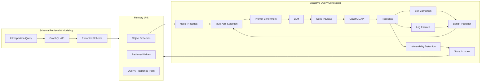

# PrediQL: Automated Testing of GraphQL APIs with LLMs

**Authors:** Shaolun Liu¹*, Sina Marefat²*, Omar Tsai¹, Yu Chen¹, Zecheng Deng¹, Jia Wang¹, Mohammad A. Tayebi¹  
¹ Simon Fraser University, Canada · ² K. N. Toosi University of Technology, Iran  
*Equal contribution.  
*Contact:* `shaolun.liu@sfu.ca`, `sina.marefat@email.kntu.ac.ir`, `omar@ztasecurity.com`, `yca518@sfu.ca`, `zda35@sfu.ca`, `jwa454@sfu.ca`, `tayebi@sfu.ca`  
*Preprint:* arXiv:2510.10407v2 [cs.CR] 19 Oct 2025

> **Keywords:** GraphQL Security, API Fuzzing, Large Language Models, Retrieval-Augmented Generation, Multi-Armed Bandit Learning

## 📌 Abstract

- GraphQL's flexible, nested query model exposes APIs to context-dependent vulnerabilities that conventional fuzzers struggle to find.
- Existing fuzzers rely on random payloads or rigid mutation heuristics and don't adapt to dynamic schema/response structures.
- **PrediQL** — the first retrieval-augmented, LLM-guided GraphQL fuzzer:
  - Frames fuzzing-strategy choice as a **multi-armed bandit** problem (explore vs. exploit).
  - Retrieves/reuses execution traces, schema fragments, and prior errors for self-correction and progressive learning.
  - Uses a context-aware LLM vulnerability detector to interpret responses (data values, errors, status codes) and flag injection flaws, access-control bypasses, and information disclosure.
- Evaluation on open-source/benchmark GraphQL APIs shows significantly higher coverage and vulnerability-discovery rates than state-of-the-art baselines.
- Combining retrieval-augmented reasoning with adaptive fuzzing transforms API security testing from reactive enumeration into intelligent exploration.

## 1. Introduction

- Modern systems built from microservices communicating via APIs; **GraphQL** has grown popular for letting clients request exactly the data they need (mitigates REST/gRPC over-fetching).
- Adoption stats: a 2024 industry survey found ~61% of respondents used GraphQL in production, and ~10% were replacing REST with GraphQL.
- Security cost of that adoption: a separate study found ~69% of scanned public GraphQL API services suffered from unrestricted resource-consumption vulnerabilities, leaving them susceptible to DoS via deep-nested or costly queries.
- GraphQL-specific risks: unbounded query depth, schema exposure via introspection, injection in nested arguments, inconsistent access control across linked queries/mutations.

### ⚠️ Gaps in existing tools
| Category | Examples | Limitation |
|---|---|---|
| Black-box fuzzers | — | Explore randomly, ignore GraphQL structure |
| Schema-aware fuzzers | EvoMaster | Use schema but rely on simple template mutations; ignore cross-field/cross-operation dependencies |
| Dependency-aware | GraphQLer | Models producer–consumer relations between queries/mutations, but generation logic is still static — doesn't adapt to execution feedback |

- LLMs offer a path to feedback-driven fuzzing: they can reason over structured formats, infer valid parameters from schema fragments, and (combined with retrieval over past traces/errors) refine future inputs.
- Related LLM-assisted work exists for binary/protocol fuzzing, DoS pattern detection in GraphQL via deep RL, and malicious-query detection — but **no prior work applies LLM-based fuzzing to GraphQL itself**.

### 🔬 PrediQL approach
Joins schema introspection, retrieval-augmented LLM prompting, multi-armed bandit learning, and self-correction into one closed feedback loop. The LLM acts as a *guided component*, not an oracle: it extracts schema via introspection, retrieves relevant examples/past errors, and a bandit selector chooses between prompting strategies (balancing exploration/exploitation).

### 📊 Headline results
- Average coverage improvement: **16%** (max **50%**) over baselines.
- **GPT-5 Mini** achieved the highest coverage among tested models; **Llama-3-8B** offered competitive results at lower compute cost.
- Accurately identifies injection flaws, access-control bypasses, and information-disclosure cases existing tools often miss.

### Contributions
1. **PrediQL** — first retrieval-augmented, LLM-guided GraphQL fuzzer with adaptive strategy selection (modeled as a multi-armed bandit) to improve efficiency and reduce redundant requests.
2. A **context-aware vulnerability detector** using LLM reasoning to interpret responses and classify vulnerabilities beyond static rule-based detection.
3. **Extensive evaluation** on open-source/benchmark GraphQL APIs showing higher coverage and more context-dependent vulnerabilities found vs. existing tools.

---

## 2. Background & Related Work

Modern web applications increasingly adopt GraphQL for its flexible and efficient data fetching model. While this simplifies client–server interaction, it also introduces security challenges distinct from traditional REST APIs. This section reviews GraphQL fundamentals, summarizes known vulnerability classes, and discusses prior work on API testing, GraphQL security analysis, and LLM-assisted fuzzing.

### 2.1 GraphQL Fundamentals

Three key features:
- **Data as a graph** — interconnected objects retrievable in a single request; mitigates under-/over-fetching.
- **Strong typing** — schema defines object types and operations (queries/mutations); predictable responses, explicit field selection.
- **Single endpoint** — one unified endpoint for both retrieval and modification.

**Schema data types:**
- *Scalars* — atomic values: `Int`, `Float`, `String`, `Boolean`, `ID`.
- *Objects* — user-defined entities composed of fields (which may themselves be scalars, objects, or lists), forming a nested graph structure.

**Operation types:**
- **Queries** — retrieve data (like HTTP GET). A special *introspection query* lets clients inspect the schema itself.
- **Mutations** — modify data (create/update/delete).

Both support fine-grained field selection and field arguments. An operation is parsed → validated against schema → executed by resolving each field independently.

### 2.2 GraphQL Vulnerabilities

Three main categories:

> **Query Abuse Vulnerabilities**
> Flexible queries can be abused to overload/explore the system — e.g., misusing introspection to reveal the full schema (aiding targeted attacks), or DoS via deeply nested/repetitive queries that exhaust server resources.

> **Injection Vulnerabilities**
> Unsanitized inputs enable SQL Injection (data theft/manipulation), Path Injection, and Cross-Site Scripting (XSS) — risking stolen sessions, leaked data, or malicious code execution.

> **Access Control Vulnerabilities**
> Failure to properly restrict data access — e.g., **IDOR** (changing object identifiers to reach restricted data) and **batched attacks** (combining multiple operations in one request to bypass individual security checks). Hard to fix because GraphQL schemas have many linked fields/relationships requiring context-aware, dependency-based testing.

### 2.3 Related Work

**GraphQL Security Testing**
- Early tools (GraphQL-Cop, GraphCrawler, CrackQL, Schemathesis) — introspection-based single-request mutations, no systematic dependency reasoning.
- **EvoMaster** — evolutionary/random testing, black-box + white-box modes.
- **OWASP ZAP / BurpSuite** (Auto GQL Scanner) — GraphQL modules, but mostly generic payload fuzzing / introspection attacks, not multi-step workflows.
- **GraphQLer** — first context-aware GraphQL security framework: infers producer–consumer dependencies, builds a dependency graph, generates chained payloads; improves coverage and finds previously unknown vulnerabilities, but remains static (no adaptation to execution feedback).

**LLM-Assisted Fuzzing**
- Coverage-guided fuzzers (AFL++, libFuzzer, OSS-Fuzz) are effective but struggle with highly structured/constrained inputs and deep execution paths.
- **Fuzz4All** — LLMs for input generation/mutation across formats via an autoprompting loop.
- **EL-Fuzz** — LLM-driven synthesis over input spaces for generation-based fuzzers.
- ML-based malicious-query detection: deep RL for DoS pattern detection in GraphQL; LLMs + sentence transformers + CNNs for malicious query detection.
- Prior text-to-GraphQL LLM work doesn't target specific API schemas.
- **Gap:** no prior work applies LLM-assisted fuzzing to GraphQL's schema-rich, multi-operation design — PrediQL is positioned as the first to do so.

---

## 3. Methodology

PrediQL is a modular, LLM-driven GraphQL fuzzing framework built as a closed-loop pipeline integrating: LLM-based query generation, schema introspection, semantic retrieval, adaptive arm selection, and self-correction.

🖼️ **Figure 1 (workflow of PrediQL)** — represented below as a flowchart:

The closed loop: schema modeling constrains the search space → bandit-based selector picks a prompting strategy → retrieval grounds prompts in real execution history → self-correction incorporates prior errors → prompt construction assembles an evidence-gated LLM input → executed queries update schema, memory, and bandit posteriors.

### 3.1 Schema Modeling

- Pipeline begins with a standard **GraphQL introspection query** against the target API, revealing the complete schema (queries, mutations, input parameters, return types).
- Parsed into a structured intermediate representation (operations, argument specs, object definitions); serialized into lightweight YAML files (queries / mutations / type definitions separated) for reuse and automation.
- Unlike tools that treat introspection as a flat listing, PrediQL **recursively follows links** between objects to capture nested/cross-referenced types → graph-structured view of responses.
- This normalized representation lets PrediQL generate queries that are syntactically valid, semantically consistent, and structurally diverse, avoiding type mismatches or missing arguments.

### 3.2 Adaptive Query Generation

**Adaptive Arm Selection** — query generation is framed as a **multi-armed bandit** problem. Each arm = a prompting strategy defined by four parameters:

| Parameter | Description |
|---|---|
| **Schema** | Whether the full GraphQL schema is included in the LLM prompt |
| **Arg Mode** | `known` = reuse previously successful RAG values · `real` = synthesize realistic type-appropriate literals · `nulls` = test optional fields with null values |
| **Depth** | Max nesting level of GraphQL selections |
| **Top-k** | Number of similar examples retrieved from the RAG system as grounding |

- Uses **Thompson Sampling** to balance exploration/exploitation, rewarding arms only when generated queries both (i) return HTTP 200 and (ii) expand coverage.
- Rewards are exponentially discounted over time to down-weight outdated strategies for non-stationary environments — prevents over-commitment to one strategy while amplifying genuinely useful ones.

**Retrieval-Augmented Generation (RAG)**
- All prior queries/responses embedded into a **FAISS index**.
- During generation, retrieves top-*k* (k = 0, 3, or 5, depending on selected arm) most semantically relevant traces and injects them into the prompt.
- Grounds the LLM in real execution history → improves syntactic fidelity, reduces repetition, promotes diversity.

**Prompt Engineering** — four design goals: prompts must be evidence-gated, deterministic, schema-constrained, and context-aware.

🖼️ **Figure 2 (curated prompt structure)** — represented as a table:

| Block | Description |
|---|---|
| **Header Block** | Domain knowledge about GraphQL query generation based on targeted vulnerabilities and restricted reasoning |
| **Schema Block** | Introspection query result based on selected arm for the specific node |
| **Context Block** | Real values from previous responses (RAG) and previous query/error pairs |
| **Format Block** | Response template description for bulk query generation with vulnerability label |

At runtime, prompt $P$ is automatically assembled from five modular components:

$$P = [B \,\|\, S \,\|\, R \,\|\, E \,\|\, D]$$

- $B$ — Basic restricting header (evidence-gating)
- $S$ — Schema fragments from introspection
- $R$ — Retrieved execution examples (RAG)
- $E$ — Prior error–query pairs (self-correction)
- $D$ — Strategy-specific directives (bandit arm)

Exploration happens primarily through $D$ (arm choice), while $S$, $R$, $E$ stabilize performance across strategies.

### 3.3 Execution and Feedback

**Self Correction**
- Failed queries aren't discarded — PrediQL records schema errors and associates them with the causing queries.
- These error–query pairs are injected into subsequent prompts as corrective signals, turning schema violations into supervision and accelerating convergence toward valid, schema-compliant queries.

**Context-Aware Vulnerability Detection**
- An LLM analyzes each response *in context* (rather than predefined signatures/static rules), using execution metadata (status codes, error messages).
- Structured analysis prompt directs the LLM to identify evidence of injection flaws, access-control bypasses, information disclosure.
- Analyses parsed into JSON records: vulnerability type, severity, confidence, evidence — stored/aggregated for granular findings and system-level trends.
- By conditioning on schema knowledge + execution context, PrediQL generalizes across diverse APIs and finds subtle, context-dependent flaws that rule-based detectors miss.

### 3.4 Closed-Loop Integration

Schema knowledge constrains the LLM → adaptive generation explores diverse query strategies → execution feedback continuously refines prompts and strategy selection. This iterative design expands coverage systematically while maintaining robustness and precision in vulnerability discovery.

---

## 4. Evaluation

Implementation is open-source (https://github.com/SLL288/prediql). Research questions:

- **RQ1.** Can LLMs be guided to synthesize valid yet adversarial GraphQL queries that systematically expand schema coverage vs. schema-only or random fuzzing?
- **RQ2.** How do prompt engineering and context enrichment contribute to improved schema coverage?
- **RQ3.** To what extent can this pipeline discover meaningful GraphQL vulnerabilities over existing rule-based methods?

### 4.1 Experimental Setup

**API Selection** — mix of self-hosted open-source APIs and openly hosted reference APIs:

**Table 1 — GraphQL APIs used in baseline testing**

| API | #Queries | #Mutations | #Objects |
|---|---|---|---|
| UserWallet | 11 | 15 | 5 |
| Countries | 6 | 0 | 5 |
| Rick&Morty | 9 | 0 | 7 |
| GraphQLZero | 13 | 19 | 18 |
| EHRI | 19 | 0 | 46 |
| TCGDex | 6 | 0 | 12 |

**Baselines**
- **EvoMaster** — only prior academic framework supporting GraphQL testing in both white-box/black-box modes; black-box config used for fair comparison; evolutionary heuristics mutate payloads dynamically.
- **ZAP** — OWASP open-source black-box scanner; GraphQL module does introspection-based payload generation and common attack simulations.
- **BurpSuite** — commercial platform (PortSwigger); Auto GQL Scanner extension auto-identifies GraphQL endpoints and injects predefined payloads for injection/schema-disclosure detection.
- **GraphQLer** — context-aware framework building a producer–consumer dependency graph for realistic chained requests; strongest baseline in this comparison.

**Model Selection** — four LLMs spanning developers/sizes/philosophies:

**Table 2 — Technical specifications of LLMs used**

| Model | Developer | Year | Size | Focus |
|---|---|---|---|---|
| LLaMA 3.1 | Meta | 2024 | 8B | Open-source, efficient inference |
| Gemini 2.5 Flash | Google DeepMind | 2025 | Undisclosed | Cost-efficient reasoning |
| GPT-5 Mini | OpenAI | 2025 | Undisclosed | Optimized for speed |
| DeepSeek R1 | DeepSeek AI | 2025 | 671B | Reasoning and efficiency |

**Bandit Configuration Details** — eight bandit arms, each a prompting strategy over four parameters (Schema, Arg Mode, Depth, Top-k):

**Table 3 — Parameters defining adaptive arms in PrediQL's prompt generation**

| Arm Name | Schema | Arg Mode | Depth | Top-k |
|---|---|---|---|---|
| schema_min_known | True | known | 1 | 3 |
| schema_min_real | True | real | 1 | 3 |
| schema_mod_known | True | known | 2 | 5 |
| noschema_min_known | False | known | 1 | 3 |
| noschema_min_real | False | real | 1 | 0 |
| schema_min_nulls | True | nulls | 1 | 3 |
| schema_deep_known | True | known | 3 | 5 |
| schema_deep_real | True | real | 3 | 5 |

- Conservative arms (e.g., `schema_min_known`) prioritize syntactic validity via known parameter reuse + shallow nesting.
- Aggressive arms (e.g., `schema_deep_real`) promote deeper traversal and synthesis of new argument values.
- Non-schema variants probe the LLM's ability to generalize without explicit schema guidance.
- The bandit dynamically reallocates probability mass toward arms maximizing successful, coverage-expanding executions.

## 📊 4.2 Schema Coverage (RQ1)

**Table 4: Coverage comparison — PrediQL vs. baselines** *(Tests that could not be executed are marked as FAILED.)*

| API | ZAP | Burp | EvoMaster | GraphQLer | PrediQL |
|---|---|---|---|---|---|
| UserWallet | 50.00% | 7.69% | 61.54% | 92.31% | 96.15% (+3.84%) |
| Countries | 33.33% | 50.00% | 50.00% | 50.00% | 100% (+50.00%) |
| Rick&Morty | 33.33% | 0.00% | 66.67% | 66.67% | 100% (+33.33%) |
| GraphQLZero | 93.75% | 93.75% | 71.88% | 93.75% | 100% (+6.25%) |
| EHRI | 10.53% | 0.00% | 84.21% | 94.74% | 100% (+5.26%) |
| TCGDex | 66.67% | 33.33% | 100% | 100% | 100% (+0.00%) |

$$
\text{Coverage} = \frac{\#\text{Unique Successful Responses}}{\#\text{Unique Nodes}}
$$

> Coverage measures the fraction of schema nodes returning valid, error-free data — not just HTTP 200 — giving a more accurate view of API reliability.

- PrediQL consistently attains the highest or near-highest coverage across all evaluated APIs.
- **ZAP / BurpSuite**: limited coverage — no awareness of GraphQL's hierarchical structure or query dependencies.
- **EvoMaster**: better via dynamic request generation, but falls short on complex schemas.
- **GraphQLer**: improves via schema context, but PrediQL surpasses it in nearly all cases through retrieval-augmented reasoning and adaptive query generation.
- Reported PrediQL results use its best-performing LLM configuration.

**Table 5: Coverage by LLM across GraphQL APIs**

| API | LLaMA 3.1 | Gemini 2.5 | GPT-5 Mini | DeepSeek R1 |
|---|---|---|---|---|
| UserWallet | 88.46% | 96.15% | 96.15% | 88.46% |
| Countries | 100% | 100% | 100% | 100% |
| Rick&Morty | 100% | 100% | 100% | 100% |
| GraphQLZero | 100% | 100% | 100% | 100% |
| EHRI | 78.94% | 100% | 100% | 100% |
| TCGDex | 100% | 83.33% | 100% | 100% |

- Simpler/well-structured APIs (Countries, Rick & Morty, GraphQLZero, TCGDex): all models achieve high coverage.
- Complex/noisy schemas (UserWallet, EHRI): differences emerge between models.
- **GPT-5 Mini** and **Gemini 2.5**: most stable and complete results — stronger schema understanding and query adaptation.
- **LLaMA 3.1**: comparable but occasionally misses paths.
- **DeepSeek R1**: second-most proficient on specific APIs, close behind GPT-5 Mini.
- Stronger reasoning models maintain high coverage under schema complexity.

> ✅ **Conclusion for RQ1**
> PrediQL consistently outperforms all baseline tools in schema coverage. Context-aware input inference and semantic reasoning enable more accurate, comprehensive query generation. Average improvement: **16%**, maximum: **50%**, over the second-best model.

---

## 🔬 4.3 Prompt Engineering Impact (RQ2)

Ablation study isolating the contribution of each prompt enrichment component to schema coverage and vulnerability discovery.

### Configurations

- **PrediQL-BASE** — minimal schema context + expected response format only; guides syntactically valid GraphQL queries.
- **PrediQL-AQG** — adds multi-armed bandit selection + retrieval-augmented generation for adaptive, context-aware query synthesis (essential for known-values ARM setting).
- **PrediQL-SCL** — adds an error-aware self-correction feedback loop; failed/invalid queries are logged with error messages and reinjected into subsequent prompts as corrective context.
- **PrediQL (full)** — combines AQG + retrieval augmentation + self-correction into a single closed-loop system.

**Table 6: Ablation study on prompt engineering components**

| API | | GPT-5 Mini | | | | Gemini 2.5 | | | | DeepSeek R1 | | | | LLaMA 3.1 | | |
|---|---|---|---|---|---|---|---|---|---|---|---|---|---|---|---|---|
| | BASE | SCL | AQG | PrediQL | BASE | SCL | AQG | PrediQL | BASE | SCL | AQG | PrediQL | BASE | SCL | AQG | PrediQL |
| UserWallet | 19.23% | 38.46% | 61.53% | 96.15% | 19.23% | 26.92% | 65.38% | 96.15% | 19.23% | 30.76% | 65.38% | 96.15% | 38.46% | 42.30% | 84.61% | 88.46% |
| Countries | 100% | 100% | 100% | 100% | 100% | 100% | 100% | 100% | 100% | 100% | 100% | 100% | 100% | 100% | 100% | 100% |
| Rick&Morty | 100% | 100% | 100% | 100% | 100% | 100% | 100% | 100% | 100% | 100% | 100% | 100% | 100% | 100% | 100% | 100% |
| GraphQLZero | 81% | 100% | 87.5% | 100% | 81% | 100% | 91% | 100% | 100% | 100% | 100% | 100% | 90% | 100% | 96.87% | 100% |
| EHRI | 100% | 100% | 100% | 100% | 74% | 74% | 100% | 100% | 52.63% | 52.63% | 84.21% | 100% | 52% | 100% | 100% | 78.94% |
| TCGDex | 100% | 100% | 100% | 100% | 83% | 83% | 83% | 83% | 100% | 100% | 100% | 100% | 100% | 100% | 100% | 100% |

- **PrediQL-BASE alone**: often limited coverage, especially on complex schemas (UserWallet, EHRI) where naive prompting fails on nested/dependent field constraints.
- **Self-correction loop (SCL)**: markedly reduces repeated schema violations, +10–25% coverage depending on model capacity.
- **Adaptive query generation (AQG)**: additional boost for APIs requiring realistic parameter inference — up to **+26%** on EHRI and **+15%** on GraphQLZero (Gemini 2.5).
- **Combined (full PrediQL)**: coverage approaches or reaches ~100% across almost all APIs and models.
- **LLaMA 3.1**: follows the same pattern but with higher variance — reduced stability in long-context reasoning.
- **GPT-5 Mini / DeepSeek R1**: less sensitive to prompt enrichment — reasoning-oriented architectures benefit more from retrieval/correction feedback than raw scale.

> ✅ **Conclusion for RQ2**
> Prompt engineering significantly enhances broader, more accurate schema coverage. Adaptive query generation + self-correction let the system adapt, learn, and refine queries over iterations — yielding a more intelligent, reliable, efficient API exploration process.

---

## 🛡️ 4.4 Vulnerability Detection (RQ3)

- GraphQLer is the only baseline with a built-in vulnerability detection module (EvoMaster, ZAP focus on coverage/fuzzing only) → serves as the primary detection baseline.
- PrediQL consistently identifies **more and a wider range** of vulnerabilities across all APIs.
- GraphQLer mainly exposes schema-level and input validation flaws.
- PrediQL, via retrieval-augmented reasoning + adaptive arm selection, detects deeper logic- and context-dependent weaknesses: **HTML injection, SSRF, OS command injection**.
- **PrediQL-Gemini** and **PrediQL-GPT-5** achieve the highest detection counts — +20–40% unique findings on complex benchmarks (UserWallet, GraphQLZero).
- Reasoning traces link each issue to its execution context (e.g., leaked variables, inconsistent authorization responses) → precise, evidence-based triaging.

**Table 7: Vulnerability detection — GraphQLer vs. PrediQL variants**

| API | GraphQLer (Vuln / Cat) | PrediQL–LLaMA 3.1 (Vuln / Cat) | PrediQL–Gemini 2.5 (Vuln / Cat) | PrediQL–GPT-5 Mini (Vuln / Cat) | PrediQL–DeepSeek R1 (Vuln / Cat) |
|---|---|---|---|---|---|
| UserWallet | 26 / 7 | 31 / 11 | 41 / 7 | 20 / 6 | 34 / 8 |
| Countries | 6 / 2 | 7 / 3 | 9 / 2 | 9 / 4 | 7 / 3 |
| Rick&Morty | 12 / 3 | 10 / 10 | 13 / 4 | 11 / 4 | 14 / 6 |
| GraphQLZero | 37 / 8 | 35 / 7 | 37 / 7 | 44 / 6 | 34 / 7 |
| EHRI | 11 / 3 | 15 / 12 | 21 / 2 | 26 / 2 | 3 / 3 |
| TCGDex | 6 / 1 | 7 / 1 | 10 / 2 | 8 / 2 | 7 / 2 |

> ✅ **Conclusion for RQ3**
> PrediQL substantially advances vulnerability discovery beyond rule-based baselines. Context-aware reasoning correlates schema structure, response semantics, and execution traces — revealing logic and injection flaws that static/signature-driven tools overlook. Adaptive, retrieval-guided analysis is essential for uncovering complex GraphQL security weaknesses.

---

## 💬 5 Discussion

**Impact of Model Size**
- Larger models (GPT-5 Mini, DeepSeek R1): higher semantic coherence and reasoning stability.
- Smaller open-source models (LLaMA 3.1): remain competitive at a fraction of the compute cost.
- Trade-off: reasoning depth vs. efficiency — with retrieval memory + adaptive prompting, lightweight models can approximate proprietary-model performance.
- Promising direction: hybrid configs — large models for seed generation/schema understanding, smaller models for iterative fuzzing — balancing throughput, coverage, cost.

**Implications Beyond GraphQL**
- Core mechanisms (adaptive arm selection, self-corrective prompting, retrieval-grounded reasoning) are not GraphQL-specific.
- Extend naturally to REST, gRPC, JSON-RPC and other structured interface testing domains.
- PrediQL shows retrieval-augmented reasoning + bandit-driven exploration can complement traditional coverage-guided and evolutionary fuzzing.
- Integrating symbolic reasoning or static program analysis into adaptive loops may bridge semantic understanding and execution-level precision.

**⚠️ Limitations**
- **Execution cost & rate limits**: LLM-guided fuzzing is computationally intensive; API rate throttling slows feedback cycles.
- **Context window constraints**: large schemas can exceed model context limits even with retrieval augmentation, causing partial prompt conditioning and missed relationships.
- **Response interpretation ambiguity**: context-aware detector flags likely vulnerabilities, but some require human validation to confirm exploitability.
- **Model bias & non-determinism**: variation across architectures/decoding strategies causes inconsistent results — motivates ensemble/calibration techniques for reproducibility.

**🚀 Future Work**
- Multi-agent design with specialized agents (query generation, evaluation, refinement) for continuous self-improvement and deeper exploit discovery.
- Domain-specialized LLMs for API/schema reasoning (analogous to text-to-SQL models) — reduce prompt overhead, improve precision/generalization.
- Hybrid systems coupling LLM reasoning with program analysis or formal verification — semantic adaptability + provable assurance.

---

## 🏁 6 Conclusion

- PrediQL demonstrates that combining retrieval, reasoning, and adaptive learning fundamentally improves GraphQL API testing.
- Integrating LLMs into the fuzzing loop transforms random exploration into guided reasoning — understanding schemas, inferring dependencies, generating purposeful queries.
- Multi-armed bandit strategy selection lets PrediQL learn which testing behaviors yield the most valuable feedback → higher coverage, more vulnerabilities uncovered than existing tools.
- Broader insight: LLMs can act as **analysts**, not just generators — connecting input, responses, and context to detect complex logic-level flaws that evade rule-based/pattern-driven scanners.
- Marks a step toward autonomous, self-improving security testing, where models learn from every execution to test smarter over time.
- Future extensions: collaborative multi-agent setups and large-scale retrieval across heterogeneous APIs.

---

## 📚 References

1. Burp Suite. https://portswigger.net/burp
2. Countries GraphQL API. https://countries.trevorblades.com/
3. DeepSeek R1 vs GPT-5 Mini (model comparison). https://aimodels.fyi/compare/deepseek-r1-vs-gpt-5-mini
4. European Holocaust Research Infrastructure (EHRI) GraphQL API. https://portal.ehri-project.eu/api/graphql
5. Gemini 2.5 Flash model. https://deepmind.google/models/gemini/flash/
6. GPT-5 Mini vs Gemini 2.5 Flash (model comparison). https://artificialanalysis.ai/models/comparisons/gpt-5-mini-vs-gemini-2-5-flash
7. GraphQL security (official guide). https://graphql.org/learn/security/
8. GraphQL vs REST API. https://aws.amazon.com/compare/the-difference-between-graphql-and-rest/
9. GraphQLZero API. https://graphqlzero.almansi.me/
10. Meta LLaMA 3.1 8B. https://huggingface.co/meta-llama/Llama-3.1-8B
11. Rick and Morty GraphQL API. https://rickandmortyapi.com/graphql
12. TCGdex GraphQL API. https://api.tcgdex.net/v2/graphql
13. UserWallet GraphQL API. https://github.com/graphql-compose/graphql-compose-examples/tree/master/examples/user-wallet
14. OWASP Zed Attack Proxy (ZAP). https://www.zaproxy.org/, 2024
15. Agrawal, S., and Goyal, N. Analysis of Thompson sampling for the multi-armed bandit problem. arXiv:1111.1797 (2011)
16. Andersson, T. REST API vs GraphQL — a literature and experimental study. https://www.diva-portal.org/smash/get/diva2:1571154/FULLTEXT01.pdf, 2021
17. Arcuri, A., Galeotti, J. P., Marculescu, B., and Zhang, M. EvoMaster: A search-based system test generation tool. JOSS 6, 57 (2021), 2153
18. Belhadi, A., Zhang, M., and Arcuri, A. Random testing and evolutionary testing for fuzzing GraphQL APIs. ACM TWeb (2023)
19. Belhadi, Y., and Arcuri, A. EvoMaster for GraphQL: Black-box test generation for web APIs. ASE (2023), 1503–1507
20. Cavenaghi, E., et al. Non-stationary multi-armed bandit: empirical evaluation of f-discounted-sliding-window Thompson sampling. Entropy 23, 3 (2021), 380
21. Chen, C., Dolan-Gavitt, B., and Lin, Z. Elfuzz: efficient input generation via LLM-driven synthesis over fuzzer space. USENIX Security (2025)
22. Deng, Y., Xia, C. S., Peng, H., Yang, C., and Zhang, L. Large language models are zero-shot fuzzers. arXiv:2212.14834 (2022)
23. Douze, M., Guzhva, A., Deng, C., Johnson, J., Szilvasy, G., Mazaré, P.-E., Lomeli, M., Hosseini, L., and Jégou, H. The FAISS library
24. Doyensec. CrackQL: GraphQL security testing tool. https://github.com/doyensec/CrackQL, 2021
25. Escape. The state of GraphQL security 2024. Tech. rep., Escape Technologies, 2024
26. Escape Technologies. GraphQL-Cop: security scanner for GraphQL APIs. https://github.com/escape-technologies/graphql-cop, 2023
27. Fastly. Exploring the security implications of GraphQL. https://www.fastly.com/blog/exploring-the-security-implications-of-graphql, 2022
28. Fioraldi, A., Maier, D., Eissfeldt, H., and Heuse, M. AFL++: combining incremental steps of fuzzing research. WOOT 20 (2020)
29. Forward Security. AutoGQL: auto GraphQL scanner for Burp Suite. https://github.com/FWDSEC/burp-auto-gql, 2023
30. Google. OSS-Fuzz — continuous fuzzing for open source software. https://github.com/google/oss-fuzz, 2024
31. GraphCrawler Project. GraphCrawler: automated GraphQL introspection and fuzzing tool. https://github.com/gsmith257-cyber/GraphCrawler, 2022
32. Hatfield-Dodds, Z., et al. Deriving semantics-aware fuzzers from web API schemas, 2021
33. Huang, L., Zhao, P., Chen, H., and Ma, L. Large language models based fuzzing techniques: a survey. arXiv:2402.00350 (2024)
34. Hygraph. GraphQL survey 2024
35. IBM PTC Security. Denial of service attacks with GraphQL. https://medium.com/@ibm_ptc_security/denial-of-service-attacks-withgraphql-77189a6ba85b, 2023
36. Jin, Y., et al. FuzzGPT: harnessing LLMs for effective API fuzzing. USENIX Security (2024)
37. Johnson, J., Douze, M., and Jégou, H. Billion-scale similarity search with GPUs. IEEE TBD (2019)
38. JSON-RPC Working Group. JSON-RPC 2.0 specification. https://www.jsonrpc.org/specification, 2013
39. Kesarwani, M., et al. GraphQL query generation: a large training and benchmarking dataset, 1595–1607
40. Lattimore, T., and Szepesvári, C. Bandit Algorithms. Cambridge University Press, 2020
41. Lewis, P., et al. Retrieval-augmented generation for knowledge-intensive NLP tasks. NeurIPS 33 (2020), 9459–9474
42. LLVM Project. libFuzzer — a library for coverage-guided fuzzing. https://llvm.org/docs/LibFuzzer.html, 2024
43. Madaan, A., et al. Self-Refine: iterative refinement with self-feedback. NeurIPS (2023)
44. McFadden, S., Maugeri, M., Hicks, C., Mavroudis, V., and Pierazzi, F. Wendigo: deep RL for DoS query discovery in GraphQL. IEEE SPW (2024), 68–75
45. Meng, R., Duck, G. J., and Roychoudhury, A. Large language model assisted hybrid fuzzing. arXiv (2024)
46. Ouyang, L., et al. Training language models to follow instructions with human feedback. arXiv:2203.02155 (2022)
47. Perera, I., Abeyrathne, H., Malalgoda, S., and Ifthikar, A. Enhancing GraphQL security by detecting malicious queries using LLMs, sentence transformers, and CNNs. arXiv:2508.11711 (2025)
48. Reimers, N., and Gurevych, I. Sentence-BERT: sentence embeddings using Siamese BERT networks. EMNLP (2019), 3982–3992
49. TechTarget. What's next for APIs? 4 API trends for 2025 and beyond, 2024
50. Tsai, Y., Zhang, T., et al. GraphQLer: enhancing GraphQL security with context-aware API testing. arXiv:2504.13358 (2025)
51. Xia, C., et al. Fuzz4All: universal fuzzing with large language models. ICSE (2024), 1–13
52. Zhang, T., et al. DFuzz: large language models for deep API fuzzing with white-box guidance. ICSE (2025)
