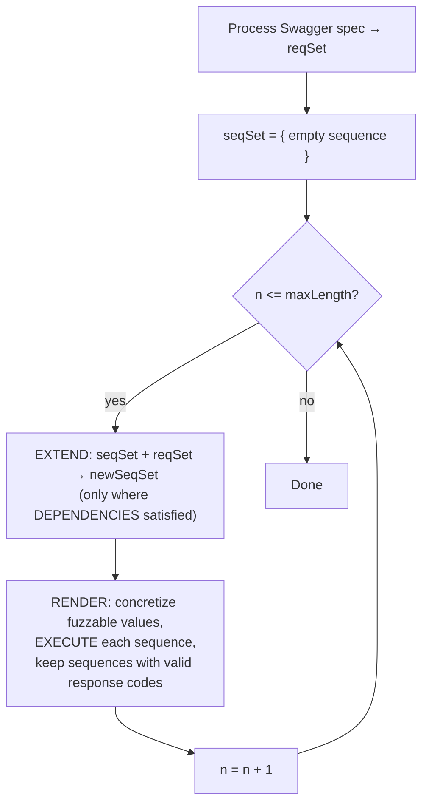

# RESTler: Stateful REST API Fuzzing

**Authors:** Vaggelis Atlidakis (Columbia University), Patrice Godefroid (Microsoft Research), Marina Polishchuk (Microsoft Research)

## 📌 Abstract

- Introduces **RESTler**, the first *stateful* REST API fuzzer.
- Analyzes a service's Swagger (OpenAPI) specification and generates sequences of requests to test it.
- Builds test sequences using two techniques:
  1. **Dependency inference** — infers producer-consumer relationships between request types (e.g., request `B` needs a resource id `x` produced by request `A`, so `A` must run before `B`).
  2. **Dynamic feedback analysis** — learns from response history (e.g., "request `C` after sequence `A;B` gets refused") and avoids bad combinations going forward.
- Both techniques are shown to be **necessary** for thorough testing while pruning the huge space of possible request sequences.
- Tested against **GitLab** plus several **Microsoft Azure** and **Office365** cloud services.
- **28 bugs** found in GitLab; multiple bugs found in each Azure/Office365 service — all confirmed and fixed by the owners.

---

## I. Introduction

> Cloud services (SaaS, PaaS, IaaS) are overwhelmingly accessed via **REST APIs**, typically described using **Swagger/OpenAPI** specifications.

🔬 **Problem:** Tools for automatically testing REST APIs for reliability/security are immature. Existing tools mostly:
- Capture live API traffic
- Parse, fuzz, and replay it
- Hope to find bugs

These tools are recent, not widely used, and their real-world bug-finding effectiveness is largely unknown.

### What RESTler Does Differently

RESTler performs **lightweight static analysis** of an entire Swagger spec, then generates and executes tests that exercise the service **statefully** — i.e., it explores states only reachable via *sequences* of multiple requests (not just one request at a time).

Each test = a sequence of requests + responses, generated by:

1. **Inferring dependencies** from the Swagger spec — e.g., a resource in response of `A` is needed as input to `B`, so `A` runs before `B`.
2. **Analyzing dynamic feedback** from prior executions — e.g., learning that `C` after `A;B` is refused, and avoiding that path later.

### 🔑 Key Contributions

- First automatic, **stateful** fuzzing tool for REST APIs (infers dependencies + uses response feedback).
- Experimental evidence that both core techniques are necessary for effective fuzzing.
- Comparison of **three search strategies** for navigating the request-sequence search space.
- Detailed **GitLab case study** — 28 new bugs found.
- Preliminary results fuzzing several **Microsoft public cloud services**.

### Paper Roadmap

| Section | Content |
|---|---|
| II | How Swagger specs are processed |
| III–IV | Main test-generation algorithm + implementation |
| V | Evaluation of techniques and search strategies |
| VI | New bugs found in GitLab |
| VII | Experience fuzzing public cloud services |
| VIII | Related work |
| IX | Conclusion |

---

## II. Processing API Specifications

- A **Swagger specification** describes a REST API: what requests are handled, expected responses, and response formats.
- Open-source Swagger tooling can auto-generate a browsable web UI from the spec.

### 🖼️ Example: Blog Posts Service (Figure 1)

A simple service with five request types:

| Method | Endpoint | Description |
|---|---|---|
| `GET` | `/blog/posts/` | Returns list of blog posts |
| `POST` | `/blog/posts/` | Creates a new blog post |
| `DELETE` | `/blog/posts/{id}` | Deletes a blog post matching `id` |
| `GET` | `/blog/posts/{id}` | Returns a blog post matching `id` |
| `PUT` | `/blog/posts/{id}` | Updates a blog post matching `id` and `checksum` |

### From Spec to Grammar (Figure 2)

RESTler converts a Swagger YAML snippet into an **executable Python grammar**:

- `restler_static(x)` → appends the literal string `x` unchanged.
- `restler_fuzzable(type)` → substitutes a value of that type from a small dictionary (e.g., dictionary for `string` might contain `"sampleString"`).

Example: the `POST /blog/posts/` schema requires `body` (string) and optionally returns `id` (integer). RESTler auto-generates a `parse_posts` function that extracts the returned `id` and registers it as a **dynamic object** for reuse.

```python
def parse_posts(data):
    post_id = data["id"]
    dependencies.set_var(post_id)

request = requests.Request(
    restler_static("POST"),
    restler_static("/api/blog/posts/"),
    restler_static("HTTP/1.1"),
    restler_static("{"),
    restler_static("body:"),
    restler_fuzzable("string"),
    restler_static("}"),
    {
        'post_send': {
            'parser': parse_posts,
            'dependencies': [post_id.writer()]
        }
    }
)
```

📌 **Key Point:** By analyzing all request types in the spec this way, RESTler automatically infers that the `id` produced by `POST` is required by the other three request types (`GET/{id}`, `PUT/{id}`, `DELETE/{id}`). These **producer-consumer dependencies** drive later test generation.

---

## III. Test Generation Algorithm

🔬 **Method overview** (Figure 3, python-like pseudocode):



### Core Functions

- **`EXTEND(seqSet, reqSet)`** — for every existing sequence, tries appending every request type whose dependencies are satisfied; builds the length-`n` candidate set.
- **`DEPENDENCIES(seq, req)`** — true if every object `req` *consumes* is already *produced* somewhere in `seq`.
- **`CONSUMES(req)`** — object types required as input by `req`.
- **`PRODUCES(seq)`** — all dynamic objects produced by responses across the sequence so far.
- **`RENDER(seqSet)`** — for each candidate sequence's newly appended request, enumerates combinations of concrete dictionary values for its fuzzable fields, **executes** the resulting sequence, and keeps it only if the final response has a valid (2xx) status code; otherwise logs the error and discards it.

> A **valid sequence** = one where every response in it falls in the 200 range.

### Execution Semantics (`EXECUTE`)

- Runs requests in a sequence one at a time.
- Validates each response, memoizes any dynamic objects created.
- Feeds memoized objects into later requests that need them, in the **order they were produced** (no reordering/permutation attempted).
- If a dynamic object becomes stale/unusable (detected via a non-2xx response when reused), the whole sequence is discarded.

⚠️ **Limitation:** Default `RENDER` tries *all* combinations of dictionary values per request — for large dictionaries this can explode combinatorially. Mitigations mentioned: random sampling of dictionary values, or combinatorial-testing techniques (e.g., pairwise coverage). The paper's experiments used small dictionaries with the default exhaustive `RENDER`.

### 🔎 Search Strategies

The main loop (`EXTEND`) as described performs **breadth-first search (BFS)** over the request-sequence space. Two additional strategies are introduced and compared later (Section V):

| Strategy | Behavior |
|---|---|
| **BFS** | Extends *every* sequence with *every* eligible request — full coverage, most sequences generated. |
| **BFS-Fast** | Appends each eligible request to *at most one* sequence — still covers every request type per iteration (full grammar coverage) but with far fewer sequences, so it goes deeper faster. |
| **RandomWalk** | Randomly picks one existing sequence + one eligible request, repeating until dependencies are satisfied; restarts from an empty sequence when it can't extend further. Explores deeper, faster, but doesn't memoize past sequences (may repeat work). |

---

## IV. Implementation

- **~3,151 lines** of modular Python, split into three modules:
  1. **Parser & compiler** — parses the Swagger spec, generates the RESTler grammar (a raw grammar can also be supplied directly if no Swagger spec exists).
  2. **Core fuzzing runtime** — implements the Figure 3 algorithm and its variants; renders requests, processes responses, extracts dynamic objects, and uses feedback to guide future sequence generation.
  3. **Garbage collector (GC)** — a separate thread that tracks created dynamic objects over time and deletes aging ones past a user-defined limit.

### Using RESTler (CLI tool)

**Inputs:**
- Swagger specification
- Service access parameters (IP, port, authentication)
- Mutations dictionary
- Search strategy choice

**Workflow:**
1. Compiles the spec → reports number of endpoints found and resolved/unresolved dependencies.
2. If dependencies are unresolved, user can add annotations/resource-specific mutations and recompile — *or* just start fuzzing, in which case unresolved consumer parameters are treated as `restler_fuzzable` string primitives.
3. During fuzzing, reports each **bug** — defined as an HTTP **500** ("Internal Server Error") — as soon as found.

### ⚠️ Current Limitations

- No support for server-side redirects (`301`, `303`, `307`).
- Bug detection is limited to unexpected HTTP status codes — **cannot** detect vulnerabilities invisible at the status-code level (e.g., Information Exposure).

---

## V. Evaluation

Three research questions drive the evaluation:

- **Q1:** Are *both* dependency-inference and dynamic-feedback analysis necessary for effective fuzzing? *(→ §V-B)*
- **Q2:** Does test depth (service-side logic exercised) increase with sequence length? *(→ §V-C)*
- **Q3:** How do the three search strategies compare across different APIs? *(→ §V-D)*

Q1 is answered using the simple **Blog Posts** service; Q2 and Q3 use **GitLab**.

### A. Experimental Setup

**🖼️ Blog Posts Service**
- 189 lines of Python (Flask).
- 5 request types (see Figure 1 table above).
- A deliberately planted **subtle bug**: on `PUT` update, if the request's `checksum` matches the *currently recorded* checksum, an uncaught exception fires.
  - This bug is only reachable if the fuzzer tracks dynamic-object dependencies across requests (i.e., needs the real checksum from a prior `GET`, not a guessed one).

**🖼️ GitLab**
- Open-source self-hosted Git service; backend >376K lines of Ruby (Ruby on Rails), REST API front end.
- Deployment config: Nginx → Unicorn (15 workers, 2GB cap each), PostgreSQL (pool of 10), default Sidekiq/Redis setup.
- Rated to scale to ~4,000 concurrent users per GitLab's own guidance.
- Used by 100,000+ organizations; ~2/3 market share of self-hosted Git.

**Fuzzing dictionaries used:**

| Type | Values |
|---|---|
| `string` | `"sampleString"`, `""` |
| `integer` | `0`, `1` |
| `boolean` | `true`, `false` |

**Hardware:** Ubuntu 16.04 Azure VMs, 8× Intel Xeon E5-2673 v3 @ 2.40GHz, 56GB RAM.

### B. Techniques for Effective REST API Fuzzing (Q1)

Compared three algorithm variants on the Blog Posts service, generating all sequences up to length 3:

1. **No dependencies** — treats dynamic objects (`post_id`, `checksum`) as plain fuzzable strings; still uses dynamic feedback.
2. **No dynamic feedback** — infers dependencies and generates valid sequences by type, but doesn't prune using response feedback.
3. **Full RESTler** — both dependencies *and* dynamic feedback (Figure 3 algorithm).

📊 **Results (Figure 4):**

- **Code coverage:**
  - Without dependency-tracking: coverage capped at **~130 lines**, flat over time — random/guessed ids and checksums can't drive the service deeper.
  - With dependency-tracking (with or without feedback): coverage rises to **~150 lines**.
- **Test volume / time:**
  - Without dynamic feedback: **4,600+ tests**, **1,750 seconds**, ~150 lines covered.
  - With dynamic feedback: same ~150-line coverage reached with **<800 tests** in **179 seconds** — a large efficiency gain.
- **HTTP status code distribution:**
  - Ignoring feedback → high rate of 40X responses (~60%).
  - Using feedback, no dependencies → 40X drops to ~26%.
  - Using feedback + dependencies → 40X drops further to ~20%, with ~80% of responses in the 20X range (best exercise of service logic).
- **Bug detection:**
  - The planted checksum bug (500 error) is **only found** when dependencies among request types are used (to supply the real checksum from a prior `GET`).
  - Adding dynamic feedback on top preserves this bug detection while needing the fewest tests overall.

✅ **Conclusion for Q1:** Dependency-inference and dynamic-feedback analysis are **complementary** — both are needed for effective, efficient REST API fuzzing.

### C. Deeper Service Exploration (Q2)

- Uses GitLab, split into six API groups: commits, branches, issues/notes, repositories/repo files, groups/group membership, projects.
- Table I shows the total number of requests in each API group plus the coverage increase, tests executed, seqSet size, and number of dynamic objects created (using BFS) until the 5-hour timeout.
- Code coverage is collected via Ruby's `Class::TracePoint` hook on GitLab's `service/lib` folder; numbers below are incremental on top of the 16,836 LOC executed at service boot.


## 📊 Blog Posts Service: Code Coverage & Bug Finding

🖼️ Figure: Three side-by-side panels (Fig. 4) showing code coverage (LOC) over time/test cases (top row) and cumulative HTTP status codes received over time (bottom row) for a simple blog posts service, under three RESTler configurations:
- **Left** — RESTler ignores dependencies among request types
- **Center** — RESTler ignores dynamic feedback
- **Right** — RESTler uses both dependencies and dynamic feedback (best coverage; finds the planted `500 Internal Server Error` bug with fewest tests)

> **Key takeaway:** combining dependency-awareness with dynamic feedback yields the best code coverage and the fastest bug discovery.

---

## 🔬 Testing Common GitLab APIs with RESTler

**Setup:**
- 5-hour timeout per experiment
- Max 1,000 fuzzable primitive-type combinations per request
- GitLab service rebooted to the same initial state between experiments
- BFS search strategy (Figure 3 algorithm)
- Code coverage measured via Ruby's `Class::TracePoint` hook on GitLab's `service/lib` folder
- Baseline: 16,836 LOC executed during service boot (coverage numbers below are incremental on top of this)

### Table I: Testing Common GitLab APIs with RESTler

| API | Total Requests | Seq. Len. | Coverage Increase | Tests | seqSet Size | Dynamic Objects |
|---|---|---|---|---|---|---|
| Commits | 11 | 1 | 598 | 1 | 1 | 1 |
| | | 2 | 1108 | 7 | 5 | 10 |
| | | 3 | 1196 | 250 | 46 | 521 |
| | | 4 | 1760 | 2220 | 1341 | 6577 |
| | | 5 | 1760 | 3667 | 20679 | 12518 |
| Branches | 7 | 1 | 598 | 1 | 1 | 1 |
| | | 2 | 1089 | 8 | 6 | 11 |
| | | 3 | 1172 | 58 | 44 | 107 |
| | | 4 | 1182 | 576 | 387 | 1279 |
| | | 5 | 1185 | 3644 | 5528 | 9336 |
| Issues | 22 | 1 | 816 | 37 | 37 | 37 |
| | | 2 | 1163 | 2444 | 1839 | 4245 |
| | | 3 | 1163 | 4156 | 15658 | 8870 |
| Repos | 10 | 1 | 598 | 1 | 1 | 1 |
| | | 2 | 1117 | 97 | 65 | 206 |
| | | 3 | 1181 | 5153 | 2194 | 15472 |
| Groups | 50 | 1 | 887 | 39 | 39 | 38 |
| | | 2 | 1177 | 3508 | 3360 | 5204 |
| | | 3 | 1177 | 4817 | 79518 | 8946 |
| Projects | 48 | 1 | 934 | 42 | 41 | 38 |
| | | 2 | 1192 | 1870 | 1781 | 3343 |
| | | 3 | 1203 | 3226 | 18173 | 7374 |

### 📌 Observations

- **Longer sequences → higher coverage.** Some functionality only activates after several requests are chained (e.g., GitLab's "select a commit" requires: create project → post commit → select commit by `commit-id` + `project-id`, needing ≥3 requests).
- **Commits API** coverage rises steadily: 598 → 1,108 → 1,196 LOC for sequence lengths 1, 2, 3.
- **Branches API** keeps gaining coverage up to sequence length 5, reaching 1,185 LOC before the 5-hour cutoff.
- **Search space explosion:** for Commits alone (11 request types, ~4 renderings average), all possible sequences up to length 4 exceed **164 million** — brute force is intractable. Even with RESTler's core techniques, seqSet size (20,679) and dynamic objects (12,518) still grow quickly for sequence length 5.

---

## 🔬 Search Strategy Comparison: BFS vs. BFS-Fast vs. RandomWalk

### Table II: Comparison of BFS, BFS-Fast, and RandomWalk Over Time

*Total Requests column shows average feasible request renderings in parentheses (\*).*

| API | Total Requests (*avg renderings) | Time (hrs) | BFS Len. | BFS Coverage | BFS-Fast Len. | BFS-Fast Coverage | RandomWalk Len. (restarts) | RandomWalk Coverage | Final seqSet (BFS / BFS-Fast) |
|---|---|---|---|---|---|---|---|---|---|
| Commits | 11 (\*11) | 1 | 4 | 1202 | 7 | 1697 | 13 (16) | 1285 | — |
| | | 3 | 5 | 1760 | 9 | 1731 | 13 (35) | 1295 | — |
| | | 5 | 5 | 1760 | 12 | 1731 | 13 (56) | 1303 | 20679 / 33 |
| Branches | 7 (\*2) | 1 | 5 | 1182 | 21 | 1154 | 15 (24) | 1182 | — |
| | | 3 | 5 | 1185 | 37 | 1178 | 19 (92) | 1187 | — |
| | | 5 | 5 | 1185 | 47 | 1178 | 22 (158) | 1208 | 5528 / 11 |
| Issues | 22 (\*82) | 1 | 2 | 1150 | 2 | 1086 | 10 (1) | 770 | — |
| | | 3 | 3 | 1163 | 4 | 1551 | 10 (1) | 770 | — |
| | | 5 | 3 | 1163 | 5 | 1570 | 16 (2) | 847 | 15658 / 26 |
| Repos | 10 (\*24) | 1 | 3 | 1127 | 5 | 1141 | 10 (29) | 1195 | — |
| | | 3 | 3 | 1127 | 7 | 1141 | 13 (88) | 1231 | — |
| | | 5 | 3 | 1181 | 8 | 1161 | 13 (142) | 1231 | 2194 / 64 |
| Groups | 50 (\*2) | 1 | 2 | 961 | 6 | 1275 | 19 (41) | 1167 | — |
| | | 3 | 3 | 1177 | 11 | 1275 | 19 (120) | 1250 | — |
| | | 5 | 3 | 1177 | 14 | 1275 | 22 (186) | 1283 | 79518 / 130 |
| Projects | 48 (\*4) | 1 | 2 | 1006 | 5 | 1318 | 4 (3) | 889 | — |
| | | 3 | 2 | 1053 | 11 | 1319 | 22 (31) | 1024 | — |
| | | 5 | 3 | 1203 | 15 | 1319 | 22 (45) | 1273 | 18173 / 171 |

> Although BFS covers slightly more lines of code in some APIs, BFS-Fast and RandomWalk reach **deeper** request sequences while keeping a much **smaller seqSet**.

### 📌 Findings

- **BFS vs. BFS-Fast:**
  - BFS wins on coverage for APIs with *few* requests (Commits, Branches, Repos) since it can exhaustively cover all feasible sequences.
  - BFS-Fast scales better on APIs with *many* requests (Issues, Groups, Projects) — after 5 hours BFS is stuck at sequence length 3 for these, while BFS-Fast reaches lengths 5, 14, and 15 respectively.
  - BFS-Fast appends each request to at most one sequence per generation (rather than exploring all combinations), keeping seqSet smaller and coverage growth faster.

- **BFS vs. RandomWalk:**
  - RandomWalk doesn't guarantee full grammar coverage (appends each request to one random sequence per generation) but keeps seqSet very small.
  - RandomWalk reaches the deepest sequences overall and wins on coverage in Branches, Repos, and Groups after 5 hours.
  - **Exception — Issues API:** RandomWalk reaches sequence length 16 but only 847 LOC coverage, while BFS (length 3) achieves 1,163 LOC and BFS-Fast (length 5) achieves 1,570 LOC. Issues has a high average of feasible request renderings (82), so RandomWalk's restarts stay low (only 2 after 5 hrs), trapping the search in a narrow subspace.

> **Practical implication:** controlling seqSet size *and* maintaining search breadth both matter for coverage — but coverage is only a heuristic; the real goal is finding bugs.

---

## 🐛 Bug Bucketization

**Definition:** a *bug* = a `500` HTTP status code returned after executing a request sequence.

### Bucketization procedure
1. When a new bug is found, compute all non-empty suffixes of its (non-rendered) request sequence, starting from the smallest.
2. Check if any suffix matches a previously recorded bug-triggering sequence.
3. If matched → add to that bug's existing bucket.
4. If not → create a new bucket.

> With BFS or BFS-Fast, this scheme identifies each bug by its *shortest* triggering sequence.

### Table III: Bug Buckets Found by Each Search Strategy (after 5 hours)

| API | BFS | BFS-Fast | RandomWalk | Intersection | Union |
|---|---|---|---|---|---|
| Commits | 5 | 1 | 5 | 1 | 5 |
| Branches | 7 | 7 | 7 | 5 | 8 |
| Issues | 0 | 1 | 1 | 0 | 1 |
| Repos | 2 | 3 | 3 | 2 | 3 |
| Groups | 0 | 0 | 2 | 0 | 2 |
| Projects | 2 | 1 | 3 | 1 | 3 |
| **Total** | **16** | **13** | **21** | **9** | **22** |

### 📌 Findings

- Across all strategies combined, RESTler found **22 new unique bugs** in this experiment set.
- **RandomWalk finds the most bugs (21)** vs. BFS (16) and BFS-Fast (13) — despite *not* always achieving the best coverage.
- Notably, in **Commits** and **Issues**, RandomWalk matches or exceeds the combined bug count of BFS + BFS-Fast, even though it delivers *less* coverage in those APIs.
- **Conclusion:** coverage increase alone should not dictate search-strategy choice — different strategies can be complementary in large search spaces, since bug discovery doesn't perfectly correlate with code coverage.

---

## 🐛 New Bugs Found in GitLab

Across all fuzzing experiments, RESTler found **28 new unique bugs** in GitLab — all reproducible, disclosed, confirmed, and fixed by GitLab developers.

### Example 1 — Commits API bug
- **Trigger:** cherry-picking a commit to a branch with an **empty name**.
- **Root cause:** incomplete input validation. The Ruby layer checking branch existence calls a native C function expecting `NULL` or an existing entry; an unmatched type (empty string) raises an exception unhandled by the higher-level Ruby code → `500 Internal Server Error`.
- **Reproduction steps:**
  1. Create a project
  2. Create a new branch (in addition to default `master`)
  3. Post a valid commit with action `create` on the new branch
  4. Cherry-pick the commit to a branch with an empty-string name

### Example 2 — Branches API bug
- **Trigger:** editing a branch belonging to a **recently deleted project**.
- **Root cause:** invalid serialization of operations leads to a DB update using an invalid foreign key (the deleted project's ID) → `PG::ForeignKeyViolation` → `500 Internal Server Error`.
- **Reproduction steps:**
  1. Create a project
  2. Create a branch
  3. Delete the project
  4. Quickly edit the branch of the now-deleted project

### 📌 Common Pattern

> Most bugs follow a two-step pattern:
> 1. RESTler drives the service deep enough to reach a specific valid **state**.
> 2. While in that state, RESTler issues an additional request with an unexpected fuzzed value (e.g., empty string) or unexpected action (e.g., edit a deleted resource).

---

## ☁️ Experiences with Public Cloud Services

RESTler was also tested (preliminarily) against **three Azure services** and **one Microsoft Office365 service**, mostly resource-management and real-time data-aggregation services, using publicly available Swagger specs from Microsoft's GitHub.

- New bugs found in **all** tested services, including:
  - Mis-handled invalid inputs (wrong ID/enum value)
  - Operations executed in invalid states (e.g., updating a deleted resource)
  - Inconsistent parameter validation (valid body + incorrect metadata)
- All bugs confirmed and fixed by Microsoft.
- `500` errors are treated as potential server-state corruption — safer to fix proactively than risk a live incident.

### ⚠️ Challenges Unique to Public Cloud Testing

1. **Resource Quotas**
   - Production services enforce default quotas; once hit, RESTler kept retrying sequences that could no longer succeed, stalling progress.
   - **Fix:** implemented a **garbage collector (GC)** thread that monitors and periodically deletes unused dynamic objects, letting RESTler run continuously for hours/days without quota errors.

2. **Short-lived Access Tokens**
   - Public cloud services use refreshable, short-lived tokens (unlike static/long-lived tokens in self-contained deployments).
   - **Fix:** an **authentication hook** periodically runs user-provided code/scripts to refresh and inject new tokens into RESTler's token pool.

3. **Application-specific Naming Schemes**
   - Swagger specs may be incomplete or not fully REST-compliant, leading to incomplete dependency inference.
   - **Fix:** RESTler supports:
     - **Annotations** (Swagger extensions) to explicitly declare dependencies
     - **Resource-specific mutations** for custom-format resource creation (e.g., IP addresses)
   - Useful for Azure's pattern of PUT requests that create resources with user-provided names passed as URL params (also returned in the response).

---

## 📚 Related Work

- **HTTP Fuzzers** (Burp, Sulley, BooFuzz, AppSpider, Qualys WAS): capture/replay HTTP traffic and fuzz using pre-defined or user-defined rules; some now leverage Swagger specs. RESTler's originality: lightweight static analysis of Swagger specs to infer **request-type dependencies**, enabling stateful sequence generation without pre-recorded traffic.

- **Feedback-directed Test Generation:** RESTler's dynamic-feedback pruning is conceptually similar to Randoop, though search strategies and object-equality optimizations differ. Unlike Randoop's typed object-oriented approach, Swagger's dynamic objects are implicitly declared and untyped — addressed via RESTler's annotation support.

- **Model-based Testing:** BFS-Fast is inspired by model-based test generation aiming for minimal test sets with full state/transition coverage, and by grammar-coverage test generation. BFS-Fast provides full grammar coverage up to a given sequence length (not necessarily minimal test count, but manageable in practice).

- **Grammar-based Fuzzing** (Peach, SPIKE, etc.): general-purpose, but require manually constructed API-specific grammars. RESTler automatically derives its grammar from a Swagger spec, with fuzzing rules generated automatically.

- **Grammar Learning from Samples:** a complementary research direction; RESTler currently depends on a Swagger spec but could potentially be refined using representative unit tests, live traffic, or ML/static analysis for services lacking specs.

- **Whitebox Fuzzing:** combines grammar-based fuzzing with dynamic symbolic execution; RESTler is purely **blackbox** (only sees requests/responses). Possible future direction: incorporating backend log alerts (e.g., assertion violations) to better correlate bugs with request sequences.

- **Penetration Testing:** the dominant industry practice, but labor-intensive, expensive, and limited in scope/depth. Fuzzing tools like RESTler automate discovery of specific vulnerability classes and complement (not replace) pen testing.

---

## ✅ Conclusion

- RESTler is presented as **the first automatic stateful-fuzzing tool for cloud services via REST APIs**.
- Found **28 bugs in GitLab** and several bugs across four Azure/Office365 services — results deemed preliminary but encouraging.
- Open question: **how general are these results?** More services and properties need testing to characterize the security vulnerabilities hiding behind REST APIs (unlike well-studied classes like buffer overflows or XSS).
- Past pen-testing evidence of such vulnerabilities is largely anecdotal; **systematic, automated tools** like RESTler are needed to answer:
  - How many bugs can be found by fuzzing REST APIs?
  - How security-critical are they?

## 🙏 Acknowledgements

Thanks extended to William Blum, Dave Tamasi, David Molnar, the Microsoft Security Risk Detection team, Albert Greenberg, Mark Russinovich, John Walton (Microsoft Azure), and the GitLab/Microsoft developers who acknowledged and fixed the reported bugs.


## 📚 References

1. S. Allamaraju. *RESTful Web Services Cookbook*. O'Reilly, 2010.
2. Amazon. AWS. https://aws.amazon.com/
3. APIFuzzer. https://github.com/KissPeter/APIFuzzer
4. AppSpider. https://www.rapid7.com/products/appspider
5. M. Barnett, M. Fahndrich, and F. Logozzo. Embedded Contract Languages. In *Proceedings of SAC-OOPS'2010*. ACM, March 2010.
6. O. Bastani, R. Sharma, A. Aiken, and P. Liang. Synthesizing Program Input Grammars. In *Proceedings of PLDI'2017*, pages 95–110. ACM, 2017.
7. BooFuzz. https://github.com/jtpereyda/boofuzz
8. Burp Suite. https://portswigger.net/burp
9. C. Cadar, V. Ganesh, P. M. Pawlowski, D. L. Dill, and D. R. Engler. EXE: Automatically Generating Inputs of Death. In *Proceedings of CCS'2006*, 2006.
10. D. M. Cohen, S. R. Dalal, J. Parelius, and G. C. Patton. The Combinatorial Design Approach to Automatic Test Generation. *IEEE Software*, 13(5), 1996.
11. R. T. Fielding. *Architectural Styles and the Design of Network-based Software Architectures*. PhD Thesis, UC Irvine, 2000.
12. Flask. Web development, one drop at a time. http://flask.pocoo.org/
13. GitLab. GitLab. https://about.gitlab.com
14. GitLab. GitLab API. https://docs.gitlab.com/ee/api/
15. GitLab. Hardware requirements. https://docs.gitlab.com/ce/install/requirements.html
16. GitLab. Sample Bug1. https://gitlab.com/gitlab-org/gitlab-ce/issues/50955
17. GitLab. Sample Bug2. https://gitlab.com/gitlab-org/gitlab-ce/issues/50265
18. GitLab. Sample Bug3. https://gitlab.com/gitlab-org/gitlab-ce/issues/50270
19. GitLab. Sample Bug4. https://gitlab.com/gitlab-org/gitlab-ce/issues/50949
20. GitLab. Statistics. https://about.gitlab.com/is-it-any-good/
21. P. Godefroid, A. Kiezun, and M. Y. Levin. Grammar-based Whitebox Fuzzing. In *Proceedings of PLDI'2008*, pages 206–215, 2008.
22. P. Godefroid, N. Klarlund, and K. Sen. DART: Directed Automated Random Testing. In *Proceedings of PLDI'2005*, pages 213–223, 2005.
23. P. Godefroid, M. Levin, and D. Molnar. Automated Whitebox Fuzz Testing. In *Proceedings of NDSS'2008*, pages 151–166, 2008.
24. P. Godefroid, H. Peleg, and R. Singh. Learn&Fuzz: Machine Learning for Input Fuzzing. In *Proceedings of ASE'2017*, pages 50–59, 2017.
25. M. Höschele and A. Zeller. Mining Input Grammars from Dynamic Taints. In *Proceedings of ASE'2016*, pages 720–725, 2016.
26. R. Lämmel and W. Schulte. Controllable Combinatorial Coverage in Grammar-Based Testing. In *Proceedings of TestCom'2006*, 2006.
27. R. Majumdar and R. Xu. Directed Test Generation using Symbolic Grammars. In *Proceedings of ASE'2007*, 2007.
28. B. Meyer. *Eiffel*. Prentice-Hall, 1992.
29. Microsoft. Azure. https://azure.microsoft.com/en-us/
30. Microsoft. Office. https://www.office.com/
31. S. Newman. *Building Microservices*. O'Reilly, 2015.
32. C. Pacheco, S. Lahiri, M. D. Ernst, and T. Ball. Feedback-Directed Random Test Generation. In *Proceedings of ICSE'2007*. ACM, 2007.
33. Peach Fuzzer. http://www.peachfuzzer.com/
34. Qualys Web Application Scanning (WAS). https://www.qualys.com/apps/web-app-scanning/
35. Ruby on Rails. Rails. http://rubyonrails.org
36. D. She, K. Pei, D. Epstein, J. Yang, B. Ray, and S. Jana. Neuzz: Efficient fuzzing with neural program learning. *CoRR*, abs/1807.05620, 2018.
37. SPIKE Fuzzer. http://resources.infosecinstitute.com/fuzzer-automation-with-spike/
38. Sulley. https://github.com/OpenRCE/sulley
39. M. Sutton, A. Greene, and P. Amini. *Fuzzing: Brute Force Vulnerability Discovery*. Addison-Wesley, 2007.
40. Swagger. https://swagger.io/
41. TnT-Fuzzer. https://github.com/Teebytes/TnT-Fuzzer
42. M. Utting, A. Pretschner, and B. Legeard. A Taxonomy of Model-Based Testing Approaches. *Intl. Journal on Software Testing, Verification and Reliability*, 22(5), 2012.
43. M. Yannakakis and D. Lee. Testing Finite-State Machines. In *Proceedings of the 23rd Annual ACM Symposium on the Theory of Computing*, pages 476–485, 1991.
