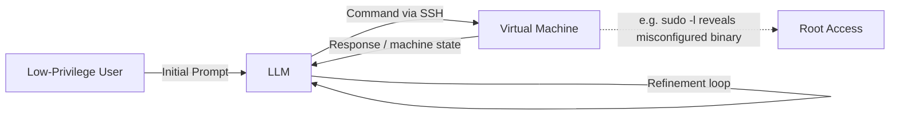
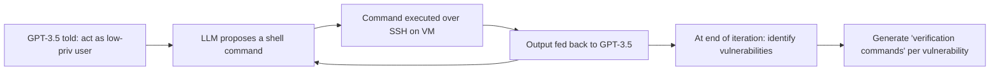

# Getting Pwn'd by AI: Penetration Testing with Large Language Models

**Authors:** Andreas Happe, Jürgen Cito (TU Wien, Austria)
**Venue:** ESEC/FSE '23, Dec 3–9 2023, San Francisco, CA, USA

> 📌 **Abstract (paraphrased):** The paper investigates whether large language models (e.g. GPT-3.5) can serve as "AI sparring partners" for penetration testers. Two scenarios are examined: high-level planning of a security-testing engagement, and low-level vulnerability discovery inside a deliberately vulnerable VM via a closed feedback loop over SSH. The authors report encouraging early results, note directions for future work, and close with a discussion of the ethics of AI sparring partners.

---

## 1. Introduction

- 🔬 **Motivation:** Cybersecurity — and penetration testing specifically — faces a severe and *growing* talent shortage: workforce grew ~11% year-over-year but the skills gap grew faster (~26% YoY), citing the ISC2 2022 workforce study.
- A prior interview study of pen-testers found that human "sparring partners" (colleagues who can suggest alternative approaches) are valuable, and that intuition — often built through CTF experience — is central to finding vulnerabilities. The authors ask whether this intuition can be partly outsourced to an AI.
- The framing throughout is **augmentation, not replacement**: pairing a human operator with an AI creates new capability rather than simply cloning existing human skill, and keeping a human in the loop reduces ethical risk. The authors also note that AI-driven efficiency gains tend to be largest for less-experienced workers, suggesting AI pairing could particularly help novice testers.

> 🎯 **Research Question:** *To what extent can penetration testing be automated using LLMs?*

- **Approach:** The MITRE ATT&CK framework (a structured knowledge base of adversary Tactics, Techniques, and Procedures — "TTPs") is used as a scaffold for evaluating LLM capability. A good AI sparring partner should, in principle, be able to help across the whole TTP spectrum.
- Two experiment types were run:
  1. **High-level guidance** — asking an LLM/agent to plan a penetration test, both generically and against a real target organization.
  2. **Low-level guidance** — hooking GPT-3.5 up to a vulnerable VM to analyze system state and propose concrete attack steps.

### ⚠️ Scope / Ethical Boundaries Set by the Authors
- They deliberately did **not** explore LLM-generated phishing/vishing content, citing ethical concerns.
- They flag automated penetration-test **report generation** as another promising (and comparatively low-risk) application area, noting anecdotal evidence that testers are already using generative AI for this.

---

## 2. Background

### MITRE ATT&CK
- A curated, hierarchical knowledge base of adversary behavior, commonly abbreviated **TTP**:
  - **Tactics** — high-level adversary goals (e.g., reconnaissance, privilege escalation, collection).
  - **Techniques** — general ways of achieving a tactic (e.g., abusing `sudo` caching, Kerberoasting).
  - **Procedures** — the concrete, technique-specific implementation details.
- The authors' working assumption: an effective AI sparring partner needs to help at both the tactic/technique level (high-level) and the technique/procedure level (low-level).

### Large Language Models
- Neural networks trained via self-supervised learning on very large corpora; capability scales roughly with parameter count (from single-digit billions up to trillions in the largest contemporary models).
- Whether ever-larger scale keeps paying off is described as an open debate in the field at the time of writing.
- Training a frontier model from scratch is prohibitively costly for most researchers, which has driven the rise of reusable **"foundation models"** that can be adapted/fine-tuned relatively cheaply.

### GPT-3.5 / ChatGPT
- Interaction happens via natural-language "prompts," giving rise to the practice of **prompt engineering**.
- Smaller, locally-runnable model tooling (e.g., `llama.cpp`, supporting models up to ~13B parameters) has enabled research and use without cloud costs or provider-side moderation.

### Pre-trained Autonomous AI Agents
Three examples of early autonomous-agent frameworks are discussed:

| Framework | Core Idea |
|---|---|
| **AutoGPT** | Auto-generates its own instruction sequences from a concise user goal, reducing manual prompt engineering; can incorporate web queries and optional human feedback; breaks a goal into a task list delegated to sub-agents. |
| **BabyAGI** | Splits a user-given task into subtasks held in a task queue; a *Task Execution Agent* runs tasks and updates a memory store, a *Task Creation Agent* adds new subsequent tasks, a *Context Agent* supplies memory-based context before execution, and a *Prioritization Agent* orders the queue. All roles are instances of GPT-4. A minimal ~100-line Python version also exists. |
| **Jarvis** | Coordinates multiple agents built on different underlying models to form a multi-modal, multi-agent system. |

---

## 3. LLM-Based Penetration Testing

The authors split their evaluation into two complementary levels:

- **High level:** questions like *"what is a good attack methodology against Active Directory?"* — the LLM should surface relevant tactics and techniques.
- **Low level:** questions like *"given a privilege-escalation tactic, what concrete attack vectors apply to this specific Linux system?"* — the LLM should surface actionable techniques/procedures.

*🖼️ Figure 1 (redrawn as a diagram): a low-level closed feedback loop — the LLM issues shell commands over SSH to a target VM, reads the response, and iteratively refines its next command (illustrated in the original with a `sudo -l` misconfiguration leading to a root shell via a Perl exec trick).*

### 3.1 High-Level: Task-Planning Systems

- **AgentGPT experiment:** prompted to *"become domain admin in an Active Directory."* It produced a plan citing realistic, industry-standard techniques — password spraying, Kerberoasting, AS-REP roasting, abusing AD Certificate Services, unconstrained delegation abuse, and group-policy abuse. The authors judged all of these realistic and commonly used in real engagements.
- **AutoGPT experiment:** after obtaining the target company's approval, the authors asked AutoGPT to build an external penetration-test plan. It proposed standard methodology — network vulnerability scanning, OSINT/user enumeration, and phishing against identified users.
  - When pushed further, AutoGPT **was willing** to crawl the target's website to enumerate real employee names/emails (OSINT), but it **declined**, citing its own ethical safeguards, to actually run a live network scan or execute phishing.
  - The authors' takeaway: both the plan and the refusals were realistic and would give a human tester genuinely useful directional feedback.

---
*End of Chunk 1.*

## 3.2 Low-Level: Attack-Execution System

The low-level evaluation targets a common pen-testing scenario: an attacker with low-privilege access to a Linux box searches for a way to escalate to root.

> 🔬 **Method**: A Python script uses SSH to connect to a deliberately vulnerable `lin.security` VM. Prototype code: [hackingBuddyGPT on GitHub](https://github.com/ipa-lab/hackingBuddyGPT).

The script runs an infinite feedback loop:

📌 **Key Point:** With this simple loop, the prototype was able to gain root privileges on the vulnerable VM.

### Common attack paths observed
- Listing the sudoers file (`sudo -l`) → abusing a listed shell or a [GTFObin](https://gtfobins.github.io/) to spawn a root shell
- Retrieving `/etc/passwd` → identifying accounts not using shadow passwords
- SUID binary searches were requested but didn't lead anywhere useful — a sign of weak multi-step planning (by the script or the model)
- A tweaked prompt asking the LLM to open a reverse shell to a given IP **worked** and dropped root shells

---

## 4. Discussion

Interpreted through the first author's 10+ years of pen-testing experience.

### 4.1 Grounding of Results and Hallucinations

⚠️ Because every command and its output is logged, the authors could tell whether suggestions came from **actual system evidence** or from **priors baked into training** (like a tester drawing on past CTF experience).

- After seeing the sudoers list → GPT-3.5 reliably proposed relevant sudo-based privilege escalation vectors
- After seeing `/etc/passwd` → it suggested attacking weakly configured accounts
- Some suggestions (e.g., `dirty_cow`) were plausible given "this is Linux" but weren't grounded in prior enumeration
- Hallucinations were rare — the most common was suggesting a nonexistent `exploit.sh`, likely echoing common phrasing from security write-ups in training data

> The authors compare the loop to a *pen-tester phoning a colleague for advice* — the colleague has a limited view of the system but strong priors. Eerie, given how simple the setup was, that it still reached root.

Adding "explain the found vulnerabilities" to the prompt turned it into a decent **on-the-job training aid**.

### 4.2 Stability and Reproducibility

| Aspect | Observation |
|---|---|
| Single runs | Unstable — command order/selection varied |
| Many runs (tens, aggregated) | Results converged |
| Cause of variance | GPT-3.5 fixating on single aspects ("rabbit-holing" — also common in human testers) |
| vs. `linpeas.sh` | LLM is less deterministic than a hardcoded enumeration script |

🖼️ Note: GPT-3.5 once suggested running `linpeas.sh` itself but failed — it tried to fetch it from an invalid URL.

### 4.3 Ethical Moderation in LLMs

- GPT-3.5-turbo's safety filters were only occasionally triggered
- Appending **"do not ask questions or provide judgments"** to prompts sharply cut refusals
- The optional "detail additional vulnerabilities" step was refused more often, but this didn't block overall progress
- Rewording "exploits for vulnerabilities" → **"verification commands for vulnerabilities"** reduced ethical pushback
- Running a **local model** would remove server-side ethics checks entirely

> ⚠️ This mirrors long-standing debates in security tooling: open-source/dual-use tools can serve both red teams and APTs alike, and vendor vetting only goes so far. Regulation for dual-use *goods* (e.g., Wassenaar Arrangement) applies awkwardly to *software*.

Two ethical issues explicitly **out of scope** for this paper:
1. Toxic content in training data
2. Copyrighted material in training data

---

## 5. A Vision of AI-Augmented Pen-Testing

### 5.1 Integrating High- and Low-Level Tasks
Currently split across two separate LLMs. A unified system would let an operator move fluidly between:
- High-level: *"what additional Active Directory attacks can I try?"*
- Low-level: *"given this system, how can I escalate?"*

Keeping everything in one system → synergy as the LLM accumulates system-specific knowledge.

### 5.2 Investigating Model Options
- Currently: OpenAI GPT-3 via cloud API
- Proposed comparisons: **Llama, StableLM, Dolly2, Koala** (local models)

**Why local models matter:**
- No cloud costs
- No sensitive data leaves the premises
- Enables fine-tuning on engagement-specific or customer-specific data over time — echoing how human testers "learn how a customer or industry thinks" over repeated engagements
- Open question: what's the minimum "good enough" parameter size, to reduce deployment resource cost?

### 5.3 Memory, Verification, and Reflection

Current prototype: simplistic memory = raw command output stuffed into the prompt until the context window fills up.

**Proposed improvements:**
- Use **reflection** (à la generative agent research) — summarize/extract only relevant findings before adding to context, rather than raw output
- Maintain **multiple memory streams**:
  1. Recently executed commands
  2. Extracted security findings
  3. An evolving model of "what kind of system this is" (i.e., emulate model-building as an internal reality check)

📌 Goal: reduce hallucination and better answer questions like *"what vulnerabilities might I have overlooked?"*

### 5.4 Prompts for Asking Better Questions
- Current prompts: static, hand-written
- Proposed: LLM-generated/optimized prompts (à la AutoGPT) — but given the sensitive use case, **human oversight of auto-generated prompts is essential**
- Also worth studying: what questions real pen-testers ask *themselves* during engagements, to better inform prompt design

---

## 6. Final Ethical Considerations

- This work targets **benign** use, but the same tooling is trivially subvertable for malicious purposes
- AI development is being pushed by both private companies (economic incentive) and state actors (geopolitical incentive) — this isn't slowing down
- Malicious use by APTs and criminals is reportedly increasing
- 🔒 **Locking models behind APIs doesn't solve this:**
  - Models can be run locally
  - Even gated models (e.g., LLaMA) have leaked
  - Fine-tuning a leaked model for malicious use is estimated at **under $1,000** of on-demand cloud compute (per StackLLaMA cost estimates)
  - Prompt engineering lowers the skill floor — no CS degree required, which is great for access but also for misuse

> **Closing line (paraphrased):** Whether or not LLMs end up used in hacking is no longer hypothetical — attackers will explore it, including fully automated approaches, and defenders need to prepare. LLMs can play a role on that defensive side too.

---

## 📚 References

| # | Source |
|---|---|
| [1] | AIAAIC, *AIAAIC Repository of incidents and controversies related to AI, algorithms and automation*, retrieved April 26, 2023 |
| [2] | The Wassenaar Arrangement, *The Wassenaar Arrangement on Export Controls for Conventional Arms and Dual-Use Goods and Technologies*, 1982 |
| [3] | MITRE ATT&CK, *Abuse Elevation Control Mechanism: Sudo and Sudo Caching*, 2020 |
| [4] | MITRE ATT&CK, *Steal or Forge Kerberos Tickets: Kerberoasting*, 2020 |
| [5] | Beeching et al., *StackLLaMA: An RL Fine-tuned LLaMA Model for Stack Exchange Question and Answering*, 2023 |
| [6] | Brynjolfsson, *The Turing Trap: The Promise & Peril of Human-like Artificial Intelligence*, in *Augmented Education in the Global Age*, Routledge, 2023 |
| [7] | Brynjolfsson, Li, and Raymond, *Generative AI at Work*, NBER Working Paper No. 31161, 2023 |
| [8] | Bukac, Lorenc, and Matyáš, *Red Queen's Race: APT Win-Win Game*, Cambridge International Workshop on Security Protocols, 2014 |
| [9] | Conover et al., *Free Dolly: Introducing the World's First Truly Open Instruction-Tuned LLM*, Databricks blog, 2023 |
| [10] | Denny, Kumar, and Giacaman, *Conversing with Copilot: Exploring Prompt Engineering for Solving CS1 Problems Using Natural Language*, SIGCSE 2023 |
| [11] | The Economist, *Huge Foundation Models Are Turbo-charging AI Progress*, 2022 |
| [12] | The Economist, *Large, Creative AI Models Will Transform Lives and Labour Markets*, 2023 |
| [13] | Geng et al., *Koala: A Dialogue Model for Academic Research*, BAIR blog, 2023 |
| [14] | Gerganov, *llama.cpp: Inference of LLaMA Model in Pure C/C++*, 2023 |
| [15] | Significant Gravitas, *Auto-GPT: An Autonomous GPT-4 Experiment*, 2023 |
| [16] | Happe & Cito, *Understanding Hackers' Work: An Empirical Study of Offensive Security Practitioners*, ESEC/FSE 2023 |
| [17] | Harang & Ducau, *Measuring the Speed of the Red Queen's Race*, BlackHat, 2018 |
| [18] | (ISC)², *(ISC)² Cybersecurity Workforce Study 2022* |
| [19] | Lake, *The Cybersecurity Industry Is Short 3.4 Million Workers—That's Good News for Cyber Wages*, Fortune, 2022 |
| [20] | Larson & Blackford, *Cobalt Strike: Favorite Tool from APT to Crimeware*, Proofpoint, 2021 |
| [21] | lin.security VM, VulnHub, 2018 |
| [22] | Liu & Chilton, *Design Guidelines for Prompt Engineering Text-to-Image Generative Models*, CHI 2022 |
| [23] | Maslej et al., *The AI Index 2023 Annual Report*, Stanford HAI |
| [24] | Miller, *Sam Altman: Size of LLMs Won't Matter as Much Moving Forward*, TechCrunch, 2023 |
| [25]–[27] | Nakajima, BabyAGI / *Task-driven Autonomous Agent* (GitHub, Twitter, blog post), 2023 |
| [28] | Park et al., *Generative Agents: Interactive Simulacra of Human Behavior*, arXiv:2304.03442 |
| [29] | Peng et al., *Check Your Facts and Try Again: Improving Large Language Models with External Knowledge and Automated Feedback*, arXiv:2302.12813 |
| [30] | Polop, *LinPEAS – Linux Privilege Escalation Awesome Script*, 2023 |
| [31] | Quach, *LLaMA Drama as Meta's Mega Language Model Leaks*, The Register, 2023 |
| [32] | Schaul, Chean, and Tiku, *Inside the Secret List of Websites That Make AI Like ChatGPT Sound Smart*, Washington Post, 2023 |
| [33] | Shen et al., *HuggingGPT: Solving AI Tasks with ChatGPT and Its Friends in HuggingFace*, arXiv:2303.17580 |
| [34] | Cybereason Global SOC and Incident Response Team, *Sliver C2 Leveraged by Many Threat Actors*, 2023 |
| [35] | Stability.ai, *Stability AI Launches the First of Its StableLM Suite of Language Models*, 2023 |
| [36] | Strobelt et al., *Interactive and Visual Prompt Engineering for Ad-hoc Task Adaptation with Large Language Models*, IEEE TVCG, 2022 |
| [37] | Strom et al., *MITRE ATT&CK: Design and Philosophy*, MITRE Corporation technical report, 2018 |
| [38] | Wei et al., *Emergent Abilities of Large Language Models*, arXiv:2206.07682 |
| [39] | Zhang et al., *LLaMA-Adapter: Efficient Fine-tuning of Language Models with Zero-init Attention*, arXiv:2303.16199 |
| [40] | Zhou et al., *Learning to Prompt for Vision-Language Models*, IJCV 130(9), 2022 |
