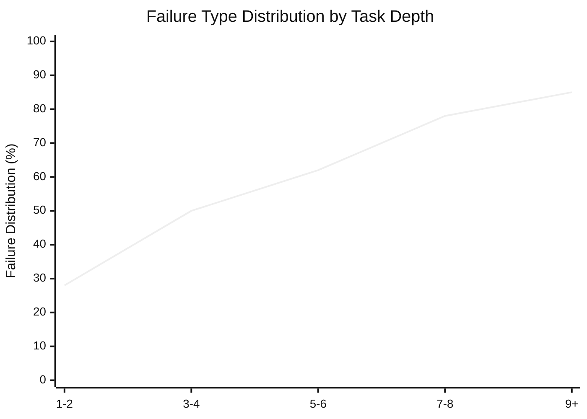
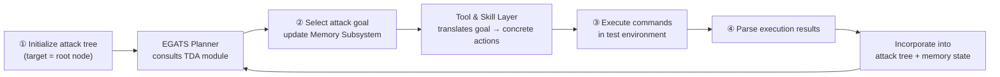
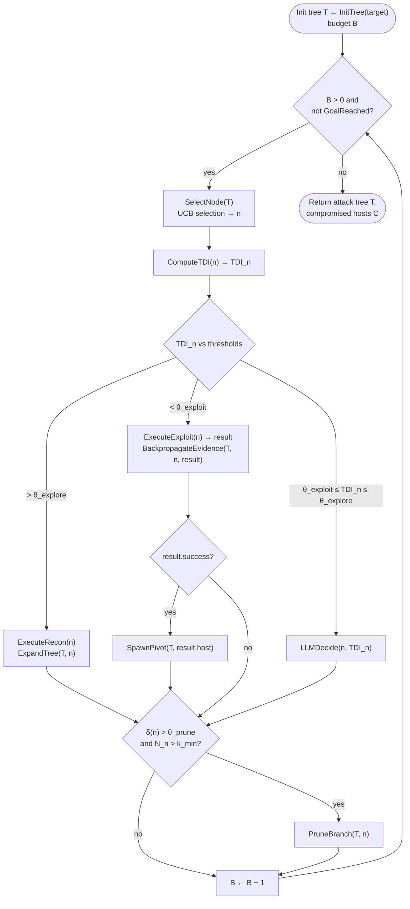
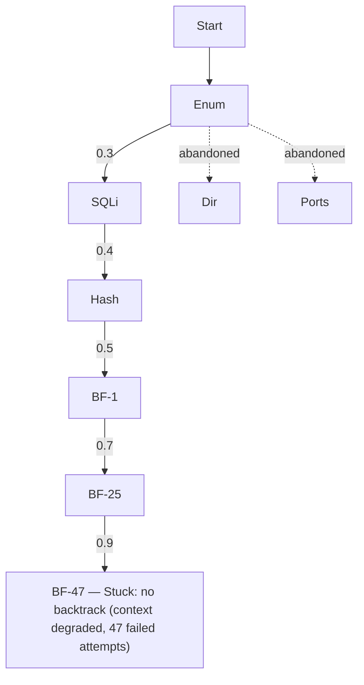
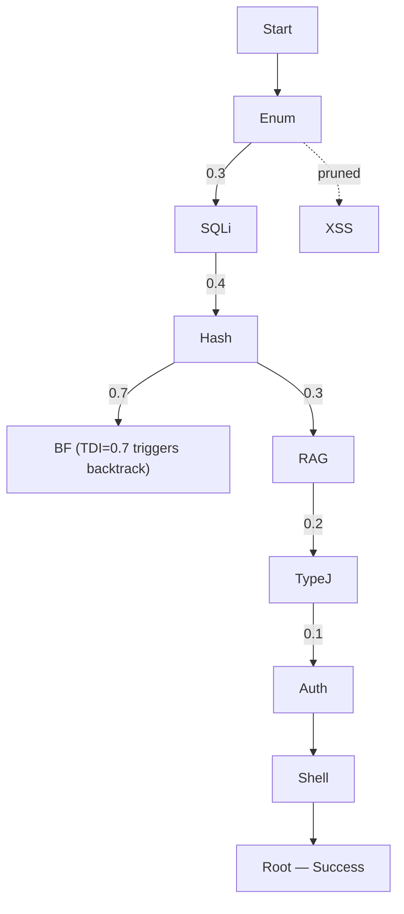

# What Makes a Good LLM Agent for Real-world Penetration Testing?

**Authors:** Gelei Deng, Yi Liu, Yuekang Li, Ruozhao Yang, Xiaofei Xie, Jie Zhang, Han Qiu, Tianwei Zhang
**Affiliations:** Nanyang Technological University · University of New South Wales · Singapore Management University · CFAR, A*STAR, Singapore · Tsinghua University

## 📌 Abstract

LLM-based agents show promise for automating penetration testing, but reported performance varies widely across systems and benchmarks. This work:

- Analyzes **28 LLM-based penetration testing systems**
- Evaluates **5 representative implementations** across **3 benchmarks** of increasing complexity

> **Two distinct failure modes identified:**
> - **Type A failures** — capability gaps (missing tools, inadequate prompts), readily addressed through engineering
> - **Type B failures** — persist regardless of tooling, due to planning and state-management limitations

🔬 **Key insight:** Type B failures share a root cause largely invariant to the underlying LLM — agents lack **real-time task difficulty estimation**. This causes agents to misallocate effort, over-commit to low-value branches, and exhaust context before completing attack chains.

### PENTESTGPT V2

A penetration testing agent coupling strong tooling with difficulty-aware planning:

- **Tool and Skill Layer** — eliminates Type A failures via typed interfaces + retrieval-augmented knowledge
- **Task Difficulty Assessment (TDA)** — addresses Type B failures by estimating tractability across four measurable dimensions:
  1. Horizon estimation
  2. Evidence confidence
  3. Context load
  4. Historical success
- **Evidence-Guided Attack Tree Search (EGATS)** — uses TDA estimates to guide exploration-exploitation decisions

📊 **Results:**
- Up to **91%** task completion on CTF benchmarks with frontier models (39–49% relative improvement over baselines)
- Compromises **4 of 5** hosts on the GOAD Active Directory environment vs. **2** by prior systems

**Conclusion:** Difficulty-aware planning yields consistent end-to-end gains across models, addressing a limitation that model scaling alone does not eliminate.

---

## 1. Introduction

Penetration testing is essential for assessing organizational security, but demand for skilled practitioners far exceeds supply — the ISC2 Cybersecurity Workforce Study estimates a global shortfall of **4.7 million** cybersecurity professionals.

This gap, combined with the labor-intensive nature of manual testing, has driven interest in LLM-based automation. Recent systems report strong results on CTF and Hack The Box (HTB) benchmarks, and emerging work shows real-world impact (e.g., discovering exploitable vulnerabilities in production software). However, reported task completion rates range widely — from single digits under naive prompting to 40–80% with more sophisticated architectures — raising the central question:

> What drives these performance differences, and what limitations remain?

### 🔬 Method: Systematic Analysis

The authors conducted a systematic analysis of 28 LLM-based penetration testing systems, evaluating five representative solutions across three benchmarks of increasing complexity. Two findings emerged:

**Finding 1 — Optimization target mismatch:** Existing systems are optimized to address limitations of *specific* LLMs (e.g., context summarization and RAG-augmented tooling compensate for transient constraints like limited context windows and poor tool knowledge). These benefits diminish as models improve — performance gaps across solutions compress by **over half** when backbone models upgrade from GPT-4o to GPT-5.

**Finding 2 — Two failure categories:**
- **Type A (capability gaps):** missing tools/knowledge, addressable via engineering
- **Type B (complexity barriers):** persist regardless of tooling, due to planning and state-management limitations

Existing systems predominantly target Type A failures — strong on simple tasks, but fail on multi-step scenarios where Type B failures dominate. Their architectures are not designed to complement LLM improvements; contributions **erode** rather than **compound** as models advance.

### Root Cause of Type B Failures

Existing pentest agent designs cannot assess task difficulty in real time. This manifests as:

- Committing prematurely to unproductive branches (can't estimate if a path needs 3 or 30 steps)
- Failing to transition from reconnaissance to exploitation (no metrics for evidence sufficiency)
- Context forgetting (no monitoring of context consumption)

> Human pentesters handle these problems through experience-built intuition. LLM agents lack equivalent difficulty-aware decision-making mechanisms.

**Validation:** Augmenting agents with difficulty assessment reduced the Type B failure rate from **58% → 27%**, while the Type A rate remained unchanged — confirming this addresses the root cause.

### PENTESTGPT V2 Design

Built around the two findings above:

| Failure Type | Solution |
|---|---|
| Type A | Extensible Tool and Skill Layer — typed interfaces for **38 security tools** + skill compositions encoding expert attack patterns |
| Type B | Task Difficulty Assessment (TDA) — estimates tractability via horizon estimation, evidence confidence, context load, historical success rate; integrated into Evidence-Guided Attack Tree Search |

Additional component: a **retrieval-augmented Memory Subsystem** maintains structured state external to the LLM context, preventing context forgetting during extended attack campaigns.

### 📊 Evaluation Results (Three Benchmarks)

| Benchmark | Description | Result |
|---|---|---|
| **XBOW** | 104 web security tasks | 91% peak task completion (89% mean) with Claude Opus 4.5 — 49% relative improvement over best baseline (61%) |
| **PentestGPT Benchmark** | 13 HTB/VulnHub machines | Roots 12 of 13 machines, including Hard-rated targets where baselines got stuck at initial steps |
| **GOAD** | 5-host Active Directory environment | Compromises 4 of 5 hosts (vs. ≤2 for prior systems), with successful lateral movement and credential chaining across domain boundaries |

**Ablation findings:** Tool Layer dominates gains on short-horizon tasks; TDA-EGATS and Memory drive gains on multi-step scenarios.

### ⚠️ Limitations

Hard challenges remain beyond current LLM capabilities:
- Novel exploitation requiring creative reasoning
- Adversarial environments with deceptive defenses
- Extended multi-week campaigns

Fully autonomous penetration testing remains distant. The paper discusses these boundaries and proposes evaluation methodologies distinguishing tractable from intractable challenges.

### Contributions Summary

1. **Systematic analysis (§3):** 28 systems analyzed, 5 implementations evaluated across 3 benchmarks; identifies Type A/Type B failure taxonomy
2. **PENTESTGPT V2 (§4):** Tool and Skill Layer (Type A) + TDA within Evidence-Guided Attack Tree Search (Type B)
3. **Evaluation (§5):** 91% on CTF benchmarks (49% improvement), 12/13 machines rooted, 4/5 AD hosts compromised (doubling baseline)
4. **Design principles (§6):** Analysis of remaining barriers + proposed Type A/Type B-aware evaluation methodologies
5. **Open-source artifacts:** Implementation, tool interfaces, and evaluation scripts released

---

## 2. Background

### 2.1 Penetration Testing

Penetration testing identifies security vulnerabilities by simulating real-world attackers in blackbox/greybox scenarios. Standard methodology phases:

This follows a characteristic search pattern: **breadth-first exploration** over attack surfaces, followed by **depth-first exploitation** along promising paths. Testers continuously decide which paths to pursue, when to abandon unproductive avenues, and how to integrate new discoveries — this exploration/exploitation interleaving motivates the paper's design (§4).

### 2.2 Benchmarking Penetration Testing

Evaluating pentest capabilities is methodologically challenging: real-world engagements involve social engineering, multi-target recon, and complex business logic that's hard to replicate; commercial tests produce confidential reports tied to proprietary systems.

**Standardized benchmarks used:**
- **VulnHub** — downloadable vulnerable VMs
- **HTB (Hack The Box)** — curated machines spanning difficulty levels
- **CTF competitions** — web exploitation, cryptography, binary exploitation challenges

⚠️ **Benchmark vs. reality gap:** CTF challenges are designed to be solvable via a single attack path, whereas real systems may have no exploitable vulnerabilities or require broad discovery across a large attack surface. **GOAD** (Game of Active Directory) is the closest approximation to realistic enterprise environments among current benchmarks — requiring chained attack techniques across multi-domain Windows networks — though it still abstracts away social engineering and time pressure.

> Benchmark results should be interpreted as measuring specific technical capabilities rather than predicting overall real-world effectiveness.

### 2.3 LLM-Based Agents

Standard approach: augment LLMs with **tool use** (invoking shell commands/APIs) + **agentic scaffolding** (structuring the interaction loop).

Penetration testing is a natural fit for such agents — it requires combining extensive domain knowledge with sequential decision-making, tool orchestration, and adaptive strategy.

- **Early work:** LLMs as copilots suggesting next steps to human operators
- **Recent work:** LLMs as autonomous agents executing recon, exploitation, and post-exploitation workflows

These agents must handle heterogeneous tool outputs, maintain coherent strategies across many steps, and decide when to pivot between attack paths — challenges that push against current LLM capability limits. Similar limitations appear in software engineering and web navigation agents, suggesting the barriers are **not specific to penetration testing**.

---

## 3. Understanding LLM Agent Failures

**Central question:** How far are we from real-world penetration testing with LLM agents?

**Goals of the empirical analysis:**
1. Understand what drives reported performance improvements
2. Identify failure modes through controlled evaluation
3. Establish a framework distinguishing tractable tasks from intractable challenges

### 3.1 Taxonomy and Evaluation of LLM-based Penetration Testing Systems

**Survey scope:** 28 candidate systems published 2023–2025. Inclusion criteria: must use LLMs as a core component and target penetration testing or CTF challenges; excludes vulnerability detection without exploitation and commercial systems without published details. **10 of 28** met criteria (full list in Appendix A).

#### 3.1.1 Taxonomy

Systems summarized along four dimensions: **architecture** (multi-agent, human-in-the-loop), **tool integration** (function calls, MCP), **knowledge sources** (RAG, fine-tuned), **planning** (reactive, task trees, state machines, memory trees).

**Table 1: Taxonomy of LLM-based penetration testing systems**

| System | Year | Arch. | Tools | Knowledge | Planning |
|---|---|---|---|---|---|
| PentestGPT | 2024 | Workflow | Shell | Prompt | Task tree |
| AutoPT | 2024 | Single | Shell | Prompt | State machine |
| RapidPen | 2025 | Single | Shell | RAG | ReAct |
| PentestAgent | 2024 | Multi | Function | RAG | Phase |
| VulnBot | 2025 | Multi | Shell | Prompt | Tri-phase |
| xOffense | 2024 | Multi | Shell | Fine-tune | Multi-phase |
| TermiAgent | 2024 | Multi | Shell | RAG | Memory tree |
| Cochise | 2025 | Multi | Shell | Prompt | Hierarchical |

Three representative architectural families: human-in-the-loop copilots (PentestGPT), single-agent systems (AutoPT), and multi-agent systems (PentestAgent, VulnBot, Cochise).

#### 3.1.2 Evaluation Setup

**Five representative open-source systems evaluated:**
- **PentestGPT** (copilot)
- **AutoPT** (single-agent)
- **PentestAgent** (multi-agent with RAG)
- **VulnBot** (multi-agent, tri-phase)
- **Cochise** (Active Directory-focused)

**Three benchmarks, increasing realism:**
- **XBOW** — 104 web challenges (SQLi, XSS, auth bypass)
- **PentestGPT Benchmark** — 13 machines from HTB/VulnHub, end-to-end pentesting
- **GOAD** — 5-host multi-domain AD requiring chained attacks

**Models used for §3 evaluation:** GPT-4o, GPT-5, Gemini-3-Flash, Claude Sonnet 4 — chosen to assess model vs. architecture contributions. GPT-4o included as the generation most existing systems were optimized for, alongside newer models to examine how architectural advantages evolve with capability.

*Note: §5 evaluates PENTESTGPT V2 with a different model set (GPT-5.2, Opus 4.5, Gemini 3 Pro), selected specifically for thinking-mode support, to enable controlled comparison of extended reasoning.*

**Protocol:** Temperature set to zero; best-of-three trials reported (following prior work), since penetration testing is inherently non-deterministic.

### 3.2 Findings

Table 2 summarizes task completion rates across all system-model-benchmark combinations.

**Table 2: Task completion rates across systems, models, and benchmarks**

*XBOW: task completion (%); PentestGPT Benchmark: machines rooted (/13); GOAD: hosts compromised (/5).*

| System | XBOW: GPT-4o | XBOW: GPT-5 | XBOW: Gem. | XBOW: Claude | Pentest-Ben: GPT-4o | Pentest-Ben: GPT-5 | Pentest-Ben: Gem. | Pentest-Ben: Claude | GOAD: GPT-4o | GOAD: GPT-5 | GOAD: Gem. | GOAD: Claude |
|---|---|---|---|---|---|---|---|---|---|---|---|---|
| PentestGPT | 27 | 42 | 36 | 39 | 5 | 7 | 6 | 6 | 0 | 1 | 1 | 1 |
| AutoPT | 28 | 40 | 35 | 37 | 4 | 7 | 6 | 6 | 0 | 1 | 0 | 0 |
| PentestAgent | 34 | 49 | 42 | 46 | 6 | 7 | 6 | 6 | 0 | 1 | 0 | 1 |
| VulnBot | 39 | 45 | 44 | 46 | 6 | 8 | 6 | 7 | 0 | 1 | 0 | 1 |
| Cochise | 34 | 43 | 39 | 39 | 4 | 4 | 4 | 4 | 1 | 2 | 2 | 2 |

#### 3.2.1 Agent Architecture Convergence

Despite two years of agent design innovation, **performance differences between systems compress with state-of-the-art models**:

- On XBOW with GPT-4o: completion rates range **27%–39%** across five systems (44% relative spread — reflects meaningful architectural distinctions)
- With GPT-5: gap narrows to **22.5%** (40–49%)
- Similar convergence on PentestGPT Benchmark: spread shrinks from 2 points with GPT-4o (4–6 machines) to 1 point with GPT-5 (7–8 machines)

**Why this happens:** Existing agents were designed to address *transient* model constraints, not *persistent* task challenges:

| Technique | Compensates for | Status as models improve |
|---|---|---|
| PentestGPT's summarization module | Limited context windows | Dissolves with native million-token support |
| Multi-agent role separation (recon/exploit agents) | Weak instruction-following | Frontier models handle complex multi-step prompts without decomposition |
| RAG pipelines for tool documentation | Poor parametric knowledge of security tools | Recent models have much stronger baseline tool/technique knowledge |

> These "innovations" are workarounds for 2023-era model limitations, not solutions to persistent penetration testing challenges.

**Transient vs. persistent challenges:**
- *Transient* (diminish as models improve): context capacity, instruction adherence, tool-use reliability, domain knowledge
- *Persistent* (remain regardless of raw model power): long-horizon planning across 10+ steps, principled exploration-exploitation decisions, state maintenance external to degrading context, real-time task-difficulty assessment

Persistent challenges arise from the **structure of penetration testing tasks**, not model limitations — requiring architectural solutions that *complement* rather than *compensate for* underlying models.

**🔬 The Cochise case study:** Cochise's AD-specific attack primitives (Kerberoasting, NTLM relay, BloodHound integration) are capability additions models can't replicate through reasoning alone — but this specialization costs generality:

- Cochise underperforms on XBOW and PentestGPT Benchmark (34%, 4/13 with GPT-4o) vs. general-purpose VulnBot (39%, 6/13)
- Cochise leads on GOAD by leveraging domain-specific knowledge unavailable to other systems

Neither compensating for model limitations nor adding domain-specific capabilities addresses the persistent challenge of navigating complex attack graphs.

> **Finding 1:** Existing penetration testing agents address transient model limitations rather than persistent task challenges. As models evolve, benefits from architectural distinctions compress. Durable agent value should address challenges that persist across model evolution.

#### 🖼️ Figure 1: Failure type distribution by task depth

Measured as the number of distinct exploitation steps required for task completion. Type A (capability gaps) failures concentrate at shallow depth (~72% of failures at depth 1–2); Type B (complexity barriers) dominates at greater depth, reaching **85%** of failures at depth 9+. A "complexity threshold" appears around depth 4–5 where Type B overtakes Type A as the dominant failure source.

#### 3.2.2 Two Distinct Failure Categories

**Goal:** Understand *why* systems fail, not just how often.

**Method:** Analyzed 200 execution traces from unsuccessful attempts (40 per system), sampled proportionally across benchmarks. Two researchers independently coded failure modes via open coding, then reconciled disagreements through discussion. Failures were classified based on observable trace characteristics *before* any intervention, into two categories:

**Type A failures (capability gaps):** Trace shows the agent correctly reasons about the attack vector but fails at execution — articulates the right approach, then issues malformed commands or uses incorrect tool syntax.
- *Example:* Agent correctly identifies a SQL injection vulnerability ("I will use SQL injection to extract data") but fails because it lacks `sqlmap` or correct documentation.
- **Validation:** Augmenting PentestGPT with missing tool documentation/usage instructions improved XBOW completion from 27% → 38% (41% relative improvement) — confirming Type A failures respond to capability engineering.

**Type B failures (complexity barriers):** Trace shows the agent has adequate tools/knowledge (evidenced by successful tool invocations earlier in the session) but fails to navigate the task space effectively. Three recurring patterns:

1. **Context forgetting** — credentials discovered during recon are lost by exploitation time, forcing redundant discovery or causing auth failures
2. **Premature commitment** — agents dive deep into a single attack path without adequate recon, missing easier alternatives
3. **Exploration-exploitation imbalance** (inverse of #2) — exhaustive recon that never transitions to exploitation, accumulating info without acting on it

These cascade into **chain errors**: agents complete individual attack stages successfully but fail to integrate them into coherent attack chains, losing state between phases.

**Failure distribution vs. task complexity:**
- **XBOW** (typically 1–3 steps): Type A dominates — 68% of failures resolve with improved tooling
- **GOAD** (5–10 chained steps across hosts): Type B dominates — 79% of failures persist regardless of tooling improvements

**Table 3: Failure mode analysis (200 traces)**

| Failure Category | Frequency (%) | Resolved by tooling? |
|---|---|---|
| **Type A: Capability Gaps (42% total)** | | |
| Missing tool / Incorrect syntax | 26 | ✓ |
| Output parsing / Knowledge gap | 16 | ✓ |
| **Type B: Complexity Barriers (58% total)** | | |
| Context forgetting | 18 | – |
| Premature commitment | 16 | – |
| Exploration-exploitation imbalance | 12 | – |
| Multi-step chain failures | 12 | – |

> **Finding 2:** Failures partition into (a) **Type A: capability gaps** — missing tools/knowledge addressable through engineering, and (b) **Type B: complexity barriers** — search strategy and state-management failures persisting despite adequate capabilities. These require different solutions.

### 3.3 Analysis and Design Implications

#### 3.3.1 Root Cause: Missing Difficulty Assessment

Type B failures share a common root cause: **agents cannot distinguish tractable from intractable tasks in real time.**

| Type B pattern | Root cause |
|---|---|
| Premature commitment | Can't estimate whether a path requires 3 or 30 steps → persists on unproductive branches indefinitely |
| Exploration-exploitation imbalance | Lacks metrics for recon sufficiency → can't determine whether evidence justifies transitioning to exploitation |
| Chain / context-forgetting failures | Can't assess whether accumulated context remains adequate → critical info lost/degraded without the agent's awareness, leading to silent reasoning degradation |

**Four measurable dimensions for difficulty assessment** (identified as practically implementable, unlike abstract "difficulty" which is only knowable post-hoc):

1. **Horizon estimation** — remaining steps to goal
2. **Evidence confidence** — certainty about current state
3. **Context load** — fraction of context window consumed
4. **Historical success** — past performance on similar branches

An agent tracking these signals can decide when to persist, when to pivot, and when to prune.

**Current systems uniformly lack this capability:**
- PentestGPT's Penetration Testing Tree (PTT) tracks attack structure but provides no difficulty metrics to guide search
- AutoPT's Pentesting State Machine (PSM) enforces phase transitions but does not assess path complexity
- TermiAgent's memory tree improves context management but does not inform exploration-exploitation decisions

> None of these systems can answer the question that matters most: *is this path worth pursuing?*

#### 3.3.2 Design Implications

📌 **Two-part strategy** for advancing LLM-based penetration testing, following from the failure-mode analysis in §3.3:

- **Eliminating Type A failures** requires comprehensive tool interfaces with typed schemas, RAG systems for exploit documentation and CVE databases, and standardized execution environments.
  - Tedious engineering work, but produces predictable returns — each tool added directly enables new attack capabilities.
- **Addressing Type B failures** requires a different approach:
  - Real-time difficulty estimation
  - Principled exploration-exploitation decisions guided by those estimates
  - Active pruning of intractable branches to prevent search collapse
  - State maintenance external to conversation context, to prevent information loss
  - → These requirements point toward tree-based search algorithms that maintain state explicitly rather than relying on the LLM's context window.

⚠️ **Neither approach alone is sufficient:**
- Capability engineering → strong short-horizon performance, but fails on complex tasks where navigation is the bottleneck.
- Planning innovation without adequate tooling → agents that reason well but cannot execute.
- Effective systems must address both failure categories simultaneously, and agents need real-time task-difficulty assessment to avoid exploration-exploitation imbalance and chain failures.

---

## 4 Design of PentestGPT V2

### 4.1 Overview

PentestGPT V2 is a **single-agent system**, designed around the §3.3 analysis to address both failure categories through dedicated architectural components:

1. **Tool and Skill Layer** — eliminates Type A failures via structured tool interfaces and knowledge augmentation (§4.2).
2. **Task Difficulty Assessment (TDA)** — estimates tractability in real time (§4.3), integrated into an **Evidence-Guided Attack Tree Search (EGATS)** that replaces the traditional PTT structure for exploration-exploitation decisions (§4.4).
3. **Memory Subsystem** — maintains state across attack phases to prevent context forgetting (§4.5).

🔬 **Operating loop**, given a target:

🖼️ **Figure 2 (architecture diagram):** shows the pipeline — Attack Target (as tree structure) → Excalibur Agent, comprising the TDA-EGATS Planner (Task Difficulty Assessment: Horizon/Evidence/Context/Success → EGATS Operations → Attack Tree; TDI-Guided Mode: BFS/LLM/DFS), the Memory Subsystem (State, Context, Branch Summaries), and the Tool & Skill Layer (Tool Interfaces, Skill Composition) → Attack Instruction → Execution Results → Output (Attack Path, Completed nodes). The TDA-EGATS Planner addresses Type B failures via difficulty-aware tree search with UCB selection, TDI-guided mode switching, and evidence-based pruning; the Tool & Skill Layer addresses Type A failures via typed tool interfaces and RAG-augmented knowledge; the Memory Subsystem maintains structured state and enables selective context injection based on tree position.

---

### 4.2 Tool and Skill Layer

📌 Type A failures arise not from fundamental capability limits, but from **inconsistent tool usage**: incorrect parameters, misparsed outputs, missing domain knowledge about tool capabilities.

> Rather than proposing novel techniques, the Tool and Skill Layer is careful engineering to ensure LLM agents interact with security tools consistently and reliably, building on Anthropic's Agent Skills concepts (typed interfaces, skill composition, RAG), adapted to penetration testing where tool reliability directly determines attack success.

**Typed Tool Interfaces**
- Each tool exposed via a typed interface: input schema (params, types, defaults, validation), output schema (structured parse of command output), pre/postconditions (required state before invocation, expected effects after).
- LLM gets explicit documentation instead of relying on parametric knowledge.
- Input validation catches errors pre-execution; structured outputs remove parsing ambiguity.
- **38 tools** across six categories: reconnaissance, web exploitation, network exploitation, credential attacks, Active Directory attacks, privilege escalation (full list in Appendix B).

**Skill Composition**
- Skills compose multiple tool invocations into higher-level attack capabilities encoding expert knowledge of common attack patterns.
- Provide fallback logic — if a preferred tool fails, the system tries alternatives automatically.
- Aggregate multi-tool results into coherent findings.
- Encode multi-step attack patterns reflecting how human testers chain operations.

**Knowledge Augmentation**
- RAG system containing:
  - Tool documentation
  - Exploit database (CVE descriptions indexed by service version)
  - Attack playbooks (step-by-step procedures, e.g. Kerberoasting, AS-REP roasting, pass-the-hash)
- Knowledge base restricted to **generic public techniques** (MITRE ATT&CK, OWASP, tool docs); excludes CTF writeups, HTB walkthroughs, or benchmark-specific solutions — to prevent data leakage in evaluation.
- Relevant documentation is retrieved and auto-injected into context when the agent hits an unfamiliar service/vulnerability class.

📊 None of the three mechanisms (typed interfaces, skill composition, knowledge augmentation) is individually novel — the contribution is their **combination**, minimizing tool-invocation errors that otherwise cascade into attack failures. Per the ablation study (§5.3): the Tool Layer alone improves XBOW completion by **14 points (54% → 68%)**, letting agents focus reasoning on harder planning/strategy problems.

---

### 4.3 Task Difficulty Assessment (TDA)

Root cause of Type B failures (per §3.3): agents cannot assess task difficulty.

| Type B failure | Cause |
|---|---|
| Premature commitment | Agents can't estimate whether a path needs 3 or 30 steps |
| Exploration-exploitation imbalance | No metric for "reconnaissance is sufficient" |
| Chain failures | Can't judge if accumulated context suffices for the current task |

> Human testers face the same problem — they don't know difficulty a priori, but estimate it from accumulating signals: failed attempts on a path, quality of gathered evidence, intuitions about remaining work.

TDA operationalizes this via **four measurable dimensions**, plus context-window consumption as a signal unique to LLMs.

#### 4.3.1 TDA Dimensions

**Horizon Estimation (H)**
- Estimated remaining steps to goal from current position, normalized across active branches.
- Pilot study (50 traces, independent GOAD deployment, GPT-4o, separate from evaluation): absolute estimates poorly calibrated (MAE 4.2 steps), but rank correlation strong (Spearman's ρ = 0.71, p < 0.001).
- TDI formula therefore uses $\hat{H}$, the min-max normalized horizon estimate across active branches — converting absolute estimates into relative rankings where LLM judgment is reliable.

**Historical Success Rate (S)**
- Laplace-smoothed success rate on the current branch.
- Low values → repeated failures → path likely intractable.
- Directly addresses premature commitment: agents learn to abandon unproductive paths.

**Context Load (C)**
- Fraction of context window consumed (directly measurable from token counts).
- LLM performance degrades as context fills — retrieval accuracy drops, earlier info forgotten, reasoning quality declines.
- Ideal working window defined as **40%** of context capacity, based on a controlled degradation study: 94% → 78% accuracy at 60% load, 61% at 80% load (Appendix D.6).
- Beyond the 40% threshold, context pruning becomes necessary.
- Addresses context forgetting by tracking when accumulated history threatens the model's effective memory.

**Evidence Confidence (E)**
- Mean confidence score across the path from root to current node, from evidence categories per node.

| Evidence type | Score |
|---|---|
| Verified exploits / valid credentials | 1.0 |
| Confirmed vulnerabilities w/ available exploit | 0.8 |
| Plausible hypotheses (version-matched vulns, misconfigs) | 0.5 |
| Speculative hypotheses | 0.3 |

- Parsed from tool outputs: successful auth/shell access → verified; scanner confirmations w/ CVE match → confirmed; service-version match against exploit DB → plausible. (Full rubric: Appendix C.)
- Addresses exploration-exploitation imbalance: high confidence → ready to exploit; low confidence → needs more recon.

#### 4.3.2 Task Difficulty Index

$$
TDI = w_H \cdot \hat{H} + w_E \cdot (1-E) + w_C \cdot C + w_S \cdot (1-S)
$$

- All weights sum to 1; **higher TDI = greater difficulty**.
- Set $w_H = w_E = 0.3$, $w_C = w_S = 0.2$ via grid search over a 30-trace HTB validation set (retired machines from 2022–2023, predating the evaluation set, disjoint from the PentestGPT benchmark).
- 256 configurations tested (each weight ∈ {0.1, 0.2, 0.3, 0.4}, constrained to sum to 1.0); task completion varies only ±3% across configurations where all weights stay in [0.1, 0.4] → approach is not sensitive to precise weight selection.

**TDI drives three operational decisions:**

1. **Mode selection**
   - $TDI > \theta_{explore} = 0.6$ → reconnaissance (BFS)
   - $TDI < \theta_{exploit} = 0.3$ → exploitation (DFS)
   - $0.3 \le TDI \le 0.6$ → `LLM-DECIDE`: LLM receives node state, TDI, and per-dimension scores (H, S, C, E), then picks recon vs. exploitation with brief justification.
     - Rationale: intermediate difficulty may warrant either approach depending on context the formula can't fully capture (e.g. moderate difficulty + high evidence confidence → exploit; moderate difficulty + low confidence → recon).
2. **Branch prioritization** — TDI ranks paths beyond promise scores alone, since two similarly-promising branches may differ substantially in tractability (horizon, success history).
3. **Pruning** — branches with persistently high TDI ($> \theta_{prune} = 0.8$) after $k_{min} = 3$ attempts are pruned, preventing search collapse into unproductive regions.

Thresholds derived via grid search on the same validation set as the TDI weights; Appendix D shows robustness across threshold ranges.

> **Table 4 — Search strategy comparison** (EGATS is the only approach combining external structure, evidence-based pruning, and TDA-guided mode selection):

| Approach | Structure | Pruning | Difficulty-aware | TDA |
|---|---|---|---|---|
| ReAct | None | – | – | – |
| PTT | Tree (text) | Manual | – | – |
| PSM | Finite state machine | – | – | – |
| PMT | Tree | – | – | – |
| **EGATS** | Tree (external) | Evidence-based | ✓ | ✓ |

---

### 4.4 Evidence-Guided Attack Tree Search (EGATS)

EGATS integrates TDA into a tree-based search framework, adapting Monte Carlo Tree Search (MCTS) to penetration testing. Differs from standard MCTS in three ways:

1. Explicitly separates reconnaissance (BFS) and exploitation (TDI-guided) phases.
2. Replaces simulation-based value estimates with TDA-based difficulty assessment.
3. Prunes intractable branches based on evidence.

#### 4.4.1 Attack Tree Structure

Attack Tree $T = (V, E, \phi, \psi, \delta)$:

- $V$ — nodes representing attack states (categorized as **observation**, **hypothesis**, or **action**)
- $E$ — edges representing actions
- $\phi : V \to [0,1]$ — promise scores
- $\psi : V \to S$ — maps nodes to state snapshots
- $\delta : V \to [0,1]$ — TDI scores

**Promise score $\phi(n)$** estimates likelihood that node $n$ leads to successful exploitation:
- Hypothesis nodes: initialized via LLM assessment of vulnerability severity, exploit availability, prerequisite satisfaction.
- Action nodes: updated from execution outcomes — successes propagate increased promise up to ancestors, failures decrease promise along the path.

After action $a$ with outcome $o \in \{success, partial, failure\}$:

$$
\phi(n) \leftarrow \alpha \cdot \phi(n) + (1-\alpha) \cdot r(o)
$$

where $r(success) = 1.0$, $r(partial) = 0.5$, $r(failure) = 0.1$, and $\alpha = 0.7$ (learning rate). Through this backpropagation, consistently-successful branches accumulate high promise while repeatedly-failing branches see diminishing scores.

Unlike PentestGPT's text-based PTT, EGATS maintains structure **externally** via algorithmic operations — preventing corruption and enabling systematic search guidance.

#### 4.4.2 The EGATS Algorithm

**UCB selection** balances exploitation and exploration:

$$
UCB(n) = \phi(n) + c\sqrt{\frac{\ln N}{N_n}} - \lambda \cdot \delta(n)
$$

- $\phi(n)$ — promise score
- $N$ — total actions; $N_n$ — actions on node $n$'s subtree
- $c = \sqrt{2}$ — exploration constant
- $-\lambda \cdot \delta(n)$ — penalizes high-difficulty nodes ($\lambda = 0.5$, grid-search validated, Appendix D)

After selection, EGATS computes TDI and switches BFS (recon) ↔ DFS (exploitation) per the thresholds in §4.3.2. Evidence backpropagates after each action, updating promise and TDI along affected paths.

- **Pivot spawning**: on exploitation success, the compromised host becomes a new subtree root; discovered credentials propagate to relevant hypothesis nodes elsewhere in the tree.
- **Pruning**: removes branches when TDI > 0.8 after 3 attempts, preventing infinite loops on intractable paths.
- **Credential propagation**: re-evaluates pruned branches when new credentials are discovered that may satisfy their preconditions — avoiding premature pruning.

---

### 4.5 Memory Subsystem

Long-context forgetting is a primary cause of Type B failures (§3.2). The Memory Subsystem uses a **hybrid architecture** separating persistent state from conversational context, integrated with TDA via the context-load dimension.

**State Store**
- Structured database of discovered facts, independent of conversation context.
- Tracks five entity types:
  1. **Hosts** — IPs, hostnames, OS fingerprints
  2. **Services** — ports, versions, configurations
  3. **Credentials** — usernames, passwords, hashes, tickets
  4. **Sessions** — active shells, tunnels, pivots
  5. **Vulnerabilities** — CVE identifiers, exploitation status, prerequisites
- Each entry timestamped and linked to its discovery node in the attack tree → provenance tracking, facts persist regardless of conversation length.
- Supports accurate TDA context-load computation by providing ground truth on what the agent "knows" vs. what must be re-derived from context.

**Selective Context Injection** (replaces full history maintenance) — assembled from:
- **Path context** — sequence of actions from root to current node $n$
- **Node state snapshot** — complete state at $n$, including all relevant entity relationships
- **Target-relevant facts** — State Store entries for $n$'s target host/service
- **Sibling branch summaries** — compressed representations of parallel exploration paths

- As context load approaches the 40% ideal-window threshold → less-relevant context progressively compressed via LLM-generated summaries.
- Beyond **70%** → aggressive pruning removes older path segments while preserving findings, to prevent performance degradation.

**Branch Summaries** — compress detailed execution history when switching branches. Each preserves:
- Current status (active / pruned / completed)
- Findings (discovered credentials, confirmed vulnerabilities)
- TDI at time of suspension
- Recommended next actions

Stored TDI informs revisit decisions: when new credentials appear elsewhere in the tree, branches with matching preconditions and previously-high TDI are re-evaluated for potential reactivation.

---

## 5 Evaluation

Four research questions:

- **RQ1** — Does PentestGPT V2 outperform existing systems across different penetration-testing scenarios?
- **RQ2** — What is the contribution of each architectural component?
- **RQ3** — How does TDA-EGATS change the agent's attack strategy vs. prior approaches?
- **RQ4** — Can PentestGPT V2 be practically deployed for real-world penetration testing?

### 5.1 Experimental Setup

- Implemented in Python (~8,500 lines); Tool Layer, TDA-EGATS Planner, and Memory Subsystem as separate modules. Open-sourced.
- Evaluated on **three benchmarks of increasing complexity**:
  - **XBOW** (104 tasks) — CTF-style web security challenges (SQLi, XSS, auth bypass, file inclusion); short-horizon tasks isolating Type A failures.
  - **PentestGPT Benchmark** (13 machines, HTB + VulnHub) — end-to-end pentesting, recon through privesc to root; Easy–Hard difficulty, 9–22 subtasks/machine; realistic multi-step attack chains.
  - **GOAD** (5-host multi-domain AD environment) — credential harvesting, Kerberoasting, lateral movement, domain escalation; complex enterprise scenarios dominated by Type B failures.
- **Baselines**: PentestGPT v1.0, AutoPT, PentestAgent, VulnBot. (Cochise excluded — its AD-specialized architecture would create an uneven comparison, per §3.2.) Baselines use their original tool-invocation mechanisms, so reported improvements reflect both tool integration and architectural contributions.
- **Models**: GPT-5.2, Claude-Opus-4.5, Gemini-3.0-Pro — chosen as state-of-the-art at evaluation time and because all three support standard/thinking-mode toggling, enabling controlled comparison of extended reasoning effects.
- **Metrics**: task completion rate, subtask progress, exploration metrics (branch diversity, backtrack frequency, time-to-pivot).
  - Discrete outcomes (machines rooted, hosts compromised) → best-of-three reported (following prior work), since std. dev. on small integers has limited insight.
  - XBOW's continuous completion rates → both best-of-three headline results and trial statistics (mean μ, std. dev. σ).
- **Scale**: 5 systems × 118 evaluation units × 6 model configurations × 3 trials = **10,620 evaluation runs**, ≈ **$2,760 USD** in API tokens (PentestGPT V2-specific costs in Table 8).

### 5.2 RQ1: Overall Performance

> **Table 5 — Performance comparison** (XBOW: task completion %; PentestGPT-Ben: machines rooted /13; GOAD: hosts compromised /5; best-of-3; each model split into non-thinking "–" and thinking "T" modes; variance ±2–3% on XBOW, ±1 machine on PentestGPT-Ben):

| System | XBOW GPT-5.2 (–/T) | XBOW Opus 4.5 (–/T) | XBOW Gemini 3 (–/T) | PB GPT-5.2 (–/T) | PB Opus 4.5 (–/T) | PB Gemini 3 (–/T) | GOAD GPT-5.2 (–/T) | GOAD Opus 4.5 (–/T) | GOAD Gemini 3 (–/T) |
|---|---|---|---|---|---|---|---|---|---|
| PentestGPT | 45/53 | 47/54 | 41/48 | 7/8 | 6/7 | 6/7 | 1/1 | 1/2 | 1/1 |
| AutoPT | 43/50 | 44/51 | 38/45 | 6/7 | 7/8 | 5/6 | 1/1 | 0/1 | 1/1 |
| PentestAgent | 52/61 | 54/60 | 46/54 | 8/9 | 7/9 | 7/8 | 1/2 | 2/2 | 1/1 |
| VulnBot | 48/56 | 50/58 | 43/51 | 8/9 | 8/9 | 6/8 | 2/2 | 1/2 | 1/2 |
| **PentestGPT V2** | **76/85** | **81/91** | **76/79** | **11/12** | **10/12** | **10/11** | **3/4** | **3/4** | **3/3** |

📊 **Key results:**

- **XBOW**: PentestGPT V2 hits **91% completion** (best-of-3; μ=89%, σ=2.1%) with Opus 4.5 thinking mode — a **49% relative improvement** over the best baseline (PentestAgent, 61%; μ=59%, σ=1.8%). With GPT-5.2 thinking: 85% (μ=83%, σ=2.4%) vs. 61% for PentestAgent.
  - Even comparing means, the gap (89% vs. 59%) exceeds **15 standard deviations** — robust architectural difference: the Tool Layer eliminates Type A failures while TDA-EGATS prevents trial-and-error loops that consume baseline attempts.
  - Thinking mode gives 6–10 point improvements across all systems/configs, but doesn't close the architectural gap.
- **PentestGPT Benchmark**: larger architectural differences. PentestGPT V2 roots **12/13 machines** with both GPT-5.2 and Opus 4.5 thinking (consistent across all 3 trials), vs. 9 for the best baseline (VulnBot) — a **33% relative improvement**.
  - Solves both Hard-rated machines (Joker, Falafel), where baselines got "stuck at initial steps"; also completes machines requiring non-obvious attack chains.
  - Improvement concentrates on machines needing **non-linear attack paths**: baseline PTT structures lead to premature commitment on initial hypotheses, while TDA-EGATS enables strategic backtracking when evidence confidence drops, surfacing alternative attack vectors.
  - Thinking mode amplifies architectural differences further: PentestGPT V2 gains 1–2 machines from thinking, reaching near-complete coverage.

GOAD shows the largest improvement. PentestGPT V2 compromises 4 of 5 hosts with GPT-5.2 and Opus 4.5 thinking (4 hosts in all three trials; the same four hosts each time) versus at most 2 for baselines — doubling the compromise rate (80% vs. 40%). This pattern holds consistently across all three models and both reasoning modes (even Gemini 3 achieves 3 hosts vs. 1–2 for baselines), indicating a robust architectural effect. Baselines achieve initial foothold but fail to progress through lateral movement; PentestGPT V2 executes coherent multi-host attack chains using the Memory Subsystem for credential persistence and TDA for exploration guidance.

## 5.3 RQ2: Ablation Study

To isolate each component's contribution, system variants are evaluated with individual components disabled.

- Table 6 presents results using **GPT-5.2 thinking mode**
- Base configuration = raw shell access with reactive prompting + sliding-window context management
- Figure 3 visualizes component contributions across all model configurations

**Table 6: Ablation study results (GPT-5.2 thinking).** Each row adds a component cumulatively.

| Configuration | XBOW | Pentest-Ben | GOAD |
|---|---|---|---|
| Base | 54 | 8 | 2 |
| + Tool Layer | 68 | 9 | 2 |
| + TDA-EGATS | 77 | 11 | 3 |
| + Memory (Full) | 85 | 12 | 4 |

🖼️ **Figure 3:** Ablation study across benchmarks (GPT-5.2 thinking), normalized to percentage scale — three waterfall/bar charts (XBOW, PentestGPT-Ben, GOAD) showing cumulative gains from Base → +Tool → +EGATS → +Memory → Full. Largest single gains: +Tool (+14%) on XBOW, +EGATS (+15%) on PentestGPT-Ben, +EGATS (+20%) on GOAD. Final scores: 85% (XBOW), 92% (PentestGPT-Ben), 80% (GOAD).

> 📌 **Key finding:** Results align with the Type A/B failure framework.
> - The **Tool Layer** gives the largest improvement on XBOW (+14 pts, 54→68) — consistent with CTF failures being predominantly *engineering* problems addressable through better tooling.
> - The Tool Layer alone yields **zero improvement on GOAD** (stays at 2 hosts) — where *planning*, not capability, determines success.

**Table 7: Search behavior comparison on the PentestGPT benchmark** (mean across 13 machines).

| Metric | PentestGPT | PentestGPT V2 |
|---|---|---|
| Branches explored | 3.2 | 7.8 |
| Backtrack rate (%) | 8 | 34 |
| Avg. depth before pivot | 12.4 | 5.1 |
| Successful pivots | 0.4 | 2.6 |
| Pruned branches | – | 4.2 |

**TDA-EGATS contributions:**
- +9 points on XBOW (68→77) — via reduced trial-and-error
- +2 machines on PentestGPT benchmark (9→11)
- +1 host on GOAD (2→3)
- Spans both Type A failures (more efficient search) and Type B failures (principled exploration-exploitation)

**Memory Subsystem contributions:**
- +8 points on XBOW (77→85)
- +1 machine on PentestGPT benchmark (11→12)
- +1 host on GOAD (3→4)

> ⚠️ The GOAD improvement is notable: extended attack campaigns cause context forgetting in systems without explicit state management; Memory enables the credential persistence required for the fourth compromise.

## 5.4 RQ3: Strategy Analysis

Analyzing how TDA-EGATS changes attack strategy vs. PentestGPT's PTT-based approach.

### 5.4.1 Search Behavior

Table 7 (above) compares exploration patterns — qualitatively different search behaviors emerge:

- **PentestGPT**: deep-first pattern — fewer branches explored (3.2 vs. 7.8) but commits to each for longer (avg. depth 12.4 steps before pivoting vs. 5.1). Reflects the *premature commitment* failure mode: agents persist on initial hypotheses without signals to recognize intractability.
- **PentestGPT V2 (TDA-EGATS)**: adaptive pattern — TDI (Task Difficulty Index) monitoring triggers backtracking when success rate drops; evidence confidence guides exploitation timing. 4.2 pruned branches per machine = paths abandoned due to persistently high TDI, preventing infinite loops seen in baselines.

### 5.4.2 Case Study: HTB Falafel

Falafel is a **Hard-rated** HTB machine requiring a multi-stage attack chain combining web exploitation, cryptographic quirks, and privilege escalation via Linux group memberships.

**Attack chain:**
1. Web enumeration reveals a login form with different error messages for valid vs. invalid usernames → user discovery via fuzzing
2. Boolean-based blind SQL injection in the username field → extracts password hashes from the database
3. Admin hash begins with `"0e462..."` — a format PHP's loose comparison operator (`==`) interprets as scientific notation
4. Submitting the string `"240610708"` produces an MD5 hash also starting with `"0e"` → both values compare as zero → authentication bypass without password cracking
5. Post-authentication: a **filename truncation vulnerability** enables code execution — filenames exceeding 237 characters are truncated, so uploading `[232 A's].php.png` yields an executable `.php` file after truncation removes `.png`
6. Privilege escalation (three stages):
   - Database credentials in the PHP config → user `moshe`
   - Membership in the `video` group → framebuffer capture reveals `yossi`'s password displayed on screen
   - Membership in the `disk` group → reading root's files directly via `debugfs`

**How the two systems diverge:**

- **PentestGPT**: extracts the password hashes successfully but commits to direct cracking via hashcat. After 47 failed attempts with various wordlists/rules, context degradation prevents revisiting the hash format — the type juggling vector is never considered.
- **PentestGPT V2 (EGATS)**: when hash cracking yields repeated failures, rising TDI triggers exploration of authentication alternatives. Knowledge Augmentation surfaces PHP type-juggling documentation when queried about hashes starting with `"0e"`, enabling the bypass. The Memory Subsystem preserves credentials discovered at each privilege escalation stage, enabling the complete chain from `www-data` through `moshe` and `yossi` to `root`.

🖼️ **Figure 4:** HTB Falafel exploration comparison — (a) PentestGPT's PTT tree commits to password brute-force after extracting hashes and stalls after 47 attempts (no backtrack); (b) PentestGPT V2's EGATS tree, TDI-guided, discovers the type-juggling bypass when hash cracking fails, then navigates privilege escalation to Root. Represented below as Mermaid graphs:

*(a) PentestGPT / PTT — deep commitment, no pivot*

*(b) PentestGPT V2 / EGATS — TDI-triggered pivot to type-juggling path*

### 5.4.3 Failure Case: PlayerTwo

The only PentestGPT Benchmark machine PentestGPT V2 fails to compromise.

- Requires exploiting a **custom Protobuf-based game protocol** with no public documentation
- PentestGPT V2 correctly identifies the service via reconnaissance, spawns hypothesis branches for protocol fuzzing
- TDI rises rapidly due to repeated failures (low *S*) and high horizon estimates (LLM cannot predict steps for an unknown protocol)
- After three unsuccessful fuzzing attempts, the branch is correctly pruned by TDA's design logic

> ⚠️ **TDA limitation exposed:** it cannot distinguish "difficult but tractable" from "novel requiring creative reasoning" — both present as high TDI. When RAG retrieval finds no relevant documentation and the LLM lacks parametric knowledge, TDA's evidence-based signals provide no useful guidance. TDA-EGATS improves navigation through *known* attack spaces but does not address *novel* exploitation requiring genuine invention.

## 5.5 RQ4: Real-World Deployment

Evaluates PentestGPT V2's resource consumption and deploys it in a live competition environment.

### 5.5.1 Cost Analysis

**Table 8: Resource consumption per task** (median values, GPT-5.2 thinking).

| Benchmark | LLM Calls | Time (min) | Cost ($) |
|---|---|---|---|
| XBOW | 12 | 3.2 | 0.18 |
| PentestGPT-Ben | 87 | 42 | 4.20 |
| GOAD | 234 | 186 | 28.50 |

- **XBOW**: 23% fewer LLM calls than baseline average (12 vs. 15.6 median) due to reduced trial-and-error from structured tool interfaces, while achieving 39% higher success rates (85% vs. 61%)
- **GOAD**: total calls increase 18% due to more thorough EGATS exploration, but yields 2× more compromised hosts (4 vs. 2)
- **Cost-effectiveness (per-success basis)**: 1.8× more cost-effective on XBOW, 1.7× more cost-effective on GOAD — EGATS overhead more than offset by higher success rates
- A complete GOAD engagement costs ≈ **$28.50** and achieves **80% environment compromise** (4 of 5 hosts) — making automated penetration testing economically viable for enterprise security assessments

### 5.5.2 Live Competition Deployment

Deployed during **HTB Season 8** (May–August 2025) — 13 newly released machines with solutions unavailable until season conclusion. Tests real-world viability: unlike retired benchmark machines, Season machines incorporate recent CVEs and novel attack chains with no public walkthroughs.

- PentestGPT V2 with **Opus 4.1** completed **10 of 13 machines (76.9%)**
- Achieved a global ranking in the **top 100 out of 8,036** active participants

**Table 9: HTB Season 8 performance by difficulty** (May–August 2025). Total: 10/13 machines (76.9%).

| Difficulty | Completed | Total | Rate |
|---|---|---|---|
| Easy | 4 | 4 | 100% |
| Medium | 4 | 4 | 100% |
| Hard | 2 | 3 | 67% |
| Insane | 0 | 2 | 0% |
| **Total** | **10** | **13** | **76.9%** |

- All 4 Easy and all 4 Medium machines compromised successfully
- Among Hard machines: completed **Certificate** and **RustyKey**, failed on **Mirage**
- Both Insane machines (**Sorcery**, **Cobblestone**) remained unsolved
- Failures represent machines where PentestGPT V2 exhausted its search space without finding viable attack paths — aligns with the PlayerTwo analysis (§5.4): when RAG retrieval yields no relevant documentation and the model lacks parametric knowledge of the vulnerability class, TDA-EGATS cannot guide exploration effectively

> 📌 The 100% success rate on Easy/Medium suggests readiness for deployment on typical enterprise targets; Hard/Insane failures mark current boundaries where human expertise is still required.

## 6 Discussion

### 6.1 Limitations and Threats to Validity

**Benchmark Scope**
- Covers web security, network pentesting, and Active Directory attacks
- Omits binary exploitation, mobile security, and cloud-specific attack scenarios
- Binary exploitation requiring precise memory-layout reasoning poses distinct challenges not captured here
- PentestGPT Benchmark uses retired machines with public walkthroughs, which may inflate absolute numbers via data contamination; however TDA, EGATS, and Memory target planning challenges orthogonal to specific vulnerability knowledge and thus should transfer to novel scenarios
- Real-world engagements also involve active defenses and novel vulnerability classes absent from historical benchmarks

**Model-Specific Effects**
- Results obtained with three frontier models: GPT-5.2, Claude-Opus-4.5, Gemini-3.0-Pro
- Opus 4.5 achieves the highest XBOW performance (91%) — architectural contributions may interact differently across model families
- Future model generations may shift the easy/hard boundary

**Baseline Fairness**
- Published baseline code used with default parameters; original authors might achieve better results through tuning (though this reflects realistic deployment scenarios)
- Baselines use their original tool invocation mechanisms, so reported improvements reflect both tool integration and architectural contributions

**Failure Analysis**
- **XBOW**: 9 failed tasks (9%) fall into two categories — blind injection requiring extensive timing-based exfiltration (4 tasks), and multi-stage attacks requiring creative payload chaining not present in the RAG corpus (5 tasks)
- **PentestGPT Benchmark**: single unsolved machine (PlayerTwo, Hard) — custom protocol with no public documentation, demands reasoning beyond pattern matching
- **GOAD**: fifth host (forest root domain controller) requires a specific chain (PrintNightmare → DCSync) that PentestGPT V2 identifies but fails to execute due to token constraints
- Overall: PentestGPT V2 addresses Type B failures effectively, but novel exploitation requiring creative reasoning remains an open problem

### 6.2 What Remains Hard

Three categories of irreducible Type B failures that better tooling, larger corpora, or improved prompting cannot resolve:

1. **The Creativity Barrier** — LLMs pattern-match well but struggle with out-of-distribution generalization. PlayerTwo illustrates this: systematic exploration fails because no documented exploitation pattern exists for the custom Protobuf protocol. "Difficult" tasks respond to improved search; "novel" tasks require reasoning capabilities current architectures don't provide.

2. **The Adversarial Environment Barrier** — Pentesting occurs against active defenders who can exploit agent reasoning patterns. Honeypots, canary tokens, and deceptive services can poison the agent's state representation, causing pursuit of false attack paths or triggering detection. Evidence grounding protects against self-generated hallucinations but offers limited defense against environmentally-induced false beliefs — the agent cannot tell if a convincing vulnerable service is genuine or a trap. This asymmetry favors defenders.

3. **The Temporal Scale Barrier** — Human pentesters maintain mental models across engagements spanning weeks, correlating information across sessions and exercising strategic patience. EGATS improves multi-step reasoning *within* sessions and Memory preserves state, but neither addresses cross-session continuity. Long-horizon planning ≠ long-context processing — it requires hierarchical abstraction, goal decomposition, and progress monitoring, none of which current transformer architectures natively support.

## 7 Conclusion

- Presents a systematic analysis of LLM-based penetration testing distinguishing:
  - **Type A failures**: capability gaps addressable through engineering
  - **Type B failures**: complexity barriers requiring architectural innovation
- Introduces **PentestGPT V2**, which:
  - Addresses Type A failures via a Tool and Skill Layer with typed interfaces and RAG
  - Addresses Type B failures via Task Difficulty Assessment (TDA) integrated into Evidence-Guided Attack Tree Search (EGATS)
- **Results**: 91% task completion on CTF benchmarks (49% improvement over baselines); compromises 4 of 5 hosts on GOAD vs. 2 for prior systems
- Ablation studies show TDA-guided exploration provides benefits beyond tree structure alone — difficulty-aware planning produces value that model improvements cannot replicate

## References

- [1] Vulnhub: Vulnerable by design. https://www.vulnhub.com/, 2012–2026.

- [2] XBOW — AI-Powered Offensive Security Platform. https://xbow.com/, 2024.

- [3] Anonymous. Excalibur: Source code and artifacts. https://anonymous.4open.science/r/Excalibur-FA7D, 2025. Anonymous repository for double-blind review.

- [4] Anthropic. Equipping agents for the real world with Agent Skills, October 2024. Engineering Blog. URL: https://www.anthropic.com/engineering/equipping-agents-for-the-real-world-with-agent-skills.

- [5] Anthropic. Model context protocol. https://modelcontextprotocol.io/, 2024. An open protocol for connecting AI assistants to external data sources and tools, released November 2024.

- [6] Rémi Coulom. Efficient selectivity and backup operators in Monte-Carlo tree search. In *Computers and Games: 5th International Conference, CG 2006, Turin, Italy, May 29–31, 2006. Revised Papers 5*, pages 72–83. Springer, 2007. URL: https://link.springer.com/chapter/10.1007/978-3-540-75538-8_7, doi:10.1007/978-3-540-75538-8_7.

- [7] Isaac David and Arthur Gervais. Multi-agent penetration testing ai for the web. arXiv preprint arXiv:2508.20816, 2025.

- [8] Gelei Deng, Yi Liu, Víctor Mayoral-Vilches, Peng Liu, Yuekang Li, Yuan Xu, Tianwei Zhang, Yang Liu, Martin Pinzger, and Stefan Rass. PentestGPT: Evaluating and harnessing large language models for automated penetration testing. In *Proceedings of the 33rd USENIX Security Symposium (USENIX Security 24)*, pages 847–864. USENIX Association, 2024.

- [9] Luca Gioacchini, Marco Mellia, Idilio Drago, Alexander Delsanto, Giuseppe Siracusano, and Roberto Bifulco. AutoPenBench: Benchmarking generative agents for penetration testing. arXiv preprint arXiv:2410.03225, 2024.

- [10] Google Project Zero. From naptime to big sleep: Using large language models to catch vulnerabilities in real-world code. https://projectzero.google/2024/10/from-naptime-to-big-sleep.html, October 2024.

- [11] Hack The Box. Hack the box: Hacking training for the best. https://www.hackthebox.com/, 2024. Online platform with curated collection of vulnerable machines for penetration testing practice and skill development.

- [12] Andreas Happe and Jürgen Cito. Can LLMs hack enterprise networks? autonomous assumed breach penetration-testing active directory networks. *ACM Transactions on Software Engineering and Methodology*, 2025. doi:10.1145/3766895.

- [13] Sean Heelan. How I used o3 to find CVE-2025-37899, a remote zeroday vulnerability in the Linux kernel's SMB implementation. https://sean.heelan.io/2025/05/22/how-i-used-o3-to-find-cve-2025-37899-a-remote-zeroday-vulnerability-in-the-linux-kernels-smb-implementation/, May 2025.

- [14] ISC2. ISC2 cybersecurity workforce study 2024. https://www.isc2.org/Insights/2024/10/ISC2-2024-Cybersecurity-Workforce-Study, 2024.

- [15] Carlos E Jimenez, John Yang, Alexander Wettig, Shunyu Yao, Kexin Pei, Ofir Press, and Karthik R Narasimhan. SWE-bench: Can language models resolve real-world github issues? In *The Twelfth International Conference on Learning Representations*, 2024.

- [16] Levente Kocsis and Csaba Szepesvári. Bandit based Monte-Carlo planning. In *Machine Learning: ECML 2006: 17th European Conference on Machine Learning, Berlin, Germany, September 18–22, 2006. Proceedings 17*, pages 282–293. Springer, 2006. URL: https://link.springer.com/chapter/10.1007/11871842_29, doi:10.1007/11871842_29.

- [17] He Kong, Die Hu, Jingguo Ge, Liangxiong Li, Tong Li, and Bingzhen Wu. VulnBot: Autonomous penetration testing for a multi-agent collaborative framework. arXiv preprint arXiv:2501.13411, 2025.

- [18] Nelson F. Liu, Kevin Lin, John Hewitt, Ashwin Paranjape, Michele Bevilacqua, Fabio Petroni, and Percy Liang. Lost in the middle: How language models use long contexts. *Transactions of the Association for Computational Linguistics*, 12:157–173, 2024. doi:10.1162/tacl_a_00638.

- [19] Phung Duc Luong, Le Tran Gia Bao, Nguyen Vu Khai Tam, Dong Huu Nguyen Khoa, Nguyen Huu Quyen, Van-Hau Pham, and Phan The Duy. xOffense: An AI-driven autonomous penetration testing framework with offensive knowledge-enhanced LLMs and multi agent systems. arXiv preprint arXiv:2509.13021, 2025.

- [20] Wuyuao Mai, Geng Hong, Qi Liu, Jinsong Chen, Jiarun Dai, Xudong Pan, Yuan Zhang, and Min Yang. Shell or nothing: Real-world benchmarks and memory-activated agents for automated penetration testing, 2025. URL: https://arxiv.org/abs/2509.09207, arXiv:2509.09207.

- [21] Iman Mirzadeh, Keivan Alizadeh, Hooman Shahrokhi, Oncel Tuzel, Samy Bengio, and Mehrdad Farajtabar. Gsm-symbolic: Understanding the limitations of mathematical reasoning in large language models, 2025. URL: https://arxiv.org/abs/2410.05229, arXiv:2410.05229.

- [22] Lajos Muzsai, David Imolai, and András Lukács. Hacksynth: Llm agent and evaluation framework for autonomous penetration testing. arXiv preprint arXiv:2412.01778, 2024.

- [23] Sho Nakatani. RapidPen: Fully automated IP-to-shell penetration testing with LLM-based agents. arXiv preprint arXiv:2502.16730, 2025.

- [24] Sho Nakatani. Rapidpen: Fully automated ip-to-shell penetration testing with llm-based agents. arXiv preprint arXiv:2502.16730, 2025.

- [25] Orange Cyberdefense. GOAD - game of active directory. https://github.com/Orange-Cyberdefense/GOAD, 2024. A pentest Active Directory LAB project providing vulnerable AD environments for practicing attack techniques.

- [26] OWASP Foundation. OWASP web security testing guide. https://owasp.org/www-project-web-security-testing-guide/, 2021. Version 4.2. Comprehensive guide to testing the security of web applications and web services.

- [27] Charles Packer, Sarah Wooders, Kevin Lin, Vivian Fang, Shishir G. Patil, Ion Stoica, and Joseph E. Gonzalez. Memgpt: Towards llms as operating systems, 2024. URL: https://arxiv.org/abs/2310.08560, arXiv:2310.08560.

- [28] PTES Technical Guideline Development Team. Penetration testing execution standard (PTES). http://www.pentest-standard.org, 2012. A comprehensive standard for conducting penetration tests, defining seven main phases from pre-engagement to reporting.

- [29] Minghao Shao, Boyuan Chen, Sofija Jancheska, Brendan Dolan-Gavitt, Siddharth Garg, Ramesh Karri, and Muhammad Shafique. An empirical evaluation of LLMs for solving offensive security challenges. arXiv preprint arXiv:2402.11814, 2024.

- [30] Xiangmin Shen, Lingzhi Wang, Zhenyuan Li, Yan Chen, Wencheng Zhao, Dawei Sun, Jiashui Wang, and Wei Ruan. PentestAgent: Incorporating LLM agents to automated penetration testing. In *Proceedings of the 20th ACM Asia Conference on Computer and Communications Security (ASIA CCS '25)*, pages 375–391. ACM, 2025.

- [31] Georg Wölflein, Dyke Ferber, Daniel Truhn, Ognjen Arandjelovic, and Jakob Nikolas Kather. LLM agents making agent tools. In *Proceedings of the 63rd Annual Meeting of the Association for Computational Linguistics*, pages 26092–26130, Vienna, Austria, July 2025. Association for Computational Linguistics. URL: https://aclanthology.org/2025.acl-long.1266/, doi:10.18653/v1/2025.acl-long.1266.

- [32] Benlong Wu, Guoqiang Chen, Kejiang Chen, Xiuwei Shang, Jiapeng Han, Yanru He, Weiming Zhang, and Nenghai Yu. AutoPT: How far are we from the end2end automated web penetration testing? arXiv preprint arXiv:2411.01236, 2024.

- [33] Qiusi Zhan, Richard Fang, Henil Shalin Panchal, and Daniel Kang. Adaptive attacks break defenses against indirect prompt injection attacks on llm agents, 2025. URL: https://arxiv.org/abs/2503.00061, arXiv:2503.00061.

- [34] Shuyan Zhou, Frank F. Xu, Hao Zhu, Xuhui Zhou, Robert Lo, Abishek Sridhar, Xianyi Cheng, Yonatan Bisk, Daniel Fried, Uri Alon, et al. Webarena: A realistic web environment for building autonomous agents. In *The Twelfth International Conference on Learning Representations (ICLR)*, 2024.

---

## Appendix A — Surveyed LLM-Based Penetration Testing Systems

> Table 10 lists the 28 candidate systems identified in the survey. Systems meeting inclusion criteria (LLM as core component, targets pen-testing/CTF, published technical details) are marked ✓.

### 📊 Table 10: Complete List of Surveyed Systems

| System | Source | Year | Included |
|---|---|---|---|
| PentestGPT [8] | USENIX Security | 2024 | ✓ |
| AutoPT [32] | arXiv | 2024 | ✓ |
| RapidPen [24] | arXiv | 2025 | ✓ |
| PentestAgent [30] | arXiv | 2024 | ✓ |
| VulnBot [17] | arXiv | 2025 | ✓ |
| xOffense [19] | arXiv | 2025 | ✓ |
| TermiAgent [20] | arXiv | 2025 | ✓ |
| HackSynth [22] | arXiv | 2024 | ✓ |
| MAPTA [7] | arXiv | 2025 | ✓ |
| Cochise [12] | arXiv | 2025 | ✓ |

**Excluded — Vulnerability detection only:**
VulnScanner-AI (GitHub, 2024), LLM-SecAudit (arXiv, 2024), CodeVuln (arXiv, 2024), BugHunter (RAID, 2024), AutoFuzz-LLM (CCS, 2024)

**Excluded — Commercial / no published details:**
Pentera (2024), Cobalt Strike AI (2024), CrowdStrike Charlotte (2024)

**Excluded — Non-exploitation focus:**
CTF-Helper, CryptoSolver, RevEngGPT, MalwareGPT, ThreatGPT, SecurityBot, DFIR-Assistant, IRBot, SOC-Copilot, VulnReport-LLM (arXiv/GitHub, 2023–2025)

---

## Appendix B — Tool and Skill Layer: Supported Tools

> Table 11 lists the 38 security tools integrated into PENTESTGPT V2's Tool and Skill Layer. Each tool exposes a typed interface (input parameters, output schema, pre/postconditions), selected to align with standard pen-testing methodology and professional certifications (e.g., OSCP).

### 🔧 Table 11: Integrated Security Tools

**Reconnaissance**

| Tool | Description |
|---|---|
| nmap | Network discovery, port/service scanning, OS fingerprinting |
| masscan | High-speed port scanner for large networks |
| gobuster | Directory/DNS bruteforcing for web discovery |
| ffuf | Web fuzzer for directories, parameters, vhosts |
| feroxbuster | Recursive web content discovery |
| nikto | Web server vulnerability scanner |
| whatweb | Web technology fingerprinting |
| enum4linux | SMB/Samba enumeration (users, shares, OS) |

**Web Exploitation**

| Tool | Description |
|---|---|
| sqlmap | SQL injection detection and exploitation |
| burpsuite | Web proxy for traffic interception and testing |
| zap | OWASP web vulnerability scanner |
| wfuzz | Web fuzzer for parameters and authentication |
| commix | Command injection exploitation |
| nuclei | Template-based CVE and misconfiguration scanner |

**Network Exploitation**

| Tool | Description |
|---|---|
| metasploit | Exploitation framework with pre/post-exploitation modules |
| netcat | TCP/UDP networking utility |
| crackmapexec | Windows/AD post-exploitation toolkit |
| responder | LLMNR/NBT-NS poisoner for credential capture |
| evil-winrm | WinRM shell with pass-the-hash support |
| chisel | HTTP tunneling for network pivoting |
| proxychains | SOCKS/HTTP proxy routing for pivoting |

**Credential Attacks**

| Tool | Description |
|---|---|
| hashcat | GPU password cracker (300+ hash types) |
| john | Rule-based password cracker |
| hydra | Online bruteforcing (50+ protocols) |
| impacket | Protocol library (secretsdump, psexec, wmiexec) |
| kerbrute | Kerberos user enumeration and password spraying |

**Active Directory**

| Tool | Description |
|---|---|
| bloodhound | AD attack path visualization via graph analysis |
| sharphound | BloodHound data collector |
| rubeus | Kerberos attack toolkit (roasting, tickets) |
| mimikatz | Memory credential extraction |
| powerview | AD enumeration PowerShell tool |
| ldapdomaindump | LDAP data extraction |
| pingcastle | AD security assessment and risk scoring |
| adrecon | AD reconnaissance reporting |

**Privilege Escalation**

| Tool | Description |
|---|---|
| linpeas | Linux privesc enumeration |
| winpeas | Windows privesc enumeration |
| pspy | Linux process monitor (cron, scheduled tasks) |
| seatbelt | Windows security auditing |

---

## Appendix C — Evidence Confidence Scoring

> Table 12 presents the complete evidence confidence scoring rubric used by the TDA mechanism. Scores are assigned deterministically by evidence type, enabling reproducible difficulty assessment.

### 📌 Path Confidence Computation

For a path $P = (n_0, n_1, \ldots, n_k)$ from root to current node, evidence confidence is:

$$E(P) = \frac{1}{k}\sum_{i=1}^{k} e(n_i) \tag{3}$$

where $e(n_i)$ is the confidence score assigned to node $n_i$ per Table 12. The root node $n_0$ is excluded (it represents the initial state before any evidence is gathered).

### 🔬 Tool Output Parsing

Evidence types are determined automatically by parsing tool outputs against expected patterns:

- `nmap` output containing "open" + service version → **version-matched vulnerability lookup** (0.5)
- `sqlmap` output containing "injectable" → **confirmed injection** (0.8)
- Successful SSH connection → **valid credentials** (1.0)

The Tool Layer's typed interfaces (Section 4.2) provide structured outputs that simplify this parsing.

### Example Path

> Port scan → web server (nginx 1.18) → directory bruteforce → login form discovered → SQL injection confirmed

Evidence scores: 0.3 (service identified) + 0.5 (version-matched) + 0.3 (endpoint exists) + 0.8 (injection confirmed)

$$E = \frac{0.3 + 0.5 + 0.3 + 0.8}{4} = 0.475$$

→ indicates moderate confidence, appropriate for transitioning from reconnaissance to exploitation.

### 📊 Table 12: Evidence Confidence Scoring Rubric

*When multiple evidence types are present at a node, the highest applicable score is used.*

**Verified Evidence (Exploitation Confirmed)**

| Evidence Type | Score | Indicators |
|---|---|---|
| Valid credentials | 1.0 | Successful authentication via SSH, WinRM, SMB, or web login |
| Shell access | 1.0 | Interactive command execution confirmed |
| Data exfiltration | 1.0 | Sensitive data retrieved (flags, database contents, config files) |

**Confirmed Vulnerability (Exploit Available)**

| Evidence Type | Score | Indicators |
|---|---|---|
| CVE with public exploit | 0.8 | Vulnerability scanner confirmation + Exploit-DB/Metasploit module exists |
| Auth bypass confirmed | 0.8 | Endpoint accessible without credentials when authentication expected |
| Injection confirmed | 0.8 | SQL/command injection produces observable side effects |

**Plausible Hypothesis (Evidence Supports)**

| Evidence Type | Score | Indicators |
|---|---|---|
| Version-matched vuln | 0.5 | Service version matches known vulnerable version range |
| Configuration weakness | 0.5 | Misconfiguration identified (default credentials, open permissions) |
| Information disclosure | 0.5 | Sensitive information leaked (usernames, paths, internal IPs) |

**Speculative Hypothesis (Minimal Evidence)**

| Evidence Type | Score | Indicators |
|---|---|---|
| Service identified | 0.3 | Port open with service fingerprint, no version/vulnerability match |
| Potential attack surface | 0.3 | Endpoint exists but no vulnerability indicators |
| Unconfirmed assumption | 0.3 | Hypothesis based on common patterns without direct evidence |

---

## Appendix D — Parameter Derivation and Validation

> Documents derivation and sensitivity analysis for PENTESTGPT V2 hyperparameters.

### D.1 Validation Dataset

- Held-out set: **30 execution traces** from retired HTB machines (2022–2023), disjoint from the PentestGPT Benchmark evaluation set.
- Composition: 10 Easy, 12 Medium, 8 Hard machines
- Coverage: web exploitation (12), Linux privilege escalation (10), Windows/AD attacks (8)
- Validation model: **GPT-4o** (to avoid overlap with evaluation models: GPT-5.2, Opus 4.5, Gemini 3)

### D.2 TDI Weight Selection

- Table 13 presents TDI weights derived via grid search over $w \in [0.1, 0.4]$, step size 0.05, subject to $\sum w_i = 1$.
- Performance metric: mean subtask completion rate across the validation set.
- Performance varies **within ±3%** across configurations where all weights remain in $[0.1, 0.4]$ → robust to precise weight selection.
- **Selected configuration:** $w_H = w_E = 0.3$, $w_C = w_S = 0.2$
  - Reflects domain intuition: horizon and evidence confidence are primary difficulty signals; context load and success rate provide secondary modulation.

### D.3 Mode Selection Thresholds

- Table 14 presents sensitivity analysis for mode selection thresholds ($\theta_{explore}$, $\theta_{exploit}$).
- The intermediate zone ($\theta_{exploit} \leq TDI \leq \theta_{explore}$) triggers `LLM_DECIDE`.
- Narrower zones → fewer LLM calls but reduced adaptivity; wider zones → increased overhead without proportional benefit.

### D.4 Pruning Parameters

- Pruning threshold: $\theta_{prune} = 0.8$
- Minimum attempts: $k_{min} = 3$
- These jointly prevent premature and excessively delayed pruning.
- Lower thresholds → increased false pruning (abandoning tractable paths); higher thresholds → wasted attempts on intractable paths. Selected configuration balances the two.

### D.5 UCB Difficulty Penalty

- Difficulty penalty coefficient: $\lambda = 0.5$, modulating how strongly TDI affects node selection in the UCB formula.
- $\lambda = 0$ → recovers standard UCB (underperforms — insufficient difficulty awareness).
- $\lambda = 1.0$ → over-penalizes difficult nodes, preventing exploration of challenging-but-tractable paths.

### D.6 Context Load Degradation Study

**🔬 Method:** Established the 40% context load threshold via a controlled study of LLM instruction-following accuracy under varying context loads.

- **Task set:** 50 penetration-testing instruction-following tasks, built from an independent GOAD deployment (separate from evaluation instances).
- **Task structure:** system state description + accumulated context (tool outputs, discovered information) + a specific instruction (e.g., "Extract the service account password from the Kerberoast output and attempt authentication"). Unambiguous correct responses enable binary accuracy scoring.
- **Context variants:** 10%, 20%, 30%, 40%, 50%, 60%, 70%, 80%, 90% of the model's context window, padded with realistic pen-testing artifacts (verbose tool outputs, recon results, session histories from actual GOAD runs). Padding inserted before the instruction to simulate accumulated session context.
- **Models evaluated:** GPT-4o (128K context), Claude-3-Sonnet (200K context), Gemini-1.5-Pro (1M context); temperature 0; 3 runs per task–context combination.

**📊 Result:** Performance stays stable (>90%) up to 40% load, then degrades roughly linearly. The 40% threshold marks the inflection point beyond which additional context yields diminishing returns and begins actively harming performance.

**⚠️ Failure Mode Analysis** (beyond 40% load, failures concentrate in three categories):

1. **Ignoring relevant earlier context** — 42% of failures
2. **Hallucinating tool outputs not present in context** — 31% of failures
3. **Executing incorrect but plausible commands** — 27% of failures

> These patterns align with the "lost in the middle" phenomenon documented in prior work [18].

### 📊 Table 13: TDI Weight Sensitivity Analysis

Performance (subtask completion %) across weight configurations. **Bold** indicates selected weights.

| $w_H$ | $w_E$ | $w_C$ | $w_S$ | Performance (%) |
|---|---|---|---|---|
| 0.25 | 0.25 | 0.25 | 0.25 | 71.2 |
| **0.30** | **0.30** | **0.20** | **0.20** | **73.8** |
| 0.35 | 0.25 | 0.20 | 0.20 | 72.4 |
| 0.25 | 0.35 | 0.20 | 0.20 | 73.1 |
| 0.30 | 0.25 | 0.25 | 0.20 | 72.9 |
| 0.40 | 0.30 | 0.15 | 0.15 | 70.8 |

### 📊 Table 14: Mode Selection Threshold Sensitivity

Performance (subtask completion %) across threshold configurations.

| $\theta_{explore}$ | $\theta_{exploit}$ | Performance (%) |
|---|---|---|
| 0.5 | 0.2 | 72.1 |
| 0.5 | 0.3 | 72.8 |
| 0.6 | 0.2 | 73.2 |
| **0.6** | **0.3** | **73.8** |
| 0.6 | 0.4 | 72.4 |
| 0.7 | 0.3 | 73.0 |
| 0.7 | 0.4 | 71.6 |

### 📊 Table 15: Pruning Parameter Sensitivity

Metrics: subtask completion (%), branches incorrectly pruned (%), wasted attempts on intractable branches (mean count).

| $\theta_{prune}$ | $k_{min}$ | Completion (%) | False Prune (%) | Wasted (mean) |
|---|---|---|---|---|
| 0.7 | 2 | 71.2 | 8.4 | 2.1 |
| 0.7 | 3 | 72.4 | 5.2 | 3.4 |
| **0.8** | **3** | **73.8** | **2.8** | **4.1** |
| 0.8 | 4 | 73.2 | 1.9 | 5.8 |
| 0.9 | 3 | 72.1 | 1.2 | 6.9 |

### 📊 Table 16: UCB Difficulty Penalty ($\lambda$) Sensitivity

| $\lambda$ | Completion (%) | Backtrack Rate (%) |
|---|---|---|
| 0.0 (standard UCB) | 68.4 | 12 |
| 0.25 | 71.2 | 21 |
| **0.5** | **73.8** | **34** |
| 0.75 | 72.1 | 42 |
| 1.0 | 69.8 | 51 |
