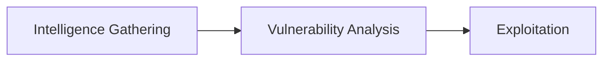
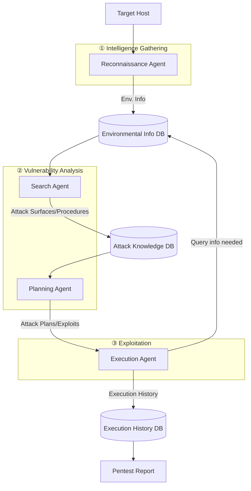
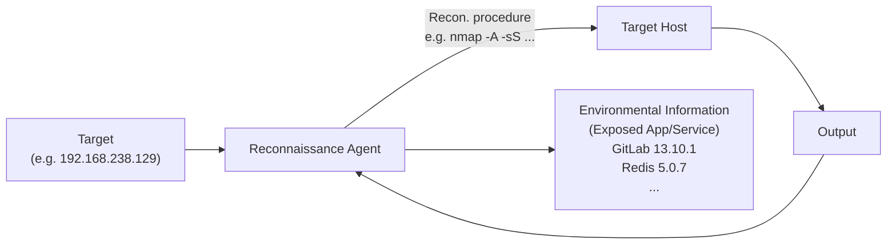
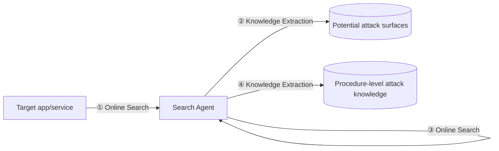
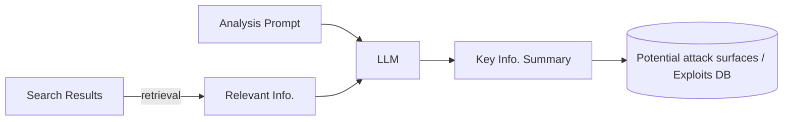
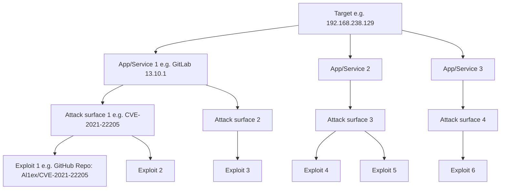
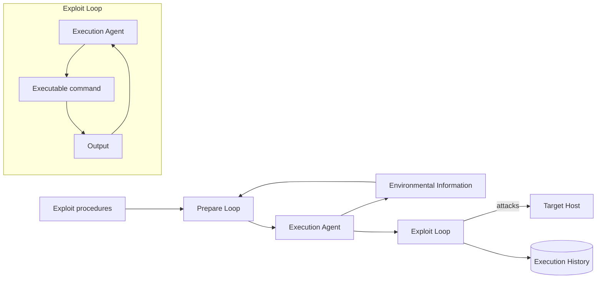
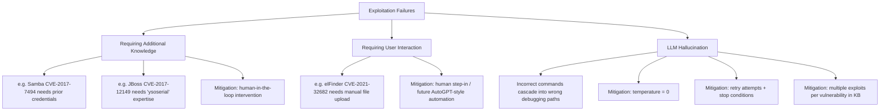
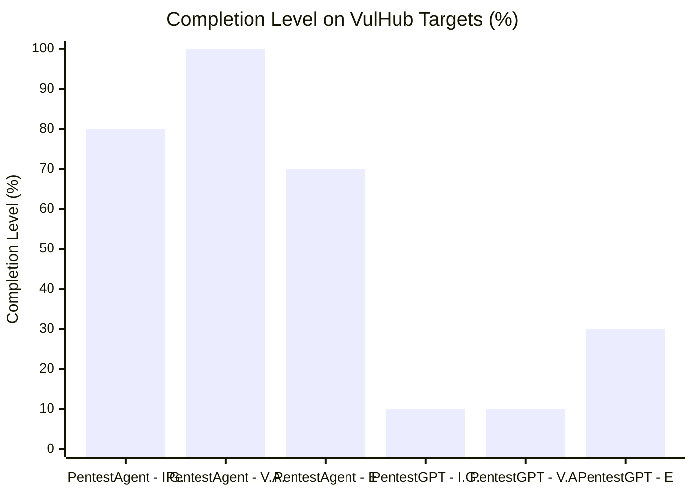
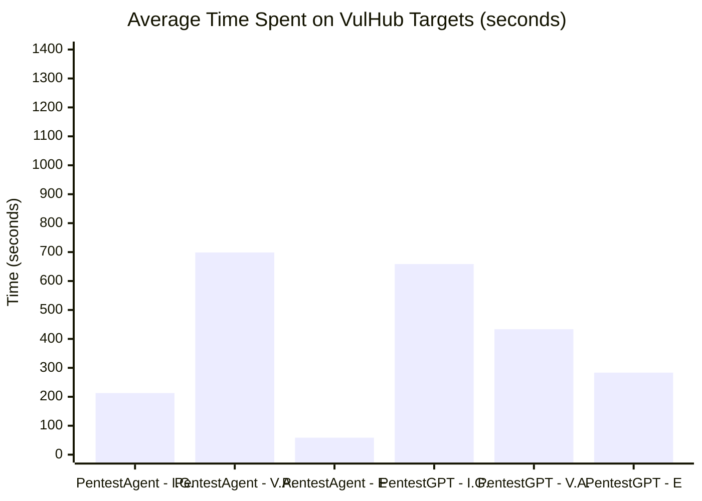

# PentestAgent: Incorporating LLM Agents to Automated Penetration Testing

**Authors:** Xiangmin Shen, Lingzhi Wang, Zhenyuan Li, Yan Chen, Wencheng Zhao, Dawei Sun, Jiashui Wang, Wei Ruan
**Venue:** ASIA CCS '25, August 25–29, 2025, Hanoi, Vietnam

## 📌 Abstract

> Penetration testing is a critical technique for identifying security vulnerabilities, traditionally performed manually by skilled specialists — a process that is time-consuming and expensive.

- Existing automated pentesting methods fall short in real-world use due to limited flexibility, adaptability, and implementation.
- **PentestAgent** is proposed: an LLM-based automated pentesting framework using multi-agent collaboration + Retrieval Augmented Generation (RAG).
- Automates: intelligence gathering → vulnerability analysis → exploitation.
- Evaluated on a comprehensive benchmark, showing superior task completion and efficiency.

**Keywords:** Penetration Testing, Large Language Model, Agent

---

## 1. Introduction

### 🧭 Background

Penetration testing = proactively identifying security vulnerabilities via:

1. **Reconnaissance** — gathering info about the target
2. **Entry point identification**
3. **Exploitation**
4. **Reporting**

> ⚠️ According to Rapid7's *Under the Hoodie* report, pentesting takes an average of **80 hours**, with outliers reaching several hundred hours — making it expensive and hard to staff.

### 🕰️ Evolution of Automated Pentesting

| Era | Approach | Limitation |
|---|---|---|
| Early works | Attack graph modeling (deterministic, fully observable) | Assumes full defender-side observability; not flexible/adaptive |
| Later works | Markov Decision Process (MDP) — states, actions, transitions, rewards | Better but still limited |
| Extensions | POMDP + Reinforcement Learning | Accounts for uncertainty, but purely theoretical — **lacks implementation** |
| Recent | LLM-based approaches | Promising, but has knowledge & automation gaps (see below) |

### ❗ Two Gaps in Existing LLM-based Pentesting

1. **Limited pentesting knowledge** — LLMs' pretraining data lacks comprehensive, up-to-date pentesting techniques → limited/outdated state-action space.
2. **Insufficient automation** — existing tools can't validate/debug suggested procedures or dynamically acquire new techniques.

### 📊 Comparison of LLM-based Pentesting Systems (Table 1)

| System | State & Action Space | Online Search Augmentation | Validation & Debugging |
|---|---|---|---|
| **PentestAgent** | Large | Auto | Auto |
| AutoAttacker | Unknown¹ | Manual | Manual |
| PentestGPT | Unknown¹ | Manual | Manual |
| Happe et al. | Small | No | No |

¹ *AutoAttacker and PentestGPT rely solely on the LLM's own knowledge for reconnaissance/attack techniques, which can be limited and outdated.*

### 🔬 PentestAgent's Approach

- **Multi-agent design**: each agent handles a specific pentesting task → customizable toolsets, better adaptability.
- **RAG integration**: leverages supplementary retrieved data during generation, manages context efficiently, reduces manual intervention.

### 🏆 Contributions

1. **PentestAgent** — LLM-based automated pentesting system with minimal human intervention, combining multi-agent design + RAG.
2. **A new benchmark** — built on VulHub's vulnerable Docker environments and HackTheBox CTF challenges, spanning multiple difficulty levels and vulnerability types.
3. **Experiments & metrics** demonstrating superior performance on full pentesting workflows and individual tasks.

> 🔗 Benchmark and framework are publicly released: https://github.com/nbshenxm/pentest-agent

---

## 2. Background and Related Work

### 2.1 Penetration Testing

Per the **Penetration Testing Execution Standard (PTES)**, pentesting has 3 main stages:

- **External assessments**: internet-facing assets (web apps, online services, networks) — via social engineering, red teaming, web pentesting.
- **Internal assessments**: internal networks, source code, physical devices — via code review, internal network compromise.

> 📌 Per Rapid7, **external network compromise makes up over 80%** of pentesting tasks — yet web pentesting remains underexplored in LLM-based research. This paper targets that gap.

#### 🛠️ Existing Specialized Tools

| Tool | Stage | Purpose |
|---|---|---|
| Nmap | Intelligence Gathering | Network configuration analysis |
| Nessus / OpenVAS | Vulnerability Analysis | Scan for known weaknesses via vulnerability DBs |
| Metasploit | Exploitation | Exploits & payloads |

> ⚠️ Effective, but each requires expert knowledge and manual coordination — no seamless integrated workflow.

#### 🤖 AI-Driven Pentesting (pre-LLM)

- ML / MDP-based frameworks (e.g., Chen et al.) incorporate expert knowledge into state-action pairs with reward functions.
- ⚠️ Limitation: static attack plans, can't react to failures or adjust dynamically.

#### 🧠 LLM-Based Pentesting (prior work)

| System | Focus | Limitation |
|---|---|---|
| **AutoAttacker** | Post-breach attacks only | Ignores pre-compromise stages |
| **PentestGPT** | Multi-stage via "pentesting task tree" | Still requires human decisions on which branch to pursue → inefficient, unbalanced task focus |

> Both depend heavily on the LLM's pretrained knowledge + human analysis for gathering info, validating vulnerabilities, and choosing next steps.

**Goal of this paper:** a fully integrated, automated pentesting framework spanning all stages, minimizing reliance on human expertise.

---

### 2.2 Challenges of Applying LLMs to Pentesting

#### C1 — 📚 Limited Pentesting Knowledge

LLMs know general vulnerability concepts but can't autonomously:
- Find real CVE numbers
- Analyze CVE details/exploits
- Set up exploitation tools
- Select & configure the right exploit

> 🗨️ Example: Asking GPT-4 about ActiveMQ 5.17.3 vulnerabilities yields only generic advice (update software, check CVEs, use scanning tools, review config, "do penetration testing," check logs) — not actionable, specific steps.

#### C2 — 🧩 Short-term Memory

Limited context windows cause problems in long-running tasks like pentesting:

1. **Repetition of Tasks**
   - The model forgets earlier actions and repeats them.
   - *Example:* Nmap scan re-run in the Vulnerability Analysis stage even though it was already done during Intelligence Gathering.

2. **Loss of Context**
   - Contextual details (e.g., target OS/IP found earlier) get lost across stage transitions.
   - *Example:* During Exploitation, the LLM asks the user to re-investigate the OS/IP it had already determined during Reconnaissance.

#### C3 — 🔗 Workflow Integration

1. **Output Quality Control**
   - LLM output must be structured/parseable for downstream modules.
   - Hallucination risk → needs validation checks to avoid propagating errors through the pipeline.

2. **Stateful Working Memory Management**
   - Each stage needs different working memory (vulnerabilities found, exploits chosen, target details, session state).
   - Without smooth memory transitions between stages/sessions, progress can be lost — e.g., restarting an exploit from scratch after losing target details.
   - LLMs don't natively support this kind of persistent working memory.

---

### 2.3 LLM Techniques for Overcoming the Challenges

| Technique | What it does | Challenge(s) addressed |
|---|---|---|
| **LLM Agents** | LLM + tools (e.g., online search) to autonomously gather/learn pentesting knowledge | C1 |
| **Retrieval-Augmented Generation (RAG)** | Index → retrieve → synthesize using external data; enables long-term, queryable memory | C2, C3.2 |
| **Chain-of-Thought (CoT)** | Guides the LLM through logical step-by-step reasoning | Improves complex reasoning |
| **Role-playing** | LLM impersonates a character with clear objectives/boundaries | Improves efficiency/effectiveness |
| **Self-reflection** | LLM summarizes past mistakes into long-term memory | Learning across trials |
| **Structured Output** | Reduces ad-hoc parsing/iterative prompting | C3.1 (output quality control) |

> 📌 **Key Idea:** Combining CoT, role-playing, self-reflection, and structured outputs significantly improves LLM output quality — addressing the output quality control challenge (C3.1).

---

## 3. System Design

### 3.1 System Overview

**Four major components:**

1. **Reconnaissance Agent**
2. **Search Agent**
3. **Planning Agent**
4. **Execution Agent**

#### Stage-by-stage flow

**① Intelligence Gathering**
- Reconnaissance agent takes user-specified target → generates & executes recon commands.
- Analyzes results → compiles environmental information summary → stores in DB.

**② Vulnerability Analysis**
- Search agent queries the environmental info DB for exposed services/apps.
- Search agent looks up potential attack surfaces & procedures → stores in separate DBs.
- Planning Agent 1 uses RAG to suggest potential attack surfaces.
- Planning Agent 2 uses these to determine suitable exploits.

**③ Exploitation**
- Execution agent runs the attack plans against the target host.
- Queries environmental info DB as needed; debugs execution errors by modifying code / gathering more info.
- All execution history logged to DB → used to generate the final pentest report.

> 🎯 **Goal:** a structured, fully automated pipeline that streamlines pentesting end-to-end, minimizing manual effort.

---

### 3.2 Reconnaissance Agent

- Takes a specified **target** as input.
- Runs a **reconnaissance loop**: generate command → execute against target → analyze output → repeat.
- Produces a final **environmental information summary** (e.g., exposed apps/services and their versions) as output.

The reconnaissance process begins when a target is provided to the reconnaissance agent. The agent operates in a **self-iterating loop**:

1. Generate reconnaissance commands to gather information from the target.
2. Analyze the results of these commands.
3. Repeat until best efforts have been made.
4. Summarize findings and store them in a database (making short-term memory persistent).

The agent follows a general workflow defined with expert knowledge, using external knowledge from a RAG framework to decide on specific procedures or tools.

### 📌 Prompt Engineering Techniques

To achieve the desired workflow, four techniques are used in the reconnaissance agent's system message:

> **Reconnaissance System Message (Simplified)**
>
> **Role-play**
> You're an excellent cybersecurity penetration tester assistant. Guide the tester …
>
> **Chain-of-Thought**
> Use Nmap to identify exposed ports, then use relevant tools in Nmap to analyze these ports on the target host …
>
> **RAG**
> You should use your query tool to learn about available reconnaissance tools …
>
> **Structured Output**
> You should always respond in valid JSON format with the following fields: {FORMAT SPEC.} …

- **Role-play** — proven effective at bypassing LLM safety policies; the agent is framed as a penetration tester assistant to validate reconnaissance behaviors.
- **Chain-of-Thought (CoT)** — breaks complex tasks into sub-tasks, reduces hallucination, and (critically) enforces a **stop condition** so the self-iterating loop doesn't run infinitely.
- **RAG** — lets the agent retrieve up-to-date tool documentation (e.g., web fingerprinting tools like ObserverWard) and persist collected environment info, addressing the short-term memory problem.
- **Structured Output** — enforces adherence to the pipeline and smooth transitions between steps.

Once the agent decides to stop the reconnaissance loop, it summarizes results and stores them in a database.

---

## 3.3 Search Agent

**Input:** target services and applications
**Output:** relevant attack knowledge stored in databases

The search agent performs **two rounds** of hierarchical online search:

1. **Round 1** — search + analyze to extract potential **attack surfaces** relevant to the target.
2. **Round 2** — use those attack surfaces as a guide to search + analyze **procedure-level attack knowledge**.

*Figure 3: Search agent workflow*

### 🔬 Online Search Module

Customizable and extensible search functions:

- General search — Google
- Vulnerability-specific search — Snyk, AVD
- Exploit code search — GitHub, ExploitDB

**Hierarchical search strategy:**
- Round 1: Google + vulnerability databases → identify potential attack surfaces
- Round 2: Google + code repositories → find exploit implementation details

### RAG-based Result Summarization

Raw search results are inefficient to index/store directly, so a RAG pipeline extracts key information:

*Figure 4: RAG workflow for search result summarization (yellow = retrieval, green = generation)*

Each document's summary is generated by sending the analysis prompt + retrieved context to the LLM, then gathering summaries into the potential attack surface / exploit database.

> **Potential Attack Surface Analysis Prompt (Simplified)**
>
> **RAG & CoT**
> Generate a concise summary of the document to answer:
> 1) Does this document describe vulnerabilities targeting a particular service or app; if so, what is the relevant service/app version?
> 2) Provide information that can be used to search for the exploit of the vulnerabilities …
>
> **Structured Output**
> You should always respond in valid JSON format with the following fields: {FORMAT SPEC.} …
> For example, the response looks like this: {OUTPUT FORMAT EXAMPLE}

**Round 2** (procedure-level exploit details) similarly uses RAG + CoT, but relies more on the LLM's **code analysis** capability rather than text summarization:
- Checks whether the repository contains a relevant exploit
- Extracts applicable service/app versions and prerequisites for running the exploit

### 📊 Hierarchical Knowledge Storage

Extracted knowledge is stored in a hierarchical tree structure for efficient searching and systematic management.

*Figure 5: Hierarchical pentesting knowledge database*

---

## 3.4 Planning Agent

**Input:** detected services/applications from the reconnaissance agent
**Output:** exploitation plan

Steps:
1. Use RAG + the pentesting knowledge base (Fig. 5) to generate a list of **potential attack surfaces** relevant to services/applications — using service/app version and vulnerability type as the lookup key.
2. Follow a similar process to generate a list of **exploits** — using attack surface, service/app version, and exploit effect (e.g., remote code execution, authentication bypass) as the lookup key.
3. Categorize and suggest attack surfaces (by vulnerability type) and exploits (by exploit effect).

---

## 3.5 Execution Agent

**Input:** exploit details
**Output:** exploitation summary

Follows the order suggested by the planning agent. Each exploit execution has two stages: **preparation** and **exploitation**.

*Figure 6: Execution agent workflow*

**Example execution history table:**

| Exposed App/Service | Attack Performed | Success |
|---|---|---|
| GitLab 13.10.1 | CVE-2021-22205 | ✅ |
| GitLab 13.10.1 | CVE-2020-10977 | ❌ |
| Redis 5.0.7 | CVE-2022-0543 | ✅ |
| … | … | … |

### 🛠️ Preparation Stage

Analyzes exploit details to determine execution requirements (e.g., parameters needed), then queries the environmental information database. Uses **role-play** again to bypass safety mechanisms that might block exploit-execution behavior.

**CoT approach:** first identify all parameters, then determine what information is needed for each.

> **Execution Preparation System Message (Simplified)**
>
> **Role-play**
> You're an excellent cybersecurity pentesting assistant …
>
> **CoT**
> Analyze the exploit to answer:
> 1) What parameters for executing this exploit?
> 2) What information do you need to execute the exploit?
>
> **RAG**
> Use your query tool to learn the details about …
>
> **Structured Output**
> You should always respond in valid JSON format with the following fields: {FORMAT SPEC.} …

After determining needed info, the agent queries the environmental information database to fill in values, then transitions to the exploitation stage.

### ⚔️ Exploitation Stage

> **Execution Exploit System Message (Simplified)**
>
> Your next task is to provide a step-by-step guide for executing the exploit and debugging errors encountered …
>
> **RAG**
> Use the query tool to learn the code and README of the exploit to figure out how to properly execute it …
>
> **Self-reflection**
> When results indicate an error, analyze the error and try to fix it …
>
> **Structured Output**
> You should always respond in valid JSON format with the following fields: {FORMAT SPEC.} …

- Uses RAG to obtain code execution details, breaks down the execution plan, and generates a step-by-step guide.
- Engages in **iterative loops** (like the reconnaissance agent) to execute the exploit.
- ⚠️ **Self-reflection for error handling**: analyzes and fixes errors based on code + error message, and documents error history to avoid repeating mistakes — enabling continual refinement.

---

## 4 Evaluation

Three research questions guide the evaluation:

- **RQ1 (Effectiveness):** Success rate of finishing the whole penetration testing process automatically?
- **RQ2 (Completion level):** Completion level of individual penetration testing stages?
- **RQ3 (Efficiency):** Time and API cost needed to complete a penetration testing task?

### 4.1 Evaluation Setup

#### 4.1.1 Benchmark Dataset

A good benchmark needs to be **accessible**, contain **diverse tasks**, and have **difficulty labels**.

Candidate platforms considered: HackTheBox, OWASP Benchmark, VulnHub, VulHub.

- OWASP Benchmark / VulnHub: thousands of environments, but high setup effort and no difficulty labels.
- **VulHub** chosen: open-source collection of 100+ pre-built vulnerable Docker environments, widely used, supports Infrastructure as Code (IaC), good isolation, and most environments map to a specific CVE — enabling use of CVSS (difficulty) and EPSS (realism) metrics.
- **HackTheBox** CTF challenges added for realism.

**Final benchmark composition:**

| Category | Count |
|---|---|
| Total targets | 67 |
| CWE categories covered | 32 |
| OWASP Top 10 risks covered | 8 |
| Easy difficulty | 50 |
| Medium difficulty | 11 |
| Hard difficulty | 6 |
| HackTheBox CTF challenges (added) | 11 |

The 11 HackTheBox challenges are used for the practicality study (§4.5) and comparison with PentestGPT (§4.6).

#### 4.1.2 Metrics

**Effectiveness (overall):** Given a target IP, did PentestAgent automatically produce a functional exploit? For HackTheBox, success = obtaining initial access to the target host.

**Completion level (stage-level):** Assesses how far the pipeline got, assuming prior stages succeeded:

| Stage | Completion criterion |
|---|---|
| Information gathering | Target application successfully identified |
| Vulnerability analysis | Functional exploits identified (manually verified) |
| Exploitation | Exploit automatically and successfully executed |

**Efficiency:**
- **Time** — duration for a full pentest cycle (recon → exploitation)
- **API cost** — computational resource cost of running the framework

#### 4.1.3 Environment Setup

- **Victim VM:** 2 CPU cores, 8 GB RAM, Ubuntu 22.04 LTS (listening services like SSH disabled to avoid interference)
- **Attacker VM:** 16 CPU cores, 16 GB RAM, Kali Linux 2024.1 (default pre-installed tools only)
- Network: NAT connectivity between attacker and victim; vulnerable containers exposed via the victim machine's IP to simulate real-world network conditions

Evaluated using a mix of commercial and open-source LLMs (see Table 2).

---

### 4.2 Effectiveness of the Entire Framework

- **GPT-4:** 74.2% overall success rate
- **GPT-3.5:** 60.6% overall success rate
- Both models exceed 60% success, affirming pipeline effectiveness.
- 🖼️ **Figure 7:** Bar chart comparing success rate (%) across Easy / Medium / Hard / Overall for GPT-4 vs GPT-3.5. GPT-4 leads in every category; GPT-3.5 scores 0% on Hard tasks.

**Key observations:**
- Gap between GPT-4 and GPT-3.5 is present but "not substantial," suggesting the framework doesn't rely solely on the LLM's raw general knowledge.
- GPT-3.5 fails entirely on hard tasks — likely due to smaller context window and weaker complex reasoning ability compared to GPT-4.

---

### 4.3 Completion Level of Penetration Testing Stages

🖼️ **Figure 8:** Three grouped bar charts (Easy / Medium / Hard tasks) showing completion % for Intelligence Gathering (I.G.), Vulnerability Analysis (V.A.), and Exploitation (E), for GPT-4 vs GPT-3.5.

**GPT-4:**

| Difficulty | I.G. | V.A. | Exploitation |
|---|---|---|---|
| Easy | 100% | 100% | 81.8% |
| Medium | high | high (minor drop) | high |
| Hard | 50% | — | declined |

- Hard-task performance drops most in intelligence gathering (50%), pointing to limits in advanced reasoning/adaptive strategy for complex recon.

**GPT-3.5:**

| Difficulty | I.G. | V.A. | Exploitation |
|---|---|---|---|
| Easy | 92% | 96% | 72% |
| Medium | 66.7% | 100% | 50% |
| Hard | 0% (failed) | — | 0% (failed) |

**📌 Key takeaway:** GPT-4 consistently outperforms GPT-3.5, especially on complex scenarios — reinforcing the importance of advanced reasoning and reconnaissance strategy for automated pentesting.

---

### 4.4 Ablation Study

**Goal:** assess how different LLM backbones affect performance.

**Setup:** Due to GPU limitations for Llama 3.1, a smaller VulHub subset was used — 6 easy, 5 medium, 2 hard targets.

🖼️ **Figure 9a/9b:** Bar charts of completion levels and overhead (time/cost) across GPT-4, GPT-3.5, o1-mini, and Llama 3.1-8B-Instruct.

**Findings:**
- **Vulnerability analysis:** all models achieve 100% completion — consistent across backbones.
- **Intelligence gathering:** GPT-4 and o1-mini outperform GPT-3.5 and Llama 3.1-8B-Instruct — better context integration/reasoning.
- **Exploitation:** o1-mini performs best (strong at detailed attack procedures); GPT-3.5 and Llama 3.1-8B-Instruct fall behind.

**Overhead trade-offs:**
- GPT-3.5: fastest at intelligence gathering, most cost-effective, but weaker exploitation performance.
- o1-mini: best exploitation completion, but longer processing time during vulnerability analysis.
- Llama 3.1-8B-Instruct: no monetary cost, but significant time overhead and lower exploitation performance — limiting practical use.

**Table 2: LLM models used in evaluation**

| Model | Context Window | Knowledge Cutoff | Input Cost | Output Cost |
|---|---|---|---|---|
| GPT-3.5-turbo-0125 | 16,385 tokens | Sep 2021 | $0.50/1M tokens | $1.50/1M tokens |
| GPT-4o | 128,000 tokens | Oct 2023 | $5.00/1M tokens | $15.00/1M tokens |
| o1-mini | 128,000 tokens | Oct 2023 | $1.10/1M tokens | $4.40/1M tokens |
| Llama 3.1-8B-Instruct | 128,000 tokens | Dec 2023 | Open-source | Open-source |

---

### 4.5 Practicality Study

**Goal:** evaluate PentestAgent in realistic settings using HackTheBox challenges (dynamic, real-world vulnerabilities across various CWEs, unlike standardized benchmarks).

**Setup:** 11 HackTheBox machines — 9 easy, 1 medium, 1 hard.

🖼️ **Figure 10:** Completion level and overhead of PentestAgent on HackTheBox challenges (referenced; full detail in Table 3, Appendix C).

**Results:**
- PentestAgent successfully exploited **6 of 11** machines.
- Some machines (e.g., *Pilgrimage*) achieved only partial completion — only the vulnerability analysis stage succeeded.

**⚠️ Limitation:** Variability in stage completion shows the framework can handle a range of real-world scenarios, but further improvement is needed for consistent, full-stage automation. Failed cases are discussed in detail in §4.7.

---

### 4.6 Comparison with PentestGPT

> Unlike PentestAgent, **PentestGPT** requires human participation for feedback and decision-making throughout the penetration testing process.

**🔬 Method**
- 10 vulnerabilities from VulHub (5 easy, 3 medium, 2 hard) + 11 HackTheBox challenges (9 easy, 1 medium, 1 hard)
- Two evaluators of different skill levels:
  - Undergraduate student → tested PentestGPT on VulHub targets
  - PhD student → tested HackTheBox challenges
- Both systems configured with **GPT-3.5** for fair comparison

**📊 Results (HackTheBox targets)**

| Stage | PentestAgent | PentestGPT |
|---|---|---|
| Intelligence Gathering | 220s | 1199s |
| Vulnerability Analysis | slightly slower | slightly faster |
| Exploitation | 172s | 364s |

🖼️ Figure 10: Bar charts comparing completion level (%) and time spent (seconds) across Intelligence Gathering (I.G.), Vulnerability Analysis (V.A.), and Exploitation (E.) stages for PentestAgent vs. PentestGPT on HackTheBox targets. PentestAgent shows higher completion levels and lower overall time than PentestGPT.

📌 **Key Point:** PentestGPT's human-in-the-loop involvement slows overall efficiency despite being marginally faster at vulnerability analysis. PentestAgent delivers more consistent, timely testing by minimizing human intervention.

---

## 4.7 Failure Analysis

Most failures occur during **intelligence gathering** and **exploitation** stages.

### Intelligence Gathering Failures
- Struggles to detect fine-grained components (e.g. PHPMailer, PHPUnit, Ghostscript) that are plugins/libraries rather than standalone applications
- Tools like Nmap identify the underlying framework (e.g. Nginx) but can't enumerate these sub-components
- 🛠️ **Mitigation:** integrate additional web component fingerprinting tools and specialized libraries

### Exploitation Failures

⚠️ **Requiring Additional Knowledge:** Some exploits demand domain-specific knowledge beyond an LLM agent's default capability (credentials, specialized tooling like `ysoserial`). PentestAgent's modular, task-decomposed pipeline lets human experts step in at any point.

⚠️ **Requiring User Interaction:** Exploits needing manual UI actions (e.g. file upload via a web interface) require human intervention today; integrating agents like AutoGPT could automate this in future.

⚠️ **LLM Hallucination:** Incorrect/misleading model outputs can cascade into failed debugging paths. Mitigations:
1. Temperature set to zero
2. Multiple execution attempts
3. Hard-coded attempt limits + prompt-based stop conditions (e.g. "stop when you see the same error again")
4. Knowledge base offers multiple exploit alternatives per vulnerability

---

## 5. Discussion

### 5.1 Comparison with Existing Frameworks

| Framework | Scope | Domain Focus | Automation |
|---|---|---|---|
| **AutoAttacker** [48] | Post-breach exploitation only | General hands-on-keyboard | Automated |
| **Enigma** [2] | SWE-agent + interactive tools | Crypto & reverse engineering (CTF) | Human-in-the-loop |
| **PentestAgent** | Full pipeline: recon → vuln analysis → exploitation | General pentesting | Fully autonomous |

📌 **Key Point:** PentestAgent's end-to-end coverage of early-stage reconnaissance *and* post-breach exploitation is what differentiates it — both are critical for real-world engagements.

### 5.2 Limitations on Performing Sophisticated Pentesting

- Current focus: exploiting **individual** vulnerable applications/services
- ⚠️ Real-world red team simulations often need **chained** exploits (e.g. SSRF → internal app access → root privileges)
- PentestAgent can still identify/validate exposed vulnerabilities like SSRF as a **starting point** for further, more advanced exploitation chains — this is left to future work

---

## 6. Conclusion

- **PentestAgent**: an LLM-based, multi-agent framework for automated penetration testing
- Addresses two key limitations of prior frameworks: limited pentesting knowledge and insufficient automation
- Techniques used: retrieval-augmented generation (RAG) + chain-of-thought (CoT)
- Benchmarked on VulHub Docker environments and HackTheBox CTF challenges
- ✅ Achieves strong task completion and overall efficiency versus PentestGPT

---

## Appendix A — Prompts

Five key prompts structure the PentestAgent pipeline, each combining **structured JSON output** + **few-shot examples** to reduce hallucination:

1. **Reconnaissance Summary Prompt** — summarizes recon findings into structured JSON
2. **Search Results Summary Prompt** — lists CVEs, URLs, keywords, and applicable versions relevant to an app's exploits, in JSON
3. **Exploit Procedure Analysis Prompt** (RAG + CoT + few-shot + structured output) — summarizes a repository to determine:
   - Whether it contains an applicable exploit
   - The exploit's effect (e.g. remote command execution)
   - Applicable service/app version (format `x.y.z`)
   - Requirements to run the exploit (OS, dependencies, etc.)
4. **Attack Surface Suggestion Prompt** — ranks vulnerabilities by confidence for a given app/version, checking version applicability and vuln type, output in JSON
5. **Exploit Suggestion Prompt** — ranks candidate exploit repositories by confidence for a given app/version and execution effect, output in JSON
6. **Execution Information Query Prompt** (CoT + RAG + structured output) — queries the environment info database to fill in missing execution parameters one by one

---

## Appendix B — Benchmark Construction

### B.1 VulHub Benchmark Construction

**📌 Difficulty Assignment Method**
- Based on **CVSS v3.x exploitability** sub-score (ease/technical means of exploitation)
- Natural cutoffs found at exploitability scores of **2.0** and **3.0** → separate easy / medium / hard
- Where an app has multiple CVEs, the one with the higher **EPSS score** (real-world likelihood of exploitation) is selected

🖼️ Figure 11: Histogram of exploitability scores — heavily skewed, with ~49 samples clustered at score 3.9, and small counts at 1.2, 1.6, 1.8, 2.2–2.3, 2.8, 3.1.

🖼️ Figure 12: Histogram of EPSS scores — most CVEs cluster near 0 or near 100, few in between.

**🧹 Filtering applied:**
- Removed Docker images without an associated CVE number or CVSS v3.x score
- Removed apps requiring complicated setup (e.g. vendor license keys)
- PentestAgent was **strictly prohibited** from directly accessing the VulHub repository content, to avoid bias

🖼️ Figure 13: Horizontal bar chart of CWE (Common Weakness Enumeration) category frequency in the benchmark. Top categories include OS Command Injection (~9), Deserialization of Untrusted Data, Improper Limitation of..., Code Injection, Information Exposure, Improper Authentication, SQL Injection, Improper Input Validation, down to single-occurrence categories like Improper Access Control and Unrestricted Upload of File.

🖼️ Figure 14: Bar chart of difficulty rating distribution — Easy: 50, Medium: 11, Hard: 6.

### B.2 HackTheBox Benchmark Construction

**Selection criteria:**
- OS diversity: both **Linux and Windows** machines included
- Vulnerabilities spanning roughly a **decade**, covering historical and contemporary exploits
  - *Blue* → EternalBlue (CVE-2017-0144), Windows SMB exploit
  - *Legacy* → MS08-067 (CVE-2008-4250), critical SMB-based attack
- Difficulty progression:
  - Easy: *Lame*, *Optimum* — fundamental exploitation techniques
  - Medium/Hard: *Stratosphere* (CVE-2017-5638), *Reel* (CVE-2017-0199) — deeper recon, multi-step attacks, advanced reasoning

📌 **Key Point:** This progression tests PentestAgent not just on basic automation, but on handling complex, realistic pentesting scenarios (full challenge list in Table 3, not included in this chunk).

### B.3 Benchmark Coverage

- Dataset built from **known vulnerabilities** — raises the question of real-world practicality
- Counter-point: known vulnerabilities remain a significant real-world risk since many organizations struggle with timely patching

---

## C. Additional Evaluation Results

Detailed pentesting performance on HackTheBox challenges appears in Tables 3 and 4.

### 📊 Table 3: PentestAgent Performance on HackTheBox

| Machine | Difficulty | Completed Stage |
|---|---|---|
| Sau | Easy | 2/3 (I.G, V.A) |
| Pilgrimage | Easy | 1/3 (V.A) |
| Lame | Easy | 3/3 |
| Topology | Easy | 3/3 |
| PC | Easy | 3/3 |
| Blue | Easy | 3/3 |
| Shocker | Easy | 2/3 (V.A., E) |
| Optimum | Easy | 3/3 |
| Legacy | Easy | 3/3 |
| Stratosphere | Medium | 2/3 (V.A., E) |
| Reel | Hard | 2/3 (V.A, E.) |

### 📊 Table 4: PentestGPT Performance on HackTheBox

| Machine | Difficulty | Completed Stage |
|---|---|---|
| Sau | Easy | 2/3 (I.G, V.A) |
| Pilgrimage | Easy | 1/3 (V.A) |
| Lame | Easy | 2/3 (V.A., E) |
| Topology | Easy | 2/3 (V.A., E) |
| PC | Easy | 0/3 |
| Blue | Easy | 2/3 (V.A., E) |
| Shocker | Easy | 0/3 |
| Optimum | Easy | 3/3 |
| Legacy | Easy | 3/3 |
| Stratosphere | Medium | 0/3 |
| Reel | Hard | 1/3 (I.G.) |

> **Legend:** I.G. = Intelligence Gathering · V.A. = Vulnerability Analysis · E = Exploitation

---

## 🔬 VulHub Comparison: Completion & Overhead

In addition to HackTheBox, PentestAgent and PentestGPT were compared on VulHub targets across completion level and time overhead.

### 📊 Results Summary

| Stage | PentestAgent Completion | PentestGPT Completion | PentestAgent Time (s) | PentestGPT Time (s) |
|---|---|---|---|---|
| Intelligence Gathering | 80% | 10% | 212.9 | 658.7 |
| Vulnerability Analysis | 100% | 10% | 698.8 | 433.5 |
| Exploitation | 70% | 30% | 58.6 | 283.5 |

### 🔑 Key Findings

- **PentestAgent significantly outperformed PentestGPT** across all pentesting stages.
- **Intelligence Gathering:** 80% vs. 10% completion — PentestAgent extracts target info far more effectively, and does so **3x faster** (212.9s vs. 658.7s).
- **Vulnerability Analysis:** 100% vs. 10% completion — PentestGPT shows limited capability identifying/assessing vulnerabilities.
- **Exploitation:** 70% vs. 30% completion — PentestAgent completes exploitation **~5x faster** (58.6s vs. 283.5s).
- ⚠️ **Trade-off:** PentestAgent takes *longer* in vulnerability analysis (698.8s vs. 433.5s), but this extra time contributes to its much higher success rate — a more accurate, actionable assessment.

### 🏁 Conclusion

PentestAgent is both **more effective and more efficient** than PentestGPT:
- Higher completion rates across all stages, especially intelligence gathering and vulnerability analysis (both critical precursors to successful exploitation).
- Lower overhead in intelligence gathering and exploitation → more scalable for real-world use.
- The slightly slower vulnerability analysis is an acceptable trade-off for more reliable, successful attack execution — reinforcing PentestAgent as a robust, efficient automated pentesting framework.

---

## References

- [1] 0x727. 2024. ObserverWard. https://github.com/0x727/ObserverWard
- [2] Talor Abramovich, Meet Udeshi, Minghao Shao, Kilian Lieret, Haoran Xi, Kimberly Milner, Sofija Jancheska, John Yang, Carlos E Jimenez, Farshad Khorrami, et al. 2024. EnIGMA: Enhanced Interactive Generative Model Agent for CTF Challenges. arXiv preprint arXiv:2409.16165 (2024).
- [3] Paul Ammann, Duminda Wijesekera, and Saket Kaushik. 2002. Scalable, graph-based network vulnerability analysis. In Proceedings of the 9th ACM Conference on Computer and Communications Security. 217–224.
- [4] AutoGPT. 2024. AutoGPT. https://github.com/Significant-Gravitas/AutoGPT
- [5] Mark S Boddy, Johnathan Gohde, Thomas Haigh, and Steven A Harp. 2005. Course of Action Generation for Cyber Security Using Classical Planning.. In ICAPS. 12–21.
- [6] Jinyin Chen, Shulong Hu, Haibin Zheng, Changyou Xing, and Guomin Zhang. 2023. GAIL-PT: An intelligent penetration testing framework with generative adversarial imitation learning. Computers & Security 126 (2023), 103055.
- [7] Rapid7 Global Consulting. 2019. Under the Hoodie: Lessons from a Season of Penetration Testing. https://www.rapid7.com/research/reports/under-the-hoodie-2019/ Accessed: 2024-06-19.
- [8] Rapid7 Global Consulting. 2020. Under the Hoodie: Lessons from a Season of Penetration Testing. https://www.rapid7.com/research/reports/under-the-hoodie-2020/ Accessed: 2024-06-27.
- [9] Alibaba Could. 2024. Vulnerability DB. https://avd.aliyun.com/
- [10] National Vulnerability Database. 2024. Common Vulnerability Scoring System Calculator. https://nvd.nist.gov/vuln-metrics/cvss/v3-calculator
- [11] Gelei Deng, Yi Liu, Yuekang Li, Kailong Wang, Ying Zhang, Zefeng Li, Haoyu Wang, Tianwei Zhang, and Yang Liu. 2023. Jailbreaker: Automated jailbreak across multiple large language model chatbots. arXiv preprint arXiv:2307.08715 (2023).
- [12] Gelei Deng, Yi Liu, Víctor Mayoral-Vilches, Peng Liu, Yuekang Li, Yuan Xu, Tianwei Zhang, Yang Liu, Martin Pinzger, and Stefan Rass. 2024. PentestGPT: Evaluating and Harnessing Large Language Models for Automated Penetration Testing. In 33rd USENIX Security Symposium (USENIX Security 24). 847–864.
- [13] Yinlin Deng, Chunqiu Steven Xia, Chenyuan Yang, Shizhuo Dylan Zhang, Shujing Yang, and Lingming Zhang. 2024. Large language models are edge-case generators: Crafting unusual programs for fuzzing deep learning libraries. In Proceedings of the 46th IEEE/ACM International Conference on Software Engineering. 1–13.
- [14] Matthew Denis, Carlos Zena, and Thaier Hayajneh. 2016. Penetration testing: Concepts, attack methods, and defense strategies. In 2016 IEEE Long Island Systems, Applications and Technology Conference (LISAT). IEEE, 1–6.
- [15] Karel Durkota and Viliam Lisý. 2014. Computing Optimal Policies for Attack Graphs with Action Failures and Costs.. In STAIRS. 101–110.
- [16] GreenBone. 2024. GreenBone OpenVAS. https://www.openvas.org/
- [17] HackTheBox. 2024. Hackthebox: Hacking training for the best. https://www.hackthebox.com/
- [18] Andreas Happe and Jürgen Cito. 2023. Getting pwn'd by ai: Penetration testing with large language models. In Proceedings of the 31st ACM Joint European Software Engineering Conference and Symposium on the Foundations of Software Engineering. 2082–2086.
- [19] Zhenguo Hu, Razvan Beuran, and Yasuo Tan. 2020. Automated penetration testing using deep reinforcement learning. In 2020 IEEE European Symposium on Security and Privacy Workshops (EuroS&PW). IEEE, 2–10.
- [20] Leanid Krautsevich, Fabio Martinelli, and Artsiom Yautsiukhin. 2013. Towards modelling adaptive attacker's behaviour. In Foundations and Practice of Security: 5th International Symposium, FPS 2012, Montreal, QC, Canada, October 25-26, 2012, Revised Selected Papers 5. Springer, 357–364.
- [21] Patrick Lewis, Ethan Perez, Aleksandra Piktus, Fabio Petroni, Vladimir Karpukhin, Naman Goyal, Heinrich Küttler, Mike Lewis, Wen-tau Yih, Tim Rocktäschel, et al. 2020. Retrieval-augmented generation for knowledge-intensive nlp tasks. Advances in Neural Information Processing Systems 33 (2020), 9459–9474.
- [22] Guohao Li, Hasan Hammoud, Hani Itani, Dmitrii Khizbullin, and Bernard Ghanem. 2023. Camel: Communicative agents for "mind" exploration of large language model society. Advances in Neural Information Processing Systems 36 (2023), 51991–52008.
- [23] Haonan Li, Yu Hao, Yizhuo Zhai, and Zhiyun Qian. 2023. The Hitchhiker's Guide to Program Analysis: A Journey with Large Language Models. arXiv preprint arXiv:2308.00245 (2023).
- [24] Michael Xieyang Liu, Frederick Liu, Alexander J Fiannaca, Terry Koo, Lucas Dixon, Michael Terry, and Carrie J Cai. 2024. "We Need Structured Output": Towards User-centered Constraints on Large Language Model Output. In Extended Abstracts of the CHI Conference on Human Factors in Computing Systems. 1–9.
- [25] Puzhuo Liu, Chengnian Sun, Yaowen Zheng, Xuan Feng, Chuan Qin, Yuncheng Wang, Zhi Li, and Limin Sun. 2023. Harnessing the power of llm to support binary taint analysis. arXiv preprint arXiv:2310.08275 (2023).
- [26] Ruijie Meng, Martin Mirchev, Marcel Böhme, and Abhik Roychoudhury. 2024. Large language model guided protocol fuzzing. In Proceedings of the 31st Annual Network and Distributed System Security Symposium (NDSS).
- [27] Microsoft. 2024. System message framework and template recommendations for Large Language Models (LLMs). https://learn.microsoft.com/en-us/azure/ai-services/openai/concepts/system-message
- [28] MITRE. 2024. CVE. https://cve.mitre.org/
- [29] nmap. 2024. nmap. https://nmap.org/
- [30] Jorge Lucangeli Obes, Carlos Sarraute, and Gerardo Richarte. 2013. Attack planning in the real world. arXiv preprint arXiv:1306.4044 (2013).
- [31] Forum of Incident Response and Inc. Security Teams. 2024. Common Vulnerability Scoring System v3.0: Specification Document. https://www.first.org/cvss/specification-document
- [32] Forum of Incident Response and Inc. Security Teams. 2024. Exploit Prediction Scoring System (EPSS). https://www.first.org/epss/
- [33] OWASP. 2024. OWASP Benchmark. https://owasp.org/www-project-benchmark/
- [34] OWASP. 2024. Top 10 Web Application Security Risks. https://owasp.org/www-project-top-ten/
- [35] Rapid7. 2024. Rapid7 Metasploit. https://www.metasploit.com/
- [36] Mark Roberts, Adele Howe, Indrajit Ray, Malgorzata Urbanska, Zinta S Byrne, and Janet M Weidert. 2011. Personalized vulnerability analysis through automated planning. In Working Notes for the 2011 IJCAI Workshop on Intelligent Security (SecArt). 50.
- [37] Carlos Sarraute, Olivier Buffet, and Jörg Hoffmann. 2012. POMDPs make better hackers: Accounting for uncertainty in penetration testing. In Proceedings of the AAAI Conference on Artificial Intelligence, Vol. 26. 1816–1824.
- [38] Carlos Sarraute, Olivier Buffet, and Jörg Hoffmann. 2013. Penetration testing== POMDP solving? arXiv preprint arXiv:1306.4714 (2013).
- [39] Carlos Sarraute, Gerardo Richarte, and Jorge Lucángeli Obes. 2011. An algorithm to find optimal attack paths in nondeterministic scenarios. In Proceedings of the 4th ACM workshop on Security and artificial intelligence. 71–80.
- [40] Snyk Security. 2024. Snyk Vulnerability Database. https://security.snyk.io/
- [41] Noah Shinn, Federico Cassano, Ashwin Gopinath, Karthik Narasimhan, and Shunyu Yao. 2024. Reflexion: Language agents with verbal reinforcement learning. Advances in Neural Information Processing Systems 36 (2024).
- [42] The Penetration Testing Execution Standard. 2024. PTES Technical Guidelines. http://www.pentest-standard.org/index.php/PTES_Technical_Guidelines
- [43] Yaroslav Stefinko, Andrian Piskozub, and Roman Banakh. 2016. Manual and automated penetration testing. Benefits and drawbacks. Modern tendency. In 2016 13th international conference on modern problems of radio engineering, telecommunications and computer science (TCSET). IEEE, 488–491.
- [44] Tenable. 2024. Tenable Nessus. https://www.tenable.com/products/nessus
- [45] Vulhub. 2024. Vulhub. https://github.com/vulhub/vulhub
- [46] VulnHub. 2024. VulnHub. https://www.vulnhub.com/
- [47] Jason Wei, Xuezhi Wang, Dale Schuurmans, Maarten Bosma, Fei Xia, Ed Chi, Quoc V Le, Denny Zhou, et al. 2022. Chain-of-thought prompting elicits reasoning in large language models. Advances in neural information processing systems 35 (2022), 24824–24837.
- [48] Jiacen Xu, Jack W Stokes, Geoff McDonald, Xuesong Bai, David Marshall, Siyue Wang, Adith Swaminathan, and Zhou Li. 2024. AutoAttacker: A Large Language Model Guided System to Implement Automatic Cyber-attacks. arXiv preprint arXiv:2403.01038 (2024).
- [49] Tian-yang Zhou, Yi-chao Zang, Jun-hu Zhu, and Qing-xian Wang. 2019. NIGAP: A new method for automated penetration testing. Frontiers of Information Technology & Electronic Engineering 20, 9 (2019), 1277–1288.
