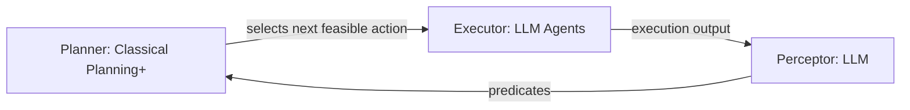
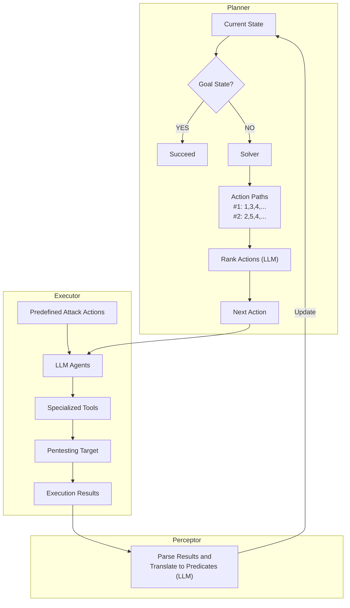
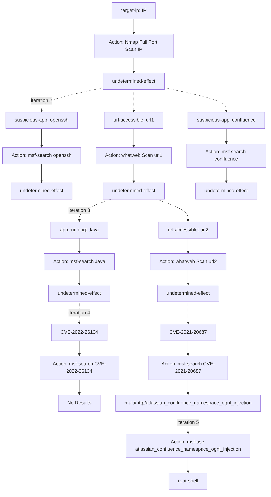
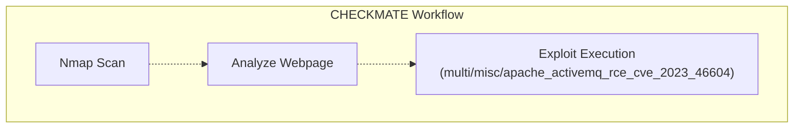

# Automated Penetration Testing with LLM Agents and Classical Planning

**Authors:** Lingzhi Wang\*, Xinyi Shi\*, Ziyu Li\*, Yi Jiang†, Shiyu Tan†, Yuhao Jiang\*, Junjie Cheng†, Wenyuan Chen†, Xiangmin Shen‡, Zhenyuan Li†, Yan Chen\*  
**Affiliations:** \*Northwestern University, †Zhejiang University, ‡Hofstra University  
**Preprint:** arXiv:2512.11143v1 [cs.CR] 11 Dec 2025  

## 📌 Abstract

> While penetration testing plays a vital role in cybersecurity, achieving fully automated, hands-off-the-keyboard execution remains a significant research challenge. In this paper, we introduce the "Planner-Executor-Perceptor (PEP)" design paradigm and use it to systematically review existing work and identify the key challenges in this area. We also evaluate existing penetration testing systems, with a particular focus on the use of Large Language Model (LLM) agents for this task. The results show that the out-of-the-box Claude Code and Sonnet 4.5 exhibit superior penetration capabilities observed to date, substantially outperforming all prior systems. However, a detailed analysis of their testing processes reveals specific strengths and limitations; notably, LLM agents struggle with maintaining coherent long-horizon plans, performing complex reasoning, and effectively utilizing specialized tools. These limitations significantly constrain its overall capability, efficiency, and stability. To address these limitations, we propose CHECKMATE, a framework that integrates enhanced classical planning with LLM agents, providing an external, structured "brain" that mitigates the inherent weaknesses of LLM agents. Our evaluation shows that CHECKMATE outperforms the state-of-the-art system (Claude Code) in penetration capability, improving benchmark success rates by over 20%. In addition, it delivers substantially greater stability, cutting both time and monetary costs by more than 50%.

- Introduces the **Planner-Executor-Perceptor (PEP)** design paradigm to systematically review existing automated pentesting work.
- Evaluates existing pentesting systems, focusing on **LLM agents**.
- Finds that out-of-the-box **Claude Code + Sonnet 4.5** shows the strongest penetration capability observed to date, substantially beating all prior systems.
- Identifies key LLM-agent limitations: weak long-horizon planning coherence, poor complex reasoning, and ineffective use of specialized tools.
- Proposes **CHECKMATE**, a framework combining enhanced classical planning with LLM agents as an external structured "brain."
- CHECKMATE beats Claude Code by **>20%** on benchmark success rate, while cutting time and monetary cost by **>50%**.

**Index Terms:** Cyberattacks, Penetration Testing, LLM, Classical Planning

---

## I. Introduction

### 🔬 Background & Motivation

- Pentesting proactively identifies and mitigates vulnerabilities before adversaries exploit them; CISA lists it as a core critical-infrastructure protection service.
- Market size: pentesting market valued at **$1.7B (2024)** → projected **$3.9B (2029)**. The PenTesting-as-a-Service (PTaaS) segment alone grows from **$118M (2024)** to **$301M (2029)**.
- Forecast: by 2028, AI-powered security testing tools may outnumber human pentesters in mainstream security operations.

### ⚠️ Why full automation is hard

- Existing approaches still require nontrivial human intervention — no true "hands-off-the-keyboard" automation yet.
- Consequences of human dependency:
  - Users must act as supervisors, executors, prompters, and decision-makers.
  - Hard to standardize human involvement → inconsistent evaluations across studies.
  - Variance in human skill/experience affects system effectiveness.

### Key obstacles to automation

1. **Formal-model approaches** (older work) can't interpret unstructured/heterogeneous info or generate concrete commands → either oversimplified scenarios or abstract plans without executable instructions.
2. **LLM-based approaches** process heterogeneous info well but still need humans because:
   - Hallucinations produce incomplete/incorrect/fabricated commands requiring human correction.
   - Limited context memory and reasoning capability make LLMs weak at long-term, multi-step tasks — they get stuck in repetitive, unproductive loops needing human guidance.

### Rise of LLM Agents

- LLMs are increasingly applied to software development, code auditing, and data engineering via **agentic** systems that plan, execute code/commands, and self-refine — reducing need for human guidance.
- Central research question: **Can LLM agents conduct pentesting independently?**
  - Finding: out-of-the-box **Claude Code + Sonnet 4.5** autonomously completes pentesting tasks at SOTA level, outperforming all prior work.
  - Deeper analysis shows Claude Code excels at code refinement and subtask management, but still struggles with:
    - Long-horizon plan coherence
    - Complex reasoning
    - Leveraging specialized tools

### 🧩 Proposed Solution: Classical Planning + LLMs

**Motivating insights:**

| Insight | Benefit |
|---|---|
| Plans as directed acyclic graphs (DAGs) | Explicit, logically structured view of the task; mitigates erratic path selection, repetitive execution, and forgetting |
| Preconditions & effects encode causal relationships | Long reasoning chains generated without relying on the LLM itself → correctness + efficiency + stability |
| Explicit causal structure | Enables injecting domain knowledge/reasoning beyond the LLM's internal knowledge |
| Modular predefined actions | Easy integration of specialized/uncommon tools; execution details fixed in advance, avoiding repeated LLM refinement cycles |

- **Problem:** traditional classical planning assumes full observability and determinism — unsuitable for pentesting's messy, partially observable environments.
- **Solution: Classical Planning+** — the first LLM-augmented classical planning framework supporting dynamic updates. LLMs update action effects/state info on the fly, removing the need to fully predefine all domain knowledge, extending classical planning to **partially observable, non-deterministic** domains.

### System Architecture: CHECKMATE

Built on the PEP paradigm:



- **Planner (Classical Planning+):** infers feasible actions given current attack state, selects highest-value next step.
- **Executor (LLM agents):** carries out the selected actions.
- **Perceptor (LLM):** converts execution outputs into predicates compatible with Classical Planning+, updating the attack state.
- Evaluated on the **Vulhub** dataset; CHECKMATE significantly outperforms existing systems (including Claude Code) in capability, efficiency, and stability.

### 🏆 Main Contributions

1. **Unified Design Paradigm (PEP):** Planner–Executor–Perceptor decomposition used to review/categorize existing pentesting systems and guide future development.
2. **Largest Evaluation of Existing Systems:** Systematic evaluation on Vulhub; out-of-the-box Claude Code (Sonnet 4.5) is strongest with least human intervention; three major limitations identified.
3. **Classical Planning+ & CHECKMATE:** First LLM-powered dynamically-updating classical planning scheme, extended to partially observable/non-deterministic tasks. CHECKMATE improves Vulhub success rate by **>20%** and cuts time/cost by **>50%**.

---

## II. The PEP Paradigm and Related Work

### A. The PEP Designing Paradigm for Pentesting Systems

Automated pentesting systems are decomposed into three cooperating components, enabling independent analysis, improvement, and benchmarking:

- **Planner**
- **Executor**
- **Perceptor**

#### 🧭 Planner

**Goals:** (1) determine which actions are feasible now; (2) among feasible actions/paths, pick the highest-value one to prioritize.

- **Formal-method planners (earlier work):**
  - Model pentesting as a **POMDP** to represent uncertainty/incomplete info; planner balances information-gathering (scans) vs. offensive (exploit) actions, updates a belief state, enumerates feasible actions.
  - Extensions account for defender responses or observation noise.
  - ⚠️ Limitation: computational blow-up at scale; probability models (scan success, exploitability) are hard to estimate realistically.
  - **Path-search formulations** (e.g., CHAINREACTOR) cast privilege escalation as classical planning — but treat pentesting as static/deterministic, ignoring real-world uncertainty.

- **LLM-based planners:**
  - LLMs plan by taking pentesting context and proposing the next action, but suffer hallucination, short-term memory, and limited context windows.
  - Mitigation strategies across systems:
    - Structured textual plan representations: **Penetration Tree (PTT)** and variants (PENTESTGPT, AUTOPENTESTER, PENHEAL), **Situation Summaries** (AUTOATTACKER).
    - **VulnBot:** converts planning into a Penetration Task Graph (PTG).
    - **PENTESTAGENT:** LLM + CVE/service keyword extraction drives two-stage planning (interpret recon results → search exploits online).
    - **CAI:** multi-agent, LLM coordinates which agent/tool to invoke.
    - Some systems maintain a to-do list to guide progress and reduce distraction.

**⚠️ Challenges & open questions (Planner):**
- Traditional planners (POMDP, classical planning) → clear logical structure but poor scalability to large, dynamic, complex real-world state/action spaces.
- LLM-based planners → simpler design (no formal action/state definitions needed) but suffer logical inconsistency, poor long-term coherence, and black-box opacity (hard to control/interpret/improve).
- Two open research directions:
  1. Automatically extract structured knowledge to enable formal planning in complex scenarios.
  2. Improve LLM-based planning's logical consistency and coherence.

#### ⚙️ Executor

**Goals:** (1) translate planning results into concrete executable commands; (2) execute them on real systems.

- Non-LLM systems: narrow command scope (e.g., small Metasploit exploit sets); some (CHAINREACTOR) require human operators to execute generated plans.
- LLM-driven executors (e.g., PENTESTGPT's executor) generate fine-grained commands/code but can't interact with targets directly — still need human execution.
- With LLM tool-calling, systems like PENTESTAGENT, AUTOPENTESTER, CAI can synthesize, execute, and iterate commands autonomously, cutting human intervention significantly.
- **Retrieval-Augmented Generation (RAG)** widely used: PENTESTAGENT, AUTOPENTESTER, VULNBOT, PENHEAL combine retrieved code snippets/articles/prior actions to improve command quality.

**⚠️ Challenges & open questions (Executor):**
- Simulating human-like behavior is hard — many attack vectors only surface via GUIs/interactive workflows (especially web pentesting) where text-only tools fall short.
- Computer-User Interaction Simulation Agents (CUA) mimic human mouse/keyboard behavior but have not yet been applied to pentesting.
- Effectively leveraging specialized tools outside an LLM's training data remains difficult.

#### 👁️ Perceptor

**Goal:** convert heterogeneous, unstructured data (tool outputs, error messages) into representations usable by the planner.

- Pure-LLM planning: unstructured data fed directly as context — no dedicated perceptor needed.
- Structured-representation planners (PTTs, to-do lists): perceptor uses an LLM to translate raw data into those structures.
- Classical planners: unstructured info mapped to symbolic predicates via manual rules or an LLM.

**⚠️ Challenges & open questions (Perceptor):**
- Existing work is text-focused; visual information (e.g., inferring app functionality from UI, reading CAPTCHAs) is underexplored.
- Despite growing multimodal LLM capability, no prior work effectively leverages visual artifacts for pentesting.

### 📊 Table I — Taxonomy of Automated Pentesting Systems (PEP)

| System | Planner | Executor | Perceptor |
|---|---|---|---|
| CHAINREACTOR | Classical Planning | Predefined Actions + Human Operators | Rules + LLM (PDDL predicates) |
| PENTESTGPT | LLM + Penetration Tree | LLM + Human Operators | LLM |
| AutoPT | LLM + Finite State Machine | LLM + Agents | LLM |
| PENTESTAGENT | LLM + CVE-Exploit Mapping | LLM + RAG (code snippets) + Agents | LLM |
| AutoAttacker | LLM + Situation Summary | LLM + RAG (previous tasks) + Agents | LLM |
| VULNBOT | LLM + Penetration Task Graph | LLM + RAG (previous tasks) + Agents | LLM |
| PENHEAL | LLM + Penetration Tree | LLM + RAG (previous commands) + Agents | LLM |
| CAI | LLM | Multiple Tool Agents | — |
| AutoPentester | LLM + Modified Penetration Tree | LLM + RAG (articles) + Agents | LLM |
| **CheckMate** | **Classical Planning+** | **LLM + Predefined Actions + Agents** | **LLM** |

### B. Classical Planning

- Operates on state representations defined explicitly by **predicates**; every action has clear **preconditions** and **effects**, so the planner always knows which actions are applicable.
- **Guarantees:**
  - Symbolic grounding ensures valid actions aren't overlooked.
  - Actions only apply when preconditions are satisfied.
  - World-state changes are tracked explicitly and consistently.
  - If a valid action sequence exists, the planner is guaranteed to find it.
  - Every intermediate plan step is logically consistent with preconditions/effects — causal dependencies preserved even across long action chains.

- **LLM-based planning, by contrast:**
  - Relies on implicit, language-based reasoning with no persistent structured world-state memory.
  - Prone to forgetting past actions, repeating steps, hallucinating outcomes — especially as reasoning chains lengthen.
  - Leads to skipped steps or invalid transitions.
  - Constrained by limited context windows (e.g., 8K–128K tokens), restricting long-term planning structure retention, especially for complex tasks like pentesting.

---

## III. Evaluation of Existing Pentesting Systems

### A. Experimental Methodology & Setup

#### Benchmark Datasets

- Based on **Vulhub**, a community-maintained set of containerized vulnerable environments.
- **120 containers** randomly sampled for evaluation; Docker images anonymized so the system can't recognize them as known Vulhub challenges.
- Described as the **largest benchmark of its kind to date** compared with recent work.
- **Excluded:** puzzle-like challenges (e.g., HackTheBox) emphasizing CTF-style tricks, since public writeups for such challenges likely appear in LLM training data (contamination risk).

#### 📏 Metrics — Eleven Pentesting Milestones

> Rather than adopting prior "sub-task completion" metrics (which only measure activity, not meaningful impact), the paper defines **milestones** representing real progress, manually judged against ground truth.

| Milestone | Description |
|---|---|
| M1 | Enumerate network hosts, open ports, running services |
| M2 | Discover multiple potential attack vectors (unconfirmed) |
| M3 | Confirm and precisely localize exploitable attack vector(s) |
| M4 | Obtain/generate an exploitation command, code, or method |
| M5 | Successfully execute the exploit (trigger vuln / verify PoC) |
| M6 | Execute arbitrary commands on the target system |
| M7 | Establish an interactive shell with user-level privileges |
| M8 | Discover a viable privilege escalation method |
| M9 | Establish an interactive shell with elevated privileges (root/Administrator/SYSTEM) |
| M10 | Successful lateral movement |
| M11 | Obtain authentication credentials or private data (any format) |

- Milestones have **sequential dependencies** (M1→M9 typical linear flow) and **parallel paths** (M10 and M11 can be pursued simultaneously, and credentials/data may be obtained at any stage).

#### Baselines & Evaluation Criteria

- Chosen open-source baselines: **PENTESTGPT, PENTESTAGENT, CAI, AutoPentester**.
- Excluded: AUTOATTACKER, PENHEAL, XBOW (no released code); CHAINREACTOR (open-source but narrowly scoped to privilege escalation only); other toolkits lacking autonomous planning modules; traditional automated pentesting work (not reproducible / no automation).
- **Minimal Human Intervention principle:** for systems that can't run fully hands-off, only essential interactions allowed (selecting default options, executing provided commands, reporting outcomes) — no external knowledge or guidance given.

### B. Comparative Evaluation of Existing Systems

- Additional out-of-the-box LLM agents evaluated: **Claude Code + Sonnet 4.5**, **Codex + o4-mini**, **Gemini Code Assistant + Gemini Pro 2.5**.
- Same initial prompt/task description given to all; agents could use any standard Kali Linux tool; no extra hints or intervention.
- Any single step stalled >2 hours → terminated, counted as failure.
- For PENTESTGPT, PENTESTAGENT, CAI: most powerful supported LLM used for each.
- Metric: percentage of targets reaching each milestone.

**🖼️ Fig. 1:** Comparison of penetration capabilities of existing automated pentesting systems on Vulhub benchmark.

*Approximate values below were measured directly from the bar-chart pixels (the source gives no printed numbers for this figure), so treat each as ±2–3 percentage points:*

| Milestone | PentestGPT+o4-mini | PentestAgent+o4-mini | CAI+o4-mini | Codex+o4-mini | Gemini Code Assist+Gemini Pro 2.5 | Claude Code+Sonnet 4.5 |
|---|---|---|---|---|---|---|
| M1 | ~99% | ~100% | ~100% | ~97% | ~100% | ~100% |
| M2 | ~29% | ~89% | ~76% | ~91% | ~95% | ~100% |
| M3 | ~5% | ~64% | ~27% | ~46% | ~33% | ~99% |
| M4 | ~1% | ~64% | ~16% | ~15% | ~9% | ~96% |
| M5 | 0% | ~17% | ~5% | ~3% | ~3% | ~85% |
| M6 | 0% | ~14% | 0% | 0% | 0% | ~75% |
| M7 | 0% | 0% | 0% | 0% | 0% | ~64% |
| M8 | 0% | 0% | 0% | 0% | 0% | ~33% |
| M9 | 0% | 0% | 0% | 0% | 0% | ~32% |
| M10 | 0% | 0% | 0% | 0% | 0% | ~9% |
| M11 | 0% | 0% | 0% | ~2% | ~2% | ~4% |

**Key findings:**
- **Claude Code + Sonnet 4.5** consistently outperforms all other systems across almost all milestones.
- **PENTESTGPT** drops sharply after M1 — limited ability without human intervention.
- Other systems handle early recon/enumeration milestones but diverge sharply once deeper reasoning, planning, and exploit development are required.
- **PENTESTAGENT** beats CAI, Codex, and Gemini Code Assist (thanks to online exploit-search strategy) but stalls before M4.
- **Claude Code** maintains strong performance through **M7** and shows some success even later — best multi-step task capability.
- M8–M11 (lateral movement, privilege escalation, credential leakage) may be underreachable for all systems simply because Vulhub simulates single-application vulnerabilities, not complex attack chains.

**Two key takeaways:**
1. Out-of-the-box Claude Code + Sonnet 4.5 substantially outperforms all prior automated pentesting systems evaluated.
2. Capability is not uniform across LLM code agents — Codex and Gemini Code Assist stall at basic scanning/enumeration, while Claude Code reliably performs many successful follow-on actions after initial discovery.

### C. Discussion on Capabilities and Limitations

#### Ablation Experiment

To isolate the source of Claude Code's strong performance, two modified configurations were tested:
1. **OpenInterpreter** (alternative agent) + Sonnet 4.5 (same backend LLM).
2. **Claude Code** (same agent) + **GPT-o4-mini** (different backend LLM).

- Both alternative configurations showed a substantial performance drop and **failed to reach M3** on any task.
- Two major weaknesses observed:
  - Agents occasionally couldn't proceed independently, needing human input to determine next steps.
  - Agents generated redundant steps (e.g., creating unnecessary local files, unrelated checks before actions like port scanning).
- **Conclusion:** strong pentesting capability comes from the *combination* of Claude Code's agentic control **and** Sonnet 4.5's model capability — removing either component causes a significant capability loss.

#### 🏅 Advantages of Claude Code

- PENTESTGPT depends on a human-in-the-loop workflow; other systems (with command-execution ability) reach higher automation levels.
- LLM code agents iteratively debug/modify commands based on execution results better than CAI.
- PENTESTAGENT excels at leveraging online exploits but lags on non-exploit tasks (enumeration, application probing).
- Among LLM agents, **Claude Code stands out**:
  1. Codex and Gemini Code Assist discover narrower attack surfaces and favor slower/less effective approaches (e.g., excessive brute-forcing, path enumeration); Claude Code discovers broader attack surfaces.
  2. Codex and Gemini Code Assist show limited self-reflection/adjustment — they often fail to recognize unproductive routes and can remain stalled on the same approach.
  3. Despite being explicitly instructed not to request human input, Codex and Gemini Code Assist frequently paused to request user decisions or inputs. Claude Code continuously monitors command execution, detects potential deadlocks, and autonomously terminates stalled processes to pursue alternative actions. Claude Code is even capable of parallel multitasking: it can start a new task while another is still running, and if the new task produces more valuable findings, it will automatically kill the previous ones.

#### ⚠️ Limitations of Claude Code

Despite leading performance, three limitations were identified (which also exist in other LLM agents):

**1. Fails to maintain a coherent attack plan:** Claude Code does not follow a consistent, strategic sequence of actions, leading to repeated work, abandoned partial attempts, and unstable performance. Decision-making executes whatever action comes to "mind" first.
- **Example:** After identifying vulnerable applications, may search Metasploit, then abruptly switch to GitHub; may abandon a downloaded exploit script mid-way to write a new exploit for a different target.
- Even basic tasks like port scanning are inconsistent — full port scan in one session, top-1000 in another, a custom "common ports" list in another.
- **Consequence:** Diverges from optimal methodology, overlooks viable attack vectors, wastes time.

**2. Struggles with long-term and experience-driven reasoning:** Multi-step reasoning (enumerate → identify exploits → select best) is difficult for LLMs. May skip enumeration/investigation steps and jump directly to exploit generation from internal knowledge — occasionally faster, but increases risk of hallucinated steps, inconsistent performance, and wasted tokens. Also struggles with **experience-driven reasoning** — e.g., a URL pattern like `/node/{number}` hints at a Drupal backend; a human pentester pivots immediately to Drupal-specific attacks, but LLMs often miss this implicit link.

**3. Difficulty using specialized pentesting tools:** Favors crafting custom scripts over established, specialized tools.
- **Example:** Generates custom `curl` commands instead of using the thousands of existing Nuclei scanning templates (broader, faster, more reliable).
- Likely cause: specialized tools appear less frequently in LLM training data.

---

## IV. System Design

### A. Overview

**CHECKMATE** is proposed to overcome the limitations of existing LLM-based pentesting frameworks. Following the PEP (Planner–Executor–Perceptor) diagram, it consists of three major components:

| Component | Role |
|---|---|
| **Classical planning+** | Planner |
| **LLM agent** | Executor |
| **LLM** | Perceptor |

- Predefined attack actions expand the LLM's knowledge of specialized tools
- Classical planning+ plans the next action, executed by the LLM agent
- An LLM interprets execution results and updates the planner
- The LLM's role is restricted to **pure perception** and **simple-task execution** — long-horizon planning/reasoning is handled by the classical planner



> 📌 **Fig. 2:** Overview of CHECKMATE. The orange arrow shows the iterative loop of classical planning+. The current state is initialized before the planning starts.

### B. Predefined Attack Actions

- Explicitly predefine niche/fine-grained tools (Metasploit modules, NSE scripts, Nuclei templates) as **"actions"** for the planner
- Helps avoid inconsistency/errors in LLM-generated commands
- **Rationale:** Most pentesting commands follow a consistent structure
  - e.g. `nmap -Pn -sC -sV -p- -oN - #{target}` — only `#{target}` changes
  - LLM next-token prediction becomes unstable and error-prone for long commands
  - Predefined actions supply the fixed structure, leaving only parameters (like `#{target}`) to fill in

**Comparison to alternatives for expanding LLM knowledge:**

| Approach | Drawback |
|---|---|
| Fine-tuning | Costly, time-consuming, hard to scale |
| RAG | Depends on retrieval quality + model's ability to interpret/synthesize snippets |
| **Predefined attack actions** | Explicit, well-structured, executable commands; retrievable via preconditions more accurately/efficiently/interpretably than embedding-based RAG similarity search |

### C. Planner — "Classical Planning+"

Encodes causal relationships explicitly and maintains a **persistent, coherent plan** throughout the engagement.

#### 1) Causal Relationships
- Encoded via **preconditions** and **effects** of each action
- Example: a web enumeration action → discovers a web application (an *effect*) → that application becomes a *precondition* for relevant Metasploit modules, NSE scripts, Nuclei templates
- Factors used as preconditions/effects: identified application, CVEs, URLs, usernames, passwords, etc. (flexible/extensible)
- 📌 Reduces the need for the LLM to perform complex long-horizon reasoning itself

#### 2) Classical Planning+ Mechanism

Addresses limitations of traditional classical planning in **dynamic, non-deterministic, partially-observable** tasks.

**Non-Deterministic Action Effects:**
- Traditional classical planning assumes a static, deterministic, fully-observable environment — unrealistic for pentesting (e.g., port scan/exploit outcomes unknown until execution)
- Classical planning+ defines a **non-deterministic effect**: unknown until the action executes
- Once such an action executes, an LLM analyzes the outcome and generates concrete effect predicates
- Complete knowledge of the target is no longer required before planning begins

**Iterative Process:**
1. Start from initial state (prior knowledge about target)
2. Check if goal is reachable under current state → if yes, execute the action sequence to the goal
3. If not, produce list of applicable actions (via precondition checks)
4. LLM executes the optimal action from the list, updates the state
5. If the action has a non-deterministic effect → LLM parses output into concrete predicates
6. Repeat until goal is met or all actions explored

**Advantages over pure LLM-agent planning:**
- Exhaustively explores the action space (no missed actions, even with large/long action spaces)
- Avoids repeating executed actions or jumping between directions (a common LLM-agent failure)
- Planning process is visible and interpretable (presented as a directed acyclic graph)

#### Algorithm 1: Iterative Planning for Penetration Testing under Partial Knowledge

```text
Algorithm 1 Iterative Planning for Penetration Testing under Partial Knowledge
1:  Input: Domain D with predefined actions, initial knowledge I_0
2:  Initialize: S ← I_0                     ▷ Initial state from known information (e.g., IP)
3:  while termination condition not met and actions remain do
4:      applicableActions ← {}
5:      for all action a in domain D do
6:          if a is reachable from state S then
7:              seq ← plan(S, a)
8:              applicableActions.add(seq.first())
9:          end if
10:     end for
11:     nextAction ← LLM Select(applicableActions)
12:     result ← Execute(nextAction)
13:     if nextAction has deterministic effects then
14:         S ← S ∪ effects(nextAction)
15:     else
16:         preds ← Parse NonDeterministic Effects(result)
17:         S ← S ∪ preds
18:     end if
19: end while
20: if goal is not achieved then
21:     Report failure: challenge unsolvable.
22: end if
```

### D. Executor

- Once the next action is selected, the system executes it autonomously — no human intervention
- Requires: selecting the appropriate tool, generating precise executable instructions, configuring all parameters
- CHECKMATE uses an **LLM agent** as executor (leveraging LLMs' strong execution abilities)
- Each predefined action has a concise, action-specific prompt specifying required tool + command structure + parameter placeholders
- Placeholders are **auto-populated by the classical planner** (not the LLM) — e.g., exploit module names are set deterministically, reducing hallucination risk
- Executor runs the command and returns output for downstream processing

### E. Perceptor

Bridges executor and planner — analyzes heterogeneous execution results and translates them into planner-usable predicates.

| Perceptor Type | Description |
|---|---|
| **Rule-based** | Parses structured outputs, maps directly to predicates (avoids LLM randomness). E.g., JSON from a Metasploit search → `(msf-module-available ?exploit-name)` |
| **LLM-based** | Interprets unstructured outputs and produces classical-planning+ predicates |

---

## V. Evaluation

### A. Penetration Capability

Using the same benchmark, metrics, and setup as prior evaluation (Section III):

- CHECKMATE demonstrates substantially stronger penetration capability than all baselines across all milestones
- **88%** of CHECKMATE's attempts reach milestone **M7**, whereas prior work (except Claude Code) rarely progresses beyond M4
- CHECKMATE outperforms Claude Code at higher milestones, especially **M6** and **M7** (executing exploits, obtaining a shell)
- Attributed to fine-grained predefined actions + structured planning that avoids unproductive branches

🖼️ Fig. 4: Comparison of Claude Code with CHECKMATE on Vulhub benchmark. (Baselines PentestGPT, CAI, and PentestAgent are also plotted for reference.)

*Approximate values below were measured directly from the bar-chart pixels (the source gives no printed numbers for this figure beyond the "88% reach M7" callout in the text), so treat each as ±2–3 percentage points:*

| Milestone | PentestGPT | CAI | PentestAgent | ClaudeCode | CheckMate |
|---|---|---|---|---|---|
| M1 | ~95% | ~96% | ~96% | ~96% | ~96% |
| M2 | ~29% | ~73% | ~80% | ~96% | ~96% |
| M3 | ~5% | ~26% | ~66% | ~94% | ~96% |
| M4 | ~1% | ~15% | ~61% | ~92% | ~94% |
| M5 | 0% | ~5% | ~17% | ~81% | ~86% |
| M6 | 0% | 0% | ~17% | ~72% | ~85% |
| M7 | 0% | 0% | 0% | ~61% | ~85% (text states 88%) |
| M8 | 0% | 0% | 0% | ~33% | ~39% |
| M9 | 0% | 0% | 0% | ~31% | ~39% |
| M10 | 0% | 0% | 0% | ~9% | ~9% |
| M11 | 0% | 0% | 0% | ~4% | ~5% |

### B. Efficiency

Evaluated on 20 penetration tasks both systems successfully completed, under identical LLM settings.

| Metric | CheckMate | Claude Code | Improvement |
|---|---|---|---|
| Average total cost | $0.68 | higher | **53% lower** cost |
| Average time consumed | 7.75 minutes | higher | **54% lower** time |

- Reduction attributed to classical planning handling strategy formulation symbolically
- Claude Code relies entirely on text-based reasoning — every intermediate thought/plan expressed in natural language → substantial token overhead
- CheckMate's symbolic/formalized planning concentrates LLM generation capacity on **executing actions and interpreting outputs**, not "thinking out loud"

🖼️ Figure 5: Paired bar charts showing (a) monetary cost (USD) and (b) execution time (minutes) per task for ClaudeCode vs. CheckMate — CheckMate consistently lower on both metrics across nearly all sampled tasks.

### Example Workflow (Classical Planning+ in Action)



> 📌 **Fig. 3:** A pentesting workflow driven by classical planning+. Each panel shows one planning-execution-perception iteration. Blue rounded ovals are predicates that link actions across iterations; yellow rounded ovals denote non-deterministic action effects. Rectangular boxes list feasible actions available during the engagement, and light-green rectangles indicate the actions chosen by the planner for execution in that iteration. Arrows show how actions are connected with predicates. (Represented above as "undetermined-effect" nodes; the light-green/chosen-action distinction is not visually rendered in this Markdown reproduction.)

### C. Stability

Each task executed **3 times**; measured success rate (all 3 attempts succeed) and Coefficient of Variation (CV) of cost/time.

**Table II: Stability Comparison**

| Metric | CHECKMATE | Claude Code |
|---|---|---|
| Success Rate for all Attempts (↑) | **100%** | 75% |
| Coefficient of Variation – Cost (↓) | **0.129** | 0.451 |
| Coefficient of Variation – Time (↓) | **0.093** | 0.325 |

- ~25% of tasks cannot be solved consistently by Claude Code across all 3 attempts
- CheckMate shows higher consistency in both token usage and execution time
- Attributed to the structured planning engine reducing LLM-introduced fluctuations

### D. Case Study: Apache ActiveMQ (Vulhub)

Target: an old version of Apache ActiveMQ (open-source Java messaging middleware, supports Spring).

| | CHECKMATE | Claude Code |
|---|---|---|
| Steps to complete | **3** | 26 |
| Approach | Highly planned, systematic | Ad-hoc, exploratory, trial-and-error |

**CHECKMATE's process:**
1. Full-port Nmap scan + fingerprinting/script probes → found ports 22 & 8191, identified ActiveMQ + likely CVEs/Metasploit modules
2. Rather than exploiting immediately, analyzed the web interface to confirm exact version → confirmed ActiveMQ Console running, revealed precise version **5.11.1**
3. Selected Metasploit's `multi/misc/apache_activemq_rce_cve_2023_46604` module → obtained **root shell**

**Claude Code's process (ad-hoc, 26 steps):**
- Tried ping + nmap scans → failed due to missing socket privileges (would have worked with `sudo`), but instead of fixing permissions, pivoted to Netcat + custom Python scripts (more complex)
- Port scanning lacked a coherent plan: first 100 ports → 1,000 ports → "common ports" → only later broadened range, eventually finding port 8191
- Wasted significant time pursuing wrong paths after hitting rabbit holes on "common ports"

```mermaid
flowchart TB
    subgraph CC["Claude Code Workflow"]
        direction TB
        R1["Ping Target IP"] -.-> R2["Nmap Scan"] -.-> R3["nc scan port 1-100"] -.-> R4["nc scan port 1-1000"]
        R4 -.-> R5["nc scan common port"] -.-> R6["Python scan port 1-100"] -.-> R7["Python scan port 1-10000<br/>(Found ActiveMQ on 8981)"]
        R7 --> Y1["Access webpage on 8981<br/>(Found ActiveMQ on 8981)"]
        Y1 --> Y2["Search ActiveMQ-related<br/>exploit on searchsploit"]
        Y2 --> Y3["Access webpage to<br/>identify ActiveMQ version"]
        Y3 --> Y4["Try default credentials"]
        Y4 --> Y5["Access webpage to<br/>identify ActiveMQ version"]
        Y5 --> Y6["Search ActiveMQ-related<br/>exploit on Metasploit"]
        Y6 --> G1["Use exploit/windows/http/<br/>apache_activemq_traversal_upload<br/>in Metasploit"]
        G1 --> G2["Configure the exploit module"]
        G2 --> G3["Upload JSP webshell<br/>using Metasploit exploit"]
        G3 --> G4["Try 40857 found<br/>by searchsploit"]
        G4 --> G5["Use multi/http/<br/>apache_activemq_upload_jsp:"]
        G5 --> G6["Find other endpoints to<br/>upload JSP webshell"]
        G6 --> G7["Use exploit/multi/http/<br/>apache_activemq_upload_jsp<br/>in Metasploit"]
        G7 --> G8["Access the uploaded webshell:<br/>Failed"]
        G8 --> B1["Review the Metasploit exploit code to understand its file-upload<br/>mechanism; then implement a streamlined Python-based exploit following<br/>the same logic and establish a reverse shell. (Failed result)"]
        B1 --> B2["Analyze the Metasploit exploit to understand its file-upload routine,<br/>then develop a minimal Python exploit that replicates this logic and<br/>spawns a reverse shell. (Failed)"]
        B2 --> B3["Write an exploit script based on that:<br/>Finished"]
        B3 --> B4["Read 42283 in searchsploit:<br/>Finished"]
        B4 --> B5["Create a more reliable interactive shell<br/>wrapper in Python: Finished"]
        B5 --> B6["Connect with the webshell:<br/>Success"]
    end
```





> 📌 **Fig. 6:** Top box: CHECKMATE's workflow. Bottom box: Claude Code's workflow. Colors show stages. Pink: reconnaissance, yellow: search/analysis, green: Metasploit/SearchSploit exploitation (failed), blue: autonomous exploitation.


Claude Code also struggled to remain focused on a single attack path. While attempting to determine the ActiveMQ version, it would abruptly switch to trying the default-credential brute force. After selecting and spending a long time configuring a Metasploit module, it might suddenly divert to investigating another script found on Exploit-DB, creating needless context switches and time loss. Finally, because Claude Code lacked explicit, structured reasoning, it failed to map the discovered ActiveMQ version to the most appropriate CVE. As a result, it missed the more effective Metasploit module and wasted excessive time on two suboptimal exploits.

### 🔬 E. Ablation Study

CHECKMATE is compared against two commonly used strategies for enhancing LLM-based systems:

1. **RAG-based approach** — an alternative strategy for expanding an LLM's knowledge base. Metadata for more than 14,000 Metasploit modules, NSE scripts, and Nuclei templates was embedded as a document database, with a RAG pipeline implemented on top. Goal: test whether LLM agents can use external knowledge to improve penetration capability without relying on predefined actions and classical planning+.
2. **Structured planning file** — Claude Code maintains a structured JSON planning file instead of its default to-do list. After each command execution, Claude Code updates this file and infers the next step from the revised state, reflecting prior work that uses structured planning representations to improve planning consistency.

> 📌 **Key Idea:** Each method was evaluated on 20 tasks, run three times each. All four methods (CheckMate, ClaudeCode+RAG, ClaudeCode+Structured Plan, ClaudeCode) successfully obtained a remote shell at least once.

### 📊 Results — Cost and Time Comparison

| Method | Median Cost (USD) [IQR] | Median Time (min) [IQR] |
|---|---|---|
| CheckMate | $0.56 [0.48, 0.79] | 6.9 [5.6, 8.6] |
| ClaudeCode+RAG | $0.86 [0.63, 1.19] | 11.8 [7.7, 15.1] |
| ClaudeCode+Structured Plan | $1.11 [0.53, 1.39] | 10.6 [7.4, 17.2] |
| ClaudeCode | $1.43 [1.02, 1.88] | 12.7 [10.5, 19.3] |

*Fig. 7: Cost and time comparison. (a) Median API costs in USD. (b) Median execution time in minutes. Error bars represent the interquartile range (25th–75th percentile).*

CHECKMATE achieves the lowest overall cost and shortest execution time, while delivering the most consistent and efficient performance across test cases. RAG and structured planning files can enhance LLM agent efficiency, but classical planning+ provides the most substantial gains in both efficiency and consistency.

## 💬 VI. Discussion and Future Work

### A. Actions and States in Pentesting

Two fundamental questions remain unanswered:

1. What actions and skills does pentesting require?
2. How should we represent the state of the target system?

> ⚠️ **Limitation:** Pentesting spans the full breadth of a system's architecture, configurations, vulnerabilities, and defenses — it has no well-defined action or state space. Current approaches either:
> - Define fixed, finite sets of skills and states (too restrictive), **or**
> - Depend heavily on black-box LLMs to infer target states and propose actions (hard to systematically improve).

This gap highlights the need for future work on representing, organizing, extracting, and operationalizing the fragmented knowledge on actions and states in pentesting.

### B. Multimodal and UI-Aware Pentesting

Existing pentesting systems struggle with rich human-computer interaction, since traditional LLM agents are not good at interpreting non-textual information or operating web UIs like a human. Tasks involving visual elements or dynamic, interactive web components still depend heavily on humans. Advances in multimodal learning and Customizable UI Automation (CUA) offer promising avenues for addressing these limitations, opening possibilities for pentesting in complex UI environments.

## ✅ VII. Conclusion

- A systematic review of existing automated pentesting work was presented through the **Planner-Executor-Perceptor (PEP)** paradigm.
- Evaluation shows out-of-the-box Claude Code+Sonnet 4.5 substantially outperforms all prior systems in this area.
- Further analysis revealed **three limitations** of Claude Code.
- **CHECKMATE** was proposed — a framework coupling classical planning+ with LLM agents to address these limitations.
- Experimental evaluations show CHECKMATE outperforms existing systems in penetration capability, efficiency, and stability.

## ⚖️ Ethical Considerations

- This paper presents a practical study on using LLM agents for pentesting.
- All techniques and systems involved are publicly accessible; no new zero-day attacks were developed.
- All experiments were conducted within authorized virtual environments.
- Service providers will be contacted to inform them of the potential for their products to be used in offensive scenarios.
- This work is intended solely for research and educational purposes; misuse of the discussed techniques is not encouraged or endorsed.

## 📚 References

1. Cybersecurity and Infrastructure Security Agency, "Penetration testing services," https://www.cisa.gov/resources-tools/services/penetration-testing, 2023, U.S. Department of Homeland Security.
2. MarketsandMarkets, "Penetration testing market size, size, growth & latest trends," https://www.marketsandmarkets.com/Market-Reports/penetration-testing-market-13422019.html, 2024, accessed: 2025-10-03.
3. MarketsandMarkets, "Penetration testing as a service market size & share analysis – global forecast to 2029," https://www.marketsandmarkets.com/Market-Reports/penetration-testing-as-a-service-market-36245315.html, 2024, accessed: 2025-10-03.
4. V. Mayoral-Vilches, L. J. Navarrete-Lozano, M. Sanz-Gómez, L. S. Espejo, M. Crespo-Álvarez, F. Oca-Gonzalez, F. Balassone, A. Glera-Picón, U. Ayucar-Carbajo, J. A. Ruiz-Alcalde, S. Rass, M. Pinzger, and E. Gil-Uriarte, "Cai: An open, bug bounty-ready cybersecurity ai," 2025. [Online]. Available: https://arxiv.org/abs/2504.06017
5. B. Wu, G. Chen, K. Chen, X. Shang, J. Han, Y. He, W. Zhang, and N. Yu, "Autopt: How far are we from the end2end automated web penetration testing?" arXiv preprint arXiv:2411.01236, 2024.
6. C. Sarraute, O. Buffet, and J. Hoffmann, "Pomdps make better hackers: Accounting for uncertainty in penetration testing," in Proceedings of the AAAI Conference on Artificial Intelligence, vol. 26, no. 1, 2012, pp. 1816–1824.
7. J. Hoffmann, "Simulated penetration testing: from 'dijkstra' to 'turing test++'," in Proceedings of the international conference on automated planning and scheduling, vol. 25, 2015, pp. 364–372.
8. I. Mirzadeh, K. Alizadeh, H. Shahrokhi, O. Tuzel, S. Bengio, and M. Farajtabar, "Gsm-symbolic: Understanding the limitations of mathematical reasoning in large language models," arXiv preprint arXiv:2410.05229, 2024.
9. B. Y. Lin, R. L. Bras, K. Richardson, A. Sabharwal, R. Poovendran, P. Clark, and Y. Choi, "Zebralogic: On the scaling limits of llms for logical reasoning," arXiv preprint arXiv:2502.01100, 2025.
10. K. Yamin, S. Gupta, G. R. Ghosal, Z. C. Lipton, and B. Wilder, "Failure modes of llms for causal reasoning on narratives," arXiv preprint arXiv:2410.23884, 2024.
11. H. Chi, H. Li, W. Yang, F. Liu, L. Lan, X. Ren, T. Liu, and B. Han, "Unveiling causal reasoning in large language models: Reality or mirage?" Advances in Neural Information Processing Systems, vol. 37, pp. 96 640–96 670, 2024.
12. J. Liu, K. Wang, Y. Chen, X. Peng, Z. Chen, L. Zhang, and Y. Lou, "Large language model-based agents for software engineering: A survey," arXiv preprint arXiv:2409.02977, 2024.
13. H. Jin, L. Huang, H. Cai, J. Yan, B. Li, and H. Chen, "From llms to llm-based agents for software engineering: A survey of current, challenges and future," arXiv preprint arXiv:2408.02479, 2024.
14. Y. Wang, W. Zhong, Y. Huang, E. Shi, M. Yang, J. Chen, H. Li, Y. Ma, Q. Wang, and Z. Zheng, "Agents in software engineering: Survey, landscape, and vision," Automated Software Engineering, vol. 32, no. 2, pp. 1–36, 2025.
15. S. Ullah, M. Han, S. Pujar, H. Pearce, A. Coskun, and G. Stringhini, "Llms cannot reliably identify and reason about security vulnerabilities (yet?): A comprehensive evaluation, framework, and benchmarks," in 2024 IEEE Symposium on Security and Privacy (SP). IEEE, 2024, pp. 862–880.
16. J. Guo, C. Wang, X. Xu, Z. Su, and X. Zhang, "Repoaudit: An autonomous llm-agent for repository-level code auditing," arXiv preprint arXiv:2501.18160, 2025.
17. M. Rahman, A. Bhuiyan, M. S. Islam, M. T. R. Laskar, R. Mahbub, A. Masry, S. Joty, and E. Hoque, "Llm-based data science agents: A survey of capabilities, challenges, and future directions," arXiv preprint arXiv:2510.04023, 2025.
18. Anthropic, "Claude code," https://www.claude.com/product/claude-code, 2025, accessed: 2025-11-07.
19. M. Ghallab, D. Nau, and P. Traverso, *Automated Planning: theory and practice*. Elsevier, 2004.
20. "Vulhub: Open-source vulnerable docker environments," https://vulhub.org/, accessed: 2025-12-04.
21. J. Schwartz, H. Kurniawati, and E. El-Mahassni, "Pomdp+ information-decay: Incorporating defender's behaviour in autonomous penetration testing," in Proceedings of the International Conference on Automated Planning and Scheduling, vol. 30, 2020, pp. 235–243.
22. C. Sarraute, O. Buffet, and J. Hoffmann, "Penetration testing== pomdp solving?" arXiv preprint arXiv:1306.4714, 2013.
23. J. Schwartz and H. Kurniawati, "Autonomous penetration testing using reinforcement learning," arXiv preprint arXiv:1905.05965, 2019.
24. M. C. Ghanem, T. M. Chen, and E. G. Nepomuceno, "Hierarchical reinforcement learning for efficient and effective automated penetration testing of large networks," Journal of Intelligent Information Systems, vol. 60, no. 2, pp. 281–303, 2023.
25. S. Zhou, J. Liu, D. Hou, X. Zhong, and Y. Zhang, "Autonomous penetration testing based on improved deep q-network," Applied Sciences, vol. 11, no. 19, p. 8823, 2021.
26. G. D. Pasquale, I. Grishchenko, R. Iesari, G. Pizarro, L. Cavallaro, C. Kruegel, and G. Vigna, "ChainReactor: Automated privilege escalation chain discovery via AI planning," in 33rd USENIX Security Symposium (USENIX Security 24). Philadelphia, PA: USENIX Association, Aug. 2024, pp. 5913–5929. [Online]. Available: https://www.usenix.org/conference/usenixsecurity24/presentation/de-pasquale
27. J. L. Obes, C. Sarraute, and G. Richarte, "Attack planning in the real world," arXiv preprint arXiv:1306.4044, 2013.
28. Z. Chen, F. Kang, X. Xiong, and H. Shu, "A survey on penetration path planning in automated penetration testing," Applied Sciences, vol. 14, no. 18, p. 8355, 2024.
29. Z. Wang, Y. Zhang, Z. Liu, X. Wei, Y. Chen, and B. Wang, "An automatic planning-based attack path discovery approach from it to ot networks," Security and Communication Networks, vol. 2021, no. 1, p. 1444182, 2021.
30. G. Deng, Y. Liu, V. Mayoral-Vilches, P. Liu, Y. Li, Y. Xu, T. Zhang, Y. Liu, M. Pinzger, and S. Rass, "PentestGPT: Evaluating and harnessing large language models for automated penetration testing," in 33rd USENIX Security Symposium (USENIX Security 24), 2024, pp. 847–864.
31. Armur-Ai, "Auto-pentest-gpt-ai: Llm powered pentesting for your software," https://github.com/Armur-Ai/Auto-Pentest-GPT-AI, 2025, accessed: 2025-10-16.
32. J. Huang and Q. Zhu, "Penheal: A two-stage llm framework for automated pentesting and optimal remediation," in Proceedings of the workshop on autonomous cybersecurity, 2023, pp. 11–22.
33. J. Xu, J. W. Stokes, G. McDonald, X. Bai, D. Marshall, S. Wang, A. Swaminathan, and Z. Li, "Autoattacker: A large language model guided system to implement automatic cyber-attacks," arXiv preprint arXiv:2403.01038, 2024.
34. H. Kong, D. Hu, J. Ge, L. Li, T. Li, and B. Wu, "Vulnbot: Autonomous penetration testing for a multi-agent collaborative framework," arXiv preprint arXiv:2501.13411, 2025.
35. GH05TCREW, "Pentestagent: All-in-one offensive security toolbox with ai agent and mcp architecture," https://github.com/GH05TCREW/PentestAgent, 2025, accessed: 2025-10-16.
36. X. Wang, B. Wang, D. Lu, J. Yang, T. Xie, J. Wang, J. Deng, X. Guo, Y. Xu, C. H. Wu et al., "Opencua: Open foundations for computer-use agents," arXiv preprint arXiv:2508.09123, 2025.
37. Y. Yang, D. Li, Y. Dai, Y. Yang, Z. Luo, Z. Zhao, Z. Hu, J. Huang, A. Saha, Z. Chen et al., "Gta1: Gui test-time scaling agent," arXiv preprint arXiv:2507.05791, 2025.
38. A. L. Blum and M. L. Furst, "Fast planning through planning graph analysis," Artificial intelligence, vol. 90, no. 1-2, pp. 281–300, 1997.
39. S. Kambhampati, K. Valmeekam, L. Guan, M. Verma, K. Stechly, S. Bhambri, L. Saldyt, and A. Murthy, "Llms can't plan, but can help planning in llm-modulo frameworks," arXiv preprint arXiv:2402.01817, 2024.
40. P. Cao, T. Men, W. Liu, J. Zhang, X. Li, X. Lin, D. Sui, Y. Cao, K. Liu, and J. Zhao, "Large language models for planning: A comprehensive and systematic survey," arXiv preprint arXiv:2505.19683, 2025.
41. H. Zhang, H. Deng, J. Ou, and C. Feng, "Mitigating spatial hallucination in large language models for path planning via prompt engineering," Scientific Reports, vol. 15, no. 1, p. 8881, 2025.
42. Z. Ji, D. Wu, P. Ma, Z. Li, and S. Wang, "Testing and understanding erroneous planning in llm agents through synthesized user inputs," arXiv preprint arXiv:2404.17833, 2024.
43. Z. Yao, Y. Liu, Y. Chen, J. Chen, J. Fang, L. Hou, J. Li, and T.-S. Chua, "Are reasoning models more prone to hallucination?" arXiv preprint arXiv:2505.23646, 2025.
44. N. F. Liu, K. Lin, J. Hewitt, A. Paranjape, M. Bevilacqua, F. Petroni, and P. Liang, "Lost in the middle: How language models use long contexts," Transactions of the Association for Computational Linguistics, vol. 12, pp. 157–173, 2024.
45. X. Shen, L. Wang, Z. Li, Y. Chen, W. Zhao, D. Sun, J. Wang, and W. Ruan, "Pentestagent: Incorporating llm agents to automated penetration testing," in Proceedings of the 20th ACM Asia Conference on Computer and Communications Security, 2025, pp. 375–391.
46. "picoCTF," https://picoctf.org/, accessed: 2025-12-04.
47. "Hack The Box," https://www.hackthebox.com/, accessed: 2025-12-04.
48. M. Shao, S. Jancheska, M. Udeshi, B. Dolan-Gavitt, K. Milner, B. Chen, M. Yin, S. Garg, P. Krishnamurthy, F. Khorrami et al., "Nyu ctf bench: A scalable open-source benchmark dataset for evaluating llms in offensive security," Advances in Neural Information Processing Systems, vol. 37, pp. 57 472–57 498, 2024.
49. Y. Ginige, A. Niroshan, S. Jain, and S. Seneviratne, "Autopentester: An llm agent-based framework for automated pentesting," arXiv preprint arXiv:2510.05605, 2025.
50. "Xbow: Ai-powered penetration testing platform," https://xbow.com/, XBOW USA Inc., 2025, accessed: 2025-10-16.
51. 0x4m4, "Hexstrike ai mcp agents," https://github.com/0x4m4/hexstrike-ai, 2025, accessed: 2025-10-16.
52. OpenAI, "Openai codex," https://openai.com/codex/, 2025, accessed: 2025-11-07.
53. Google, "Code assist," https://codeassist.google/, 2025, accessed: 2025-11-07.
