# `AutoGen`: Enabling Next-Gen LLM Applications via Multi-Agent Conversation

**Authors:** Qingyun Wu, Gagan Bansal, Jieyu Zhang, Yiran Wu, Beibin Li, Erkang Zhu, Li Jiang, Xiaoyun Zhang, Shaokun Zhang, Jiale Liu, Ahmed Awadallah, Ryen W. White, Doug Burger, Chi Wang

**Affiliations:** Microsoft Research · Pennsylvania State University · University of Washington · Xidian University

> arXiv:2308.08155v2 [cs.AI] 3 Oct 2023
> Corresponding author: auto-gen@outlook.com
> Repo: https://github.com/microsoft/autogen

---

## 📌 Abstract

`AutoGen` is an open-source framework for building LLM applications via multiple **agents** that converse with each other to accomplish tasks.

- Agents are **customizable**, **conversable**, and can operate in modes combining LLMs, human input, and tools.
- Developers can flexibly define agent interaction behaviors using natural language and/or code.
- Serves as a generic framework across varying complexities and LLM capacities.
- Validated empirically across domains: mathematics, coding, question answering, operations research, online decision-making, entertainment, etc.

---

## 🖼️ Figure 1 Overview

🖼️ Figure: A four-panel overview graphic showing (1) a "Conversable agent" icon built from LLM/human/tool components, (2) example flexible conversation topologies (joint chat, hierarchical chat) between multiple agents, (3) a sample agent chat where a user asks to plot META/TESLA stock, the assistant writes code, execution fails on a missing package, the assistant fixes it, and re-executes, and (4) the resulting output charts (price and % change over time).

> **Figure 1 Caption:** *AutoGen enables diverse LLM-based applications using multi-agent conversations. (Left) AutoGen agents are conversable, customizable, and can be based on LLMs, tools, humans, or even a combination of them. (Top-middle) Agents can converse to solve tasks. (Right) They can form a chat, potentially with humans in the loop. (Bottom-middle) The framework supports flexible conversation patterns.*

---

## 1. Introduction

### 🌐 Motivation

- LLMs are becoming core building blocks for agents that reason, use tools, and adapt to new observations.
- As tasks grow in number and complexity, using **multiple cooperating agents** is a natural way to scale agent power.
- Prior work suggests multi-agent setups can:
  - Encourage divergent thinking
  - Improve factuality and reasoning
  - Provide validation

> **Core question:** How can we facilitate development of LLM applications spanning many domains/complexities using a multi-agent approach?

### 🔬 Why Multi-Agent Conversation Works

Three reasons grounded in recent LLM advances:

1. **Feedback incorporation** — Chat-optimized LLMs (e.g., GPT-4) can take feedback, so agents can cooperate through dialogue (reasoning, observations, critiques, validation).
2. **Modular capability combination** — A single LLM exhibits a broad range of capabilities depending on prompt/inference settings; conversations between differently configured agents combine these capabilities in a modular, complementary way.
3. **Task decomposition** — LLMs solve complex tasks better when broken into subtasks; multi-agent conversation naturally supports this partitioning and integration.

### ❓ Two Critical Design Questions

1. How to design individual agents that are **capable, reusable, customizable**, and effective in multi-agent collaboration?
2. How to develop a **straightforward, unified interface** accommodating a wide range of agent conversation patterns (single/multi-turn, human-involvement modes, static vs. dynamic)?

### 🧩 AutoGen's Two New Concepts

*(While there is contemporaneous exploration of multi-agent approaches — see Appendix A for detailed discussion — AutoGen presents a generalized framework based on two new concepts:)*

#### 1️⃣ Customizable and Conversable Agents

- Generic agent design leveraging LLMs, human input, tools, or combinations thereof.
- Developers can quickly create agents with different roles (write code, execute code, incorporate human feedback, validate outputs, etc.).
- Every agent is **conversable**: can receive, react to, and respond to messages.
- Agents can autonomously hold multi-turn conversations or solicit human input at certain rounds — enabling both automation and human agency.

#### 2️⃣ Conversation Programming

- Simplifies complex LLM application workflows as **multi-agent conversations**.
- Two-step paradigm:
  1. Define a set of conversable agents with specific capabilities/roles.
  2. Program the interaction behavior between agents via conversation-centric **computation** and **control**.
- Achieved via a fusion of natural language and programming language.

Additionally, AutoGen ships with a collection of ready-made multi-agent applications, and the paper reports both benchmark evaluations and a pilot study, showing strong performance while reducing developer effort (Section 3, Appendix D).

---

## 2. The AutoGen Framework

**Core design principle:** streamline and consolidate multi-agent workflows via multi-agent conversations, maximizing reusability of implemented agents.

Two key concepts covered below: **conversable agents** and **conversation programming**.

### 2.1 Conversable Agents

A **conversable agent**:

- Has a specific role
- Passes messages to send/receive information to/from other agents (to start or continue a conversation)
- Maintains internal context based on sent/received messages
- Can be configured with capabilities enabled by LLMs, tools, and/or human input

#### 🛠️ Agent Capabilities

| Capability | Description |
|---|---|
| **LLMs** | Role playing, implicit state inference, progress-making conditioned on history, giving/adapting to feedback, coding. Combinable via novel prompting techniques (see Appendix C for prompting techniques that empower the default LLM-backed assistant agent to converse in multi-step problem solving). Enhanced inference layer adds result caching, error handling, message templating. |
| **Humans** | Human-backed agents solicit human input at configurable rounds. Default `UserProxyAgent` supports configurable involvement levels/patterns (frequency, conditions), including letting humans skip input. |
| **Tools** | Tool-backed agents execute tools via code execution or function calls. Default `UserProxyAgent` can execute LLM-suggested code or make LLM-suggested function calls. |

#### 🏗️ Built-in Agent Hierarchy

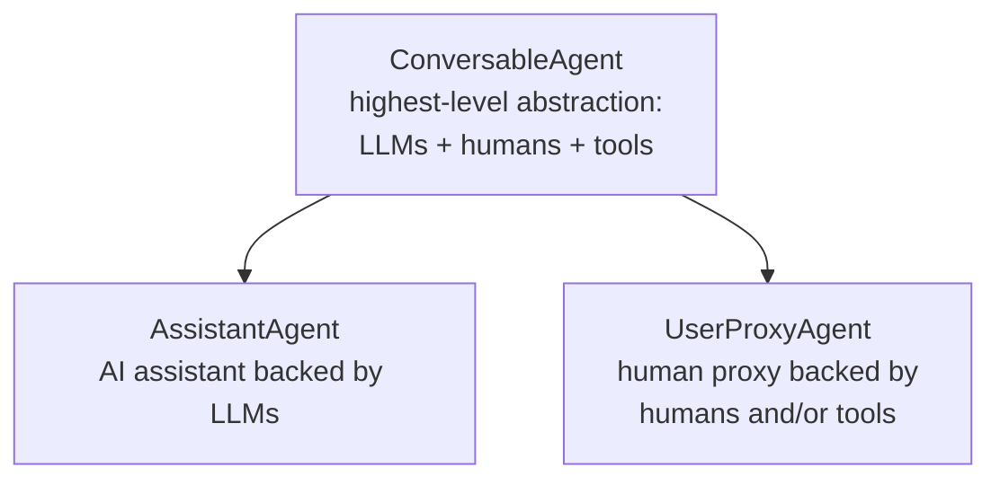

- `ConversableAgent`: the highest-level agent abstraction; by default can use LLMs, humans, and tools.
- `AssistantAgent` and `UserProxyAgent`: pre-configured subclasses for two common usage modes.

#### 🔄 Example Cooperation Flow (Figure 1, right panel)

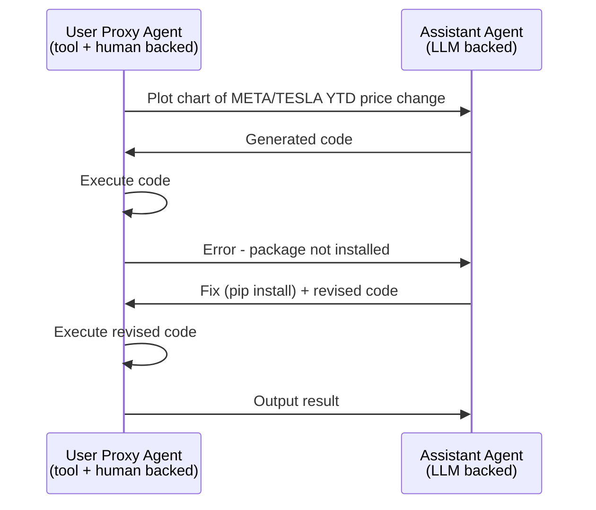

The assistant agent generates a solution (LLM-aided), passes it to the user proxy agent, which solicits human input or executes the code, then returns results as feedback to the assistant.

---

### 🖼️ Figure 2 Overview

🖼️ Figure: A four-layer diagram showing (top) the built-in `ConversableAgent` → `AssistantAgent`/`UserProxyAgent`/`GroupChatManager` hierarchy with example config parameters (`human_input_mode`, `code_execution_config`, `DEFAULT_SYSTEM_MESSAGE`, `group_chat`); (middle) developer code defining agents and registering a custom reply function, then initiating a chat; (bottom) the resulting automated agent chat dialogue during program execution, annotated with "Conversation-Driven Control Flow" and "Conversation-Centric Computation."

> **Figure 2 Caption:** *Illustration of how to use AutoGen to program a multi-agent conversation. The top sub-figure illustrates the built-in agents provided by AutoGen, which have unified conversation interfaces and can be customized. The middle sub-figure shows an example of using AutoGen to develop a two-agent system with a custom reply function. The bottom sub-figure illustrates the resulting automated agent chat from the two-agent system during program execution.*

Represented as a sequence of registered actions:

```mermaid
flowchart LR
    subgraph Developer Code
    D1["1.1 Define Agents:<br/>User Proxy A, Assistant B"]
    D2["1.2 Register custom reply_func_A2B<br/>(input_from_human → else execute code)"]
    D3["2. Initiate: A.initiate_chat(msg, B)"]
    end
    subgraph Program Execution
    P1[receive] --> P2[generate_reply] --> P3[send] --> P1
    end
    Developer Code --> Program Execution
```

By allowing custom agents to converse, AutoGen's conversable agents form a useful building block — but developers also need to **specify and mold** these multi-agent conversations.

---

### 2.2 Conversation Programming

A paradigm built on two concepts:

1. **Computation** — the actions agents take to compute a response within a multi-agent conversation.
2. **Control flow** — the sequence/conditions under which those computations happen.

> Both are **conversation-centric**: an agent's actions result in message passing for subsequent conversation turns (unless a termination condition is met); control-flow decisions (who to message, what computation to run) are functions of the inter-agent conversation itself.

This lets developers reason about a complex workflow simply as *agent action-taking* + *conversation message-passing*.

**Illustrated in Figure 2:**
- Bottom sub-figure: individual agents perform role-specific, conversation-centric computation (e.g., LLM inference calls, code execution).
- Middle sub-figure: conversation-based control flow — when the assistant receives a message, the user proxy agent sends human input as a reply if available; otherwise it executes any code in the assistant's message.

#### 🎛️ Design Patterns for Conversation Programming

**① Unified interfaces + auto-reply mechanism**

- Every agent exposes unified conversation interfaces:
  - `send` / `receive` — for sending/receiving messages
  - `generate_reply` — for taking actions and generating a response
- **Auto-reply mechanism** (default): once an agent receives a message, it automatically invokes `generate_reply` and sends the reply back, unless a termination condition is satisfied.
- Built-in reply functions are based on: LLM inference, code/function execution, or human input.
- Developers can register **custom reply functions** (e.g., to have an agent chat with a third agent before replying to the original sender).
- Once reply functions are registered and the conversation initialized, the flow proceeds automatically — no separate control-plane module required. This gives a decentralized, modular, unified way to define workflow.

**② Control via fusion of programming and natural language**

| Control type | Description |
|---|---|
| **Natural-language control (via LLMs)** | Prompt LLM-backed agents in natural language, e.g., default `AssistantAgent` system message instructs it to fix errors and regenerate code, or to reply `"TERMINATE"` when tasks are complete. Can also constrain output structure for downstream tool-backed agents. |
| **Programming-language control** | Python code specifies termination conditions, human-input mode, tool execution logic (e.g., max auto-replies), or registers custom auto-reply functions. |
| **Control transition (code ↔ NL)** | Code → NL: invoke an LLM inference with control logic inside a custom reply function. NL → code: via LLM-proposed function calls. |

**③ Flexible conversation flow patterns**

Beyond static, predefined flows, AutoGen supports **dynamic** multi-agent conversation via:

1. **Customized `generate_reply` function** — an agent can hold the current conversation while invoking conversations with other agents, depending on message content/context.
2. **Function calls** — the LLM decides whether to call a function depending on conversation status; messaging additional agents inside called functions drives dynamic multi-agent conversation.
3. **`GroupChatManager`** (built-in) — supports complex dynamic group chat: dynamically selects the next speaker and broadcasts its response to other agents (elaborated in Section 3).

---

## 3. Applications of AutoGen

- Six applications demonstrated (see Figure 3) to illustrate AutoGen's potential for simplifying development of high-performance multi-agent applications.
- Selection criteria:
  - **Real-world relevance** — A1, A2, A4, A5, A6
  - **Problem difficulty / solving capability enabled by AutoGen** — A1, A2, A3, A4
  - **Innovative potential** — A5, A6
- Together these criteria showcase AutoGen's role in advancing the LLM-application landscape.


## 📌 Six Example Applications Built with AutoGen

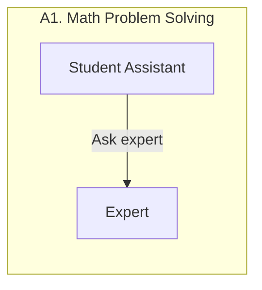

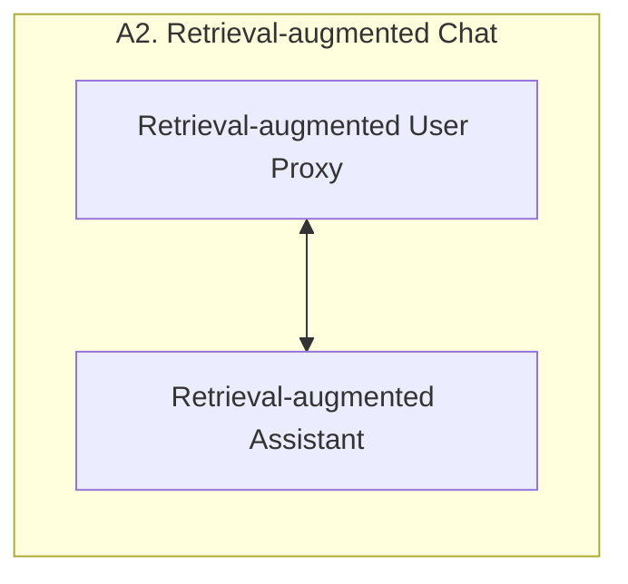

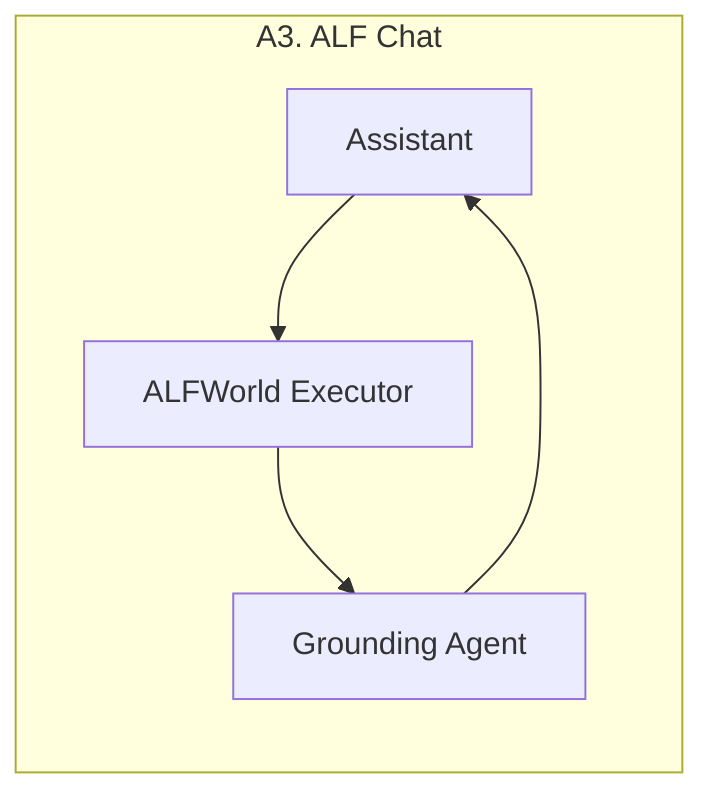

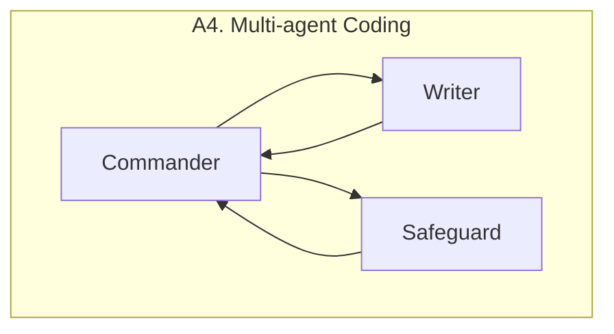

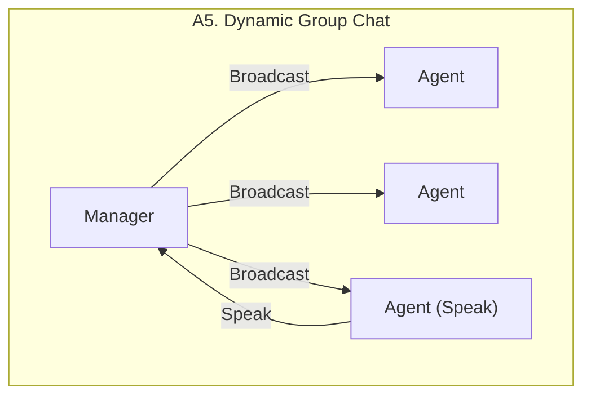

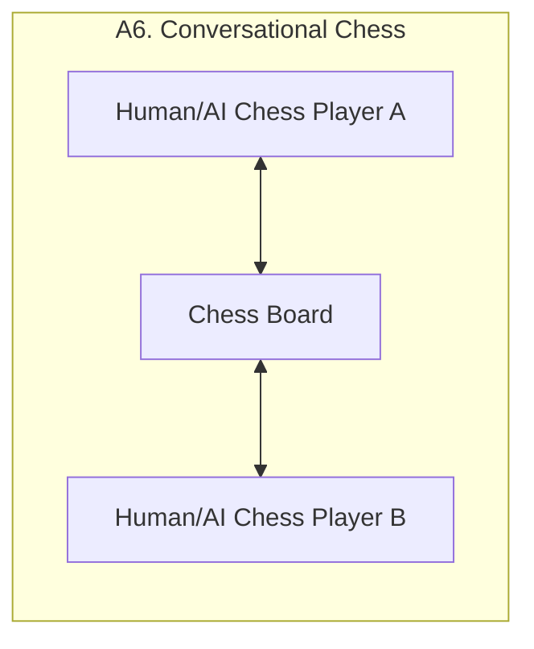

> Figure 3: Six examples of diverse applications built using `AutoGen`. Their conversation patterns show AutoGen's flexibility and power.

---

### A1: Math Problem Solving

Mathematics is a foundational discipline, and using LLMs to assist with math problem solving opens applications like personalized AI tutoring and AI research assistance. This section shows how AutoGen supports various math problem-solving paradigms.

- **Scenario 1 — Autonomous solving:** Built by directly reusing two built-in AutoGen agents. Evaluated against Multi-Agent Debate, LangChain ReAct, vanilla GPT-4, ChatGPT + Code Interpreter, and ChatGPT + Plugin (Wolfram Alpha) on the MATH dataset (120 randomly selected level-5 problems, plus the full test set). AutoGen's built-in agents outperform all alternatives out of the box, including commercial products.
- **Scenario 2 — Human-in-the-loop:** Setting `human_input_mode='ALWAYS'` in the `UserProxyAgent` lets human feedback help solve problems unsolvable by the system alone.
- **Scenario 3 — Multi-human:** Multiple human users can jointly participate in the problem-solving conversation.

> Full evaluation details and case studies for all three scenarios are in Appendix D.

> **Figure 4 Caption:** *Performance on four applications A1-A4. (a) shows that AutoGen agents can be used out of the box to achieve the most competitive performance on math problem solving tasks; (b) shows that AutoGen can be used to realize effective retrieval augmentation and realize a novel interactive retrieval feature to boost performance on Q&A tasks; (c) shows that AutoGen can be used to introduce a three-agent system with a grounding agent to improve performance on ALFWorld; (d) shows that a multi-agent design is helpful in boosting performance in coding tasks that need safeguards.*

#### 📊 Figure 4a — Performance on MATH (w/ GPT-4)

| Method | 120 Level-5 problems | Whole Dataset |
|---|---|---|
| AutoGen | 52.5% | 69.48% |
| ChatGPT + Code | 48.33% | — |
| ChatGPT + Plugin | 45.0% | — |
| GPT-4 | 30.0% | 55.18% |
| Multi-Agent Debate | 26.67% | — |
| LangChain ReAct | 23.33% | — |

*(ChatGPT was not evaluated on the whole dataset due to manual effort and hourly message limits; Multi-Agent Debate and LangChain ReAct were dropped from the whole-dataset run since they underperformed vanilla GPT-4 on the smaller set.)*

---

### A2: Retrieval-Augmented Code Generation and Question Answering

Retrieval augmentation mitigates LLMs' intrinsic knowledge limitations by incorporating external documents. AutoGen is used to build **Retrieval-augmented Chat**, a Retrieval-Augmented Generation (RAG) system with two agents extended from AutoGen's built-ins:

- **Retrieval-augmented User Proxy** — includes a vector database (Chroma) with SentenceTransformers as the context retriever.
- **Retrieval-augmented Assistant** — consumes the retrieved context to answer.

Evaluated in both QA and code-generation settings:

- **Scenario 1 — Natural Question Answering (Natural Questions dataset):** Compared against DPR (Dense Passage Retrieval), following an existing evaluation practice. AutoGen introduces a novel **interactive retrieval** feature: when retrieved context lacks the answer, instead of terminating, the assistant replies *"Sorry, I cannot find any information about... UPDATE CONTEXT,"* triggering further retrieval attempts. An ablation replacing this with a plain *"I don't know"* response shows interactive retrieval plays a non-trivial role.
- **Scenario 2 — Code generation:** Retrieval-augmented Chat generates code from a codebase containing code not in GPT-4's training data.

#### 📊 Figure 4b — Q&A tasks (w/ GPT-3.5)

| Method | F1 | Recall |
|---|---|---|
| AutoGen | 25.88% | 66.65% |
| AutoGen w/o interactive retrieval | 22.79% | 62.59% |
| DPR | 15.12% | 58.56% |

*(The results of DPR with GPT-3.5 shown in Figure 4b are from Adlakha et al., 2023. GPT-3.5 is used as shorthand for GPT-3.5-turbo.)*

---

### A3: Decision Making in Text World Environments

Studied via the **ALFWorld** benchmark — synthetic language-based interactive decision-making tasks in household environments.

- A two-agent system (LLM-backed **assistant** for planning + **executor** for acting in ALFWorld) integrates ReAct-style prompting and achieves similar performance to ReAct.
- ⚠️ **Limitation:** Both ReAct and this two-agent system occasionally fail to apply basic commonsense knowledge, causing repetitive-error loops.
- **Fix:** A third **grounding agent** supplies commonsense knowledge (e.g., *"You must find and take the object before you can examine it"*) whenever early signs of recurring errors appear — significantly reducing error loops.
- Compared: two-agent vs. three-agent AutoGen systems, GPT-3.5-turbo, and ReAct, on 134 unseen ALFWorld tasks.

#### 📊 Figure 4c — Performance on ALFWorld

| Method | Average | Best of 3 |
|---|---|---|
| AutoGen (3 agent) | 69% | 77% |
| AutoGen (2 agent) | 54% | 63% |
| ReAct | 54% | 66% |

*(Results of ReAct are obtained by directly running its official code with default settings. The code uses `text-davinci-003` as backend LM and does not support GPT-3.5-turbo or GPT-4.)*

📌 Adding the grounding agent yields a ~15% average performance gain, mainly by preventing the system from persisting with flawed plans.

---

### A4: Multi-Agent Coding

Built on **OptiGuide**, a system that writes code to interpret optimization solutions and answer user questions (e.g., effects of changing a supply-chain decision).

**Workflow:**

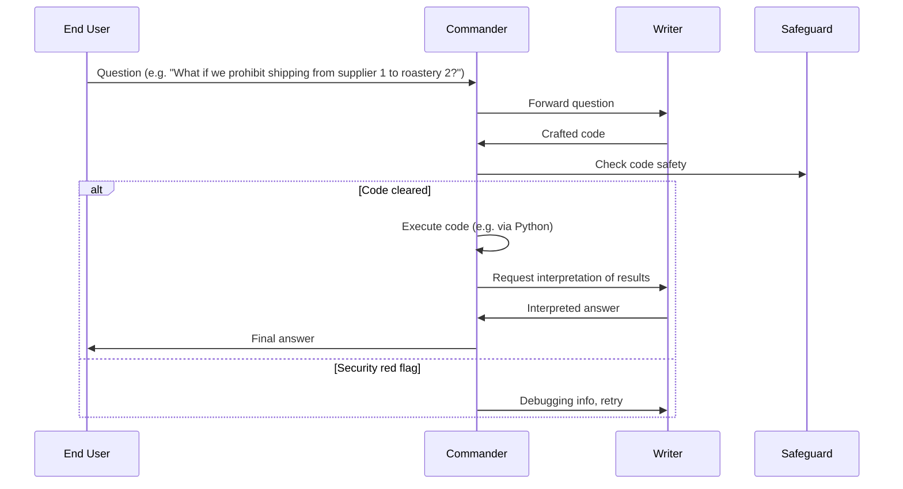

- Using AutoGen, OptiGuide's core workflow code shrank from **430+ lines to ~100 lines**.
- Compared to ChatGPT + Code Interpreter, AutoGen-based OptiGuide saves **~3x user time** and reduces user interactions **3–5x**.
- Ablation: single-agent (one agent does both writing and safeguarding) vs. multi-agent, on 100 coding tasks (50 safe / 50 unsafe). Multi-agent design improves F1 for identifying unsafe code by **8% (GPT-4)** and **35% (GPT-3.5-turbo)**.

#### 📊 Figure 4d — Performance on OptiGuide

| Setup | F1 | Recall |
|---|---|---|
| Multi-GPT4 | 96.00% | 98.00% |
| Single-GPT4 | 88.00% | 78.00% |
| Multi-GPT3.5 | 83.00% | 72.00% |
| Single-GPT3.5 | 48.00% | 32.00% |

---

### A5: Dynamic Group Chat

AutoGen natively supports **dynamic group chat**: participating agents share context and converse without a pre-defined order, driven by the ongoing conversation itself.

- The `GroupChatManager` class conducts the conversation by repeating three steps:
  1. Dynamically select a speaker
  2. Collect the response from that speaker
  3. Broadcast the message to all agents
- Speaker selection uses a **role-play style prompt**.
- Pilot study on 12 manually crafted complex tasks: role-play prompting (vs. a purely task-based prompt) leads to better use of conversation context and role alignment, giving a higher success rate and fewer LLM calls.

> Detailed results are in Appendix D.

---

### A6: Conversational Chess

**Conversational Chess** — a natural-language interface chess game with:
- Built-in **player agents** (human or LLM)
- A third-party **board agent** that provides information and validates moves per standard rules

**Two key features enabled by AutoGen:**

1. **Flexible game dynamics** — supports AI-AI, AI-human, and human-human play, with seamless mode switching mid-game.
2. **Grounding** — the board agent checks every proposed move for legality; illegal moves are rejected and the player agent must re-propose a legal move, preserving game integrity.

⚠️ **Ablation:** Removing the board agent and relying only on a prompt ("make sure both you and the opponent are making legal moves") led to illegitimate moves and game disruptions — confirming the board agent's necessity.

---

## 4 Discussion

AutoGen is an open-source library built on **conversable agents** and **conversation programming**, offering:

- A unified conversation interface among agents
- An auto-reply mechanism
- A general framework for multi-agent systems supporting reuse, customization, extension, and programmable conversations

**Key benefits observed (Section 3):**

- Improved performance over state-of-the-art approaches
- Reduced development code
- Decreased manual burden
- Flexibility for **dynamic** (not just fixed back-and-forth) multi-agent patterns — demonstrated in A1 (Scenario 3), A5, and A6
- Modularity — agents can be developed, tested, and maintained separately, simplifying overall development

### 🔮 Future Directions

- Integrating existing agent implementations into the multi-agent framework
- Investigating the optimal balance between automation and human control
- Studying agent topology and conversation patterns for maximal effectiveness and efficiency
- ⚠️ More agents/degrees of freedom → more capability, but also new **safety challenges** requiring further study

> Further discussion, usage guidelines, and future work directions are in Appendix B.

---

## ⚖️ Ethics Statement

- **Privacy & Data Protection** — Human participation in agent conversations requires safeguarding user data and conversation privacy.
- **Bias & Fairness** — LLMs can reflect training-data biases; developers must address and mitigate bias in agent conversations to ensure fairness and inclusivity.
- **Accountability & Transparency** — Multi-agent cooperation needs clear accountability/transparency mechanisms so users can trace agents' decision-making.
- **Trust & Reliance** — Clear communication and user education about system capabilities/limitations is essential given automation via agent conversations.
- **Unintended Consequences** — Letting LLM agents act on external environments (code execution, function calls, package installation) carries risk; developers must build in appropriate safeguards.

---

## 🙏 Acknowledgements

The work presented in this report was made possible through discussions and feedback from Peter Lee, Johannes Gehrke, Eric Horvitz, Steven Lucco, Umesh Madan, Robin Moeur, Piali Choudhury, Saleema Amershi, Adam Fourney, Victor Dibia, Guoqing Zheng, Corby Rosset, Ricky Loynd, Ece Kamar, Rafah Hosn, John Langford, Ida Momennejad, Brian Krabach, Taylor Webb, Shanka Subhra Mondal, Wei-ge Chen, Robert Gruen, Yinan Li, Yue Wang, Suman Nath, Tanakorn Leesatapornwongsa, Xin Wang, Shishir Patil, Tianjun Zhang, Saehan Jo, Ishai Menache, Kontantina Mellou, Runlong Zhou, Feiran Jia, Hamed Khanpour, Hamid Palangi, Srinagesh Sharma, Julio Albinati Cortez, Amin Saied, Yuzhe Ma, Dujian Ding, Linyong Nan, Prateek Yadav, Shannon Shen, Ankur Mallick, Mark Encarnación, Lars Liden, Tianwei Yue, Julia Kiseleva, Anastasia Razdaibiedina, and Luciano Del Corro. Qingyun Wu would like to acknowledge the funding and research support from the College of Information Science and Technology at Penn State University.


## 📚 References

- Adlakha, V., BehnamGhader, P., Lu, X. H., Meade, N., & Reddy, S. (2023). *Evaluating correctness and faithfulness of instruction-following models for question answering.* arXiv:2307.16877.
- Amershi, S., Weld, D., Vorvoreanu, M., Fourney, A., Nushi, B., Collisson, P., Suh, J., Iqbal, S., Bennett, P. N., Inkpen, K., et al. (2019). *Guidelines for human-AI interaction.* CHI 2019.
- Amodei, D., Olah, C., Steinhardt, J., Christiano, P., Schulman, J., & Mané, D. (2016). *Concrete problems in AI safety.*
- AutoGPT (2023). Documentation — Auto-GPT. https://docs.agpt.co/
- BabyAGI (2023). GitHub — BabyAGI. https://github.com/yoheinakajima/babyagi
- Cai, C. J., Winter, S., Steiner, D. F., Wilcox, L., & Terry, M. (2019). *"Hello AI": Uncovering the onboarding needs of medical practitioners for human-AI collaborative decision-making.* PACM HCI.
- Cai, T., Wang, X., Ma, T., Chen, X., & Zhou, D. (2023). *Large language models as tool makers.* arXiv:2305.17126.
- Chroma (2023). ChromaDB. https://github.com/chroma-core/chroma
- Dibia, V. (2023). *LIDA: A tool for automatic generation of grammar-agnostic visualizations and infographics using large language models.* ACL 2023 System Demonstrations.
- Dong, Y., Jiang, X., Jin, Z., & Li, G. (2023). *Self-collaboration code generation via ChatGPT.* arXiv:2304.07590.
- Du, Y., Li, S., Torralba, A., Tenenbaum, J. B., & Mordatch, I. (2023). *Improving factuality and reasoning in language models through multiagent debate.* arXiv:2305.14325.
- Eleti, A., Harris, J., & Kilpatrick, L. (2023). *Function calling and other API updates.* OpenAI blog.
- Guidance (2023). https://github.com/guidance-ai/guidance
- Hendrycks, D., Burns, C., Kadavath, S., Arora, A., Basart, S., Tang, E., Song, D., & Steinhardt, J. (2021). *Measuring mathematical problem solving with the MATH dataset.* arXiv:2103.03874.
- Hong, S., Zheng, X., Chen, J., Cheng, Y., Zhang, C., Wang, Z., Yau, S. K. S., Lin, Z., Zhou, L., Ran, C., et al. (2023). *MetaGPT: Meta programming for multi-agent collaborative framework.* arXiv:2308.00352.
- Horvitz, E. (1999). *Principles of mixed-initiative user interfaces.* SIGCHI 1999.
- HuggingFace (2023). Transformers Agent. https://huggingface.co/docs/transformers/transformers_agents
- Kim, G., Baldi, P., & McAleer, S. (2023). *Language models can solve computer tasks.* arXiv:2303.17491.
- Kwiatkowski, T., Palomaki, J., Redfield, O., Collins, M., Parikh, A., Alberti, C., Epstein, D., Polosukhin, I., Devlin, J., Lee, K., et al. (2019). *Natural Questions: a benchmark for question answering research.* TACL.
- LangChain (2023). https://python.langchain.com/en/latest/index.html
- Lewis, M., Yarats, D., Dauphin, Y. N., Parikh, D., & Batra, D. (2017). *Deal or no deal? End-to-end learning for negotiation dialogues.* arXiv:1706.05125.
- Lewis, P., Perez, E., Piktus, A., Petroni, F., Karpukhin, V., Goyal, N., Küttler, H., Lewis, M., Yih, W., Rocktäschel, T., et al. (2020). *Retrieval-augmented generation for knowledge-intensive NLP tasks.* NeurIPS.
- Li, B., Mellou, K., Zhang, B., Pathuri, J., & Menache, I. (2023a). *Large language models for supply chain optimization.* arXiv:2307.03875.
- Li, G., Hammoud, H. A. A. K., Itani, H., Khizbullin, D., & Ghanem, B. (2023b). *CAMEL: Communicative agents for "mind" exploration of large scale language model society.*
- Liang, T., He, Z., Jiao, W., Wang, X., Wang, Y., Wang, R., Yang, Y., Tu, Z., & Shi, S. (2023). *Encouraging divergent thinking in large language models through multi-agent debate.*
- Liu, E. Z., Guu, K., Pasupat, P., Shi, T., & Liang, P. (2018). *Reinforcement learning on web interfaces using workflow-guided exploration.* arXiv:1802.08802.
- Liu, J. (2022). LlamaIndex. https://github.com/jerryjliu/llama_index
- Mnih, V., Kavukcuoglu, K., Silver, D., Graves, A., Antonoglou, I., Wierstra, D., & Riedmiller, M. (2013). *Playing Atari with deep reinforcement learning.* arXiv:1312.5602.
- Navigli, R., Conia, S., & Ross, B. (2023). *Biases in large language models: Origins, inventory and discussion.* ACM JDIQ.
- OpenAI (2023). ChatGPT plugins. https://openai.com/blog/chatgpt-plugins
- Park, J. S., O'Brien, J. C., Cai, C. J., Morris, M. R., Liang, P., & Bernstein, M. S. (2023). *Generative agents: Interactive simulacra of human behavior.* arXiv:2304.03442.
- Parvez, M. R., Ahmad, W. U., Chakraborty, S., Ray, B., & Chang, K. (2021). *Retrieval augmented code generation and summarization.* arXiv:2108.11601.
- Patil, S. G., Zhang, T., Wang, X., & Gonzalez, J. E. (2023). *Gorilla: Large language model connected with massive APIs.* arXiv:2305.15334.
- Reimers, N., & Gurevych, I. (2019). *Sentence-BERT: Sentence embeddings using Siamese BERT-networks.* EMNLP 2019.
- Semantic-Kernel (2023). https://github.com/microsoft/semantic-kernel
- Shen, B., Xia, F., Li, C., Martín-Martín, R., Fan, L., Wang, G., Perez-D'Arpino, C., Buch, S., Srivastava, S., Tchapmi, L., et al. (2021). *iGibson 1.0: A simulation environment for interactive tasks in large realistic scenes.* IROS 2021.
- Shi, T., Karpathy, A., Fan, L., Hernandez, J., & Liang, P. (2017). *World of bits: An open-domain platform for web-based agents.* ICML.
- Shridhar, M., Yuan, X., Côté, M.-A., Bisk, Y., Trischler, A., & Hausknecht, M. (2021). *ALFWorld: Aligning text and embodied environments for interactive learning.* ICLR 2021.
- Vinyals, O., Ewalds, T., Bartunov, S., Georgiev, P., Vezhnevets, A. S., Yeo, M., Makhzani, A., Küttler, H., Agapiou, J., Schrittwieser, J., et al. (2017). *StarCraft II: A new challenge for reinforcement learning.* arXiv:1708.04782.
- Wang, C., Wu, Q., Weimer, M., & Zhu, E. (2021). *FLAML: A fast and lightweight AutoML library.* MLSys.
- Wang, G., Xie, Y., Jiang, Y., Mandlekar, A., Xiao, C., Zhu, Y., Fan, L., & Anandkumar, A. (2023a). *Voyager: An open-ended embodied agent with large language models.* arXiv:2305.16291.
- Wang, L., Ma, C., Feng, X., Zhang, Z., Yang, H., Zhang, J., Chen, Z., Tang, J., Chen, X., Lin, Y., et al. (2023b). *A survey on large language model based autonomous agents.* arXiv:2308.11432.
- Weld, D. S., & Etzioni, O. (1994). *The first law of robotics (a call to arms).* AAAI.
- Woolf, M. (2023). *LangChain problem.* https://minimaxir.com/2023/07/langchain-problem/
- Wu, Y., Jia, F., Zhang, S., Wu, Q., Li, H., Zhu, E., Wang, Y., Lee, Y. T., Peng, R., & Wang, C. (2023). *An empirical study on challenging math problem solving with GPT-4.* arXiv:2306.01337.
- Xi, Z., Chen, W., Guo, X., He, W., Ding, Y., Hong, B., Zhang, M., Wang, J., Jin, S., Zhou, E., et al. (2023). *The rise and potential of large language model based agents: A survey.* arXiv:2309.07864.
- Yao, S., Zhao, J., Yu, D., Du, N., Shafran, I., Narasimhan, K., & Cao, Y. (2022). *ReAct: Synergizing reasoning and acting in language models.* arXiv:2210.03629.

---

## Appendix A — Related Work 📌

Existing LLM-based agent systems/frameworks are grouped into **single-agent** and **multi-agent** systems, with AutoGen's differentiators summarized in Table 1. Note: many of these are evolving open-source projects, so remarks reflect their state at time of writing. See the surveys by Xi et al. (2023) and Wang et al. (2023b) for deeper coverage.

### 🔹 Single-Agent Systems

- **AutoGPT** — An open-source AI agent that autonomously pursues a given goal by augmenting an AI model with many tools. Single-agent paradigm only; no multi-agent collaboration.
- **ChatGPT+ (code interpreter / plugins)** — Adds code execution and a wide range of curated tools to ChatGPT, currently under the premium ChatGPT Plus subscription.
- **LangChain Agents** — A subpackage of the LangChain framework for choosing a sequence of actions via an LLM. Includes the ReAct agent (Yao et al., 2022), mainly designed for pre-ChatGPT LLMs. All LangChain agents are single-agent and not inherently designed for communicative/collaborative modes; limitations are discussed in Woolf (2023). Even LangChain's multi-agent re-implementations (e.g. CAMEL) are built from scratch rather than on LangChain Agents, only reusing its orchestration modules.
- **Transformers Agent** — An experimental natural-language API on the `transformers` repository with curated tools and an interpreting agent. Single-agent, like AutoGPT; no agent collaboration.

> AutoGen differs from all of the above by natively supporting **multi-agent** LLM applications.

### 🔹 Multi-Agent Systems

- **BabyAGI** — A Python-scripted AI task management system with multiple LLM-based agents (task creation, prioritization, and execution agents). Uses a **static** conversation pattern (predefined communication order). AutoGen supports both static and dynamic patterns, plus tool usage and human involvement.
- **CAMEL** — A communicative agent framework demonstrating role-playing between chat agents for task completion, using "Inception prompting" for autonomous cooperation, and recording conversations for behavior analysis. Does not natively support tool usage (e.g. code execution) and only supports static conversation patterns.
- **Multi-Agent Debate** — Two works (Liang et al., 2023; Du et al., 2023) show multi-agent debate encourages divergent thinking and improves factuality/reasoning. Each agent is a plain LLM inference instance; no tools or humans involved, and conversation order is pre-defined.
- **MetaGPT** — A specialized multi-agent framework for automated software development, assigning distinct roles to GPT instances to collaboratively build software. Specialized to one scenario, unlike AutoGen's generic infrastructure.

*(Voyager (Wang et al., 2023a) and Generative Agents (Park et al., 2023) are noted but skipped as less relevant comparisons.)*

### 📊 Table 1 — AutoGen vs. Related Multi-Agent Systems

| Aspect | AutoGen | Multi-agent Debate | CAMEL | BabyAGI | MetaGPT |
|---|---|---|---|---|---|
| Infrastructure | ✓ | ✗ | ✓ | ✗ | ✗ |
| Conversation pattern | flexible | static | static | static | static |
| Execution-capable | ✓ | ✗ | ✗ | ✗ | ✓ |
| Human involvement | chat/skip | ✗ | ✗ | ✗ | ✗ |

> **Legend:** *Infrastructure* — designed as a generic infrastructure for building LLM applications. *Conversation pattern* — under "static," agent topology stays fixed regardless of input; AutoGen supports both static and dynamic, customizable patterns. *Execution-capable* — whether the system can run LLM-generated code. *Human involvement* — whether/how humans can participate during execution; AutoGen allows flexible involvement, including skipping input.


## Appendix B — Expanded Discussion 📌

📌 **Key Point:** AutoGen not only enables new applications but also helps renovate existing ones.

- In **A1 (scenario 3)**, **A5**, and **A6**, AutoGen enabled multi-agent conversations that follow a *dynamic pattern* instead of a fixed back-and-forth.
- In **A5** and **A6**, humans can participate alongside multiple AI agents conversationally.
- **A1–A4** show how popular applications can be renovated quickly with AutoGen, remaining simple despite involving more than two agents or dynamic multi-turn cooperation.

### Why These Benefits Are Achieved

- **Ease of use** — Built-in agents work out-of-the-box with strong performance, no customization needed. *(A1, A3)*
- **Modularity** — Splitting tasks into separate agents simplifies development, testing, and maintenance. *(A3, A4, A5, A6)*
- **Programmability** — Users can extend/customize agents easily. *(A1–A6)*
  > Example: core workflow code in **A4** reduced from 430+ lines to 100 lines — a **4x** saving.
- **Allowing human involvement** — Native mechanism for human participation/oversight; supports interactive instructions to keep the process on track. *(A1, A2, A5, A6)*
- **Collaborative/adversarial agent interactions** — Agents share information to complement each other's abilities *(A1, A2, A3, A4)*; in some scenarios agents work adversarially, with information shared in a controlled way to prevent distraction or hallucination *(A4, A6)*. AutoGen supports both patterns.

---

### B.1 General Guidelines for Using AutoGen

1. **Consider built-in agents first.**
   - `AssistantAgent` — pre-configured with GPT-4 and a system message for generic code-based problem-solving.
   - `UserProxyAgent` — configured to solicit human input and perform tool execution.
   - Many problems solved by simply combining these two. Customization options:
     1. Specify human input mode, termination condition, code execution config, and LLM config at construction.
     2. Add instructions in the initial user message (boosts performance without editing the system message).
     3. Extend `UserProxyAgent` to handle different execution environments/exceptions.
     4. For deeper changes, leverage the LLM's capability to program conversation flow via natural language.

2. **Start with a simple conversation topology.**
   - Prefer two-agent chat or group chat setups — easiest to extend.
   - Two-agent chat can be extended to more agents using LLM-consumable functions dynamically.

3. **Reuse built-in reply methods** (LLM-, tool-, or human-based) before writing custom reply methods.
   > Example: `GroupChatManager`'s reply method reuses the built-in LLM-based reply function when selecting the next speaker (see A5, Section 3).

4. **Start with humans always in the loop** (`human_input_mode='ALWAYS'`) when developing new `UserProxyAgent` applications, even if the target is fully autonomous.
   - Helps evaluate `AssistantAgent` effectiveness, tune prompts, find corner cases, and debug.
   - Once confident, switch to `human_input_mode='NEVER'` to run LLM as backend autonomously.

5. **Other libraries may still help** in certain cases:
   - For subtasks without back-and-forth/multi-agent needs → unidirectional pipelines via LangChain, LlamaIndex, Guidance, Semantic Kernel, Gorilla, or `autogen.oai` (low-level inference layer).
   - Existing LangChain tools (e.g., Wolfram Alpha) can be used as tool backends for AutoGen agents.
   - Agents from other libraries can be wrapped as conversable agents in AutoGen.
   - Blackbox optimization packages like `flaml.tune` can automate tuning of configurations (e.g., LLM inference config).

---

### B.2 Future Work

> ⚠️ This work raises several open research questions.

**🔬 Designing optimal multi-agent workflows**
- How many agents to include, how to assign roles/capabilities, how agents interact, what to automate.
- Key questions:
  - For what tasks/applications are multi-agent workflows most useful?
  - How do multiple agents help across different applications?
  - What is the optimal (e.g., cost-effective) multi-agent workflow for a given task?

**🔬 Creating highly capable agents**
- Essential for effective troubleshooting/progress within a multi-agent workflow.
- Observation: **CAMEL** (another multi-agent LLM system) largely fails to solve problems because it lacks tool/code execution capability — showing that simple role-playing conversations are insufficient.
- Future work needed: guidelines for application-specific agents, a large OSS knowledge base of agents, and agents that can discover/upgrade their own skills.

**🔬 Enabling scale, safety, and human agency**
- Open question: does scaling multi-agent workflows further help solve extremely complex tasks?
- ⚠️ As workflows scale and grow more complex, logging/adjusting them becomes harder — risk of *"incomprehensible, unintelligible chatter among agents"*.
- Fully autonomous AutoGen workflows are useful but must be used carefully:
  - High autonomy can pose risks, especially in high-risk applications.
  - Need fail-safes against cascading failures and exploitation.
  - Need mitigation of reward hacking and out-of-control/undesired behaviors.
  - Need effective human oversight — determining the appropriate level/pattern of human involvement remains a developer/stakeholder responsibility for safe, ethical use.

---

## Appendix C — Default System Message for Assistant Agent 📌

🖼️ **Figure 5:** Default system message for the built-in assistant agent in AutoGen (v0.1.1), annotated with prompting-technique color codes: *Role Play*, *Control Flow*, *Output Confine*, *Facilitate Automation*, *Grounding*.

> **System Message:**
>
> You are a helpful AI assistant. Solve tasks using your coding and language skills.
>
> In the following cases, suggest python code (in a python coding block) or shell script (in a sh coding block) for the user to execute.
> 1. When you need to collect info, use the code to output the info you need — e.g., browse or search the web, download/read a file, print the content of a webpage or a file, get the current date/time. After sufficient info is printed and the task is ready to be solved based on your language skill, you can solve the task by yourself.
> 2. When you need to perform some task with code, use the code to perform the task and output the result. Finish the task smartly.
>
> Solve the task step by step if you need to. If a plan is not provided, explain your plan first. Be clear which step uses code, and which step uses your language skill.
>
> When using code, you must indicate the script type in the code block. The user cannot provide any other feedback or perform any other action beyond executing the code you suggest. The user can't modify your code. So do not suggest incomplete code which requires users to modify. Don't use a code block if it's not intended to be executed by the user.
>
> If you want the user to save the code in a file before executing it, put `# filename: <filename>` inside the code block as the first line. Don't include multiple code blocks in one response. Do not ask users to copy and paste the result. Instead, use `print` function for the output when relevant. Check the execution result returned by the user.
>
> If the result indicates there is an error, fix the error and output the code again. Suggest the full code instead of partial code or code changes. If the error can't be fixed or if the task is not solved even after the code is executed successfully, analyze the problem, revisit your assumption, collect additional info you need, and think of a different approach to try.
>
> When you find an answer, verify the answer carefully. Include verifiable evidence in your response if possible.
>
> Reply "TERMINATE" in the end when everything is done.

**Prompting technique legend:** Role Play · Control Flow · Output Confine · Facilitate Automation · Grounding

📌 **Discussion:**
- Combining these prompting techniques allows programming a fairly complex conversation even with the simplest two-agent topology — exploiting LLMs' implicit state-inference capability.
- ⚠️ LLMs do not follow all instructions perfectly, so the system needs other mechanisms to handle exceptions/faults.
- Some instructions have ambiguities; designers should either reduce ambiguity for precision or intentionally keep it for flexibility (addressed elsewhere in the agent design).
- **Observation:** GPT-4 follows instructions better than GPT-3.5-turbo.

---

## Appendix D — Application Details 📌

### A1: Math Problem Solving

#### Scenario 1: Autonomous Problem Solving

- Both qualitative and quantitative evaluations performed.
- Base model: **GPT-4**; `sympy` package pre-installed in the execution environment.

**Compared systems:**
- **AutoGPT** — out-of-box, initialized with purpose "solve math problems" → "MathSolverGPT" with auto-generated goals.
- **ChatGPT+Plugin** — Wolfram Alpha plugin enabled in OpenAI web client.
- **ChatGPT+Code Interpreter** — recent OpenAI web client feature.
- **LangChain ReAct+Python** — Python agent from LangChain, `handle_parsing_errors=True`, default zero-shot ReAct prompt.
- **Multi-Agent Debate** — modified for evaluation; by default 3 agents (affirmative, negative, moderator).

> Preliminary evaluations on **BabyAGI**, **CAMEL**, and **MetaGPT** found them unsuitable out-of-the-box for solving math problems. E.g., when tasked with a math problem, MetaGPT begins developing software instead of actually solving the problem.

**📊 Table 2 — Qualitative evaluation on two MATH dataset problems (level-5), 3 trials each**

*(a) Problem 1 — simplify a square root fraction*

| System | Correctness | Failure Reason |
|---|---|---|
| AutoGen | 3/3 | N/A |
| AutoGPT | 0/3 | LLM gives code without `print`, so result isn't printed |
| ChatGPT+Plugin | 1/3 | Wolfram Alpha returns 2 simplified results incl. the correct one; GPT-4 always picks the wrong one |
| ChatGPT+Code Interpreter | 2/3 | Returns a wrong decimal result |
| LangChain ReAct | 0/3 | Gives 3 different wrong answers |
| Multi-Agent Debate | 0/3 | Gives 3 different wrong answers due to calculation errors |

*(b) Problem 2 — number theory problem*

| System | Correctness | Failure Reason |
|---|---|---|
| AutoGen | 2/3 | Final answer from code execution is wrong |
| AutoGPT | 0/3 | LLM gives code without `print`, so result isn't printed |
| ChatGPT+Plugin | 1/3 | One trial got stuck in wrong queries (had to stop); another gave a wrong answer |
| ChatGPT+Code Interpreter | 0/3 | Gives 3 different wrong answers |
| LangChain ReAct | 0/3 | Gives 3 different wrong answers |
| Multi-Agent Debate | 0/3 | Gives 3 different wrong answers |

**Quantitative evaluation (MATH dataset):**
- Experiment 1: 120 level-5 problems (20 problems × 6 categories, excluding geometry).
- Experiment 2: entire test set (5000 problems).
- AutoGPT excluded (can't access code execution results; solved none in qualitative eval).
- **Result:** AutoGen achieves **69.48%** overall accuracy vs. GPT-4's **55.18%** on the full test set.

**Observations:**
- 📊 **Problem-solving success rate:** AutoGen achieves the highest success rate among all compared methods.
  - ChatGPT+Code Interpreter fails to solve problem 2.
  - ChatGPT+Plugin struggles on both problems.
  - AutoGPT fails on both due to code execution issues.
  - LangChain fails on both, producing incorrect answers in all trials.
- 📊 **Verbosity / user experience:**
  - ChatGPT+Plugin is least verbose (Wolfram queries shorter than Python code).
  - AutoGen, ChatGPT+Code Interpreter, and LangChain show similar verbosity (LangChain slightly more due to execution errors).
  - AutoGPT is most verbose (predefined THOUGHTS/REASONING/PLAN steps every reply).
  - AutoGen and ChatGPT+Code Interpreter run smoothly without exceptions.
  - ⚠️ Undesired behaviors noted:
    - AutoGPT consistently omits `print`, requiring manual execution by the user.
    - ChatGPT+Wolfram Alpha plugin can get stuck in a loop requiring manual stop.
    - LangChain ReAct can exit with a parse error, requiring a `handle_parse_error` parameter.

🖼️ **Figure 6:** Diagram of three AutoGen setups for math problem solving:

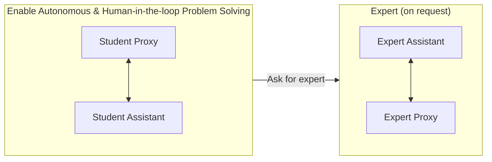

> **Figure 6 Caption:** *Examples of three settings utilized to solve math problems using AutoGen: (Gray) Enables a workflow where a student collaborates with an assistant agent to solve problems, either autonomously or in a human-in-the-loop mode. (Gray + Orange) Facilitates a more sophisticated workflow wherein the assistant, on the fly, can engage another user termed "expert", who is in the loop with their own assistant agent, to aid in problem-solving if its own solutions are not satisfactory.*

#### Scenario 2: Human-in-the-loop Problem Solving

- For challenging problems unsolvable autonomously, human feedback during problem-solving can be incorporated by setting `human_input_mode='ALWAYS'` in the user proxy agent. A challenging problem — one that none of the compared systems solved autonomously across three trials — was used to test human-guided problem solving.

## Human-in-the-Loop Example: Plane Bisector Problem

> 📌 **Problem:** Find the equation of the plane which bisects the angle between the planes $3x - 6y + 2z + 5 = 0$ and $4x - 12y + 3z - 3 = 0$, and which contains the point $(-5, -1, -5)$. Enter your answer in the form $Ax + By + Cz + D = 0$, where $A, B, C, D$ are integers such that $A > 0$ and $\gcd(|A|,|B|,|C|,|D|) = 1$.

**Human-guided process:**

1. Input the problem statement.
2. Since the response is incorrect, give a hint: *"Suppose $P = (x, y, z)$ is a point that lies on a plane that bisects the angle, the distance from $P$ to the two planes is the same. Please set up this equation first."*
3. Once the distance equation is produced (which contains an absolute value), prompt: *"Consider the two cases to remove the abs sign and get two possible solutions."*
4. If two solutions are returned without a final decision, prompt: *"Use point (-5,-1,-5) to determine which is correct and give the final answer."*
5. ✅ **Final answer:** $11x + 6y + 5z + 86 = 0$

### 📊 Results Across Systems (3 trials each)

| System | Outcome |
|---|---|
| AutoGen | Solved consistently in all 3 trials |
| ChatGPT + Code Interpreter | Solved in 2/3 trials (failed to follow human hints in the unsuccessful trial) |
| ChatGPT + Plugin | Solved in 2/3 trials (sign discrepancy in the final answer in the failed trial) |
| AutoGPT | Failed all 3 trials (one incorrect distance equation; two failures due to code execution errors) |

---

## Scenario 3: Multi-User Problem Solving

Next-generation LLM applications may require **multiple real users** collaborating with LLM assistance to solve a problem. Building on Scenario 2, a system was designed involving two human users — a **student** and an **expert**.

### 🔬 Workflow

- The student converses with an LLM assistant agent (via a student proxy agent) to solve problems.
- When the assistant cannot solve the problem satisfactorily, or the solution doesn't meet the student's expectations, it automatically pauses the conversation and calls a predefined `ask_for_expert` function (via GPT's function-calling feature) to consult the expert.
- The assistant auto-generates the initial message to the expert — either the problem statement or a request to verify a solution.
- The expert responds with help from an **expert assistant** agent.
- The final expert response is relayed back to the student assistant, which resumes the conversation with the student using the expert's input.

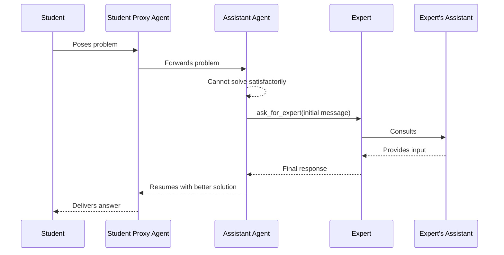

> 📌 Constructing student/expert proxy agents and assistant agents is straightforward by reusing the built-in `UserProxyAgent` and `AssistantAgent` classes. The only custom development needed is writing the `ask_for_expert` function. The system easily extends to **multiple experts** (each with its own `ask_for_expert` function) or **multiple students sharing one expert**.

---

## A2: Retrieval-Augmented Code Generation and Question Answering

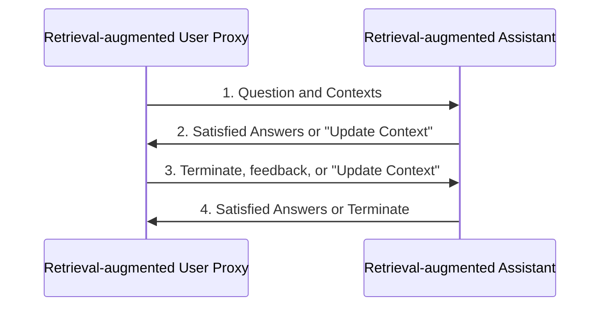

🖼️ **Figure 7:** Overview of Retrieval-augmented Chat, involving a Retrieval-augmented User Proxy and a Retrieval-augmented Assistant. Given a set of documents, the User Proxy splits, chunks, and stores them in a vector database. For a given user input, it retrieves relevant chunks as context and sends them to the Assistant, which uses an LLM to generate code or text answers. The agents converse until a satisfactory answer is found.

> **Figure 7 Caption:** *Overview of Retrieval-augmented Chat which involves two agents, including a Retrieval-augmented User Proxy and a Retrieval-augmented Assistant. Given a set of documents, the Retrieval-augmented User Proxy first automatically processes documents—splits, chunks, and stores them in a vector database. Then for a given user input, it retrieves relevant chunks as context and sends it to the Retrieval-augmented Assistant, which uses LLM to generate code or text to answer questions. Agents converse until they find a satisfactory answer.*

### 🔬 Detailed Workflow

Initialization requires specifying a path to the document collection. The Retrieval-Augmented User Proxy downloads the documents, segments them into chunks of a specific size, computes embeddings, and stores them in a vector database. Once a chat begins, the agents follow this loop:

1. The **User Proxy** retrieves document chunks based on embedding similarity and sends them, with the question, to the **Assistant**.
2. The **Assistant** uses an LLM to generate code or text as an answer. If it can't produce a satisfactory response, it replies **"Update Context"** to the User Proxy.
3. If the response includes code blocks, the User Proxy executes the code and returns the output as feedback. If there are no code blocks or update instructions, it terminates the conversation. Otherwise, it updates the context and forwards the question with new context to the Assistant. (If human input solicitation is enabled, users can proactively send feedback, including "Update Context".)
4. If the Assistant receives "Update Context," it requests the next most similar chunks as new context. Otherwise, it generates a new answer based on feedback and chat history. If it still fails, it replies "Update Context" again. This can repeat several times; the conversation terminates when no more documents are available.

Retrieval-Augmented Chat is evaluated in two scenarios:
- **Code generation** based on a given codebase — valuable because LLMs struggle with packages/APIs not in their training data (e.g., private codebases or frequently updated ones).
- **Question-answering** on the Natural Questions dataset, for comparative evaluation metrics.

### Scenario 1: Evaluation on Natural Questions QA Dataset

The Natural Questions dataset (Kwiatkowski et al., 2019) was used to evaluate end-to-end QA performance. **5,332** non-redundant context documents and **6,775** queries were collected from HuggingFace, forming a document collection stored in the vector database.

> 📌 **Example — interactive retrieval in action:** *"who carried the usa flag in opening ceremony"*

The context chunk with the highest embedding similarity did **not** contain the needed information, so the assistant (GPT-3.5-turbo) initially replied that it couldn't find the answer and returned "UPDATE CONTEXT." The user proxy then automatically fetched the next most similar chunk, allowing the assistant to generate the correct answer.

🖼️ **Figure 8:** Retrieval-augmented Chat without (W/O) and with (W/) interactive retrieval:

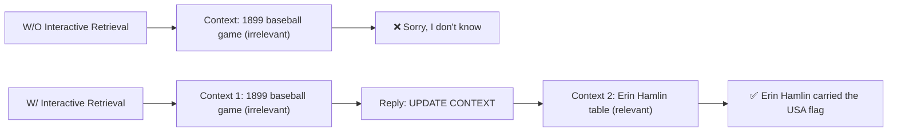

> **Figure 8 Caption:** *Retrieval-augmented Chat without (W/O) and with (W/) interactive retrieval.*

Using the same prompt setup as Adlakha et al. (2023), an experiment on *AutoGen W/O interactive retrieval* was conducted:

- **F1 score:** 23.40%
- **Recall:** 62.60% (first 500 questions)

These results align closely with those in Figure 4b. *AutoGen W/O interactive retrieval* outperforms **DPR**, attributed to differences in retrievers — a straightforward vector search retriever using the **all-MiniLM-L6-v2** embedding model was used.

Analysis of LLM call counts showed that approximately **19.4%** of questions in the Natural Questions dataset trigger an "Update Context" operation, resulting in additional LLM calls.

### Scenario 2: Code Generation Leveraging Latest APIs from the Codebase

> 📌 **Question:** *"How can I use FLAML to perform a classification task and use Spark for parallel training? Train for 30 seconds and force cancel jobs if the time limit is reached."*

- **FLAML (v1)** (Wang et al., 2021) is an open-source AutoML/tuning library, open-sourced in December 2020, and included in GPT-4's training data.
- The question requires **Spark-related APIs**, added to FLAML in **December 2022** — after GPT-4's training cutoff.
- ⚠️ Without retrieval, GPT-4 fails: it invents a non-existent parameter, `spark`, and sets it to `True`.
- ✅ With Retrieval-Augmented Chat providing the latest reference documents as context, GPT-4 generates correct code by setting `use_spark` and `force_cancel` to `True`.

---

## A3: Decision Making in Text World Environments

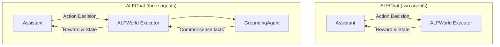

🖼️ **Figure 9:** Two AutoGen designs for the ALFWorld benchmark — a two-agent design (assistant + executor) and a three-agent design that adds a grounding agent supplying commonsense facts to the executor when needed.

> **Figure 9 Caption:** *We use AutoGen to solve tasks in the ALFWorld benchmark, which contains household tasks described in natural language. We propose two designs: a two-agent design where the assistant agent suggests the next step, and the Executor executes actions and provides feedback. The three-agent design adds a grounding agent that supplies commonsense facts to the executor when needed.*

**ALFWorld** (Shridhar et al., 2021) is a synthetic language-based interactive decision-making task simulating real-world household scenes. Given a high-level goal (e.g., putting a hot apple in the fridge) and an environment description, the agent explores and interacts through a textual interface. Tasks may require **more than 40 steps**, demanding goal decomposition into subtasks.

### 🔬 Detailed Workflow

**Two-agent system:**
- **Assistant agent** — generates plans and makes action decisions.
- **Executor agent** — tailored for ALFWorld; performs proposed actions and reports results as feedback.
- Due to strict output format requirements, the **BLEU metric** is used to match the assistant's output to the most similar valid action option.

**Challenge — commonsense reasoning:** The agent must combine few-shot patterns with general household knowledge to understand task rules, but often neglects basic environment knowledge.

**Three-agent solution:** A **grounding agent** is added to supply commonsense facts:
- Failed attempts were analyzed to identify commonsense knowledge gaps.
- The grounding agent provides general knowledge at task start, and whenever the assistant repeats the same action **three times in a row** — preventing the assistant from looping or endlessly apologizing.

### Comparison with ReAct

**ReAct** (Yao et al., 2022) is a few-shot prompting technique interleaving reasoning and acting, improving performance on language and decision-making tasks. It was integrated into AutoGen by adapting prompts conversationally, using a two-shot setting with few-shot prompts from the original repository.

### 📊 Table 3 — Comparisons between ReAct and ALFChat Variants on ALFWorld

| Method | Pick | Clean | Heat | Cool | Look | Pick 2 | All |
|---|---|---|---|---|---|---|---|
| ReAct (avg) | 63 | 52 | 48 | 71 | 61 | 24 | 54 |
| ALFChat (2 agents) (avg) | 61 | 58 | 57 | 67 | 50 | 19 | 54 |
| ALFChat (3 agents) (avg) | 79 | 64 | 70 | 76 | 78 | 41 | 69 |
| ReAct (best of 3) | 75 | 62 | 61 | 81 | 78 | 35 | 66 |
| ALFChat (2 agents) (best of 3) | 71 | 61 | 65 | 76 | 67 | 35 | 63 |
| ALFChat (3 agents) (best of 3) | 92 | 74 | 78 | 86 | 83 | 41 | 77 |

> **Table 3 Caption:** *Comparisons between ReAct and the two variants of ALFChat on the ALFWorld benchmark. For each task, we report the success rate out of 3 attempts. Success rate denotes the number of tasks successfully completed by the agent divided by the total number of tasks. The results show that adding a grounding agent significantly improves the task success rate in ALFChat.*

*(The two-agent design roughly matches ReAct's performance, while the **three-agent design significantly outperforms ReAct** — likely due to the inherent difference between dialogue-completion and text-completion tasks, and the added value of the grounding agent as a knowledge source.)*

### Case Study

🖼️ **Figure 10:** Comparison of results from two designs on a "look at bowl under the desklamp" task:

> **Figure 10 Caption:** *Comparison of results from two designs: (a) Two-agent design which consists of an assistant and an executor, (b) Three-agent design which adds a grounding agent that serves as a knowledge source. For simplicity, we omit the in-context examples and part of the exploration trajectory, and only show parts contributing to the failure/success of the attempt.*

- **Two agents (❌ failure):** The assistant finds the desklamp, then locates the bowl, but tries to "look at" the bowl without first taking it — turning the desklamp on repeatedly and falling into an infinite loop, leading to task failure.
- **Three agents (✅ success):** The grounding agent intervenes: *"You must find and take the object before you can examine it. You must go to where the target object is before you can use it."* The assistant then goes back, takes the bowl, returns to the desklamp, uses it, and succeeds.

Most task failures involve conflating **finding** an object with **taking** it — especially in 'pick' and 'look' type tasks. The grounding agent breaks this loop.

### ⚠️ Takeaways

A grounding agent serving as an external commonsense knowledge source significantly enhances the assistant's decision-making ability. Supplying necessary commonsense facts to the decision-making agent boosts task success rate, and **AutoGen provides both simplicity and modularity** when adding such an agent.


## A4: Multi-Agent Coding

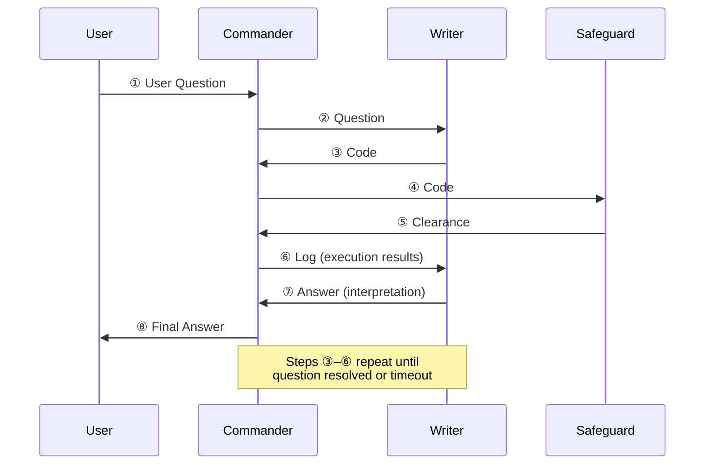

> **Figure 11 Caption:** *Our re-implementation of OptiGuide with AutoGen streamlining agents' interactions. The Commander receives user questions (e.g., What if we prohibit shipping from supplier 1 to roastery 2?) and coordinates with the Writer and Safeguard. The Writer crafts the code and interpretation, the Safeguard ensures safety (e.g., not leaking information, no malicious code), and the Commander executes the code. If issues arise, the process can repeat until resolved. Shaded circles represent steps that may be repeated multiple times.*

### 📌 Detailed Workflow

- **① User Question** — The end user poses a question (e.g., *"What if we prohibit shipping from supplier 1 to roastery 2?"*) to the **Commander** agent.
- **Commander's role** — Coordinates two LLM-based assistant agents (**Writer** and **Safeguard**), and manages memory tied to user interactions, sharing context across the system for more informed responses.
- **② / ③ Code writing** — The **Writer** (combining "Coder" + "Interpreter" roles per Li et al., 2023a) crafts code, e.g.:
  ```python
  model.addConstr(x['supplier1', 'roastery2'] == 0, 'prohibit')
  ```
- **④ / ⑤ Safety check** — The Commander sends the code to the **Safeguard** for screening; once cleared, the Commander executes it via external tools (e.g., Python).
- **⑥ / ⑦ Interpretation** — The Commander requests the Writer interpret the execution results, e.g.: *"if we prohibit shipping from supplier 1 to roastery 2, the total cost would increase by 10.5%."*
- **⑧ Final Answer** — The Commander delivers the concluding answer to the user.

> ⚠️ **Exception handling:** If the Safeguard raises a security flag (at ⑤) or code execution fails (within Commander), the Commander redirects the issue back to the Writer with log information (⑥). Steps ③→⑥ may repeat multiple times until the query is resolved or a timeout occurs.

### 🔬 Engineering Impact

- Core OptiGuide workflow code reduced from **>430 lines → ~100 lines** using AutoGen.
- Agents are customizable, conversable, and autonomously manage their own chat memories.
- Coder and Interpreter roles merged into a single **"Writer"** agent for a cleaner, more maintainable implementation.

---

### 📊 Manual Evaluation: ChatGPT + Code Interpreter vs. AutoGen-based OptiGuide

- ChatGPT + Code Interpreter **cannot execute code with private/customized dependencies** (e.g., Gurobi), forcing users to manually handle steps — requiring engineering expertise and increasing error risk and support-engineer workload.
- **Study setup:** An expert Python/Gurobi programmer evaluated both systems on 10 randomly selected coffee supply-chain questions, measuring time and accuracy.

**Key findings:**

| Metric | ChatGPT + Code Interpreter | AutoGen-based OptiGuide |
|---|---|---|
| Correct answers (out of 10) | 8 | 8 |
| Avg. time per problem | 4 min 35 sec (σ ≈ 2.5 min) | ~1.5 min |
| Speed advantage | — | **~3x faster** |

- With Code Interpreter, users must read code/instructions, know where to paste snippets, download and run code in a terminal — slow and error-prone.
- Code Interpreter also generates more tokens (reading variables line-by-line, chain-of-thought) before producing a final answer, adding latency.
- AutoGen reduces user interactions **3–5x on average**, based on evaluation across **2000 questions** spanning five OptiGuide applications.

#### 📊 Table 4: Manual Effort Saved with OptiGuide (W/ GPT-4), Same Coding Performance

| Dataset | Saving Ratio (mean, σ) |
|---|---|
| netflow | 3.14x (0.65) |
| facility | 3.14x (0.64) |
| tsp | 4.88x (1.71) |
| coffee | 3.38x (0.86) |
| diet | 3.03x (0.31) |

> **Table 4 Caption:** *Manual effort saved with OptiGuide (W/ GPT-4) while preserving the same coding performance is shown in the data below. The data include both the mean and standard deviations (indicated in parentheses).*

- Overall, AutoGen's automated, streamlined chat achieves a **5x reduction in interaction**, fundamentally improving usability. A stable workflow may be reused across other applications or composed into larger systems.

### 💡 Takeaways

- Multi-agent design (AutoGen) simplifies the Python implementation of OptiGuide.
- Fosters a **collaborative + adversarial** problem-solving environment: Commander and Writer collaborate, while Safeguard acts as a virtual adversarial checker.
- Enables proper memory management — Commander retains context-aware memory of user interactions.
- Role-playing keeps each agent's memory isolated, preventing shortcuts and hallucinations.

---

## A5: Dynamic Group Chat

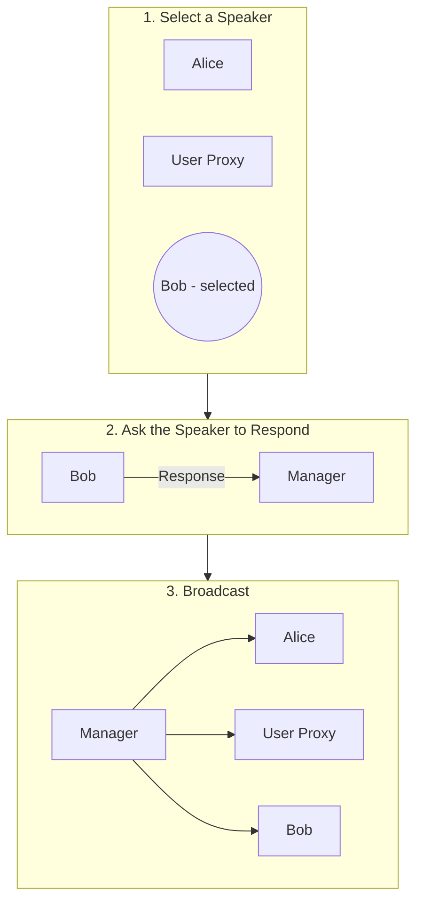

> **Figure 12 Caption:** *A5: Dynamic Group Chat: Overview of how AutoGen enables dynamic group chats to solve tasks. The Manager agent, which is an instance of the GroupChatManager class, performs the following three steps–select a single speaker (in this case Bob), ask the speaker to respond, and broadcast the selected speaker's message to all other agents.*

### 🔬 Method: Pilot Study

To validate the necessity of multi-agent dynamic group chat and the role-play speaker selection policy, a pilot study compared a **four-agent dynamic group chat** system against two alternatives, across **12 manually crafted complex tasks**.

> Example task: *"How much money would I earn if I bought 200 \$AAPL stocks at the lowest price in the last 30 days and sold them at the highest price? Save the results into a file."*

**Systems compared:**
1. **Four-agent group chat** — user proxy (human input), engineer (writes/fixes code), critic (reviews code, gives feedback), code executor.
2. **Two-agent system** — LLM-based assistant + user proxy.
3. **Group chat with task-based speaker selection** — same group members, but speaker selection uses a prompt combining role info, chat history, and the next speaker's task (rather than role-play).

📌 **Finding:** A role-play prompt for dynamic speaker selection led to better consideration of conversation context and role alignment than a task-style prompt — resulting in higher success rate, fewer LLM calls, and fewer termination failures.

#### 📊 Table 5: Number of successes on the 12 tasks (higher the better)

| Model | Two Agent | Group Chat | Group Chat (task-based speaker selection) |
|---|---|---|---|
| GPT-3.5-turbo | 8 | **9** | 7 |
| GPT-4 | 9 | **11** | 8 |

> **Table 5 Caption:** *Number of successes on the 12 tasks (higher the better).*

#### 📊 Table 6: Average # LLM calls and number of termination failures on the 12 tasks (lower the better)

| Model | Two Agent | Group Chat | Group Chat (task-based speaker selection) |
|---|---|---|---|
| GPT-3.5-turbo | 9.9, 9 | 5.3, 0 | 4, 0 |
| GPT-4 | 6.8, 3 | 4.5, 0 | 4, 0 |

> **Table 6 Caption:** *Average # LLM calls and number of termination failures on the 12 tasks (lower the better).*

---

### 🖼️ Figure 13: Two-Agent Chat vs. Group Chat — Task Comparison

**Task:** *"Write a script to download all the pdfs from arxiv in last three days and save them under /arxiv folder."*

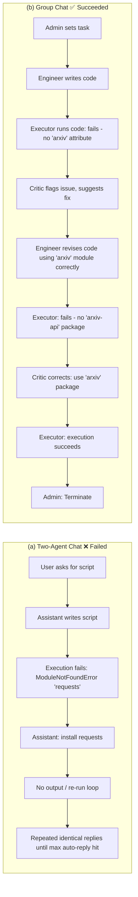

> **Figure 13 Caption:** *Comparison of two-agent chat (a) and group chat (b) on a given task. The group chat resolves the task successfully with a smoother conversation, while the two-agent chat fails on the same task and ends with a repeated conversation.*

---

## A6: Conversational Chess

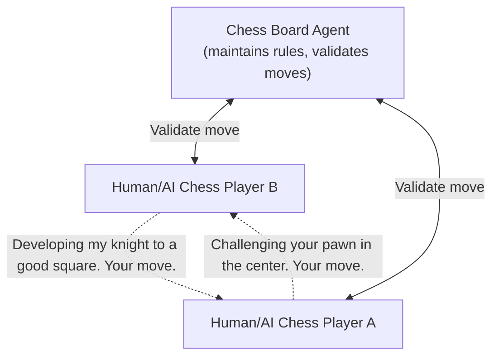

> **Figure 14 Caption:** *A6: Conversational Chess: Our conversational chess application can support various scenarios, as each player can be an LLM-empowered AI, a human, or a hybrid of the two. Here, the board agent maintains the rules of the game and supports the players with information about the board. Players and the board agent all use natural language for communication.*

### 📌 Design

- Each player is an **AutoGen agent**, powered by either a human or an AI.
- A third-party **board agent** provides board information and ensures moves are legal.
- Scenarios supported: **AI vs. AI**, **AI vs. human**, **human vs. human** (and hybrids).
- Enables social interaction — players can express moves creatively via jokes, meme references, and character-playing, making games more entertaining for players and observers (Figure 15 provides an example of conversational chess).

### 🔬 Implementation

- **Player agent** — constructed with both LLM and human back-end options.
  - If human input enabled: prompts the player to type a move plus optional commentary before sending to the board agent.
  - If human input disabled: LLM generates the move/message.
- **Board agent** — implemented via a custom reply function:
  - Uses an LLM to parse natural-language input into a legal move in structured format (e.g., **UCI**).
  - Pushes the move to the board; if illegitimate, replies with an error.
  - The player agent must resend until a legal move is made, then forwards the message to the opponent.
- When generating a message, the LLM player agent uses **board state + error messages** from the board agent — reducing hallucinated invalid moves.
- The chat between a player agent and the board agent is **invisible** to the opposing player agent, keeping messages well-managed for chat completion calls.

### 💡 Benefits of Using AutoGen

1. **Natural object/interaction design** — AutoGen simplifies development by making agent creation and interaction intuitive; isolating chat messages simplifies proper LLM chat completion calls.
2. **Composition-based behavior** — Used the `register_reply` method to instantiate player agents and a board agent with custom reply functions, concentrating extension work at a single point (the reply function), simplifying reasoning, development, and maintenance.


## 🎮 Conversational Chess Example

🖼️ **Figure 15:** Example conversations during a game involving two AI player agents and a board agent:

> **Figure 15 Caption:** *Example conversations during a game involving two AI player agents and a board agent.*

**Conversation between two AI players:**
- White: opens with e2–e4, remarking on the center of the board.
- Black: replies e7–e5 (King's Pawn Opening), chit-chatting about chess reflecting life.
- White: continues developing, knight g1–f3.

**Conversation between an AI player and the board agent:**
- White attempts e4–e5 (attacking the knight) → **Error: illegal uci move**.
- White self-corrects, instead plays d2–d4.

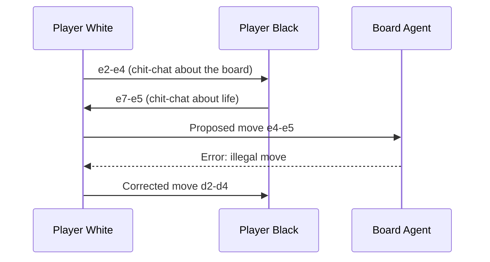

### 📌 Board Agent vs. Prompting-Only Grounding

🖼️ **Figure 16:** Comparison of two designs–(a) without a board agent, and (b) with a board agent–in Conversational Chess:

> **Figure 16 Caption:** *Comparison of two designs–(a) without a board agent, and (b) with a board agent–in Conversational Chess.*

Two designs are compared for keeping the chess game state consistent:

1. **(a) Without a Board Agent** — grounding is attempted purely through a system-message instruction: *"You should make sure both you and the opponent are making legal moves."*
2. **(b) With a Board Agent** — a dedicated agent checks and enforces move legality.

**Result:**
- **(a) Without Board Agent:** Player White silently makes an illegal move (changes a rook at a8 into a knight and moves it to c6) — the error goes uncaught. ❌
- **(b) With Board Agent:** The same illegal move is attempted, but the Board Agent detects it, flags it ("Your move is illegal... please re-make your move"), and the player corrects it. ✅

> 🔑 **Takeaway:** Prompting alone is not reliable for enforcing structured/grounded rules; an explicit verifying agent (Board Agent) is more robust at catching illegal state transitions.

---

## 🌐 A7: Online Decision Making for Browser Interactions

### 🔬 Method: MiniWobChat

Built using **AutoGen**, `MiniWobChat` is a two-agent system solving tasks in the **MiniWoB++** benchmark (browser interaction tasks via mouse/keyboard actions).

- **Assistant agent** — an instance of the built-in `AssistantAgent`; decides the next action given the task and current environment state.
- **Executor agent** — a customized `UserProxyAgent`; executes the suggested action against the benchmark and returns the reward/state feedback.

🖼️ **Figure 17:** MiniWobChat architecture:

```mermaid
flowchart LR
    A[Assistant Agent] -- "Action decision\n(e.g. click button xpath)" --> E[Executor Agent]
    E -- "Executes action on\nMiniWoB++ environment" --> ENV[(Browser Environment)]
    ENV -- "Environment State (HTML)\n+ Reward: Success/Fail/Ongoing" --> E
    E -- "Reward & State" --> A
```

> **Figure 17 Caption:** *We use AutoGen to build MiniWobChat, which solves tasks in the MiniWob++ benchmark. MiniWobChat consists of two agents: an assistant agent and an executor agent. The assistant agent suggests actions to manipulate the browser while the executor executes the suggested actions and returns rewards/feedback. The assistant agent records the feedback and continues until the feedback indicates task success or failure.*

**Example turn:**
- *Action decision:* `Click the button with xpath '//button[id="subbtn"]'`
- *Environment state:* HTML snippet showing a `div` with instructions "Click button ONE, then click button TWO" and two buttons (`subbtn`, `subbtn2`).
- *Reward:* `0` (Ongoing)

Many real-world applications need agents that interact with environments and make sequential decisions — game playing, web interaction, robot manipulation. AutoGen's multi-agent framework makes it easy to **decouple**:
- the **executor** (handles agent–environment interaction), from
- the **decision-maker** (chooses actions).

This decomposition lets the decision-making agent be reused across new tasks with minimal extra engineering, rather than building a bespoke decision agent per environment.

### 📊 Results vs. RCI

`MiniWobChat` is compared against **RCI** (Kim et al., 2023), a prior state-of-the-art method for MiniWoB++ using self-critiquing prompts, across all 49 available tasks (10 instances per task).

| Metric | Value |
|---|---|
| MiniWobChat success rate | 52.8% |
| Gap vs. RCI | −3.6% (RCI slightly higher) |
| Tasks where methods tie (within 0.1 tolerance) | Equal number of tasks won by each method |

*(Results of RCI are reported by running its official code with default settings.)*

🖼️ **Figure 18:** Bar chart comparing per-task success rates (RCI vs. MiniWobChat) across all 49 MiniWoB++ tasks (e.g. click-button, click-checkboxes, email-inbox, enter-date, navigate-tree, social-media, use-spinner, etc.) — the two methods track each other closely across most tasks.

> **Figure 18 Caption:** *Comparisons between RCI (state-of-the-art prior work) and MiniWobChat on the MiniWob++ benchmark are elucidated herein. We utilize all available tasks in the official RCI code, each with varying degrees of difficulty, to conduct comprehensive comparisons. For each task, the success rate across ten different instances is reported. The results reveal that MiniWobChat attains a performance comparable to that of RCI. When a success rate tolerance of 0.1 is considered for each task, both methods outperform each other on an equal number of tasks.*

#### 📊 Table 7: Cases analysis on four typical tasks from MiniWob++

| Task | Correctness | Main failure reason |
|---|---|---|
| click-dialog | AutoGen: 10/10<br/>RCI: 10/10 | N/A |
| click-checkboxes-large | AutoGen: 5/10<br/>RCI: 0/10 | **AssistantAgent:** provides actions with infeasible characters.<br/>**RCI:** performs actions that are out of its plan. |
| count-shape | AutoGen: 2/10<br/>RCI: 0/10 | **AssistantAgent:** provides actions with redundant content that cannot convert to actions in the benchmark.<br/>**RCI:** provides a wrong plan in most cases. |
| use-spinner | AutoGen: 0/10<br/>RCI: 1/10 | **AssistantAgent:** returns actions out of its plan.<br/>**RCI:** provides a wrong plan in most cases. |

> **Table 7 Caption:** *Cases analysis on four typical tasks from MiniWob++.*

### ⚠️ Comparison with Auto-GPT

- Auto-GPT struggles with tasks involving complex rules due to **limited extensibility**.
- It supports setting goals via natural language, but reliably instructing it to follow MiniWoB++'s conventions proved difficult.
- There is no clear mechanism to extend Auto-GPT into a two-agent chat structure the way AutoGen supports.

### ✅ Takeaways

- **AutoGen** was the more user-friendly option for this application: modular, programmable, and streamlined via autonomous assistant↔executor conversations.
- The built-in `AssistantAgent` was **directly reusable** and performed well with no customization.
- Decoupling execution from decision-making means changes to one component don't affect the other — simplifying maintenance and future updates.

---

## Appendix E — Example Outputs from Applications 📎

This section provides worked examples across systems:

- **A1 – Autonomous math problem-solving:**
  - ChatGPT + Plugin (Wolfram Alpha)
  - AutoGen
  - LangChain ReAct
  - AutoGPT
  - Multi-Agent Debate
  - ChatGPT + Code Interpreter
- **A4 – OptiGuide problem:**
  - AutoGen
  - ChatGPT + Code Interpreter
- **A1 – Preliminary evaluation of alternative multi-agent systems:**
  - BabyAGI
  - CAMEL
  - MetaGPT

### 🧮 Worked Example: Simplify $\dfrac{\sqrt{160}}{\sqrt{252}} \times \dfrac{\sqrt{245}}{\sqrt{108}}$

## 📌 Table 8 — ChatGPT+ Plugin (Wolfram Alpha) on Autonomous Math Problem-Solving

> **Table 8 Caption:** *Application A1, Scenario 1: Autonomous math problem-solving. ChatGPT+ Plugin (Wolfram Alpha) on the first qualitative example. The response from Wolfram contains the correct answer, but ChatGPT selected the wrong one.*

### 🔬 Interaction Log

1. **Input:**
   $$\text{Completely simplify and rationalize the denominator: } \frac{\sqrt{160}}{\sqrt{252}} \times \frac{\sqrt{245}}{\sqrt{108}}$$

2. **Request to Wolfram Alpha:**
   ```json
   {
     "input": "simplify(sqrt(160)/sqrt(252))*(sqrt(245)/sqrt(108))"
   }
   ```

3. **Response from Wolfram Alpha:**
   - **Query:** `"simplify(sqrt(160)/sqrt(252))*(sqrt(245)/sqrt(108))"`
   - **Input interpretation:** `simplify | sqrt(160)/sqrt(252) x sqrt(245)/sqrt(108)`
   - **Results:**
     - $\dfrac{5\sqrt{42}}{27}$ *(correct rationalized form)*
     - $\dfrac{5\sqrt{14/3}}{9}$ *(unrationalized denominator inside radical)*
   - **Decimal approximation:** `1.2001371663718259686974013770533327143898526494552...`

4. **ChatGPT Response:**
   > "The completely simplified and rationalized form of the given expression is:
   > $$\frac{5\sqrt{14/3}}{9}$$
   > In decimal form, this is approximately 1.200137166371825968697401377053332714..."

### ⚠️ Limitation
Wolfram Alpha returned the correct rationalized answer $\dfrac{5\sqrt{42}}{27}$, but ChatGPT selected the unrationalized form $\dfrac{5\sqrt{14/3}}{9}$.

---

## 📌 Table 9 — AutoGen on Autonomous Math Problem-Solving

> **Table 9 Caption:** *Application A1, Scenario 1: Autonomous math problem-solving. AutoGen on the first qualitative example. AutoGen solves the problem correctly.*

### 🔬 Interaction Log

1. **User (Init chat):**
   $$\text{Completely simplify and rationalize the denominator: } \frac{\sqrt{160}}{\sqrt{252}} \times \frac{\sqrt{245}}{\sqrt{108}}$$

2. **AutoGen Assistant:**
   "We can simplify and rationalize this denominator using Python's symbolic mathematics library `sympy`. Here is the Python code to resolve this:"

   ```python
   from sympy import sqrt, Rational

   # Define the entire fraction as a rational number
   fraction = (sqrt(160) / sqrt(252)) * (sqrt(245) / sqrt(108))

   # Simplify the fraction
   simplified = fraction.simplify()

   # Print the simplified fraction
   print(simplified)
   ```

   "This code performs the requested simplification by constructing the fraction using the `Rational()` function from the `sympy` module, which automatically simplifies fractions when possible. The `sqrt()` function from the `sympy` module enables square root calculations. Finally, the `simplify()` function simplifies expressions when possible."

3. **User Proxy (Auto Reply):**
   ```text
   exitcode: 0 (execution succeeded)
   Code output: 5*sqrt(42)/27
   ```

4. **AutoGen Assistant:**
   `TERMINATE`

✅ **Result:** AutoGen solves the problem correctly using exact symbolic manipulation.

---

## 📌 Table 10 — LangChain ReAct on Autonomous Math Problem-Solving

> **Table 10 Caption:** *Application A1, Scenario 1: Autonomous math problem-solving. LangChain ReAct on the first qualitative example. The generated code does not match the devised plan. The code returns a decimal number.*

### 🔬 Interaction Log

1. **Input:**
   $$\text{Completely simplify and rationalize the denominator: } \frac{\sqrt{160}}{\sqrt{252}} \times \frac{\sqrt{245}}{\sqrt{108}}$$

2. **Agent Execution:**
   `Entering new AgentExecutor chain...`
   "To simplify this expression, I will first simplify each square root individually, then multiply the fractions as normal. The result should be a rational number."

   **Action:** `Python REPL`
   **Action Input:**
   ```python
   import math

   # Calculate square roots
   sqrt_160 = math.sqrt(160)
   sqrt_252 = math.sqrt(252)
   sqrt_245 = math.sqrt(245)
   sqrt_108 = math.sqrt(108)

   # Multiply fractions
   numerator = sqrt_160 * sqrt_245
   denominator = sqrt_252 * sqrt_108
   result = numerator / denominator

   print(result)
   ```

3. **Observation:** `1.200137166371826`
4. **Thought:** "I now know the final answer"
5. **Final Answer:** "The simplified and rationalized form of the expression is approximately 1.200137166371826."
6. `Finished chain.`

### ⚠️ Limitation
The generated code uses floating-point arithmetic rather than symbolic simplification, returning a decimal approximation instead of the exact simplified radical form.

---


## 📌 Table 11 — AutoGPT on Autonomous Math Problem-Solving (Scenario 1, Example 1)

> **Table 11 Caption:** *Application A1, Scenario 1: Autonomous math problem-solving. AutoGPT on the first qualitative example. We abort as the code never prints the result, and the system does not rectify it after 2 turns. AutoGPT is much more verbose compared to other frameworks. We have shortened some unnecessary content.*

### 🔬 Interaction Log

1. **System** — Re-initializes as `MathSolverGPT`, an agent whose goals include providing step-by-step math solutions with clear explanations across arithmetic, algebra, geometry, trigonometry, and calculus.
2. **MathSolverGPT** (no task yet) — Notes the request is too vague and asks the user to specify a task.
3. **Human** — Supplies the simplification problem:
   $$\text{Completely simplify and rationalize the denominator: } \frac{\sqrt{160}}{\sqrt{252}} \times \frac{\sqrt{245}}{\sqrt{108}}$$
4. **MathSolverGPT** — Plans to use Python's `math` library to compute the square roots and multiply the fractions, then executes:

```python
import math

# Calculate the square roots
sqrt_160 = math.sqrt(160)
sqrt_252 = math.sqrt(252)
sqrt_245 = math.sqrt(245)
sqrt_108 = math.sqrt(108)

# Multiply the fractions
result = (sqrt_160 / sqrt_252) * (sqrt_245 / sqrt_108)

# Simplify the result
simplified_result = math.simplify(result)
simplified_result
```

> ⚠️ **Error:** `AttributeError: module 'math' has no attribute 'simplify'`

5. **MathSolverGPT** — Recognizes `math` has no `simplify` function and switches to `sympy`:

```python
import sympy as sp

sqrt_160 = sp.sqrt(160)
sqrt_252 = sp.sqrt(252)
sqrt_245 = sp.sqrt(245)
sqrt_108 = sp.sqrt(108)

result = (sqrt_160 / sqrt_252) * (sqrt_245 / sqrt_108)
simplified_result = sp.simplify(result)
simplified_result
```

> ⚠️ **Result:** The command returns *no output at all* — the code never prints anything.

6. **MathSolverGPT** — Re-runs the exact same code, gets no output again, and begins reasoning about "issues with square root calculation" without ever adding a `print` statement.
7. **Human** — Aborts the run with `Ctrl+C`.

### ⚠️ Limitation
AutoGPT diagnosed the wrong problem (blamed the math vs. sympy library) instead of noticing the missing print/output statement, and never recovered across two attempts.

---

## 📌 Table 12 — Multi-Agent Debate on Autonomous Math Problem-Solving

> **Table 12 Caption:** *Application A1, Scenario 1: Autonomous math problem-solving. Multi-Agent Debate on the first qualitative problem. It gives a wrong final answer.*

### 🔬 Debate Round 1

**Affirmative side:**
- Decomposes each radical using perfect-square factors:
  - $\sqrt{160} = 4\sqrt{10}$
  - $\sqrt{252} = 6\sqrt{7}$
  - $\sqrt{245} = 7\sqrt{5}$
  - $\sqrt{108} = 6\sqrt{3}$
- Substitutes back:
$$\frac{4\sqrt{10}}{6\sqrt{7}} \times \frac{7\sqrt{5}}{6\sqrt{3}} = \frac{7}{9}\sqrt{\frac{50}{21}}$$
- Rationalizes by multiplying by $\sqrt{21}/\sqrt{21}$, arriving at:
$$\frac{7\sqrt{1050}}{189}$$

**Negative side:**
- Agrees with the intermediate steps but claims the affirmative mishandled $\sqrt{50/21}$, arguing it should be treated as $\sqrt{50}/\sqrt{21}$.
- Independently rationalizes and arrives at the **same final expression**:
$$\frac{7\sqrt{1050}}{189}$$

**Moderator:**
- Declares a preference for the **Negative** side, reasoning that it correctly identified a (largely cosmetic) error in the affirmative's derivation, even though both sides landed on the identical final answer.
- **Debate answer:** $\dfrac{7\sqrt{1050}}{189}$

### ⚠️ Limitation
Both debating sides reach the same final numeric expression, and the moderator rewards the negative side for a distinction without a real mathematical difference — while the shared final answer itself is not verified as correct.

---

## 📌 Table 13 — ChatGPT+ Code Interpreter on OptiGuide (Supply-Chain Question)

> **Table 13 Caption:** *Application A4. ChatGPT+ Code Interpreter for OptiGuide. A sample question "What if the roasting cost is increased by 5% because of the potential salary increase?" is asked.*

### 🔬 Interaction Log

1. **Prompt Writer** — Uploads `coffee.py` and asks about a 5% roasting-cost increase:
   > "For the source code `coffee.py`, can you tell me: What if the roasting cost is increased by 5% because of the potential salary increase?"
2. **ChatGPT+** — Reviews the file, notes a possible Gurobi solver dependency, and asks whether to proceed with an explanation or produce runnable code.
3. **Prompt Writer** — Requests the full modified code to run locally.
4. **ChatGPT+** — Produces a first modified `coffee.py` with the 5% increase applied.
5. **Safeguard agent** — Uploads the generated code for a safety check → verdict: **DANGER**.
6. **Prompt Writer** — Reports the failure, hinting not to directly alter the `roasting_cost_light` / `roasting_cost_dark` variables.
7. **ChatGPT+** — Produces a second version.
8. **Safeguard agent** — Re-checks → verdict: **DANGER** again.
9. **Prompt Writer** — Reports the second failure with the same hint.
10. **ChatGPT+** — Produces a third, final version.
11. **Safeguard agent** — Re-checks → verdict: **SAFE**.
12. **Run Code** — Executes the approved script via a Gurobi-based optimizer; terminal output reports:
    - **Optimal cost:** 2526.5
13. **Prompt Writer** — Shares the terminal output and asks for the final comparison against the original cost of 2470.
14. **ChatGPT+** — Summarizes:

| Scenario | Cost |
|---|---|
| Original | 2470 |
| +5% roasting cost | 2526.5 |
| **Increase** | **56.5** |

### ⚠️ Limitation
Two full rounds of code generation were rejected by the safeguard before a safe version was produced, showing the model's difficulty avoiding direct edits to protected variables.

---

## 📌 Table 14 — ChatGPT+ Code Interpreter on Math Problem-Solving

> **Table 14 Caption:** *Application A1. Scenario 1: autonomous math solving. ChatGPT+ Code Interpreter on the first qualitative example. The code generated does not match the devised plan. The code returns a decimal number.*

### 🔬 Interaction Log

1. **Input:**
   $$\text{Completely simplify and rationalize the denominator: } \frac{\sqrt{160}}{\sqrt{252}} \times \frac{\sqrt{245}}{\sqrt{108}}$$
2. **ChatGPT+** — Describes factoring out perfect squares (16, 4, 1, 36) from 160, 252, 245, 108 respectively, and states the general simplification rules $\sqrt{ab} = \sqrt{a}\sqrt{b}$ and $\frac{a}{b} \times \frac{c}{d} = \frac{a \times c}{b \times d}$.
3. **Generated code:**

```python
import math

# factoring the square roots
sqrt_160 = math.sqrt(16) * math.sqrt(10)
sqrt_252 = math.sqrt(4) * math.sqrt(63)
sqrt_245 = math.sqrt(245)
sqrt_108 = math.sqrt(36) * math.sqrt(3)

# simplify the fraction
numerator = sqrt_160 * sqrt_245
denominator = sqrt_252 * sqrt_108
simplified_fraction = numerator / denominator

simplified_fraction
```

> **Result:** `1.200137166371826`

4. **ChatGPT+** — Reports the "completely simplified and rationalized form" as approximately **1.200**.

### ⚠️ Limitation
The code never performs symbolic simplification or rationalization — it only evaluates a decimal — yet the model presents the decimal as if it fulfilled the original symbolic request.

---

## 📌 Table 15 — AutoGen on OptiGuide (Same Roasting-Cost Question as Table 13)

> **Table 15 Caption:** *Application A4. AutoGen with OptiGuide. The same question "What if the roasting cost is increased by 5% because of the potential salary increase?" is asked.*

### 🔬 Interaction Log

1. **Prompt** — *"What if the roasting cost is increased by 5% because of the potential salary increase?"*
2. **AutoGen** — Recalculates the optimal coffee distribution and directly reports:
   - **New optimal cost:** 2526.5
   - **Original cost:** 2470.0
   - **Increase:** 56.5 units

### 📊 Comparison with Table 13
AutoGen reaches the identical numeric answer (2526.5 vs. 2470.0) as the ChatGPT+ Code Interpreter workflow, but does so directly without the multi-round safeguard rejection cycle seen in Table 13.

---

## 📌 Table 16 — BabyAGI Preliminary Test on Autonomous Math Problem-Solving

> **Table 16 Caption:** *Application A1. Scenario 1: autonomous math solving. Preliminary test with BabyAGI.*

> **Setup:** `OBJECTIVE=Solve math problems`, `INITIAL TASK=`
> $$\text{Completely simplify and rationalize the denominator: } \frac{\sqrt{160}}{\sqrt{252}} \times \frac{\sqrt{245}}{\sqrt{108}}$$

### 🔬 Interaction Log

1. **Task list initialized** with the single initial task.
2. **Task result** — BabyAGI simplifies the radicals:
   - $\sqrt{160} = 4\sqrt{10}$
   - $\sqrt{252} = 2\sqrt{63}$
   - $\sqrt{245} = 7\sqrt{5}$
   - $\sqrt{108} = 6\sqrt{3}$
   - Proceeds through several algebraic steps and arrives at a final simplified form of $\dfrac{20\sqrt{6}}{9}$.
3. **Task Creation Agent** — Is prompted with the full task result text (which BabyAGI redundantly repeats in full) and asked to generate follow-up tasks toward the objective "Solve math problems."
4. **Task Creation Agent response** — Generates 10 new, unrelated simplify-and-rationalize practice problems (e.g. $\frac{\sqrt{225}}{\sqrt{45}} \times \frac{\sqrt{200}}{\sqrt{125}}$, $\frac{\sqrt{289}}{\sqrt{361}} \times \frac{\sqrt{100}}{\sqrt{72}}$, …), which are added to the task queue.
5. **Task Prioritization Agent** — Begins prioritizing the queued tasks.
6. Run is **aborted**.

### ⚠️ Limitation
BabyAGI's task-creation loop spins off an unbounded series of self-generated, tangential practice problems rather than converging on or verifying a single final answer to the original task.

---

## 📌 Table 17 — Preliminary Test with CAMEL on Autonomous Math Problem-Solving

> **Table 17 Caption:** *Application A1, Scenario 1: Autonomous math problem-solving. Preliminary test with CAMEL. We constructed two roles: "Math Solver" and "Python Programmer". The resulting code cannot be executed. The conversation continues, and the roles are not keen on solving the problem and giving an answer.*

> **Task prompt:** Completely simplify and rationalize the denominator:
> $$\frac{\sqrt{160}}{\sqrt{252}} \times \frac{\sqrt{245}}{\sqrt{108}}$$

CAMEL was set up with two roles — **Math Solver** (AI User) and **Python Programmer** (AI Assistant) — to collaboratively translate the math problem into a Python program.

**System setup:**
- **Assistant role:** Python Programmer — tasked to write a program that accepts four integers, applies the square root to each, and simplifies/rationalizes the resulting fraction.
- **User role:** Math Solver — instructs the Python Programmer, never flips roles.
- **Original task:** simplify the given expression.
- **Specified task:** write a Python program that takes four integers, applies `sqrt`, and returns the simplified expression.

**Conversation excerpt:**

| Turn | Speaker | Content |
|---|---|---|
| 1 | AI User | Instruction: Import the necessary libraries for the task. |
| 1 | AI Assistant | Imports `math` (for `sqrt`) and `fractions.Fraction` (for simplification): |

```python
import math
from fractions import Fraction
```

| Turn | Speaker | Content |
|---|---|---|
| 2 | AI User | Instruction: Define a function that accepts four integers as input. |
| 2 | AI Assistant | Defines a placeholder function: |

```python
def simplify_fraction(a, b, c, d):
    pass
```

| Turn | Speaker | Content |
|---|---|---|
| 3 | AI User | Instruction: Inside the function, apply the square root function to each of the input integers. |
| 3 | AI Assistant | Adds square-root computation: |

```python
def simplify_fraction(a, b, c, d):
    sqrt_a = math.sqrt(a)
    sqrt_b = math.sqrt(b)
    sqrt_c = math.sqrt(c)
    sqrt_d = math.sqrt(d)
```

| Turn | Speaker | Content |
|---|---|---|
| 4 | Human | **Abort** |

### ⚠️ Limitation
The resulting code cannot be executed, and the conversation continues without the roles converging on solving the problem or producing a final answer.

---

## 📌 Table 18 — Preliminary Evaluation on MetaGPT on Autonomous Math Problem-Solving

> **Table 18 Caption:** *Application A1, Scenario 1: Autonomous math problem-solving. Preliminary evaluation on MetaGPT. It does not solve the math problem but gives a product solution.*

Given the same math prompt, MetaGPT instead interpreted the request as a **product-development task**, producing:

- **Product Goals**
  - Create a product that meets the needs of the target market
  - Ensure the product is efficient and easy to use
  - Achieve a high level of customer satisfaction

- **User Stories**
  - As a user, I want a product that is easy to navigate so that I can find what I need quickly
  - As a user, I want a product that is reliable and efficient so that I can depend on it
  - As a user, I want a product that meets my needs so that I can get value for my money
  - As a user, I want a product that is constantly updated and improved so that I can enjoy the best features
  - As a user, I want a product that offers good customer support so that I can get help when I need it

- **Competitive Analysis**
  - Product A: similar features but lacks efficiency
  - Product B: highly efficient but doesn't meet all target-market needs
  - Product C: high customer satisfaction but not easy to navigate
  - Product D: constantly updated but lacks reliability
  - Product E: good customer support but not efficient
  - Product F: reliable and efficient but lacks good customer support
  - Our Target Product: aims to combine all competitors' strengths while improving on their weaknesses

- A **Competitive Quadrant Chart** was also being generated when the run was aborted.

| Turn | Speaker | Content |
|---|---|---|
| — | Human | **Abort** |

### ⚠️ Limitation
MetaGPT does not solve the math problem at all — it defaults to producing a generic product-requirements document instead.

---

## 📌 Table 19 — MiniWobChat on Web Manipulation ("click-button-sequence")

> **Table 19 Caption:** *Application A7. Example output of MiniWobChat on one web manipulation task "click-button-sequence."*

**Setup:** An autonomous computer-control agent executes atomic natural-language instructions of two types:
1. `type <text>` — types characters via keyboard (cursor must first be located with a `click` instruction).
2. `clickxpath <xpath>` — clicks an HTML element identified by a valid XPath.

**Target webpage HTML:**

```html
<div id="wrap" data-wob_ref="2" data-wob_eps="e0">
  <div id="query">Click button ONE, then click button TWO.</div>
  <div id="area" data-wob_ref="3" data-wob_eps="e0">
    <button id="subbtn" style="position:absolute;left:103px;top:87px" data-wob_ref="4" data-wob_eps="e0">ONE</button>
    <button id="subbtn2" style="position:absolute;left:44px;top:97px" data-wob_ref="5" data-wob_eps="e0">TWO</button>
  </div>
</div>
```

**Task:** Click button ONE, then click button TWO.

#### Agent interaction flow

```mermaid
sequenceDiagram
    participant Assistant as AssistantAgent
    participant Executor as Executor agent

    Executor->>Assistant: Init chat + task + webpage HTML + plan
    Assistant->>Executor: Plan:<br/>1. Click xpath //button[@id='subbtn']<br/>2. Click xpath //button[@id='subbtn2']
    Executor->>Assistant: Webpage HTML + plan + no instructions executed yet
    Assistant->>Executor: clickxpath //button[@id='subbtn']
    Executor->>Assistant: Hold on, please wait for my next instruction.
    Assistant->>Executor: Sure, I'll be here when you're ready.
    Executor->>Assistant: Updated HTML (button ONE now tampered) + history: instruction 1 executed
    Assistant->>Executor: clickxpath //button[@id='subbtn2']
    Executor->>Assistant: SUCCESS!!!!
    Assistant->>Executor: TERMINATE
```

**Outcome:** The AutoGen-based agent successfully completed both steps of the plan, ending with a `TERMINATE` signal after the executor confirmed success.
