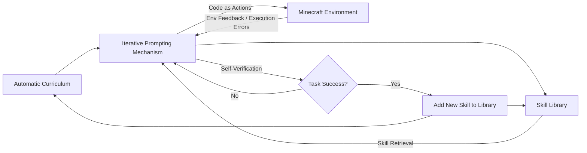
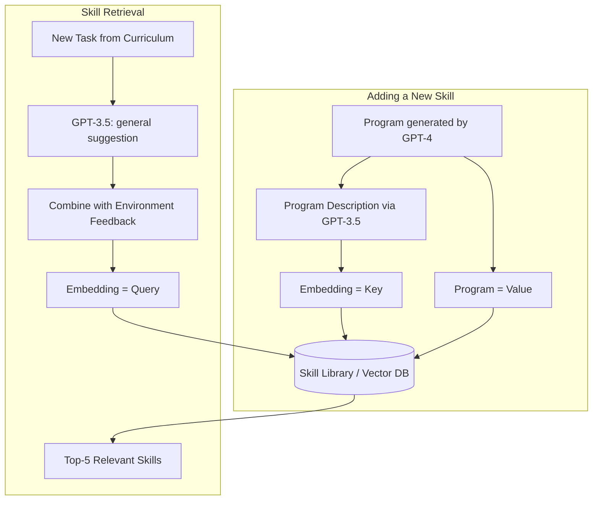
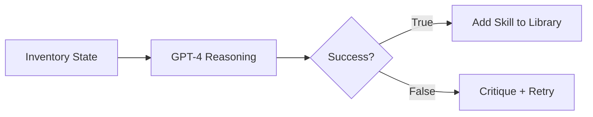
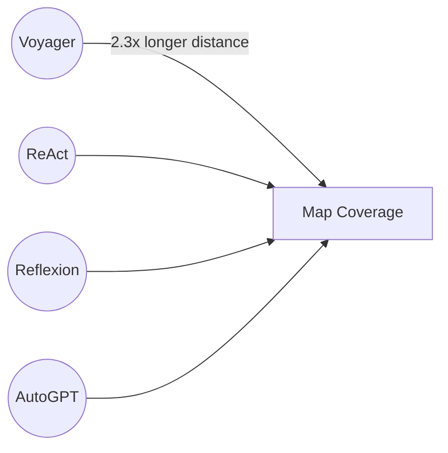
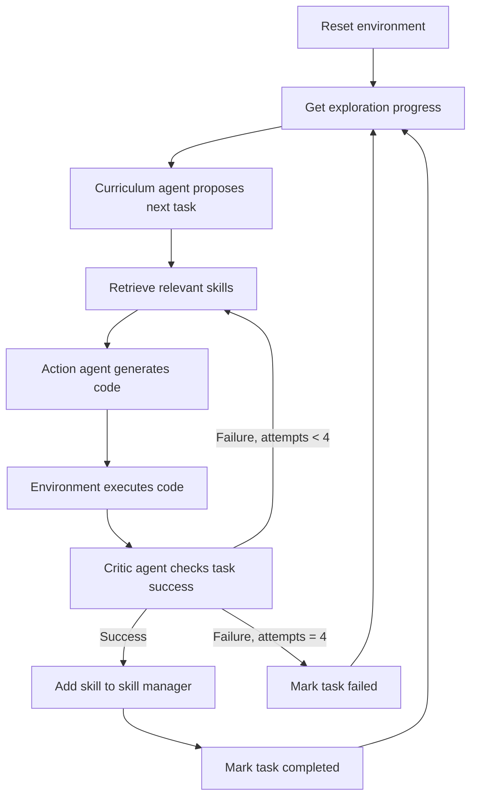
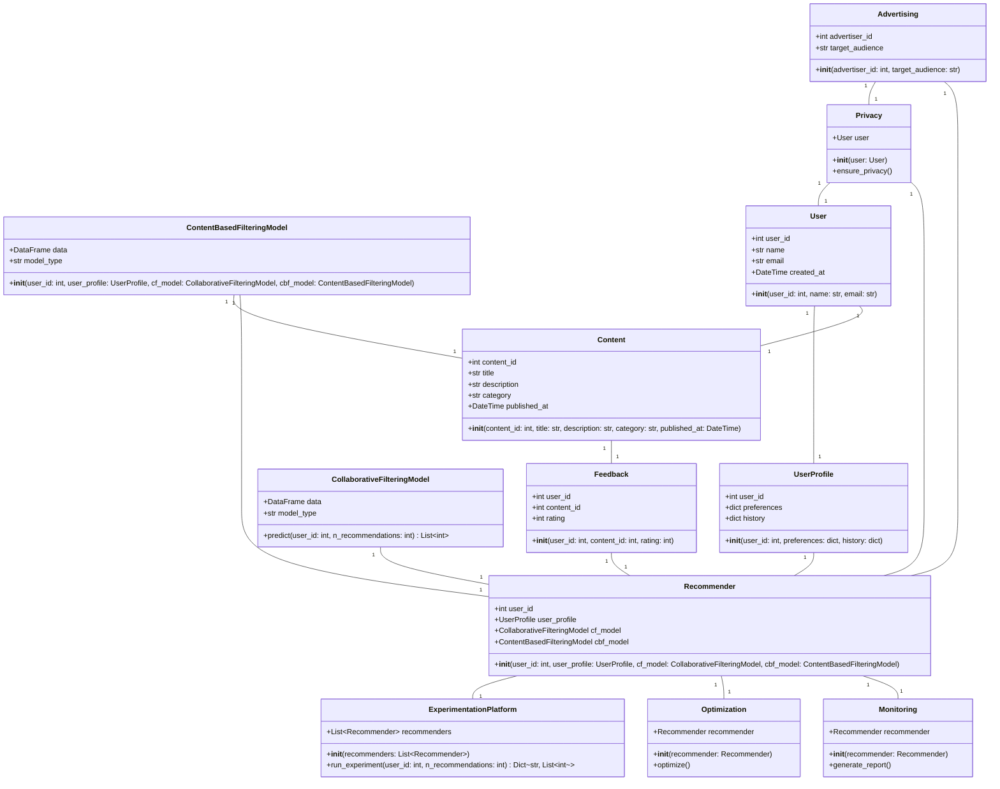
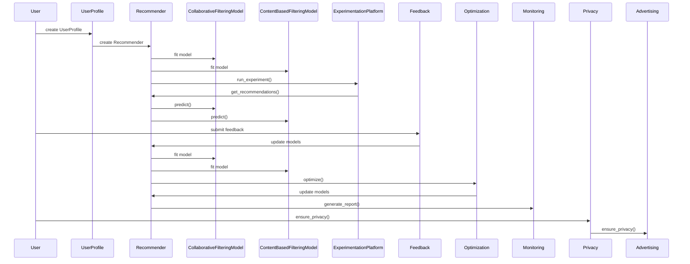

# VOYAGER: An Open-Ended Embodied Agent with Large Language Models

**Authors:** Guanzhi Wang, Yuqi Xie, Yunfan Jiang, Ajay Mandlekar, Chaowei Xiao, Yuke Zhu, Linxi "Jim" Fan, Anima Anandkumar

**Affiliations:** NVIDIA, Caltech, UT Austin, Stanford, UW Madison

**Project page:** https://voyager.minedojo.org

## 📌 Abstract

> We introduce **VOYAGER**, the first LLM-powered embodied lifelong learning agent in Minecraft that continuously explores the world, acquires diverse skills, and makes novel discoveries without human intervention.

VOYAGER consists of three key components:

1. An **automatic curriculum** that maximizes exploration
2. An **ever-growing skill library** of executable code for storing and retrieving complex behaviors
3. A new **iterative prompting mechanism** that incorporates environment feedback, execution errors, and self-verification for program improvement

- Interacts with **GPT-4** via blackbox queries — no model fine-tuning required
- Skills are temporally extended, interpretable, and compositional, compounding the agent's abilities and alleviating catastrophic forgetting

**📊 Results highlights:**
- 3.3× more unique items discovered
- 2.3× longer distances traveled
- Up to 15.3× faster unlocking of tech tree milestones vs. prior SOTA
- Learned skill library transfers to solve novel tasks in a new world from scratch, where other techniques struggle to generalize

🖼️ **Figure 1:** Line chart showing "Number of Distinct Items" (y-axis, 0–65) vs. "Number of Prompting Iterations" (x-axis, 0–150+) for Voyager (Ours), Voyager w/o Skill Library, ReAct, Reflexion, and AutoGPT. Voyager's curve rises well above all baselines, passing tech-tree milestones (Wooden → Stone → Iron → Diamond Tool) far earlier than the others, which plateau at much lower item counts.

---

## 1. Introduction

Building generally capable embodied agents that continuously explore, plan, and develop new skills in open-ended worlds is a grand challenge for AI.

- Classical **reinforcement learning** and **imitation learning** approaches operate on primitive actions, making systematic exploration, interpretability, and generalization difficult.
- Recent **LLM-based agents** leverage pretrained world knowledge to generate action plans/policies, applied to embodied tasks (games, robotics) and non-embodied NLP tasks.
- ⚠️ **Limitation:** these agents are not *lifelong learners* — they can't progressively acquire, update, accumulate, and transfer knowledge over extended time spans.

### Why Minecraft?

Minecraft has no fixed storyline or predefined end goal — it offers a vast, procedurally generated 3D world with a tech tree to unlock through gathered resources.

An effective lifelong learning agent, like a human player, should be able to:

1. **Propose suitable tasks** based on current skill level and world state (e.g., harvest sand/cactus before iron if in a desert)
2. **Refine skills** from environmental feedback and **commit mastered skills to memory** for reuse in similar situations (e.g., fighting zombies ≈ fighting spiders)
3. **Continually explore** the world and seek new tasks in a self-driven manner

### 🔬 The VOYAGER Approach

VOYAGER is introduced as the first LLM-powered embodied lifelong learning agent that drives exploration, masters skills, and makes discoveries without human intervention in Minecraft — via three modules:



- Uses **code as the action space** instead of low-level motor commands, since programs naturally represent temporally extended and compositional actions.
- Interacts with a blackbox LLM (GPT-4) purely through prompting and in-context learning — no gradient-based training/finetuning needed.
- The **automatic curriculum** proposes progressively harder tasks based on exploration progress and agent state, functioning as an in-context form of *novelty search* toward the goal "discover as many diverse things as possible."
- The **skill library** incrementally stores action programs that successfully solved tasks.

### ⚠️ Challenge: LLMs struggle to produce correct code in one shot

To address this, the **iterative prompting mechanism**:

1. Executes the generated program to obtain observations (inventory, nearby creatures) and error traces from the interpreter
2. Incorporates that feedback into GPT-4's prompt for another round of refinement
3. Repeats until a **self-verification module** confirms task completion — then the program is committed to the skill library (e.g., `craftStoneShovel()`, `combatZombieWithSword()`) and the curriculum is queried for the next milestone

### 📊 Empirical Results

VOYAGER was evaluated against ReAct, Reflexion, and AutoGPT in **MineDojo** (an open-source Minecraft AI framework):

| Metric | Improvement over prior SOTA |
|---|---|
| Unique items obtained | 3.3× more |
| Tech tree milestones unlocked | up to 15.3× faster |
| Distance traveled | 2.3× longer |

VOYAGER also transfers its learned skill library to solve novel tasks from scratch in a new Minecraft world, while other methods struggle to generalize.

---

## 2. Method

VOYAGER consists of three novel components:

1. **Automatic Curriculum** (§2.1) — suggests objectives for open-ended exploration
2. **Skill Library** (§2.2) — develops increasingly complex behaviors
3. **Iterative Prompting Mechanism** (§2.3) — generates executable code for embodied control

### 2.1 Automatic Curriculum

An automatic curriculum offers benefits for open-ended exploration: a challenging-but-manageable learning process, curiosity-driven intrinsic motivation, and development of general, flexible problem-solving strategies.

- GPT-4 is prompted to provide a steady stream of new tasks/challenges.
- The curriculum unfolds **bottom-up**, adapting to exploration progress and agent state.
- As VOYAGER tackles harder self-driven goals, it naturally learns varied skills (e.g., "mining a diamond").

🖼️ **Figure 3:** Five example curriculum steps, each showing agent state (inventory, biome, nearby entities, health/hunger, time, equipment) fed to GPT-4, which produces a **Reasoning** string and a resulting **Task**. Examples: craft a stone pickaxe (given wooden pickaxe + stone), catch a fish (near river with a fishing rod), kill a pig (hunger at 0, pigs nearby), smelt raw iron (have furnace + raw iron + coal), kill a zombie (nighttime, zombie nearby, sword + shield equipped).

**Input prompt to GPT-4 consists of:**

1. **Directives encouraging diverse behaviors and constraints** — e.g., *"My ultimate goal is to discover as many diverse things as possible … The next task should not be too hard since I may not have the necessary resources or have learned enough skills to complete it yet."*
2. **The agent's current state** — inventory, equipment, nearby blocks/entities, biome, time, health/hunger bars, position
3. **Previously completed and failed tasks** — reflects exploration progress and capability frontier
4. **Additional context** — GPT-3.5 self-asks and self-answers questions based on current state/progress (GPT-3.5 used instead of GPT-4 for standard NLP sub-tasks for budget reasons)

### 2.2 Skill Library

Since the curriculum proposes increasingly complex tasks, a skill library is needed as a basis for learning and evolution. Each skill is represented as **executable code** scaffolding temporally extended actions for a specific task, inspired by the generality, interpretability, and universality of programs.



**Input prompt to GPT-4 for code generation includes:**

1. **Guidelines for code generation** — e.g., *"Your function will be reused for building more complex functions. Therefore, you should make it generic and reusable."*
2. **Control primitive APIs** and **relevant skills retrieved** from the skill library (crucial for in-context learning)
3. **Generated code from the last round, environment feedback, execution errors, and critique** — enabling self-improvement
4. **The agent's current state** — inventory, equipment, nearby blocks/entities, biome, time, health/hunger bars, position
5. **Chain-of-thought prompting** — reasoning before code generation

- New skills are refined iteratively (§2.3), added to the library, and indexed by the embedding of their description.
- Retrieval queries the library using embeddings of self-generated task plans + environment feedback, returning the top-5 relevant skills.
- Continuous expansion/refinement of the library lets VOYAGER learn, adapt, and excel across a wide task spectrum.

### 2.3 Iterative Prompting Mechanism

Three types of feedback drive self-improvement:

1. **🌍 Environment feedback** — illustrates intermediate execution progress, e.g., *"I cannot make an iron chestplate because I need: 7 more iron ingots."* Generated via `bot.chat()` inside control primitive APIs; GPT-4 is prompted to use this function too during code generation.
2. **⚠️ Execution errors** — from the program interpreter, revealing invalid operations or syntax errors, useful for bug fixing.
3. **✅ Self-verification for task success** — rather than hand-coding success checkers per task, a separate GPT-4 agent acts as a **critic**: given VOYAGER's current state and the task, it judges success/failure and, on failure, provides a critique suggesting how to complete the task. This is more comprehensive than prior self-reflection methods since it both checks success *and* reflects on mistakes.

🖼️ **Figure 5:** Two code-diff examples.
- **Left (Environment feedback):** GPT-4 revises `craftStoneShovelWithTable()` after learning it needs 2 more planks before crafting sticks — adds a check for stick count and mines/crafts extra planks first.
- **Right (Execution error):** GPT-4 corrects a failed `craftAcaciaAxe()` (no such item as "acacia_axe" in Minecraft) by rewriting it as `craftWoodenAxe()` using wooden planks instead.

Each round of code generation executes the program, gathers environment feedback + execution errors, and feeds them back into GPT-4's prompt for refinement — repeating until self-verification validates task completion.


## 🔬 Self-Verification Examples

VOYAGER uses GPT-4 to verify whether a task was completed, based on inventory state changes and reasoning about what those changes imply.



**Example verifications:**

| Task | Inventory Evidence | Result | Critique |
|---|---|---|---|
| Mine 5 coal ores | `coal: 5` | ✅ True | — |
| Craft a spyglass | `copper_ingot: 3`, no amethyst shard | ❌ False | Find and mine an amethyst shard underground |
| Kill 3 sheep | `white_wool: 2`, `mutton: 6` (implies 2 sheep killed) | ❌ False | Find and kill one more sheep |
| Kill 1 zombie | `rotten_flesh: 1` | ✅ True | — |

> 📌 If the agent gets stuck after **4 rounds** of code generation, the automatic curriculum is queried for a different task instead. This iterative prompting loop drives continuous skill acquisition without human intervention.

---

## 🔬 3. Experiments

### 3.1 Experimental Setup

- **Text completion:** `gpt-4-0314` and `gpt-3.5-turbo-0301`
- **Text embedding:** `text-embedding-ada-002`
- **Temperature:** 0 for all components, except the automatic curriculum (temperature = 0.1, to encourage task diversity)
- **Simulation environment:** built on **MineDojo**, using **Mineflayer** JavaScript APIs for motor control

### 3.2 Baselines

No out-of-the-box LLM-based Minecraft agents exist, so baselines were adapted from NLP-only agent methods:

- **ReAct** — chain-of-thought prompting; generates reasoning traces + action plans, given environment feedback and agent state as observations.
- **Reflexion** — ReAct + self-reflection, using execution errors and the self-verification module for more intuitive future actions.
- **AutoGPT** — decomposes a high-level goal into subgoals, executed in a ReAct-style loop (re-implemented with GPT-4). Lacks VOYAGER's skill library, self-verification, and automatic curriculum.

> ⚠️ **Note:** Prior pixel-input/low-level-control Minecraft agents are *not* directly compared, since VOYAGER relies on the high-level Mineflayer API rather than solving 3D perception/sensorimotor control. VOYAGER is considered orthogonal to — and combinable with — gradient-based approaches like VPT, as long as the controller exposes a code API.

---

## 📊 3.3 Evaluation Results

Evaluated across: exploration performance, tech tree mastery, map coverage, and zero-shot generalization.

### Significantly Better Exploration
- VOYAGER discovers **63 unique items** within 160 prompting iterations — **3.3×** more than baselines.
- AutoGPT lags considerably; ReAct and Reflexion struggle due to the abstract, curriculum-less nature of open-ended exploration.

### Consistent Tech Tree Mastery

**Table 1 — Tech tree mastery** (iterations averaged over 3 trials; fractions = successful trials out of 3; N/A = fails within 160 iterations)

| Method | Wooden Tool | Stone Tool | Iron Tool | Diamond Tool |
|---|---|---|---|---|
| ReAct | N/A (0/3) | N/A (0/3) | N/A (0/3) | N/A (0/3) |
| Reflexion | N/A (0/3) | N/A (0/3) | N/A (0/3) | N/A (0/3) |
| AutoGPT | 92 ± 72 (3/3) | 94 ± 72 (3/3) | 135 ± 103 (3/3) | N/A (0/3) |
| VOYAGER w/o Skill Library | **7 ± 2** (3/3) | **9 ± 4** (3/3) | 29 ± 11 (3/3) | N/A (0/3) |
| **VOYAGER (Ours)** | 6 ± 2 (3/3) | 11 ± 2 (3/3) | **21 ± 7** (3/3) | **102 (1/3)** |

- VOYAGER unlocks: wooden **15.3× faster**, stone **8.5× faster**, iron **6.4× faster** than baselines.
- VOYAGER is the **only** method to reach the diamond tool level.

### Extensive Map Traversal



🖼️ *Figure 7: Bird's-eye view maps showing VOYAGER's traversal circle far exceeding ReAct, Reflexion, and AutoGPT — VOYAGER covers 2.3× longer distances across diverse terrain, while baselines stay confined to local areas.*

---

## 📊 Zero-Shot Generalization to Unseen Tasks

Test setup: clear inventory → reset to a new world → attempt unseen tasks. Both VOYAGER and AutoGPT use GPT-4 to decompose tasks into subgoals.

**Table 2 — Zero-shot generalization** (max 50 iterations; fractions = successful trials out of 3)

| Method | Diamond Pickaxe | Golden Sword | Lava Bucket | Compass |
|---|---|---|---|---|
| ReAct | N/A (0/3) | N/A (0/3) | N/A (0/3) | N/A (0/3) |
| Reflexion | N/A (0/3) | N/A (0/3) | N/A (0/3) | N/A (0/3) |
| AutoGPT | N/A (0/3) | N/A (0/3) | N/A (0/3) | N/A (0/3) |
| AutoGPT w/ Our Skill Library | 39 (1/3) | 30 (1/3) | N/A (0/3) | 30 (2/3) |
| VOYAGER w/o Skill Library | 36 (2/3) | 30 ± 9 (3/3) | 27 ± 9 (3/3) | 26 ± 3 (3/3) |
| **VOYAGER (Ours)** | **19 ± 3 (3/3)** | **18 ± 7 (3/3)** | **21 ± 5 (3/3)** | **18 ± 2 (3/3)** |

🖼️ *Figure 8: Progress curves (subgoal step vs. prompting iteration) for "Craft a Golden Sword" and "Collect a Lava Bucket," comparing Voyager, Voyager w/o Skill Library, AutoGPT, and AutoGPT w/ Our Skill Library. Voyager reaches the final subgoal fastest in both cases; ReAct/Reflexion omitted since they make no meaningful progress.*

> 📌 **Key insight:** VOYAGER solves all four unseen tasks consistently, while baselines solve none within 50 iterations. Notably, the skill library built during lifelong learning *also* boosts AutoGPT's performance — showing it acts as a **plug-and-play asset** transferable across methods.

---

## 🔬 3.4 Ablation Studies

Six design choices ablated: automatic curriculum, skill library, environment feedback, execution errors, self-verification, and GPT-4 (vs. GPT-3.5) for code generation.

🖼️ *Figure 9 (left): Ablation curves for automatic curriculum, skill library, and GPT-4 — comparing Ours, w/o Skill Library, GPT-3.5, Manual Curriculum, and Random Curriculum against number of distinct items discovered over prompting iterations.*

🖼️ *Figure 9 (right): Ablation curves for the iterative prompting mechanism — comparing Ours, w/o Environment Feedback, w/o Execution Error, and w/o Self-Verification.*

Key findings:

- **Automatic curriculum is crucial.** Replacing it with a random curriculum drops discovered items by **93%**, since attempting tasks out of order can make them too hard. A manually designed curriculum needs deep Minecraft expertise and ignores the agent's live situation, so it underperforms the automatic version.
- **Skill library prevents plateauing.** Without it, VOYAGER's exploration tends to plateau in later stages — the library lets new skills build compositionally on older ones.
- **Self-verification is the single most important feedback type.** Removing it causes a **73% drop** in discovered items; it's the critical mechanism for deciding whether to advance to a new task or retry a failed one.
- **GPT-4 vastly outperforms GPT-3.5** for code generation, yielding **5.7×** more unique items discovered — consistent with other literature on GPT-4's coding capability jump.

---

## 🖼️ 3.5 Multimodal Feedback from Humans

Since the GPT-4 API used was text-only at the time of writing, VOYAGER lacks native visual perception. However, it can be augmented with human-provided multimodal feedback to build complex 3D structures (e.g., a Nether Portal and a house).

🖼️ *Figure 10: Sequential build progress photos for "Build Nether Portal" and "Build House," shown left-to-right as human feedback incorporates.*

Two integration modes:

1. **Human as critic** *(≈ self-verification module)* — humans give visual critique so VOYAGER can revise its code; needed to correct spatial errors VOYAGER can't perceive directly.
2. **Human as curriculum** *(≈ automatic curriculum module)* — humans decompose a complex build task into smaller steps, guiding incremental completion of sophisticated 3D constructions.

---

## ⚠️ 4. Limitations and Future Work

- **Cost:** The GPT-4 API is **15× more expensive** than GPT-3.5. Still, VOYAGER needs GPT-4's code-generation quality, which GPT-3.5 and open-source LLMs can't yet match.
- **Inaccuracies:** The agent can still get stuck and fail to generate correct skills despite iterative prompting. The curriculum can reattempt such tasks later. Self-verification itself can occasionally fail — e.g., not recognizing spider string as a success signal for defeating a spider.
- **Hallucinations:**
  - The curriculum sometimes proposes unachievable tasks (e.g., a nonexistent "copper sword" or "copper chestplate").
  - Code generation hallucinations occur too — e.g., GPT-4 may try to use cobblestone as fuel (invalid in-game), or call undefined API functions, causing execution errors.
- Future improvements in GPT models and open-source LLM fine-tuning are expected to address these issues.

---

## 📚 5. Related Work

### Decision-Making Agents in Minecraft

Built on benchmarks like MineDojo, Minecraft learning algorithms split into two categories:

1. **Low-level controllers** — hierarchical RL from human demonstrations; curriculum design based on success rates (limited to curated items); MineDojo and VPT use YouTube pre-training; DreamerV3 learns a world model to explore and collect diamonds.
2. **High-level planners** — few-shot prompting with Codex to generate executable policies (requires human interaction); recent LLM-as-planner works decompose tasks into subgoals following Minecraft recipes, but lack full exploration flexibility.

> 📌 VOYAGER also uses an LLM (GPT-4) as high-level planner with Mineflayer as low-level controller, but uniquely adds a **bottom-up, curiosity-driven automatic curriculum** enabling open-ended exploration — unlike prior recipe-following approaches.

### Large Language Models for Agent Planning

Two groups of related efforts:

1. **LLMs for robot learning** — generating subgoals for robot planning; Inner Monologue incorporates environment feedback; Code as Policies and ProgPrompt generate executable robot policies directly; VIMA and PaLM-E fine-tune LLMs for multimodal prompts.
2. **LLMs for text agents** — ReAct (chain-of-thought reasoning + actions); Reflexion (ReAct + self-reflection); AutoGPT (subgoal curriculum + ReAct loops); DERA (task as dialogue between two GPT-4 agents); Generative Agents (ChatGPT-based memory storage/retrieval for simulating human behavior, but non-executable actions); SPRING (concurrent work extracting game mechanics from manuals via GPT-4, using a DAG of questions to predict next actions).

> 📌 All these methods lack a **skill library** for building increasingly complex behaviors — a key differentiator underlying VOYAGER's lifelong-learning success.

### Code Generation with Execution

Code generation remains a long-standing NLP challenge, with various works leveraging execution results/feedback to improve program synthesis. Execution-guided approaches leverage intermediate execution outcomes to guide program synthesis, while other work uses majority voting over execution results to select candidates. LEVER trains a verifier to distinguish and reject incorrect programs based on execution outcomes, and CLAIRIFY generates code for chemistry-experiment planning with a rule-based verifier providing iterative error feedback. VOYAGER differs from these by combining environment feedback, execution errors, and self-verification of task success into one iterative prompting loop for embodied control.

## 6. Conclusion

> 📌 **Key Point:** VOYAGER is the first LLM-powered embodied lifelong learning agent.

It uses GPT-4 to continuously explore the world, build increasingly sophisticated skills, and make new discoveries without human intervention. VOYAGER shows superior performance in:

- Discovering novel items
- Unlocking the Minecraft tech tree
- Traversing diverse terrains
- Applying its learned skill library to unseen tasks in a newly instantiated world

VOYAGER is presented as a starting point for building powerful generalist agents without fine-tuning model parameters.

## 7. ⚠️ Broader Impacts

The research takes place within Minecraft, described as a safe and harmless 3D video game environment. While VOYAGER is intended to generalize to other domains such as robotics, applying it to physical robots would require additional human-implemented safety constraints to ensure responsible and secure deployment.

## 8. Acknowledgements

The authors thank a number of colleagues and friends for feedback and discussion. The work was done during Guanzhi Wang's internship at NVIDIA, with Wang supported by the Kortschak Fellowship in Computing and Mathematical Sciences at Caltech.

## References

1. Kolve et al. — *AI2-THOR: An Interactive 3D Environment for Visual AI* (2017)
2. Savva et al. — *Habitat: A Platform for Embodied AI Research*, ICCV 2019
3. Zhu et al. — *robosuite: A Modular Simulation Framework and Benchmark for Robot Learning* (2020)
4. Xia et al. — *Interactive Gibson Benchmark (iGibson 0.5)* (2019)
5. Shen et al. — *iGibson 1.0: A Simulation Environment for Interactive Tasks in Large Realistic Scenes* (2020)
6. Kober, Bagnell, Peters — *Reinforcement Learning in Robotics: A Survey*, IJRR 32(11) (2013)
7. Arulkumaran et al. — *Deep Reinforcement Learning: A Brief Survey*, IEEE Signal Processing Magazine (2017)
8. Baker et al. — *Video PreTraining (VPT): Learning to Act by Watching Unlabeled Online Videos* (2022)
9. DeepMind Interactive Agents Team — *Creating Multimodal Interactive Agents with Imitation and Self-Supervised Learning* (2021)
10. Vinyals et al. — *AlphaStar: Mastering the Real-Time Strategy Game StarCraft II*, DeepMind Blog (2019)
11. Ecoffet et al. — *Go-Explore: A New Approach for Hard-Exploration Problems* (2019)
12. Huizinga & Clune — *Evolving Multimodal Robot Behavior via Many Stepping Stones*, Evolutionary Computation 30(2) (2022)
13. Wang et al. — *Enhanced POET*, ICML 2020
14. Kanitscheider et al. — *Multi-Task Curriculum Learning in a Complex, Visual, Hard-Exploration Domain: Minecraft* (2021)
15. Dennis et al. — *Emergent Complexity and Zero-Shot Transfer via Unsupervised Environment Design*, NeurIPS 2020
16. Liang et al. — *Code as Policies: Language Model Programs for Embodied Control* (2022)
17. Sun, Wu, Lim — *Program Guided Agent*, ICLR 2020
18. Zhao et al. — *PROTO: Program-Guided Transformer for Program-Guided Tasks*, NeurIPS 2021
19. Jiang et al. — *VIMA: General Robot Manipulation with Multimodal Prompts* (2022)
20. Shridhar, Manuelli, Fox — *CLIPort: What and Where Pathways for Robotic Manipulation* (2021)
21. Fan et al. — *SECANT: Self-Expert Cloning for Zero-Shot Generalization of Visual Policies*, ICML 2021
22. Singh et al. — *ProgPrompt: Generating Situated Robot Task Plans Using LLMs* (2022)
23. Fan et al. — *MineDojo: Building Open-Ended Embodied Agents with Internet-Scale Knowledge* (2022)
24. Zeng et al. — *Socratic Models: Composing Zero-Shot Multimodal Reasoning with Language* (2022)
25. Ahn et al. — *Do As I Can, Not As I Say: Grounding Language in Robotic Affordances* (2022)
26. Huang et al. — *Inner Monologue: Embodied Reasoning through Planning with Language Models* (2022)
27. Huang, Abbeel, Pathak, Mordatch — *Language Models as Zero-Shot Planners*, ICML 2022
28. *Auto-GPT: An Experimental Open-Source Attempt to Make GPT-4 Fully Autonomous* (2023)
29. Yao et al. — *ReAct: Synergizing Reasoning and Acting in Language Models* (2022)
30. Shinn, Labash, Gopinath — *Reflexion: An Autonomous Agent with Dynamic Memory and Self-Reflection* (2023)
31. Parisi et al. — *Continual Lifelong Learning with Neural Networks: A Review*, Neural Networks 113 (2019)
32. Wang et al. — *A Comprehensive Survey of Continual Learning* (2023)
33. Mnih et al. — *Playing Atari with Deep Reinforcement Learning* (2013)
34. OpenAI et al. — *Dota 2 with Large Scale Deep Reinforcement Learning* (2019)
35. OpenAI — *GPT-4 Technical Report* (2023)
36. Wei et al. — *Emergent Abilities of Large Language Models* (2022)
37. Brown et al. — *Language Models are Few-Shot Learners*, NeurIPS 2020
38. Raffel et al. — *Exploring the Limits of Transfer Learning with a Unified Text-to-Text Transformer*, JMLR 21 (2020)
39. Eysenbach et al. — *Diversity is All You Need: Learning Skills without a Reward Function*, ICLR 2019
40. Conti et al. — *Improving Exploration in Evolution Strategies via a Population of Novelty-Seeking Agents*, NeurIPS 2018
41. Chen et al. — *Evaluating Large Language Models Trained on Code* (2021)
42. Wang, Lehman, Clune, Stanley — *Paired Open-Ended Trailblazer (POET)* (2019)
43. Portelas et al. — *Automatic Curriculum Learning for Deep RL: A Short Survey*, IJCAI 2020
44. Forestier, Portelas, Mollard, Oudeyer — *Intrinsically Motivated Goal Exploration Processes with Automatic Curriculum Learning*, JMLR 23(1) (2022)
45. Ellis et al. — *DreamCoder: Growing Generalizable, Interpretable Knowledge with Wake-Sleep Bayesian Program Learning* (2020)
46. Wei et al. — *Chain-of-Thought Prompting Elicits Reasoning in Large Language Models* (2022)
47. Mnih et al. — *Asynchronous Methods for Deep Reinforcement Learning*, ICML 2016
48. Schulman et al. — *Proximal Policy Optimization Algorithms* (2017)
49. Lillicrap et al. — *Continuous Control with Deep Reinforcement Learning*, ICLR 2016
50. *Introducing ChatGPT* (2022)
51. *New and Improved Embedding Model* (2022)
52. PrismarineJS — *Mineflayer: Create Minecraft Bots with a Powerful, Stable, High-Level JavaScript API* (2013)
53. Nottingham et al. — *Do Embodied Agents Dream of Pixelated Sheep?* (2023)
54. Cai et al. — *Open-World Multi-Task Control through Goal-Aware Representation Learning and Adaptive Horizon Prediction* (2023)
55. Wang et al. — *Describe, Explain, Plan and Select: Interactive Planning with LLMs Enables Open-World Multi-Task Agents* (2023)
56. Bubeck et al. — *Sparks of Artificial General Intelligence: Early Experiments with GPT-4* (2023)
57. Liu et al. — *Summary of ChatGPT/GPT-4 Research and Perspective towards the Future of Large Language Models* (2023)
58. Liu et al. — *Prismer: A Vision-Language Model with an Ensemble of Experts* (2023)


## 📚 References (continued)

- [59] Driess et al. — *PaLM-E: An Embodied Multimodal Language Model*, arXiv:2303.03378, 2023.
- [60] Touvron et al. — *LLaMA: Open and Efficient Foundation Language Models*, arXiv:2302.13971, 2023.
- [61] Guss et al. — *MineRL: A Large-Scale Dataset of Minecraft Demonstrations*, IJCAI 2019, pp. 2442–2448.
- [62] Guss et al. — *The MineRL 2019 Competition on Sample Efficient Reinforcement Learning Using Human Priors*, arXiv:1904.10079, 2019.
- [63] Guss et al. — *The MineRL 2020 Competition on Sample Efficient Reinforcement Learning Using Human Priors*, arXiv:2101.11071, 2021.
- [64] Kanervisto et al. — *MineRL Diamond 2021 Competition: Overview, Results, and Lessons Learned*, arXiv:2202.10583, 2022.
- [65] Johnson et al. — *The Malmo Platform for Artificial Intelligence Experimentation*, IJCAI 2016, pp. 4246–4247.
- [66] Lin et al. — *Juewu-MC: Playing Minecraft with Sample-Efficient Hierarchical Reinforcement Learning*, arXiv:2112.04907, 2021.
- [67] Mao et al. — *SEIHAI: A Sample-Efficient Hierarchical AI for the MineRL Competition*, arXiv:2111.08857, 2021.
- [68] Skrynnik et al. — *Hierarchical Deep Q-Network from Imperfect Demonstrations in Minecraft*, Cogn. Syst. Res., 65:74–78, 2021.
- [69] Hafner et al. — *Mastering Diverse Domains through World Models*, arXiv:2301.04104, 2023.
- [70] Volum et al. — *Craft an Iron Sword: Dynamically Generating Interactive Game Characters by Prompting LLMs Tuned on Code*, Wordplay Workshop 2022, pp. 25–43.
- [71] Yuan et al. — *Plan4MC: Skill Reinforcement Learning and Planning for Open-World Minecraft Tasks*, arXiv:2303.16563, 2023.
- [72] Bommasani et al. — *On the Opportunities and Risks of Foundation Models*, arXiv:2108.07258, 2021.
- [73] Chowdhery et al. — *PaLM: Scaling Language Modeling with Pathways*, arXiv:2204.02311, 2022.
- [74] Chung et al. — *Scaling Instruction-Finetuned Language Models*, arXiv:2210.11416, 2022.
- [75] Duan et al. — *A Survey of Embodied AI: From Simulators to Research Tasks*, IEEE Trans. Emerg. Top. Comput. Intell., 6(2):230–244, 2022.
- [76] Batra et al. — *Rearrangement: A Challenge for Embodied AI*, arXiv:2011.01975, 2020.
- [77] Ravichandar et al. — *Recent Advances in Robot Learning from Demonstration*, Annual Review of Control, Robotics, and Autonomous Systems, 3:297–330, 2020.
- [78] Collins et al. — *A Review of Physics Simulators for Robotic Applications*, IEEE Access, 9:51416–51431, 2021.
- [79] Min et al. — *FILM: Following Instructions in Language with Modular Methods*, ICLR 2021.
- [80] Blukis et al. — *A Persistent Spatial Semantic Representation for High-Level Natural Language Instruction Execution*, CoRL 2021.
- [81] Nair et al. — *DERA: Enhancing Large Language Model Completions with Dialog-Enabled Resolving Agents*, arXiv:2303.17071, 2023.
- [82] Park et al. — *Generative Agents: Interactive Simulacra of Human Behavior*, arXiv:2304.03442, 2023.
- [83] Wu et al. — *SPRING: GPT-4 Out-Performs RL Algorithms by Studying Papers and Reasoning*, arXiv:2305.15486, 2023.
- [84] Nijkamp et al. — *A Conversational Paradigm for Program Synthesis*, arXiv:2203.13474, 2022.
- [85] Le et al. — *CodeRL: Mastering Code Generation through Pretrained Models and Deep Reinforcement Learning*, arXiv:2207.01780, 2022.
- [86] Chen, Liu, Song — *Execution-Guided Neural Program Synthesis*, ICLR 2019.
- [87] Chen, Song, Tian — *Latent Execution for Neural Program Synthesis*, arXiv:2107.00101, 2021.
- [88] Ellis et al. — *Write, Execute, Assess: Program Synthesis with a REPL*, NeurIPS 2019, pp. 9165–9174.
- [89] Li et al. — *Competition-Level Code Generation with AlphaCode*, arXiv:2203.07814, 2022.
- [90] Cobbe et al. — *Training Verifiers to Solve Math Word Problems*, arXiv:2110.14168, 2021.
- [91] Ni et al. — *LEVER: Learning to Verify Language-to-Code Generation with Execution*, arXiv:2302.08468, 2023.
- [92] Skreta et al. — *Errors Are Useful Prompts: Instruction Guided Task Programming with Verifier-Assisted Iterative Prompting*, arXiv:2303.14100, 2023.

---

## 🔬 A. Method

### A.1 VOYAGER Algorithm

📌 High-level control loop coordinating the four agents (curriculum, action, critic, skill manager) against the environment.



```python
def voyager(
    environment,       # environment that uses code as action space
    curriculum_agent,  # curriculum agent for proposing the next task
    action_agent,       # action agent for code generation
    critic_agent,        # critic agent for self-verification
    skill_manager,        # skill manager for adding new skills and skill retrieval
):
    agent_state = environment.reset()
    while True:
        exploration_progress = curriculum_agent.get_exploration_progress(
            curriculum_agent.get_completed_tasks(),
            curriculum_agent.get_failed_tasks(),
        )
        task = curriculum_agent.propose_next_task(agent_state, exploration_progress)

        code = None
        environment_feedback = None
        execution_errors = None
        critique = None
        success = False

        # try at most 4 rounds before moving on to the next task
        for i in range(4):
            skills = skill_manager.retrieve_skills(task, environment_feedback)
            code = action_agent.generate_code(
                task, code, environment_feedback, execution_errors, critique, skills
            )
            agent_state, environment_feedback, execution_errors = environment.step(code)
            success, critique = critic_agent.check_task_success(task, agent_state)
            if success:
                break

        if success:
            skill_manager.add_skill(code)
            curriculum_agent.add_completed_task(task)
        else:
            curriculum_agent.add_failed_task(task)
```

### A.2 Prompting

> GPT-4 and GPT-3.5 expose three message roles used to structure the conversation:

| Role | Purpose |
|------|---------|
| **System** | High-level instruction guiding model behavior for the whole conversation; sets tone and objective |
| **User** | Detailed instruction guiding the assistant's next immediate response |
| **Assistant** | A response message generated by the model |

⚠️ To save tokens, VOYAGER does **not** use multi-round conversations — a system prompt and user prompt are concatenated to produce each agent's response.

### A.3 Automatic Curriculum

#### A.3.1 Components in the Prompt

The GPT-4 input prompt is composed of:

1. **Directives** — encourage diverse behavior and impose constraints so proposed tasks are achievable and verifiable.
2. **Agent's current state:**
   - **Inventory** — item/count dictionary, e.g. `{cobblestone: 4, furnace: 1, stone_pickaxe: 1, oak_planks: 7, dirt: 6, wooden_pickaxe: 1, crafting_table: 1, raw_iron: 4, coal: 1}`
   - **Equipment** — armor/weapons equipped
   - **Nearby blocks** — block names within 32-block radius (e.g. `dirt`, `water`, `spruce_planks`, `grass_block`, `dirt_path`, `sugar_cane`, `fern`)
   - **Other recently seen blocks** — blocks not currently nearby or in inventory
   - **Nearby entities** — entity names within 32-block radius (e.g. `pig`, `cat`, `villager`, `zombie`)
   - **Seen chests** — external containers; contents shown once opened, otherwise "Unknown"
   - **Biome** — e.g. `plains`, `flower_forest`, `meadow`, `river`, `beach`, `forest`, `snowy_slopes`, `frozen_peaks`, `old_growth_birch_forest`, `ocean`, `sunflower_plains`, `stony_shore`
   - **Time** — one of `sunrise`, `day`, `noon`, `sunset`, `night`, `midnight`
   - **Health and hunger bars** — max value 20
   - **Position** — 3D coordinate $(x, y, z)$
3. **Previously completed and failed tasks**
4. **Additional context** — see A.3.2
5. **Chain-of-thought prompting** — GPT-4 is asked to reason about current progress before suggesting the next task

#### A.3.2 Additional Context

🔬 GPT-3.5 self-asks questions to generate additional context. Each question is paired with a concept used to retrieve the most relevant document from a wiki knowledge base. The retrieved document is fed back to GPT-3.5 to self-answer the question.

> Using the wiki knowledge base is optional, since GPT-3.5 already has good Minecraft game-mechanics knowledge — but it helps when GPT-3.5 lacks pre-training in a specific domain.

#### A.3.3 Warm-up Schedule

📌 A warm-up schedule gradually incorporates the agent's state and additional context into the prompt, scaled by how many tasks the agent has completed — exposing the prompt to increasingly more information as exploration progresses.


## 📌 Example: Product Requirement Document Output

**Task list**
```python
[
    "main.py",
    "canvas.py",
    "tools.py",
    "color_picker.py",
    "file_manager.py"
]
```

**Shared Knowledge**
```python
"""
The 'Tkinter' library is used for creating the GUI of the application. It provides various widgets
like frames and canvases which are used in this project.
The 'Pillow' library is used for handling image files. It is used in the 'file_manager.py' for
saving and opening image files.
The 'main.py' file is the entry point of the application. It initializes all the other components
and starts the application loop.
"""
```

**Anything UNCLEAR**
> The project requirements and implementation approach are clear. However, we need to ensure that all team members are familiar with the Tkinter and Pillow libraries. If not, they may need some time to learn these libraries before starting the development.

### 🔧 Engineer Role

Given the provided file structure and function definitions, an Engineer agent requires only fundamental development skills to complete the development tasks. Due to the large number of files, only one auto-generated code file is presented here.

**Generated code (`color_picker.py`)**
```python
import tkinter as tk
from tkinter import colorchooser

class ColorPicker:
    def __init__(self, root: tk.Tk, color: str = 'black'):
        self.frame = tk.Frame(root)
        self.color = color

        self.color_button = tk.Button(self.frame, text='Color', command=self.select_color)
        self.color_button.pack(fill='x')

    def select_color(self):
        color = colorchooser.askcolor()[1]
        if color is not None:
            self.color = color

    def pack(self, **kwargs):
        self.frame.pack(**kwargs)

    def get_color(self):
        return self.color
```

### 🧪 QA Engineer Role

Upon receiving the code output from the Engineer, the QA Engineer generates unit test code and reviews it to identify and fix any bugs, ensuring high-quality software.

**Generated Unit tests (`test.py`)**
```python
import unittest
import tkinter as tk
# You might want to move the ColorPicker class to another file, let's say color_picker.py
# from color_picker import ColorPicker

class TestColorPicker(unittest.TestCase):

    def setUp(self):
        self.root = tk.Tk()
        self.cp = ColorPicker(self.root)

    def tearDown(self):
        # This is important to close the tk window after tests
        self.root.destroy()

    def test_initial_color(self):
        # Test the default color during initialization
        self.assertEqual(self.cp.get_color(), 'black')

    def test_set_and_get_color(self):
        # Test setting a new color and retrieving it
        new_color = '#ffffff'  # white color
        self.cp.color = new_color
        self.assertEqual(self.cp.get_color(), new_color)


if __name__ == '__main__':
    unittest.main()
```

**Output:** MetaGPT generates a functional application named **"Drawing App"**.

🖼️ Figure 10: Screenshot of the generated "Drawing App" — a Tkinter window with a blank canvas, Save/Open/Color buttons, and Pencil/Brush/Eraser tools, alongside a separate color-picker window showing a color wheel, brightness slider, and OK/Cancel buttons.

---

## C. Experiments

### C.1 Details of the SoftwareDev Dataset

- The **SoftwareDev dataset** includes **70 diverse software development tasks**.
- Table 8 (not shown in this chunk) displays names/prompts for 11 of these tasks.
- The **first seven tasks** listed are used in the main experiments of this paper.

### C.2 Additional Results

#### 📊 Quantitative Results of MetaGPT

- MetaGPT achieves an **average score of 3.9**, surpassing ChatDev's score of **2.1**.
- General intelligent algorithms (AutoGPT, LangChain, AgentVerse) all score **1.0**, failing to generate executable code.
  - Generated code from these baselines is often short, lacks comprehensive logic, and fails to handle cross-file dependencies correctly.
- **Key gap in baselines:** AutoGPT, Langchain, and AgentVerse show robust general problem-solving but lack systematic requirement deconstruction — essential for complex system development.
- **MetaGPT's advantage:** simplifies transforming abstract requirements into detailed class/function designs via specialized division of labor and SOPs workflow.
- Compared to ChatDev, MetaGPT's **structured messaging and feedback mechanisms** reduce communication information loss and improve code execution.

**Table 4 — Executability Comparison**
*(Scale: 1 = complete failure, 2 = executable code, 3 = largely satisfies expected workflow, 4 = perfect match with expectations)*

| Task | AutoGPT | LangChain | AgentVerse | ChatDev | MetaGPT |
|---|---|---|---|---|---|
| Flappy bird | 1 | 1 | 1 | 2 | 3 |
| Tank battle game | 1 | 1 | 1 | 2 | 4 |
| 2048 game | 1 | 1 | 1 | 1 | 4 |
| Snake game | 1 | 1 | 1 | 3 | 4 |
| Brick breaker game | 1 | 1 | 1 | 1 | 4 |
| Excel data process | 1 | 1 | 1 | 4 | 4 |
| CRUD manage | 1 | 1 | 1 | 2 | 4 |
| **Average score** | **1.0** | **1.0** | **1.0** | **2.1** | **3.9** |

#### 🔬 MetaGPT w/o Executable Feedback

- Table 9 (not shown in this chunk) presents performance of MetaGPT with **GPT-4 32K** on 11 SoftwareDev tasks, plus average across all 70 tasks.
- This version is the **basic version without the executable feedback mechanism**.

#### 🔬 MetaGPT with Different LLM Backends

- 5 SoftwareDev tasks were randomly selected to test **GPT-3.5** and **Deepseek Coder 33B** as backends.
- MetaGPT can complete tasks with these LLMs, but **GPT-4 yields superior performance**.

**Table 5 — Performance of MetaGPT Using Different LLM Backends**

| Model | Open source | Time (s) | # Lines | Executability | Revisions |
|---|---|---|---|---|---|
| MetaGPT (w/ GPT-3.5) | ✗ | 75.18 | 161.6 | 2.8 | 2.4 |
| MetaGPT (w/ GPT-4) | ✗ | 552.94 | 178.2 | 3.8 | 1.2 |
| MetaGPT (w/ Deepseek Coder 33B) | ✓ | 1186.20 | 120.2 | 1.4 | 2.6 |

#### 📌 Impact of Instruction Levels (High-level vs. Detailed Instructions)

**Question:** Does the level of detail in the initial human input significantly influence performance?

**Examples:**
1. **High-level prompt:** "Create a brick breaker game."
2. **Detailed prompt:** "Creating a brick breaker game. In a brick breaker game, the player typically controls a paddle at the bottom of the screen to bounce a ball towards a wall of bricks. The goal is to break all the bricks by hitting them with the ball."

5 tasks from SoftwareDev were selected, with detailed prompts constructed for comparison.

**Table 6 — Impact of Instruction Levels**
*(Executability scale: 1 = complete failure, 2 = runnable code, 3 = largely expected workflow, 4 = perfect match to expectations)*

| Model | # Word | Time (s) | Token usage | # Lines | Executability | Productivity | Reversions |
|---|---|---|---|---|---|---|---|
| High-level | 13.2 | 552.9 | 28384.2 | 178.2 | 3.8 | 163.8 | 1.2 |
| Detailed | 42.2 | 567.8 | 29657.0 | 257.0 | 4.0 | 118.0 | 1.6 |

> **Note:** $\text{Productivity} = \dfrac{\text{Token usage}}{\text{Total Code Lines}}$ — lower is better.

**Findings:**
- Detailed prompts lead to better software projects with **lower productivity ratios** due to clearer requirements and functions.
- Simple (high-level) inputs can still generate good-enough software using MetaGPT, with an executability rating of **3.8** — comparable to the detailed prompt scenario.

#### 🔬 GPT Variants on HumanEval Benchmark

- Baseline: GPT-4's **67% HumanEval score** (OpenAI, 2023).
- Experiments run **5 times** with `gpt-4-0613` and `gpt-3.5-turbo-0613` under three conditions:
  - **(A)** Direct OpenAI API call with the HumanEval prompt.
  - **(B)** OpenAI API call + regex parsing of code from the response.
  - **(C)** Additional system prompt added: *"You are an AI that only responds with Python code, NOT ENGLISH. You will be given a function signature and its docstring by the user. Write your full implementation (restate the function signature)."*
- **Finding:** GPT-4 is more sensitive to prompt design, code parsing, and post-processing on HumanEval. GPT-3.5-Turbo struggles to return correct completions without prompt engineering.

**Table 7 — Performance of GPT Models on HumanEval**
*(5 runs each)*

| Settings | Model | 1 | 2 | 3 | 4 | 5 | Avg. | Std. |
|---|---|---|---|---|---|---|---|---|
| A | gpt-4-0613 | 0.732 | 0.707 | 0.732 | 0.713 | 0.738 | 0.724 | 0.013 |
| A | gpt-3.5-turbo-0613 | 0.360 | 0.366 | 0.360 | 0.348 | 0.354 | 0.357 | 0.007 |
| B | gpt-4-0613 | 0.787 | 0.811 | 0.817 | 0.829 | 0.817 | 0.812 | 0.016 |
| B | gpt-3.5-turbo-0613 | 0.348 | 0.354 | 0.348 | 0.335 | 0.348 | 0.346 | 0.007 |
| C | gpt-4-0613 | 0.805 | 0.805 | 0.817 | 0.793 | 0.780 | 0.800 | 0.014 |
| C | gpt-3.5-turbo-0613 | 0.585 | 0.567 | 0.573 | 0.579 | 0.579 | 0.577 | 0.007 |

#### 🎨 Qualitative Results

- Figures 11 and 12 (not included in this chunk) illustrate the Architect agent's design of a complex **recommender system**, showing system interface design and program call flow.
- Program call flow is described as essential for creating sophisticated automated systems, emphasizing the importance of division of labor in an automated software framework.

---

## D. Limitation and Ethics Concerns

### D.1 ⚠️ Limitations

**System side:**
- Cannot fully cater to specific scenarios such as **UI and frontend**, since UI/multimodal agents/tools have not yet been incorporated.
- Despite generating the most code among comparable frameworks, it remains challenging to fulfill real-world applications' diverse and complex requirements.

**Human user side:**
- A key challenge is the ability to **interrupt the running process** of each agent, or set a starting checkpoint for each agent.

### D.2 Ethics Concerns

**Unemployment and Skill Obsolescence**
- MetaGPT enables more people to program using natural language, lowering the barrier to entry for engineers.
- Programming languages have historically evolved (punched cards → assembly → C → Java → Python → natural language), each step making humans more proficient and increasing demand for programming-related roles.
- Natural language programming may offer an easier learning curve, broadening accessibility.

**Transparency and Accountability**
- MetaGPT is open-source and facilitates interactive multi-agent communication via natural language.
- Humans can initiate, observe, and stop execution with full control.
- Real-time interpretation/operation is displayed on-screen and logged, ensuring transparency.
- Human engineers remain the users and are responsible for outcomes.

**Privacy and Data Security**
- MetaGPT operates **locally**, ensuring user data privacy/security, and does not collect user data.
- For third-party LLM interactions (e.g., OpenAI), users are encouraged to review the relevant privacy policies.
- An **open-source LLM backend option** is also provided.


🖼️ Figure 11: Class diagram for the "recommendation engine development" system, generated by the *architect* agent.



🖼️ Figure 12: Program call flow / sequence diagram for "recommendation engine development", generated by the *architect* agent.



## 📌 Deep-Seated Challenges

MetaGPT alleviates or solves several deep-seated challenges through its unique design choices.

### Use Context Efficiently

Two sub-challenges arise:

1. **Unfolding short natural language descriptions accurately** — eliminating ambiguity from terse task specs.
2. **Maintaining information validity in lengthy contexts** — enabling LLMs to concentrate on relevant data without distraction.

### Reduce Hallucinations

> Using LLMs to generate entire software programs faces **code hallucination** problems — including incomplete implementation of functions, missing dependencies, and potential undiscovered bugs, which may be more serious.

LLMs often struggle with software generation due to vague task definitions. Focusing on granular tasks — like requirement analysis and package selection — offers guided thinking that LLMs otherwise lack when solving broad, unstructured tasks.

## 📌 Information Overload

MetaGPT addresses "information overload" (the problem of receiving excessive or irrelevant information) via two mechanisms:

- **Global message pool** — streamlines communication and ensures efficiency.
- **Subscription mechanism** — filters out irrelevant contexts, enhancing the relevance and utility of information received by each agent.

⚠️ This design is particularly important in software design scenarios and standard operating procedures (SOPs), where effective communication between agents is essential.

## 📊 SoftwareDev Dataset — Example Tasks

Table 8 lists example tasks from the SoftwareDev dataset used for evaluation.

| Task ID | Task Name | Task Prompt |
|---|---|---|
| 0 | Snake game | Create a snake game. |
| 1 | Brick breaker game | Create a brick breaker game. |
| 2 | 2048 game | Create a 2048 game for the web. |
| 3 | Flappy bird game | Write p5.js code for Flappy Bird where you control a yellow bird continuously flying between a series of green pipes. The bird flaps every time you left click the mouse. If it falls to the ground or hits a pipe, you lose. This game goes on indefinitely until you lose; you get points the further you go. |
| 4 | Tank battle game | Create a tank battle game. |
| 5 | Excel data process | Write an excel data processing program based on streamlit and pandas. The screen first shows an excel file upload button. After the excel file is uploaded, use pandas to display its data content. The program is required to be concise, easy to maintain, and not over-designed. It uses streamlit for the web display, and pandas alone is sufficient for reading/displaying the excel file — no additional packages should be needed. |
| 6 | CRUD manage | Write a management program based on CRUD (add/delete/modify/query) processing of a customer business entity. Store name, birthday, age, sex, and phone. Data is stored in `client.db`, checking whether the customer table exists first. Querying and deleting are done by name. The program should be concise, easy to maintain, and not over-designed, realized through streamlit and sqlite only. |
| 7 | Music transcriber | Develop a program to transcribe sheet music into a digital format — providing error-free transcribed symbolized sheet music from audio through signal processing (pitch and time slicing), then training a neural net to run Onset Detected CWT transforming scalograms into chromagrams, decoded with a Recursive-Neural-Network-focused architecture. |
| 8 | Custom press releases | Create custom press releases: a Python script that extracts relevant company-news information from external sources (e.g. social media), tracks an update interval for recent changes, and generates press releases with customizable options, exporting to PDFs, NYTimes API JSONs, and media-format styling with interlinked fixed-length metadata. |
| 9 | Gomoku game | Implement a Gomoku game in Python, incorporating an AI opponent with varying difficulty levels. |
| 10 | Weather dashboard | Create a Python program to develop an interactive weather dashboard. |

## 📊 Additional Results — Pure MetaGPT (w/o Feedback) on SoftwareDev

Table 9 reports statistics for 10 randomly selected tasks plus the average (Avg.) across 70 tasks, covering code, documentation, and cost metrics, along with revision costs and code executability notes.

| ID | #Code Files | #Lines of Code | Lines/Code File | #Doc Files | #Lines of Doc | Lines/Doc File | Prompt Tokens | Completion Tokens | Time Cost (s) | Money Cost | Revision Issues | # Revisions |
|---|---|---|---|---|---|---|---|---|---|---|---|---|
| 0 | 5.00 | 196.00 | 39.20 | 3.00 | 210.00 | 70.00 | 24,087 | 6,157 | 582.04 | $1.09 | TypeError | 4 |
| 1 | 6.00 | 191.00 | 31.83 | 3.00 | 230.00 | 76.67 | 32,517 | 6,238 | 566.30 | $1.35 | TypeError | 4 |
| 2 | 3.00 | 198.00 | 66.00 | 3.00 | 235.00 | 78.33 | 21,934 | 6,316 | 553.11 | $1.04 | Missing `@app.route('/')` | 3 |
| 3 | 5.00 | 164.00 | 32.80 | 3.00 | 202.00 | 67.33 | 22,951 | 5,312 | 481.34 | $1.01 | PNG file missing; compile bug fixes | 2 |
| 4 | 6.00 | 203.00 | 33.83 | 3.00 | 210.00 | 70.00 | 30,087 | 6,567 | 599.58 | $1.30 | PNG file missing; compile bug fixes; `pygame.surface` not initialized | 3 |
| 5 | 6.00 | 219.00 | 36.50 | 3.00 | 294.00 | 96.00 | 35,590 | 7,336 | 585.10 | $1.51 | Dependency error; `ModuleNotFoundError` | 4 |
| 6 | 4.00 | 73.00 | 18.25 | 3.00 | 261.00 | 87.00 | 25,673 | 5,832 | 398.83 | $0.90 | — | 0 |
| 7 | 4.00 | 316.00 | 79.00 | 3.00 | 332.00 | 110.67 | 29,139 | 7,104 | 435.83 | $0.92 | — | 0 |
| 8 | 5.00 | 215.00 | 43.00 | 3.00 | 301.00 | 100.33 | 29,372 | 6,499 | 621.73 | $1.27 | TensorFlow version error; model training method not implemented | 2 |
| 9 | 5.00 | 215.00 | 43.00 | 3.00 | 270.00 | 90.00 | 24,799 | 5,734 | 550.88 | $1.27 | Dependency error; URL 403 error | 3 |
| 10 | 3.00 | 93.00 | 31.00 | 3.00 | 254.00 | 84.67 | 24,109 | 5,363 | 438.50 | $0.92 | Dependency error; missing main function | 4 |
| **Avg.** | 4.71 | 191.57 | 42.98 | 3.00 | 240.00 | 80.00 | 26,626.86 | 6,218.00 | 516.71 | $1.12 | Executability score avg. (only items scored 2, 3, or 4): **0.51** | 3.36 |


// main function after the helper functions
```javascript
async function yourMainFunctionName(bot) {
  // ...
}
```

### 📌 Prompt 5: Full System Prompt for Generating Function Descriptions

> Used when adding a new skill to the skill library. A one-shot example is included in the prompt.

**System instructions given to the assistant:**

You are a helpful assistant that writes a description of the given function written in Mineflayer javascript code.

1. Do not mention the function name.
2. Do not mention anything about `bot.chat` or helper functions.
3. There might be helper functions before the main function, but only the main function needs to be described.
4. Summarize the function in no more than 6 sentences.
5. The response should be a single line of text.

**One-shot example — input function:**

```javascript
async function mineCobblestone(bot) {
  // Check if the wooden pickaxe is in the inventory, if not, craft one
  let woodenPickaxe = bot.inventory.findInventoryItem(mcData.itemsByName["wooden_pickaxe"].id);
  if (!woodenPickaxe) {
    bot.chat("Crafting a wooden pickaxe.");
    await craftWoodenPickaxe(bot);
    woodenPickaxe = bot.inventory.findInventoryItem(mcData.itemsByName["wooden_pickaxe"].id);
  }

  // Equip the wooden pickaxe if it exists
  if (woodenPickaxe) {
    await bot.equip(woodenPickaxe, "hand");

    // Explore until we find a stone block
    await exploreUntil(bot, new Vec3(1, -1, 1), 60, () => {
      const stone = bot.findBlock({
        matching: mcData.blocksByName["stone"].id,
        maxDistance: 32
      });
      if (stone) {
        return true;
      }
    });

    // Mine 8 cobblestone blocks using the wooden pickaxe
    bot.chat("Found a stone block. Mining 8 cobblestone blocks.");
    await mineBlock(bot, "stone", 8);
    bot.chat("Successfully mined 8 cobblestone blocks.");

    // Save the event of mining 8 cobblestone
    bot.save("cobblestone_mined");
  } else {
    bot.chat("Failed to craft a wooden pickaxe. Cannot mine cobblestone.");
  }
}
```

**Expected model output:**

> The function is about mining 8 cobblestones using a wooden pickaxe. First check if a wooden pickaxe is in the inventory. If not, craft one. If the wooden pickaxe is available, equip the wooden pickaxe in the hand. Next, explore the environment until finding a stone block. Once a stone block is found, mine a total of 8 cobblestone blocks using the wooden pickaxe.

---

### A.4.3 Examples

#### 🔧 Skill Library Example 1: `craftWoodenPlanks`

```javascript
async function craftWoodenPlanks(bot) {
  const logNames = ["oak_log", "birch_log", "spruce_log", "jungle_log", "acacia_log", "dark_oak_log", "mangrove_log"];
  const plankNames = ["oak_planks", "birch_planks", "spruce_planks", "jungle_planks", "acacia_planks", "dark_oak_planks", "mangrove_planks"];

  const logInInventory = logNames.find(logName => bot.inventory.count(mcData.itemsByName[logName].id) > 0);
  if (!logInInventory) {
    bot.chat("No wooden log in inventory. Mining a wooden log...");
    await mineWoodLog(bot);
  }

  const logIndex = logNames.indexOf(logInInventory);
  const plankName = plankNames[logIndex];

  bot.chat(`Crafting 4 ${plankName}...`);
  await craftItem(bot, plankName, 1);
  bot.chat(`4 ${plankName} crafted.`);
}
```

#### 🔧 Skill Library Example 2: `mineTenCobbledDeepslateBelowY0`

```javascript
async function mineTenCobbledDeepslateBelowY0(bot) {
  // Equip the iron pickaxe
  const ironPickaxe = bot.inventory.findInventoryItem(mcData.itemsByName["iron_pickaxe"].id);
  await bot.equip(ironPickaxe, "hand");

  // Find cobbled_deepslate blocks below Y=0
  const cobbledDeepslateBlocks = await exploreUntil(bot, new Vec3(1, -1, 1), 60, () => {
    const cobbledDeepslate = bot.findBlock({
      matching: mcData.blocksByName["cobbled_deepslate"].id,
      maxDistance: 32,
      position: pos => pos.y < 0
    });
    return cobbledDeepslate;
  });

  // Mine 10 cobbled_deepslate blocks
  await mineBlock(bot, "cobbled_deepslate", 10);
  bot.chat("10 cobbled_deepslate mined below Y=0.");
}
```

#### 🔧 Skill Library Example 3: `smeltFiveRawIronV2`

```javascript
async function findSuitablePosition(bot) {
  const offsets = [new Vec3(1, 0, 0), new Vec3(-1, 0, 0), new Vec3(0, 0, 1), new Vec3(0, 0, -1)];
  for (const offset of offsets) {
    const position = bot.entity.position.offset(offset.x, offset.y, offset.z);
    const block = bot.blockAt(position);
    if (block.name === "air") {
      return position;
    }
  }
  return null;
}

async function smeltFiveRawIron(bot) {
  // Check if there is a furnace in the inventory
  const furnaceItem = bot.inventory.findInventoryItem(mcData.itemsByName.furnace.id);

  // If not, craft a furnace using the available cobblestone
  if (!furnaceItem) {
    await craftFurnace(bot);
  }

  // Find a suitable position to place the furnace
  const furnacePosition = await findSuitablePosition(bot);
  if (!furnacePosition) {
    bot.chat("Could not find a suitable position to place the furnace.");
    return;
  }

  // Place the furnace at the suitable position
  await placeItem(bot, "furnace", furnacePosition);

  // Smelt 5 raw iron using the available coal as fuel
  await smeltItem(bot, "raw_iron", "coal", 5);
  bot.chat("5 raw iron smelted.");
}
```

#### 🔧 Skill Library Example 4: `fillBucketWithWater`

```javascript
async function fillBucketWithWater(bot) {
  // Find a water block nearby
  const waterBlock = await exploreUntil(bot, new Vec3(1, 0, 1), 60, () => {
    const water = bot.findBlock({
      matching: mcData.blocksByName.water.id,
      maxDistance: 32
    });
    return water;
  });

  if (!waterBlock) {
    bot.chat("Could not find water.");
    return;
  }

  // Go to the water block
  const adjacentBlock = waterBlock.position.offset(0, 1, 0);
  await bot.pathfinder.goto(
    new GoalGetToBlock(adjacentBlock.x, adjacentBlock.y, adjacentBlock.z)
  );

  // Look at the water block
  await bot.lookAt(waterBlock.position, true);

  // Equip the bucket
  const bucket = bot.inventory.findInventoryItem(mcData.itemsByName.bucket.id);
  await bot.equip(bucket, "hand");

  // Activate the bucket to collect water
  await bot.activateItem();
  bot.chat("Filled the bucket with water.");
}
```

#### 🔧 Skill Library Example 5: `catchFiveFishSafely`

```javascript
async function catchFiveFishSafely(bot) {
  // Check if the bot has a fishing rod in its inventory
  let fishingRod = bot.inventory.findInventoryItem(mcData.itemsByName.fishing_rod.id);
  if (!fishingRod) {
    await craftFishingRod(bot);
    fishingRod = bot.inventory.findInventoryItem(mcData.itemsByName.fishing_rod.id);
  }

  // Find a nearby water block
  let waterBlock;
  while (!waterBlock) {
    waterBlock = await exploreUntil(bot, new Vec3(1, 0, 1), 60, () => {
      const foundWaterBlock = bot.findBlock({
        matching: mcData.blocksByName.water.id,
        maxDistance: 32
      });
      return foundWaterBlock;
    });
    if (!waterBlock) {
      bot.chat("No path to the water block. Trying to find another water block...");
    }
  }

  // Move to a block adjacent to the water block
  const adjacentBlock = waterBlock.position.offset(0, 1, 0);
  await bot.pathfinder.goto(new GoalBlock(adjacentBlock.x, adjacentBlock.y, adjacentBlock.z));

  // Look at the water block
  await bot.lookAt(waterBlock.position);

  // Equip the fishing rod
  await bot.equip(fishingRod, "hand");

  // Fish in the water 5 times
  for (let i = 0; i < 5; i++) {
    try {
      await bot.fish();
      bot.chat(`Fish ${i + 1} caught.`);
    } catch (error) {
      if (error.message === "Fishing cancelled") {
        bot.chat("Fishing was cancelled. Trying again...");
        i--; // Retry the same iteration
      } else {
        throw error;
      }
    }
  }
}
```

---

## A.5 Self-Verification

### A.5.1 Components in the Prompt

The input prompt to GPT-4 consists of the following components:

1. **Agent's state** — other recently-seen blocks and nearby entities are excluded since they aren't useful for assessing task completeness.
2. **Task proposed by the automatic curriculum.**
3. **Task context** — GPT-3.5 is prompted for general suggestions on how to solve the task; in practice this is handled by the automatic curriculum via its question-answering mechanism.
4. **Chain-of-thought prompting** in the response — GPT-4 first reasons about the task's success or failure, outputs a boolean outcome, and finally provides a critique if the task fails.
5. **Few-shot examples** for in-context learning.

### A.5.2 Full Prompt

#### 📌 Prompt 6: Full System Prompt for Self-Verification

You are an assistant that assesses my progress of playing Minecraft and provides useful guidance. You are required to evaluate if I have met the task requirements. Exceeding the task requirements is also considered a success, while failing to meet them requires you to provide critique to help me improve.

**Information provided to the assistant:**

| Field | Description |
|---|---|
| Biome | The biome after the task execution |
| Time | The current time |
| Nearby blocks | Surrounding blocks (not yet collected, useful for placing/planting tasks) |
| Health | Current health |
| Hunger | Current hunger level (20.0 = successfully ate food, for eating tasks) |
| Position | Current position |
| Equipment | Final equipment (crafted items are sometimes equipped) |
| Inventory (xx/36) | Final inventory (used to check mining/smelting tasks) |
| Chests | Chest contents, if the task requires placing items in a chest |
| Task | The objective to accomplish |
| Context | The context of the task |

**Required response format (JSON only):**

```json
{
  "reasoning": "reasoning",
  "success": true,
  "critique": "critique"
}
```

> Ensure the response can be parsed by Python `json.loads`, e.g.: no trailing commas, no single quotes, etc.

**Example input begins:**

```
INPUT:
Inventory (2/36): {'oak_log':2, 'spruce_log':2}
```


## 📌 Example Self-Verification Prompts (continued)

> The following are example input/output pairs used to illustrate the self-verification module's reasoning process.

```json
Task: Mine 3 wood logs
RESPONSE:
{
  "reasoning": "You need to mine 3 wood logs. You have 2 oak logs and 2 spruce logs, which add up to 4 wood logs.",
  "success": true,
  "critique": ""
}
```

**INPUT:** Inventory (3/36): `{'crafting_table': 1, 'spruce_planks': 6, 'stick': 4}`

```json
Task: Craft a wooden pickaxe
RESPONSE:
{
  "reasoning": "You have enough materials to craft a wooden pickaxe, but you didn't craft it.",
  "success": false,
  "critique": "Craft a wooden pickaxe with a crafting table using 3 spruce planks and 2 sticks."
}
```

**INPUT:** Inventory (2/36): `{'raw_iron': 5, 'stone_pickaxe': 1}`

```json
Task: Mine 5 iron_ore
RESPONSE:
{
  "reasoning": "Mining iron_ore in Minecraft will get raw_iron. You have 5 raw_iron in your inventory.",
  "success": true,
  "critique": ""
}
```

**INPUT:**
- Biome: plains
- Nearby blocks: stone, dirt, grass_block, grass, farmland, wheat
- Inventory (26/36): ...

```json
Task: Plant 1 wheat seed.
RESPONSE:
{
  "reasoning": "For planting tasks, inventory information is useless. In nearby blocks, there is farmland and wheat, which means you succeed to plant the wheat seed.",
  "success": true,
  "critique": ""
}
```

**INPUT:** Inventory (11/36): `{..., 'rotten_flesh': 1}`

```json
Task: Kill 1 zombie
Context: ...
RESPONSE:
{
  "reasoning": "You have rotten flesh in your inventory, which means you successfully killed one zombie.",
  "success": true,
  "critique": ""
}
```

**INPUT:**
- Hunger: 20.0/20.0
- Inventory (11/36): ...

```json
Task: Eat 1 ...
Context: ...
RESPONSE:
{
  "reasoning": "For all eating tasks, if the player's hunger is 20.0, then the player successfully ate the food.",
  "success": true,
  "critique": ""
}
```

**INPUT:**
- Nearby blocks: chest
- Inventory (28/36): `{'rail': 1, 'coal': 2, 'oak_planks': 13, 'copper_block': 1, 'diorite': 7, 'cooked_beef': 4, 'granite': 22, 'cobbled_deepslate': 23, 'feather': 4, 'leather': 2, 'cooked_chicken': 3, 'white_wool': 2, 'stick': 3, 'black_wool': 1, 'stone_sword': 2, 'stone_hoe': 1, 'stone_axe': 2, 'stone_shovel': 2, 'cooked_mutton': 4, 'cobblestone_wall': 18, 'crafting_table': 1, 'furnace': 1, 'iron_pickaxe': 1, 'stone_pickaxe': 1, 'raw_copper': 12}`
- Chests at (81, 131, 16): `{'andesite': 2, 'dirt': 2, 'cobblestone': 75, 'wooden_pickaxe': 1, 'wooden_sword': 1}`

```json
Task: Deposit useless items into the chest at (81, 131, 16)
Context: ...
RESPONSE:
{
  "reasoning": "You have 28 items in your inventory after depositing, which is more than 20. You need to deposit more items from your inventory to the chest.",
  "success": false,
  "critique": "Deposit more useless items such as copper_block, diorite, granite, cobbled_deepslate, feather, and leather to meet the requirement of having only 20 occupied slots in your inventory."
}
```

---

## 🔬 A.6 System-Level Comparison Between VOYAGER and Prior Works

> VOYAGER is the only method combining automatic curriculum, iterative planning, and a skill library — and it requires no gradient updates to learn Minecraft.

**Table A.2 — System-level comparison between VOYAGER and prior works**

| Feature | VPT [8] | DreamerV3 [69] | DECKARD [53] | DEPS [55] | Plan4MC [71] | VOYAGER |
|---|---|---|---|---|---|---|
| Demos | Videos | None | Videos | None | None | None |
| Rewards | Sparse | Dense | Sparse | None | Dense | None |
| Observations | Pixels Only | Pixels & Meta | Pixels & Inventory | Feedback & Inventory | Pixels & Meta | Feedback & Meta & Inventory |
| Actions | Keyboard & Mouse | Discrete | Keyboard & Mouse | Keyboard & Mouse | Discrete | Code |
| Automatic Curriculum | | | | | | ✓ (in-context GPT-4 proposal) |
| Iterative Planning | | | | ✓ (3 types of feedback) | | ✓ |
| Skill Library | | | | | ✓ (pre-defined) | ✓ (self-generated) |
| Gradient-Free | | | | | | ✓ |

---

## 🔬 B Experiments

### B.1 Experimental Setup

- Built on **MineDojo** [23], using **Mineflayer** JavaScript APIs for motor control.
- `bot.chat()` calls are woven into Mineflayer functions to generate rich environment feedback.
- Condition checks and try-catch exceptions enable continuous execution.
- If the bot dies, it respawns near the closest ground with its inventory preserved.
- The bot recycles its crafting table and furnace after each program execution.

### B.2 Baselines

- **ReAct [29]** — Uses chain-of-thought prompting [46], generating reasoning traces and action plans together. Given environment feedback and agent state as observations. Runs one round of code generation followed by three rounds of refinement, repeated until the max prompting iteration is reached.

- **Reflexion [30]** — Builds on ReAct with self-reflection for more intuitive future actions. Given environment feedback, agent state, execution errors, and the self-verification module. Same generation/refinement cadence as ReAct.

- **AutoGPT [28]** — Decomposes a high-level goal into subgoals executed in a ReAct-style loop. Re-implemented using GPT-4 for task decomposition, given agent state, environment feedback, and execution errors.
  - Lacks: skill library, self-verification, automatic curriculum.
  - A subgoal is considered complete if no execution error occurs; otherwise the program is refined for up to three rounds (four generations total) before moving on.
  - If three consecutive subgoals fail to acquire a new item, task decomposition is rerun.

> 📌 All baselines share the same task: *"explore the world and get as many items as possible."*

---

## 📊 Table A.3 — Comparison Between VOYAGER and Baselines

| Feature | ReAct [29] | Reflexion [30] | AutoGPT [28] | VOYAGER |
|---|---|---|---|---|
| Chain-of-Thought [46] | ✓ | ✓ | ✓ | ✓ |
| Self Verification | | ✓ | | ✓ |
| Environment Feedback | ✓ | ✓ | ✓ | ✓ |
| Execution Errors | | ✓ | ✓ | ✓ |
| Agent State | ✓ | ✓ | ✓ | ✓ |
| Skill Library | | | | ✓ |
| Automatic Curriculum | | | | ✓ |

🖼️ Figure: A legend of Minecraft item icons (wood log, stick, raw copper, lapis lazuli, leather, ender pearl, wooden pickaxe, copper ingot, cooked mutton, pufferfish, etc.) mapped to their names, used elsewhere in the paper's figures.

---

## 🔬 B.3 Ablations

Six design choices in VOYAGER are ablated to study their impact on exploration performance:

1. **Manual Curriculum** — Replaces the automatic curriculum with a hand-designed sequence for mining a diamond:
   > Mine 3 wood log → Craft 1 crafting table → Craft 1 wooden pickaxe → Mine 11 cobblestone → Craft 1 stone pickaxe → Craft 1 furnace → Mine 3 iron ore → Smelt 3 iron ore → Craft 1 iron pickaxe → Mine 1 diamond

   ⚠️ Requires human effort and doesn't scale for open-ended exploration.

2. **Random Curriculum** — Curates 101 items obtained by VOYAGER and randomly selects the next task from that set.

3. **w/o Skill Library** — Removes the skill library, eliminating skill retrieval for code generation.

4. **w/o Environment Feedback** — Excludes environment feedback (chat log) from the code-generation prompt.

5. **w/o Execution Errors** — Excludes execution errors from the code-generation prompt.

6. **w/o Self-Verification** — Generates code without self-verification, iteratively refining for 3 rounds (4 total generations).

7. **GPT-3.5** — Replaces GPT-4 with GPT-3.5 for code generation only; GPT-4 is retained for the automatic curriculum and self-verification module.

---

## 📊 B.4 Evaluation Results

### B.4.1 Significantly Better Exploration

Three trials were run per method, tracking the distinct items collected.

#### VOYAGER

| Trial | Items Collected (count) |
|---|---|
| 1 | iron_ingot, stone_shovel, iron_leggings, fishing_rod, pufferfish, oak_log, cooked_mutton, green_dye, flint, chest, iron_sword, string, ender_pearl, raw_copper, crafting_table, cactus, lapis_lazuli, iron_pickaxe, copper_ingot, stone_pickaxe, wooden_hoe, scaffolding, stick, porkchop, copper_block, gravel, grass_block, white_bed, bone, dirt, mutton, white_wool, oak_sapling, coal, bamboo, wooden_pickaxe, rotten_flesh, cooked_porkchop, cod, iron_boots, lightning_rod, diorite, water_bucket, shears, furnace, andesite, granite, bucket, wooden_sword, sandstone, iron_helmet, raw_iron, sand, acacia_log, cooked_cod, oak_planks, azure_bluet, iron_shovel, acacia_planks, shield, iron_axe, iron_chestplate, cobblestone (63 items) |
| 2 | iron_ingot, tuff, stone_shovel, iron_leggings, fishing_rod, cooked_mutton, spruce_planks, gunpowder, amethyst_shard, chest, string, cooked_salmon, iron_sword, raw_copper, crafting_table, torch, lapis_lazuli, iron_pickaxe, copper_ingot, stone_pickaxe, wooden_hoe, stick, amethyst_block, salmon, calcite, gravel, white_bed, bone, dirt, mutton, white_wool, spyglass, coal, wooden_pickaxe, cod, iron_boots, lily_pad, cobbled_deepslate, lightning_rod, snowball, stone_axe, smooth_basalt, diorite, water_bucket, furnace, andesite, bucket, granite, shield, iron_helmet, raw_iron, cobblestone, spruce_log, cooked_cod, tripwire_hook, stone_hoe, iron_chestplate, stone_sword (58 items) |
| 3 | spruce_planks, dirt, shield, redstone, clock, diamond_sword, iron_chestplate, stone_pickaxe, leather, string, chicken, chest, diorite, iron_leggings, black_wool, cobblestone_wall, cobblestone, cooked_chicken, feather, stone_sword, raw_gold, gravel, birch_planks, coal, cobbled_deepslate, oak_planks, iron_pickaxe, granite, tuff, crafting_table, iron_helmet, stone_hoe, iron_ingot, stone_axe, birch_boat, stick, sand, bone, raw_iron, beef, rail, oak_sapling, kelp, gold_ingot, birch_log, wheat_seeds, cooked_mutton, furnace, arrow, stone_shovel, white_wool, andesite, jungle_slab, mutton, iron_sword, copper_ingot, diamond, torch, oak_log, cooked_beef, copper_block, flint, bone_meal, raw_copper, wooden_pickaxe, iron_boots, wooden_sword (65 items) |

#### ReAct [29]

| Trial | Items Collected |
|---|---|
| 1 | bamboo, dirt, sand, wheat_seeds |
| 2 | dirt, rabbit, spruce_log, spruce_sapling |
| 3 | dirt, pointed_dripstone |

#### Reflexion [30]

| Trial | Items Collected |
|---|---|
| 1 | crafting_table, orange_tulip, oak_planks, oak_log, dirt |
| 2 | spruce_log, dirt, clay_ball, sand, gravel |
| 3 | wheat_seeds, oak_log, dirt, birch_log, sand |

#### AutoGPT [28]

| Trial | Items Collected |
|---|---|
| 1 | feather, oak_log, leather, stick, porkchop, chicken, crafting_table, wheat_seeds, oak_planks, dirt, mutton |
| 2 | wooden_pickaxe, iron_ingot, stone, coal, spruce_planks, string, raw_copper, crafting_table, diorite, andesite, furnace, torch, spruce_sapling, granite, iron_pickaxe, stone_pickaxe, wooden_axe, raw_iron, stick, spruce_log, dirt, cobblestone |
| 3 | wooden_shovel, wooden_pickaxe, iron_ingot, stone, cod, coal, oak_log, flint, raw_copper, crafting_table, diorite, furnace, andesite, torch, granite, lapis_lazuli, iron_pickaxe, stone_pickaxe, raw_iron, stick, gravel, oak_planks, dirt, iron_axe, cobblestone |

> 📌 VOYAGER collects dramatically more distinct items per trial (~60) than ReAct (~3), Reflexion (~5), and AutoGPT (~11–25), illustrating the exploration benefit of the skill library, automatic curriculum, and self-verification combined.


### B.4.2 Extensive Map Traversal

🖼️ Figure A.2: Two bird's-eye views of Minecraft maps showing trajectories for VOYAGER, ReAct, Reflexion, and AutoGPT. VOYAGER (orange path) traverses roughly 2.3× longer distances than the baselines while crossing more diverse terrain; trajectories are plotted at the positions where each agent interacts with GPT-4.

> Agent trajectories for map coverage are shown in Fig. A.2. Fig. 7 (main text) is derived from Fig. A.2 by drawing the smallest circle enclosing each trajectory.

**Terrains traversed by VOYAGER:**

| Trial | Terrains |
|---|---|
| 1 | meadow, desert, river, savanna, forest, plains, bamboo_jungle, dripstone_caves |
| 2 | snowy_plains, frozen_river, dripstone_caves, snowy_taiga, beach |
| 3 | flower_forest, meadow, old_growth_birch_forest, snowy_slopes, frozen_peaks, forest, river, beach, ocean, sunflower_plains, plains, stony_shore |

**Terrains traversed by ReAct [29]:**

| Trial | Terrains |
|---|---|
| 1 | plains, desert, jungle |
| 2 | snowy_plains, snowy_taiga, snowy_slopes |
| 3 | dark_forest, dripstone_caves, grove, jagged_peaks |

**Terrains traversed by Reflexion [30]:**

| Trial | Terrains |
|---|---|
| 1 | plains, flower_forest |
| 2 | snowy_taiga |
| 3 | old_growth_birch_forest, river, ocean, beach, plains |

**Terrains traversed by AutoGPT [28]:**

| Trial | Terrains |
|---|---|
| 1 | plains, dripstone_caves, savanna, meadow |
| 2 | snowy_taiga |
| 3 | plains, stony_shore, forest, ocean |

---

### B.4.3 Efficient Zero-Shot Generalization to Unseen Tasks

> Results of zero-shot generalization to unseen tasks for the remaining two tasks are shown in Fig. A.3. As with the main-text results, VOYAGER consistently solves all tasks while the baselines solve none within 50 prompting iterations. The skill library (built from lifelong learning) boosts not only VOYAGER but also AutoGPT [28].

🖼️ Figure A.3: Line plots ("Craft a Diamond Pickaxe" and "Craft a Compass") tracking intermediate progress — items obtained (wood log → crafting table → ... → diamond pickaxe / compass) versus prompting iterations in code generation, comparing VOYAGER, VOYAGER w/o Skill Library, AutoGPT, and AutoGPT w/ Skill Library. ReAct and Reflexion are excluded since they make no meaningful progress.

---

### B.4.4 Accurate Skill Retrieval

> Skill retrieval was evaluated on 309 samples total (Table A.4). Top-5 accuracy of 96.5% indicates the retrieval process is reliable — note the top-5 relevant skills are included in the prompt when synthesizing a new skill.

**Table A.4: Skill retrieval accuracy**

| Top-1 Acc | Top-2 Acc | Top-3 Acc | Top-4 Acc | Top-5 Acc |
|---|---|---|---|---|
| 80.2 ± 3.0 | 89.3 ± 1.8 | 93.2 ± 0.7 | 95.2 ± 1.8 | 96.5 ± 0.3 |

---

### B.4.5 Robust to Model Variations

> All main-paper experiments use `gpt-4-0314`. Additional experiments were run with `gpt-4-0613`, showing roughly equivalent performance (Fig. A.4) — demonstrating VOYAGER's robustness to model variations.

🖼️ Figure A.4: Line plot of "Number of Distinct Items" vs. "Prompting Iterations in Code Generation," comparing VOYAGER performance under GPT-4-0314 (orange) and GPT-4-0613 (purple); both curves track closely, rising to roughly 60 distinct items by ~160 iterations.
