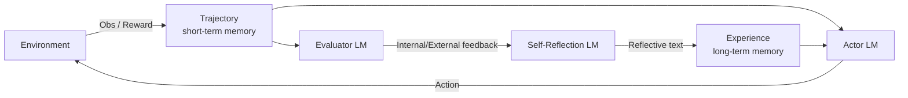
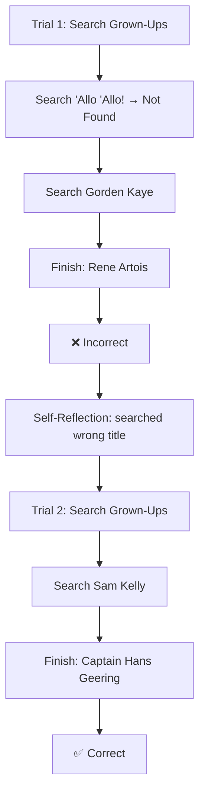

# Reflexion: Language Agents with Verbal Reinforcement Learning

**Authors:** Noah Shinn (Northeastern), Federico Cassano (Northeastern), Edward Berman (Northeastern), Ashwin Gopinath (MIT), Karthik Narasimhan (Princeton), Shunyu Yao (Princeton)

**Code:** https://github.com/noahshinn024/reflexion

## 📌 Abstract

LLM-based agents that act in external environments (games, compilers, APIs) are hard to improve via traditional RL, since that requires large numbers of training samples and costly fine-tuning. The paper introduces **Reflexion**, a framework where agents improve not by updating model weights but by **verbally reflecting** on feedback from a task and storing that reflection in an episodic memory buffer, which then informs future attempts.

Key results:
- 91% pass@1 on HumanEval (vs. GPT-4's 80% at the time)
- Works with multiple feedback types (scalar or free-form language) and sources (external or self-generated)
- Evaluated across decision-making, reasoning, and coding tasks

---

## 1. Introduction

Prior agent frameworks (ReAct, SayCan, Toolformer, HuggingGPT, generative agents, WebGPT) show LLMs can act as autonomous decision-makers by generating text/actions used in API calls. Because these models are too large and expensive to fine-tune easily, teaching them has mostly relied on in-context examples rather than gradient-based RL.

> 🔬 **Core idea:** Reflexion turns environment feedback (binary/scalar) into a **verbal, textual summary** that's added to the agent's context in the next episode — functioning like a "semantic gradient signal." This mirrors how humans reflect on past failures to improve future attempts.

The paper explores three ways of generating this reflective feedback:
1. Simple binary environment feedback
2. Pre-defined heuristics for common failure modes
3. Self-evaluation (LLM-based binary classification, or self-written unit tests for code)

🖼️ **Figure 1: Reflexion works on decision-making (§4.1), programming (§4.3), and reasoning (§4.2) tasks.**
The figure illustrates the end-to-end flow across three task domains through (a) Task, (b) Trajectory, (c) Evaluation (internal/external), (d) Reflection, and (e) Next Trajectory:
- **Decision making (ALFWorld):**
  - *(a) Task:* "You are in the middle of a room. [...] Task: clean some pan and put it in countertop"
  - *(b) Trajectory:* Agent attempts `take pan 1 from stoveburner 1` (Obs: Nothing happens), `clean pan 1 with sinkbasin 1` (Obs: Nothing happens).
  - *(c) Evaluation:* Rule / LM Heuristic flags *Hallucination*.
  - *(d) Reflection:* Agent notes it tried to pick up the pan from stoveburner 1, but the pan was not there.
  - *(e) Next Trajectory:* Agent executes `take pan 1 from stoveburner 2` and succeeds (`Obs: You put the pan 1 in countertop 1`).
- **Programming (Code Generation):**
  - *(a) Task:* "You are given a list of two strings [...] of open '(' or close ')' parentheses only [...]"
  - *(b) Trajectory:* Initial code `def match_parens(lst): if s.count('(') == s.count(')'): ... return 'No'`
  - *(c) Evaluation:* Self-generated unit tests fail (`assert match_parens(...)`).
  - *(d) Reflection:* Agent reflects that counting parentheses is insufficient because it ignores the order of parentheses.
  - *(e) Next Trajectory:* Fixed code `return 'Yes' if check(S1) or check(S2) else 'No'` passes tests.
- **Reasoning (HotpotQA):**
  - *(a) Task:* "What profession does John Lanchester and Alan Dean Foster have in common?"
  - *(b) Trajectory:* `Think: [...] novelist, journalist, critic [...] novelist, screenwriter [...] Action: "novelist, screenwriter"`
  - *(c) Evaluation:* Environment Binary Reward: 0 (Incorrect).
  - *(d) Reflection:* Agent recognizes it assumed they shared multiple professions rather than identifying the specific shared profession.
  - *(e) Next Trajectory:* `Think: [...] Action: "novelist"` (Correct).


### Advantages of Reflexion vs. traditional RL
- ✅ Lightweight — no LLM fine-tuning required
- ✅ Supports nuanced feedback (targeted action-level critique) vs. hard-to-assign scalar/vector rewards
- ✅ Produces an explicit, interpretable episodic memory
- ✅ Gives explicit hints for future episodes

⚠️ **Limitation:** Performance depends on the LLM's own self-evaluation ability (or hand-written heuristics), and there's no formal guarantee of success.

### Task categories tested
1. **Decision-making** — long trajectories of sequential actions
2. **Reasoning** — knowledge-intensive, single-step generation
3. **Programming** — using external tools like compilers/interpreters

### Headline results
- **AlfWorld** (decision-making): +22% absolute over strong baselines across 12 learning trials
- **HotPotQA** (reasoning): +20%
- **HumanEval** (Python coding): +11%

### Contributions
- A new "verbal reinforcement" paradigm where a policy = agent memory + LLM parameters
- Empirical demonstration that self-reflection meaningfully improves performance in a handful of trials
- **LeetcodeHardGym**: a new RL gym with 40 hard Leetcode problems across 19 languages
- State-of-the-art results on multiple code-generation benchmarks

---

## 2. Related Work

### Reasoning & decision-making
| Approach | Self-refine | Hidden constraints | Decision-making | Binary reward | Memory |
|---|---|---|---|---|---|
| Self-Refine [15] | ✓ | ✗ | ✗ | ✗ | ✗ |
| Beam search [27] | ✓ | ✓ | ✓ | ✓ | ✗ |
| **Reflexion (ours)** | ✓ | ✓ | ✓ | ✓ | ✓ |

- **Self-Refine** [15]: iterative self-evaluation/self-improvement conditioned on task constraints, but limited to single-generation reasoning tasks.
- **Pryzant et al.** [21]: similar semantic prompt-optimization, also single-generation only.
- **Paul et al.** [20]: fine-tunes separate critic models for intermediate feedback.
- **Xie et al.** [27]: stochastic beam search over actions for more efficient decision-making search with foresight.
- **Yoran et al. [31] / Nair et al. [16]**: use decider models across multiple generations.
- **Kim et al.** [10]: fixed-step retry pattern without an evaluation step.
- **Goodman** [9]: qualitative evaluation step suggesting optimizations to the prior generation.

Reflexion's distinction: it layers **self-reflection** on top of these ideas to build a persistent memory that lets an agent identify its own errors and derive lessons over time.

### Programming
| Approach | Test execution | Debugging | Self-generated tests | Multiple languages | Self-reflection |
|---|---|---|---|---|---|
| AlphaCode [14] | ✓ | ✗ | ✗ | ✓ | ✗ |
| CodeT [5] | ✓ | ✗ | ✓ | ✗ | ✗ |
| Self-Debugging [7] | ✓ | ✓ | ✗ | ✗ | ✗ |
| CodeRL [12] | ✓ | ✓ | ✗ | ✗ | ✗ |
| **Reflexion (ours)** | ✓ | ✓ | ✓ | ✓ | ✓ |

- **AlphaCode**: scores generations against hidden test cases.
- **CodeT**: scores implementations using self-generated unit tests.
- **Self-Debugging**: improves existing code using execution-environment feedback.
- **CodeRL**: actor-critic RL setup for debugging from execution feedback.
- Limitation of these: they either rely on ground-truth hidden tests (which breaks pass@1 eligibility) or don't use self-reflection to connect error identification with implementation improvement.

---

## 3. Reflexion: Reinforcement via Verbal Reflection

Three cooperating LLM-based modules:

- **Actor ($M_a$)** — generates text/actions
- **Evaluator ($M_e$)** — scores the Actor's outputs
- **Self-Reflection ($M_{sr}$)** — generates verbal reinforcement cues from the score + trajectory

🖼️ **Figure 2: (a) Diagram of Reflexion. (b) Reflexion reinforcement algorithm.**




### 🔬 Component details

**Actor**
Built on an LLM prompted to produce actions conditioned on observed state, similar to sampling an action $a_t$ from a policy $\pi_\theta$ at time $t$, receiving observation $o_t$. Explored variants include Chain-of-Thought and ReAct-style generation. A memory component `mem` (inspired by Brooks et al. [3]'s in-context policy iteration) supplies extra context.

**Evaluator**
Scores a generated trajectory. Because defining reward functions over semantic/text spaces is hard, the paper tries multiple variants:
- Exact-match (EM) grading for reasoning tasks
- Hand-written heuristics for decision-making tasks
- A separate LLM instance acting as evaluator for decision-making and programming tasks

**Self-Reflection**
Given a sparse (success/fail) signal, the trajectory, and existing memory, this model produces a specific, nuanced verbal critique — richer than a scalar reward — which is appended to memory `mem`. Example: in a multi-step task, if action $a_i$ led to failure via $a_{i+1}, a_{i+2}$, the model can state that action $a_i'$ should have been taken instead, and store that lesson for future trials.

**Memory**
- *Short-term memory* = the current trajectory history
- *Long-term memory* = accumulated outputs of the Self-Reflection model
Together these give the agent both fine-grained recent context and distilled lessons from past trials — a key differentiator from other LLM action-choice approaches.

### Algorithm: Reinforcement via Self-Reflection

```
Initialize Actor, Evaluator, Self-Reflection: M_a, M_e, M_sr
Initialize policy π_θ(a_i | s_i), θ = {M_a, mem}
Generate initial trajectory using π_θ
Evaluate τ_0 using M_e
Generate initial self-reflection sr_0 using M_sr
Set mem ← [sr_0]; t = 0

while M_e does not pass AND t < max_trials:
    Generate τ_t = [a_0, o_0, ..., a_i, o_i] using π_θ
    Evaluate τ_t using M_e
    Generate self-reflection sr_t using M_sr
    Append sr_t to mem
    t += 1

return
```

### The Reflexion process (narrative)

1. Trial 0: Actor produces trajectory $\tau_0$; Evaluator computes reward $r_0 = M_e(\tau_0)$.
2. Self-Reflection model turns $\{\tau_0, r_0\}$ into a summary $sr_0$, stored in `mem`.
3. The loop repeats — Actor, Evaluator, Self-Reflection — until the Evaluator judges the trajectory correct.
4. `mem` is capped at $\Omega$ stored experiences (typically 1–3) to respect context-length limits.

---

## 4. Experiments (overview)

Evaluated on:
- **HotPotQA** [28] — search-based QA (reasoning)
- **AlfWorld** [24] — multi-step household decision-making
- **HumanEval** [6], **MBPP** [2], and a new **LeetcodeHard** benchmark — code generation

**Headline gains:** +22% on AlfWorld, +20% on HotPotQA, +11% on HumanEval, all over strong baselines.

### 4.1 Sequential Decision-Making: AlfWorld

- Text-based multi-step household task suite (built on TextWorld [8]): finding hidden objects, moving objects, using one object on another (e.g., chilling a tomato in a fridge).
- 134 environments across six task types, following Yao et al. [30]'s setup.
- **Action generator:** ReAct [30], chosen for its success with explicit intermediate "thoughts" in long trajectories.
- **Self-evaluation methods** (since the environment only signals task completion):
  1. LLM-based natural language classification
  2. Hand-written heuristic — trigger self-reflection if the same action/response repeats >3 times in a row, or if an episode exceeds 30 actions (a sign of inefficient planning)
- **Baseline runs:** when self-reflection is triggered, it's skipped — the environment simply resets and a new trial starts.
- **Reflexion runs:** self-reflection is used to diagnose the mistake, update memory, then reset and retry.
- Memory is truncated to the last 3 self-reflections to control prompt length.
- Two domain-specific few-shot trajectories (same ones used by Yao et al. [30] with GPT-3) are provided to avoid syntax errors.

**Results:** ReAct+Reflexion solved 130/134 tasks (vs. plain ReAct, which plateaus between trials 6–7), continuing to learn and solve additional tasks across 12 consecutive trials using the simple heuristic to catch hallucination/inefficiency.

**Analysis:** A frequent baseline failure mode is the agent incorrectly believing it's holding an item it doesn't actually have, then executing a long chain of actions without being able to backtrack to find the mistake — a case self-reflection specifically helps correct.


## 4.1 Decision-making: ALFWorld (continued)

🖼️ Figure 3: Two line charts. (a) ALFWorld Success Rate — cumulative proportion of solved environments (134 tasks) across 10 trials, comparing "ReAct only," "ReAct + Reflexion (Heuristic)," and "ReAct + Reflexion (GPT)." Both Reflexion variants climb from ~0.62 to ~0.95–0.97, while ReAct-only plateaus around 0.75. (b) Classification of ALFWorld trajectories by failure reason — proportion of environments failing due to "hallucination" vs "inefficient planning," for ReAct-only vs ReAct + Reflexion, across trials. ReAct-only hallucination stays high (converging near 0.22); Reflexion sharply reduces both failure types toward near-zero.

> 📌 **Key finding:** Self-reflection distills long, failed trajectories into reusable "self-hints." Long-term memory helps in two main ways:
> 1. An early mistake in a long trajectory can be identified, letting the agent suggest a new action or long-term plan.
> 2. When there are many surfaces/containers to check for an item, the agent can use experience memory across trials to search more thoroughly.

The learning curve suggests learning happens over multiple experiences — an initial spike in improvement between the first two trials, then a steady climb over the next several trials to near-perfect performance. A ReAct-only agent, by contrast, converges at a **22% hallucination rate** with no long-term recovery.

---

## 4.2 Reasoning: HotpotQA

**Dataset:** HotpotQA — a Wikipedia-based dataset with 113k question-answer pairs requiring reasoning over multiple supporting documents.

### 🔬 Method

- **Reasoning-only test:** Reflexion + Chain-of-Thought (CoT), implemented two ways:
  - $Q \rightarrow A$
  - $Q, C_{gt} \rightarrow A$ (ground-truth context $C_{gt}$ given, since CoT alone isn't a multi-step decision-making technique — this isolates reasoning ability over long context)
- **Holistic reasoning + acting test:** Reflexion + ReAct agent, retrieving context via a Wikipedia API and reasoning step-by-step.
- **Prompting:** 6-shot for CoT, 2-shot for ReAct, 2-shot for self-reflection (examples in appendix).
- **Evaluation signal:** exact-match answer grading (binary success/fail) between trials.
- **Memory:** sliding window of 3 experiences (same setup as §4.1 ALFWorld).

### 📊 Results

- Reflexion outperforms all baselines by significant margins over multiple learning steps.
- ReAct-only, CoT-only, and CoT (GT)-only **fail to probabilistically improve** on any task — none of the tasks failed on trial 1 were solved in later trials (temperature 0.7).
- Reflexion runs allowed the agent to retry failed tasks until **3 consecutive failures**.
- CoT (GT) scores higher due to ground-truth context access, but still gets **39%** of questions wrong.
- Reflexion improves accuracy by **14%** over CoT (GT) *without* access to the ground-truth answer.

🖼️ Figure 4: Three line charts over trials (0–100 HotpotQA questions). (a) HotPotQA Success Rate — CoT only, ReAct only, CoT + Reflexion, ReAct + Reflexion; both Reflexion variants rise from ~0.35–0.4 toward ~0.65–0.75 while the non-Reflexion baselines stay flat (~0.3–0.45). (b) HotPotQA CoT (GT) — CoT (GT) only vs CoT (GT) + Reflexion; Reflexion rises from ~0.65 to ~0.75 while the baseline stays flat near 0.6. (c) HotPotQA Episodic Memory — CoT (GT) only, CoT (GT) + EPM, CoT (GT) + EPM + Reflexion; the full Reflexion+EPM line reaches the highest performance (~0.75–0.8).

### Analysis: episodic memory ablation

To isolate the benefit of the self-reflective step, the authors compare against a **CoT (GT)** baseline (reasoning over long ground-truth context):

1. Add **episodic memory (EPM)** — include only the most recent trajectory.
2. Add the full **self-reflection** step as a final pass (verbal explanation, written in first person).

> 📌 Self-reflection improves learning by an **8% absolute boost** over the episodic-memory-only advantage — supporting the claim that refinement-only approaches are less effective than self-reflection-guided refinement.

---

## 4.3 Programming

Reflexion and baseline approaches are evaluated on Python and Rust code generation using:

- **MBPP** and **HumanEval** — function-body generation from natural language descriptions.
- **LeetcodeHardGym** — a new interactive programming gym introduced in this paper, containing 40 Leetcode hard-rated questions released *after* October 8, 2022 (GPT-4's pretraining cutoff).
- **MultiPL-E** — a benchmark compiler used to translate HumanEval/MBPP subsets into Rust, demonstrating that Reflexion generalizes across interpreted and compiled languages.

### 🔬 Method: self-generated unit tests

Programming allows a more grounded self-evaluation signal via self-generated tests, making Reflexion eligible for pass@1 reporting:

1. Generate diverse tests with natural-language descriptions via Chain-of-Thought prompting.
2. Filter to syntactically valid tests by checking each can form a valid abstract syntax tree (AST).
3. Sample $n$ tests (max **6**) to form test suite $T = \{t_0, t_1, \ldots, t_n\}$.

Otherwise the learning loop matches the reasoning/decision-making setup, but with a **max memory of 1 experience**.

### 📊 Results — Table 1: Pass@1 Accuracy

| Benchmark + Language | Prev SOTA Pass@1 | SOTA Pass@1 | Reflexion Pass@1 |
|---|---|---|---|
| HumanEval (PY) | 65.8 (CodeT + GPT-3.5) | 80.1 (GPT-4) | **91.0** |
| HumanEval (RS) | – | 60.0 (GPT-4) | **68.0** |
| MBPP (PY) | 67.7 (CodeT + Codex) | **80.1 (GPT-4)** | 77.1 |
| MBPP (RS) | – | 70.9 (GPT-4) | **75.4** |
| Leetcode Hard (PY) | – | 7.5 (GPT-4) | **15.0** |

Reflexion sets new SOTA on all benchmarks except **MBPP Python**.

### Analysis: why Reflexion underperforms on MBPP Python

Self-reflecting code agents are limited by the quality/diversity of their generated tests:

- **False positive** (tests pass, solution is actually wrong) → agent prematurely accepts an incorrect solution.
- **False negative** (tests fail, solution is actually correct) → agent can potentially use self-reflection to recognize the test itself was wrong and preserve the correct code.

> ⚠️ False positives are worse than false negatives for Reflexion, since false negatives are at least recoverable via self-reflection.

**Table 2: Test-generation performance (HumanEval / MBPP)**

| Benchmark + Language | Base | Reflexion | TP | FN | FP | TN |
|---|---|---|---|---|---|---|
| HumanEval (PY) | 0.80 | 0.91 | 0.99 | 0.40 | 0.01 | 0.60 |
| MBPP (PY) | 0.80 | 0.77 | 0.84 | 0.59 | 0.16 | 0.41 |
| HumanEval (RS) | 0.60 | 0.68 | 0.87 | 0.37 | 0.13 | 0.63 |
| MBPP (RS) | 0.71 | 0.75 | 0.84 | 0.51 | 0.16 | 0.49 |

*(TP: tests pass & solution correct · FN: tests fail & solution correct · FP: tests pass & solution incorrect · TN: tests fail & solution incorrect)*

For MBPP Python, the **false positive rate is 16.3%** vs. only **1.4%** for HumanEval Python — despite similar baseline pass@1 accuracies (~80–82%) — explaining much of the gap.

### 🔬 Ablation study — Table 3

Tested on the 50 hardest HumanEval Rust problems (chosen because the Rust compiler gives verbose, useful error logs).

| Approach | Test Generation | Self-reflection | Pass@1 (Acc) |
|---|---|---|---|
| Base model | ❌ | ❌ | 0.60 |
| Test generation omission | ❌ | ✅ | 0.52 |
| Self-reflection omission | ✅ | ❌ | 0.60 |
| **Reflexion** | ✅ | ✅ | **0.68** |

- **Omitting test generation:** accuracy drops to 52% — without unit test guidance, the agent can't tell if its implementation is correct and may make harmful edits with no way to stop early.
- **Omitting self-reflection:** no improvement over baseline (0.60) — test/compilation steps catch syntax/logic errors, but without the natural-language reflection step the agent fails to translate those signals into actual fixes.

> 📌 These results suggest that "blind" trial-and-error debugging (without self-reflection) is ineffective on harder tasks like complex Rust programs.

---

## 5. Limitations

- Reflexion is a natural-language policy optimization technique — powerful, but still susceptible to **non-optimal local minima**.
- Long-term memory here is a **capacity-limited sliding window**; future work could use more advanced structures (e.g., vector embedding databases, SQL databases).
- Code-generation-specific limits on test-driven development accuracy:
  - Non-deterministic generator functions
  - Impure functions interacting with external APIs
  - Hardware-dependent output
  - Parallel/concurrent behavior that's hard to predict

---

## 6. Broader Impact

- LLM agents interacting with external environments (internet, software, robotics) and humans could be empowered toward greater automation — but risks are amplified if misused. More effort is needed on safety and ethical considerations.
- Traditional RL suffers from black-box policies that are hard to interpret/align. Reflexion's "verbal" reinforcement learning could make agents **more interpretable and diagnosable** — e.g., self-reflections could be monitored to verify proper intent before a tool is used.

---

## 7. Conclusion

Reflexion teaches agents to learn from past mistakes via verbal reinforcement, and Reflexion agents significantly outperform common decision-making baselines. Future work could adapt more advanced traditional-RL techniques — e.g., natural-language value learning or off-policy exploration — into the Reflexion framework.

---

## 8. Reproducibility

⚠️ The authors advise using **isolated execution environments** when running autonomous code-writing experiments, since generated code is not validated before execution.

---

## References

1. Ahn, M., Brohan, A., Brown, N., Chebotar, Y., Cortes, O., David, B., Finn, C., Gopalakrishnan, K., Hausman, K., Herzog, A., et al. (2022). *Do as I can, not as I say: Grounding language in robotic affordances.* arXiv:2204.01691.
2. Austin, J., Odena, A., Nye, M., Bosma, M., Michalewski, H., Dohan, D., Jiang, E., Cai, C., Terry, M., Le, Q., et al. (2021). *Program synthesis with large language models.* arXiv:2108.07732.
3. Brooks, E., Walls, L., Lewis, R. L., and Singh, S. (2022). *In-context policy iteration.* arXiv:2210.03821.
4. Cassano, F., Gouwar, J., Nguyen, D., Nguyen, S., Phipps-Costin, L., Pinckney, D., Yee, M.-H., Zi, Y., Anderson, C. J., Feldman, M. Q., Guha, A., Greenberg, M., and Jangda, A. (2022). *MultiPL-E: A scalable and extensible approach to benchmarking neural code generation.*
5. Chen, B., Zhang, F., Nguyen, A., Zan, D., Lin, Z., Lou, J.-G., and Chen, W. (2022). *CodeT: Code generation with generated tests.* arXiv:2207.10397.
6. Chen, M., Tworek, J., Jun, H., Yuan, Q., Pinto, H. P. d. O., Kaplan, J., Edwards, H., Burda, Y., Joseph, N., Brockman, G., et al. (2021). *Evaluating large language models trained on code.* arXiv:2107.03374.
7. Chen, X., Lin, M., Schärli, N., and Zhou, D. (2023). *Teaching large language models to self-debug.* arXiv:2304.05128.
8. Côté, M.-A., Kádár, A., Yuan, X., Kybartas, B., Barnes, T., Fine, E., Moore, J., Hausknecht, M., El Asri, L., Adada, M., et al. (2019). *TextWorld: A learning environment for text-based games.* In Computer Games (CGW 2018), IJCAI, pages 41–75, Springer.
9. Goodman, N. (2023). *Meta-Prompt: A simple self-improving language agent.* noahgoodman.substack.com.
10. Kim, G., Baldi, P., and McAleer, S. (2023). *Language models can solve computer tasks.* arXiv:2303.17491.
11. Lam, W., Winter, S., Wei, A., Xie, T., Marinov, D., and Bell, J. (2020). *A large-scale longitudinal study of flaky tests.* Proc. ACM Program. Lang., 4(OOPSLA).
12. Le, H., Wang, Y., Gotmare, A. D., Savarese, S., and Hoi, S. C. H. (2022). *CodeRL: Mastering code generation through pretrained models and deep reinforcement learning.* NeurIPS 35:21314–21328.
13. Li, R., Allal, L. B., Zi, Y., Muennighoff, N., Kocetkov, D., Mou, C., Marone, M., Akiki, C., Li, J., Chim, J., et al. (2023). *StarCoder: may the source be with you!* arXiv:2305.06161.
14. Li, Y., Choi, D., Chung, J., Kushman, N., Schrittwieser, J., Leblond, R., Eccles, T., Keeling, J., Gimeno, F., Dal Lago, A., et al. (2022). *Competition-level code generation with AlphaCode.* Science, 378(6624):1092–1097.
15. Madaan, A., Tandon, N., Gupta, P., Hallinan, S., Gao, L., Wiegreffe, S., Alon, U., Dziri, N., Prabhumoye, S., Yang, Y., et al. (2023). *Self-Refine: Iterative refinement with self-feedback.* arXiv:2303.17651.
16. Nair, V., Schumacher, E., Tso, G., and Kannan, A. (2023). *DERA: Enhancing large language model completions with dialog-enabled resolving agents.* arXiv:2303.17071.
17. Nakano, R., Hilton, J., Balaji, S., Wu, J., Ouyang, L., Kim, C., Hesse, C., Jain, S., Kosaraju, V., Saunders, W., et al. (2021). *WebGPT: Browser-assisted question-answering with human feedback.* arXiv:2112.09332.
18. OpenAI (2023). *GPT-4 Technical Report.* ArXiv.
19. Park, J. S., O’Brien, J. C., Cai, C. J., Morris, M. R., Liang, P., and Bernstein, M. S. (2023). *Generative agents: Interactive simulacra of human behavior.* arXiv:2304.03442.
20. Paul, D., Ismayilzada, M., Peyrard, M., Borges, B., Bosselut, A., West, R., and Faltings, B. (2023). *Refiner: Reasoning feedback on intermediate representations.* arXiv:2304.01904.
21. Pryzant, R., Iter, D., Li, J., Lee, Y. T., Zhu, C., and Zeng, M. (2023). *Automatic prompt optimization with "gradient descent" and beam search.* arXiv:2305.03495.
22. Schick, T., Dwivedi-Yu, J., Dessì, R., Raileanu, R., Lomeli, M., Zettlemoyer, L., Cancedda, N., and Scialom, T. (2023). *Toolformer: Language models can teach themselves to use tools.* arXiv:2302.04761.
23. Shen, Y., Song, K., Tan, X., Li, D., Lu, W., and Zhuang, Y. (2023). *HuggingGPT: Solving AI tasks with ChatGPT and its friends in Hugging Face.* arXiv:2303.17580.
24. Shridhar, M., Yuan, X., Côté, M.-A., Bisk, Y., Trischler, A., and Hausknecht, M. (2021). *ALFWorld: Aligning Text and Embodied Environments for Interactive Learning.* In Proceedings of the International Conference on Learning Representations (ICLR).
25. Sutton, R. S. and Barto, A. G. (2018). *Reinforcement Learning: An Introduction.* The MIT Press, second edition.
26. Wei, J., Wang, X., Schuurmans, D., Bosma, M., Chi, E., Le, Q., and Zhou, D. (2022). *Chain of thought prompting elicits reasoning in large language models.* arXiv:2201.11903.
27. Xie, Y., Kawaguchi, K., Zhao, Y., Zhao, X., Kan, M.-Y., He, J., and Xie, Q. (2023). *Decomposition enhances reasoning via self-evaluation guided decoding.* arXiv:2305.00633.
28. Yang, Z., Qi, P., Zhang, S., Bengio, Y., Cohen, W. W., Salakhutdinov, R., and Manning, C. D. (2018). *HotpotQA: A dataset for diverse, explainable multi-hop question answering.* In Conference on Empirical Methods in Natural Language Processing (EMNLP).
29. Yao, S., Chen, H., Yang, J., and Narasimhan, K. (preprint). *WebShop: Towards scalable real-world web interaction with grounded language agents.* In ArXiv.
30. Yao, S., Zhao, J., Yu, D., Du, N., Shafran, I., Narasimhan, K., and Cao, Y. (2023). *ReAct: Synergizing reasoning and acting in language models.* In International Conference on Learning Representations (ICLR).
31. Yoran, O., Wolfson, T., Bogin, B., Katz, U., Deutch, D., and Berant, J. (2023). *Answering questions by meta-reasoning over multiple chains of thought.* arXiv:2304.13007.


# Appendix (Excerpt)

## A. Evaluation with Additional Models

The applicability of trial-and-error problem-solving was tested across models of varying strength. The ability to generate useful self-corrections appears to be an emergent property that shows up more strongly in larger, more capable models.

**Table 4 — Pass@1 accuracy on HumanEval Python using starchat-beta**

| Approach  | Pass@1 accuracy (avg over 8 trials) | Pass@1 accuracy (std) |
|-----------|--------------------------------------|------------------------|
| Baseline  | 0.26                                  | 0.00481                |
| Reflexion | 0.26                                  | 0.00305                |

With this smaller model, Reflexion did not improve over the baseline, supporting the idea that self-correction ability scales with model strength.

**Table 5 — Pass@1 accuracy on 100 HotPotQA questions using various models**

| Model                        | Baseline accuracy | Reflexion accuracy |
|-------------------------------|--------------------|----------------------|
| CoT (GT) + text-davinci-003   | 0.60               | 0.77                 |
| CoT (GT) + gpt-3.5-turbo      | 0.57               | 0.71                 |
| CoT (GT) + gpt-4              | 0.68               | 0.80                 |
| ReAct + text-davinci-003      | 0.30               | 0.55                 |
| ReAct + gpt-3.5-turbo         | 0.26               | 0.38                 |
| ReAct + gpt-4                 | 0.39               | 0.51                 |

Across all model families tested, Reflexion improves on the baseline, with the largest relative gains seen in the ReAct setting.

---

## B. Decision-Making (AlfWorld Example)

**Environment:** You are in the middle of a room. Looking quickly around you, you see a bed 1, a desk 2, a desk 1, a drawer 6, a drawer 5, a drawer 4, a drawer 3, a drawer 2, a drawer 1, a garbagecan 1, a laundryhamper 1, a safe 1, a shelf 6, a shelf 5, a shelf 4, a shelf 3, a shelf 2, and a shelf 1.

**Task:** examine the mug with the desklamp.

### Trial #1
```
> think: To solve the task, I need to find and take a mug, then find and use a desklamp.
> think: First I need to find a mug. A mug is more likely to appear in drawer (1-6), desk (1-2), shelf (1-6), garbagecan (1), laundryhamper (1). I can check one by one, starting with drawer 1.
> go to drawer 1
The drawer 1 is closed.
. . .
> open drawer 6
You open the drawer 6. The drawer 6 is open. In it, you see a keychain 2.
> go to desk 1
On the desk 1, you see a creditcard 3, a desklamp 1, a laptop 2, a mug 1, a pen 1, and a pencil 1.
> think: Now I find a mug (1). Next, I need to take it.
> take mug 1 from desk 1
You pick up the mug 1 from the desk 1.
> think: Now I take a mug (1). Next, I need to find a desklamp. A desklamp is more likely to appear in desk (1-2), sidetable (1-2), shelf (1-6), bed (1), drawer (1-6). I can check one by one, starting with desk 1.
> go to desk 1
Nothing happens.
> go to desk 2
On the desk 2, you see a alarmclock 1, a bowl 1, a mug 3, a pencil 3, and a pencil 2.
> think: Now I find a desklamp (1). Next, I need to use it.
> use desklamp 1
Nothing happens.
> use desklamp 1
Nothing happens.
Status: Fail
```

> 📌 **Reflection:** In this environment, my plan was to find a mug then find and use a desklamp. However, the task says to examine the mug with the desklamp. I should have looked for the desklamp first, then looked for the mug. I noticed that the desklamp was found on desk 1. In the next trial, I will go to desk 1, find the lamp, then look for the mug and examine it with the desklamp.

### Trial #2
```
> go to desk 1
On the desk 1, you see a creditcard 3, a desklamp 1, a laptop 2, a mug 1, a pen 1, and a pencil 1.
> think: To solve the task, I need to find and take a mug, then find and use a desklamp.
> take mug 1 from desk 1
You pick up the mug 1 from the desk 1.
> think: To solve the task, I need to find and take a mug, then find and use a desklamp.
> use desklamp 1
You turn on the desklamp 1.
Status: Success
```

🖼️ **Figure 5:** [Top] An AlfWorld trajectory in which the agent failed due to inefficient planning. In the reflection, the agent recognizes that it should have looked for the desklamp then the mug, not the mug then the desklamp. [Bottom] The agent is able to correct its reasoning trace and execute a sequence of actions in a concise manner.


---

## B.1 WebShop Limitation

Reflexion struggles to escape local minima that require highly creative or exploratory behavior — a limitation demonstrated on the **WebShop** benchmark, where agents must navigate an e-commerce site to locate and purchase products matching customer requests.

- A two-shot ReAct + Reflexion agent was tested across 100 environments.
- After only four trials, the run was terminated because the agent showed no signs of improvement.
- The agent's self-reflections were not helpful or intuitive after failed attempts.

**Conclusion:** Reflexion is not well-suited to tasks demanding a high degree of diversity and exploration.

- In **AlfWorld**, the agent can explore effectively because permissible actions are visible directly in the environment's observations.
- In **HotPotQA**, search tasks are more tractable because the space of relevant Wikipedia articles is more diverse and forgiving of imprecise queries.
- In **WebShop**, e-commerce search engines struggle with ambiguity in natural language queries, making this a harder setting for Reflexion-style iterative correction.

**Figure 6 — WebShop Success Rate (ReAct vs. ReAct + Reflexion)**

| Trial | ReAct only | ReAct + Reflexion |
|-------|-----------|--------------------|
| 0     | ~0.33     | ~0.33              |
| 1     | ~0.35     | ~0.35              |
| 2     | ~0.35     | ~0.35              |
| 3     | ~0.35     | ~0.35              |

ReAct + Reflexion fails to significantly outperform ReAct alone on this benchmark.

---

## C. Programming

LLM calls for programming tasks require strict instructions to return **function bodies only**, since the models' extensive dialogue-style training otherwise leads them toward conversational output.

### C.1 Function Implementation Example (HumanEval Python)

**Sample function signature:**

```python
def minSubArraySum(nums):
    """
    Given an array of integers nums, find the minimum sum of any
    non-empty sub-array of nums.
    Example
    minSubArraySum([2, 3, 4, 1, 2, 4]) == 1
    minSubArraySum([-1, -2, -3]) == -6
    """
```

**Sample function body implementation:**

```python
min_sum = float('inf')
for i in range(len(nums)):
    current_sum = 0
    for j in range(i, len(nums)):
        current_sum += nums[j]
        if current_sum < min_sum:
            min_sum = current_sum
return min_sum
```

### C.2 Reflexion Actor Instruction

The actor is instructed as a Python writing assistant: given a previous function implementation, unit test results, and a self-reflection on that implementation, it must apply the necessary changes and respond with **only** the improved function body (no signature), with the first line indented by 4 spaces to fit the provided signature. A few examples are provided to the model beforehand.

**Generation format:**
1. Instruction
2. Function implementation
3. Unit test feedback
4. Self-reflection
5. Instruction for next function implementation

*(Full examples available at the project's GitHub repository.)*

### C.3 Reflexion Self-Reflection Instruction and Example

**Instruction:**
> You are a Python writing assistant. You will be given your previous implementation of a function, a series of unit tests results, and your self-reflection on your previous implementation. Apply the necessary changes below by responding only with the improved body of the function. Do not include the signature in your response. The first line of your response should have 4 spaces of indentation so that it fits syntactically with the user provided signature. You will be given a few examples by the user.

**Generation format:**
1. (Instruction)
2. (Function implementation)
3. (Unit test feedback)

### C.4 Ablation: No Self-Reflection

Reflexion no Self-Reflection ablation Actor generations follow the form:
1. (Instruction)
2. (Function implementation)
3. (Unit test feedback)
4. (Self-reflection)
5. (Instruction for next function implementation)

### C.5 Ablation: No Test Generation

Reflexion no test generation ablation Actor generations follow the form:
1. (Instruction)
2. (Function implementation)
3. (Unit test feedback)
4. (Self-reflection)
5. (Instruction for next function implementation)

---

## D. Reasoning

### D.1 Full Example


**Trial #1**

> **Question:** Grown-Ups starred the actor who was best known for which role on "'Allo 'Allo!"?

- **Thought 1:** I need to search Grown-Ups and "'Allo 'Allo!", find the actor who starred in Grown-Ups, then find the role he was best known for in "'Allo 'Allo!".
- **Action 1:** `Search[Grown-Ups]`
- **Observation 1:** Grown-Ups is a 1980 British BBC television film devised and directed by Mike Leigh. It stars Lesley Manville, Philip Davis, Brenda Blethyn, Janine Duvitski, Lindsay Duncan and Sam Kelly. It was edited by Robin Sales and produced by Louis Marks for the BBC, and originally shown on BBC 2 on 28 November 1980.
- **Thought 2:** Grown-Ups starred Lesley Manville, Philip Davis, Brenda Blethyn, Janine Duvitski, Lindsay Duncan and Sam Kelly. I need to search "'Allo 'Allo!" and find which actor was best known for which role.
- **Action 2:** `Search["'Allo 'Allo!"]`
- **Observation 2:** Could not find ["'Allo 'Allo!"]. Similar: ["'Allo 'Allo!", "List of 'Allo 'Allo! characters", 'Gorden Kaye', "'Allo 'Allo! (series 2)", 'Allô, allô', 'Francesca Gonshaw', "'Allo 'Allo! (series 4)", 'Kim Hartman', "'Allo 'Allo! (series 6)", 'Jeremy Lloyd']
- **Thought 3:** To find the actor who was best known for which role on "'Allo 'Allo!", I can search Gorden Kaye.
- **Action 3:** `Search[Gorden Kaye]`
- **Observation 3:** Gordon Irving Kaye (7 April 1941 – 23 January 2017), known professionally as Gorden Kaye, was an English actor, best known for playing womanising café owner René Artois in the television comedy series 'Allo 'Allo!.
- **Thought 4:** Gorden Kaye was best known for playing womanising café owner René Artois in the television comedy series "'Allo 'Allo!". So the answer is Rene Artois.
- **Action 4:** `Finish[Rene Artois]`
- **Observation 4:** ❌ Answer is INCORRECT

**Trial #2**

> **Question:** Grown-Ups starred the actor who was best known for which role on "'Allo 'Allo!"?

- **Thought 1:** I need to search the actor who was best known for a role on "'Allo 'Allo!" and find out what role they were best known for.
- **Action 1:** `Search[Grown-Ups]`
- **Observation 1:** Grown-Ups is a 1980 British BBC television film devised and directed by Mike Leigh. It stars Lesley Manville, Philip Davis, Brenda Blethyn, Janine Duvitski, Lindsay Duncan and Sam Kelly. It was edited by Robin Sales and produced by Louis Marks for the BBC, and originally shown on BBC 2 on 28 November 1980.
- **Thought 2:** The paragraph does not mention the actor who was best known for a role on "'Allo 'Allo!". I need to search the actor's name instead.
- **Action 2:** `Search[Sam Kelly]`
- **Observation 2:** Roger Michael Kelly (19 December 1943 – 14 June 2014), known by the stage name Sam Kelly, was an English actor who appeared in film, television, radio and theatre. He is best known for his roles as Captain Hans Geering in 'Allo 'Allo!, Warren in Porridge, Sam in On the Up, and Ted Liversidge in Barbara.
- **Thought 3:** Sam Kelly is best known for his role as Captain Hans Geering in "'Allo 'Allo!", so the answer is Captain Hans Geering.
- **Action 3:** `Finish[Captain Hans Geering]`
- **Observation 3:** ✅ Answer is CORRECT

> 📌 **Reflection:** I searched the wrong title for the show, "'Allo 'Allo!", which resulted in no results. I should have searched the show's main character, Gorden Kaye, to find the role he was best known for in the show.

🖼️ **Figure 7:** Two HotPotQA trials within the same environment and task. The Reflexion + ReAct agent uses self-reflection to determine a better search method for the next trial.




---

### D.2 Chain-of-Thought + Reflexion

**Trial #1**

> **Question:** What profession does John Lanchester and Alan Dean Foster have in common?

- **Thought 1:** Let's think step by step. John Lanchester is a novelist, journalist, and critic. Alan Dean Foster is a novelist and screenwriter. So the profession John Lanchester and Alan Dean Foster have in common is novelist and screenwriter.
- **Action 1:** `Finish[novelist and screenwriter]`
- **Observation 1:** ❌ Answer is INCORRECT

**Trial #2**

> **Question:** What profession does John Lanchester and Alan Dean Foster have in common?

- **Thought 1:** Let's think step by step. John Lanchester is a novelist, journalist, and financial journalist. Alan Dean Foster is a novelist and screenwriter. So the profession John Lanchester and Alan Dean Foster have in common is novelist.
- **Action 1:** `Finish[novelist]`
- **Observation 1:** ✅ Answer is CORRECT

> 📌 **Reflection:** My reasoning for the profession John Lanchester and Alan Dean Foster have in common failed because I incorrectly assumed that they both had the same profession. In the future, when attempting this question, I should focus on better researching the individual backgrounds of both authors to ensure that I am accurately identifying their professions. Additionally, I should consider the possibility that they may have multiple professions in common.

---

### D.3 HotPotQA Chain-of-Thought (GT) + Reflexion

> **Context:** The Battle of White Plains was a battle in the New York and New Jersey campaign of the American Revolutionary War fought on October 28, 1776, near White Plains, New York. Following the retreat...

**Trial #1**

> **Question:** What was a series of battles during the Revolutionary War, for control of New York City and the state of New Jersey, fought on October 28, 1776 near White Plains, New York?

- **Thought 1:** The question is asking about a series of battles during the Revolutionary War for control of New York City and the state of New Jersey, fought on October 28, 1776 near White Plains, New York. From the context, I know that this was the Battle of White Plains.
- **Action 1:** `Finish[Battle of White Plains]`
- **Observation 1:** ❌ Answer is INCORRECT

**Trial #2**

> **Question:** What was a series of battles during the Revolutionary War, for control of New York City and the state of New Jersey, fought on October 28, 1776 near White Plains, New York?

- **Thought 1:** The question is asking for a series of battles during the Revolutionary War, for control of New York City and the state of New Jersey, fought on October 28, 1776 near White Plains, New York. Based on the context, I know that this series of battles was the New York and New Jersey campaign.
- **Action 1:** `Finish[The New York and New Jersey campaign]`
- **Observation 1:** ✅ Answer is CORRECT

> 📌 **Reflection:** Upon reflecting on the incorrect answer I provided, I realize that I may not have provided enough context to accurately answer the question. The question asked for a series of battles, but I only provided the name of one battle. To better answer this question in the future, I will make sure to provide more context, such as the name of the campaign, which was the New York and New Jersey campaign, and the fact that it was a series of battles. Additionally, I will make sure to include the dates of the battles, as well as the locations, to ensure that my answer is comprehensive and accurate.

---

### D.4 HotPotQA Episodic Memory (EPM) Ablation Prompts

#### D.4.1 (EPM) Chain-of-Thought + Reflexion

**Trial #1**

> **Question:** Which of Jonny Craig and Pete Doherty has been a member of more bands?

- **Thought 1:** Let's think step by step. Jonny Craig has been a member of six bands, including Emarosa, Dance Gavin Dance, and Slaves. Pete Doherty has been a member of seven bands, including The Libertines, Babyshambles, and The Puta Madres. So Pete Doherty has been a member of more bands.
- **Action 1:** `Finish[Pete Doherty]`
- **Observation 1:** ❌ Answer is INCORRECT

**Trial #2**

> **Question:** Which of Jonny Craig and Pete Doherty has been a member of more bands?

- **Thought 1:** Let's think step by step. I will research the past and current bands of both musicians to ensure that I am accurately comparing their band memberships. After researching, I have found that Jonny Craig has been a member of seven bands, including Emarosa, Dance Gavin Dance, and Slaves. Pete Doherty has been a member of seven bands, including The Libertines, Babyshambles, and The Puta Madres. So Jonny Craig has been a member of more bands.
- **Action 2:** `Finish[Jonny Craig]`
- **Observation 2:** ✅ Answer is CORRECT

> 📌 **Reflection:** My reasoning for which musician has been a member of more bands failed because I did not take into account that Jonny Craig has been a member of more bands in the past, even though Pete Doherty is currently a member of more bands. In the future, when attempting this question, I should focus on researching the past and current bands of both musicians to ensure that I am accurately comparing their band memberships.

#### D.4.2 (EPM) Chain-of-Thought (GT) + Reflexion

> **Context:** Hari Bahadur Basnet is a Nepalese politician. He is the head of the Foreign Relations Department of the Rastriya Janashakti Party. Basnet holds a M.Sc. in Engineering.
>
> A Master of Science (Latin: "Magister Scientiae"; abbreviated MS, M.S., MSc, M.Sc., MSci, M.Sci., ScM, Sc.M., SciM or Sci.M.) is a master's degree in the field of science...

**Trial #1** *(previous trajectory)*

> **Question:** The head of the Foreign Relations Department of the Rastriya Janashakti Party holds a degree that can be abbreviated MS, M.S., or ScM, in what field?

- **Thought 1:** The question is asking what field of study the head of the Foreign Relations Department of the Rastriya Janashakti Party holds a degree in. From the context, I know that the degree is a Master of Science degree, which is typically granted for studies in sciences, engineering, and medicine.
- **Action 1:** `Finish[Sciences, Engineering, and Medicine]`
- **Observation 1:** ❌ Answer is INCORRECT

**Trial #2** *(previous trajectory)*

> **Question:** The head of the Foreign Relations Department of the Rastriya Janashakti Party holds a degree that can be abbreviated MS, M.S., or ScM, in what field?

- **Thought 1:** The question is asking what field of study the head of the Foreign Relations Department of the Rastriya Janashakti Party holds a degree in. From the context, I know that the degree is a Master of Science degree, which is typically granted for studies in sciences, engineering, and medicine. However, the question is asking for the field of study, not the degree. Based on the context, I know that Hari Bahadur Basnet holds a M.Sc. in Engineering.
- **Action 1:** `Finish[Engineering]`
- **Observation 1:** ✅ Answer is CORRECT

> 📌 **Reflection:** For the first trial, I misunderstood the question. I thought the question was asking for a category of degrees, rather than a specific degree. I learned from my mistake and in the second trial, I focused more closely on the question to understand that it was asking for a specific field of study.
