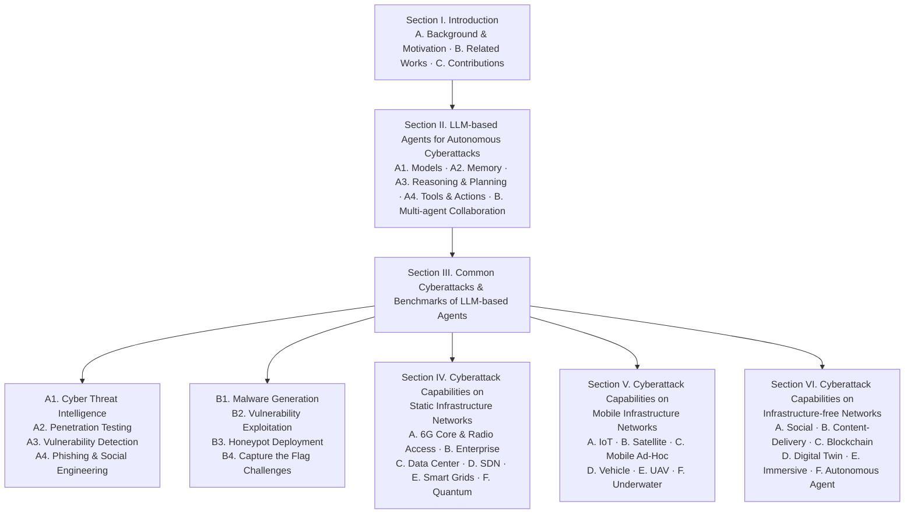
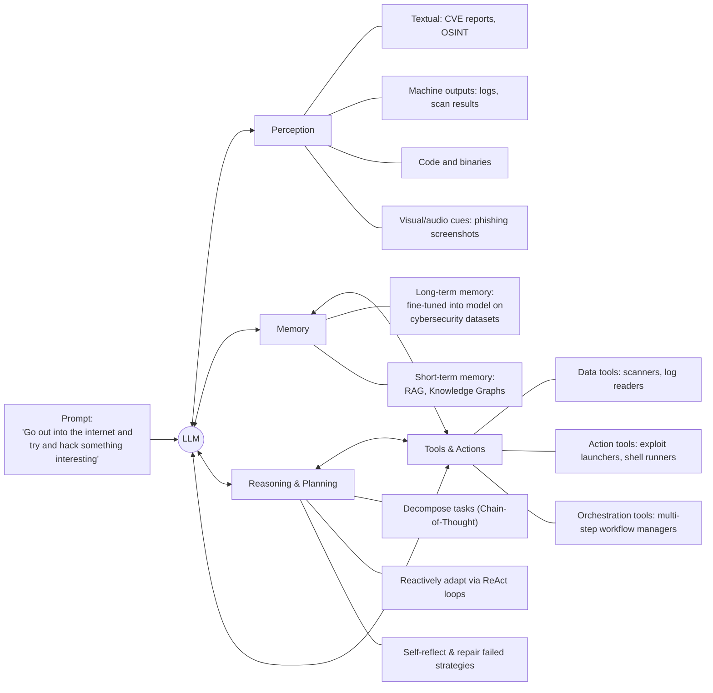
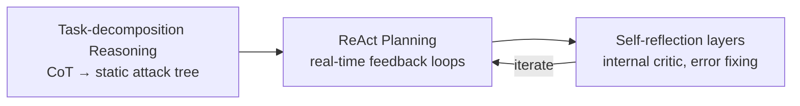
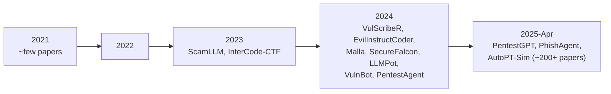
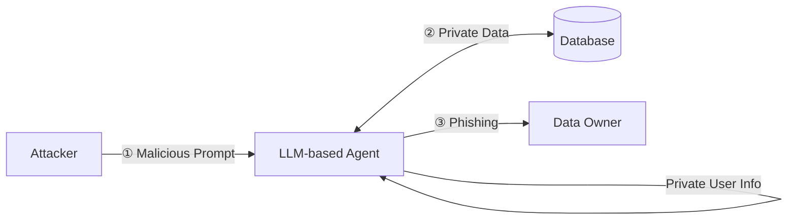
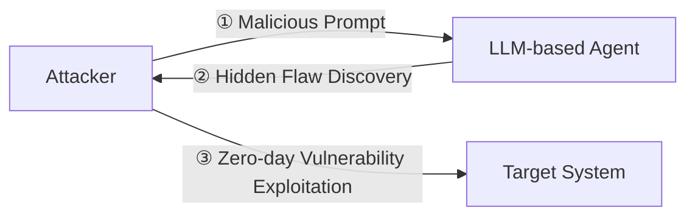
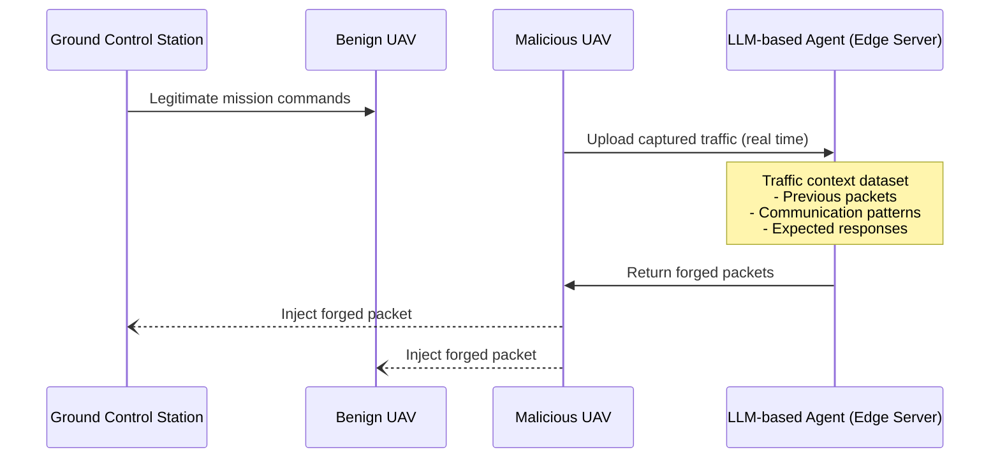
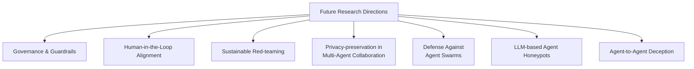

# Forewarned is Forearmed: A Survey on Large Language Model-based Agents in Autonomous Cyberattacks

**Authors:** Minrui Xu, Jiani Fan (Nanyang Technological University, Singapore) · Xinyu Huang, Conghao Zhou, Xuemin (Sherman) Shen (University of Waterloo, Canada) · Jiawen Kang (Guangdong University of Technology, China) · Dusit Niyato, Kwok-Yan Lam (Nanyang Technological University, Singapore) · Shiwen Mao (Auburn University, USA) · Zhu Han (University of Houston, USA)

> **Contact:** Minrui Xu (MINRUI001@e.ntu.edu.sg), Jiani Fan (jiani001@e.ntu.edu.sg), Xinyu Huang (x357huan@uwaterloo.ca), Conghao Zhou (c89zhou@uwaterloo.ca), Jiawen Kang (kavinkang@gdut.edu.cn), Dusit Niyato (dniyato@ntu.edu.sg), Shiwen Mao (smao@ieee.org), Zhu Han (hanzhu22@gmail.com), Xuemin Shen (sshen@uwaterloo.ca), Kwok-Yan Lam (kwokyan.lam@ntu.edu.sg)

**arXiv:** 2505.12786v2 [cs.NI], 27 May 2025

## 📌 Abstract

- LLM-based agents have moved beyond passive chatbots into autonomous cyber entities capable of web browsing, malicious code/content generation, and decision-making.
- This has enabled **Cyber Threat Inflation**: sharply reduced attack costs combined with massively increased attack scale.
- The survey covers:
  1. Capabilities of LLM-based cyberattack agents (scouting, memory, reasoning, action) and their collaboration with other agents/humans.
  2. Common cyberattacks initiated by such agents, compared across static, mobile, and infrastructure-free network paradigms.
  3. Threat bottlenecks across network infrastructures and a review of existing defenses.
  4. Future research directions and defensive strategies for legacy network systems.
- ⚠️ **Key finding:** existing defense methods are inadequate against autonomous cyberattacks due to operational imbalances.

**CCS Concepts:** Networks → Network security · Computing methodologies → Artificial intelligence · General and reference → Surveys and overviews

**Keywords:** Large Language Models (LLMs), Cybersecurity, Autonomous Cyberattacks, Network Security

---

## 1. Introduction

### 1.1 Background and Motivation

> LLM capabilities are rapidly transforming both attack and defense operations in cybersecurity [80].

- Major AI companies now systematically evaluate LLM risk using the **Cyber Kill Chain Framework** [127, 161].
  - Google's *Project Naptime* team showed frontier LLMs can autonomously assist offensive security tasks (code exploitation, vulnerability discovery) with minimal human input [75].
  - Anthropic has red-teamed Claude models against cybersecurity misuse scenarios, revealing emergent autonomous-agent risks [23].
- LLMs have **lowered the technical threshold and cost** of multi-stage intrusions [175].
- LLM-based agents (equipped with perception, memory, reasoning, and action modules) can conduct cyberattacks autonomously with minimal human intervention [47, 107]:
  - Enable **novel attack paradigms** (e.g., jailbreak attacks [170]).
  - **Amplify existing cyberattacks** (vulnerability exploitation, malware generation, social engineering [38]).
  - Let low-skill/low-resource attackers execute complex operations, accelerating attack deployment and eroding traditional resource bottlenecks to cause Cyber Threat Inflation.

#### 🔬 Dimensions of "Cyber Threat Inflation"

LLM-based agents reduce time, expertise, and resource requirements across all cyberattack stages (vulnerability detection, customized exploitation, persistent installation [161]), compressing attacks that previously required months of labor into hours [157]. Cost collapse + scale uplift manifests in three critical dimensions [18]:

1. **Capability uplift** — automation of tasks once limited to skilled red-teamers.
   - `PentestGPT` [52]: +228.6% task completion increase.
   - `RapidPen` [132]: shell access in 200–400s, ~$0.3–$0.6/run, 60% success rate.
2. **Throughput uplift** — continuous, large-scale, parallel attacks.
   - `Net-GPT` [151] (UAV networks): 95% packet-generation accuracy; sustains MitM sessions 30 min without expert intervention.
3. **Autonomous risk emergence** — dynamic adaptation to defenses.
   - `PLLM-CS` [85] (satellite networks): autonomously interprets telemetry to detect intent-based anomalies → real-time, self-adjusting adversarial agents.

- Traditionally, APT groups used advanced phishing [42], zero-day exploitation [222], polymorphic malware [162] — techniques now accessible to **individual attackers** via LLM agents + tool APIs.
- This **dismantles the traditional security asymmetry** between attackers and defenders.
- LLM agents can probe systems outside normal human working hours and adapt in real time → defenses must stay vigilant continuously.
- Legacy infrastructures affected: enterprise networks, cellular core networks, cloud platforms, embedded systems.
- Many applications still assume traditional threat models where human attackers remain principal adversaries [144]. Existing LLM-for-cybersecurity work (e.g., `LLMCloudHunter` [164], `AppPoet` [218]) targets specific tasks (cloud threat intel, Android malware detection) but **lacks systematic analysis of LLM-based cyberattack agents across network types** — the gap this survey addresses.

### 1.2 Related Works

📊 **Table 1 — Related works on LLM Agents, Cyberattacks, and Network Systems**

| Ref. | Survey Focus | LLM agents | Cyberattacks | Networks |
|---|---|:---:|:---:|:---:|
| [189] | Architecture, capabilities, applications, and evaluation of LLM-based agents | ✓ | ✗ | ✗ |
| [123] | Life-cycle of LLM agents: construction, collaboration, evolution | ✓ | ✗ | ✗ |
| [97] | LLM applications in software engineering and evolution into agents | ✓ | ✗ | ✗ |
| [86] | LLM-based multi-agent systems for software engineering, human-in-the-loop | ✓ | ✗ | ✗ |
| [214] | LLMs for cybersecurity tasks: threat intelligence, vulnerability detection | ✗ | ✓ | ✗ |
| [65] | Benchmarking 42 LLMs on intrusion/malware detection | ✗ | ✓ | ✗ |
| [221] | Evaluation of 37 LLMs for bug detection and patch generation | ✗ | ✓ | ✗ |
| [27] | LLMs for code security: strong on simple flaws, weak on complex issues | ✗ | ✓ | ✗ |
| [80] | Frontier AI's impact on the cybersecurity landscape | ✗ | ✓ | ✗ |
| [11] | LLMs for malware detection: taxonomies, metrics, countermeasures | ✗ | ✓ | ✗ |
| [95] | LLM usage in code analysis, malware detection, reverse engineering | ✗ | ✓ | ✗ |
| [135] | LLM-specific threats and defense pipelines in 6G networks | ✗ | ✓ | ✓ |
| [58] | Cyberattacks on cyber-physical systems: threat modeling, defense synthesis | ✗ | ✓ | ✓ |
| [37] | ML-enabled attacks on IoT networks: evaluation challenges, defense gaps | ✗ | ✓ | ✓ |
| [193] | Metaverse fundamentals, security threats, privacy challenges | ✗ | ✓ | ✓ |
| **Ours** | **Cyberattack capabilities of LLM-based agents across various network systems** | **✓** | **✓** | **✓** |

**Summary of prior work by theme:**

- **Agent architecture surveys:** Wang et al. [189] review construction, capabilities, applications, evaluation; Luo et al. [123] take a life-cycle view (construction/collaboration/evolution); Jin et al. [97] review LLM use across six software-engineering domains; He et al. [86] focus on multi-agent systems + human-in-the-loop.
- **LLM adaptation/evaluation for cybersecurity:** Zhang et al. [214] on adaptation techniques for threat intel/vuln detection; Ferrag et al. [65] benchmark 42 LLMs; Zhou et al. [221] assess 37 LLMs on bug detection/patch generation; Basic et al. [27] find LLMs handle simple flaws but struggle with complex ones; Guo et al. [80] analyze frontier AI's security impact for policymakers; Al et al. [11] propose a malware risk-mitigation framework; Jelodar et al. [95] review code analysis for malware detection.
- **Network-specific security surveys:** Nguyen et al. [135] (6G); Duo et al. [58] (cyber-physical systems); Bout et al. [37] (IoT); Wang et al. [193] (metaverse).

**Gap:** No prior survey combines all three axes — LLM agents, cyberattacks, *and* cross-network-paradigm analysis. This survey is network-centric, examining LLM agent capabilities and impact across network paradigms, including hallucination and context-window limitations as defender-relevant weaknesses.

### 1.3 Contributions

📌 **Core framing:** LLM-based autonomous agents can be *both* defenders and adversaries — a gap conventional cybersecurity perspectives often overlook, contributing to Cyber Threat Inflation in legacy systems. Blue teams should update threat models to treat LLM-based agents as potential attackers.

**Survey approach:**
- Decompose each LLM-based agent into five modules: **models, perception, memory, reasoning & planning, actions**.
- Show how multiple agents collaborate with humans and each other for end-to-end autonomous attacks.
- Examine cost/scale effects and new autonomous risks across diverse network infrastructures.
- Highlight where classic defenses fail against LLM-driven attacks.

**Main contributions:**

1. A **novel unified architecture** abstracting common design patterns of existing LLM-based cyberattack agents (model selection, perception, memory, reasoning & planning, tools & actions), showing how cooperative multi-agent orchestration enables autonomous cyber operations.
2. A **taxonomy of eight representative cyberattack capabilities** for LLM-based agents, with analysis of attack bottlenecks/limitations for each.
3. Analysis of how these cyberattack capabilities **manifest across network paradigms**: static infrastructure networks, mobile infrastructure networks, and infrastructure-free networks.

---

## 🖼️ Figure 1 — Survey Outline

### Roadmap

- **Section II** — deconstructs construction and collaboration of LLM-based cyberattack agents.
- **Section III** — presents common cyberattack capabilities and benchmarks.
- **Sections IV–VI** — analyze how those capabilities manifest across static infrastructure, mobile infrastructure, and infrastructure-free network paradigms, respectively.

> The analysis is intended as a reference for blue-team defenders tracking state-of-the-art adversaries.

## 2 Large Language Model-based Agents in Autonomous Cyberattacks

Cyberattack agents are built on top of LLMs with external modules that map high-level natural-language objectives to concrete offensive actions [212].

🖼️ Figure: Modular architecture diagram (Fig. 2) showing an LLM-based cyberattack agent construction, where a user prompt ("Go out into the internet and try and hack something interesting for me") flows into an LLM core connected to four surrounding modules: Perception, Memory, Reasoning & Planning, and Tools & Actions.

> This architecture enables the agent to ingest diverse input types, store and retrieve contextual knowledge, adaptively plan multi-stage attacks, and interact with tools to perform cyberattacks.

The core module is an LLM, while **perception, memory, reasoning, and actuation** are provided by external APIs or tool wrappers.

---

### 2.1 LLM-based Agent Construction

#### 2.1.1 Models

📌 **Key Point:** Agents typically use state-of-the-art pretrained models (GPT-3.5/4, Llama) as their "brain" due to strong world knowledge and reasoning [25, 146, 194].

- Larger context and better reasoning in newer LLMs [25, 130, 155] → more potent attacks.
- Cloud-based LLMs are common, but attackers may prefer **local open-source models** to evade detection via API logs from cloud data centers.
- Fine-tuning smaller open-source LLMs for security tasks addresses cost/exposure limitations:
  - **Hackphyr** (Rigaki et al. [159]) — 7B-parameter local red-team agent; runs on a single GPU; matches GPT-4 and outperforms GPT-3.5-turbo on complex network intrusion scenarios due to training on a purpose-built cybersecurity dataset.
  - **AttackLLM** (Ahmed et al. [6]) — for industrial control systems (ICS); combines data-centric and design-centric methods to generate diverse, realistic attack scenarios without expensive physical testbeds; shown to exceed human-crafted attack patterns in quality and diversity.

⚠️ **Limitation:** LLMs have context size limits, knowledge cutoffs, and hallucination tendencies — these can be estimated via benchmarks/evaluation systems, and defenders can exploit them once identified.

**Table 2. Comparison of state-of-the-art LLMs (May 2025)**
*(Context window in tokens, speed in tokens/second, prices in USD per million tokens [24])*

| Company | Model | Parameters | Context Window | Speed | Input Price | Output Price | MMLU |
|---|---|---|---|---|---|---|---|
| OpenAI | GPT-o3 | — | 1M | 77 | $10.00 | $40.00 | 0.853 |
| OpenAI | GPT-4o | — | 128k | 164 | $5.00 | $15.00 | 0.803 |
| Meta | Llama 4 Maverick | 400B | 1M | 121 | $0.20 | $0.85 | 0.809 |
| Meta | Llama 3.3 | 70B | 128k | 110 | $0.59 | $0.70 | 0.713 |
| Google | Gemini 2.5 | — | 1M | 160 | $1.25 | $10.00 | 0.800 |
| Google | Gemini 2.0 | — | 1M | 205 | $0.07 | $0.30 | 0.724 |
| Anthropic | Claude 3.7 Sonnet | — | 200k | 77 | $3.00 | $15.00 | 0.803 |
| Anthropic | Claude 3.5 Haiku | — | 200k | 66 | $0.80 | $4.00 | 0.634 |
| Mistral AI | Mixtral 8×7B | 56B | 33k | 80 | $0.70 | $0.70 | 0.387 |
| DeepSeek | R1 | 671B | 130k | 24.6 | $0.55 | $2.219 | 0.844 |
| xAI | Grok 3 | 2.7T | 1M | 49 | $3.00 | $15.00 | 0.799 |

**Benchmarks and Evaluation**

- Early studies [22, 145, 150, 155] gave broad capability evaluations but lacked task-level granularity.
- **CS-Eval** (Yu et al. [209]) — eleven cybersecurity tasks (e.g., vulnerability management, penetration testing) covering knowledge, reasoning, and application.
- **AgentHarm** (Andriushchenko et al. [22]) — 110 harmful tasks across eleven categories (fraud, cybercrime, harassment); found even advanced models follow unsafe instructions.
- **HarmBench** (Mazeika et al. [126]) — wide array of harmful behaviors (textual + multimodal); found no model is fully robust, even with strong alignment techniques.
- **R-Judge** (Yuan et al. [210]) — evaluates risk awareness in multi-step decisions.

---

#### 2.1.2 Perception

Perception acquires multimodal information from the environment, ingesting heterogeneous inputs and transforming them into structured representations for reasoning and action.

An autonomous cyberattack agent encounters at least **four distinct sensory channels** [214]:

1. **Textual OSINT and Human Prose** — tweets, dark-web forum discussions, CVE advisories, incident response blogs.
2. **Machine Traces** — Nmap/Masscan scan banners, Nessus XML outputs, system log entries, NetFlow/PCAP packet captures.
3. **Program Artefacts** — source code snippets, AST/CFG fragments, disassembled binaries, container manifests.
4. **Diagrammatic and Audiovisual Cues** — phishing webpage screenshots, network topology diagrams, VoIP samples (vishing).

📊 State-of-the-art LLMs already show strong situational awareness — e.g., **GPT-4 achieves ~F1 0.94** classifying cyber threat posts from Twitter feeds [115, 167].

> Incoming artefacts are tokenized and embedded with the LLM encoder → vectors enter the short-term buffer → condensed into schema triples for the long-term store, enabling retrieval and planning.

---

#### 2.1.3 Memory

LLM-based agents require a dual-memory architecture [120, 189, 198] to consider both static cybersecurity knowledge and dynamic environmental information.

**Long-term Memory** — static repository of cybersecurity knowledge internalized during pretraining/fine-tuning; provides foundational expertise on vulnerabilities, exploits, attack vectors, defensive protocols.

| Resource | Description |
|---|---|
| PRIMUS [208] | 18GB corpus aggregating open-source cybersecurity data (advisories, exploit scripts, traffic captures) for LLM pretraining |
| ATTACKER [51] | Named-entity recognition benchmark for attribution tasks |
| SECQA [121] | Cybersecurity-focused Q&A corpus |
| CMDCALIPER [92] | Semantic mapping of command-line activities |

**Short-term Memory** — dynamic, real-time information handling, limited by context windows, addressed via:

1. **Retrieval-Augmented Generation (RAG)** [72] — accesses external knowledge sources without retraining, enabling use of latest threat intel.
   - Daneshvar et al. [49]: a RAG-enhanced vulnerability scanner improves vulnerability detection accuracy by **70%**.
2. **Knowledge Graphs (KGs)** [141] — structured memory where nodes = systems/vulnerabilities, edges = relationships.
   - Extraction tools: **ATTACKG** [215], **CTI-KG** [91], **CTI-NEXUS** [44] — build threat KGs from reports.
   - KGs help maintain operational coherence across multi-stage attacks.

> RAG enables millisecond-level recall of short-term memory, while the KG provides triples for causal reasoning.

---

#### 2.1.4 Reasoning and Planning

Unlike static bots, LLM-based agents reason through failures and change tactics dynamically. Modern foundation models (GPT-4o, GPT-o3) expose latent chain-of-thought (CoT) traces even before task-decomposition scaffolding is applied.

Three core reasoning methods:

1. **Task-decomposition Reasoning**
   - Agent exposes CoT [196] to perform multi-step reasoning on complex tasks.
   - Dwight et al. [59]: repeated CoT prompting lets an LLM develop an **attack tree** where each node is a prerequisite/sub-goal.
   - Tree-/graph-of-thoughts [31, 190, 202] prompting lets the agent branch early and explore multiple candidate paths in parallel.

2. **ReAct Planning**
   - After an initial plan, the agent enters a **Reason-Act loop** [203], enabling dynamic re-planning.
   - Paul et al. [149]: marked increase in exploit success rate when every action is immediately scrutinized by follow-up reasoning.
   - ⚠️ Feeding misleading/confusing information can derail the agent's reasoning (defensive implication).

3. **Self-reflection and Auto-repair**
   - Agents embed a lightweight "critic" reviewing the latest CoT/action log, flagging contradictions/dead ends, triggering self-correction [159, 219].
   - **Crimson agent** (Jin et al. [98]) — couples scenario simulation with rule-based sanity checks; e.g., a low-privilege shell success automatically triggers privilege-escalation suggestions.
     - Builds a comprehensive **CVE-to-ATT&CK Mapping** dataset.
     - Uses **Retrieval-Aware Training**.
     - 7B-parameter model + **LoRA** [88] fine-tuning → results comparable to GPT-4 with lower hallucination/error rates.

---

#### 2.1.5 Action and Tools

LLM-based autonomous agents interface with external tools/system commands to bridge language and cyber operations, standardized into three categories [214]:

| Tool Category | Purpose | Examples |
|---|---|---|
| **Data tools** | Passive information gathering/recon | File-system readers, port scanners, vulnerability enumerators, HTTP request handlers |
| **Action tools** | Active environment manipulation | File-system operations, network scans, exploit payload launches, authentication attempts |
| **Orchestration tools** | Coordinate complex workflows | Sequencing sub-actions, delegating subtasks, building multi-stage attack chains |

📌 Agents are provided a **predefined, controlled set** of callable tools/APIs [154] — defenders can monitor usage of powerful admin/network tools, preventing unauthorized automated operations via whitelists or two-factor authentication.

**Tool-using benchmarks and safety findings:**

- **AI Cyber Risk Benchmark** (Ristea et al. [160]) — tests LLM agents' exploit capabilities in controlled environments.
- Fang et al. [62] — demonstrated an LLM agent with web tools that found and exploited vulnerabilities through attack stages.
- Kim et al. [103] — warn that web-enabled LLMs, once acting on the open internet, can perform unintended or malicious operations.
- ⚠️ Strict controls are imposed on tool access; agents typically confined to isolated testbeds to mitigate real-world risk.
- **CyberSecEval suite** (Bhatt et al. [32, 33]) — standardized evaluation framework testing agents across cybersecurity tasks within a controlled environment.

🖼️ Figure: Timeline (Fig. 3) plotting cumulative number of papers on LLM-based agents in cyberattacks from 2021 to April 2025, rising steeply from near 0 in 2021 to over 200 by early 2025, annotated with example systems across categories (Cyber Threat Intelligence, Penetration Testing, Vulnerability Detection, Phishing and Social Engineering, Malware Generation, Vulnerability Exploitation, Honeypot, Capture the Flag Challenges) — including ScamLLM, InterCode-CTF (2021–2023), VulScribeR, EvilInstructCoder, Malla, SecureFalcon, LLMPot, VulnBot, PentestAgent, PentestGPT, PhishAgent, AutoPT-Sim (2024–2025).

---

### 2.2 Multi-agent Collaboration

Multiple LLM-based agents can collaborate on a complex attack (e.g., one scans, another exploits, another exfiltrates) [19, 35, 105].

- **Audit-LLM** (Song et al. [177]) — insider threat detection framework using three agent types: **planner agents, specialist agents, analyst agents** to analyze security logs.
- Multi-agent cyberattacks can also adopt **adversarial/competitive roles**: one agent as attacker, another as defender/cautious evaluator, effectively red-teaming each other.
- Wang et al. [191] — explore an RL-driven agent that autonomously attacks other LLM-based systems, iteratively improving offensive and defensive tactics through simulation.

---

### 2.3 Lessons Learned for Blue Teams

1. **Utilize Model Limitations** — Attackers use SOTA LLMs, but each has context length limits, knowledge cutoffs, and hallucination tendencies. Defenders aware of the specific LLM in use can exploit these weaknesses.
2. **Designed Traps in Multi-Stage Attacks** — LLM agents can complete recon, exploitation, and post-exploitation faster than humans (no pauses needed). Blue teams can implement automated incident response with specific reasoning delays during the OODA loop to interrupt the attack chain.
3. **Leverage Multi-Agent Defense** — Deploy multiple defensive LLM-based agents (one monitors networks, one watches files, one responds to threats) working together via shared data to counter varied attacks.

---

## 3 Common Cyberattacks and Benchmarks of LLM-based Agents

> Each LLM ability maps differently across cyberattack types, with perception and memory dominating reconnaissance tasks while reasoning, planning, and tool orchestration drive exploitation workflows (see Table 3). LLM-based agent frameworks for cyberattacks are listed in Table 4.

### 3.1 Threat Intelligence Gathering and Target Selection

LLMs process and synthesize intelligence from diverse sources [184], transforming it into actionable intelligence.

#### 3.1.1 Cyber Threat Intelligence (CTI)

- CTI capability uses a **retrieval-reasoning-action** framework with perceptual processing [68, 195].
- **VulScribeR** (Daneshvar et al. [49]) — RAG-powered framework that mutates, injects, and extends code to generate realistic vulnerable samples; boosts deep-learning vulnerability-detector F1 scores by up to **69.9%** at minimal cost.
- **LocalIntel** (Mitra et al. [128]) — fuses public feeds with internal wikis and confidential reports for organization-specific intelligence; **Qwen1.5-7B-Chat** delivers **93% accurate contextualization** across 58 zero-day triggers while slashing analyst effort.
- **Tseng et al. [184]** — chains GPT-4 tools to extract 2,300 validated IOCs, build relationship graphs, and autogenerate SIEM regexes with 97% accuracy, though post-processing is needed to mitigate hallucinations.
- **Clairoux et al. [45]** — uses GPT-3.5-turbo to summarize 700 cybercrime-forum threads and predict CTI variables at 96.2% accuracy, showing LLM versatility on noisy multilingual text.

**📊 Benchmark:** Alam et al. [14] release **CTIBench**, an APT/malware benchmark — GPT-4 leads overall, but models tend to overestimate threats.

## 📌 Table 3 — Mapping of LLM-based Agent Capabilities to Cyberattack Categories

*Legend: ⬤ High ◐ Medium ◯ Low*

| Cyberattack Type | Perception | Memory | Reasoning & Planning | Tool Invocation | Multi-agent Collaboration |
|---|---|---|---|---|---|
| **Threat-Intelligence Gathering** | OSINT extraction, IOC mining, KG building | RAG-assisted CVE recall | Threat correlation and prioritisation | SIEM rule generation, API interfacing | Autonomous agent workflow |
| **Penetration Testing** | Parsing scan/vuln outputs | Tracking enumeration progress | ReAct planning, attack-graph generation | Automated shell/Nmap/Metasploit calls | Role-decomposed collaboration |
| **Vulnerability Detection** | Semantic code/binary parsing | Knowledge-base integration | Cause localisation, patch suggestion | Selective tool orchestration | Cascaded single-agent detector |
| **Malware Generation** | Behaviour-to-code conversion | TTP/code pattern memory | Automated payload synthesis | Emit functional malware scripts/code | Autonomous agent swarms |
| **One-/Zero-day Exploitation** | Extract CVEs, logs, descriptions | Recall exploit modules/chains | CoT/Reflexive reasoning of paths | Dynamic exploit crafting and parameterisation | Shared roles for recon/exfiltration |
| **Phishing & Social Engineering** | Victim profiling from raw text | Contextual memory in dialogue | Psychologically tuned message crafting | Spear-phishing content generation & delivery | Individual agent-driven attack |
| **Honeypot Deployment** | Parse attacker input, emulate system response | Track session history, deception context | Adapt interaction strategy based on behaviour | Run realistic shell commands, mimic services | Multi-agent deception or response collaboration |
| **Capture-the-Flag Challenges** | Problem-statement parsing, flag-pattern recognition | State tracking for multi-step problems | CoT multi-hop reasoning, action planning | Basic decoding/scripting tools | ReAct & Plan single-agent template |

---

## 3.1.2 Penetration Testing

In LLM-based penetration-testing agents [104, 136, 171], dynamic reasoning lets agents adapt attack strategies based on discovered vulnerabilities. Early work kept a human "red button" in the loop.

- Goyal et al. [76] benchmark GPT-3.5-Turbo vs GPT-4-Turbo in pentest workflows — cheaper model is faster but loses context in complex attacks.
- Wu et al. [197] (**AutoPT**) frame each step as a Penetration-Testing State Machine, improving task-completion over ReAct [203], though occasionally mis-generating shell commands.
- Pratama et al. [153] fine-tune **CIPHER** on write-ups for better exploit guidance.
- Al-Qurishi et al. [13] develop **PenTest++**, requiring human oversight.
- Happe et al. [83] first show GPT-3.5 can guide pentesting paired with a vulnerable VM (variable stability).
- Deng et al. [52] develop **PentestGPT** — 228.6% better task completion than GPT-3.5; strong at tool usage/output interpretation, weak on images, strategy selection, knowledge accuracy. Widely adopted after open-sourcing.
- Happe et al. [84] fuse **hackingBuddyGPT** with PentestGPT to compromise an Active Directory lab with no operator input, surpassing orchestrators like MITRE Caldera.
- Nakatani et al. [132] develop **RapidPen** (ReAct-driven) — shell access in 200–400s.
- Huang et al. [89] introduce **PenHealNet**, combining Pentest + Remediation agents to improve on PentestGPT.

### 🤝 Multi-agent Pentest Frameworks

- **PenHeal** [90] — combines testing + remediation; +31% coverage, −46% cost.
- **Breach-Seek** [19] — distributed architecture for autonomous scanning.
- **PENTEST-AI** [35] — integrates MITRE ATT&CK with GPT-4 agents; reporting needs improvement.
- **VulnBot** [105] — organizes recon/scanning/exploitation agents via a penetration-task graph; up to 69% task completion, still struggles with non-text inputs.

**📊 Benchmarks:**
- Benchmarking automated penetration testing [192]: Gioacchini et al. [74] introduce **AUTOPENBENCH**, 33 tasks across access-control, web, network, and cryptography.
- Isozaki et al. [94] — open benchmark driven by PentestGPT; LLMs still falter on end-to-end workflows, reinforcing need for human oversight.
- Muzsai et al. [131] — **HackSynth** (planner–summarizer architecture) solves 41/120 PicoCTF tasks with GPT-4o.

### Table 4 — LLM-based Agent Frameworks for Cyberattacks

*Attack types: CTI=Cyber Threat Intelligence, PT=Penetration Testing, VD=Vulnerability Detection, PSE=Phishing & Social Engineering, MG=Malware Generation, VE=Vulnerability Exploitation, HP=Honeypot Deployment, CTF=Capture the Flag*

| Agent | Type | Params | Context | Open | Multi | Reason | Tool Use | Role |
|---|---|---|---|---|---|---|---|---|
| MAD-LLM [56] | CTI | varies | 8k | Partial | No | Advanced | AutoGen debate | Purple |
| LLMCloudHunter [164] | CTI | GPT-4o-V | 8k | No | Yes | Advanced | Vision & rules | Blue |
| VulScribeR [49] | CTI | 175B & 7B | 8k | Partial | No | Basic | RAG augmentation | Purple |
| Crimson [98] | CTI | 70B | 16k | Yes | No | SOTA CoT | CVE to ATT&CK | Blue |
| PentestGPT [52] | PT | backend | 16k | Yes | No | Advanced | Metasploit CLI | Purple |
| RapidPen [132] | PT | GPT-4 | 32k | No | No | SOTA CoT | RAG executor | Red |
| Breachseek [19] | PT | GPT-4 | 128k | Yes | No | Advanced | LangGraph planner | Red |
| Hackphyr [159] | PT | 7–13B | 4k | Yes | No | Advanced | Internal cmds | Red |
| AttackLLM [6] | PT | GPT-4 | 8k | Partial | No | Advanced | Agent actions | Red |
| VulnBot [105] | PT | GPT-4o-mini | 32k | Yes | No | Advanced | Multi-agent | Red |
| AutoPT [197] | PT | GPT-4 | 32k | No | No | SOTA CoT | FSM executor | Red |
| CIPHER [153] | PT | GPT-4 | 8k | Partial | No | Basic | Function calls | Red |
| ARACNE [136] | PT | GPT-4 | 32k | Partial | No | Advanced | SSH tools | Red |
| PenHealNet [89] | PT | mixed | 8k | Partial | No | Advanced | Remediation agents | Purple |
| PenHeal [90] | PT | mixed | 8k | Partial | No | Basic | Remediation chain | Purple |
| LProtector [173] | VD | GPT-4o | 128k | Partial | Yes | SOTA CoT | RAG & CoT | Blue |
| EvilInstructCoder [87] | VD | 7–16B | 4k | Yes | No | Basic | — | Purple |
| WitheredLeaf [43] | VD | mixed | 8k | Partial | No | Advanced | Cascade detector | Blue |
| GRACE [122] | VD | GPT-4 | 8k | Yes | No | Advanced | Graph-aug. prompts | Blue |
| PDBERT [142] | VD | 110M | 512 | Yes | No | Basic | — | Blue |
| PhishAgent [39] | PSE | Otter-MM | 4k | Yes | Yes | Advanced | Vision detector | Blue |
| ConvoSentinel [8] | PSE | GPT-4 | 8k | Partial | No | Advanced | Delegate agents | Blue |
| SE-OmniGuard [110] | PSE | GPT-4 | 8k | Partial | No | Advanced | Persona filter | Blue |
| WormGPT [70] | PSE | 6B | 8k | Partial | No | Basic | — | Red |
| SEAR [34] | PSE | GPT-4o | 128k | Partial | Yes | Advanced | AR interface | Red |
| AppPoet [218] | MG | GPT-4 | 8k | Partial | No | Basic | — | Blue |
| GenTTP [216] | MG | mixed | 8k | Yes | No | Advanced | Agent parsing | Purple |
| RedCodeAgent [79] | MG | GPT-4o-mini | 32k | Yes | No | Advanced | Function calls | Red |
| SEVENLLM [96] | VE | 13B | 8k | Yes | No | Advanced | JSON tools | Blue |
| Net-GPT [151] | VE | hybrid | 4k | Yes | No | Basic | MITM packet gen | Purple |
| RatGPT [28] | VE | ChatGPT | 4k | Partial | No | Basic | Bash shell | Red |
| AdbGPT [64] | VE | GPT-3.5/4 | 8k | Yes | No | Advanced | ADB automation | Purple |
| Vul-RAG [57] | VE | GPT-4 | 32k | Partial | No | Advanced | RAG | Blue |
| CVE-LLM [73] | VE | 7B | 8k | Yes | No | Basic | — | Blue |
| ShelLM [176] | VE | GPT-3.5/4 | 8k | Yes | No | Basic | — | Blue |
| CheatAgent [137] | VE | GPT-3.5/4 | 8k | Partial | No | Advanced | Function calls | Red |
| ChatIoT [55] | VE | 70B | 16k | Yes | No | Advanced | RAG | Purple |
| hackingBuddyGPT [77] | VE | GPT-4 | 8k | Yes | No | Basic | Bug-bounty assist | Red |
| HackerGPT [186] | VE | 13B | 4k | Partial | No | Basic | OSINT tools | Red |
| HoneyLLM [60] | HP | mixed | 128k | No | Yes | Advanced | Function calls | Blue |
| LLMPot [187] | HP | 4B/L2/ByT5 | 8k | Yes | Partial | Advanced | Honeypot sim | Blue |
| HackSynth [131] | CTF | GPT-4 | 8k | Partial | No | Advanced | Plan / summarise | Red |
| EnIGMA [1] | CTF | GPT-4o | 128k | Yes | No | SOTA CoT | GDB / nc tools | Purple |

---

## 3.1.3 Vulnerability Detection

LLM-based agents combine language perception with structured reasoning and selective tool orchestration for automated, high-fidelity triage across codebases and binary artifacts [173].

- **WitheredLeaf** (Chen et al. [43]) — cascaded detector funneling alerts from lightweight LMs to GPT-4; across 154 Python/C GitHub projects, uncovers 123 previously unknown flaws (45% exploitable). GPT-4 hits 60% success on synthetic EIBs, boosted by CodeBERT and Code Llama.
- **EvilInstructCoder** (Hossen et al. [87]) — poisoning just 0.5% of instruction-tuning data for code LLMs yields 76–86% attack success.
- Akuthota et al. [10] — 77% accuracy from GPT-3.5-Turbo across 2,740 snippets spanning SQLi, XSS, command injection.
- **LProtector** [173] — GPT-4o + RAG + CoT reasoning: 89.68% accuracy, 33.49% F1 on 5,000 balanced Big-Vul samples; limited on plain-text code processing.
- **VulScribeR** [49] — ChatGPT-3.5 + CodeQwen-1.5 dataset augmentation; generates 1,000 vulnerability examples for ~$1.88, F1 improvements up to +30.80%, dependent on prompt optimization.
- **GRACE** [122] — graph-based contextual demonstrations, +28.65% F1 across comparable datasets (limited for C/C++).
- **PDBERT** (Panebianco et al. [142]) — reveals critical model limitations.

---

## 3.1.4 Phishing and Social Engineering

*Fig. 4 — LLM-based agents' cyberattack capabilities of phishing and social engineering.*

LLMs craft convincing phishing emails, chats, and voice scripts using victim-specific language, transforming manual campaigns into instant, personalized attacks at scale [71].

- Alotaibi et al. [18] — prompt-engineering bypasses safeguards to mass-produce phishing content cheaper than humans; surveys countermeasures and deepfake risks.
- Begou et al. [29] — ChatGPT can deploy complete phishing kits in 10 minutes (token limits noted, specifics withheld).
- Roy et al. [163] — analyze how attackers bypass ChatGPT/Claude/Bard safeguards; propose prompt-level detection.
- Chen et al. [42] — introduce **PEN**, using LLMs to synthesize novel phishing samples.

Subsequent work pivots to testing defense resilience and multimodal countermeasures [4]:

- **ViKing** (Figueiredo et al. [69]) — GPT + voice modules persuade 52% of participants to divulge sensitive data; 71.25% rated replies effective.
- **PhishAgent** (Cao et al. [39]) — 94% detection accuracy, resists brand-obfuscation attacks.
- **fox8** (Yang et al. [201]) — network of 1,140 ChatGPT-assisted Twitter bots that defeat standard detectors.
- Yu et al. [207] — taxonomy of AI-driven social engineering (117 studies reviewed), Markov process to measure penetration efficiency/cost.

**📊 Benchmarks:**
- Ai et al. [8] — **SEConvo** (5,300 dialogues) + ConvoSentinel pipeline: +12% F1 against LLM-generated attacks.
- Kumarage et al. [110] — **SE-VSim** (1,350 persona-based conversations) + SE-OmniGuard: +8–15% detection.

---

## 3.2 Automated Weaponization

### 3.2.1 Malware Generation

*Fig. 5 — LLM-based agents' cyberattack capabilities of malware generation.*

Agents convert behavioral descriptions into attack code, evade detection, and generate malware variants through code generation with minimal human input [86, 97].

- First peer-reviewed study of **WormGPT** [70] — a black-hat LLM built on EleutherAI's GPT-J, trained on malware-related data (no prior academic work found on the subject).
- Charan et al. [40] — malicious LLM use for cyberattack payloads; analyzed 500,000+ real-world malware samples (2022), producing executable code for the top 10 MITRE Techniques. ChatGPT outperforms Bard on coherent, functional code and error resolution.
- **GENTTP** (Zhang et al. [216]) — extracts TTPs from malware; GPT-4 achieves 0.90 coverage, 0.99 sequence accuracy, surpassing other LLMs on behavioral pattern detection.
- Patsakis et al. [148] and Lin et al. [118] — LLM performance on script-level deobfuscation (PowerShell samples from Emotet campaign).
- Beckerich et al. [28] — LLMs as malware proxies; POC shows ChatGPT enabling covert C2 communication via plugin exploitation.
- **AppPoet** (Zhao et al. [218]) — multi-view LLM-based Android malware detector (GPT-4 for generation, text-embedding-ada-002 for embeddings); combines static feature extraction + behavioral analysis via DNN classifier. On 11,189 benign apps (AndroZoo) + 12,128 malware samples (VirusTotal-verified): **97.15% accuracy, 97.21% F1**.

**📊 Benchmarks:**
- Guo et al. [78] — **RedCode**, tests code agent safety across thousands of sandboxed tests; GPT-4 produces more harmful code despite safeguards.
- Guo et al. [79] — **RedCodeAgent**, 72.47% attack success rate, highlighting need for better automated safety testing.

### 3.2.2 Vulnerability Exploitation: One-Day and Zero-Day Attacks

LLM-based agents use semantic analysis, exploit chain construction, and automated tool integration to transform manual exploitation into rapid, adaptive workflows — effective across cloud, web, and mobile environments with reduced expertise requirements.

- Patil et al. [147] — inaugurate the defensive-side discourse, showing LLM-powered anomaly detectors improve zero-day spotting in cloud networks while proposing safeguards against hallucination and bias.

### 🖼️ Figure: LLM-based agents' cyberattack capabilities of Zero-day attacks

## One-Day / N-Day Exploit Reproduction

- **Fang et al. [61]** — GPT-4 armed with public CVE descriptions:
  - Reproduces **87%** of one-day exploits
  - Drops to **7%** accuracy without that auxiliary knowledge
  - Exposes both the promise and the limits of current models
- **Feng et al. [64] — AdbGPT** (mobile domain):
  - Reproduces **81.3%** of 88 Android bugs, avg. **253.6s**
  - >**90%** accuracy in step-to-reproduce extraction (prompt engineering + CoT)
- **Ferrag et al. [66]** — critiques pattern dependence of traditional scanners; argues deep-learning pipelines must reconcile formal-verification precision with real-time performance to scale beyond curated datasets

## Vulnerability Detection: From Finetuning to Knowledge Retrieval

- **Shestov et al. [174]** — finetune WizardCoder for Java vulnerability detection
  - Frames task as question-answering
  - Mitigates 20× class skew via curriculum learning, active sampling, focal loss, sample weighting
  - Evaluated on 624 vulnerabilities from 205 OSS projects; surpasses CodeBERT-like baselines on ROC-AUC and F1 (balanced & imbalanced)
  - ⚠️ Sensitive to noisy labels

### 📊 Benchmarks

| Work | Approach | Result | ⚠️ Limitation |
|---|---|---|---|
| Du et al. [57] — Vul-RAG | Knowledge base from 2,174 CVEs; semantic retrieval + GPT-4 reasoning; new **PairVul** benchmark (4,667 function pairs) | +12.96% overall accuracy, +110% pairwise accuracy over prior art | Leakage risks; Linux-kernel focus |
| Ghosh et al. [73] — CVE-LLM | Domain-adaptive pre-training on regulatory notifications + human-in-the-loop, medical-device supply chain | Materially reduces analyst effort over 2-month pilot | Long-sequence handling; spurious text in Llama-2 variants |

## 3.2.3 Honeypot Deployment

> Honeypots are controlled environments that mimic vulnerable systems to study adversarial behavior safely. LLM-based agents generate realistic system responses to attacker inputs, simulating authentic behaviors from Linux shells to industrial protocols.

- **Reti et al. [158]** — 210 prompt templates across GPT-3.5, GPT-4, Llama-2, Gemini on 1.6M leaked ClixSense credentials; crafts honeywords/robots.txt tokens with **56%** indistinguishability rate
- **Fan et al. [60] — HoneyLLM** — Go-based medium-interaction honeypot (GPT-4-Turbo, Claude 3 Opus, Gemini 1.5 Pro back-ends)
  - Successfully executes 21/25 Linux commands
  - Logs network + system-level activity via **ShellEval** metric
  - ⚠️ Open challenges: latency, jailbreak resistance
- **Otal et al. [139]** — fine-tune Llama-3-8B on 617 attacker commands
  - Cosine similarity: 0.695, Jaro-Winkler similarity: 0.599 (vs. ground truth)
  - ⚠️ Fingerprinting vulnerabilities; needs adaptive rate-limiting
- **Sladič et al. [176] — shelLM** (GPT-3.5-turbo-16k) — deceives participants in **90%** of 226 SSH-shell interactions
  - ⚠️ Occasional hallucinations, response lag
- **Vasilatos et al. [187] — LLMPot** — emulates industrial-control protocols (GPT-4, Llama, ByT5)
  - 93% Response-Validity Accuracy, 88% Byte-to-byte Comparison Accuracy
  - ⚠️ Unbounded-length functions remain problematic
- **Volkov et al. [188]** — 3-month public deployment of LLM-augmented SSH honeypot
  - Records **8.13M** interaction attempts
  - Identifies 8 autonomous prompt-injection attacks
  - Median reply time **1.7s** — far faster than humans

### 📊 Table 5 — Benchmarks for LLM-based Cyberattack Agents

**Safety / Red-Teaming**

| Benchmark | Task Focus | Main Advantages | ⚠️ Key Limitations |
|---|---|---|---|
| AgentHarm [22] | Harmful-instruction | Fully automated evaluation | Text-only prompts |
| HarmBench [126] | Unsafe behavior robustness | Per-class breakdowns | Focuses only on single-turn prompts |
| R-Judge [210] | Safety-risk awareness | Multi-step safety scoring | Small scale |

**Knowledge Q&A / Retrieval**

| Benchmark | Task Focus | Main Advantages | ⚠️ Key Limitations |
|---|---|---|---|
| CS-Eval [209] | Cybersecurity Q&A | Separates knowledge vs reasoning | No interaction or action execution |
| SecQA [121] | Multiple-choice queries | Simple and fast diagnostic | Small MCQ set; lacks deep reasoning |
| CmdCaliper [92] | Command safety | Retrieval-based | Synthetic queries |
| PRIMUS [208] | Corpus assessment | Large-scale domain corpus | No downstream task linkage |
| CTIBench [14] | Threat intel from CTI reports | APT/malware alignment tasks | Expensive labeling |

**Pen-Testing / Exploitation**

| Benchmark | Task Focus | Main Advantages | ⚠️ Key Limitations |
|---|---|---|---|
| CyberSecEval 1 [33] | ATT&CK tactics | Safe sandbox testing | No end-to-end chaining |
| CyberSecEval 2 [32] | Prompt injection | Targets specific exploit types | Limited kill-chain scope; static |
| AutoPT-Sim [192] | Simulated networks | FSM planning improves ASR | Shell error rates persist |
| AutoPenBench [74] | Containerized pen-test tasks | Diverse exploit goals | Requires expert setup |
| Breach-Seek [19] | Multi-agent coordination | Demonstrates role-based planning | Evaluation unclear |

**Vulnerability & Code Analysis**

| Benchmark | Task Focus | Main Advantages | ⚠️ Key Limitations |
|---|---|---|---|
| Vul-RAG [57] | Function-level matching | Boosts patch accuracy | Limited to known CVEs |
| PairVul [57] | Code pair vulnerability | Strong pairwise matching | Potential overfitting; dataset-specific |
| RedCodeAgent [79] | Unsafe code generation | 72% attack success | Shell-centric; lacks broader context |

**Social Engineering / Phishing**

| Benchmark | Task Focus | Main Advantages | ⚠️ Key Limitations |
|---|---|---|---|
| PEN [42] | Phishing mail generation | Human realism evaluations | Only text; small scale |
| SE-OmniGuard [110] | Multi-turn SE detection | Persona-aware detection | Early-stage sim; unreleased dataset |

**Honeypot / Shell Evaluation**

| Benchmark | Task Focus | Main Advantages | ⚠️ Key Limitations |
|---|---|---|---|
| ShellEval [60] | Shell realism and deception | Command match rate | Linux-only; limited in size |
| LLMPot [187] | ICS honeypot interaction | Byte-level metrics on protocol | Limited function length |

**Capture-the-Flag (CTF)**

| Benchmark | Task Focus | Main Advantages | ⚠️ Key Limitations |
|---|---|---|---|
| HackSynth [131] | Autonomous CTF solving | Solves 34% of tasks | Lower performance on complex logic |
| InterCode-CTF [200] | Interactive CTF coding tasks | ReAct&Plan boosts solve rate to 95% | Gaps in binary/reversing domains |

## 3.2.4 Capture the Flag (CTF) Challenges

- **Tann et al. [182]** — early evaluation: ChatGPT, Google Bard, Microsoft Bing on 7 CTF exercises + 3 tiers of Cisco-level questions
  - ChatGPT solved **6/7** challenges, **82%** accuracy on knowledge items
  - Confirms pedagogical value but exposes two structural weaknesses
- **Turtayev et al. [185]** — reframes CTF solving as agentic process
  - ReAct&Plan template steers GPT-4o through up to 30 reasoning–action turns
  - Most tasks solved in only 1–2 turns
  - Pushes InterCode-CTF success to **95%**, vs. prior baselines of 29% and 72%

### 📊 Benchmarks

- **Yang et al. [200] — InterCode-CTF**: 100-task PicoCTF-based benchmark
  - GPT-4 solved **40%** of tasks
  - ⚠️ Struggles with complex reverse-engineering and binary-exploitation
  - Similar limitations shown with GPT-3.5, Vicuna-13B, StarChat-16B
- **Abramovich et al. [1] — EnIGMA**: enhances SWE-agent with new tools and demonstrations
  - Outperforms prior benchmarks
  - ⚠️ Faces challenges in web-exploitation and data leakage protection

## 3.3 Lessons Learned for Blue Teams

1. **📌 Frequent Defense Upgrade**
   - Implement regular updates to security controls and threat intelligence feeds
   - Fix exposed ports and misconfigurations
   - Multiple vulnerabilities signal system weakness, especially under automated scanning
   - AI malware shows distinct markers (machine-written code, unusual API calls) useful for tracing origins and assessing threat levels

2. **📌 Active Honeypot Deployment for LLM-based Agents**
   - Deploy LLM-augmented honeypots to engage and monitor attackers at scale
   - Serves as intelligence-gathering tool to update detection signatures and defensive playbooks
   - Requires ongoing realism upkeep (regular updates to conversational models/system responses) to prevent detection/evasion by sophisticated attackers

---

# 4 Cyberattack Capabilities of LLM-based Agents on Static-Infrastructure Networks

> Static-infrastructure networks have fixed topology and node placement, maintaining stable traffic patterns. LLM-based agents automate attacks including 6G, enterprise, data center, SDN, smart grid, and quantum networks — focusing on **"one-shot-break, long-term-stay"** attacks for persistent installation in critical infrastructure.

### 📊 Table 6 — Representative LLM-Enabled Cyberattack Methods on Static-Infrastructure Networks

| Ref. | Agent Architecture | Network Type | Attack Goal | Blue-team Impact |
|---|---|---|---|---|
| [175] | ReAct planner & multi-tool orchestration | 6G Core & RAN | One-shot break, long-term persistence | Defences largely unaffected (legacy rules bypassed) |
| [84] | Role-split multi-agent (scan/exploit/privilege) | Enterprise Networks | Privilege escalation and lateral movement | Existing identity/segmentation measures can be bypassed |
| [147] | Log RAG & anomaly reasoning loops | Data Center Networks | Zero-day detection or abuse of control plane APIs | Alert fatigue decreased; detection improved |
| [180] | Tokenized flow-based classification with BERT | Software Defined Networking | Flow rule manipulation, stealth DDoS | Signature-based IDSs evaded; new attack paths open |
| [93, 211] | Prompt completion & ICS payload synthesis | Smart Grid | False-data injection, phishing, system spoofing | Real-time model outputs bypass legacy sensors |
| [9] | Code generation & classical/quantum planning | Quantum Networks | Side-channel attacks on QKD, device layer threats | Control-plane defenses need upgrade |

## 4.1 6G Core and Radio Access Networks

- **Mani et al. [125]** — state-of-the-art LLMs translate natural-language directives into valid router, firewall, and orchestration code; same routines could inject flows or deactivate security rules → **dual-use capability**
- **Nguyen et al. [135]** — enumerate 6G-specific attack surfaces; argue LLM autonomy enables real-time, cross-domain exploit generation
- **Singer et al. [175] — Incalmo abstraction framework**: compromised **9/10** multi-host mobile-core testbeds (25–50 hosts each) by chaining reconnaissance, signaling-protocol exploits, and lateral movement
- **Andreoni et al. [21] & Yigit et al. [206]** — generative AI's "cost-collapse" lowers the barrier to sophisticated attacks while overwhelming legacy detection
- **Rondanini et al. [162]** — LLM-centric malware-detection architecture for resource-constrained edge nodes; best GPT variant achieves **97%** detection accuracy without exporting raw traffic centrally
- **Zhang et al. [213]** — in-context learning matches fine-tuning in wireless-network IDSs; GPT-4 reaches **95%** accuracy across DDoS classes
- **Legashev et al. [114]** — hybrid LLM-LSTM system for wireless backbones; Gemma-7B achieves **0.89 F1** in malicious classification, 3% error from poisoning

## 4.2 Enterprise Networks

- Valuable assets (public-facing servers, critical internal services) are frequent targets of distributed reconnaissance scans, lateral movement, privilege escalation, and DDoS [124]
- Attackers typically exploit exposed services, misconfigured devices (internal DNS/NTP servers), unmanaged mobile devices
- **Happe and Cito [84]** — investigates autonomous penetration testing in enterprise Active Directory environments
  - Novel prototype evaluated with two OpenAI models in a realistic simulation environment
  - Demonstrates LLMs can conduct Assumed Breach simulations: identifying access points, executing lateral movement
- 📌 Blue teams should adopt a **zero-trust mindset**

## 4.3 Data Center Networks

- Data center networks rely heavily on APIs and orchestration; LLM-based agents could exploit control plane APIs given credentials or misconfigurations
- **Patil et al. [147]** — LLM system continuously analyzes cloud infrastructure logs/telemetry for zero-day attack patterns
  - Demonstrates superior detection vs. conventional rule-based approaches across multiple historical breach scenarios
- 📌 Blue teams should enforce least privilege on API keys, rotate frequently, monitor API usage patterns

## 4.4 Software-Defined Networking (SDN)

- SDN controller is a high-value target; LLM-based agents might launch sophisticated DDoS or traffic-manipulation attacks that standard threshold-based systems can't catch [7]
- **AlEroud et al. [16]** — inference-based intrusion detection for SDN controllers
- LLM-based agents could reverse-engineer defenses to reprogram flow tables, enabling evasion and link-flooding attacks
- **Specht et al. [178]** — SDN architectures can mitigate industrial malware via network path reconfiguration; reveals malicious LLMs could exploit southbound API interfaces for worm propagation
- **Swileh and Zhang [180]** — BERT-base-uncased transforms network flows into natural language for attack detection in SDN
  - Uses InSDN dataset (normal + attack flows)
  - Detects DDoS, DOS, Probe, U2R, BFA, Web attacks via BERT tokenization + Random Forest Classification
  - **99.96%** accuracy, **0.9995** precision and recall (known and unseen attacks)
- 📌 Defending SDN requires understanding LLM capabilities in reasoning, evasion, flow manipulation, and network telemetry perception — traditional detection risks obsolescence

## 4.5 Smart Grids

- Smart grids face potential multi-vector, AI-orchestrated attacks; LLM-based agents might attempt false data injection to mislead grid control systems [117, 138]
- Simulation platforms **GridAttackSim [112]** and **GridAttackAnalyzer [113]** enable modeling/evaluation of these scenarios
- LLM-based agents accelerate attack-graph generation for testbeds — from hours to seconds
- **Kurt et al. [111]** — reinforcement learning-based detection system, exemplifying evolving adversarial complexity
- **Zaboli et al. [211]** — documents ChatGPT's capability to generate convincing sector-specific phishing campaigns and craft targeted Modbus/TCP attack payloads
- **Ibrahim et al. [93]** — examination of large model applications in grid cyber-physical systems; highlights prompt-injection risks targeting control room assistant systems
- **Li et al. [116]** — systematic analysis of LLM-based risks across power generation, transmission infrastructure, and distributed energy resource orchestration
- **Zhang et al. [217]** — reveals vulnerabilities where LLM-generated code can compromise anomaly detection in IoT-enabled electrical substations
- 📌 Defense: monitor/limit LLM capabilities in tool orchestration, prompt interpretation, code generation, adversarial reasoning; use model alignment, sandboxed execution, anomaly detection

## 4.6 Quantum Networks

- Quantum communications may be theoretically secure in transmission, but supporting classical infrastructure remains vulnerable to LLM-based agents.
- By combining pattern-completion, code-generation, and planning skills, LLMs can:
  1. Automate discovery of implementation-side channels in QKD devices
  2. Craft novel attack graphs blending classical and quantum layers
  3. Orchestrate large-scale post-quantum reconnaissance at machine speed
- **Ajimon and Kumar [9]** — present the first systematic blueprint in which an LLM is coupled with quantum-protocol libraries to generate proof-of-concept exploits (e.g., photon-number-splitting or detector-blinding scripts) against BB84 and decoy-state systems in real time.
- In the future, attacks might target quantum repeaters, entanglement distribution systems, or even quantum routers as full quantum networks develop.

## 4.7 Lessons Learned for Blue Teams

1. **Use AI to Counter AI Threats** — Deploy LLM-based monitoring systems to detect and respond to attacks from LLM-based agents. This is particularly important for complex environments like 6G networks, where defensive LLMs can identify subtle malicious patterns that humans might miss in regular operations.
2. **Implement Zero Trust Architecture** — In environments where LLM-based agents can automate reconnaissance and lateral movement, blue teams need to adopt zero-trust approaches that continuously verify all users and actions, implement strict network segmentation, and never assume internal traffic is automatically trustworthy.

---

## 5. Cyberattack Capabilities of LLM-based Agents on Mobile Infrastructure Networks

Representative scenarios are categorized by underlying network architecture, mobility pattern, and security challenge.

> 📌 **Key mechanism:** In mobile infrastructure networks, LLM-based agents succeed by continually re-planning in response to wireless volatility and connectivity changes. Through tool-chaining, an agent processes telemetry, GNSS, spectrum, and LiDAR data to compose protocol-aware payloads that adjust channels in real time — enabling GNSS spoofing, MitM, and DDoS attacks, and reducing time-to-impact from hours to milliseconds.

Six mobile infrastructure network categories are surveyed (see Table 7 below).

### Table 7. Representative LLM-based cyber-attack methods in mobile-infrastructure networks

| Ref. | Agent Framework / Example | Network Type | Primary Attack Vector |
|---|---|---|---|
| [6, 54, 55, 67, 169] | AttackLLM multi-agent pentester; LLMPot industrial honeypot; ChatIoT on-device assistant | Constrained edge / IIoT gateways | Automated scanning, firmware takeover, process hijack |
| [5, 85] | PLLM-CS telemetry analyser; LEO-SDN LLM-aided routing monitor | LEO constellation & ground segment | Telemetry spoofing, routing manipulation |
| [3, 12, 129] | Generative-replay IDS; compact-Transformer router monitor | Dynamic MANET / VANET clusters | Sybil node injection, route disruption |
| [30, 156, 168, 179, 186] | GenAI CAN-log anomaly detector; HackerGPT for automated exploitation; fine-tuned GPTs for CAN fuzzing; polymorphic malware generators bypassing rule-based gateways | 6G-V2X links; in-vehicle CAN buses; ADAS sensors (LiDAR, GPS) | CAN message fuzzing to disable controls; sensor spoofing (fake GPS/LiDAR to trigger emergency braking); SYN flood attacks |
| [106, 151, 166] | Net-GPT MITM for forged C2; Bayesian/LSTM hybrid IDS | UAV C2 links | Command hijack, GPS spoof, jamming |
| [2, 20, 99] | GPT-augmented anomaly IDS; ChatGPT-based toolkits | Acoustic & optical UWNs | Adaptive DoS floods, topology inference |

### 5.1 Internet of Things

- IoT devices are often constrained; LLM-based agents can seek weak links — unpatched firmware, default credentials — to take over devices in the IoT supply chain [54, 55, 169].
- Ferrag et al. [67] demonstrate that LLMs integrated with RAG pipelines effectively process heterogeneous telemetry and derive threat indicators autonomously, reducing reconnaissance costs for attackers.
- **AttackLLM** [6] — LLM-based multi-agent system for industrial attacks, outperforming human experts in water-treatment plant testing.
- **Binhulayyil et al. [36]** — fine-tune a distilled model using CVE descriptions, achieving state-of-the-art F1 scores identifying buffer-overflow and injection vulnerabilities in embedded firmware.
- **LLMPot** (Vasilatos et al. [187]) — an innovative LLM-controlled honeypot that implements industrial protocols and simulates physical processes to attract autonomous adversaries while identifying their LLM signatures.
- **ChatIoT** [55] — transforms open-weight models into on-device security assistants for scanning, patch generation, and real-time alert triage.
- **BARTPREDICT** [54] — combines a BART-based predictor with time-series embeddings to anticipate zero-day exploits 24 hours in advance across IIoT power grids.
- **Dahiya et al. [53]** — propose an IoT cybersecurity framework combining LLMs with LSTM networks.
- **Shan et al. [169]** — investigate security challenges between IoT devices and LLMs, focusing on adversarial attacks against Llama-2-7b (achieving **76% ASR** via prompt injection and gradient-guided search, bypassing alignment).

> ⚠️ These developments show a dual-use trajectory: the same generative capabilities that enhance system protection simultaneously enable exploitation.

### 5.2 Satellite Networks

- LLM-based agents could attempt to spoof or manipulate unencrypted parts of satellite communications.
- **PLLM-CS** (Hassanin et al. [85]) — a domain-specific LLM analyzing satellite telemetry to identify kinetic-level anomalies in Low-Earth-Orbit (LEO) constellations.
- **Agnew et al. [5]** — demonstrate that integrating an LLM with a software-defined network (SDN) controller enables preemptive detection of zero-day routing attacks in LEO mega-constellations through network metric prediction, achieving a **42% reduction in mean detection time**.

> ⚠️ While positioned as defensive tools, these same capabilities reveal potential for adapting to satellite-borne intrusions.

### 5.3 Mobile Ad-Hoc Networks (MANETs)

- No fixed infrastructure → common threats are **Sybil attacks** and rogue nodes [129]; LLM-based agents can rapidly create/control multiple nodes to disrupt routing or eavesdrop.
- **Mohandas et al. [129]** — implement a compact transformer for routing-anomaly classification in vehicular MANETs, demonstrating superior performance of LLM embeddings over traditional features in high-mobility scenarios.
- **Al-Rubaye and Turkben [12]** — implement generative replay techniques to maintain lightweight LLM detection accuracy despite concept drift, advancing continual adversarial adaptation.
- **Addula et al. [3]** — present a generative AI-enhanced IDS combining an LLM planner with reinforcement learning, achieving **97% neutralization** of multi-vector attacks while generating adversarial traffic for network stress testing.

> 📌 Indicates significant potential for autonomous red-teaming.

### 5.4 Vehicular Networks

Vehicular networks combine critical latency requirements with extensive, heterogeneous attack surfaces — vulnerable to SYN flood DDoS and spoofing attacks.

- **Sun et al. [179]** — GenAI-driven detection analyzing vehicular CAN traffic and edge-compute logs achieves **4.3 percentage points higher recall** than CNN baselines in identifying SYN-flood and GPS-spoofing attacks.
- **Begum et al. [30]** — demonstrate LLM capabilities in creating sensor-spoofing payloads that compromise LiDAR-based ADAS with **82% success** in triggering emergency braking within a 6G-V2X testbed.
- **Shafique et al. [168] & Haddaji et al. [81]** — analyze ML countermeasures, noting that prompt-injected LLMs generate polymorphic malware at rates exceeding rule-based gateway blacklisting capabilities.
- **Rajapaksha et al. [156]** — analysis of in-vehicle IDSs highlights risks from fine-tuned GPT agents in automated CAN fuzzing.
- **Aldhyani [15]** — provides further evidence of deep-learning attack effectiveness against autonomous-vehicle perception systems.
- **Usman et al. [186] — HackerGPT**: a customized model generating exploitation scripts targeting vehicle systems, developed as part of automotive cybersecurity research.

### 5.5 UAV Networks

UAV networks face cyber *and* kinetic risks through LLM-driven man-in-the-middle attacks (as shown in Fig. 7).

🖼️ **Fig. 7 — LLM-based agents for man-in-the-middle attacks with UAV command-and-control**

A malicious UAV joins the same network as a benign UAV and its Ground Control Station (GCS). An edge server hosting fine-tuned LLM agents receives captured traffic, maintains a traffic-context dataset (previous packets, communication patterns, expected responses), and returns forged packets for the malicious UAV to inject.

**Attack flow:**
1. A malicious UAV inserts itself between a ground-control station (GCS) and a benign UAV to capture TCP packets.
2. An edge server stores traffic and uses LLM agents to predict legitimate packet fields [151].
3. The edge server returns forged packet templates to the malicious UAV.
4. The malicious UAV injects forged packets toward the GCS or benign UAV, optionally suppressing real packets.
5. Repeating this capture-predict-inject loop in real time lets the attacker seamlessly impersonate either party, modify commands, and exfiltrate data without disrupting the appearance of normal communications.

Common UAV network attacks: GPS spoofing, C2 hijacking, jamming of communication links, sensor data manipulation.

- Routing misbehavior addressed via Bayesian learning by **Sedjelmaci et al. [166]**.
- AI-automated spoofing, hijacking, and jamming tactics systematically surveyed by **Kong [106]**.
- LLM-based agents significantly amplify these threats by autonomously generating attack scripts [165].
- **Dahiya et al. [48] & Garg et al. [46]** — demonstrate LLM capabilities in generating precise flight-control modification scripts.

### 5.6 Underwater Networks

- Bandwidth/latency constraints once thought protective are actually exploitable — susceptible to DoS attacks, spoofing, jamming, and routing attacks.
- LLM-based agents can autonomously exploit these via adaptive DoS floods and automated topology inference.
- **Altameemi et al. [20]** — demonstrate enhanced anomaly detection via an SVM-RNN architecture augmented with GPT-generated features (**96.4% accuracy** in challenging channel conditions), identifying DoS vulnerabilities tied to propagation delays and authentication weaknesses.
- **Jocil and Vadivel [99]** — demonstrate ChatGPT applications in security toolkit development for underwater sensor networks.
- **Adam et al. [2]** — address dataset limitations and advocate for generative model applications in cryptographic testing.

### 5.7 Lessons Learned for Blue Teams

1. **Edge-native Security** — For IoT environments, security controls should be pushed to edge devices like gateways and MEC servers. This includes implementing anomaly detection systems for LLM-based cyberattack agents at network entry points to catch coordinated attacks from LLM-orchestrated threats.
2. **Multi-Layer Defense Strategy** — Mobile networks need multiple layers of protection to handle cyber threats from LLM-based agents. For example, in MANETs, this means combining radio monitoring, packet inspection, and host-based protection to quickly catch evolving attack tactics. Similarly, in vehicle networks, critical systems should be segregated with rigorous security checks between layers.

---

## 6. Cyberattack Capabilities of LLM-based Agents on Infrastructure-free Networks

Table 8 outlines representative LLM-agent attack strategies across infrastructure-free networks, highlighting their architectures, network targets, attack goals, and implications for blue-team defense.

### Table 8. Representative LLM-based agent cyberattacks on infrastructure-free networks

| Ref. | Agent Architecture | Network Type | Attack Goal | Blue-team Impact |
|---|---|---|---|---|
| [50, 100, 183] | Multi-agent CoT & ReAct planner | Social Networks | Disrupt decision-making via misinformation flooding | Trust scoring, identity verification, and anomaly detection required |
| [119, 152, 181] | Prompt-driven traffic shaping with adaptive evasion | Content Delivery Networks | Saturate edge caches and degrade cache-hit ratio | Real-time provenance validation and adaptive rate-limiting needed |
| [17, 101, 199] | Code-aware retrieval & static analysis loops | Blockchain | Inject malicious smart contracts and poison consensus models | Fine-grained auditing, anomaly scoring, and peer reputation |
| [26, 109, 220] | KG memory & reflexive telemetry generation | Digital Twin | Inject deceptive sensor data and modify PLC state safely | Requires runtime certification and reasoning-path explainability |
| [34, 82, 205] | Multimodal RAG & ReInteract dialogue engine | Immersive XR/VR | Personalized social engineering through affect-aware overlays | Adaptive behavior detection and multimodal trust feedback needed |
| [50, 100, 146, 191] | Swarm RL with self-reflective memory | Agent Networks | Spread prompt-level misinformation and reduce task success | Memory isolation, prompt sanitization, and agent provenance tracking |

### 6.1 Social Networks

- LLM-based agents can create and manage fake personas at scale, flooding platforms with propaganda, phishing, or manipulative content [201].
- **CheatAgent** (Ning et al. [137]) — shows that by impersonating recommender-system users, an LLM can steer ranking outcomes and exfiltrate private preference data without tripping anomaly detectors.
- Earlier social-network honeypot work (Paradise et al. [143]) demonstrated large-scale automated creation/curation of fake identities to lure threat actors.
- Combined with generative text models, such bots now produce spear-phishing content statistically indistinguishable from human prose [63].
- Defenses may include analyzing behavior over time for human-like inconsistencies and using graph analysis to spot botnets.

### 6.2 Content-Delivery Networks (CDNs)

Content-delivery networks (CDNs) and information-centric overlays are vulnerable to several types of attacks [133]:
- Cache saturation (Partition DoS)
- Cache-miss amplification
- Content poisoning
- Forwarding loop creation

**Findings:**
- **Takashima et al. [181]** — show that LLM-based agents coordinating many low-rate clients can bypass traditional volumetric DoS thresholds and still saturate edge caches (partition DoS).
- **Liu and Kamiyama [119]** — highlight how intelligent request shaping maximizes cache-miss penalties, pushing excessive origin traffic.
- **Ponochovnyi et al. [152]** — models for availability assessment predict a mere **3–5% decrease in cache-hit ratio** can trigger SLA violations network-wide.

> 🛡️ **Defenses:** serving stale content to suspected nodes, CAPTCHA challenges, temporary isolation of suspect requests, and content verification where possible.

### 6.3 Blockchain Networks

- LLMs can rapidly identify and exploit smart-contract vulnerabilities.
- **Xiao et al. [199]** — demonstrate an autonomous agent that locates re-entrancy and integer-overflow patterns, then patches malicious logic stubs into otherwise legitimate Solidity code, producing "smart-contract malware" with nearly zero human effort.
- **Akcora et al. [17]** — complementary survey cataloging GPT-powered phishing kits that fabricate token-airdrop sites and wallet-connect dialogs en masse.
- **Khoa et al. [101]** — collaborative-learning approaches for blockchain anomaly detection can themselves be poisoned via subtle gradient perturbations introduced by a malicious LLM peer, causing selective blindness to the attacker's transactions.

> 📌 Defending against these threats requires not just traditional vulnerability patching but a deep understanding of agents' capabilities in reasoning, tool orchestration, and stealthy adaptation.

### 6.4 Digital Twin Networks

- Digital twins rely on accurate mirroring of physical systems; LLM-based cyberattack agents can inject deceptive telemetry or alter twin state to mislead operators.
- **Zheng et al. [220]** — highlight how injecting deceptive telemetry via an LLM-based agent can mislead predictive-maintenance models, triggering premature or unsafe actuator commands.
- **Balta et al. [26]** — report that a twin-resident agent, when compromised, manipulated PLC set-points while maintaining plausible sensor traces in high-fidelity industrial twins.
- **Kuleshov et al. [109]** — aviation studies confirm prompt-level attacks on twin-embedded copilots bypass traditional air-gap assumptions.
- **Krishnaveni et al. [108]** — propose an intelligent defense framework deploying counter-agent honeypots and trust scoring, stressing the need for runtime certification of LLM reasoning paths.

### 6.5 Immersive Networks (AR/VR/XR)

- AR/VR platforms present new attack vectors: malicious 3D content, overlay attacks [172].
- LLM-based agents amplify these risks by autonomously generating dynamic, personalized attacks.
- **Happa et al. [82]** — first to map XR-specific threats; recent work by **Yekollu et al. [205]** shows LLM-driven avatars dynamically adapting dialogue tone and visual cues to victims' affective states.
- **Kilger et al. [102]** — demonstrate detection of camera spoofing in Mixed Reality, yet admit failure against sophisticated, AI-generated overlays.
- **Yeboah-Ofori and Hawsh [204]** — show malicious VR cues can mislead disabled users into hazardous movements.
- **Bhatt et al. [34] (SEAR framework)** — systematically investigates how multimodal LLMs paired with AR devices can be weaponized for next-generation social engineering by fusing visual and audio context, retrieving the target's digital footprint, and driving an agent through conversational stages.

## 6.6 Autonomous Agent Networks

Attacks in autonomous agent networks include:
- Knowledge poisoning
- Prompt injection
- Backdoored system prompts
- Adaptive jailbreaks
- Misinformation flooding

LLM agents execute attacks by crafting malicious prompts, corrupting memory, and amplifying errors through collaboration.

> 📌 **Key Point:** Agent-native networks are simultaneously attacker and defender domains, requiring formal verification and memory isolation.

### Notable Work

- **Debar et al. [50]** — outline threats when nodes can explain, plan, and act.
- **Tete et al. [183]** — provide a taxonomy for agent applications, focusing on backdoored prompts.
- **Ju et al. [100]** — show misinformation can flood multi-agent communities within minutes, **reducing task success by 42%**.
- **Pasquini et al. [146]** — reveal benign prompt-injection can defend against LLM hacking.
- **Wang et al. [191]** — use reinforcement learning for adaptive jailbreaks.

Countering these threats requires hardening reasoning integrity, controlling memory updates, and ensuring prompt sanitization.

---

## 6.7 Lessons Learned for Blue Teams

1. **Trust and Reputation Mechanisms**
   In infrastructure-free environments, LLM-based agents can create fake identities to conduct Sybil attacks and manipulate consensus. Blue teams must implement trust mechanisms like cryptographic attestations and behavioral scoring to ensure network accountability.

2. **Resilience Through Redundancy and Decentralized Recovery**
   LLM-based agents can target weak points in peer-to-peer networks to disrupt communication. Blue teams should design networks with redundancy in routing, storage, and decisions, and incorporate decentralized recovery protocols to maintain function under compromise.

---

## 7. Future Research Directions

1. **Governance/Guardrails for LLM-based Agents**
   Unlike traditional tools, these agents can reason and escalate attacks independently. Agent architectures must embed safety constraints; research should implement ethical enforcement, compliance checking, and intervention mechanisms. Standardized audit frameworks would ensure transparency and accountability, with international policies regulating agents while preserving innovation.

2. **Human-in-the-Loop Alignment for LLM-based Cyberattack Agents**
   As agents acquire increasing autonomy, integrating human oversight becomes a fundamental challenge [140]. Systems should ensure human review at critical decision points during high-risk operations, balancing autonomy and intervention via dynamic human-in-the-loop systems and reinforcement learning from feedback. Agents should seek human guidance when encountering ethical ambiguities, creating a symbiotic relationship between human expertise and machine operation.

3. **Sustainable Red-teaming**
   Red-teaming uses simulated adversaries to test vulnerabilities while accounting for environmental impact [65]. Techniques like scenario sampling, model distillation, and RL-based exploration can improve resource efficiency, enhancing both AI safety and environmental responsibility.

4. **Privacy-preservation during Multi-Agent Collaboration**
   Federated learning enables collaborative improvement without centralized data collection [41]. Future research should explore protocols for agents to share threat insights while protecting organizational data — key challenges include secure aggregation, poisoning resistance, and non-IID data robustness, enabling defensive agents to quickly adapt via real-time federated updates.

5. **Defense Against LLM-based Agent Swarms**
   As single-agent threats evolve into coordinated multi-agent attacks, defenses must prepare for intelligent agent swarms executing synchronized cyber operations [161]. Needed: distributed anomaly detection, decentralized defense architectures, deception-based countermeasures, and defensive swarms of autonomous security agents creating dynamic self-organizing barriers.

6. **LLM-based Agent Honeypots**
   LLM-based agents unlock new possibilities for intelligent, adaptive honeypots [134, 139] — engaging attackers in realistic dialogues, simulating system behaviors dynamically, and capturing detailed telemetry of attack tactics, shifting cyber defense from reactive to proactive intelligence-gathering.

7. **Agent-to-Agent Deception**
   Cyber conflict now includes autonomous adversarial agents [214]. Defensive strategies could deploy decoys and misinformation to mislead attacker agents, while also defending against malicious agents manipulating defensive AI — requiring insight from game theory, adversarial ML, and multi-agent systems.

---

## 8. Conclusion

This survey highlights a fundamental shift in the cybersecurity landscape, driven by the rise of autonomous LLM-based cyberattack agents.

- These agents make sophisticated cyber threats **more scalable, more accessible, and more difficult to defend against**.
- As attack costs fall and operational complexity increases, traditional defenses are struggling to keep pace.
- The spread of coordinated multi-agent systems further amplifies the challenge.

> 📌 To respond, the cybersecurity community must adopt forward-looking strategies that prioritize adaptability, intelligent defense, and proactive threat engagement. Understanding the strategic implications of LLM-enabled threats is essential to safeguarding the future of digital infrastructure.

---

## References

1. Talor Abramovich et al. 2024. *EnIGMA: Enhanced Interactive Generative Model Agent for CTF Challenges.* arXiv:2409.16165.
2. Nadir Adam, Mansoor Ali, Faisal Naeem, Abdallah S Ghazy, Georges Kaddoum. 2024. *State-of-the-art security schemes for the Internet of Underwater Things: A holistic survey.* IEEE Open Journal of the Communications Society.
3. Santosh Reddy Addula et al. 2025. *Generative AI-Enhanced Intrusion Detection Framework for Secure Healthcare Networks in MANETs.* SHIFRA 2025, 62–68.
4. Khalifa Afane, Wenqi Wei, Ying Mao, Junaid Farooq, Juntao Chen. 2024. *Next-Generation Phishing: How LLM Agents Empower Cyber Attackers.* IEEE BigData, 2558–2567.
5. Dennis Agnew, Ashlee Rice-Bladykas, Janise Mcnair. 2024. *Detection of Zero-Day Attacks in a Software-Defined LEO Constellation Network Using Enhanced Network Metric Predictions.* IEEE Open Journal of the Communications Society.
6. Chuadhry Mujeeb Ahmed. 2025. *AttackLLM: LLM-based Attack Pattern Generation for an Industrial Control System.* arXiv:2504.04187.
7. Dalia Shihab Ahmed, Abbas Abdulazeez Abdulhameed, Methaq T Gaata. 2024. *A Systematic Literature Review on Cyber Attack Detection in Software-Define Networking (SDN).* Mesopotamian Journal of CyberSecurity 4(3), 86–135.
8. Lin Ai et al. 2024. *Defending against social engineering attacks in the age of LLMs.* arXiv:2406.12263.
9. Soby T Ajimon, Sachil Kumar. 2025. *Applications of LLMs in Quantum-Aware Cybersecurity Leveraging LLMs for Real-Time Anomaly Detection and Threat Intelligence.* Leveraging Large Language Models for Quantum-Aware Cybersecurity, IGI Global, 201–246.
10. Vishwanath Akuthota et al. 2023. *Vulnerability detection and monitoring using LLM.* IEEE WIECON-ECE, 309–314.
11. Jamal Al-Karaki, Muhammad Al-Zafar Khan, Marwan Omar. 2024. *Exploring LLMs for malware detection: Review, framework design, and countermeasure approaches.* arXiv:2409.07587.
12. Rasha Hameed Khudhur Al-Rubaye, Ayça Kurnaz Türkben. 2024. *Using artificial intelligence to evaluating detection of cybersecurity threats in ad hoc networks.* Babylonian Journal of Networking 2024, 45–56.
13. Haitham S Al-Sinani, Chris J Mitchell. 2025. *PenTest++: Elevating Ethical Hacking with AI and Automation.* arXiv:2502.09484.
14. Md Tanvirul Alam, Dipkamal Bhusal, Le Nguyen, Nidhi Rastogi. 2024. *CTIBench: A benchmark for evaluating LLMs in cyber threat intelligence.* arXiv:2406.07599.
15. Theyazn HH Aldhyani, Hasan Alkahtani. 2022. *Attacks to automatous vehicles: A deep learning algorithm for cybersecurity.* Sensors 22(1), 360.
16. Ahmed AlEroud, Izzat Alsmadi. 2017. *Identifying cyber-attacks on software defined networks: An inference-based intrusion detection approach.* Journal of Network and Computer Applications 80, 152–164.
17. Bandar Alotaibi. 2025. *Cybersecurity Attacks and Detection Methods in Web 3.0 Technology: A Review.* Sensors 25(2), 342.
18. Lara Alotaibi, Sumayyah Seher, Nazeeruddin Mohammad. 2024. *Cyberattacks using ChatGPT: Exploring malicious content generation through prompt engineering.* IEEE ICETSIS, 1304–1311.
19. Ibrahim Alshehri et al. 2024. *BreachSeek: A multi-agent automated penetration tester.* arXiv:2409.03789.
20. Atyaf Ismaeel Altameemi et al. 2024. *Enhanced SVM and RNN Classifier for Cyberattacks Detection in Underwater Wireless Sensor Networks.* International Journal of Safety & Security Engineering 14(5).
21. Martin Andreoni, Willian T Lunardi, George Lawton, Shreekant Thakkar. 2024. *Enhancing autonomous system security and resilience with generative AI: A comprehensive survey.* IEEE Access.
22. Maksym Andriushchenko et al. 2024. *AgentHarm: A benchmark for measuring harmfulness of LLM agents.* arXiv:2410.09024.
23. Anthropic. 2025. *Progress from our Frontier Red Team.* (accessed 2025-05-02).
24. Artificial Analysis. 2025. *Artificial Analysis: AI Model Evaluation and Insights.* (accessed 2025-05-03).
25. Daniel Ayzenshteyn, Roy Weiss, Yisroel Mirsky. 2024. *The Best Defense is a Good Offense: Countering LLM-Powered Cyberattacks.* arXiv:2410.15396.
26. Efe C Balta, Michael Pease, James Moyne, Kira Barton, Dawn M Tilbury. 2023. *Digital twin-based cyber-attack detection framework for cyber-physical manufacturing systems.* IEEE Transactions on Automation Science and Engineering 21(2), 1695–1712.
27. Enna Basic, Alberto Giaretta. 2024. *Large Language Models and Code Security: A Systematic Literature Review.* arXiv:2412.15004.
28. Mika Beckerich, Laura Plein, Sergio Coronado. 2023. *RatGPT: Turning online LLMs into proxies for malware attacks.* arXiv:2308.09183.
29. Nils Begou, Jérémy Vinoy, Andrzej Duda, Maciej Korczynski. 2023. *Exploring the dark side of AI: Advanced phishing attack design and deployment using ChatGPT.* IEEE CNS, 1–6.
30. Mubeena Begum, Gunasekaran Raja, Mohsen Guizani. 2023. *AI-based sensor attack detection and classification for autonomous vehicles in 6G-V2X environment.* IEEE Transactions on Vehicular Technology 73(4), 5054–5063.
31. Maciej Besta et al. 2024. *Graph of thoughts: Solving elaborate problems with large language models.* AAAI Conference on Artificial Intelligence, Vol. 38, 17682–17690.
32. Manish Bhatt et al. 2024. *CyberSecEval 2: A wide-ranging cybersecurity evaluation suite for large language models.* arXiv:2404.13161.
33. Manish Bhatt et al. 2023. *Purple Llama CyberSecEval: A secure coding benchmark for language models.* arXiv:2312.04724.
34. Ting Bi et al. 2025. *On the Feasibility of Using MultiModal LLMs to Execute AR Social Engineering Attacks.* arXiv:2504.13209.
35. Stanislas G Bianou, Rodrigue G Batogna. 2024. *PENTEST-AI, an LLM-Powered multi-agents framework for penetration testing automation leveraging MITRE ATT&CK.* IEEE CSR, 763–770.
36. Sarah Binhulayyil, Shancang Li, Neetesh Saxena. 2024. *IoT Vulnerability Detection using Featureless LLM CyBert Model.* IEEE TrustCom, 2474–2480.
37. Emilie Bout, Valeria Loscri, Antoine Gallais. 2021. *How machine learning changes the nature of cyberattacks on IoT networks: A survey.* IEEE Communications Surveys & Tutorials 24(1), 248–279.
38. William N Caballero, Phillip R Jenkins. 2025. *On large language models in national security applications.* Stat 14(2), e70057.
39. Tri Cao et al. 2025. *PhishAgent: a robust multimodal agent for phishing webpage detection.* AAAI Conference on Artificial Intelligence, Vol. 39, 27869–27877.
40. PV Charan, Hrushikesh Chunduri, P Mohan Anand, Sandeep K Shukla. 2023. *From text to MITRE techniques: Exploring the malicious use of large language models for generating cyber attack payloads.* arXiv:2305.15336.
41. Chaochao Chen et al. 2024. *Integration of large language models and federated learning.* Patterns 5(12).
42. Fengchao Chen et al. 2024. *Adapting to Cyber Threats: A Phishing Evolution Network (PEN) Framework for Phishing Generation and Analyzing Evolution Patterns using Large Language Models.* arXiv:2411.11389.
43. Hongbo Chen et al. 2024. *WitheredLeaf: Finding Entity-Inconsistency Bugs with LLMs.* arXiv:2405.01668.
44. Yutong Cheng et al. 2024. *CTINexus: Leveraging Optimized LLM In-Context Learning for Constructing Cybersecurity Knowledge Graphs Under Data Scarcity.* arXiv:2410.21060.
45. Vanessa Clairoux-Trepanier et al. 2024. *The use of large language models (LLM) for cyber threat intelligence (CTI) in cybercrime forums.* arXiv:2408.03354.
46. Mustafa Cosar. 2022. *Cyber attacks on unmanned aerial vehicles and cyber security measures.* The Eurasia Proceedings of Science Technology Engineering and Mathematics 21, 258–265.
47. Garrett Crumrine, Izzat Alsmadi, Jesus Guerrero, Yuvaraj Munian. 2024. *Transforming computer security and public trust through the exploration of fine-tuning large language models.* arXiv:2406.00628.
48. Susheela Dahiya, Manik Garg. 2019. *Unmanned aerial vehicles: Vulnerability to cyber attacks.* International Conference on Unmanned Aerial System in Geomatics, Springer, 201–211.
49. Seyed Shayan Daneshvar et al. 2024. *Exploring RAG-based Vulnerability Augmentation with LLMs.* arXiv:2408.04125.
50. Herve Debar, Sven Dietrich, Pavel Laskov, Emil C Lupu, Eirini Ntoutsi. 2024. *Emerging Security Challenges of Large Language Models.* arXiv:2412.17614.
51. Pritam Deka et al. 2024. *Attacker: towards enhancing cyber-attack attribution with a named entity recognition dataset.* International Conference on Web Information Systems Engineering, Springer, 255–270.
52. Gelei Deng et al. 2024. *PentestGPT: Evaluating and harnessing large language models for automated penetration testing.* 33rd USENIX Security Symposium, 847–864.
53. Alaeddine Diaf, Abdelaziz Amara Korba, Nour Elislem Karabadji, Yacine Ghamri-Doudane. 2024. *Beyond detection: Leveraging large language models for cyber attack prediction in IoT networks.* IEEE DCOSS-IoT, 117–123.
54. Alaeddine Diaf, Abdelaziz Amara Korba, Nour Elislem Karabadji, Yacine Ghamri-Doudane. 2025. *BARTPredict: Empowering IoT Security with LLM-Driven Cyber Threat Prediction.* arXiv:2501.01664.
55. Ye Dong, Yan Lin Aung, Sudipta Chattopadhyay, Jianying Zhou. 2025. *ChatIoT: Large Language Model-based Security Assistant for Internet of Things with Retrieval-Augmented Generation.* arXiv:2502.09896.
56. Dan Du et al. 2024. *MAD-LLM: A Novel Approach for Alert-Based Multi-stage Attack Detection via LLM.* IEEE ISPA, 2046–2053.
57. Xueying Du et al. 2024. *Vul-RAG: Enhancing LLM-based vulnerability detection via knowledge-level RAG.* arXiv:2406.11147.
58. Wenli Duo, MengChu Zhou, Abdullah Abusorrah. 2022. *A survey of cyber attacks on cyber physical systems: Recent advances and challenges.* IEEE/CAA Journal of Automatica Sinica 9(5), 784–800.
59. Joshua Dwight. 2024. *Building Cyber Attack Trees with the Help of My LLM? A Mixed Method Study.* 12th International Conference on Computer and Communications Management, 132–138.
60. Wenjun Fan, Zichen Yang, Yuanzhen Liu, Lang Qin, Jia Liu. 2024. *HoneyLLM: A Large Language Model-Powered Medium-Interaction Honeypot.* International Conference on Information and Communications Security, Springer, 253–272.
61. Richard Fang, Rohan Bindu, Akul Gupta, Daniel Kang. 2024. *LLM agents can autonomously exploit one-day vulnerabilities.* arXiv:2404.08144.
62. Richard Fang, Rohan Bindu, Akul Gupta, Qiusi Zhan, Daniel Kang. 2024. *LLM agents can autonomously hack websites.* arXiv:2402.06664.
63. Bo Feng, Qiang Li, Yuede Ji, Dong Guo, Xiangyu Meng. 2019. *Stopping the cyberattack in the early stage: assessing the security risks of social network users.* Security and Communication Networks 2019, 3053418.
64. Sidong Feng, Chunyang Chen. 2024. *Prompting is all you need: Automated Android bug replay with large language models.* 46th IEEE/ACM ICSE, 1–13.
65. Mohamed Amine Ferrag et al. 2024. *Generative AI and large language models for cyber security: All insights you need.* Available at SSRN 4853709.
66. Mohamed Amine Ferrag et al. 2023. *SecureFalcon: Are we there yet in automated software vulnerability detection with LLMs?* arXiv:2307.06616.
67. Mohamed Amine Ferrag, Mthandazo Ndhlovu, Norbert Tihanyi, Lucas C Cordeiro, Merouane Debbah, Thierry Lestable. 2023. *Revolutionizing cyber threat detection with large language models.* arXiv:2306.14263, 195–202.
68. Romy Fieblinger, Md Tanvirul Alam, Nidhi Rastogi. 2024. *Actionable cyber threat intelligence using knowledge graphs and large language models.* IEEE EuroS&PW, 100–111.
69. João Figueiredo, Afonso Carvalho, Daniel Castro, Daniel Gonçalves, Nuno Santos. 2024. *On the Feasibility of Fully AI-automated Vishing Attacks.* arXiv:2409.13793.
70. Mohamed Fazil Mohamed Firdhous et al. 2023. *WormGPT: a large language model chatbot for criminals.* IEEE ACIT, 1–6.
71. Jerson Francia et al. 2024. *Assessing AI vs human-authored spear phishing SMS attacks: An empirical study using the TRAPD method.* arXiv:2406.13049.
72. Yunfan Gao et al. 2023. *Retrieval-augmented generation for large language models: A survey.* arXiv:2312.10997.
73. Rikhiya Ghosh et al. 2024. *CVE-LLM: Automatic vulnerability evaluation in medical device industry using large language models.* arXiv:2407.14640.
74. Luca Gioacchini, Marco Mellia, Idilio Drago, Alexander Delsanto, Giuseppe Siracusano, Roberto Bifulco. 2024. *AutoPenBench: Benchmarking Generative Agents for Penetration Testing.* arXiv:2410.03225.
75. Sergei Glazunov, Mark Brand. 2024. *Project Naptime: Evaluating Offensive Security Capabilities of Large Language Models.* (accessed 2025-05-02).
76. Dhruva Goyal, Sitaraman Subramanian, Aditya Peela. 2024. *Hacking, the lazy way: LLM augmented pentesting.* arXiv:2409.09493.
77. Jonathan Gregory, Qi Liao. 2024. *Autonomous Cyberattack with Security-Augmented Generative Artificial Intelligence.* IEEE CSR, 270–275.
78. Chengquan Guo et al. 2024. *RedCode: Risky code execution and generation benchmark for code agents.* NeurIPS 37, 106190–106236.
79. Chengquan Guo, Chulin Xie, Yu Yang, Zinan Lin, Bo Li. (n.d.). *RedCodeAgent: Automatic Red-teaming Agent against Code Agents.*
80. Wenbo Guo et al. 2025. *SoK: Frontier AI's Impact on the Cybersecurity Landscape.* arXiv:2504.05408.
81. Achref Haddaji, Samiha Ayed, Lamia Chaari Fourati. 2022. *Artificial Intelligence techniques to mitigate cyber-attacks within vehicular networks: Survey.* Computers and Electrical Engineering 104, 108460.
82. Jassim Happa, Mashhuda Glencross, Anthony Steed. 2019. *Cyber security threats and challenges in collaborative mixed-reality.* Frontiers in ICT 6, 5.
83. Andreas Happe, Jürgen Cito. 2023. *Getting pwn'd by AI: Penetration testing with large language models.* 31st ACM Joint ESEC/FSE, 2082–2086.
84. Andreas Happe, Jürgen Cito. 2025. *Can LLMs Hack Enterprise Networks? Autonomous Assumed Breach Penetration-Testing Active Directory Networks.* arXiv:2502.04227.
85. Mohammed Hassanin, Marwa Keshk, Sara Salim, Majid Alsubaie, Dharmendra Sharma. 2025. *PLLM-CS: Pre-trained large language model (LLM) for cyber threat detection in satellite networks.* Ad Hoc Networks 166, 103645.
86. Junda He, Christoph Treude, David Lo. 2024. *LLM-Based Multi-Agent Systems for Software Engineering: Literature Review, Vision and the Road Ahead.* ACM Transactions on Software Engineering and Methodology.

87. Md Imran Hossen, Jianyi Zhang, Yinzhi Cao, and Xiali Hei. 2024. Assessing cybersecurity vulnerabilities in code large language models. *arXiv preprint arXiv:2404.18567* (2024).
88. Edward J Hu, Yelong Shen, Phillip Wallis, Zeyuan Allen-Zhu, Yuanzhi Li, Shean Wang, Lu Wang, Weizhu Chen, et al. 2022. Lora: Low-rank adaptation of large language models. *ICLR* 1, 2 (2022), 3.
89. Junjie Huang and Quanyan Zhu. [n. d.]. Penhealnet: An Agent-Based Llm Framework for Automated Pentesting and Optimal Remediation. Available at SSRN 4941478 ([n. d.]).
90. Junjie Huang and Quanyan Zhu. 2023. Penheal: A two-stage llm framework for automated pentesting and optimal remediation. In *Proceedings of the Workshop on Autonomous Cybersecurity*. 11–22.
91. Liangyi Huang and Xusheng Xiao. 2024. CTIKG: LLM-Powered Knowledge Graph Construction from Cyber Threat Intelligence. In *First Conference on Language Modeling*.
92. Sian-Yao Huang, Cheng-Lin Yang, Che-Yu Lin, and Chun-Ying Huang. 2024. CmdCaliper: A Semantic-Aware Command-Line Embedding Model and Dataset for Security Research. *arXiv preprint arXiv:2411.01176* (2024).
93. Nourhan Ibrahim and Rasha Kashef. 2025. Exploring the emerging role of large language models in smart grid cybersecurity: a survey of attacks, detection mechanisms, and mitigation strategies. *Frontiers in Energy Research* 13 (2025), 1531655.
94. Isamu Isozaki, Manil Shrestha, Rick Console, and Edward Kim. 2024. Towards automated penetration testing: Introducing llm benchmark, analysis, and improvements. *arXiv preprint arXiv:2410.17141* (2024).
95. Hamed Jelodar, Samita Bai, Parisa Hamedi, Hesamodin Mohammadian, Roozbeh Razavi-Far, and Ali Ghorbani. 2025. Large Language Model (LLM) for Software Security: Code Analysis, Malware Analysis, Reverse Engineering. *arXiv preprint arXiv:2504.07137* (2025).
96. Hangyuan Ji, Jian Yang, Linzheng Chai, Chaoren Wei, Liqun Yang, Yunlong Duan, Yunli Wang, Tianzhen Sun, Hongcheng Guo, Tongliang Li, et al. 2024. Sevenllm: Benchmarking, eliciting, and enhancing abilities of large language models in cyber threat intelligence. *arXiv preprint arXiv:2405.03446* (2024).
97. Haolin Jin, Linghan Huang, Haipeng Cai, Jun Yan, Bo Li, and Huaming Chen. 2024. From llms to llm-based agents for software engineering: A survey of current, challenges and future. *arXiv preprint arXiv:2408.02479* (2024).
98. Jiandong Jin, Bowen Tang, Mingxuan Ma, Xiao Liu, Yunfei Wang, Qingnan Lai, Jia Yang, and Changling Zhou. 2024. Crimson: Empowering strategic reasoning in cybersecurity through large language models. *arXiv preprint arXiv:2403.00878* (2024).
99. D Jocil and R Vadivel. 2024. Network Security Risks and Solutions Through Automated Toolkits in Underwater Sensor Network: A Survey. In *Leveraging Artificial Intelligence (AI) Competencies for Next-Generation Cybersecurity Solutions*. Apple Academic Press, 1–37.
100. Tianjie Ju, Yiting Wang, Xinbei Ma, Pengzhou Cheng, Haodong Zhao, Yulong Wang, Lifeng Liu, Jian Xie, Zhuosheng Zhang, and Gongshen Liu. 2024. Flooding spread of manipulated knowledge in llm-based multi-agent communities. *arXiv preprint arXiv:2407.07791* (2024).
101. Tran Viet Khoa, Do Hai Son, Dinh Thai Hoang, Nguyen Linh Trung, Tran Thi Thuy Quynh, Diep N Nguyen, Nguyen Viet Ha, and Eryk Dutkiewicz. 2024. Collaborative learning for cyberattack detection in blockchain networks. *IEEE Transactions on Systems, Man, and Cybernetics: Systems* (2024).
102. Fabian Kilger, Alexandre Kabil, Volker Tippmann, Gudrun Klinker, and Marc-Oliver Pahl. 2021. Detecting and preventing faked mixed reality. In *2021 IEEE 4th International Conference on Multimedia Information Processing and Retrieval (MIPR)*. IEEE, 399–405.
103. Hanna Kim, Minkyoo Song, Seung Ho Na, Seungwon Shin, and Kimin Lee. 2024. When LLMs Go Online: The Emerging Threat of Web-Enabled LLMs. *arXiv preprint arXiv:2410.14569* (2024).
104. Masaya Kobayashi, Masane Fuchi, Amar Zanashir, Tomonori Yoneda, and Tomohiro Takagi. 2025. Construction and Evaluation of LLM-based agents for Semi-Autonomous penetration testing. *arXiv preprint arXiv:2502.15506* (2025).
105. He Kong, Die Hu, Jingguo Ge, Liangxiong Li, Tong Li, and Bingzhen Wu. 2025. VulnBot: Autonomous Penetration Testing for A Multi-Agent Collaborative Framework. *arXiv preprint arXiv:2501.13411* (2025).
106. Peng-Yong Kong. 2021. A survey of cyberattack countermeasures for unmanned aerial vehicles. *IEEE Access* 9 (2021), 148244–148263.
107. Antreas Konstantinou, Dimitrios Kasimatis, William J Buchanan, Sana Ullah Jan, Jawad Ahmad, Ilias Politis, and Nikolaos Pitropakis. 2025. Leveraging LLMs for Non-Security Experts in Threat Hunting: Detecting Living off the Land Techniques. *Machine Learning and Knowledge Extraction* 7, 2 (2025), 31.
108. S Krishnaveni, Thomas M Chen, Mithileysh Sathiyanarayanan, and B Amutha. 2024. CyberDefender: an integrated intelligent defense framework for digital-twin-based industrial cyber-physical systems. *Cluster Computing* 27, 6 (2024), 7273–7306.
109. Yury A Kuleshov, Kabir Nagpal, Korel Ucpinar, Alisha Gadaginmath, Sanjana Gadaginmath, Katie O'Daniel, Dalbert Sun, Lucas Tan, Nathan Veatch, and Hridhay Monangi. 2024. Cyber attacks on avionics networks in digital twin environment: detection and defense. In *AIAA SCITECH 2024 Forum*. 0277.
110. Tharindu Kumarage, Cameron Johnson, Jadie Adams, Lin Ai, Matthias Kirchner, Anthony Hoogs, Joshua Garland, Julia Hirschberg, Arslan Basharat, and Huan Liu. 2025. Personalized Attacks of Social Engineering in Multi-turn Conversations–LLM Agents for Simulation and Detection. *arXiv preprint arXiv:2503.15552* (2025).
111. Mehmet Necip Kurt, Oyetunji Ogundijo, Chong Li, and Xiaodong Wang. 2018. Online cyber-attack detection in smart grid: A reinforcement learning approach. *IEEE Transactions on Smart Grid* 10, 5 (2018), 5174–5185.
112. Tan Duy Le, Adnan Anwar, Seng W Loke, Razvan Beuran, and Yasuo Tan. 2020. Gridattacksim: A cyber attack simulation framework for smart grids. *Electronics* 9, 8 (2020), 1218.
113. Tan Duy Le, Mengmeng Ge, Adnan Anwar, Seng W Loke, Razvan Beuran, Robin Doss, and Yasuo Tan. 2022. Gridattackanalyzer: A cyber attack analysis framework for smart grids. *Sensors* 22, 13 (2022), 4795.
114. Leonid Legashev and Arthur Zhigalov. 2025. Investigating cybersecurity incidents using large language models in latest-generation wireless networks. *arXiv preprint arXiv:2504.13196* (2025).
115. Matan Levi, Yair Allouche, Daniel Ohayon, and Anton Puzanov. 2025. Cyberpal.ai: Empowering llms with expert-driven cybersecurity instructions. In *Proceedings of the AAAI Conference on Artificial Intelligence*, Vol. 39. 24402–24412.
116. Jiangnan Li, Yingyuan Yang, and Jinyuan Sun. 2024. Risks of practicing large language models in smart grid: Threat modeling and validation. *arXiv preprint arXiv:2405.06237* (2024).
117. Xu Li, Xiaohui Liang, Rongxing Lu, Xuemin Shen, Xiaodong Lin, and Haojin Zhu. 2012. Securing smart grid: cyber attacks, countermeasures, and challenges. *IEEE Communications Magazine* 50, 8 (2012), 38–45.
118. Zilong Lin, Jian Cui, Xiaojing Liao, and XiaoFeng Wang. 2024. Malla: Demystifying real-world large language model integrated malicious services. In *33rd USENIX Security Symposium (USENIX Security 24)*. 4693–4710.
119. Jiaqi Liu and Noriaki Kamiyama. 2024. Investigating Impact of DDoS Attack and CPA Targeting CDN Caches. In *NOMS 2024-2024 IEEE Network Operations and Management Symposium*. IEEE, 1–6.
120. Junwei Liu, Kaixin Wang, Yixuan Chen, Xin Peng, Zhenpeng Chen, Lingming Zhang, and Yiling Lou. 2024. Large language model-based agents for software engineering: A survey. *arXiv preprint arXiv:2409.02977* (2024).
121. Zefang Liu. 2023. Secqa: A concise question-answering dataset for evaluating large language models in computer security. *arXiv preprint arXiv:2312.15838* (2023).
122. Guilong Lu, Xiaolin Ju, Xiang Chen, Wenlong Pei, and Zhilong Cai. 2024. GRACE: Empowering LLM-based software vulnerability detection with graph structure and in-context learning. *Journal of Systems and Software* 212 (2024), 112031.
123. Junyu Luo, Weizhi Zhang, Ye Yuan, Yusheng Zhao, Junwei Yang, Yiyang Gu, Bohan Wu, Binqi Chen, Ziyue Qiao, Qingqing Long, et al. 2025. Large Language Model Agent: A Survey on Methodology, Applications and Challenges. *arXiv preprint arXiv:2503.21460* (2025).
124. Minzhao Lyu, Hassan Habibi Gharakheili, and Vijay Sivaraman. 2024. A survey on enterprise network security: Asset behavioral monitoring and distributed attack detection. *IEEE Access* (2024).
125. Sathiya Kumaran Mani, Yajie Zhou, Kevin Hsieh, Santiago Segarra, Trevor Eberl, Eliran Azulai, Ido Frizler, Ranveer Chandra, and Srikanth Kandula. 2023. Enhancing network management using code generated by large language models. In *Proceedings of the 22nd ACM Workshop on Hot Topics in Networks*. 196–204.
126. Mantas Mazeika, Long Phan, Xuwang Yin, Andy Zou, Zifan Wang, Norman Mu, Elham Sakhaee, Nathaniel Li, Steven Basart, Bo Li, et al. 2024. Harmbench: A standardized evaluation framework for automated red teaming and robust refusal. *arXiv preprint arXiv:2402.04249* (2024).
127. Microsoft. 2025. What Is the Cyber Kill Chain? https://www.microsoft.com/en-us/security/business/security-101/what-is-cyber-kill-chain Accessed: 2025-05-06.
128. Shaswata Mitra, Subash Neupane, Trisha Chakraborty, Sudip Mittal, Aritran Piplai, Manas Gaur, and Shahram Rahimi. 2024. Localintel: Generating organizational threat intelligence from global and local cyber knowledge. *arXiv preprint arXiv:2401.10036* (2024).
129. R Mohandas, Karthik Kumar Vaigandla, N Sivapriya, and K Kirubasankar. 2024. Detection and Evaluation of Cybersecurity Threats in MANET Based on AI. In *2024 4th International Conference on Ubiquitous Computing and Intelligent Information Systems (ICUIS)*. IEEE, 1486–1492.
130. Stephen Moskal, Sam Laney, Erik Hemberg, and Una-May O'Reilly. 2023. Llms killed the script kiddie: How agents supported by large language models change the landscape of network threat testing. *arXiv preprint arXiv:2310.06936* (2023).
131. Lajos Muzsai, David Imolai, and András Lukács. 2024. HackSynth: LLM Agent and Evaluation Framework for Autonomous Penetration Testing. *arXiv preprint arXiv:2412.01778* (2024).
132. Sho Nakatani. 2025. RapidPen: Fully Automated IP-to-Shell Penetration Testing with LLM-based Agents. *arXiv preprint arXiv:2502.16730* (2025).
133. Carlos Natalino, Aysegul Yayimli, Lena Wosinska, and Marija Furdek. 2019. Infrastructure upgrade framework for content delivery networks robust to targeted attacks. *Optical Switching and Networking* 31 (2019), 202–210.
134. Lewis Newsham, Ryan Hyland, and Daniel Prince. 2025. Inducing Personality in LLM-Based Honeypot Agents: Measuring the Effect on Human-Like Agenda Generation. *arXiv preprint arXiv:2503.19752* (2025).
135. Tri Nguyen, Huong Nguyen, Ahmad Ijaz, Saeid Sheikhi, Athanasios V Vasilakos, and Panos Kostakos. 2024. Large language models in 6g security: challenges and opportunities. *arXiv preprint arXiv:2403.12239* (2024).
136. Tomas Nieponice, Veronica Valeros, and Sebastian Garcia. 2025. ARACNE: An LLM-Based Autonomous Shell Pentesting Agent. *arXiv preprint arXiv:2502.18528* (2025).
137. Liang-bo Ning, Shijie Wang, Wenqi Fan, Qing Li, Xin Xu, Hao Chen, and Feiran Huang. 2024. Cheatagent: Attacking llm-empowered recommender systems via llm agent. In *Proceedings of the 30th ACM SIGKDD Conference on Knowledge Discovery and Data Mining*. 2284–2295.
138. Temitayo O Olowu, Shamini Dharmasena, Alexandar Hernandez, and Arif Sarwat. 2021. Impact analysis of cyber attacks on smart grid: A review and case study. *New Research Directions in Solar Energy Technologies* (2021), 31–51.
139. Hakan T Otal and M Abdullah Canbaz. 2024. LLM Honeypot: Leveraging Large Language Models as Advanced Interactive Honeypot Systems. In *2024 IEEE Conference on Communications and Network Security (CNS)*. IEEE, 1–6.
140. Long Ouyang, Jeffrey Wu, Xu Jiang, Diogo Almeida, Carroll Wainwright, Pamela Mishkin, Chong Zhang, Sandhini Agarwal, Katarina Slama, Alex Ray, et al. 2022. Training language models to follow instructions with human feedback. *Advances in neural information processing systems* 35 (2022), 27730–27744.
141. Shirui Pan, Linhao Luo, Yufei Wang, Chen Chen, Jiapu Wang, and Xindong Wu. 2024. Unifying large language models and knowledge graphs: A roadmap. *IEEE Transactions on Knowledge and Data Engineering* 36, 7 (2024), 3580–3599.
142. Francesco Panebianco, Andrea Isgro, Stefano Longari, Stefano Zanero, Michele Carminati, et al. 2025. Guessing as a service: Large language models are not yet ready for vulnerability detection. In *Guessing As A Service: Large Language Models Are Not Yet Ready For Vulnerability Detection*. N–A.
143. Abigail Paradise, Asaf Shabtai, Rami Puzis, Aviad Elyashar, Yuval Elovici, Mehran Roshandel, and Christoph Peylo. 2017. Creation and management of social network honeypots for detecting targeted cyber attacks. *IEEE transactions on computational social systems* 4, 3 (2017), 65–79.
144. Cherilyn E Pascoe. 2023. Public Draft: The NIST Cybersecurity Framework 2.0. *National Institute of Standards and Technology* (2023).
145. Samuele Pasini, Jinhan Kim, Tommaso Aiello, Rocio Cabrera Lozoya, Antonino Sabetta, and Paolo Tonella. 2024. Evaluating and Improving the Robustness of Security Attack Detectors Generated by LLMs. *arXiv preprint arXiv:2411.18216* (2024).
146. Dario Pasquini, Evgenios M Kornaropoulos, and Giuseppe Ateniese. 2024. Hacking Back the AI-Hacker: Prompt Injection as a Defense Against LLM-driven Cyberattacks. *arXiv preprint arXiv:2410.20911* (2024).
147. Kapil Patil and Bhavin Desai. 2024. Leveraging llm for zero-day exploit detection in cloud networks. *Asian American Research Letters Journal* 1, 4 (2024).
148. Constantinos Patsakis, Fran Casino, and Nikolaos Lykousas. 2024. Assessing LLMs in malicious code deobfuscation of real-world malware campaigns. *Expert Systems with Applications* 256 (2024), 124912.
149. Shuva Paul, Farhad Alemi, and Richard Macwan. 2025. LLM-Assisted Proactive Threat Intelligence for Automated Reasoning. *arXiv preprint arXiv:2504.00428* (2025).
150. Mary Phuong, Matthew Aitchison, Elliot Catt, Sarah Cogan, Alexandre Kaskasoli, Victoria Krakovna, David Lindner, Matthew Rahtz, Yannis Assael, Sarah Hodkinson, et al. 2024. Evaluating frontier models for dangerous capabilities. *arXiv preprint arXiv:2403.13793* (2024).
151. Brett Piggott, Siddhant Patil, Guohuan Feng, Ibrahim Odat, Rajdeep Mukherjee, Balakrishnan Dharmalingam, and Anyi Liu. 2023. Net-GPT: A LLM-empowered man-in-the-middle chatbot for unmanned aerial vehicle. In *Proceedings of the Eighth ACM/IEEE Symposium on Edge Computing*. 287–293.
152. Yuriy Ponochovnyi, Oleg Ivanchenko, Vyacheslav Kharchenko, Iryna Udovyk, and Eduard Baiev. 2022. Models for Cloud System Availability Assessment Considering Attacks on CDN and ML Based Parametrization. In *COLINS*. 1149–1159.
153. Derry Pratama, Naufal Suryanto, Andro Aprila Adiputra, Thi-Thu-Huong Le, Ahmada Yusril Kadiptya, Muhammad Iqbal, and Howon Kim. 2024. Cipher: Cybersecurity intelligent penetration-testing helper for ethical researcher. *Sensors* 24, 21 (2024), 6878.
154. Yujia Qin, Shihao Liang, Yining Ye, Kunlun Zhu, Lan Yan, Yaxi Lu, Yankai Lin, Xin Cong, Xiangru Tang, Bill Qian, et al. 2023. Toolllm: Facilitating large language models to master 16000+ real-world apis. *arXiv preprint arXiv:2307.16789* (2023).
155. Jianing Qiu, Lin Li, Jiankai Sun, Hao Wei, Zhe Xu, Kyle Lam, and Wu Yuan. 2025. Emerging Cyber Attack Risks of Medical AI Agents. *arXiv preprint arXiv:2504.03759* (2025).
156. Sampath Rajapaksha, Harsha Kalutarage, M Omar Al-Kadri, Andrei Petrovski, Garikayi Madzudzo, and Madeline Cheah. 2023. Ai-based intrusion detection systems for in-vehicle networks: A survey. *Comput. Surveys* 55, 11 (2023), 1–40.
157. Hooman Razavi and Mohammad Reza Jamali. 2024. Large Language Models (LLM) for Estimating the Cost of Cyber-attacks. In *2024 11th International Symposium on Telecommunications (IST)*. IEEE, 403–409.
158. Daniel Reti, Norman Becker, Tillmann Angeli, Anasuya Chattopadhyay, Daniel Schneider, Sebastian Vollmer, and Hans D Schotten. 2024. Act as a honeytoken generator! an investigation into honeytoken generation with large language models. In *Proceedings of the 11th ACM Workshop on Adaptive and Autonomous Cyber Defense*. 1–12.
159. Maria Rigaki, Carlos Catania, and Sebastian Garcia. 2024. Hackphyr: A Local Fine-Tuned LLM Agent for Network Security Environments. *arXiv preprint arXiv:2409.11276* (2024).
160. Dan Ristea, Vasilios Mavroudis, and Chris Hicks. 2024. AI Cyber Risk Benchmark: Automated Exploitation Capabilities. *arXiv preprint arXiv:2410.21939* (2024).
161. Mikel Rodriguez, Raluca Ada Popa, Four Flynn, Lihao Liang, Allan Dafoe, and Anna Wang. 2025. A Framework for Evaluating Emerging Cyberattack Capabilities of AI. *arXiv preprint arXiv:2503.11917* (2025).
162. Christian Rondanini, Barbara Carminati, Elena Ferrari, Ashish Kundu, and Akshay Jajoo. 2024. Large Language Models to Enhance Malware Detection in Edge Computing. In *2024 IEEE 6th International Conference on Trust, Privacy and Security in Intelligent Systems, and Applications (TPS-ISA)*. IEEE, 1–10.
163. Sayak Saha Roy, Poojitha Thota, Krishna Vamsi Naragam, and Shirin Nilizadeh. 2023. From Chatbots to PhishBots?–Preventing Phishing scams created using ChatGPT, Google Bard and Claude. *arXiv preprint arXiv:2310.19181* (2023).
164. Yuval Schwartz, Lavi Benshimol, Dudu Mimran, Yuval Elovici, and Asaf Shabtai. 2024. Llmcloudhunter: Harnessing llms for automated extraction of detection rules from cloud-based cti. *arXiv preprint arXiv:2407.05194* (2024).
165. Hichem Sedjelmaci, Sidi Mohammed Senouci, and Nirwan Ansari. 2017. A hierarchical detection and response system to enhance security against lethal cyber-attacks in UAV networks. *IEEE Transactions on Systems, Man, and Cybernetics: Systems* 48, 9 (2017), 1594–1606.
166. Hichem Sedjelmaci, Sidi Mohammed Senouci, and Mohamed-Ayoub Messous. 2016. How to detect cyber-attacks in unmanned aerial vehicles network?. In *2016 IEEE global communications conference (GLOBECOM)*. IEEE, 1–6.
167. Samaneh Shafee, Alysson Bessani, and Pedro M Ferreira. 2024. Evaluation of LLM chatbots for OSINT-based cyber threat awareness. *arXiv preprint arXiv:2401.15127* (2024).
168. Rahman Shafique, Furqan Rustam, Gyu Sang Choi, and Anca Delia Jurcut. 2024. Enhancing in-vehicle network security against ai-generated cyberattacks using machine learning. In *2024 IEEE Wireless Communications and Networking Conference (WCNC)*. IEEE, 1–6.
169. Weijie Shan, Teng Long, and Zhangbing Zhou. 2024. Adversarial Attacks on IoT Systems Leveraging Large Language Models. In *2024 International Conference on Identification, Information and Knowledge in the Internet of Things (IIKI)*. IEEE, 154–159.
170. Xinyue Shen, Zeyuan Chen, Michael Backes, Yun Shen, and Yang Zhang. 2024. "Do anything now": Characterizing and evaluating in-the-wild jailbreak prompts on large language models. In *Proceedings of the 2024 on ACM SIGSAC Conference on Computer and Communications Security*. 1671–1685.
171. Xiangmin Shen, Lingzhi Wang, Zhenyuan Li, Yan Chen, Wencheng Zhao, Dawei Sun, Jiashui Wang, and Wei Ruan. 2024. PentestAgent: Incorporating LLM Agents to Automated Penetration Testing. *arXiv preprint arXiv:2411.05185* (2024).
172. Xuemin Sherman Shen, Xinyu Huang, Jianzhe Xue, Conghao Zhou, Xiufang Shi, and Weihua Zhuang. 2025. Revolutionizing QoE-Driven Network Management with Digital Agents in 6G. *IEEE Communications Magazine* (2025).
173. Ze Sheng, Fenghua Wu, Xiangwu Zuo, Chao Li, Yuxin Qiao, and Lei Hang. 2024. Lprotector: An llm-driven vulnerability detection system. *arXiv preprint arXiv:2411.06493* (2024).
174. Alexey Shestov, Rodion Levichev, Ravil Mussabayev, Evgeny Maslov, Anton Cheshkov, and Pavel Zadorozhny. 2024. Finetuning large language models for vulnerability detection. *arXiv preprint arXiv:2401.17010* (2024).
175. Brian Singer, Keane Lucas, Lakshmi Adiga, Meghna Jain, Lujo Bauer, and Vyas Sekar. 2025. On the Feasibility of Using LLMs to Execute Multistage Network Attacks. *arXiv preprint arXiv:2501.16466* (2025).
176. Muris Sladic, Veronica Valeros, Carlos Catania, and Sebastian Garcia. 2024. Llm in the shell: Generative honeypots. In *2024 IEEE European Symposium on Security and Privacy Workshops (EuroS&PW)*. IEEE, 430–435.
177. Chengyu Song, Linru Ma, Jianming Zheng, Jinzhi Liao, Hongyu Kuang, and Lin Yang. 2024. Audit-LLM: Multi-Agent Collaboration for Log-based Insider Threat Detection. *arXiv preprint arXiv:2408.08902* (2024).
178. Felix Specht, Jens Otto, and Jens Eickmeyer. 2022. Cyberattack impact reduction using software-defined networking for cyber-physical production systems. In *2022 IEEE 20th International Conference on Industrial Informatics (INDIN)*. IEEE, 188–194.
179. Yuan Sun and Jorge Ortiz. 2024. GenAI-Driven Cyberattack Detection in V2X Networks for Enhanced Road Safety and Autonomous Vehicle Defense. *International Journal of Advance in Applied Science Research* 3 (2024), 67–75.
180. Mohammed N Swileh and Shengli Zhang. 2024. Unseen Attack Detection in Software-Defined Networking Using a BERT-Based Large Language Model. *arXiv preprint arXiv:2412.06239* (2024).
181. Kazuki Takashima, Daisuke Kotani, and Yasuo Okabe. 2024. DDoS Attack Information Sharing Among CDNs Interconnected Through CDNI. In *2024 IEEE 48th Annual Computers, Software, and Applications Conference (COMPSAC)*. IEEE, 2209–2214.
182. Wesley Tann, Yuancheng Liu, Jun Heng Sim, Choon Meng Seah, and Ee-Chien Chang. 2023. Using large language models for cybersecurity capture-the-flag challenges and certification questions. *arXiv preprint arXiv:2308.10443* (2023).
183. Stephen Burabari Tete. 2024. Threat modelling and risk analysis for large language model (llm)-powered applications. *arXiv preprint arXiv:2406.11007* (2024).
184. PeiYu Tseng, ZihDwo Yeh, Xushu Dai, and Peng Liu. 2024. Using llms to automate threat intelligence analysis workflows in security operation centers. *arXiv preprint arXiv:2407.13093* (2024).
185. Rustem Turtayev, Artem Petrov, Dmitrii Volkov, and Denis Volk. 2024. Hacking CTFs with Plain Agents. *arXiv preprint arXiv:2412.02776* (2024).
186. Yusuf Usman, Prashnna K Gyawali, Sohan Gyawali, and Robin Chataut. 2024. The Dark Side of AI: Large Language Models as Tools for Cyber Attacks on Vehicle Systems. In *2024 IEEE 15th Annual Ubiquitous Computing, Electronics & Mobile Communication Conference (UEMCON)*. IEEE, 169–175.
187. Christoforos Vasilatos, Dunia J Mahboobeh, Hithem Lamri, Manaar Alam, and Michail Maniatakos. 2024. Llmpot: Automated llm-based industrial protocol and physical process emulation for ics honeypots. *arXiv preprint arXiv:2405.05999* (2024).
188. Dmitrii Volkov et al. 2024. LLM Agent Honeypot: Monitoring AI Hacking Agents in the Wild. *arXiv preprint arXiv:2410.13919* (2024).
189. Lei Wang, Chen Ma, Xueyang Feng, Zeyu Zhang, Hao Yang, Jingsen Zhang, Zhiyuan Chen, Jiakai Tang, Xu Chen, Yankai Lin, et al. 2024. A survey on large language model based autonomous agents. *Frontiers of Computer Science* 18, 6 (2024), 186345.
190. Lingzhi Wang, Jiahui Wang, Kyle Jung, Kedar Thiagarajan, Emily Wei, Xiangmin Shen, Yan Chen, and Zhenyuan Li. 2024. From sands to mansions: Enabling automatic full-life-cycle cyberattack construction with llm. *arXiv preprint arXiv:2407.16928* (2024).
191. Xiangwen Wang, Jie Peng, Kaidi Xu, Huaxiu Yao, and Tianlong Chen. 2024. Reinforcement learning-driven llm agent for automated attacks on llms. In *Proceedings of the Fifth Workshop on Privacy in Natural Language Processing*. 170–177.
192. Yunfei Wang, Shixuan Liu, Wenhao Wang, Changling Zhou, Chao Zhang, Jiandong Jin, and Cheng Zhu. 2025. A Unified Modeling Framework for Automated Penetration Testing. *arXiv preprint arXiv:2502.11588* (2025).
193. Yuntao Wang, Zhou Su, Ning Zhang, Rui Xing, Dongxiao Liu, Tom H Luan, and Xuemin Shen. 2022. A survey on metaverse: Fundamentals, security, and privacy. *IEEE communications surveys & tutorials* 25, 1 (2022), 319–352.
194. Yifei Wang, Dizhan Xue, Shengjie Zhang, and Shengsheng Qian. 2024. Badagent: Inserting and activating backdoor attacks in llm agents. *arXiv preprint arXiv:2406.03007* (2024).
195. Braden K Webb, Sumit Purohit, and Rounak Meyur. 2024. Cyber knowledge completion using large language models. *arXiv preprint arXiv:2409.16176* (2024).
196. Jason Wei, Xuezhi Wang, Dale Schuurmans, Maarten Bosma, Fei Xia, Ed Chi, Quoc V Le, Denny Zhou, et al. 2022. Chain-of-thought prompting elicits reasoning in large language models. *Advances in neural information processing systems* 35 (2022), 24824–24837.
197. Benlong Wu, Guoqiang Chen, Kejiang Chen, Xiuwei Shang, Jiapeng Han, Yanru He, Weiming Zhang, and Nenghai Yu. 2024. Autopt: How far are we from the end2end automated web penetration testing? *arXiv preprint arXiv:2411.01236* (2024).
198. Zhiheng Xi, Wenxiang Chen, Xin Guo, Wei He, Yiwen Ding, Boyang Hong, Ming Zhang, Junzhe Wang, Senjie Jin, Enyu Zhou, et al. 2025. The rise and potential of large language model based agents: A survey. *Science China Information Sciences* 68, 2 (2025), 121101.
199. ZeKe Xiao, Qin Wang, Hammond Pearce, and Shiping Chen. 2025. Logic meets magic: Llms cracking smart contract vulnerabilities. *arXiv preprint arXiv:2501.07058* (2025).
200. John Yang, Akshara Prabhakar, Shunyu Yao, Kexin Pei, and Karthik R Narasimhan. 2023. Language agents as hackers: Evaluating cybersecurity skills with capture the flag. In *Multi-Agent Security Workshop@ NeurIPS'23*.
201. Kai-Cheng Yang and Filippo Menczer. 2023. Anatomy of an AI-powered malicious social botnet. *arXiv preprint arXiv:2307.16336* (2023).
202. Shunyu Yao, Dian Yu, Jeffrey Zhao, Izhak Shafran, Tom Griffiths, Yuan Cao, and Karthik Narasimhan. 2023. Tree of thoughts: Deliberate problem solving with large language models. *Advances in neural information processing systems* 36 (2023), 11809–11822.
203. Shunyu Yao, Jeffrey Zhao, Dian Yu, Nan Du, Izhak Shafran, Karthik Narasimhan, and Yuan Cao. 2023. React: Synergizing reasoning and acting in language models. In *International Conference on Learning Representations (ICLR)*.
204. Abel Yeboah-Ofori and Aden Hawsh. 2023. Effects of cyberattacks on virtual reality and augmented reality technologies for people with disabilities. In *2023 IEEE international smart cities conference (ISC2)*. IEEE, 1–7.
205. Roop Kumar Yekollu, Tejal Bhimraj Ghuge, Sammip Sunil Biradar, Shivkumar V Haldikar, and Omer Farook Mohideen Abdul Kader. 2024. Securing the Virtual Realm: Strategies for Cybersecurity in Augmented Reality (AR) and Virtual Reality (VR) Applications. In *2024 8th International Conference on I-SMAC (IoT in Social, Mobile, Analytics and Cloud)(I-SMAC)*. IEEE, 520–526.
206. Yagmur Yigit, Mohamed Amine Ferrag, Iqbal H Sarker, Leandros A Maglaras, Christos Chrysoulas, Naghmeh Moradpoor, and Helge Janicke. 2024. Critical infrastructure protection: Generative AI, challenges, and opportunities. *arXiv preprint arXiv:2405.04874* (2024).
207. Jingru Yu, Yi Yu, Xuhong Wang, Yilun Lin, Manzhi Yang, Yu Qiao, and Fei-Yue Wang. 2024. The Shadow of Fraud: The Emerging Danger of AI-powered Social Engineering and its Possible Cure. *arXiv preprint arXiv:2407.15912* (2024).
208. Yao-Ching Yu, Tsun-Han Chiang, Cheng-Wei Tsai, Chien-Ming Huang, and Wen-Kwang Tsao. 2025. Primus: A Pioneering Collection of Open-Source Datasets for Cybersecurity LLM Training. *arXiv preprint arXiv:2502.11191* (2025).
209. Zhengmin Yu, Jiutian Zeng, Siyi Chen, Wenhan Xu, Dandan Xu, Xiangyu Liu, Zonghao Ying, Nan Wang, Yuan Zhang, and Min Yang. 2024. CS-Eval: A Comprehensive Large Language Model Benchmark for CyberSecurity. *arXiv preprint arXiv:2411.16239* (2024).
210. Tongxin Yuan, Zhiwei He, Lingzhong Dong, Yiming Wang, Ruijie Zhao, Tian Xia, Lizhen Xu, Binglin Zhou, Fangqi Li, Zhuosheng Zhang, et al. 2024. R-judge: Benchmarking safety risk awareness for llm agents. *arXiv preprint arXiv:2401.10019* (2024).
211. Aydin Zaboli, Seong Lok Choi, Tai-Jin Song, and Junho Hong. 2024. Chatgpt and other large language models for cybersecurity of smart grid applications. In *2024 IEEE Power & Energy Society General Meeting (PESGM)*. IEEE, 1–5.
212. Hanrong Zhang, Jingyuan Huang, Kai Mei, Yifei Yao, Zhenting Wang, Chenlu Zhan, Hongwei Wang, and Yongfeng Zhang. 2024. Agent security bench (asb): Formalizing and benchmarking attacks and defenses in llm-based agents. *arXiv preprint arXiv:2410.02644* (2024).
213. Han Zhang, Akram Bin Sediq, Ali Afana, and Melike Erol-Kantarci. 2024. Large language models in wireless application design: In-context learning-enhanced automatic network intrusion detection. *arXiv preprint arXiv:2405.11002* (2024).
214. Jie Zhang, Haoyu Bu, Hui Wen, Yongji Liu, Haiqiang Fei, Rongrong Xi, Lun Li, Yun Yang, Hongsong Zhu, and Dan Meng. 2025. When llms meet cybersecurity: A systematic literature review. *Cybersecurity* 8, 1 (2025), 1–41.
215. Yongheng Zhang, Tingwen Du, Yunshan Ma, Xiang Wang, Yi Xie, Guozheng Yang, Yuliang Lu, and Ee-Chien Chang. 2024. AttacKG+: Boosting attack knowledge graph construction with large language models. *arXiv preprint arXiv:2405.04753* (2024).
216. Ying Zhang, Xiaoyan Zhou, Hui Wen, Wenjia Niu, Jiqiang Liu, Haining Wang, and Qiang Li. 2024. Tactics, Techniques, and Procedures (TTPs) in Interpreted Malware: A Zero-Shot Generation with Large Language Models. *arXiv preprint arXiv:2407.08532* (2024).
217. Zhenyong Zhang, Mengxiang Liu, Mingyang Sun, Ruilong Deng, Peng Cheng, Dusit Niyato, Mo-Yuen Chow, and Jiming Chen. 2024. Vulnerability of machine learning approaches applied in iot-based smart grid: A review. *IEEE Internet of Things Journal* 11, 11 (2024), 18951–18975.
218. Wenxiang Zhao, Juntao Wu, and Zhaoyi Meng. 2025. Apppoet: Large language model based android malware detection via multi-view prompt engineering. *Expert Systems with Applications* 262 (2025), 125546.
219. Lianmin Zheng, Wei-Lin Chiang, Ying Sheng, Siyuan Zhuang, Zhanghao Wu, Yonghao Zhuang, Zi Lin, Zhuohan Li, Dacheng Li, Eric Xing, et al. 2023. Judging llm-as-a-judge with mt-bench and chatbot arena. *Advances in Neural Information Processing Systems* 36 (2023), 46595–46623.
220. Tianming Zheng, Ming Liu, Deepak Puthal, Ping Yi, Yue Wu, and Xiangjian He. 2022. Smart grid: Cyber attacks, critical defense approaches, and digital twin. *arXiv preprint arXiv:2205.11783* (2022).
221. Xin Zhou, Sicong Cao, Xiaobing Sun, and David Lo. 2024. Large language model for vulnerability detection and repair: Literature review and the road ahead. *ACM Transactions on Software Engineering and Methodology* (2024).
222. Yuxuan Zhu, Antony Kellermann, Akul Gupta, Philip Li, Richard Fang, Rohan Bindu, and Daniel Kang. 2024. Teams of llm agents can exploit zero-day vulnerabilities. *arXiv preprint arXiv:2406.01637* (2024).
