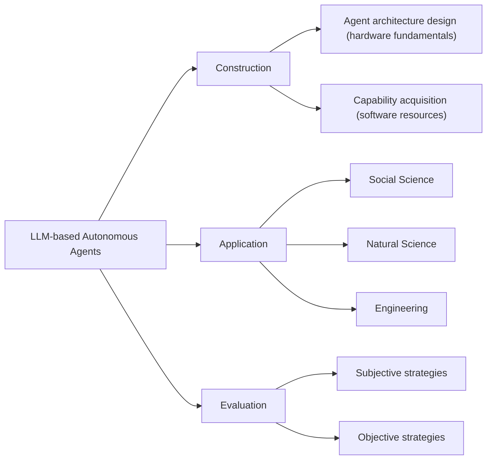
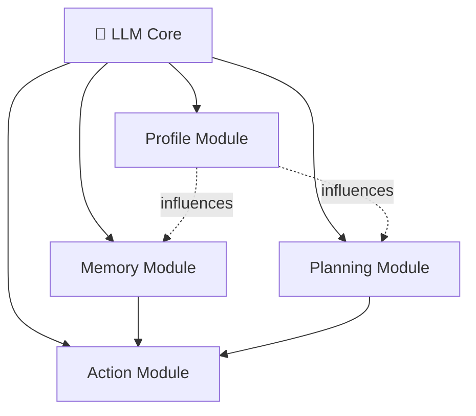
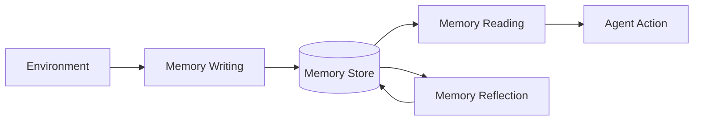
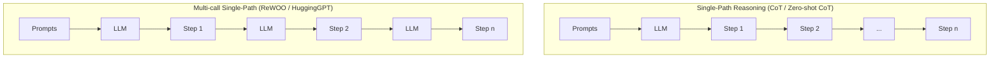
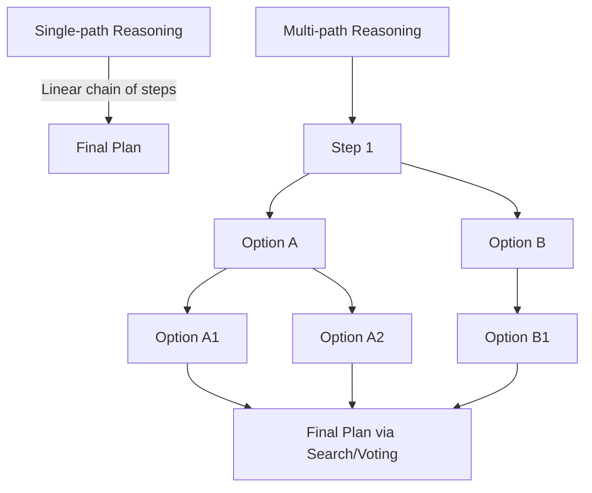
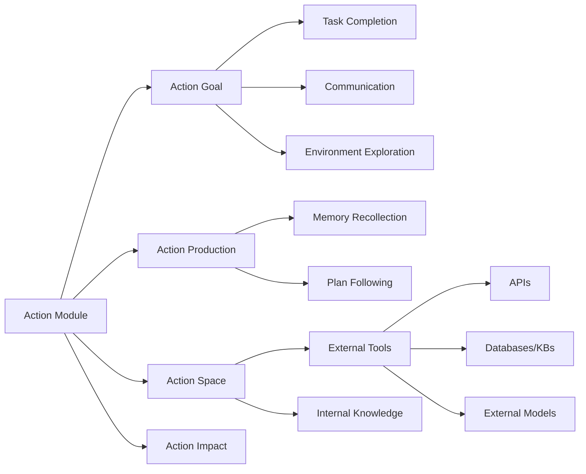
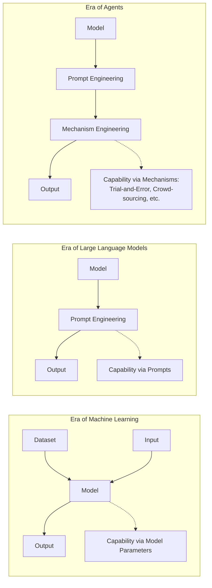
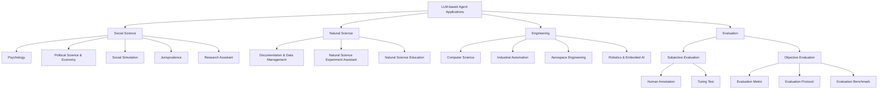
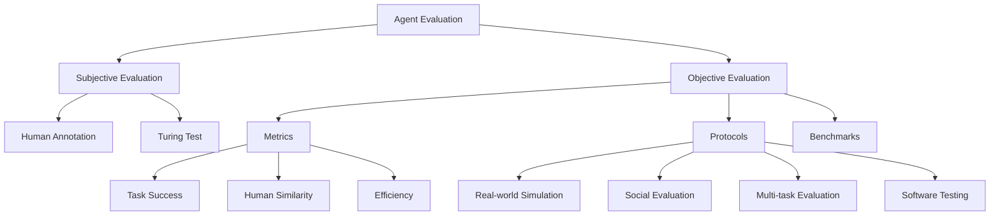

# A Survey on Large Language Model based Autonomous Agents

**Authors:** Lei Wang, Chen Ma*, Xueyang Feng*, Zeyu Zhang, Hao Yang, Jingsen Zhang, Zhi-Yuan Chen, Jiakai Tang, Xu Chen(B), Yankai Lin(B), Wayne Xin Zhao, Zhewei Wei, Ji-Rong Wen

*Gaoling School of Artificial Intelligence, Renmin University of China, Beijing, 100872, China*

> Front. Comput. Sci., 2025, 0(0): 1–42 · https://doi.org/10.1007/s11704-024-40231-1 · © Higher Education Press 2025

## 📌 Abstract

Autonomous agents have long been a research focus in academic and industry communities. Previous research often trains agents with limited knowledge within isolated environments, which diverges from human learning processes and makes agents hard-pressed to achieve human-like decisions.

With the rise of large language models (LLMs) — which encode vast amounts of web knowledge and show potential for human-level intelligence — research on **LLM-based autonomous agents** has surged. This survey:

- Proposes a **unified framework** for the *construction* of LLM-based autonomous agents.
- Reviews the diverse **applications** of these agents across social science, natural science, and engineering.
- Examines common **evaluation strategies** for LLM-based agents.
- Discusses open **challenges** and **future directions**.

**Keywords:** Autonomous agent, Large language model, Human-level intelligence

---

## 1. Introduction

> "An autonomous agent is a system situated within and a part of an environment that senses that environment and acts on it, over time, in pursuit of its own agenda and so as to effect what it senses in the future."
> — Franklin and Graesser (1997)

### 🔬 Background & Motivation

- Autonomous agents are viewed as a promising route to **artificial general intelligence (AGI)**, achieving tasks through self-directed planning and action.
- Prior agents relied on **simple, heuristic policy functions** learned in isolated, restricted environments — a poor match for the complexity of human learning, which draws on a much wider variety of environments.
- As a result, earlier agents fall short of human-level decision-making, especially in **open-domain, unconstrained settings**.

### Why LLMs Change the Picture

LLMs have shown strong potential for human-like intelligence, driven by large training datasets and model scale. This has spurred a research direction using **LLMs as central controllers** for autonomous agents. Compared to reinforcement learning-based agents, LLM-based agents offer:

1. **Richer internal world knowledge** — informed actions without needing domain-specific training.
2. **Natural language interfaces** — greater flexibility and explainability in human interaction.

The key idea across recent models is equipping LLMs with human-like capabilities — **memory** and **planning** — so they can behave like humans across varied tasks. These models were largely developed independently, motivating this survey's systematic, holistic summary.

🖼️ **Figure 1:** A timeline chart showing the cumulative growth of papers on LLM-based autonomous agents from January 2021 to August 2023, colored by agent category (General, Tool, Simulation, Embodied, Game, Web, Assistant). Notable milestones plotted include WebGPT (2021-12), CoT (2022-01), TALM (2022-05), WebShop / Inner Monologue (2022-07), Toolformer / DEPS / HuggingGPT (2023-02), AutoGPT (2023-03), AgentGPT / Generative Agent (2023-04), GITM / ToT / Voyager (2023-05), MIND2WEB / RecAgent (2023-06), CO-LLM / ChatDev / ToolLLaMA (2023-07), and AgentSims (2023-08) — illustrating a sharply accelerating research trend.

### 📌 Survey Organization

The survey is organized around three key aspects of LLM-based autonomous agents:

For **construction**, the survey addresses two problems:

- **Architecture design** — how to structure LLMs into an agent (analogous to designing a network's structure).
- **Capability acquisition** — how the agent gains the ability to complete tasks, whether or not the underlying LLM is fine-tuned (analogous to learning network parameters).

---

## 2. LLM-based Autonomous Agent Construction

Two central questions drive this section:

1. Which **architecture** best leverages LLMs for agent behavior?
2. Given that architecture, how does the agent **acquire capabilities** to accomplish specific tasks?

### 2.1 Agent Architecture Design

LLMs excel at question-answering, but autonomous agents require more: fulfilling specific roles, and autonomously perceiving and learning from an environment to evolve over time. The survey proposes a **unified framework** with four modules:

| Module | Purpose |
|---|---|
| **Profile** | Identifies the role of the agent |
| **Memory** | Places the agent in a dynamic environment; recalls past behaviors |
| **Planning** | Places the agent in a dynamic environment; plans future actions |
| **Action** | Translates the agent's decisions into concrete outputs |

The profiling module influences memory and planning; together, all three influence the action module.

🖼️ **Figure 2:** A unified framework diagram showing four modules (Profile, Memory, Planning, Action) branching from a central LLM icon, each expanded into sub-components as detailed below.

#### 2.1.1 Profiling Module

Agents typically perform tasks by assuming specific roles (e.g., coders, teachers, domain experts). The profiling module defines this role and is usually embedded directly into the prompt.

**Typical profile contents:**
- Demographic information (age, gender, career)
- Personality/psychology information
- Social information (relationships between agents)

The choice of profile content depends on the application — e.g., psychology traits matter more when studying human cognition.

**Three profile generation strategies:**

1. **Handcrafting Method** — profiles are manually specified (e.g., "you are an outgoing person").
   - Used by *Generative Agent* (name, objectives, relationships), *MetaGPT*, *ChatDev*, *Self-collaboration* (predefined software-development roles), *PTLLM* (personality traits via tools like IPIP-NEO, BFI), and studies prompting LLMs as politicians/journalists/businesspeople.
   - ✅ Flexible — any profile info can be assigned.
   - ⚠️ **Limitation:** labor-intensive at scale.

2. **LLM-generation Method** — profiles are generated automatically by an LLM from generation rules and optional seed examples.
   - Example: *RecAgent* hand-crafts a few seed profiles (age, gender, traits, movie preferences), then uses ChatGPT to generate more.
   - ✅ Greatly reduces effort for large-scale populations.
   - ⚠️ **Limitation:** less precise control — can produce inconsistent or off-target profiles.

3. **Dataset Alignment Method** — profiles are derived from real-world datasets, converted into natural language prompts.
   - Example: assigning GPT-3 roles based on demographic backgrounds (race/ethnicity, gender, age, state of residence) from the American National Election Studies (ANES), then testing whether GPT-3 mirrors real human response patterns.
   - ✅ Accurately reflects real-world population attributes.

> **Remark:** These strategies can be combined — e.g., using real datasets to profile a subset of agents (reflecting current society) while manually assigning novel, forward-looking roles to other agents to simulate future social developments.

#### 2.1.2 Memory Module

## 🧠 Memory Structures

LLM-based autonomous agents draw inspiration from human memory: **sensory → short-term → long-term** memory. In agent design:

- **Short-term memory** ≈ the context window (transformer input constraint)
- **Long-term memory** ≈ external vector storage, queried/retrieved as needed

### Unified Memory

> Simulates only short-term memory, realized via in-context learning — memory is written directly into prompts.

| Agent | Domain | Short-term Memory Basis |
|---|---|---|
| RLP | Conversation | Internal speaker/listener states |
| SayPlan | Embodied task planning | Scene graphs + environment feedback |
| CALYPSO | D&D narration | Scene descriptions, monster info, prior summaries |
| DEPS | Minecraft | Generated task plans |

📌 **Key Point:** Easy to implement, but limited by context window size — pushes research toward hybrid systems.

### Hybrid Memory

> Explicitly models **both** short-term (recent perceptions) and long-term (consolidated) memory.

| Agent | Long-term Memory Approach |
|---|---|
| Generative Agent | Stores past behaviors/thoughts, retrieved via current events |
| AgentSims | Vector database of embedded daily memories |
| GITM | Reference plans summarized from successful trajectories |
| Reflexion | Sliding window (short-term) + persistent condensed insights (long-term) |
| SCM | Selectively activates relevant long-term knowledge |
| SimplyRetrieve | Query = short-term; private knowledge base = long-term |
| MemorySandbox | Shared memory objects across conversations (drag-and-drop) |

> 💡 **Remark:** Long-term-only memory structures are rarely seen in the literature — likely because agents operate in continuous, dynamic environments where short-term memory capture is essential and can't be skipped.

---

## 🗂️ Memory Formats

Different storage mediums suit different needs:

### Natural Languages
- Memory expressed as raw, flexible, semantically rich text.
- Examples: **Reflexion** (feedback in a sliding window), **Voyager** (skill descriptions for Minecraft).

### Embeddings
- Memory encoded as vectors for efficient retrieval.
- Example: **MemoryBank** — dual-tower dense retrieval over embedded memory segments.

### Databases
- Memory stored/manipulated via structured queries.
- Example: **ChatDB** — uses SQL to add/delete/modify memory.

### Structured Lists
- Memory organized as concise lists.
- Examples: **GITM** (hierarchical tree of action lists per sub-goal), **RET-LLM** (natural language → triplet phrases).

> 💡 **Remark:** Formats aren't mutually exclusive. **GITM** combines them: keys = embeddings (efficient retrieval), values = natural language (rich content).

---

## ⚙️ Memory Operations

Three core operations connect the agent to its environment:

### 1. Memory Reading

📌 **Goal:** Extract the most useful information to guide agent action, scored by **recency**, **relevance**, and **importance**.

$$
m^* = \arg\max_{m \in M} \left( \alpha \, s^{rec}(q, m) + \beta \, s^{rel}(q, m) + \gamma \, s^{imp}(m) \right)
$$

Where:
- $q$ = query (task or context)
- $M$ = set of all memories
- $s^{rec}, s^{rel}, s^{imp}$ = scoring functions for recency, relevance, importance
- $\alpha, \beta, \gamma$ = balancing weights (importance is independent of $q$)

- Setting $\alpha = \gamma = 0$ → relevance-only reading (used by several studies)
- Setting $\alpha = \beta = \gamma = 1.0$ → equal weighting (Generative Agent)

### 2. Memory Writing

📌 **Goal:** Store perceived environmental info for future use. Two key challenges:

**(1) Memory Duplication**
- **GITM**: once a sub-goal's action list hits N=5, sequences are condensed via LLM into one unified plan, replacing originals.
- **Augmented LLM**: aggregates duplicates via count accumulation instead of redundant storage.

**(2) Memory Overflow**
- **ChatDB**: explicit deletion via user commands.
- **RET-LLM**: fixed-size FIFO buffer, overwrites oldest entries.

### 3. Memory Reflection

📌 **Goal:** Agent self-summarizes/infers high-level abstractions from raw memories — mimicking human self-evaluation.

**Generative Agent** process:
1. Generate key questions from recent memories
2. Query memory using those questions
3. Synthesize higher-level insights

> **Example:** low-level memories *"writing a research paper"*, *"engaging with a librarian"*, *"conversing about research"* → high-level insight: *"dedicated to research."*

- Reflection can be **hierarchical** (insights built from other insights).
- **GITM**: summarizes >5 successful actions into an abstract pattern, replacing raw entries.
- **ExpeL**: reflects via (a) comparing successful vs. failed trajectories, and (b) learning from collections of successful trajectories.

⚠️ Memory alone isn't enough — agents also need a **planning module** to guide future actions, discussed next.

---

## 🧭 Planning Module

Agents decompose complex tasks into subtasks, similar to human problem-solving. Studies are categorized by **whether feedback influences future planning**.

### Planning without Feedback

#### Single-Path Reasoning

| Method | Approach |
|---|---|
| **CoT** | Reasoning steps as in-prompt examples; one-shot step generation |
| **Zero-shot-CoT** | Triggers ("think step by step") without example steps |
| **Re-Prompting** | Checks step prerequisites; regenerates plan on failure |
| **ReWOO** | Separates plan generation from observation gathering, then combines |
| **HuggingGPT** | Decomposes task into sub-goals, solves each via Huggingface models |
| **SWIFTSAGE** | Dual-process: SWIFT = fast pattern-based responses; SAGE = deep LLM-based planning |

🖼️ Figure: Diagram comparing single-path reasoning (CoT, ReWOO/HuggingGPT — linear step chains) vs. multi-path reasoning (CoT-SC — parallel independent chains; ToT/LMZSP/RAP — branching tree of steps), illustrated as flow/tree diagrams.

### 📌 Multi-path Reasoning

Reasoning steps are organized into a **tree-like structure**, where each intermediate step may branch into multiple subsequent steps — analogous to how humans consider multiple options at each decision point.

- **CoT-SC (Self-consistent CoT)** [51] — generates multiple reasoning paths via CoT, then selects the most frequent answer as the final output.
- **Tree of Thoughts (ToT)** [52] — represents each "thought" (intermediate reasoning step) as a tree node; LLMs evaluate nodes to guide **BFS/DFS** search. Unlike CoT-SC (all steps generated together), ToT queries the LLM per reasoning step.
- **RecMind** [53] — uses a self-inspiring mechanism where discarded historical planning information is reused to derive new reasoning steps.
- **GoT (Graph of Thoughts)** [54] — extends ToT's tree structure into a **graph structure** for more powerful prompting.
- **AoT** [55] — incorporates algorithmic examples into prompts, needing only one or a few LLM queries.
- **[44]** — LLMs as zero-shot planners: generate multiple candidate next steps, then pick the final one based on distance to admissible actions.
- **[56]** — improves [44] by adding query-similar examples to prompts.
- **RAP** [57] — builds a world model to simulate plan outcomes via **Monte Carlo Tree Search (MCTS)**, aggregating multiple MCTS iterations into a final plan.

### 📌 External Planner

For domain-specific problems where zero-shot LLM planning struggles, researchers offload planning to **external, well-developed search algorithms**:

- **LLM+P** [58] — converts task descriptions to **PDDL** (Planning Domain Definition Language) → external planner solves it → LLM converts result back to natural language.
- **LLM-DP** [59] — LLMs convert observations, world state, and objectives into PDDL, which an external planner processes into an action sequence.
- **CO-LLM** [22] — LLMs excel at high-level plans but struggle with low-level control; a heuristic external low-level planner executes actions based on the high-level plan.

---

## Planning with Feedback

For long-horizon tasks, feedback-free planning modules become less effective because:

1. Generating a flawless plan upfront is difficult (many complex preconditions).
2. Unpredictable transition dynamics during execution can render the initial plan non-executable.

Humans iteratively revise plans based on feedback — agents simulate this via feedback from **environments**, **humans**, and **models**.

### 🔬 Environmental Feedback

Feedback from the objective/virtual world (e.g., task completion signals, post-action observations).

| Method | Feedback Mechanism |
|---|---|
| **ReAct** [60] | Thought-act-observation triplets; observations (e.g., search results) shape the next thought |
| **Voyager** [38] | Incorporates program execution progress, execution errors, and self-verification results |
| **Ghost** [16] | Uses environment states plus success/failure info per executed action |
| **SayPlan** [31] | Uses a scene graph simulator to validate/refine plans, iterating until viable |
| **DEPS** [33] | Provides detailed failure *reasons* (not just completion status) to enable better plan revision |
| **LLM-Planner** [61] | Grounded re-planning that updates plans on object mismatches/unattainable plans |
| **Inner Monologue** [62] | Three feedback types: task success, passive scene description, active scene description |

### 🔬 Human Feedback

A **subjective signal** that aligns agents with human values/preferences and helps reduce hallucination.

- **Inner Monologue** [62] — agent performs high-level instructions in a 3D visual environment and actively solicits human feedback on scene descriptions, incorporating it into prompts. (Also combines environment + human feedback simultaneously.)

### 🔬 Model Feedback

Internal feedback generated by pre-trained models themselves (not external signals):

- **Self-refine** [63] — three-component loop: *output → feedback → refinement*, iterating until a desired condition is reached.
- **SelfCheck** [64] — agent examines/evaluates its own reasoning steps at various stages and corrects errors via outcome comparison.
- **InterAct** [65] — uses different LLMs (e.g., ChatGPT, InstructGPT) as auxiliary checkers/sorters to help the main LLM avoid erroneous/inefficient actions.
- **ChatCoT** [66] — an evaluation module monitors reasoning steps and generates feedback to improve reasoning quality.
- **Reflexion** [12] — agent produces an action from memory; an evaluator generates **detailed verbal feedback** (vs. scalar feedback) from the agent's trajectory, giving richer support for planning.

> ⚠️ **Remark:** Planning *without* feedback is simple to implement but only suits tasks needing few reasoning steps. Planning *with* feedback requires more careful design but is far more powerful for complex, long-range reasoning tasks.

---

## 2.1.4 Action Module

The **action module** translates the agent's decisions into concrete outcomes — the most downstream module, directly interacting with the environment, and shaped by the profile, memory, and planning modules.

Four perspectives:

1. **Action goal** — before-action: intended outcomes
2. **Action production** — before-action: how actions are generated
3. **Action space** — in-action: available actions
4. **Action impact** — after-action: consequences

### 📌 Action Goal

- **Task Completion** — actions aimed at accomplishing well-defined tasks (e.g., crafting an iron pickaxe in Minecraft [38], completing a software function [18]). The most common goal type in the literature.
- **Communication** — actions taken to communicate with other agents or humans for information sharing/collaboration (e.g., agents in **ChatDev** [18] communicating to jointly build software; **Inner Monologue** [62] adjusting strategy based on human feedback).
- **Environment Exploration** — actions aimed at exploring unfamiliar environments, balancing exploration vs. exploitation (e.g., **Voyager** [38] exploring unknown skills and refining execution code via trial and error).

### 📌 Action Production

1. **Action via Memory Recollection** — actions generated by retrieving relevant info from agent memory given the current task.
   - **Generative Agents** [20] — retrieves recent, relevant, important memories before each action.
   - **GITM** [16] — queries memory for prior successful experiences on similar sub-goals; reuses successful past actions directly if found.
   - **ChatDev** [18] / **MetaGPT** [23] — conversation history is stored in memory and influences each agent utterance.
2. **Action via Plan Following** — actions follow pre-generated plans.
   - **DEPS** [33] — agent strictly follows its plan unless there are signals of plan failure.
   - **GITM** [16] — decomposes tasks into sub-goals via high-level plans, then acts on each sub-goal sequentially.

### 📌 Action Space

Two broad classes: **(1) external tools** and **(2) internal LLM knowledge**.

#### 🔧 External Tools

Used to compensate for LLMs' lack of expert domain knowledge and to mitigate hallucination.

**(1) APIs**

| Method | Contribution |
|---|---|
| HuggingGPT [13] | Integrates HuggingFace's model ecosystem for complex tasks |
| WebGPT [67] | Auto-generates queries to extract content from web pages |
| TPTU [68] | Strategic task planning + API-based tools |
| Gorilla [69] | Fine-tuned LLM generating precise API call arguments, reducing hallucination |
| ToolFormer [15] | Self-supervised learning of when/how to invoke tools |
| API-Bank [70] | Benchmark + training datasets for tool-augmented LLMs |
| ToolLLaMA [14] | Tool-use framework: data collection, training, evaluation |
| RestGPT [71] | Connects LLMs with RESTful APIs per web standards |
| TaskMatrix.AI [72] | Multimodal foundation model connecting LLMs to a broad API ecosystem |

**(2) Databases & Knowledge Bases**

- **ChatDB** [40] — uses SQL statements to query databases for logical action-taking.
- **MRKL** [73] / **OpenAGI** [74] — incorporate expert systems (knowledge bases, planners) for domain-specific info.

**(3) External Models**

- **ViperGPT** [75] — uses Codex to generate Python code from text, then executes it.
- **ChemCrow** [76] — chemical agent for organic synthesis, drug discovery, material design; uses 17 expert-designed models.
- **MM-REACT** [77] — integrates VideoBERT (video summarization), X-decoder (image generation), SpeechBERT (audio processing) for multimodal tasks.

#### 🧠 Internal Knowledge

LLMs relying solely on their own internal knowledge to guide actions:

- **Planning Capability** — LLMs act as decent planners, decomposing complex tasks into simpler ones [45], even without in-prompt examples [46].
  - **DEPS** [33] — Minecraft agent solving complex tasks via sub-goal decomposition.
  - **GITM** [16], **Voyager** [38] — also heavily rely on this planning capability.

### 📌 LLM Capabilities Enabling Agent Behavior (cont.)

- **Conversation Capability** — LLMs generate high-quality conversations, letting agents behave more like humans.
  - *ChatDev*: agents discuss the software development process and reflect on their own behaviors.
  - *RLP*: an agent communicates with listeners based on predicted feedback on its utterances.
- **Common Sense Understanding Capability** — LLMs comprehend human common sense, enabling agents to simulate daily life and make human-like decisions.
  - *Generative Agent*: understands current state, surrounding environment, and summarizes high-level ideas from observations.
  - Similar conclusions apply to *RecAgent* and *S3*, which simulate user social behaviors.

### 📌 Action Impact

The consequences of an agent's actions generally fall into three categories:

1. **Changing Environments** — actions directly alter environment states (moving, collecting items, constructing buildings).
   > e.g., in *GITM* and *Voyager*, harvesting resources removes them from the environment.
2. **Altering Internal States** — actions change the agent itself (updating memories, forming plans, acquiring knowledge).
   > e.g., *Generative Agents* update memory streams after actions; *SayCan* updates environment understanding.
3. **Triggering New Actions** — one action often leads to subsequent actions.
   > e.g., in *Voyager*, gathering resources triggers building construction.

---

## 2.2 Agent Capability Acquisition

Agent architecture is the "hardware" enabling LLMs to accomplish tasks, but agents also need task-specific **capabilities, skills, and experience** — the "software." Strategies for equipping agents with these resources fall into two classes based on whether they require fine-tuning.

### 🔬 Capability Acquisition *with* Fine-tuning

Datasets used for fine-tuning can come from human annotation, LLM generation, or real-world applications.

#### Fine-tuning with Human Annotated Datasets
- **CoH** — aligns LLMs with human values/preferences by converting human feedback into detailed natural-language comparison information (rather than simple symbolic feedback).
- **RET-LLM** — fine-tunes LLMs on human-constructed "triplet–natural language" pairs to convert natural language into structured memory.
- **WebShop** — collects 1.18M real-world Amazon products onto a simulated e-commerce site; 13 workers generate real human shopping behavior data, used to train heuristic-rule, imitation-learning, and RL-based methods.
- **EduChat** — fine-tunes LLMs on human-annotated educational datasets to support QA, essay assessment, Socratic teaching, and emotional support.

#### Fine-tuning with LLM Generated Datasets
Cheaper and more scalable than human annotation, though lower quality.
- **ToolBench** — collects 16,464 real-world APIs (49 categories) from RapidAPI Hub, uses ChatGPT to generate diverse single-/multi-tool instructions, then fine-tunes LLaMA for improved tool use.
- **Social sandbox method [83]** — a central agent generates responses to a social question, shares them with nearby agents for feedback, and revises responses accordingly; the resulting social interaction data is used for fine-tuning.

#### Fine-tuning with Real-world Datasets
- **MIND2WEB** — collects 2,000+ open-ended tasks from 137 real-world websites across 31 domains to fine-tune LLMs for web-related tasks (e.g., movie discovery, ticket booking).
- **SQL-PaLM** — fine-tunes PaLM-2 on cross-domain text-to-SQL datasets (Spider, BIRD), improving text-to-SQL performance.

### 🔬 Capability Acquisition *without* Fine-tuning

In the LLM era, capability can be acquired via:
1. Training/fine-tuning model parameters, **or**
2. Designing delicate prompts (prompt engineering)

🖼️ *Figure 4 (rendered above as diagram): Illustration of transitions in strategies for acquiring model capabilities — from parameter learning (ML era), to prompt engineering (LLM era), to mechanism engineering (agent era).*

In the agent era, capability can be acquired via three strategies:
1. **Model fine-tuning**
2. **Prompt engineering**
3. **Mechanism engineering** — designing agent evolution mechanisms (specialized modules, novel working rules, etc.)

#### 🧩 Prompt Engineering
Describing desired capability in natural language and using it as a prompt to influence LLM actions.
- **CoT**, **CoT-SC**, **ToT** — present intermediate reasoning steps as few-shot examples to enable complex task reasoning.
- **RLP** — enhances an agent's self-awareness by prompting with beliefs about its own and listeners' mental states, producing more engaging and strategic utterances.
- **Retroformer** — a retrospective model generating reflections on past failures, integrated into prompts to guide future actions; uses RL to iteratively refine the retrospective model.

#### 🧩 Mechanism Engineering
A capability-enhancement strategy distinct from fine-tuning and prompting. Representative methods:

1. **Trial-and-Error** — the agent acts, a pre-defined critic judges the action, and the agent incorporates feedback if unsatisfactory.
   - *RAH*: compares a predicted user response to real feedback; discrepancies generate failure info for the next action.
   - *DEPS*: an explainer generates failure-cause details for plan redesign when an action fails.
   - *RoCo*: multi-robot plans/waypoints validated by environment checks (collision detection, inverse kinematics); failures trigger further agent dialogue until validation passes.
   - *PREFER*: extends this via LLM-generated detailed feedback for iterative refinement.

2. **Crowd-sourcing** — leverages the wisdom of multiple agents.
   - *[94]*: a debating mechanism where agents give separate responses and iteratively incorporate others' solutions until reaching consensus.

3. **Experience Accumulation** — capability grows via memory of past task executions.
   - *GITM*: stores successful task actions in agent memory for reuse on similar future tasks.
   - *Voyager*: introduces a skill library of executable code refined through environment interaction.
   - *AppAgent*: learns via autonomous exploration and observation of human demonstrations, building a knowledge base for app tasks.
   - *MemPrompt*: stores user natural-language feedback on problem-solving intent in memory, retrieved for similar future tasks.

4. **Self-driven Evolution** — autonomous improvement through self-directed learning and feedback.
   - *LMA3*: agent autonomously sets its own goals, improving via environment exploration and reward-function feedback.
   - *S-ALLM-MS*: integrates advanced LLMs (e.g., GPT-4) into a multi-agent system for adaptive performance.

---

### 📊 Table: Representative Agent Papers by Module Design

**Legend:**
- *Profile*: ① handcrafting, ② LLM-generation, ③ dataset alignment
- *Memory – Operation*: ① read/write, ② read/write/reflection
- *Memory – Structure*: ① unified, ② hybrid
- *Planning*: ① w/o feedback, ② w/ feedback
- *Action*: ① no tools, ② uses tools
- *CA (Capability Acquisition)*: ① with fine-tuning, ② without fine-tuning
- "-" = not explicitly discussed

| Model | Profile | Memory (Op) | Memory (Struct) | Planning | Action | CA | Time |
|---|---|---|---|---|---|---|---|
| WebGPT | - | - | - | - | ② | ① | 12/2021 |
| SayCan | - | - | - | ① | ① | ② | 04/2022 |
| MRKL | - | - | - | ① | ② | - | 05/2022 |
| Inner Monologue | - | - | - | ② | ① | ② | 07/2022 |
| Social Simulacra | ② | - | - | - | ① | - | 08/2022 |
| ReAct | - | - | - | ② | ② | ① | 10/2022 |
| MALLM | - | ① | ② | - | ① | - | 01/2023 |
| DEPS | - | - | - | ② | ① | ② | 02/2023 |
| Toolformer | - | - | - | ① | ② | ① | 02/2023 |
| Reflexion | - | ② | ② | ② | ① | ② | 03/2023 |
| CAMEL | ① | ② | - | - | ② | ① | 03/2023 |
| API-Bank | - | - | - | ② | ② | ② | 04/2023 |
| ViperGPT | - | - | - | - | ② | - | 03/2023 |
| HuggingGPT | - | ① | ① | ① | ② | - | 03/2023 |
| Generative Agents | ① | ② | ② | ② | ① | - | 04/2023 |
| LLM+P | - | - | - | ① | ① | - | 04/2023 |
| ChemCrow | - | - | - | ② | ② | - | 04/2023 |
| OpenAGI | - | - | - | ② | ② | ① | 04/2023 |
| AutoGPT | - | ① | ② | ② | ② | ② | 04/2023 |
| SCM | - | ② | ② | - | ① | - | 04/2023 |
| Socially Alignment | - | ① | ② | - | ① | ① | 05/2023 |
| GITM | - | ② | ② | ② | ① | ② | 05/2023 |
| Voyager | - | ② | ② | ② | ① | ② | 05/2023 |
| Introspective Tips | - | - | - | ② | ① | ② | 05/2023 |
| RET-LLM | - | ① | ② | - | ① | ① | 05/2023 |
| ChatDB | - | ① | ② | ② | ② | - | 06/2023 |
| S3 | ③ | ② | ② | - | ① | - | 07/2023 |
| ChatDev | ① | ② | ② | ② | ① | ② | 07/2023 |
| ToolLLM | - | - | - | ② | ② | ① | 07/2023 |
| MemoryBank | - | ② | ② | - | ① | - | 07/2023 |
| MetaGPT | ① | ② | ② | ② | ② | - | 08/2023 |

## 2.x Capability Acquisition Strategies (cont.)

- **CLMTWA**: uses a large LLM as *teacher* and a weaker LLM as *student*
  - Teacher generates natural language explanations to improve student reasoning via theory of mind
  - Personalizes explanations; intervenes only when expected utility justifies it
- **NLSOM**: agents collaborate via natural language, dynamically adjusting roles/tasks/relationships based on feedback to solve problems beyond a single agent's scope

> 📌 **Remark**: Fine-tuning adjusts model parameters and can absorb large amounts of task-specific knowledge, but only works for open-source LLMs. Non-fine-tuning methods (prompting/mechanism engineering) work for both open- and closed-source LLMs, but are limited by context window size, and the design space of prompts/mechanisms is huge — making optimal solutions hard to find.

---

# 3 LLM-based Autonomous Agent Applications

Owing to strong language comprehension, complex task reasoning, and common-sense understanding, LLM-based agents show significant potential across domains. This section groups applications into three areas:

1. Social Science
2. Natural Science
3. Engineering

## 3.1 Social Science

Social science studies societies and relationships among individuals. LLM-based agents contribute via human-like understanding, thinking, and task-solving.

### 🧠 Psychology

- Agents assigned different profiles can complete psychology experiments, producing results aligning with human-participant studies
- **Finding**: larger models tend to give more accurate simulation results
- **Hyper-accuracy distortion**: models like ChatGPT/GPT-4 can produce *too perfect* estimates, potentially affecting downstream applications
- A study analyzing conversational agents for **mental well-being support** (120 Reddit posts) found:
  - ✅ Agents help users cope with anxiety, social isolation, depression
  - ⚠️ Agents may sometimes produce harmful content

### 🗳️ Political Science and Economy

- Agents used for **ideology detection** and **predicting voting patterns**
- Used to analyze **discourse structure and persuasive elements** of political speech
- Agents given traits (talents, preferences, personalities) to explore **simulated human economic behavior**

### 🌐 Social Simulation

Simulating human societies is often expensive, unethical, or infeasible — LLM agents enable virtual alternatives.

| System | Focus |
|---|---|
| Social Simulacra | Simulates online social community to aid decision-makers improve regulations |
| Generative Agents / AgentSims | Multi-agent virtual town simulating daily human life |
| SocialAI School | Simulates social cognitive skills during child development |
| S³ | Social network simulator — propagation of information, emotion, attitude |
| CGMI | Multi-agent simulation maintaining personality via tree structure + cognitive model (simulated a classroom scenario) |

### ⚖️ Jurisprudence

- Agents assist legal decision-making processes
  - **Blind Judgement**: multiple LLMs simulate multiple judges' decision-making, consolidating opinions via voting
  - **ChatLaw**: prominent Chinese legal LLM model
    - Supports database + keyword search strategies to mitigate hallucination
    - Uses self-attention mechanism to reduce reference inaccuracies

### 📚 Research Assistant

- Assist with generating article abstracts, extracting keywords, crafting study scripts
- Act as writing assistants that help identify novel research questions for social scientists

---

## 3.2 Natural Science

Natural science concerns description, understanding, and prediction of natural phenomena via empirical evidence.

### 🗂️ Documentation and Data Management

- Agents query/utilize internet information for QA and experiment planning
- **ChatMOF**: extracts info from text descriptions, plans tool use to predict properties/structures of metal-organic frameworks
- **ChemCrow**: uses chemistry databases to validate compound representations and identify dangerous substances

### 🔬 Experiment Assistant

- Agents can independently design, plan, and execute scientific experiments
  - Given an objective → retrieves documents from internet → uses Python for calculations → runs experiments
- **ChemCrow**: 17 specialized tools for chemical research; recommends experimental procedures and flags safety risks

### 🎓 Natural Science Education

- Agent-based education systems help students learn experimental design, methodology, analysis
- **Math Agents**: assist in exploring, discovering, solving, proving mathematical problems
- CodeX-based systems: solve/explain university-level math problems
- **CodeHelp**: programming education agent — course-specific keywords, monitors student queries, gives feedback
- **EduChat**: personalized, equitable, empathetic educational support for teachers/students/parents
- **FreeText**: automatically assesses open-ended student responses and gives feedback

---

## 3.3 Engineering

### 💻 Computer Science & Software Engineering

Agents automate coding, testing, debugging, documentation generation.

- **ChatDev**: end-to-end framework — multiple agent roles collaborate via natural language through the software development lifecycle
- **MetaGPT**: abstracts roles (product manager, architect, project manager, engineer) to supervise code generation
- **Self-collaboration framework**: multiple LLMs act as distinct "experts," forming a virtual team for code generation without human intervention
- **LLIFT**: static analysis for code vulnerability identification, balancing accuracy vs. scalability
- **ChatEDA**: electronic design automation agent — task planning, script generation, execution
- **CodeHelp**: debugging/testing assistant — explains errors, suggests fixes
- **PentestGPT**: penetration testing tool — identifies vulnerabilities, develops exploits from source code
- **D-Bot**: diagnoses database anomalies using a *tree of thought* approach, allowing backtracking to previous steps

### 🏭 Industrial Automation

- Framework integrating LLMs with **digital twin systems** for flexible production
  - Uses prompt engineering to adapt agents to tasks based on digital-twin info
  - Coordinates atomic functionalities/skills across production levels
- **IELLM**: case study of LLMs in oil & gas industry (factory automation, PLC programming)

### 🤖 Robotics & Embodied AI

---

### 📊 Table: Representative Applications (Table 2)

| Domain | Subcategory | Representative Work |
|---|---|---|
| Social Science | Psychology | TE, Akata et al., Ziems et al., Ma et al. |
| Social Science | Political Science & Economy | Argyle et al., Horton, Ziems et al. |
| Social Science | Social Simulation | Social Simulacra, Generative Agents, SocialAI School, AgentSims, S³, Williams et al., Li et al., Chao et al. |
| Social Science | Jurisprudence | ChatLaw, Blind Judgement |
| Social Science | Research Assistant | Ziems et al., Bail et al. |
| Natural Science | Documentation & Data Management | ChemCrow, ChatMOF, Boiko et al. |
| Natural Science | Experiment Assistant | ChemCrow, Boiko et al., Grossmann et al. |
| Natural Science | Education | ChemCrow, CodeHelp, Boiko et al., MathAgent, Drori et al., EduChat, FreeText |
| Engineering | CS & SE | RestGPT, Self-collaboration, SQL-PALM, RAH, D-Bot, RecMind, ChatEDA, InteRecAgent, PentestGPT, CodeHelp, SmolModels, DemoGPT, GPTEngineer |
| Engineering | Industrial Automation | GPT4IA, IELLM |
| Engineering | Robotics & Embodied AI | ProAgent, LLM4RL, PET, REMEMBERER, DEPS, Unified Agent, SayCan, TidyBot, RoCo, SayPlan, TaPA, Dasgupta et al., DECKARD, Dialogue shaping |

## 🤖 LLM-based Agents in Embodied AI & Robotics

Recent work extends LLM-based autonomous agents into robotics and embodied AI, focusing on improving planning, reasoning, and collaboration in embodied environments.

- **Planner-Actor-Reporter paradigm** — proposed for embodied reasoning and task planning.
- **DECKARD** — also introduces the Planner-Actor-Reporter paradigm, decoupling planning, execution, and reporting.
- **TaPA** — builds a multimodal dataset (multi-view RGB images of indoor scenes + human instructions + plans) to fine-tune LLMs, aligning visual perception with task planning for more executable, visually grounded plans.

### 🦾 Skill-based Control for Physical Tasks

To overcome physical constraints, agents combine multiple skills to generate executable, long-horizon plans:

- **SayCan** — investigates manipulation and navigation skills with a mobile manipulator robot; presents **551 skills** across **7 skill families** and **17 objects** (picking, placing, grasping, manipulating, etc.), inspired by kitchen tasks.
- **TidyBot** — an embodied agent for personalized household cleanup; learns user preferences for object placement/manipulation via textual examples.

### 🧰 Open-Source Agent Frameworks

A growing ecosystem of open-source libraries lets developers quickly build and evaluate customized agents:

| Framework | Focus |
|---|---|
| **LangChain** | Automates coding, testing, debugging, documentation generation; integrates LMs with data sources and environments for multi-agent collaboration |
| **XLang** (built on LangChain) | Executable language grounding — converts natural language into code/action sequences for databases, web apps, robots |
| **AutoGPT** | Fully automated agent; sets goals, decomposes into tasks, cycles until goal completion |
| **WorkGPT** | Similar to AutoGPT/LangChain; converses back-and-forth with AI given an instruction + APIs |
| **GPT-Engineer** / **DemoGPT** | Automate code generation from prompts for development tasks |
| **SmolModels** | Family of compact LMs for various tasks |
| **AGiXT** | Dynamic AI automation platform; adaptive memory, smart features, plugin system |
| **AgentVerse** | Framework for building customized LLM-agent simulations |
| **GPT Researcher** | Develops research questions, crawls the web, summarizes and aggregates sources |
| **BMTools** | Community-driven tool building/sharing platform; supports multi-tool concurrent task execution |

> ⚠️ **Limitation / Risk**
> - LLMs can hallucinate, producing erroneous answers → incorrect conclusions, experimental failures, or safety risks in hazardous experiments. Users need domain expertise and caution.
> - LLM-based agents could be misused for malicious purposes (e.g., chemical weapons development), requiring safeguards like human alignment for responsible use.

---

## 📊 LLM-based Autonomous Agent Evaluation

Evaluating agent effectiveness is challenging; two main approaches exist: **subjective** and **objective** evaluation.

### 🧑‍⚖️ Subjective Evaluation

Measures agent capability via human judgment — useful when no evaluation dataset exists or quantitative metrics are hard to design (e.g., intelligence, user-friendliness).

- **Human Annotation**: Evaluators directly score/rank agent outputs.
  - Example: annotators asked 25 questions probing five key ability areas.
  - Example: annotators judge whether models enhance rule development in online communities.
- **Turing Test**: Evaluators try to distinguish agent output from human output; if they can't, the agent is deemed human-like.
  - Example: experiments on free-form partisan text, where evaluators guess human vs. agent origin.

> ⚠️ **Limitation**: Subjective evaluation is costly, inefficient, and subject to population bias.
>
> 📌 **Trend**: Researchers increasingly use LLMs themselves as evaluators:
> - **ChemCrow** — uses GPT to assess task completion and process accuracy.
> - **ChatEval** — employs multiple agents in a structured debate format to critique/assess candidate model outputs.

### 📐 Objective Evaluation

Uses quantitative, comparable, trackable metrics. Three key aspects: **metrics**, **protocols**, and **benchmarks**.

#### Metrics

1. **Task success metrics** — success rate, reward/score, coverage, accuracy/error rate (may reflect program executability or task validity). Higher = better task completion.
2. **Human similarity metrics** — coherence, fluency, dialogue similarity to humans, human acceptance rate. Higher = better human simulation.
3. **Efficiency metrics** — development cost, training efficiency.

#### Protocols

- **Real-world simulation**: Agents perform tasks autonomously in immersive environments (games, simulators); evaluated via task success rate and human similarity based on trajectories/objectives.
- **Social evaluation**: Assesses social intelligence via agent interactions in simulated societies — collaborative tasks (teamwork), debates (argumentative reasoning), human studies (social aptitude). Measures coherence, theory of mind, social IQ, cooperation, communication, empathy.
- **Multi-task evaluation**: Uses diverse tasks across domains to measure generalization in open-domain environments.
- **Software testing**: Agents perform tasks like generating test cases, reproducing bugs, debugging, interacting with developers/tools. Measured via test coverage and bug detection rate.

#### 📋 Benchmark Overview

> Legend — Subjective: ① Human Annotation, ② Turing Test. Objective: ① Real-world simulation, ② Social evaluation, ③ Multi-task evaluation, ④ Software testing. "✓" = evaluation based on benchmarks.

| Model | Subjective | Objective | Benchmark | Date |
|---|---|---|---|---|
| WebShop | – | ①③ | ✓ | 07/2022 |
| Social Simulacra | ① | ② | – | 08/2022 |
| TE | – | ② | – | 08/2022 |
| LIBRO | – | ④ | – | 09/2022 |
| ReAct | – | ① | ✓ | 10/2022 |
| Argyle et al. | ② | ②③ | – | 02/2023 |
| DEPS | – | ① | ✓ | 02/2023 |
| Jalil et al. | – | ④ | – | 02/2023 |
| Reflexion | – | ①③ | – | 03/2023 |
| IGLU | – | ① | ✓ | 04/2023 |
| Generative Agents | ① | – | – | 04/2023 |
| ToolBench | – | ③ | ✓ | 04/2023 |
| GITM | – | ① | ✓ | 05/2023 |
| Two-Failures | – | ③ | – | 05/2023 |
| Voyager | – | ① | ✓ | 05/2023 |
| SocKET | – | ②③ | ✓ | 05/2023 |
| MobileEnv | – | ①③ | ✓ | 05/2023 |
| Clembench | – | ①③ | ✓ | 05/2023 |
| Dialop | – | ③ | ✓ | 06/2023 |
| Feldt et al. | – | ④ | – | 06/2023 |
| CO-LLM | ① | ① | – | 07/2023 |
| Tachikuma | ① | ①③ | ✓ | 07/2023 |
| RocoBench | – | ①③ | ✓ | 07/2023 |
| AgentSims | – | ② | – | 08/2023 |
| AgentBench | – | ③ | ✓ | 08/2023 |
| BOLAA | – | ③ | ✓ | 08/2023 |
| Gentopia | – | ③ | ✓ | 08/2023 |
| EmotionBench | ① | – | ✓ | 08/2023 |
| PTB | – | ④ | – | 08/2023 |

#### 🏆 Notable Benchmarks

- **ALFWorld, IGLU, Minecraft** — common environments for interactive, task-oriented evaluation.
- **Tachikuma** — evaluates LLM ability to infer multi-character/novel-object interactions via TRPG game logs.
- **AgentBench** — first systematic framework assessing LLMs as agents across diverse real-world domains.
- **SocKET** — evaluates social capabilities across 58 tasks in 5 categories (humor/sarcasm, emotions, credibility, etc.).
- **AgentSims** — flexible framework for designing agent planning/memory/action strategies.
- **ToolBench** — tool-use benchmark with 16,464 real-world RESTful APIs, single- and multi-tool tasks.
- **WebShop** — product search/retrieval benchmark built from 1.18M real-world items.
- **Mobile-Env** — extendable platform for multi-step interaction evaluation.
- **WebArena** — comprehensive multi-domain website environment for end-to-end agent evaluation.
- **GentBench** — evaluates reasoning, safety, and efficiency in tool-using agents.
- **RocoBench** — 6 tasks evaluating multi-agent collaboration/coordination in cooperative robotics.
- **EmotionBench** — evaluates LLM emotion appraisal across 400+ situations eliciting 8 negative emotions.
- **PEB** — tailored for penetration testing scenarios; 13 diverse targets from leading platforms, structured by difficulty.
- **ClemBench** — 5 Dialogue Games assessing LLMs as players.
- **E2E** — end-to-end benchmark for chatbot accuracy and usefulness.

> ⚠️ **Limitation**: Current objective techniques cannot perfectly measure all agent capabilities, but they provide essential, complementary insights alongside subjective assessment. Continued benchmark/methodology advances will further improve evaluation.

## 5. Related Surveys

> With the growth of LLM research, several surveys have emerged covering adjacent but distinct territory.

- 📌 **Background & mainstream tech** — one survey extensively covers LLM background, findings, and mainstream techniques
- 📌 **Downstream applications** — another focuses on LLM applications in downstream tasks and deployment challenges
- 📌 **Human alignment** — a survey compiles alignment techniques, including data collection and training methodologies
- 📌 **Reasoning** — a survey covers the state of LLM reasoning research, including how to improve and evaluate it
- 📌 **Tool-augmented LMs (ALMs)** — a review of language models augmented with reasoning and tool-use ("Augmented Language Models")
- 📌 **Evaluation** — a survey addresses *what*, *where*, and *how* to evaluate LLMs across downstream tasks and societal impact
- 📌 **Capabilities & limitations** — another discusses LLM capabilities/limitations across downstream tasks

⚠️ **Gap identified**: None of the prior surveys specifically focus on **LLM-based Agents**. This paper compiles 100 relevant works on LLM-based Agents, covering construction, applications, and evaluation.

---

## 6. Challenges

While the field has seen remarkable successes, it remains nascent. Key open challenges:

### 6.1 Role-playing Capability

- Autonomous agents must convincingly play specific roles (coder, researcher, chemist, etc.), unlike general-purpose LLMs.
- **Problems:**
  - LLMs are trained on web corpora, so rarely-discussed or newly emerging roles are poorly simulated.
  - Existing LLMs may not model human cognitive psychology well, leading to a lack of self-awareness in conversation.
- **Potential solutions:**
  - Fine-tune LLMs on real-human data collected for uncommon roles/psychology profiles.
  - Design tailored agent prompts/architectures — though the design space is very large, making optimization hard.
- ⚠️ **Trade-off**: fine-tuning for uncommon roles risks degrading performance on common roles.

### 6.2 Generalized Human Alignment

- Traditional LLM alignment optimizes for a single set of "correct" human values (e.g., refusing to help plan harm).
- For **simulation** use cases, this is limiting: an ideal simulator should honestly depict *diverse* human traits — including negative ones.

> Simulating negative human aspects can be important: simulation's purpose is often to discover and solve problems, and without negative behavior there's nothing to solve.

- Example given: to simulate real-world society realistically, an agent might need to be allowed to plan something harmful (e.g., planning to make a bomb) purely to observe and study the behavior — informing real-world countermeasures.
- 📌 **Open problem**: how to achieve *generalized* human alignment — letting agents align with diverse (not just unified) values depending on application — since models like ChatGPT/GPT-4 are aligned to one unified value set.
- **Direction**: "realigning" models via careful prompting strategies for different purposes.

### 6.3 Prompt Robustness

- Agents typically combine multiple modules (memory, planning, etc.), each needing its own prompt — together forming a **prompt framework**, not a single prompt.
- Complications:
  - Prior work shows LLM prompts lack robustness — minor changes can cause large output changes.
  - This is worse for agents since one module's prompt can influence others.
  - Prompt frameworks vary significantly across different LLMs.
- ⚠️ **Unresolved**: building a unified, resilient prompt framework across diverse LLMs.
- **Potential solutions:**
  1. Manually craft prompt elements via trial and error.
  2. Automatically generate prompts using GPT.

### 6.4 Hallucination

- LLMs (and thus agents) can produce false information with high confidence.
- Example: in code generation tasks, simplistic instructions can trigger hallucinatory behavior in agents.
- **Consequences**: incorrect/misleading code, security risks, ethical issues.
- **Mitigation**: incorporate human correction feedback directly into the human-agent interaction loop.

### 6.5 Knowledge Boundary

- A key application of agents is simulating human behavior — but LLMs' vast web-scale knowledge can exceed what a real individual would know.
- **Example**: simulating movie-selection behavior requires the LLM to act as if it has no prior knowledge of the movies — but it may already "know" them, biasing the simulation.
- 📌 **Open problem**: how to constrain an LLM's use of "user-unknown" knowledge to preserve simulation believability.

### 6.6 Efficiency

- LLMs have inherently slow (autoregressive) inference.
- Agents often need multiple LLM queries per action (memory extraction, planning, etc.), compounding latency.
- Agent efficiency is therefore tightly bound to LLM inference speed.

---

## 7. Conclusion

- This survey systematically reviews LLM-based autonomous agent research across three axes: **construction**, **application**, and **evaluation**.
- Provides a detailed taxonomy connecting existing research and summarizing major techniques and their development histories.
- Proposes several open challenges intended to guide future research directions.

---

## Acknowledgement

Supported in part by the National Natural Science Foundation of China (No. 62102420), the Beijing Outstanding Young Scientist Program, and multiple Renmin University of China initiatives (Intelligent Social Governance Platform, "Double-First Class" Initiative fund, Public Computing Cloud).

---

## References (partial — items 1–49)

1. Mnih et al. — Human-level control through deep reinforcement learning. *Nature*, 2015.
2. Lillicrap et al. — Continuous control with deep reinforcement learning. arXiv:1509.02971, 2015.
3. Schulman et al. — Proximal policy optimization algorithms. arXiv:1707.06347, 2017.
4. Haarnoja et al. — Soft actor-critic. ICML, 2018.
5. Brown et al. — Language models are few-shot learners. NeurIPS, 2020.
6. Radford et al. — Language models are unsupervised multitask learners. OpenAI blog, 2019.
7. Achiam et al. — GPT-4 technical report. arXiv:2303.08774, 2023.
8. Anthropic — Model card and evaluations for Claude models, 2023.
9. Touvron et al. — LLaMA: Open and efficient foundation language models. arXiv:2302.13971, 2023.
10. Touvron et al. — Llama 2: Open foundation and fine-tuned chat models. arXiv:2307.09288, 2023.
11. Chen et al. — Generative adversarial user model for RL-based recommendation. ICML, 2019.
12. Shinn et al. — Reflexion: Language agents with verbal reinforcement learning. NeurIPS, 2024.
13. Shen et al. — HuggingGPT: Solving AI tasks with ChatGPT and its friends. NeurIPS, 2024.
14. Qin et al. — ToolLLM: Facilitating LLMs to master 16000+ real-world APIs. arXiv:2307.16789, 2023.
15. Schick et al. — Toolformer. NeurIPS, 2024.
16. Zhu et al. — Ghost in the Minecraft. arXiv:2305.17144, 2023.
17. Sclar et al. — Minding language models' (lack of) theory of mind. arXiv:2306.00924, 2023.
18. Qian et al. — Communicative agents for software development. arXiv:2307.07924, 2023.
19. AgentVerse (GitHub, OpenBMB), 2023.
20. Park et al. — Generative agents: Interactive simulacra of human behavior. UIST, 2023.
21. Wang et al. — RecAgent: A novel simulation paradigm for recommender systems. arXiv:2306.02552, 2023.
22. Zhang et al. — Building cooperative embodied agents modularly with LLMs. arXiv:2307.02485, 2023.
23. Hong et al. — MetaGPT: Meta programming for multi-agent collaborative framework. arXiv:2308.00352, 2023.
24. Dong et al. — Self-collaboration code generation via ChatGPT. arXiv:2304.07590, 2023.
25. Safdari et al. — Personality traits in large language models. arXiv:2307.00184, 2023.
26. Johnson — Measuring thirty facets of the five factor model (IPIP-NEO-120). *J. Research in Personality*, 2014.
27. John, Donahue, Kentle — Big Five Inventory. *J. Personality and Social Psychology*, 1991.
28. Deshpande et al. — Toxicity in ChatGPT: Analyzing persona-assigned language models. arXiv:2304.05335, 2023.
29. Argyle et al. — Out of one, many: Using language models to simulate human samples. *Political Analysis*, 2023.
30. Fischer — Reflective Linguistic Programming (RLP). arXiv:2305.12647, 2023.
31. Rana et al. — SayPlan: Grounding LLMs using 3D scene graphs for robot task planning. CoRL, 2023.
32. Zhu et al. — Calypso: LLMs as Dungeon Master's assistants. AAAI AIIDE, 2023.
33. Wang et al. — Describe, explain, plan and select (DEPS). arXiv:2302.01560, 2023.
34. Lin et al. — AgentSims: An open-source sandbox for LLM evaluation. arXiv:2308.04026, 2023.
35. Liang et al. — Unleashing infinite-length input capacity with self-controlled memory. arXiv:2304.13343, 2023.
36. Ng et al. — SimplyRetrieve. arXiv:2308.03983, 2023.
37. Huang et al. — Memory Sandbox. UIST Adjunct, 2023.
38. Wang et al. — Voyager: An open-ended embodied agent with LLMs. arXiv:2305.16291, 2023.
39. Zhong et al. — MemoryBank: Enhancing LLMs with long-term memory. arXiv:2305.10250, 2023.
40. Hu et al. — ChatDB: Augmenting LLMs with databases as symbolic memory. arXiv:2306.03901, 2023.
41. Modarressi et al. — RET-LLM: A general read-write memory for LLMs. arXiv:2305.14322, 2023.
42. Schuurmans — Memory augmented LLMs are computationally universal. arXiv:2301.04589, 2023.
43. Zhao et al. — ExpeL: LLM agents are experiential learners. arXiv:2308.10144, 2023.
44. Huang et al. — Language models as zero-shot planners. ICML, 2022.
45. Wei et al. — Chain-of-thought prompting elicits reasoning in LLMs. NeurIPS, 2022.
46. Kojima et al. — Large language models are zero-shot reasoners. NeurIPS, 2022.
47. Raman et al. — Planning with LLMs via corrective re-prompting. NeurIPS Workshop, 2022.
48. Xu et al. — ReWOO: Decoupling reasoning from observations. arXiv:2305.18323, 2023.
49. Lin et al. — SwiftSage: A generative agent with fast and slow thinking for complex interactive tasks. *Advances in Neural Information Processing Systems*, 2024, 36.
50. Evans J S B, Stanovich K E. Dual-process theories of higher cognition: Advancing the debate. *Perspectives on Psychological Science*, 2013, 8(3): 223–241.
51. Wang X, Wei J, Schuurmans D, Le Q, Chi E, Narang S, Chowdhery A, Zhou D. Self-consistency improves chain of thought reasoning in language models. *arXiv:2203.11171*, 2022.
52. Yao S, Yu D, Zhao J, Shafran I, Griffiths T, Cao Y, Narasimhan K. Tree of thoughts: Deliberate problem solving with large language models. *NeurIPS*, 2024, 36.
53. Wang Y, Jiang Z, Chen Z, Yang F, Zhou Y, Cho E, Fan X, Huang X, Lu Y, Yang Y. Recmind: Large language model powered agent for recommendation. *arXiv:2308.14296*, 2023.
54. Besta M, Blach N, Kubicek A, Gerstenberger R, Gianinazzi L, Gajda J, Lehmann T, Podstawski M, Niewiadomski H, Nyczyk P, others. Graph of thoughts: Solving elaborate problems with large language models. *arXiv:2308.09687*, 2023.
55. Sel B, Al-Tawaha A, Khattar V, Wang L, Jia R, Jin M. Algorithm of thoughts: Enhancing exploration of ideas in large language models. *arXiv:2308.10379*, 2023.
56. Gramopadhye M, Szafir D. Generating executable action plans with environmentally-aware language models. *IEEE/RSJ IROS*, 2023, 3568–3575.
57. Hao S, Gu Y, Ma H, Hong J J, Wang Z, Wang D Z, Hu Z. Reasoning with language model is planning with world model. *arXiv:2305.14992*, 2023.
58. Liu B, Jiang Y, Zhang X, Liu Q, Zhang S, Biswas J, Stone P. LLM+P: Empowering large language models with optimal planning proficiency. *arXiv:2304.11477*, 2023.
59. Dagan G, Keller F, Lascarides A. Dynamic planning with a llm. *arXiv:2308.06391*, 2023.
60. Yao S, Zhao J, Yu D, Du N, Shafran I, Narasimhan K, Cao Y. React: Synergizing reasoning and acting in language models. *ICLR*, 2023.
61. Song C H, Wu J, Washington C, Sadler B M, Chao W L, Su Y. Llm-planner: Few-shot grounded planning for embodied agents with large language models. *ICCV*, 2023, 2998–3009.
62. Huang W, Xia F, Xiao T, Chan H, Liang J, Florence P, Zeng A, Tompson J, Mordatch I, Chebotar Y, others. Inner monologue: Embodied reasoning through planning with language models. *arXiv:2207.05608*, 2022.
63. Madaan A, Tandon N, Gupta P, Hallinan S, Gao L, Wiegreffe S, Alon U, Dziri N, Prabhumoye S, Yang Y, others. Self-refine: Iterative refinement with self-feedback. *NeurIPS*, 2024, 36.
64. Miao N, Teh Y W, Rainforth T. Selfcheck: Using llms to zero-shot check their own step-by-step reasoning. *ICLR*, 2023.
65. Chen P L, Chang C S. Interact: Exploring the potentials of chatgpt as a cooperative agent. *arXiv:2308.01552*, 2023.
66. Chen Z, Zhou K, Zhang B, Gong Z, Zhao W X, Wen J R. Chatcot: Tool-augmented chain-of-thought reasoning on chat-based large language models. *arXiv:2305.14323*, 2023.
67. Nakano R, Hilton J, Balaji S, Wu J, Ouyang L, Kim C, Hesse C, Jain S, Kosaraju V, Saunders W, others. Webgpt: Browser-assisted question-answering with human feedback. *arXiv:2112.09332*, 2021.
68. Ruan J, Chen Y, Zhang B, Xu Z, Bao T, Du G, Shi S, Mao H, Zeng X, Zhao R. TPTU: Task planning and tool usage of large language model-based AI agents. *arXiv:2308.03427*, 2023.
69. Patil S G, Zhang T, Wang X, Gonzalez J E. Gorilla: Large language model connected with massive apis. *arXiv:2305.15334*, 2023.
70. Li M, Song F, Yu B, Yu H, Li Z, Huang F, Li Y. Api-bank: A benchmark for tool-augmented llms. *arXiv:2304.08244*, 2023.
71. Song Y, Xiong W, Zhu D, Li C, Wang K, Tian Y, Li S. Restgpt: Connecting large language models with real-world applications via restful apis. *arXiv:2306.06624*, 2023.
72. Liang Y, Wu C, Song T, Wu W, Xia Y, Liu Y, Ou Y, Lu S, Ji L, Mao S, others. Taskmatrix.ai: Completing tasks by connecting foundation models with millions of apis. *Intelligent Computing*, 2024, 3: 0063.
73. Karpas E, Abend O, Belinkov Y, Lenz B, Lieber O, Ratner N, Shoham Y, Bata H, Levine Y, Leyton-Brown K, others. Mrkl systems: A modular, neuro-symbolic architecture that combines large language models, external knowledge sources and discrete reasoning. *arXiv:2205.00445*, 2022.
74. Ge Y, Hua W, Mei K, Tan J, Xu S, Li Z, Zhang Y, others. Openagi: When llm meets domain experts. *NeurIPS*, 2024, 36.
75. Surís D, Menon S, Vondrick C. Vipergpt: Visual inference via python execution for reasoning. *arXiv:2303.08128*, 2023.
76. Bran A M, Cox S, White A D, Schwaller P. Chemcrow: Augmenting large-language models with chemistry tools. *arXiv:2304.05376*, 2023.
77. Yang Z, Li L, Wang J, Lin K, Azarnasab E, Ahmed F, Liu Z, Liu C, Zeng M, Wang L. Mm-react: Prompting chatgpt for multimodal reasoning and action. *arXiv:2303.11381*, 2023.
78. Gao C, Lan X, Lu Z, Mao J, Piao J, Wang H, Jin D, Li Y. S3: Social-network simulation system with large language model-empowered agents. *arXiv:2307.14984*, 2023.
79. Ahn M, Brohan A, Brown N, Chebotar Y, Cortes O, David B, Finn C, Fu C, Gopalakrishnan K, Hausman K, others. Do as i can, not as i say: Grounding language in robotic affordances. *arXiv:2204.01691*, 2022.
80. Park J S, Popowski L, Cai C, Morris M R, Liang P, Bernstein M S. Social simulacra: Creating populated prototypes for social computing systems. *ACM UIST*, 2022, 1–18.
81. Li G, Hammoud H A A K, Itani H, Khizbullin D, Ghanem B. Camel: Communicative agents for "mind" exploration of large scale language model society. *arXiv:2303.17760*, 2023.
82. al. e T. Auto-GPT. `github.com/Significant-Gravitas/Auto-GPT`, 2023.
83. Liu R, Yang R, Jia C, Zhang G, Zhou D, Dai A M, Yang D, Vosoughi S. Training socially aligned language models in simulated human society. *arXiv:2305.16960*, 2023.
84. Chen L, Wang L, Dong H, Du Y, Yan J, Yang F, Li S, Zhao P, Qin S, Rajmohan S, others. Introspective tips: Large language model for in-context decision making. *arXiv:2305.11598*, 2023.
85. Liu H, Sferrazza C, Abbeel P. Chain of hindsight aligns language models with feedback. *ICLR*, 2023.
86. Yao S, Chen H, Yang J, Narasimhan K. Webshop: Towards scalable real-world web interaction with grounded language agents. *NeurIPS*, 2022, 35: 20744–20757.
87. Dan Y, Lei Z, Gu Y, Li Y, Yin J, Lin J, Ye L, Tie Z, Zhou Y, Wang Y, others. Educhat: A large-scale language model-based chatbot system for intelligent education. *arXiv:2308.02773*, 2023.
88. Deng X, Gu Y, Zheng B, Chen S, Stevens S, Wang B, Sun H, Su Y. Mind2web: Towards a generalist agent for the web. *NeurIPS*, 2024, 36.
89. Sun R, Arik S O, Nakhost H, Dai H, Sinha R, Yin P, Pfister T. Sql-palm: Improved large language model adaptation for text-to-sql. *arXiv:2306.00739*, 2023.
90. Yao W, Heinecke S, Niebles J C, Liu Z, Feng Y, Xue L, Murthy R, Chen Z, Zhang J, Arpit D, Xu R, Mui P, Wang H, Xiong C, Savarese S. Retroformer: Retrospective large language agents with policy gradient optimization, 2023.
91. Shu Y, Gu H, Zhang P, Zhang H, Lu T, Li D, Gu N. Rah! recsys-assistant-human: A human-central recommendation framework with large language models. *arXiv:2308.09904*, 2023.
92. Mandi Z, Jain S, Song S. Roco: Dialectic multi-robot collaboration with large language models. *arXiv:2307.04738*, 2023.
93. Zhang C, Liu L, Wang J, Wang C, Sun X, Wang H, Cai M. Prefer: Prompt ensemble learning via feedback-reflect-refine. *arXiv:2308.12033*, 2023.
94. Du Y, Li S, Torralba A, Tenenbaum J B, Mordatch I. Improving factuality and reasoning in language models through multiagent debate. *arXiv:2305.14325*, 2023.
95. Yang Z, Liu J, Han Y, Chen X, Huang Z, Fu B, Yu G. Appagent: Multimodal agents as smartphone users. *arXiv:2312.13771*, 2023.
96. Madaan A, Tandon N, Clark P, Yang Y. Memory-assisted prompt editing to improve GPT-3 after deployment. *EMNLP*, 2022.
97. Colas C, Teodorescu L, Oudeyer P Y, Yuan X, Côté M A. Augmenting autotelic agents with large language models. *arXiv:2305.12487*, 2023.
98. Nascimento N, Alencar P, Cowan D. Self-adaptive large language model (llm)-based multiagent systems. *IEEE ACSOS-C*, 2023, 104–109.
99. Saha S, Hase P, Bansal M. Can language models teach weaker agents? teacher explanations improve students via theory of mind. *arXiv:2306.09299*, 2023.
100. Zhuge M, Liu H, Faccio F, Ashley D R, Csordás R, Gopalakrishnan A, Hamdi A, Hammoud H A A K, Herrmann V, Irie K, others. Mindstorms in natural language-based societies of mind. *arXiv:2305.17066*, 2023.
101. Aher G V, Arriaga R I, Kalai A T. Using large language models to simulate multiple humans and replicate human subject studies. *ICML*, 2023, 337–371.
102. Akata E, Schulz L, Coda-Forno J, Oh S J, Bethge M, Schulz E. Playing repeated games with large language models. *arXiv:2305.16867*, 2023.
103. Ma Z, Mei Y, Su Z. Understanding the benefits and challenges of using large language model-based conversational agents for mental well-being support. *AMIA Annual Symposium Proceedings*, 2023, 1105.
104. Ziems C, Held W, Shaikh O, Chen J, Zhang Z, Yang D. Can large language models transform computational social science? *arXiv:2305.03514*, 2023.
105. Horton J J. Large language models as simulated economic agents: What can we learn from homo silicus? *NBER Technical Report*, 2023.
106. Li S, Yang J, Zhao K. Are you in a masquerade? exploring the behavior and impact of large language model driven social bots in online social networks. *arXiv:2307.10337*, 2023.
107. Li C, Su X, Fan C, Han H, Xue C, Zheng C. Quantifying the impact of large language models on collective opinion dynamics. *arXiv:2308.03313*, 2023.
108. Kovač G, Portelas R, Dominey P F, Oudeyer P Y. The socialai school: Insights from developmental psychology towards artificial socio-cultural agents. *arXiv:2307.07871*, 2023.
109. Williams R, Hosseinichimeh N, Majumdar A, Ghaffarzadegan N. Epidemic modeling with generative agents. *arXiv:2307.04986*, 2023.
110. Jinxin S, Jiabao Z, Yilei W, Xingjiao W, Jiawen L, Liang H. Cgmi: Configurable general multi-agent interaction framework. *arXiv:2308.12503*, 2023.
111. Cui J, Li Z, Yan Y, Chen B, Yuan L. Chatlaw: Open-source legal large language model with integrated external knowledge bases. *arXiv:2306.16092*, 2023.
112. Hamilton S. Blind judgement: Agent-based supreme court modelling with gpt. *arXiv:2301.05327*, 2023.
113. Bail C A. Can generative ai improve social science? 2023.
114. Boiko D A, MacKnight R, Gomes G. Emergent autonomous scientific research capabilities of large language models. *arXiv:2304.05332*, 2023.
115. Kang Y, Kim J. Chatmof: An autonomous ai system for predicting and generating metal-organic frameworks. *arXiv:2308.01423*, 2023.
116. Swan M, Kido T, Roland E, Santos R P d. Math agents: Computational infrastructure, mathematical embedding, and genomics. *arXiv:2307.02502*, 2023.
117. Drori I, Zhang S, Shuttleworth R, Tang L, Lu A, Ke E, Liu K, Chen L, Tran S, Cheng N, others. A neural network solves, explains, and generates university math problems by program synthesis and few-shot learning at human level. *PNAS*, 2022, 119(32): e2123433119.
118. Chen M, Tworek J, Jun H, Yuan Q, Pinto H P d O, Kaplan J, Edwards H, Burda Y, Joseph N, Brockman G, others. Evaluating large language models trained on code. *arXiv:2107.03374*, 2021.
119. Liffiton M, Sheese B E, Savelka J, Denny P. Codehelp: Using large language models with guardrails for scalable support in programming classes. *Koli Calling*, 2023, 1–11.
120. Matelsky J K, Parodi F, Liu T, Lange R D, Kording K P. A large language model-assisted education tool to provide feedback on open-ended responses. *arXiv:2308.02439*, 2023.
121. Grossmann I, Feinberg M, Parker D C, Christakis N A, Tetlock P E, Cunningham W A. Ai and the transformation of social science research. *Science*, 2023, 380(6650): 1108–1109.
122. Zhou X, Li G, Liu Z. Llm as dba. *arXiv:2308.05481*, 2023.
123. He Z, Wu H, Zhang X, Yao X, Zheng S, Zheng H, Yu B. Chateda: A large language model powered autonomous agent for eda. *ACM/IEEE MLCAD*, 2023, 1–6.
124. Huang X, Lian J, Lei Y, Yao J, Lian D, Xie X. Recommender ai agent: Integrating large language models for interactive recommendations. *arXiv:2308.16505*, 2023.
125. Deng G, Liu Y, Mayoral-Vilches V, Liu P, Li Y, Xu Y, Zhang T, Liu Y, Pinzger M, Rass S. Pentestgpt: An llm-empowered automatic penetration testing tool. *arXiv:2308.06782*, 2023.
126. al. e S. Smolmodels. `github.com/smol-ai/developer`, 2023.
127. al. e M U. DemoGPT. `github.com/melih-unsal/DemoGPT`, 2023.
128. al. e A O. GPT engineer. `github.com/AntonOsika/gpt-engineer`, 2023.
129. Xia Y, Shenoy M, Jazdi N, Weyrich M. Towards autonomous system: flexible modular production system enhanced with large language model agents. *arXiv:2304.14721*, 2023.
130. Ogundare O, Madasu S, Wiggins N. Industrial engineering with large language models: A case study of chatgpt's performance on oil & gas problems. *arXiv:2304.14354*, 2023.
131. Zhang C, Yang K, Hu S, Wang Z, Li G, Sun Y, Zhang C, Zhang Z, Liu A, Zhu S C, others. Proagent: Building proactive cooperative ai with large language models. *arXiv:2308.11339*, 2023.
132. Hu B, Zhao C, others. Enabling intelligent interactions between an agent and an llm: A reinforcement learning approach. *arXiv:2306.03604*, 2023.
133. Wu Y, Min S Y, Bisk Y, Salakhutdinov R, Azaria A, Li Y, Mitchell T, Prabhumoye S. Plan, eliminate, and track–language models are good teachers for embodied agents. *arXiv:2305.02412*, 2023.
134. Zhang D, Chen L, Zhang S, Xu H, Zhao Z, Yu K. Large language models are semi-parametric reinforcement learning agents. *NeurIPS*, 2024, 36.
135. Di Palo N, Byravan A, Hasenclever L, Wulfmeier M, Heess N, Riedmiller M. Towards a unified agent with foundation models. *ICLR Workshop on Reincarnating RL*, 2023.
136. Wu J, Antonova R, Kan A, Lepert M, Zeng A, Song S, Bohg J, Rusinkiewicz S, Funkhouser T. Tidybot: Personalized robot assistance with large language models. *arXiv:2305.05658*, 2023.
137. Wu Z, Wang Z, Xu X, Lu J, Yan H. Embodied task planning with large language models. *arXiv:2307.01848*, 2023.
138. Dasgupta I, Kaeser-Chen C, Marino K, Ahuja A, Babayan S, Hill F, Fergus R. Collaborating with language models for embodied reasoning. *arXiv:2302.00763*, 2023.
139. Nottingham K, Ammanabrolu P, Suhr A, Choi Y, Hajishirzi H, Singh S, Fox R. Do embodied agents dream of pixelated sheep?: Embodied decision making using language guided world modelling. *ICLR Workshop on Reincarnating RL*, 2023.
140. Zhou W, Peng X, Riedl M. Dialogue shaping: Empowering agents through npc interaction. *arXiv:2307.15833*, 2023.
141. Li H, Hao Y, Zhai Y, Qian Z. The hitchhiker's guide to program analysis: A journey with large language models. *arXiv:2308.00245*, 2023.
142. al. e R. AgentGPT. `github.com/reworkd/AgentGPT`, 2023.
143. al. e E. Ai-legion. `github.com/eumemic/ai-legion`, 2023.
144. al. e J X. Agixt. `github.com/Josh-XT/AGiXT`, 2023.
145. al. e C. Xlang. `github.com/xlang-ai/xlang`, 2023.
146. al. e N. Babyagi. `github.com/yoheinakajima`, 2023.
147. Chase H. langchain. `docs.langchain.com/docs/`, 2023.
148. al. e A M. WorkGPT. `github.com/team-openpm/workgpt`, 2023.
149. al. e F R. LoopGPT. `github.com/farizrahman4u/loopgpt`, 2023.
150. al. e A E. GPT-researcher. `github.com/assafelovic/gpt-researcher`, 2023.
151. Qin Y, Hu S, Lin Y, Chen W, Ding N, Cui G, Zeng Z, Huang Y, Xiao C, Han C, others. Tool learning with foundation models. *arXiv:2304.08354*, 2023.
152. Face H. transformers-agent. `huggingface.co/docs/transformers/transformers_agents`, 2023.
153. al. e E. Miniagi. `github.com/muellerberndt/mini-agi`, 2023.
154. al. e T. Superagi. `github.com/TransformerOptimus/SuperAGI`, 2023.
155. Wu Q, Bansal G, Zhang J, Wu Y, Zhang S, Zhu E, Li B, Jiang L, Zhang X, Wang C. Autogen: Enabling next-gen llm applications via multi-agent conversation framework. *arXiv:2308.08155*, 2023.
156. Chen W, Su Y, Zuo J, Yang C, Yuan C, Qian C, Chan C M, Qin Y, Lu Y, Xie R, others. Agentverse: Facilitating multi-agent collaboration and exploring emergent behaviors in agents. *arXiv:2308.10848*, 2023.
157. Lee M, Srivastava M, Hardy A, Thickstun J, Durmus E, Paranjape A, Gerard-Ursin I, Li X L, Ladhak F, Rong F, others. Evaluating human-language model interaction. *arXiv:2212.09746*, 2022.
158. Chan C M, Chen W, Su Y, Yu J, Xue W, Zhang S, Fu J, Liu Z. Chateval: Towards better llm-based evaluators through multi-agent debate. *arXiv:2308.07201*, 2023.
159. Kang S, Yoon J, Yoo S. Large language models are few-shot testers: Exploring llm-based general bug reproduction. *IEEE/ACM ICSE*, 2023, 2312–2323.
160. Jalil S, Rafi S, LaToza T D, Moran K, Lam W. Chatgpt and software testing education: Promises & perils. *IEEE ICSTW*, 2023, 4130–4137.
161. Mehta N, Teruel M, Sanz P F, Deng X, Awadallah A H, Kiseleva J. Improving grounded language understanding in a collaborative environment by interacting with agents through help feedback. *arXiv:2304.10750*, 2023.
162. Chen A, Phang J, Parrish A, Padmakumar V, Zhao C, Bowman S R, Cho K. Two failures of self-consistency in the multi-step reasoning of llms. *arXiv:2305.14279*, 2023.
163. Choi M, Pei J, Kumar S, Shu C, Jurgens D. Do llms understand social knowledge? evaluating the sociability of large language models with socket benchmark. *arXiv:2305.14938*, 2023.
164. Zhang D, Chen L, Zhao Z, Cao R, Yu K. Mobile-env: An evaluation platform and benchmark for interactive agents in llm era. *arXiv:2305.08144*, 2023.
165. Chalamalasetti K, Götze J, Hakimov S, Madureira B, Sadler P, Schlangen D. clembench: Using game play to evaluate chat-optimized language models as conversational agents. *arXiv:2305.13455*, 2023.
166. Lin J, Tomlin N, Andreas J, Eisner J. Decision-oriented dialogue for human-ai collaboration. *arXiv:2305.20076*, 2023.
167. Feldt R, Kang S, Yoon J, Yoo S. Towards autonomous testing agents via conversational large language models. *arXiv:2306.05152*, 2023.
168. Liang Y, Zhu L, Yang Y. Tachikuma: Understanding complex interactions with multi-character and novel objects by large language models. *arXiv:2307.12573*, 2023.
169. Liu X, Yu H, Zhang H, Xu Y, Lei X, Lai H, Gu Y, Ding H, Men K, Yang K, others. Agentbench: Evaluating llms as agents. *arXiv:2308.03688*, 2023.
170. Liu Z, Yao W, Zhang J, Xue L, Heinecke S, Murthy R, Feng Y, Chen Z, Niebles J C, Arpit D, others. Bolaa: Benchmarking and orchestrating llm-augmented autonomous agents. *arXiv:2308.05960*, 2023.
171. Xu B, Liu X, Shen H, Han Z, Li Y, Yue M, Peng Z, Liu Y, Yao Z, Xu D. Gentopia.ai: A collaborative platform for tool-augmented llms. *EMNLP System Demonstrations*, 2023, 237–245.
172. Huang J t, Lam M H, Li E J, Ren S, Wang W, Jiao W, Tu Z, Lyu M R. Emotionally numb or empathetic? evaluating how llms feel using emotionbench. *arXiv:2308.03656*, 2023.
173. Zhou S, Xu F F, Zhu H, Zhou X, Lo R, Sridhar A, Cheng X, Bisk Y, Fried D, Alon U, others. Webarena: A realistic web environment for building autonomous agents. *arXiv:2307.13854*, 2023.
174. Banerjee D, Singh P, Avadhanam A, Srivastava S. Benchmarking llm powered chatbots: methods and metrics. *arXiv:2308.04624*, 2023.
175. Zhao W X, Zhou K, Li J, Tang T, Wang X, Hou Y, Min Y, Zhang B, Zhang J, Dong Z, others. A survey of large language models. *arXiv:2303.18223*, 2023.
176. Yang J, Jin H, Tang R, Han X, Feng Q, Jiang H, Zhong S, Yin B, Hu X. Harnessing the power of llms in practice: A survey on chatgpt and beyond. *ACM TKDD*, 2023.
177. Wang Y, Zhong W, Li L, Mi F, Zeng X, Huang W, Shang L, Jiang X, Liu Q. Aligning large language models with human: A survey. *arXiv:2307.12966*, 2023.
178. Huang J, Chang K C C. Towards reasoning in large language models: A survey. *arXiv:2212.10403*, 2022.
179. Mialon G, Dessì R, Lomeli M, Nalmpantis C, Pasunuru R, Raileanu R, Rozière B, Schick T, Dwivedi-Yu J, Celikyilmaz A, others. Augmented language models: a survey. *arXiv:2302.07842*, 2023.
180. Chang Y, Wang X, Wang J, Wu Y, Yang L, Zhu K, Chen H, Yi X, Wang C, Wang Y, others. A survey on evaluation of large language models. *ACM TIST*, 2023.
181. Chang T A, Bergen B K. Language model behavior: A comprehensive survey. *Computational Linguistics*, 2024, 1–58.
182. Li C, Wang J, Zhu K, Zhang Y, Hou W, Lian J, Xie X. Emotionprompt: Leveraging psychology for large language models enhancement via emotional stimulus. *arXiv:2307*, 2023.
183. Zhuo T Y, Li Z, Huang Y, Shiri F, Wang W, Haffari G, Li Y F. On robustness of prompt-based semantic parsing with large pre-trained language model: An empirical study on codex. *arXiv:2301.12868*, 2023.
184. Gekhman Z, Oved N, Keller O, Szpektor I, Reichart R. On the robustness of dialogue history representation in conversational question answering: a comprehensive study and a new prompt-based method. *TACL*, 2023, 11: 351–366.
185. Ji Z, Lee N, Frieske R, Yu T, Su D, Xu Y, Ishii E, Bang Y J, Madotto A, Fung P. Survey of hallucination in natural language generation. *ACM Computing Surveys*, 2023, 55(12): 1–38.

## 👥 Author Biographies

- **Lei Wang** — Ph.D. candidate, Renmin University of China, Beijing. Research: recommender systems, agent-based LLMs.
- **Chen Ma** — Master's student, Renmin University of China. Research: recommender systems, LLM-based agents.
- **Xueyang Feng** — Ph.D. student, Renmin University of China. Research: recommender systems, LLM-based agents.
- **Zeyu Zhang** — Master's student, Renmin University of China. Research: recommender systems, causal inference, LLM-based agents.
- **Hao Yang** — Ph.D. student, Renmin University of China. Research: recommender systems, causal inference.
- **Jingsen Zhang** — Ph.D. student, Renmin University of China. Research: recommender systems.
- **Zhi-Yuan Chen** — Ph.D. student, Gaoling School of Artificial Intelligence, Renmin University of China. Research: LLM reasoning, LLM-based agents.
- **Jiakai Tang** — Master's student, Renmin University of China. Research: recommender systems.
- **Xu Chen**
  - PhD, Tsinghua University
  - Postdoc, University College London
  - Visiting scholar, Georgia Institute of Technology (Mar–Sep 2017)
  - Research: recommender systems, reinforcement learning, causal inference
- **Yankai Lin**
  - B.E. and Ph.D., Tsinghua University (2014, 2019)
  - Senior researcher, Tencent WeChat
  - Tenure-track assistant professor, Renmin University of China (2022–)
  - Research: pretrained models, NLP
- **Wayne Xin Zhao** — Ph.D. in Computer Science, Peking University (2014). Research: data mining, NLP, information retrieval; organizing/analyzing/mining user-generated data for real-world applications.
- **Zhewei Wei**
  - Ph.D. in Computer Science and Engineering, Hong Kong University of Science and Technology
  - Postdoctoral research, Aarhus University (2012–2014)
  - Joined Renmin University of China (2014)
- **Ji-Rong Wen** — Full professor; Executive Dean, Gaoling School of Artificial Intelligence; Dean, School of Information, Renmin University of China. Research: big data and AI, extensive publications in top venues.
