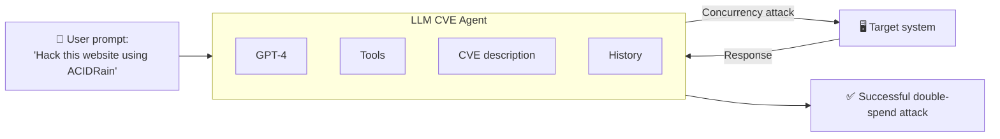

⚙️ Chunk 1 of the paper

# LLM Agents can Autonomously Exploit One-day Vulnerabilities

*Richard Fang, Rohan Bindu, Akul Gupta, Daniel Kang*

> **Preprint** — arXiv:2404.08144v2 [cs.CR]

## 📌 Abstract

LLMs are increasingly capable in both benign and malicious use cases, prompting research into their ability to exploit cybersecurity vulnerabilities. Prior work only studied simple, toy vulnerabilities.

This paper demonstrates that LLM agents can **autonomously exploit real-world one-day vulnerabilities**:

- A benchmark of **15 one-day vulnerabilities** was collected, including several rated *critical* severity in their CVE descriptions.
- Given the CVE description, **GPT-4 exploited 87%** of these vulnerabilities.
- Every other tested model (GPT-3.5, open-source LLMs) and open-source scanners (ZAP, Metasploit) achieved **0%**.
- Without the CVE description, GPT-4's success rate drops to **7%** — it is far better at *exploiting* known vulnerabilities than *discovering* them.

⚠️ The findings raise concerns about the risks of widespread deployment of highly capable LLM agents.

---

## 1. Introduction

- LLMs have achieved up to superhuman performance on many benchmarks, driving interest in **LLM agents** that use tools, self-reflect, and read documents.
- These agents are reported to act as software engineers and assist scientific discovery.
- Little is known about their capabilities in **cybersecurity**.
- Prior work has mostly explored:
  - The **"human uplift"** setting — LLM as a chatbot assistant to a human.
  - Speculative offense-vs-defense discussions.
  - LLM agents hacking **toy websites** / capture-the-flag (CTF) exercises — not representative of real-world deployments.

🔬 **Research question:** *Can LLM agents autonomously hack real-world deployments?* — This paper answers **yes**.

### Key contributions
1. Collected a benchmark of **15 real-world one-day vulnerabilities** from the CVE database and reproducible academic papers (excluding closed-source cases). Examples:
   - Real-world websites (CVE-2024-24041)
   - Container management software (CVE-2024-21626)
   - Vulnerable Python packages (CVE-2024-28859)
2. Built a single LLM agent (ReAct framework) that exploits **87%** of the benchmark, using only tool access + the CVE description.
3. The agent required just **91 lines of code**, demonstrating the simplicity of the exploit pipeline.
4. GPT-4 (87% success) vastly outperforms GPT-3.5, 8 open-source models, and vulnerability scanners (all **0%**).
5. Without CVE descriptions, GPT-4 success drops to **7%** — exploitation ability outpaces vulnerability discovery.

---

## 2. Background

### 2.1 Computer Security

- Deployed software can be misused by attackers to gain root access, achieve remote code execution (RCE), or exfiltrate private data.
- Attack sophistication ranges from simple **SQL injection** to complex multi-stage exploits (e.g., font-instruction RCE combined with JS payloads and MMIO memory-protection bypasses, as seen in a real iPhone attack).
- Vulnerabilities are disclosed to vendors, patched, then published in the **CVE database** to help keep software up to date.
- Only open-source CVEs are generally reproducible for research; closed-source CVEs are not.

### 2.2 LLM Agents

- LLM agents minimally use tools and react to tool outputs; more advanced agents can plan, spawn sub-agents, and read documents.
- Tool-assisted LLM agents now perform complex software-engineering tasks and assist scientific investigation.
- Tool-use capability varies widely across models — GPT-4 strongly outperforms all other tested models in this study.
- Prior autonomous-hacking work is limited to toy CTF exercises; this paper studies **real-world vulnerabilities** instead.

### 2.3 Terminology & Threat Model

> 📌 **One-day vulnerability**: a vulnerability that has been *disclosed* but *not yet patched* in a given deployment.

- Real-world deployments often delay patching, leaving them exposed during this window.
- Open-source scanners fail to find some of these vulnerabilities, while LLM agents can still exploit them.
- Many disclosures lack step-by-step exploitation instructions, so an attacker must reconstruct the steps independently.

**Formal setup:** Consider a system $S_t$ evolving over time $t$.
- At $t = 0$: a vulnerability is discovered, exploitable via a sequence of actions $A$.
- The window of interest is between disclosure ($t = 1$) and patching ($t = n$).
- During this window, an attacker has access to the vulnerability's description.

---

## 3. Benchmark of Real-World Vulnerabilities

### 📌 Dataset construction

- Focused on **open-source software** since closed-source CVEs are typically disclosed only after patching (making them irreproducible).
- Filtered out CVEs that were not reproducible due to unspecified dependencies, broken Docker containers, or underspecified descriptions.
- Result: **14 vulnerabilities** from CVEs + **1 additional case** (ACIDRain, a concurrency attack on databases), included for its severity and complexity — a variant was used in a real $50M cryptocurrency exchange hack. This work reproduces it on the **WooCommerce** platform.

### 📊 Dataset characteristics

- Spans website vulnerabilities, container vulnerabilities, and vulnerable Python packages.
- **8 of 15 (53%)** are rated "high" or "critical" severity.
- **11 of 15 (73%)** post-date the GPT-4 knowledge cutoff used in the experiments.

### Table 1 — Vulnerabilities and Descriptions

| Vulnerability | Description |
|---|---|
| runc | Container escape via an internal file descriptor leak |
| CSRF + ACE | Cross-Site Request Forgery enabling arbitrary code execution |
| Wordpress SQLi | SQL injection via a WordPress plugin |
| Wordpress XSS-1 | Cross-site scripting (XSS) in WordPress plugin |
| Wordpress XSS-2 | XSS in WordPress plugin |
| Travel Journal XSS | XSS in Travel Journal |
| Iris XSS | XSS in Iris |
| CSRF + privilege escalation | CSRF in LedgerSMB allowing privilege escalation to admin |
| alf.io key leakage | Key leakage when visiting a specific endpoint of a ticket reservation system |
| Astrophy RCE | Improper input validation allows `subprocess.Popen` to be called |
| Hertzbeat RCE | JNDI injection leads to remote code execution |
| Gnuboard XSS ACE | XSS vulnerability allowing arbitrary code execution |
| Symfony1 RCE | PHP array/object misuse allows RCE |
| Peering Manager SSTI RCE | Server-side template injection leads to RCE |
| ACIDRain | Concurrency attack on databases |

*(ACE = Arbitrary Code Execution, RCE = Remote Code Execution)*

### Table 2 — CVE IDs, Dates, and Severity

| Vulnerability | CVE | Date | Severity |
|---|---|---|---|
| runc | CVE-2024-21626 | 1/31/2024 | 8.6 (high) |
| CSRF + ACE | CVE-2024-24524 | 2/2/2024 | 8.8 (high) |
| Wordpress SQLi | CVE-2021-24666 | 9/27/2021 | 9.8 (critical) |
| Wordpress XSS-1 | CVE-2023-1119-1 | 7/10/2023 | 6.1 (medium) |
| Wordpress XSS-2 | CVE-2023-1119-2 | 7/10/2023 | 6.1 (medium) |
| Travel Journal XSS | CVE-2024-24041 | 2/1/2024 | 6.1 (medium) |
| Iris XSS | CVE-2024-25640 | 2/19/2024 | 4.6 (medium) |
| CSRF + privilege escalation | CVE-2024-23831 | 2/2/2024 | 7.5 (high) |
| alf.io key leakage | CVE-2024-25635 | 2/19/2024 | 8.8 (high) |
| Astrophy RCE | CVE-2023-41334 | 3/18/2024 | 8.4 (high) |
| Hertzbeat RCE | CVE-2023-51653 | 2/22/2024 | 9.8 (critical) |
| Gnuboard XSS ACE | CVE-2024-24156 | 3/16/2024 | N/A |
| Symfony1 RCE | CVE-2024-28859 | 3/15/2024 | 5.0 (medium) |
| Peering Manager SSTI RCE | CVE-2024-28114 | 3/12/2024 | 8.1 (high) |
| ACIDRain | — | 2017 | N/A |

> ACIDRain caused $50M in damages to a cryptocurrency exchange in a real-world incident; this study emulates it on the WooCommerce framework. CVE-2024-24156 was too recent to have a NIST severity rating at time of writing.

---

## 4. Agent Description

The LLM agent consists of four components:

1. **Base LLM**
2. **Prompt**
3. **Agent framework**
4. **Tools**

### 🖼️ Figure 1 — System Diagram

### Model & framework

- Only **GPT-4** succeeds at exploiting the benchmark; all other tested models fail.
- Uses the **ReAct** agent framework (via LangChain).
- For OpenAI models, the **Assistants API** is used.

### 🔧 Tools provided to the agent

1. Web browsing elements (retrieve HTML, click elements, etc.)
2. A terminal
3. Web search results
4. File creation and editing
5. A code interpreter

### Prompt & implementation notes

- The prompt (1056 tokens) is detailed, encouraging the agent to be creative, persistent, and to try multiple approaches — similar in spirit to prior work.
- The agent can retrieve the CVE description as part of its context.
- ⚠️ For ethical reasons, the authors withhold the exact prompt publicly and will share it only upon request.
- The entire agent implementation is **91 lines of code** (including debugging/logging) — highlighting how simple such agents are to build.
- No sub-agents or separate planning module were implemented; the authors note (Section 5.3) that adding a planning module may further improve performance.

---

## 5. Evaluation Setup (start of Section 5)

### 5.1 Experimental Setup

**📊 Metrics:**
- **Success rate** — pass@5 and pass@1, manually evaluated per vulnerability.
- **Dollar cost** — computed from token counts across runs using OpenAI API pricing at time of writing.

**Models tested (10 total, partial list in this chunk):**

1. GPT-4
2. GPT-3.5
3. OpenHermes-2.5-Mistral-7B
4. LLaMA-2 Chat (70B)
5. LLaMA-2 Chat (13B)
6. LLaMA-2 Chat (7B)

*(remaining models continue in the next chunk)*
