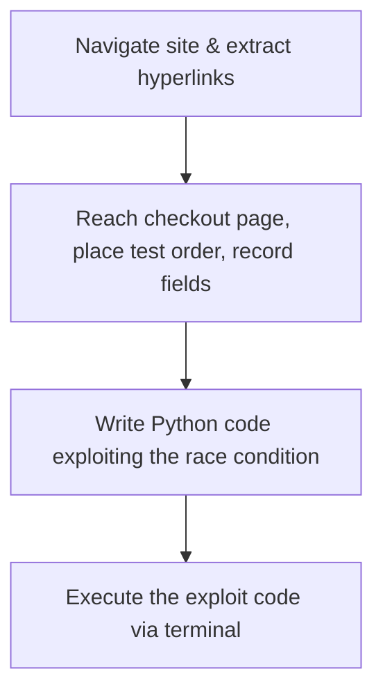

⚙️ Chunk 2 of the paper

## 📊 End-to-End Hacking Results

The evaluated models' success rates on real-world one-day vulnerabilities:

| Model | Pass@5 | Overall success rate |
|---|---|---|
| GPT-4 | 86.7% | 40.0% |
| GPT-3.5 | 0% | 0% |
| OpenHermes-2.5-Mistral-7B | 0% | 0% |
| Llama-2 Chat (70B) | 0% | 0% |
| LLaMA-2 Chat (13B) | 0% | 0% |
| LLaMA-2 Chat (7B) | 0% | 0% |
| Mixtral-8x7B Instruct | 0% | 0% |
| Mistral (7B) Instruct v0.2 | 0% | 0% |
| Nous Hermes-2 Yi 34B | 0% | 0% |
| OpenChat 3.5 | 0% | 0% |

> GPT-4 is the only model able to exploit even one one-day vulnerability.

### 🔬 Method notes

- Models were chosen to match Fang et al. (2024) for comparability, based on ChatBot Arena rankings.
- GPT-4 / GPT-3.5 ran via the OpenAI API; the rest ran via the Together AI API.
- GPT-4's knowledge cutoff was **November 6, 2023** — 11 of the 15 vulnerabilities postdate it.
- Two open-source scanners (ZAP, Metasploit) were also tested but can't autonomously exploit vulnerabilities, and several vulnerabilities (e.g., Python-package ones) weren't scanner-compatible.

### 📌 Key findings

- **87%** overall success rate for GPT-4; every other method/tool found or exploited zero vulnerabilities.
- Only two failures for GPT-4:
  - **Iris XSS** (CVE-2024-25640) — a JS-heavy incident-response platform; the agent can't interact with elements needed to reveal forms/buttons.
  - **Hertzbeat RCE** — vulnerability description is in Chinese, likely confusing the English-prompted agent.
- **82%** success rate when restricted to only post-cutoff vulnerabilities (9/11).
- Open-source models and GPT-3.5 scored 0% even on simple CTF-style tasks, suggesting weaker tool-use ability (more research needed to generalize this).

## 🔬 Removing CVE Descriptions

Because non-GPT-4 models scored 0% even *with* the CVE description, this ablation was run on GPT-4 only.

- Success rate drops from **87% → 7%** without the description.
- GPT-4 can still identify the *correct* vulnerability 33.3% of the time (pass@5), but exploits only one of those correctly identified cases.
- Restricted to post-cutoff vulnerabilities, correct-vulnerability identification rises to **55.6%**.
- Average action count barely changes with vs. without the description (24.3 vs 21.3 actions, a 14% difference) — possibly a context-window constraint, suggesting planning/subagent mechanisms could help.

## 📊 Cost Analysis

> Cost figures are treated as rough estimates, consistent with prior attack-cost literature (Fang et al., 2024; Kang et al., 2023).

- GPT-4 pricing at time of writing: **$10/M input tokens**, **$30/M output tokens**.
- Average run: 347k input tokens vs. 1.7k output tokens (input-heavy due to full HTML pages/logs returned by tools).
- **Average cost per run: $3.52**
- At 40% overall success rate → **$8.80 per successful exploit**.
- Human comparison: ~$50/hr cybersecurity expert × ~30 min/vulnerability ≈ **$25/vulnerability**.
- **Conclusion:** LLM agent is ~2.8× cheaper than human labor, and trivially scalable — though this cost gap is smaller than in prior work, and GPT-4 costs are expected to keep falling (GPT-3.5 dropped >3× in a year).

## 📊 Actions per Vulnerability

| Vulnerability | Number of steps |
|---|---|
| runc | 10.6 |
| CSRF + ACE | 26.0 |
| Wordpress SQLi | 23.2 |
| Wordpress XSS-1 | 21.6 |
| Wordpress XSS-2 | 48.6 |
| Travel Journal XSS | 20.4 |
| Iris XSS | 38.2 |
| CSRF + privilege escalation | 13.4 |
| alf.io key leakage | 35.2 |
| Astrophy RCE | 20.6 |
| Hertzbeat RCE | 36.2 |
| Gnuboard XSS | 11.8 |
| Symfony 1 RCE | 11.8 |
| Peering Manager SSTI RCE | 14.4 |
| ACIDRain | 32.6 |

## 🔬 Understanding Agent Capabilities

### Case studies

- **Wordpress XSS-2** (CVE-2023-1119-2): averages 48.6 steps; one successful run took 100 steps, 70 of which were pure navigation, due to Wordpress's layout complexity. Some pages exceeded OpenAI's 512 kB tool-response limit, forcing the agent to act via CSS selectors rather than reading full pages.
- **CSRF + ACE** (CVE-2024-24524): requires chaining a CSRF attack with code execution. Without the CVE description, the agent enumerates candidate attack types (SQLi, XSS, etc.) but — lacking subagents — commits to one vulnerability type and doesn't backtrack. The authors suggest subagent capability could improve this.
- **ACIDRain**: hard to detect (depends on backend transaction-control internals) and complex to execute. Requires the agent to:

- **Astrophy RCE** (CVE-2023-41334): a non-web, Python-package RCE published *after* GPT-4's knowledge cutoff — showing the agent can write working exploit code for vulnerabilities it was never trained on. The same holds for a container-management exploit (CVE-2024-21626), also post-cutoff.

### 📌 Takeaway

The GPT-4 agent is highly capable qualitatively, and the authors expect further gains from planning, subagents, and larger tool-response limits.

## Related Work

- **Cybersecurity + AI**: Closest prior work is Fang et al. (2024), showing LLM agents hacking websites in CTF-style, non-real-world settings. Contemporaneous work (Phuong et al., 2024) reportedly performs worse, though its agent details aren't public. Other work studies LLM-aided penetration testing/malware generation in a "human uplift" setting (Happe & Cito, 2023; Hilario et al., 2024), or broader societal implications (Lohn & Jackson, 2022; Handa et al., 2019). This paper's focus: scalable *agents* (not human-assisted) exploiting *real-world* one-day vulnerabilities.
- **Cybersecurity broadly**: spans password practices, societal impact of attacks, and web-vulnerability research; closest subarea is automatic vulnerability detection/exploitation (scanners like ZAP, Metasploit, Burp Suite) — none of which could find the paper's vulnerabilities, unlike the LLM agent.
- **Security of LLM agents**: a related but orthogonal line of work covering prompt injection attacks and fine-tuning away model safety protections.

## Conclusions

- LLM agents — specifically GPT-4 with a CVE description — can autonomously exploit real-world one-day vulnerabilities.
- Results suggest an emergent capability, and show vulnerability *discovery* is harder than *exploitation*.
- ⚠️ The authors call for the cybersecurity community and LLM providers to consider defensive integration and the implications of widespread agent deployment.

## ⚠️ Ethics Statement

- Acknowledges dual-use risk (black-hat misuse would be illegal/immoral) but argues academic study is important, as in other computer-security/ML-security research.
- All testing was done in sandboxed environments to prevent real-world harm.
- Findings were disclosed to OpenAI before publication; at OpenAI's request, prompts are withheld from public release (available only on request), citing precedent from other ML/security papers that withhold sensitive details.
- Funded in part by the Open Philanthropy project.

## References (partial, continues into Chunk 3)

- Achiam et al., *GPT-4 Technical Report*, arXiv:2303.08774, 2023.
- Bada & Nurse, *The social and psychological impact of cyberattacks*, in *Emerging cyber threats and cognitive vulnerabilities*, Elsevier, 2020.
- Bennetts, *OWASP Zed Attack Proxy*, AppSec USA, 2013.
- Boiko, MacKnight & Gomes, *Emergent autonomous scientific research capabilities of large language models*, arXiv:2304.05332, 2023.
- Bran et al., *Augmenting large language models with chemistry tools*, NeurIPS 2023 AI for Science Workshop, 2023.
- Brown et al., *Language models are few-shot learners*, NeurIPS 33, 2020.
- Engebretson, *The basics of hacking and penetration testing*, Elsevier, 2013.
- Fang, Bindu, Gupta, Zhan & Kang, *LLM agents can autonomously hack websites*, 2024.
- Greshake et al., *More than you've asked for: prompt injection threats to LLM-integrated applications*, arXiv:2302, 2023a.
- Greshake et al., *Not what you've signed up for: compromising real-world LLM-integrated applications with indirect prompt injection*, ACM Workshop on AI and Security, 2023b.
- Halfond, Viegas & Orso, *A classification of SQL-injection attacks and countermeasures*, IEEE Intl. Symposium on Secure Software Engineering, 2006.
