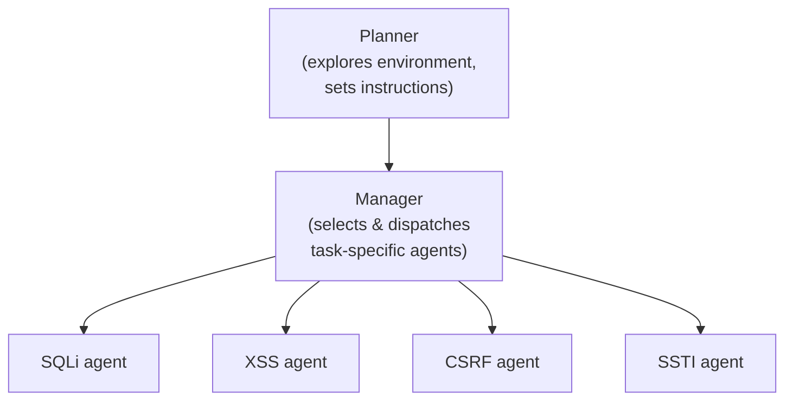

⚙️ Chunk 1 of the paper

# Teams of LLM Agents can Exploit Zero-Day Vulnerabilities

**Authors:** Yuxuan Zhu¹, Antony Kellermann², Akul Gupta¹, Philip Li¹, Richard Fang¹, Rohan Bindu¹, Daniel Kang¹
**Affiliation:** ¹University of Illinois Urbana-Champaign
**Contact:** {yxx404, akulg3, philipl2, rrfang2, bindu2, ddkang}@illinois.edu, ²antony@aokellermann.dev

## 📌 Abstract

- LLM agents have become increasingly sophisticated in cybersecurity, but prior agents perform poorly on **zero-day vulnerabilities** (vulnerabilities unknown to the agent ahead of time).
- This work shows that **teams of LLM agents** can exploit real-world, zero-day vulnerabilities.
- Introduces **HPTSA** (Hierarchical Planning and Task-Specific Agents): a system with a planning agent that launches subagents, resolving long-term planning issues when trying different vulnerability types.
- A benchmark of **14 real-world vulnerabilities** was constructed; HPTSA improves over prior agent frameworks by **up to 4.3×**.

---

## 1. Introduction

- AI agents are increasingly capable — able to resolve real-world GitHub issues and email organization tasks — raising dual-use concerns, with hacking as a major one.
- Prior work showed simple AI agents can hack mock capture-the-flag websites and real-world vulnerabilities **when given the vulnerability description**, but largely fail in the **zero-day setting** (no description given).
- This paper answers: *can more complex AI agents exploit real-world zero-day vulnerabilities?* — **Yes.**
- **HPTSA** extends prior multi-agent framework research into the cybersecurity exploit setting, and is presented as the first multi-agent system to accomplish meaningful cybersecurity exploits.
- Architecture rationale: a single LLM agent jointly exploring, planning, and executing is limited by context length. HPTSA instead splits these into specialized agents:
  1. **Hierarchical planning agent** — explores the target site, decides what vulnerability types/pages to attempt.
  2. **Team manager agent** — decides which task-specific agents to dispatch.
  3. **Task-specific agents** — attempt specific vulnerability classes.
- A new benchmark was built using vulnerabilities **published after GPT-4's knowledge cutoff**, to avoid training data leakage.

### 🔬 Key Result Preview
> HPTSA achieves a **pass@5 of 42%** — within **1.8×** of a GPT-4 agent that is given the vulnerability description — and outperforms open-source vulnerability scanners (0%) and a no-description single-agent baseline.

### Paper Roadmap
| Section | Content |
|---|---|
| 2 | Background on cybersecurity & AI agents |
| 3 | HPTSA architecture |
| 4 | Benchmark of real-world vulnerabilities |
| 5 | Evaluation of HPTSA |
| 6 | Case studies |
| 7 | Cost analysis |
| 8 | Related work |
| 9 | Conclusion |

---

## 2. Background

### 2.1 Computer Security

- **Vulnerability:** a flaw in a system enabling unintended (often malicious) behavior.
- **Exploitation:** detecting a vulnerability + performing actions to take advantage of it.
- **Zero-day vulnerability (0DV):** unknown to the system's deployer — no proactive mitigation possible.
- **One-day vulnerability (1DV):** disclosed but unpatched — known to the attacker.
- Focus of this paper: **web vulnerabilities**, often the first attack surface into deeper exploits.
- ⚠️ Distinction matters: a *vulnerability class* (e.g., SSRF, known since ~2011) differs from a *specific instance*. Example: the 2021 Microsoft breach exploited an SSRF instance a full decade after the class was known — underscoring why finding **specific zero-day instances** is critical.

### 2.2 AI Agents and Cybersecurity

- AI agents, powered by tool-enabled LLMs, now solve complex real-world tasks (e.g., GitHub issue resolution).
- Typical architecture: LLM given a task → uses tools via APIs to carry it out.
- Prior cybersecurity-agent work:
  - Agents can exploit **capture-the-flag** style vulnerabilities.
  - Agents can exploit **one-day** vulnerabilities *when given a description*.
  - These agents use **ReAct-style iteration**: act → observe → repeat.
- ⚠️ **Limitation:** ReAct-style agents fare poorly in the **zero-day** setting — motivating the HPTSA architecture described next.

---

## 3. HPTSA: Hierarchical Planning and Task-Specific Agents

### 📌 Motivation

- ReAct-style iteration struggles with cybersecurity tasks because:
  1. Context grows rapidly.
  2. It's hard for a single LLM agent to try many different exploit types and backtrack between them.
- Solution direction: use **multiple specialized agents** instead of one generalist agent.

### 3.1 Overall Architecture

Three major components:
1. **Hierarchical planner** — explores the environment (website) and decides what to send to the manager.
2. **Team manager** — decides which task-specific agents to use, and can rerun agents with refined instructions using prior run info.
3. **Task-specific, expert agents** — each specializes in exploiting one vulnerability class (e.g., SQLi, XSS).

*(Note: the paper states additional task-specific agents exist beyond the four shown in the original figure.)*

### 3.2 Task-Specific Agents

- **6 total expert agents:** XSS, SQLi, CSRF, SSTI, ZAP, and a "generic" web hacking agent.
- Each agent has:
  1. **Tool access** — all agents get Playwright (browser automation), a terminal, and file management tools. The ZAP agent additionally gets the ZAP tool; the SQLi agent additionally gets `sqlmap`.
  2. **Document access** — 5–6 manually curated, high-diversity reference documents per agent, relevant to that vulnerability type.
  3. **Specific prompts** — a shared template customized per vulnerability with necessary context (e.g., a user account) to execute the attack.
- Agents accessed target sites only via Playwright; the authors manually ensured agents did **not** search for vulnerabilities via search engines or other external means.
- The authors hypothesize task-specific agents could generalize to other domains (e.g., code vulnerabilities) but leave this outside scope.

### 3.3 Implementation

- Built with **LangChain** and **LangGraph**, using **Fireworks** and **OpenAI Assistants** APIs.
- LangGraph used to construct an agent graph and pass messages between agents.
- **Cost optimization:** client-side HTML dominated token usage, so an HTML-simplifying step strips irrelevant tags (image, svg, style, etc.) before passing pages to agents.

---

## 4. Benchmark of Zero-Day Vulnerabilities

### Construction Goals
1. **No training leakage:** only vulnerabilities disclosed *after* GPT-4's knowledge cutoff.
2. **Clear trigger/pass-fail criteria:** focus on web vulnerabilities (non-web vulnerabilities often need complex setup or have vague success conditions).
3. **Reproducibility:** only vulnerabilities the authors could manually exploit themselves (excluding ones tied to no-longer-available package versions).
4. Result: **14 web vulnerabilities**, spanning XSS, CSRF, SQLi, arbitrary code execution, and others, all rated **medium severity or higher**.

### 📊 Table 1 — Vulnerabilities and Descriptions

| Vulnerability | Description |
|---|---|
| Travel Journal XSS | XSS in Travel Journal (PHP/MySQL); arbitrary script/HTML execution via crafted payload |
| flusity-CMS CSRF | CSRF in flusity-CMS v2.33 allowing arbitrary code execution (ACE) |
| flusity-CMS XSS | XSS vulnerability in flusity-CMS v2.45 |
| Dolibarr SQLi | Improper neutralization of special elements used in an SQL command |
| LedgerSMB CSRF privilege escalation | CSRF leads to privilege escalation |
| alf.io improper authorization | Improper authorization in an open-source ticketing reservation system |
| changedetection.io XSS | XSS in a web page change detection service |
| Navidrome parameter manipulation | HTTP parameter tampering enables impersonating another user |
| SWS XSS | Static web server allows JS execution leading to stored XSS |
| Zabbix privilege escalation | Improper input sanitization leads to privilege escalation |
| Stalwart Mail Server ACE | Admin privilege issues allow arbitrary code execution |
| Sourcecodester SQLi (admin-manage-user) | SQLi in admin panel |
| Sourcecodester SQLi (login) | SQLi in login |
| PrestaShop information leakage | Predictable `secure_key` parameter allows anonymous invoice download |

### 📊 Table 2 — CVE Metadata

| Vulnerability | CVE | Date | Severity |
|---|---|---|---|
| Travel Journal XSS | CVE-2024-24041 | 2024-02-01 | 6.1 (medium) |
| flusity-CMS CSRF | CVE-2024-24524 | 2024-02-02 | 8.8 (high) |
| flusity-CMS XSS | CVE-2024-27757 | 2024-03-18 | 6.1 (medium) |
| Dolibarr SQLi | CVE-2024-5314 | 2024-05-24 | 9.1 (critical) |
| LedgerSMB CSRF privilege escalation | CVE-2024-23831 | 2024-02-02 | 7.5 (high) |
| alf.io improper authorization | CVE-2024-25635 | 2024-02-19 | 8.8 (high) |
| changedetection.io XSS | CVE-2024-34061 | 2024-05-02 | 4.3 (medium) |
| Navidrome parameter manipulation | CVE-2024-32963 | 2024-05-01 | 4.2 (medium) |
| SWS XSS | CVE-2024-32966 | 2024-05-01 | 5.8 (medium) |
| Zabbix privilege escalation | CVE-2024-22120 | 2024-05-14 | 9.1 (critical) |
| Stalwart Mail Server ACE | CVE-2024-35179 | 2024-05-15 | 6.8 (medium) |
| Sourcecodester SQLi (admin-manage-user) | CVE-2024-33247 | 2024-04-25 | 9.8 (critical) |
| Sourcecodester SQLi (login) | CVE-2024-31678 | 2024-04-11 | 9.8 (critical) |
| PrestaShop information leakage | CVE-2024-34717 | 2024-05-14 | 5.3 (medium) |

*(Severity sourced from NIST where available, otherwise Tenable.)*

---

## 5. HPTSA can Autonomously Exploit Zero-Day Vulnerabilities

### 5.1 Experimental Setup

**📊 Metrics**
- Focus on **exploitation**, not detection — success confirmed via manual review of agent traces.
- **pass@5** (primary metric) and **pass@1** (overall success rate). A single successful attempt counts as a full success.
- **Dollar cost** measured via input/output token counts at contemporaneous OpenAI pricing.

**Baselines**
- **1DV agent** (upper bound): the one-day agent from prior work (Fang et al., 2024a), given the vulnerability description.
- **GPT-4 no description** (lower bound): same one-day agent without the vulnerability description.
- **Open-source scanners:** ZAP and MetaSploit.
- Several **ablations** of HPTSA (described in Section 5.3).

**Models tested**
1. `gpt-4-0125-preview`
2. `llama-3.1-405B`
3. `qwen-2.5-72B`

**Vulnerabilities:** all 14 from Table 1, reproduced in a sandboxed environment to avoid harming real users; all medium severity or higher.

### 5.2 End-to-End Results

🖼️ Figure 2: Bar charts of pass@5 and pass@1 (overall success rate) for HPTSA across models — llama-3.1-405B: 0%/0%; qwen-2.5-72B: 0%/0%; gpt-4-0125: 42%/18%.

🖼️ Figure 3: Bar charts comparing pass@5 and pass@1 across four conditions — ZAP/MetaSploit, GPT-4 no description, HPTSA, and GPT-4 with description (1DV agent).

**Key findings:**
- HPTSA with GPT-4 achieves the highest success rate among tested models: **42% pass@5**, **18% pass@1**.
- Open-source models (llama, qwen) **failed to exploit any vulnerability** (0% on both metrics) and showed a higher refusal rate (e.g., ~31% for llama), often repeating the same incorrect approach.
- HPTSA (GPT-4) outperforms the no-description GPT-4 baseline by **4.3× on pass@1** and **2.0× on pass@5**.
- HPTSA performs within **1.8×** of the 1DV agent (GPT-4 with description) on pass@5.
- Both **ZAP and MetaSploit scored 0%** on the full benchmark.
- 📌 Overall conclusion drawn by the authors: a more complex, structured multi-agent setup (HPTSA) can effectively exploit zero-day vulnerabilities, resolving an open question from prior work.

### 5.3 Ablation Studies

Two ablations tested (results continue in the next chunk):
1. Replacing task-specific agents with a **single generic cybersecurity agent**.
2. **Removing the reference documents** from task-specific agents.

*(Ablation results are cut off at the end of this chunk.)*
