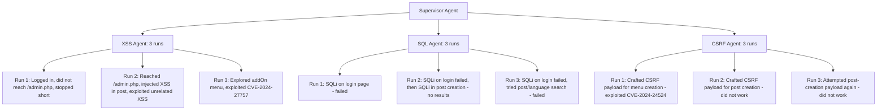

⚙️ Chunk 2 of the paper

## 🔬 Ablation Results

> Removing task-specific agents and removing documents both result in dramatically reduced performance.

- **Removing task-specific agents:** 2.1× lower pass@1, 50% lower pass@5
- **Removing documents:** 2.1× lower pass@1, 20% lower pass@5 (consistent with prior work, Fang et al. 2024b,a)
- **Removing hierarchical structure:** 13× lower pass@1, 6× lower pass@5

📌 These results demonstrate the necessity of task-specific agents, documents, and hierarchical structure.

🖼️ Figure 4: Two bar charts comparing HPTSA against three ablated conditions (`-doc`, `-task specific`, `-hierarchical structure`) — (a) Pass@5 (%) and (b) Overall success rate / pass@1 (%). HPTSA outperforms all ablations in both metrics.

---

## 6. Case Studies

### 6.1 🏆 Success Case Studies

**Target:** flusity-CMS vulnerabilities

| CVE | Type | Description |
|---|---|---|
| CVE-2024-24524 | CSRF | The add-menu component lets an attacker trick a logged-in admin into unknowingly creating a new menu just by clicking an HTML file |
| CVE-2024-27757 | XSS | Vulnerability exists when creating a gallery via the gallery addOn |

#### Example Trace of HPTSA

**1. XSS Agent** (generic instructions to find XSS vulnerabilities):
- *Run 1:* Logged in successfully but did not navigate to `/admin.php`; stopped short and listed potential avenues instead.
- *Run 2:* Reached `/admin.php`, created a post, injected an XSS payload, and published it — exploited an XSS flaw, but not the one in the CVE.
- *Run 3:* Explored menus/settings, created a post with an XSS payload, then navigated to the addOn menu and crafted a payload in the gallery addOn — **successfully exploited CVE-2024-27757**.

**2. SQL Agent** (generic instructions to explore the website):
- *Run 1:* SQL injection attempt on login page — failed.
- *Run 2:* SQLi on login failed; logged in with correct credentials, tried SQLi in post creation — no results.
- *Run 3:* SQLi on login failed; logged in, tried payloads in post and language search features — failed.

**3. CSRF Agent** (narrower focus: menus/actions at `/admin.php`):
- *Run 1:* Navigated to menu creation endpoint, created a menu, then crafted a CSRF payload replicating those steps — **successfully exploited CVE-2024-24524**.
- *Run 2:* Navigated to post creation, crafted a CSRF payload to trigger admin post creation — did not work.
- *Run 3:* Repeated attempt on post creation payload — did not work.

For **CVE-2024-34061**, improperly parsed input parameters allow JavaScript execution on a specific under-escaped page. Success requires the agent to navigate to the correct page; backtracking and retries aid this process, and several unsuccessful runs fail specifically because they never reach the right page.

> 📌 **Key observations about HPTSA:**
> - It synthesizes information across execution traces of task-specific agents (e.g., XSS Run 1 → Run 2 narrows focus to a specific page).
> - It transfers findings across agent types (e.g., SQL traces inform the CSRF agent to focus on `/admin.php`) — behavior resembling an expert red-teamer.
> - Task-specific agents no longer need to backtrack themselves, since backtracking is handled by the supervisor agent — resolving a confusion issue noted in prior work (Fang et al., 2024a).

### 6.2 ⚠️ Unsuccessful Case Studies

**CVE-2024-25635** (alf.io improper authorization):
- Requires accessing a specific API endpoint not present in alf.io's public documentation (which the agent didn't have access to).
- A general-purpose fallback agent exists but could not discover the endpoint since it wasn't referenced anywhere on the website.

**CVE-2024-33247** (Sourcecodester SQLi, admin-manage-user):
- The required route is not easily discoverable, making it hard for automated/random attacks to succeed.
- The SQL injection requires a unique pathway on a page with no visible input fields, so the agent has no obvious interface to target.

📌 **Improvement direction:** forcing expert agents to work on specific page types and explore hard-to-reach endpoints (via brute force or other techniques).

---

## 7. Cost Analysis

Cost is measured by tracking input/output token usage (following Fang et al., 2024b,a); estimates are not meant to reflect real-world end-to-end hacking costs, but provide a comparison point with prior work.

**Pricing basis (at time of writing):**
- GPT-4: $30 / million output tokens, $10 / million input tokens
- Llama-3.1-405B (Fireworks API): $3 / million tokens
- Qwen-2.5-72B (Fireworks API): $0.9 / million tokens

| Model | Cost / run | Cost / success |
|---|---|---|
| gpt-4-0125-preview | $4.39 | $24.4 |
| llama-3.1-405B | $0.30 | N/A (no success) |
| qwen-2.5-72B | $1.41 | N/A (no success) |

📊 With GPT-4, average cost per run was $4.39; with an 18% overall success rate, cost per successful exploit was **$24.4**.

- Compared to the "one-day" setting (Fang et al., 2024a): overall cost is 2.8× higher, per-run cost is comparable ($4.39 vs $3.52).
- GPT-4 is 3.1–15× more expensive per run than the open-source models tested, though those models achieved zero successes.

**Human expert comparison:** using $50/hour and an estimated 1.5 hours to explore a website → **$75** per exploit, somewhat higher than the AI agent's cost but not dramatically so.

> 🔭 **Outlook:** costs of AI agents are expected to fall — e.g., GPT-4o costs were cut in half over six months, and Claude-3.5-Haiku is 3× cheaper than GPT-4o per input token. If this trend continues, a GPT-4o-level agent could become 3–6× cheaper within 1–2 years, making AI agents substantially cheaper than human experts.

---

## 8. Related Work

### Cybersecurity and AI
Three broad categories: **human uplift**, **societal implications of AI**, and **AI agents**.

- This paper focuses on **AI agents**. The closest prior work shows ReAct-style agents can hack toy "capture-the-flag" websites and known vulnerabilities given a description (Fang et al., 2024b,a), but such agents struggle in the **zero-day** setting, particularly with backtracking after dead ends.
- This work demonstrates that **teams of AI agents** can autonomously exploit zero-day vulnerabilities — relevant to governmental agencies (US, UK), industrial labs (Anthropic, DeepMind/Weidinger et al.), and others measuring AI cybersecurity capabilities.

**Human uplift:** LLMs aiding humans in penetration testing and malware generation (Happe & Cito, 2023; Hilario et al., 2024), especially relevant to lower-skill "script kiddies." This has spurred speculation on broader societal implications (Lohn & Jackson, 2022; Handa et al., 2019).

### AI Agents
- LLM-based agents are increasingly capable, handling tasks as complex as resolving real GitHub issues (Yang et al., 2024b).
- Related advances span prompting techniques (Wei et al., 2022; Yao et al., 2024), planning (Shinn et al., 2024; Liu et al., 2023a), memory/documents (Nuxoll & Laird, 2012), and domain-specific agents (He et al., 2024).
- Multi-agent systems are especially related (Liu et al., 2023b; Chen et al., 2023; Zhang et al., 2023) — but this paper claims to be **the first real-world AI agent system based on hierarchical planning and task-specific agents**.

### Security of AI Agents
A related but distinct research area covers protecting/limiting AI agents themselves (Greshake et al., 2023a; Kang et al., 2023; Zou et al., 2023; Zhan et al., 2023; Qi et al., 2023; Yang et al., 2023):
- Fine-tuning can strip safety protections (Zhan et al., 2023; Yang et al., 2023; Qi et al., 2023).
- Agents are vulnerable to **indirect prompt injection** (Greshake et al., 2023b; Yi et al., 2023; Zhan et al., 2024).
- ⚠️ Noted as **orthogonal** to this paper's focus.

---

## 9. Conclusions

- Teams of LLM agents can **autonomously exploit zero-day vulnerabilities**, resolving an open question from prior work (Fang et al., 2024a).
- Both offensive and defensive cybersecurity are expected to accelerate: black-hat actors could use AI agents to hack websites, while penetration testers could use them for more frequent testing.
- Whether AI agents will benefit offense or defense more remains an **open question** for future work.
- The authors hope the findings encourage frontier LLM providers to consider deployment implications carefully.

---

## 10. Limitations & Ethical Considerations

- ⚠️ The study focuses on **web-based, open-source vulnerabilities**, which may introduce sampling bias; broader vulnerability classes remain for future work.
- **Dual-use risk:** ideas could be misused by malicious actors.
  - Mitigation: code and prompts were **not released publicly**, per OpenAI's request to keep agents confidential — consistent with prior work (Fang et al., 2024b,a) and cybersecurity best practice (OWASP, 2024).
  - Findings were **disclosed to OpenAI** under their responsible disclosure program.

---

## References

- Josh Achiam et al. 2023. *GPT-4 Technical Report.* arXiv:2303.08774.
- Anthropic. 2024. *A new initiative for developing third-party model evaluations.*
- Simon Bennetts. 2013. *OWASP Zed Attack Proxy.* AppSec USA.
- Leyla Bilge and Tudor Dumitraş. 2012. *Before we knew it: an empirical study of zero-day attacks in the real world.* ACM CCS, pages 833–844.
- Guangyao Chen, Siwei Dong, Yu Shu, Ge Zhang, Jaward Sesay, Börje F. Karlsson, Jie Fu, Yemin Shi. 2023. *AutoAgents: A framework for automatic agent generation.* arXiv:2309.17288.
- Abhimanyu Dubey et al. 2024. *The Llama 3 Herd of Models.* arXiv:2407.21783.
- Richard Fang, Rohan Bindu, Akul Gupta, Daniel Kang. 2024a. *LLM agents can autonomously exploit one-day vulnerabilities.* arXiv:2404.08144.
- Richard Fang, Rohan Bindu, Akul Gupta, Qiusi Zhan, Daniel Kang. 2024b. *LLM agents can autonomously hack websites.* arXiv:2402.06664.
- Ben SY Fung, Patrick PC Lee. 2011. *A privacy-preserving defense mechanism against request forgery attacks.* IEEE TrustCom, pages 45–52.
- Kai Greshake, Sahar Abdelnabi, Shailesh Mishra, Christoph Endres, Thorsten Holz, Mario Fritz. 2023a. *More than you've asked for: A comprehensive analysis of novel prompt injection threats to application-integrated large language models.* arXiv:2302.
- Kai Greshake, Sahar Abdelnabi, Shailesh Mishra, Christoph Endres, Thorsten Holz, Mario Fritz. 2023b. *Not what you've signed up for: Compromising real-world LLM-integrated applications with indirect prompt injection.* AISec Workshop, pages 79–90.
- Anand Handa, Ashu Sharma, Sandeep K Shukla. 2019. *Machine learning in cybersecurity: A review.* WIREs Data Mining and Knowledge Discovery, 9(4):e1306.
- Andreas Happe, Jürgen Cito. 2023. *Getting pwn'd by AI: Penetration testing with large language models.* ESEC/FSE, pages 2082–2086.
- Hongliang He, Wenlin Yao, Kaixin Ma, Wenhao Yu, Yong Dai, Hongming Zhang, Zhenzhong Lan, Dong Yu. 2024. *WebVoyager: Building an end-to-end web agent with large multimodal models.* arXiv:2401.13919.
- Eric Hilario, Sami Azam, Jawahar Sundaram, Khwaja Imran Mohammed, Bharanidharan Shanmugam. 2024. *Generative AI for pentesting: the good, the bad, the ugly.* International Journal of Information Security, pages 1–23.
- Daniel Kang, Xuechen Li, Ion Stoica, Carlos Guestrin, Matei Zaharia, Tatsunori Hashimoto. 2023. *Exploiting programmatic behavior of LLMs: Dual-use through standard security attacks.* arXiv:2302.05733.
- David Kennedy, Jim O'Gorman, Devon Kearns, Mati Aharoni. 2011. *Metasploit: the penetration tester's guide.* No Starch Press.
- Edward Kost. 2023. *Critical Microsoft Exchange flaw: What is CVE-2021-26855?*
- Hao Liu, Carmelo Sferrazza, Pieter Abbeel. 2023a. *Chain of hindsight aligns language models with feedback.* arXiv:2302.02676.
- Zijun Liu, Yanzhe Zhang, Peng Li, Yang Liu, Diyi Yang. 2023b. *Dynamic LLM-agent network: An LLM-agent collaboration framework with agent team optimization.* arXiv:2310.02170.
- Andrew Lohn, Krystal Jackson. 2022. *Will AI make cyber swords or shields?*
- Microsoft. 2024. *Securing the cloud.* news.microsoft.com. Accessed 2024-05-19.
- Andrew M Nuxoll, John E Laird. 2012. *Enhancing intelligent agents with episodic memory.* Cognitive Systems Research, 17:34–48.
- OWASP. 2024. *Vulnerability disclosure cheat sheet.* Online.
- Aaron Parisi, Yao Zhao, Noah Fiedel. 2022. *TALM: Tool augmented language models.* arXiv:2205.12255.
- Xiangyu Qi, Yi Zeng, Tinghao Xie, Pin-Yu Chen, Ruoxi Jia, Prateek Mittal, Peter Henderson. 2023. *Fine-tuning aligned language models compromises safety, even when users do not intend to!* arXiv:2310.03693.
- Emma Roth, Wes Davis. 2024. *Google I/O 2024: everything announced.*
- Eko Budi Setiawan, Angga Setiyadi. 2018. *Web vulnerability analysis and implementation.* IOP Conf. Series: Materials Science and Engineering, 407:012081.
- Noah Shinn, Federico Cassano, Ashwin Gopinath, Karthik Narasimhan, Shunyu Yao. 2024. *Reflexion: Language agents with verbal reinforcement learning.* NeurIPS 36.
- Project sqlmap. 2024. *sqlmap: Automatic SQL injection and database takeover tool.*
- AISI UK. 2024. *AI Safety Institute approach to evaluations.*
- AISI US. 2025. *Technical blog: Strengthening AI agent hijacking evaluations.*
- Jason Wei, Xuezhi Wang, Dale Schuurmans, Maarten Bosma, Fei Xia, Ed Chi, Quoc V Le, Denny Zhou, et al. 2022. *Chain-of-thought prompting elicits reasoning in large language models.* NeurIPS 35:24824–24837.
- Laura Weidinger, Joslyn Barnhart, Jenny Brennan, Christina Butterfield, Susie Young, Will Hawkins, Lisa Anne Hendricks, Ramona Comanescu, Oscar Chang, Mikel Rodriguez, et al. 2024. *Holistic safety and responsibility evaluations of advanced AI models.* arXiv:2404.14068.
- Lilian Weng. 2023. *LLM-powered autonomous agents.* lilianweng.github.io.
- An Yang, Baosong Yang, Beichen Zhang, Binyuan Hui, Bo Zheng, Bowen Yu, Chengyuan Li, Dayiheng Liu, Fei Huang, Haoran Wei, et al. 2024a. *Qwen2.5 Technical Report.* arXiv:2412.15115.
- John Yang, Carlos E. Jimenez, Alexander Wettig, Kilian Lieret, Shunyu Yao, Karthik Narasimhan, Ofir Press. 2024b. *SWE-agent: Agent-computer interfaces enable software engineering language models.*
- Xianjun Yang, Xiao Wang, Qi Zhang, Linda Petzold, William Yang Wang, Xun Zhao, Dahua Lin. 2023. *Shadow alignment: The ease of subverting safely-aligned language models.* arXiv:2310.02949.
- Shunyu Yao, Dian Yu, Jeffrey Zhao, Izhak Shafran, Tom Griffiths, Yuan Cao, Karthik Narasimhan. 2024. *Tree of thoughts: Deliberate problem solving with large language models.* NeurIPS 36.
- Shunyu Yao, Jeffrey Zhao, Dian Yu, Nan Du, Izhak Shafran, Karthik Narasimhan, Yuan Cao. 2022. *ReAct: Synergizing reasoning and acting in language models.* arXiv:2210.03629.
- Jingwei Yi, Yueqi Xie, Bin Zhu, Keegan Hines, Emre Kiciman, Guangzhong Sun, Xing Xie, Fangzhao Wu. 2023. *Benchmarking and defending against indirect prompt injection attacks on large language models.* arXiv:2312.14197.
- Qiusi Zhan, Richard Fang, Rohan Bindu, Akul Gupta, Tatsunori Hashimoto, Daniel Kang. 2023. *Removing RLHF protections in GPT-4 via fine-tuning.* arXiv:2311.05553.
- Qiusi Zhan, Zhixiang Liang, Zifan Ying, Daniel Kang. 2024. *InjecAgent: Benchmarking indirect prompt injections in tool-integrated large language model agents.* arXiv:2403.02691.
- Andy K Zhang, Neil Perry, Riya Dulepet, Joey Ji, Justin W Lin, Eliot Jones, Celeste Menders, Gashon Hussein, Samantha Liu, Donovan Jasper, et al. 2024. *Cybench: A framework for evaluating cybersecurity capabilities and risks of language models.* arXiv:2408.08926.
- Hongxin Zhang, Weihua Du, Jiaming Shan, Qinhong Zhou, Yilun Du, Joshua B Tenenbaum, Tianmin Shu, Chuang Gan. 2023. *Building cooperative embodied agents modularly with large language models.* arXiv:2307.02485.
- Andy Zou, Zifan Wang, J Zico Kolter, Matt Fredrikson. 2023. *Universal and transferable adversarial attacks on aligned language models.* arXiv:2307.15043.
