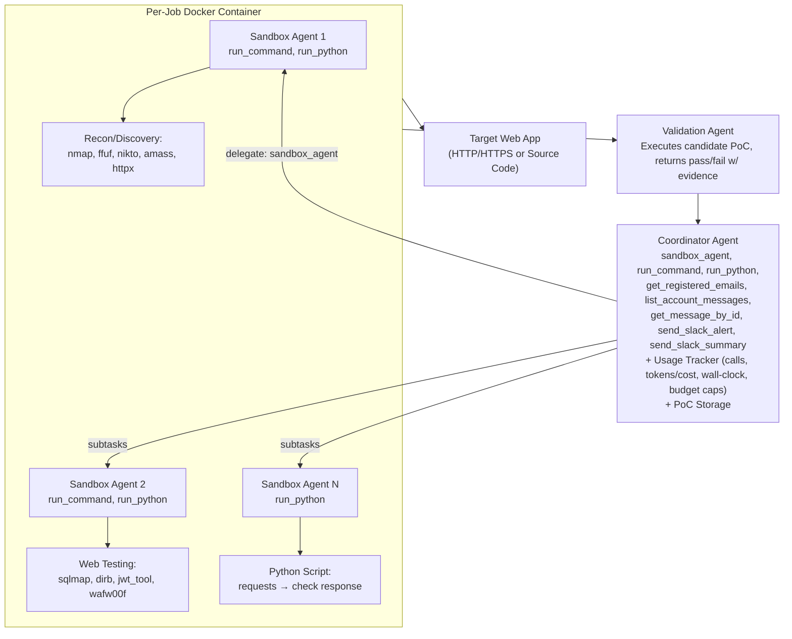
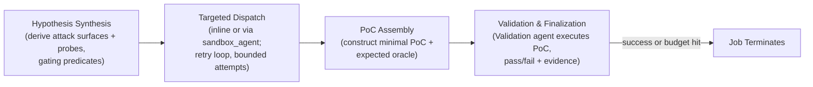

⚙️ Chunk 1 of the paper

# Multi-Agent Penetration Testing AI for the Web

**Isaac David** — University College London
**Arthur Gervais** — University College London

## 📌 Abstract

> AI-powered development platforms are democratizing software creation, but this has triggered a scalability crisis in security auditing — up to 40% of AI-generated code contains vulnerabilities, and development now vastly outpaces security assessment capacity.

We present **MAPTA** (Multi-Agent Penetration Testing AI), a multi-agent system for autonomous web application security assessment combining LLM orchestration, tool-grounded execution, and end-to-end exploit validation.

**Headline results:**

- 🎯 **76.9%** overall success on the 104-challenge XBOW benchmark
- ✅ **100%** on SSRF and misconfiguration vulnerabilities
- ✅ **83%** on broken authorization
- ✅ **85%** on server-side template injection (SSTI)
- ✅ **83%** on SQL injection
- ⚠️ **57%** on cross-site scripting (XSS)
- ❌ **0%** on blind SQL injection
- 💰 Total evaluation cost: **$21.38** (median $0.073/success vs $0.357/failure)
- ⏱️ Practical early-stopping thresholds: ~40 tool calls or $0.30/challenge
- 🌍 Real-world testing on popular GitHub repos (8K–70K stars) at **$3.67**/assessment average, uncovering RCEs, command injections, secret exposure, and arbitrary file write bugs — 10 findings pending CVE review

---

## 1. Introduction

### The Problem

Web application security assessment faces a **scalability crisis**:

- AI-assisted dev platforms let non-technical builders ship apps quickly, but without security expertise
- Manual/human-dependent assessment processes can't keep pace
- There's a **semantic gap** between pattern-based vulnerability detection and contextual exploitability
  - e.g. a SQL injection *pattern* may be unexploitable due to prepared statements, input validation, or DB permissions
  - conversely, business-logic flaws (multi-step attack chains) evade signature-based tools entirely

### The Opportunity

LLMs and autonomous agents can reason about code semantics and exploitation strategy, but need:
1. **Tool orchestration**
2. **Rigorous verification** of theoretical vulnerabilities via real, end-to-end proof-of-concept (PoC) exploits

### 🔬 Prior Work

| System | Contribution |
|---|---|
| **PentestGPT** | Foundational multi-stage enumeration/exploitation workflow |
| **PenHeal** | Coupled vulnerability discovery with automated remediation |
| **XBOW** (commercial) | Claims competitive performance, but closed methodology — only blog-post level detail, no reproducibility |

**Gaps in existing approaches:** lack of rigorous cost-performance analysis, and insufficient vulnerability validation → false positives.

MAPTA is presented as, to the authors' knowledge, **the first open-source multi-agent penetration testing AI system for the web**, enabling continuous, end-to-end testing without human intervention.

---

## 1.1 Key Insights and Contributions

MAPTA targets the scalability–accuracy tradeoff through:

- A **multi-agent architecture** (coordinator + sandbox agents) rather than a monolithic AI, separating strategic reasoning from tactical, isolated tool execution
- Integration of security tools (`nmap`, `python`, `ffuf`, etc.) via orchestration
- **Sandboxed PoC validation** to distinguish theoretical vulnerabilities from practical exploits
- Adaptive strategy based on discovered app characteristics and partial exploitation results

### Contributions

1. **Tool-grounded multi-agent architecture**
   Three agent roles — Coordinator (orchestration), Sandbox agents (tactical execution in a shared per-job Docker container), Validation agent (end-to-end PoC oracle) — to eliminate theoretical/false-positive findings.

2. **Cost–performance accounting**
   Full resource accounting across 104 XBOW challenges:
   - 3.2M regular input tokens, 50.5M cached, 1.10M output, 0.595M reasoning tokens
   - $21.38 total cost, median $0.117/challenge
   - Strong **negative correlations** between success and resource consumption:
     - tools $r = -0.661$
     - cost $r = -0.606$
     - tokens $r = -0.587$
     - time $r = -0.557$
   - Practical early-stopping: ~40 tool calls, $0.30, or 300 seconds

3. **Black-box performance on modern web targets**
   76.9% success across 104 XBOW challenges; perfect on SSRF/misconfiguration; strong on SSTI (85%), SQLi (83%), command injection (75%); gaps in blind SQLi (0%) and XSS (57%).

4. **Real-world white-box validation**
   Tested 10 popular open-source apps (8K–70K GitHub stars) across Next.js, React, Node.js, Flask stacks. Found **19 vulnerabilities** (14 high/critical severity, 10 pending CVE), all with end-to-end PoCs under responsible disclosure.

5. **Open-science artifacts**
   Released code, evaluation results, and fixes for 43/104 outdated XBOW benchmark Docker images.

---

## 2. Architecture

MAPTA's multi-agent design orchestrates specialized roles for autonomous pentesting with **mandatory PoC validation**.

### 2.1 Multi-Agent Architecture

Three roles, tool-driven:

- **Coordinator agent** — strategy & delegation
- **Sandbox agents** — execute inside a single per-job Docker container
- **Validation agent** — converts candidate findings into verified, end-to-end PoCs

Orchestration is **dynamic**: the Coordinator decides at runtime whether to delegate to a sandbox agent or act directly. Resource handling uses thread-local isolation and per-scan accounting.

> An **agent**, in this work, is an LLM-driven controller with: (i) a goal, (ii) a bounded action space, (iii) an observation stream, (iv) short-term memory/state, and (v) termination/budget rules.

#### 🖼️ Figure 1 — MAPTA Multi-Agent Architecture

**Coordinator Agent** — attack-path reasoning, tool orchestration, report synthesis. 8 tools: `sandbox_agent`, `run_command`, `run_python`, `get_registered_emails`, `list_account_messages`, `get_message_by_id`, `send_slack_alert`, `send_slack_summary`.

**Sandbox Agents (1..N)** — tactical execution with *isolated LLM context* (keeps Coordinator's context clean), but all sandbox agents for a job share the **same** Docker container — enabling stateful reuse of filesystem artifacts, dependencies, credentials, and recon outputs across subtasks. 2 tools: `run_command`, `run_python`.

**Validation Agent** — consumes a candidate PoC artifact (HTTP request sequence, payload, or script) and verifies exploitability by **concrete execution**, returning pass/fail with evidence (flag capture for CTF, side-effect evidence for real targets). Reduces theoretical-finding reporting, at the acknowledged risk of false negatives (valid findings that could materialize under a different state space).

### 2.2 Threat Model

Two testing methodologies:

| Mode | Access | Mirrors |
|---|---|---|
| **Blackbox Local CTF Assessment** | Only target URL + challenge description; no source, schema, or config | External attacker w/ no insider knowledge (used for XBOW benchmark) |
| **Whitebox Local Assessment** | Full source code access on locally cloned open-source repos | Static analysis, dependency scanning, code flow analysis |

Both operate under strict **ethical constraints**: no destructive operations, data exfiltration, or persistent system modification. Whitebox testing occurs entirely in isolated local sandboxes.

#### Table 1 — Agent Types and Tool Interfaces

| Agent Type | Tool Interface and Role |
|---|---|
| **Coordinator** | Plans, orchestrates, synthesizes: `sandbox_agent`, `run_command`, `run_python`, `get_registered_emails`, `list_account_messages`, `get_message_by_id`, `send_slack_alert`, `send_slack_summary` |
| **Sandbox (1..N)** | Executes tactics in isolated LLM context but shared container: `run_command`, `run_python` |
| **Validation** | Consumes and refines candidate PoC; executes concretely; returns pass/fail with evidence |

### 2.3 Scope and Limitations

Targets vulnerabilities that are (i) reachable over HTTP(S) and (ii) verifiable via concrete end-to-end PoCs — 13 categories spanning most of **OWASP Top 10 (2021)** and several **OWASP API Top 10 (2023)** families.

**Results by category:**

| Category (OWASP) | Result |
|---|---|
| Access control / authorization (A01) — IDOR, privilege escalation, BOLA/BFLA | 83% success (29 challenges) |
| SQL injection | 83% |
| Blind SQL injection | 0% |
| Command injection | 75% |
| SSTI | 85% |
| XSS | 57% |
| Security misconfiguration (A05) | 100% |
| SSRF (A10) | 100% |
| Cryptographic failures / sensitive data exposure (A02) | 100% (where present) |
| Broken authentication (A07) | 33% |

- ⚠️ Business logic vulnerabilities (A04, insecure design) require multi-step, workflow-specific reasoning.
- Vulnerable/outdated components (A06) detected via dependency analysis in white-box mode.
- **Not evaluated:** A08 (Software & Data Integrity Failures), A09 (Logging/Monitoring Failures).
- **Not covered at all:** network-level vulnerabilities (TLS misconfig, protocol-level issues), infrastructure security beyond app-layer, physical security, social engineering.
- API rate-limiting/observability concerns are out of scope even though authorization testing subsumes BOLA/BFLA.

> ⚠️ **Limitation:** Cannot guarantee zero false positives, especially for complex business-logic vulnerabilities, since these require distinguishing intended behavior from bypass without full workflow context. Future work: automated canary placement for additional validation.

### 2.4 Orchestration Logic

MAPTA runs a **bounded loop** with four phases and explicit stop conditions (validated exploit, or budget/time/tool-call caps):

- **CTF runs:** single agent, flag extraction = oracle.
- **Real-world runs:** full Coordinator + Sandbox + Validation architecture, PoC-by-execution.
- Both share the same single-pass controller and per-job Docker isolation.

### 2.5 Execution Environment and Isolation

- One **Docker container per job** (Ubuntu-based VM); all agents on a Coordinator share it to amortize setup and retain state.
- Container is ephemeral, terminated at job end.
- **LLM context isolation** (separate prompts/memory per sandbox agent) is distinct from **system state sharing** (single container) — reduces prompt bloat/cross-talk while preserving useful runtime state.
- Docker is the only isolation substrate used.

**Job lifecycle (3 phases):**
1. Fresh per-job container created; only job-scoped credentials/config injected
2. Sandbox agents reuse the container — intermediate artifacts (cookies, wordlists, compiled helpers) persist across steps
3. On completion/failure: container gracefully stopped and removed, job-scoped secrets purged, only evidence + minimal logs persisted for reproducibility

### 2.6 Configurations: CTF vs Real-World

**CTF (blackbox):** Single agent (Coordinator only), executes directly via `run_command`/`run_python`; validation = flag extraction. Matches XBOW methodology — challenges are blackbox, relatively simple web apps without heavy JS, so single-agent mode suffices.

**Real-World (whitebox):** Full architecture — Coordinator + Sandbox agent(s) + Validation agent. Coordinator offloads to sandbox agents (sharing the container) for enumeration/exploit dev; Validation agent confirms impact end-to-end (state changes, data access, RCE evidence).

### 2.7 Resource Handling and Observability

Each sandbox agent runs in its own thread for parallelization. Per-scan **UsageTracker** accounts for:

- **Tooling:** counts/latencies for `run_command`/`run_python` and `sandbox_agent` delegation
- **LLM I/O:** input/output/cached/reasoning tokens and cost
- **Wall-clock:** end-to-end runtime

Enables budget caps, early stopping when success likelihood drops, and graceful teardown on limit hit. Empirically: negative correlations between success and resource use (tools, tokens, cost, time) — detailed in §3.3.

> **Summary:** MAPTA separates orchestration (Coordinator) from acting (Sandbox) and verifying (Validation); maintains agent-level context isolation while sharing one Docker runtime per job; enforces measure-first engineering via resource tracking and controlled teardown.

---

## 3. CTF Evaluation

- Benchmark: **XBOW** — 104 web application security challenges for autonomous pentesting evaluation.
- A planned comparison against the PentestGPT benchmark was dropped — its repository was unavailable at evaluation time.
- XBOW is noted as the **#1** [ranked] penetration testing... *(chunk ends here)*
