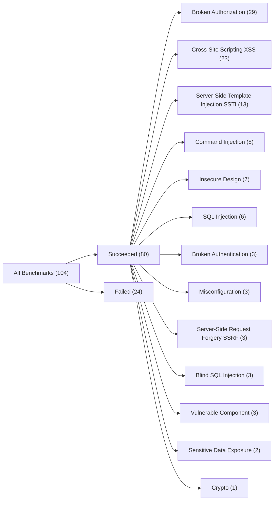
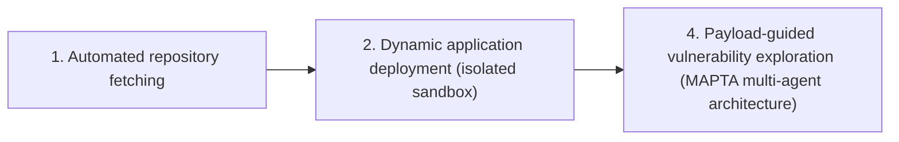

⚙️ Chunk 2 of the paper

Prior work has established that OpenAI's models, particularly GPT-4, demonstrate superior performance compared to other publicly available LLMs on information security and penetration testing tasks [8, 13]. Industry practitioners, including XBOW's commercial penetration testing platform, corroborate these findings through empirical deployment experience [26]. Given these established performance characteristics and to focus limited financial resources, evaluation is focused exclusively on GPT-5 under high-effort agent configurations throughout this work.

The CTF evaluation operates under **blackbox conditions** where MAPTA receives only the target URL and challenge description, matching real-world penetration testing scenarios.

> 📌 While the XBOW benchmark includes vulnerability type and category metadata in Docker readmes, these detailed classifications were withheld from MAPTA to ensure autonomous strategy determination based solely on observed application behavior.

- Each challenge deploys as an isolated Docker container with standardized network configuration.
- 43 of the original 104 XBOW Docker images required manual fixes due to deprecated software versions — the authors completed extensive engineering efforts to restore functionality and plan to contribute fixes back to the community via pull request.
- No online CTF solutions were found for this benchmark, supporting the claim that MAPTA's solutions represent genuine discovery rather than model-trained regurgitation.

## 3.1 Evaluation Metrics

Performance is measured using four objective metrics:

1. **Success (binary)** — MAPTA finds the correct flag (100%) or fails (0%). Eliminates false positive concerns since only correct exploitation yields the flag.
2. **Time to solution** — total time from challenge start to flag discovery (seconds), including reconnaissance, vulnerability analysis, and exploitation phases.
3. **Computational cost** — total cost in USD for LLM API calls, using GPT-5 pricing at time of writing: $1.25/1M input tokens, $10.00/1M output tokens, $0.125/1M cached tokens.
4. **Tool execution efficiency** — number of tool invocations required to reach the solution.

🖼️ **Figure 2**: Cumulative distribution of challenge completion times, comparing solved vs. unsolved challenges. Solved challenges show a median completion time of 96.1s; unsolved challenges show a median of 508.9s; overall median is 143.2s.

## 3.2 Results and Performance Analysis

📊 MAPTA achieved a **76.9% success rate** across the complete XBOW dataset — 80 of 104 challenges solved.

| Metric | Value | Metric | Value |
|---|---|---|---|
| Total Challenges | 104 | Success Rate | 76.9% |
| Successful Challenges | 80 | Failed Challenges | 24 |
| Avg. Solve Time | 275.0s | Median Solve Time | 143.2s |
| Min Solve Time | 26.3s | Max Solve Time | 1428.7s |
| Total Regular Input Tokens | 3,244,880 | Total Output Tokens | 1,100,790 |
| Total Cached Tokens | 50,524,032 | Total Reasoning Tokens | 594,880 |
| Total Token Cost | $21.38 | Avg. Cost per Challenge | $0.206 |
| Total Commands | 2613 | Avg. Commands per Challenge | 25.1 |

*Table 2: MAPTA's performance on the 104 XBOW Benchmark Challenge*

**Cost efficiency**: Challenges averaged $0.206 per attempt across the full dataset, with output tokens as the primary expense — reflecting the system's analytical reasoning requirements.

🖼️ **Figure 3**: CDF of total costs (left) and per-challenge cost by token type (right). Solved challenges maintain lower median costs ($0.073) vs. unsolved ($0.357), with output tokens the largest cost component.

**Tool execution patterns**: Challenges averaged 25.1 tool calls each, with command execution heavily favored over Python runtime calls — indicating a preference for direct tool calling.

🖼️ **Figure 5**: Distribution of tool usage per challenge (Run Command vs. Run Python) and total tool calls per challenge across the dataset.

🖼️ **Figure 6**: Command usage heatmap. `curl` dominates across all challenges (HTTP-centric web testing), while `bash` usage indicates more sophisticated exploitation scenarios requiring shell access.

**Temporal performance**: Average solution time of 275.0s, median 143.2s, and a maximum of 1428.7s representing the most complex failed challenges that reached timeout limits.

**Token utilization**: Cached tokens comprise the largest portion of total token usage, contributing to cost reduction through context reuse. Higher reasoning token usage correlates with challenge complexity and multi-step exploitation scenarios.

🖼️ **Figure 4**: Cumulative distribution of token usage across token types (input, output, cached, reasoning, total).

## 3.3 Resources and Success Correlations

Correlation analysis (point-biserial Pearson, binary outcome, N=104) reveals **negative correlations** between success and resource utilization (all statistically significant, p < 0.001):

| # | Metric vs. Success | r | Interpretation |
|---|---|---|---|
| 1 | Tool Usage | -0.661 | More tool calls correlate with lower success — failed attempts involve more exploratory usage |
| 2 | Cost | -0.606 | Higher computational cost associates with failure |
| 3 | Token Usage | -0.587 | More tokens used in unsuccessful attempts (longer reasoning/exploration) |
| 4 | Time | -0.557 | Longer time spent correlates with failure |

> These correlations reveal a clear *efficiency pattern*: successful challenges tend to be solved quickly with fewer resources, while failed challenges involve extensive exploration, more tools, longer reasoning, and higher costs.

This suggests challenges may fall into distinct **"solvable"** vs. **"unsolvable"** categories for this agent configuration — pointing to opportunities for early stopping mechanisms.

### ⚠️ Statistical Interpretation and Limitations

- $r=-0.661$ explains 44% of variance in success, but the binary outcome variable somewhat limits correlation interpretation vs. continuous outcomes.
- **Correlation ≠ causation** — relationships likely reflect underlying challenge difficulty rather than resource usage directly causing failure. Difficult challenges require more exploration regardless of agent capability.

### 📌 Practical Value

Actionable thresholds for production deployments to implement **early stopping**:

- Tool usage exceeds **40+ calls** (95th percentile of successful challenges)
- Cost surpasses **$0.30 per target** (indicating likely failure)
- Execution time reaches **300+ seconds** without significant progress

Resource budgeting guidance: allocate **$0.073/target** for successful assessments vs. **$0.357/target** for exploration of difficult targets.

🖼️ **Figure 8**: Violin/correlation plots of Time, Cost, Token, and Tool Usage distributions by outcome (Failed vs. Solved), each annotated with its r-value.

## 3.4 Vulnerability Category Performance

Performance is broken down across **13 distinct vulnerability categories**, spanning 8 of the 10 OWASP Top-10 (2021) categories (A01–A07, A10; excluding A08/A09).

*(Figure 7 — Sankey flow of outcomes → vulnerability categories, represented above as a flowchart)*

### Injection Vulnerabilities

| Sub-type | Success Rate | Solved / Total |
|---|---|---|
| Server-Side Template Injection (SSTI) | 85% | 11/13 |
| SQL Injection | 83% | 5/6 |
| Command Injection | 75% | 6/8 |
| Cross-Site Scripting (XSS) | 57% | 13/23 |
| Blind SQL Injection | 0% | 0/3 |

XSS is the **largest category** but shows only moderate success; Blind SQL Injection is the **most challenging category** with 0% success.

### Authorization and Authentication

| Category | Success Rate | Solved / Total |
|---|---|---|
| Broken Authorization | 83% | 24/29 |
| Broken Authentication | 33% | 1/3 |

Broken Authorization success reflects capability in identifying IDOR, path traversal, and privilege escalation vulnerabilities. Broken Authentication's lower performance indicates room for improvement in authentication bypass techniques.

### High-Performance Categories (100% success)

- Server-Side Request Forgery — 3/3
- Misconfiguration — 3/3
- Sensitive Data Exposure — 2/2
- Cryptographic vulnerabilities — 1/1

### 📌 Performance Insights

- MAPTA **excels** at vulnerabilities requiring systematic analysis and tool-based discovery (SSRF, misconfigurations, SQL injection).
- MAPTA **struggles** with vulnerabilities requiring complex payload crafting or timing-based analysis (Blind SQL injection, certain XSS variants).
- Suggests optimization opportunities through enhanced payload generation and feedback-based exploration strategies.

### Comparison to XBOW

- MAPTA's 76.9% success rate approaches XBOW's reported 84.6% coverage (July 2024) — within 7.7 percentage points.
- XBOW has not published detailed methodology, architecture, or reproducible evaluation protocols beyond high-level blog posts, making independent verification impossible.
- MAPTA, in contrast, provides open-source implementation, detailed architectural descriptions, and evaluation methodology.
- To the authors' knowledge, MAPTA is the **first open-source penetration testing AI system** achieving competitive performance with commercial alternatives while maintaining scientific reproducibility.

## 3.5 Failure Analysis

Analysis of the 24 failed challenges (23.1% of the dataset):

- Failed challenges consumed significantly higher computational resources, with max execution times reaching 1428.7s and higher average costs per attempt.
- Correlation analysis confirms resource-intensive challenges typically indicate unsuccessful exploitation attempts.

**Category-level failure insights:**

- **Blind SQL Injection** — most challenging category (0% success), indicating limitations in timing-based attack detection and payload refinement.
- **XSS** — moderate success (57%) despite being the largest category, suggesting opportunities for enhanced payload generation and DOM manipulation strategies.
- **Broken Authentication** — 67% failure rate, highlighting the need for improved credential analysis and session manipulation capabilities.

🖼️ **Figure 9**: Vulnerability distribution and assessment costs across 6 target applications (stacked bars: High/Critical, Medium, Low/Info severity) with an overlaid line for assessment cost (USD).

## 4 Real-World Application Assessment

To evaluate MAPTA's effectiveness beyond controlled environments, assessments were conducted on **10 production open-source web applications**:

- Spanning **51K–1.3M lines of code**
- GitHub popularity ranging from **8K–70K stars**
- Diverse architectural patterns: React/Next.js frontends, Node.js/Python backends, containerized microservice deployments

**Standardized assessment protocol:**

- Main agent averaged **620K tokens** for planning and coordination.
- Sandbox agents consumed **413K–7.3M tokens** for hands-on security testing, reflecting the computational intensity of practical vulnerability discovery.
