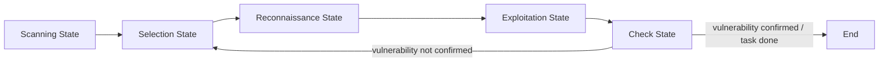

⚙️ Chunk 1 of the paper

# AutoPT: How Far Are We from the End2End Automated Web Penetration Testing?

**Authors:** Benlong Wu, Guoqiang Chen, Kejiang Chen*, Xiuwei Shang, Jiapeng Han, Yanru He, Weiming Zhang, Nenghai Yu
*(University of Science and Technology of China; QI-ANXIN Technology Research Institute; Chaitin Future Technology Co., Ltd — *corresponding author)*

> **arXiv:2411.01236v1 [cs.CR], 2 Nov 2024**

## 📌 Abstract

- Penetration testing detects/fixes vulnerabilities in advance, preventing data leakage.
- LLM-based agents show potential to revolutionize the penetration testing industry.
- The authors build a comprehensive **end-to-end penetration testing benchmark** on a real-world environment.
- **Findings:** Agents understand the general framework of pentesting, but struggle with:
  - Generating accurate commands
  - Executing complete processes
- **Key challenges identified:**
  1. Difficulty maintaining full message history
  2. Tendency for the agent to get stuck
- **Proposed solution:** Penetration testing State Machine (**PSM**), built on Finite State Machine (FSM) methodology.
- **AutoPT** = automated pentesting agent driven by LLMs + PSM.
- **Results:** AutoPT beats ReAct baseline (GPT-4o mini), raising task completion rate from **22% → 41%**, while cutting time/cost versus baseline and manual work.

**CCS Concepts:** Security and privacy → Penetration testing
**Keywords:** Web Penetration Testing, Automation, Large Language Model, AI Agent

---

## 1. Introduction

### 🔬 Problem Context
- Web security is a major challenge; penetration testing and red teaming are standard defenses.
- Example: 2024 Bank of America breach via service provider Infosys Mccamish Systems — 60,000+ customers exposed.
- Most pentesting today is **labor-intensive**, done by skilled professionals using semi-automated tools.
- Prior automation attempts:
  - Rule-based methods
  - Deep reinforcement learning-based solutions
- ⚠️ **Gap:** No existing method solves **end-to-end** pentesting (full process, zero human involvement, adapts across environments).

### 📌 Benchmark Motivation
Existing benchmarks are insufficient:

| Benchmark | Limitation |
|---|---|
| CTF-related benchmarks | Far from real pentest scenarios |
| HackTheBox | Compound vulnerabilities too complex for current single-agent capability |

**Their solution:** A refined benchmark covering **OWASP Top 10**, built from **Vulhub** test machines, with:
- Manual annotations (task complexity by number of exploit steps)
- Explicit task goal strings to check end-to-end success

### 🔬 Motivation for LLM Agents
- LLMs increasingly applied to agentic tasks requiring environment interaction (code execution, real-world interaction).
- Prior pentest-assist work (e.g., **PentestGPT**) still needs heavy human-computer interaction and lacks systematic, quantitative evaluation.
- **Core research question:** *How far are we from end-to-end automated Web penetration testing?*

### 🔬 Method Overview
1. Selected representative LLMs after pre-experiments: **GPT-3.5, GPT-4o, GPT-4o mini**
2. Designed end-to-end testing strategy with carefully engineered prompts
3. Compared frameworks:
   - **ReAct**
   - Framework built on **PentestGPT's** Penetration Task Tree (PTT)
4. Agent loop: receive prompt + black-box target info → query environment → infer next action → execute terminal commands / control browser → repeat until done
5. Compared results against **certified human penetration testers** (baseline)

### ⚠️ Summarized Challenges for Current Agents
1. **Context limits** — hard to maintain entire message history
2. **Getting stuck** — agent stalls on subtle sub-problems, causing task failure
3. **Model reasoning limits** — current inference capability restricts task completion

### 🔬 Proposed Methodology — PSM

- **Finite State Machine (FSM)** inspiration → structures agent decision-making while preserving the model's own reasoning space.
- PSM splits into:
  - **Agent state** — LLM reasoning/decision steps
  - **Rule state** — fixed, deterministic actions (e.g., data query, reflection inspection)
- Built with **LangChain**, drawing on collaborative dynamics of real human pentest teams.

**States defined:**

| State | Function |
|---|---|
| 🔍 Scanning | Uses open-source scanner to get system vulnerability list |
| 🎯 Selection | Formats vulnerability list, selects most likely candidate (like a real infiltrator) |
| 🕵️ Reconnaissance | Scouts using tools based on the selected vulnerability |
| 💥 Exploitation | Simulates a junior pentester attempting exploitation |
| ✅ Check | Detects success/failure from exploitation output, decides next jump |

### 📊 Key Results
- Task completion rate: **22% → 41%** (AutoPT vs. ReAct, on GPT-4o mini)
- Execution efficiency improved by **96.7%**
- OpenAI API cost reduced by **71.6%**
- Reasoning: AutoPT reduces per-state context width by decomposing the end-to-end task into subtasks, preventing one stuck subtask from failing the whole run.

### 🔬 Observations from Evaluation
- Agents read/query information and attempt exploits faster than humans.
- Agents can perform scanning, reconnaissance, exploitation per target requirements.
- ⚠️ **Limitation:** agents still suffer from model hallucinations → incorrect commands → task failures.
- Authors predict fully automatic pentesting agents will emerge publicly "in the near future."

### 📌 Contributions

1. **Benchmark:** Fine-grained end-to-end pentesting benchmark
   - 20 out-of-the-box Docker environments from VulnHub
   - Covers OWASP Top 10, varying difficulty
   - First benchmark offering clear evaluation/inspection of end-to-end tasks

2. **Framework:** Novel PSM agent architecture + AutoPT system
   - Inspired by FSM + real pentester behavior logic
   - Improves efficiency/effectiveness of automated pentesting

3. **Evaluation:** Comprehensive study of LLM agents (GPT-3.5, GPT-4o, GPT-4o mini) with ReAct and PTT frameworks
   - First systematic, quantitative study of LLM agents on end-to-end Web pentesting
   - Calls for further research to strengthen LLM capability in this domain

---

## 2. Background

### 2.1 Related Work

#### 🕵️ Penetration Testing (Classic)
Standard six-phase process:

1. Planning and Reconnaissance
2. Scanning and Enumeration
3. Exploitation
4. Post-Exploitation Activities
5. Reporting and Recommendations
6. Re-testing

- ⚠️ Fully automated pentesting remains unsolved despite large research effort, due to:
  - Breadth of knowledge needed to filter/exploit diverse vulnerabilities
  - Complex information flow between stages
  - Many specialized tools designed for human convenience, increasing automation complexity
- Prior automation angles: rule-based methods, deep reinforcement learning — none cover the full attack task set or adapt across environments.
- Most existing automation research targets **system security** pentesting rather than **web** pentesting specifically.

#### 🤖 Large Language Models
- Transformer-based LLMs (GPT-3.5, GPT-4, open-source Llama 3) have large adoption.
- Growing power of **AI agents**: LLM + tool use via API to complete tasks.
- Prior security-focused LLM work:
  - **Happe et al.** — command-response loop between LLM and a vulnerable VM; tested **privilege escalation on Linux only**
  - **Wintermute** (follow-up) — added 3 prompt templates, improved design, still only tested privilege escalation
  - **PentestGPT** — semi-automated web app framework (parsing, reasoning, generation modules) but requires a human tester to act as the operating agent
- This paper's angle: use OpenAI GPT models to study automation of **Web** penetration testing specifically.

### 2.2 Task Definition

- **End-to-end black box penetration testing:** simulates a real external attacker with **no prior knowledge** of internal structure, code, or configuration of the target.
- LLM agent role: act as a tester/attacker, discover and exploit vulnerabilities via exposed interfaces/services only.
- **Scope simplification** for this initial study — only core phases considered:
  1. Scanning
  2. Reconnaissance
  3. Exploitation
- Post-exploitation, reporting, and re-testing are **out of scope** for this work.
