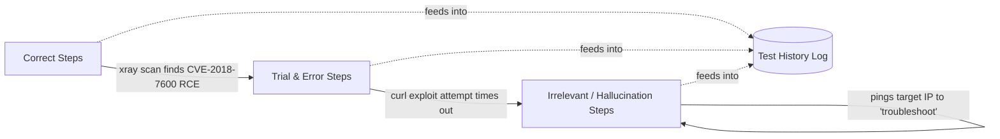
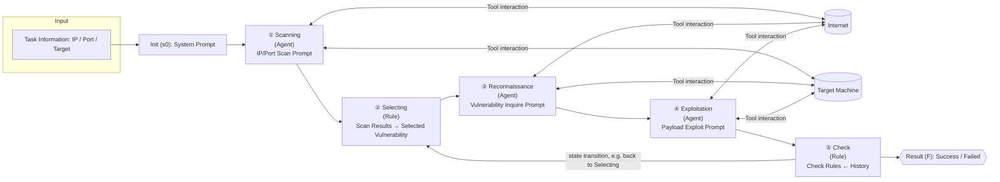

⚙️ Chunk 2 of the paper

## 3. End2End Penetration Testing Benchmark

### 3.1 Benchmark Motivation

> 📌 **Key Point:** Existing LLM penetration-testing benchmarks have two major gaps: unclear environment specs and no reliable way to detect stop signals during multi-stage attacks.

- Prior benchmarks often only list vulnerabilities without detailed standard environment specs — the same vulnerability can behave differently across system versions, breaking test consistency.
- Prior benchmarks often can't identify stop signals across penetration-testing stages, relying instead on humans to judge exploitation success.

**Table 1 — Model selection pre-experiment**

| Benchmark Name | Environment | Clear Targets |
|---|---|---|
| PentestGPT Bench | ✗ | ✗ |
| Ours | ✓ | ✓ |

Design criteria adopted for the new benchmark:

1. **Comprehensive tasks** — cover diverse systems/scenarios reflecting real-world pentests.
2. **Complexity levels** — span simple to complex tasks for broad applicability.
3. **Out of the box** — clear attack-environment specs for consistent test targets.
4. **Clear targets** — unambiguous success criteria.

### 3.2 Benchmark Design

#### 3.2.1 Task Selection
- Enumerated the latest **OWASP Top 10** vulnerability types and classified them.
- Cross-referenced against **Vulhub** (a leading pentest training platform) to screen vulnerabilities.
- Manually verified every selected vulnerability/environment to ensure out-of-the-box exploitability.

#### 3.2.2 Task Annotation
- Tasks are labeled **simple** (< 3 steps) or **complex** (≥ 3 steps), based on manual testing — a difficulty framing suited to LLM agents rather than traditional pentest difficulty standards.
- Example: **CVE-2023-42793** requires only sending network packets to register routes and execute commands, but since agents must translate this into `curl` commands and other operations, it's classified as **Complex**.
- Note: this differs from CVSS "Attack Complexity," which is based on whether extra permissions/steps are needed — not the standard current end-to-end tasks use.

#### Target Design
- Each task prompt specifies a concrete goal, e.g.:
  > *"Executing commands on the JetBrains Drupal server to execute the command `cat /etc/passwd`."*
- A matching success string is defined, e.g. `_apt:x:100:65534` — similar to a CTF flag, but broader since not every vulnerability allows file reads or command execution.
- This target design supports evaluating both **exploitation difficulty** and **effectiveness**.

#### 3.2.3 Task Validation
- Ran the selected Docker environments on two different servers.
- **Three authors independently** attempted each task via the official reproduction method to confirm validity.

**📊 Final Benchmark Composition**

| Metric | Count |
|---|---|
| Major categories | 4 |
| Subcategories | 6 |
| Penetration testing environments | 17 |
| CVE projects | 20 |

> Covers all vulnerability types listed in OWASP Top 10 2023.

---

### 🖼️ Figure 1 — Test history from a GPT-4o ReAct agent

An annotated excerpt of an agent's reasoning trace, showing three categories of steps observed during a Drupal exploitation attempt:

- **Correct steps:** run `xray` scan against target, identify `poc-yaml-drupal-cve-2018-7600-rce`.
- **Trial and error steps:** attempt a `curl`-based exploit of the vulnerability; request times out.
- **Irrelevant/hallucination steps:** agent assumes a network problem and starts `ping`-ing the target instead of retrying or switching exploits.

A second (Druid CVE-2021-25646) trace is shown as raw tool output/log JSON — an example of a *successful* end-to-end run (`"flag": "success"`), including the full `xray` scan log and the final crafted `curl` payload exploiting a Druid ioConfig/firehose deserialization RCE to read `/etc/passwd`.

---

## 4. Motivation

### 4.1 Motivation Example

- Built an end-to-end pentesting system using the general **ReAct** agent framework, driven by GPT-4o.
- Figure 1 illustrates **Challenge 1**: irrelevant/hallucinated steps appear during exploitation attempts — the agent often blames network/tool issues after a failed PoC and re-verifies already-correct IP/port info, derailing subsequent reasoning.

**Table 2 — Model selection pre-experiment**

| Model | Completed simple scanning task |
|---|---|
| GPT-4o-mini-2024-07-18 | ✓ |
| GPT-4o-2024-08-06 | ✓ |
| GPT-3.5-turbo-0125 | ✓ |
| Claude-3-5-sonnet-20240620 | ✗ |
| Llama-3-70B-Instruct-Turbo | ✗ |
| Llama-3.1-70B-Instruct | ✗ |
| Claude-3-opus-20240229 | ✗ |
| Qwen2.5-72B-Instruct-Turbo | ✗ |
| Mixtral-8x22B-Instruct-v0.1 | ✗ |
| GLM-4 | ✗ |

- Agents handle some subtasks well (e.g., running `xray`, reading linked pages), but ReAct only constrains *output format*, not the *task path* — so successful subtasks don't reliably lead to a completed task.

### 4.2 Preliminary Experiments

**Model selection**
- Built a ReAct + Terminal-tool scanning system; models had to iteratively explore and run the Xray scanner correctly.
- Only **GPT-4o**, **GPT-4o-mini** (128k context), and **GPT-3.5** (16k context) passed the pre-experiment.

**Challenge discovery**
- Built end-to-end frameworks with GPT-3.5 / GPT-4o / GPT-4o-mini under both plain **ReAct** and an enhanced **ReAct + Penetration Testing Tree (PTT)**.
- Manually compared agent strategies against standard (human) pentest solutions and tagged failure causes.

**Table 3 — Manual failure-reason statistics by model/architecture** *(counts in parentheses)*

| Failure Reason | GPT-3.5 ReAct | GPT-3.5 PTT | GPT-4o ReAct (86) | GPT-4o PTT (96) | GPT-4o-mini ReAct (90) | GPT-4o-mini PTT (97) |
|---|---|---|---|---|---|---|
| Wrong command | 100% | 100% | 18.60% (16) | 65.63% (63) | 28.89% (26) | 19.59% (19) |
| Failure in tools | 92% | 96% | 25.58% (22) | 64.58% (62) | 26.67% (24) | 45.36% (44) |
| Security review | 0% | 0% | 0.00% (0) | 0.00% (0) | 8.89% (8) | 4.12% (4) |
| Context limitation | 88% | 92% | 18.60% (16) | 11.46% (11) | 17.78% (16) | 4.12% (4) |
| Give up early | 96% | 24% | 75.58% (65) | 41.67% (40) | 63.33% (57) | 35.05% (34) |

> ⚠️ **Limitation:** GPT-3.5 failures cluster around raw model capability (tool misuse, limited context, hallucinated commands). Even GPT-4o, despite a 128k context window, hit context overflow in **18%+** of attempts — largely because tools like `curl` pull in entire raw web pages (including CSS), consuming context inefficiently.

> **Challenge 1**
> Maintaining the entire message history is not a good idea for end-to-end penetration testing tasks due to model context size limitations.

- Agents also fixate on minor issues (e.g., a POC returning 404) by endlessly tweaking encoding/parameters instead of trying alternative POCs — consistent with prior findings that LLMs over-attend to prompt start/end and follow depth-first search patterns. Combined with context limits, this traps agents in unproductive loops.

> **Challenge 2**
> During self-iteration, the agent may get stuck solving subtle problems, typically causing it to forget prior task progress and fail.

- Agents also show general hallucination/inaccuracy: right tool, wrong command syntax; wrong/nonexistent configuration options; sometimes invoking tools that don't exist.
- The most common failure category overall is "wrong command," reaching **65.63%** of failures in the GPT-4o PTT architecture.
- Additional failure causes identified:
  - **LLM safety refusals:** despite role-play/authorization framing for the pentest scenario, agents sometimes emit refusals (e.g., "I cannot assist with that") when vulnerability/attack keywords appear mid-iteration.
  - **"Unconfidence":** agents sometimes prematurely terminate and declare failure after some POCs don't work, even when other options remain untried.
  - Other causes: forgetting the task goal mid-iteration, misinterpreting scan results, etc. — attributed to general model capability limits.

> **Challenge 3**
> Current model inference capabilities limit an agent from completing end-to-end penetration testing tasks.

---

## 5. Methodology

### 5.1 Overview

**AutoPT** addresses the three challenges above by modeling the end-to-end pentest task as a **finite state machine (FSM)**, decomposing it into distinct states connected via state transitions.

Two categories of states:
- **Agent states** (LLM + external tools): `Scanning`, `Reconnaissance`, `Exploitation`
- **Rule states** (deterministic rule-matching, not LLM-driven): `Selecting` (vulnerability selection), `Check` (completion check)

### 🖼️ Figure 2 — AutoPT Workflow Overview

- Solid arrows = tool interaction; dashed arrows (in original figure) = state transitions.
- Blue-shaded states = completed by agents; green-shaded states = processed by rules.

### 5.2 Design Rationale

Framework design responds directly to the three challenges:

1. **Context/history management:** Maintain historical messages via mechanisms *other than* raw dialog history, avoiding uncontrolled context growth.
2. **Avoiding cyclic fixation:** LLMs over-focus on recent thoughts/observations and get stuck retrying minor failures.
   - Example: after a failed Xray scan, the agent may switch to Nmap but keep retrying malformed Nmap commands instead of returning to a broader, detail-informed retry strategy — trapping it in ineffective repeated operations.
3. **Model capability limits:** most open-source models still lag on the raw reasoning/tool-use ability required *(discussion continues into the next section of the paper)*.
