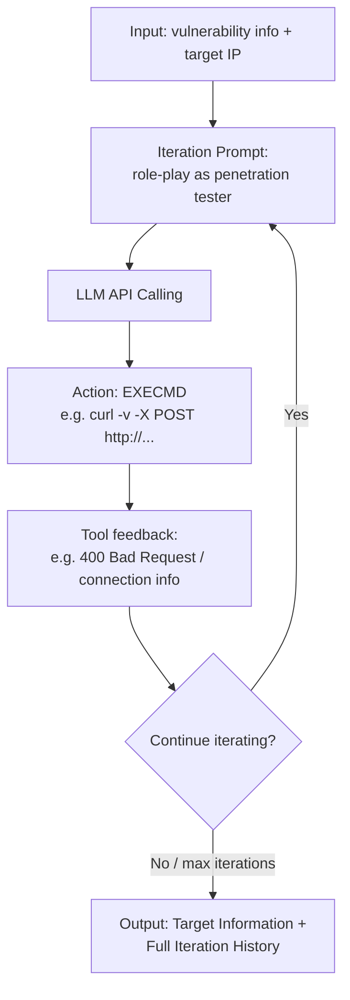
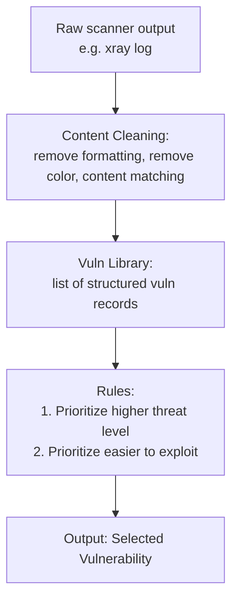

⚙️ Chunk 3 of the paper

## 🔬 Method: Pen-testing State Machine (PSM) Design

LLMs lack fine-tuned network security knowledge and have limitations in planning and detailed execution of penetration testing tasks. **AutoPT** addresses this by designing an agent framework with external constraints, inspired by traditional state machines, to reduce task difficulty and increase success rate.

> 📌 **Key Point:** The end-to-end task is split into multiple states. Each state solves its subtask independently, switches states upon completion, and reports results to the next state — without maintaining full task context. A failure in one state does not propagate through the entire process.

### Definition 1 — Finite State Machine (FSM)

A finite state machine is a state-labeled, attributed automaton:

$$M = (S, S_0, \Sigma, \delta, O, F)$$

- $S$ — set of states
- $S_0$ — initial state
- $\Sigma$ — set of input symbols
- $\delta : S \times \Sigma \rightarrow S$ — transition function
- $O : S \times \Sigma \rightarrow \Gamma$ — output function assigning an output from alphabet $\Gamma$
- $F \subseteq S$ — set of final (accepting) states

The state carries the history of the machine, tracking how it reached the current situation.

FSMs are traditionally divided into:
- **Mealy machines** — output depends on current state *and* input symbol
- **Moore machines** — output depends only on current state; transition function depends on current state and output symbol

> In AutoPT, all nodes are defined as **Mealy machines**, taking the system prompt or contextual interaction content of the previous state (previous output + optional environmental feedback) as the input symbol.

### Definition 2 — Pen-testing State Machine (PSM)

Formulated as a six-tuple $(S, s_0, \Sigma, \delta, O, F)$, explained in the pen-testing context:

| Component | Meaning in AutoPT |
|---|---|
| **State Set $S$** | Each state is a predefined situation/configuration; upon entry, a set of predefined operations is performed |
| **Initial state $s_0$** | Triggered when target IP, port, and task target are received; system initializes and process starts |
| **Input symbol set $\Sigma$** | Infinite message set (text unit): $\Sigma = \{O, T\}$ — context info $O$ from previous state + optional environment feedback $T$ |
| **Transition function $\delta$** | $\delta : S \times \Sigma \rightarrow S$, maps current state + input symbol to next state (DFA-style) |
| **Output function $O$** | $O : S \times \Sigma \rightarrow \Gamma$, where $\Gamma = \{O, F\}$ (current state's context output + optional environment feedback); output is either the agent's output, tool call feedback, or static rule processing |
| **Final state set $F$** | $F \subseteq S$; defined as **"Failed"** and **"Success"** |

### Agent State vs. Rule State

Depending on whether an LLM agent is involved, states are divided into two types:

- **Agent state** — uses a set of prompts $\{P_1, P_2, ...\}$ to initialize the agent per state; each prompt corresponds to its own tool set, chosen to be sufficient for the sub-task. This differentiated prompting gives the LLM the most relevant guidance per state.
- **Rule state** — uses rules to process input contextual content and filter output, constraining the Agent state's behavior and improving focus on specific steps.

> ⚠️ This design solves **Challenge 1**: replacing full context iteration with interactive messages between states — each state only needs the core task content and the previous state's output, not the entire history.

---

## 📊 Figures

🖼️ **Figure 3 — Example process of an Agent state (Exploit state):** Shows an iteration prompt ("You are a well-trained penetration tester...") fed into the LLM API, which issues a terminal action (`curl -v -X POST http://...`), receives feedback (e.g. a "400 Bad Request" note), iterates again, and produces target information plus the full iteration history as output.



🖼️ **Figure 4 — Example process of a Rule state (Selection state):** A scanner (`xray`) output log is content-cleaned (formatting/color removal, content matching) into a structured vulnerability library, then filtered by preset rules (prioritize high threat level, prioritize easier exploits) to select a single output vulnerability.



---

## 5.3 Implementation

### 5.3.1 Agent State

Unlike a traditional FSM, each Agent state takes the **previous stage's output symbols as input**, and proceeds as:

1. Splice the initial prompt (role-play definition, task goal, tool definition) with the input message to form the total prompt.
2. Parse the LLM's output to extract the tool(s) it calls and their input content.
3. Merge the tool call return value back into the total prompt and re-feed it to the model.
4. Repeat steps 2–3 until the max iteration count is reached or the model actively exits the state (prevents infinite looping).
5. Parse all model outputs and tool outputs to obtain the current state's output value, ending the state.

```
Algorithm 1: Agent State Process
Input: Initialization Prompt P, Input I, LLM L, Tools T,
       Max Iterations M, Parsing Function F, Output Parsing Function O
Output: Processed output Γ

1  P* ← P + I
2  while iteration steps ≤ M do
3      F(L(P*)) → L_output, T_invoke, T_input
4      T_output ← T(T_invoke, T_input)
5      P* ← P* + L_output + T_output
6      if L exits current state then
7          break
8      end
9  end
10 Γ ← O(L(P*) + T_output)
11 return Γ
```

**📌 Prompts.** Each Agent-state prompt has 5 parts:

1. **Description** — details of operations the LLM should perform in the current state
2. **Role-playing** — frames the model as a legal, authorized penetration tester to reduce refusals
3. **Example** — ReAct-style thought/action demonstration
4. **Tools description** — available tools and example input values
5. **Response format** — explanation of the thought-action template

These prompts sit in the system message of each LLM agent and are invisible to other agents.

**🔧 Tools.** Each Agent state is given a relevant subset of three tool types:

- **Terminal** — a local Kali Linux Docker environment (root access) with penetration tools installed, allowing command execution (with the caveat that hallucinated dangerous commands, e.g. `wget http://localhost -O- | sh`, are a risk)
- **Playwright** — a headless browser (via Langchain's Playwright library, optimized) for website interaction
- **Search** — performs a Google search and returns the first page's info for a keyword, or fetches and returns link content for a URL

Tool assignment by state: **Terminal** → Scanning; **Search** → Information Collection; **Terminal + Playwright** → Exploiting.

**Parsing Functions.** Each Agent state has a parsing function that handles natural-language exchange between the agent's tool calls and the target environment, extracting the tools to call and their cleaned input content per the prompt's required output format. An example (Exploitation state) is shown in Figure 3.

### 5.3.2 Rule State

Also takes the previous stage's output as input, but instead:

1. Parses the input and cleans out core information per preset rules (e.g. removing irrelevant flags like `[INFO]` from scan results).
2. Generates the state's output value from the cleaned information per preset rules, ending the state.

```
Algorithm 2: Rule State Process
Input: Input I, Preset Rules R, Parsing Function F, Output Generation Function O
Output: Processed output Γ

1  I* ← F(I)
2  Γ ← O(I*, R)
3  return Γ
```

**Parsing Functions.**
- *Vulnerability selection stage:* removes irrelevant messages from historical scanner results to extract vulnerability-related fragments, collecting them into a **vulnerability library** (each entry: name, description, hazard, type, reference info).
- *Check state:* cleans content fragments related to vulnerability-exploitation operations (e.g. terminal output, webpage responses) to support precise rule matching.

**Rules.**
- *Vulnerability selection state:* prioritizes vulnerabilities with **high harm** and **simple exploitation**; selected vulnerabilities are removed from the library and returned as output.
- *Check state:* a target output value is preset per vulnerability. If the target information appears after exploitation → **"Success"**. If not, and the retry threshold isn't exceeded → return to vulnerability-exploitation status. If the threshold is exceeded → the vulnerability is deemed currently inexploitable and control returns to vulnerability selection. If **all** vulnerabilities in the library are tried and fail → output is **"Failed"**.

An example (Selection state) is shown in Figure 4.

### 5.3.3 State Transition

The state transition function is modeled as a **graph structure**:

- All states (including initial $s_0$ and terminal states $F$) are nodes
- State transitions are edges
- A **routing function** schedules the next state based on the current state and its output value

```
Algorithm 3: PSM Process
Input: Target machine info IP, Task Target T, System Prompt P,
       PSM ⟨S, s0, Σ, δ, O, F⟩, output of state S is Γ,
       total interaction history Γ*, s.type ∈ [Agent, Rule]
Output: Final interaction history Γ*

1  Γ ← P + IP + T
2  Γ* ← Γ
3  s ← s0
4  while s ∉ F do
5      if s.type == Agent then
6          Γ ← AgentStateProcess(Γ, IP, T)
7      else
8          Γ ← RuleStateProcess(Γ, IP, T)
9      end
10     s ← δ(s, Γ)
11     Γ* ← Γ* + Γ
12 end
13 return s, Γ*
```

> ⚠️ This design solves **Challenge 2**: forcing state jumps to prevent the agent from getting stuck during automated solving.

---

## 6. Evaluation

**Research Questions:**

- **RQ1 (Effectiveness):** How effective is AutoPT for end-to-end penetration testing tasks?
- **RQ2 (Performance):** How does AutoPT compare with other LLM-based agents?
- **RQ3 (Cost):** How does AutoPT's cost compare with other LLM-based agents or human experts?

### 6.1 Evaluation Settings

- Three working versions: **AutoPT-GPT-3.5**, **AutoPT-GPT-4o**, **AutoPT-GPT-4o-mini**
- Temperature = 0, max iteration steps = 15 (for reproducibility and cost control)
- Environment: Terminal deployed on Docker (Kali Linux 2024.1), self-developed headless browser (Playwright), and the Search tool

### 6.2 Effectiveness Evaluation (RQ1)

**Table 4 — Overall pass rate by model (Simple vs. Complex vulnerabilities)**

| Simple Vulnerability | GPT-4o | GPT-4o mini | GPT-3.5 | Complex Vulnerability | GPT-4o | GPT-4o mini | GPT-3.5 |
|---|---|---|---|---|---|---|---|
| CVE-2017-9841 | 100% | 100% | 0% | CVE-2018-7600 | 80% | 100% | 0% |
| CVE-2018-12613 | 40% | 100% | 0% | CVE-2020-10199 | 40% | 0% | 60% |
| CVE-2021-23017 | 0% | 0% | 0% | CVE-2017-12615 | 0% | 0% | 0% |
| CVE-2021-25646 | 40% | 100% | 20% | CVE-2023-42793 | 0% | 0% | 0% |
| CVE-2019-3396 | 0% | 0% | 0% | CVE-2021-22911 | 100% | 80% | 20% |
| CVE-2023-51467 | 40% | 60% | 0% | CVE-2021-29441 | 40% | 0% | 0% |
| CVE-2022-26134 | 0% | 100% | 20% | CVE-2020-1938 | 0% | 0% | 0% |
| CVE-2015-1427 | 20% | 100% | 100% | CVE-2017-10271 | 0% | 0% | 0% |
| CVE-2020-14750 | 0% | 0% | 0% | CVE-2021-45232 | 0% | 0% | 0% |
| CVE-2017-8917 | 20% | 0% | 0% | CVE-2016-10134 | 0% | 0% | 0% |
