⚙️ Chunk 4 of the paper

To verify the effectiveness of the AutoPT architecture on the end-to-end penetration testing task, independent validation experiments were run on the collected test data sets. Each vulnerability environment was independently tested five times, with results and logs recorded and the system reinitialized between runs.

> 📌 **Key Point:** Existing LLMs can complete most *simple* end-to-end penetration testing tasks, but perform only averagely on tasks with more operation steps. GPT-4o mini has the highest overall success rate (40% of total tasks) but only 20% on complex tasks, while GPT-4o completes 40% of complex tasks.

- In the **Agent state**, each agent solves a relatively simple subtask, achieving a higher success rate than solving complex end-to-end tasks directly.
- The **Rule state** successfully keeps the Agent state focused on core vulnerability information, improving performance on both query and vulnerability-exploitation subtasks.

> ✅ **Answering RQ1:** AutoPT effectively completes most end-to-end penetration testing tasks. Even with a slightly weaker underlying model, the AutoPT architecture provides strong automated penetration testing capability.

## 6.3 Performance Evaluation (RQ2)

🖼️ *Figure 5 — Overall performance of agents based on GPT-3.5, GPT-4o, and GPT-4o mini across the ReAct, PTT, and AutoPT architectures:*

```mermaid
xychart-beta
    title "Overall Accuracy by Model and Architecture (%)"
    x-axis ["GPT-4o mini", "GPT-4o", "GPT-3.5"]
    y-axis "Accuracy (%)" 0 --> 40
    bar "ReAct" [10, 14, 0]
    bar "PTT" [3, 4, 0]
    bar "AutoPT" [36, 26, 11]
```

🖼️ *Figure 6 — Average performance on simple vs. complex tasks (GPT-4o and GPT-4o mini averaged) across ReAct, PTT, and AutoPT:*

```mermaid
xychart-beta
    title "Average Accuracy by Task Complexity (%)"
    x-axis ["Simple", "Complex"]
    y-axis "Accuracy (%)" 0 --> 41
    bar "ReAct" [22, 2]
    bar "PTT" [5, 2]
    bar "AutoPT" [41, 21]
```

### 📊 Results Summary

- AutoPT (across GPT-3.5, GPT-4o, GPT-4o mini) far outperforms the ReAct and PTT frameworks.
- Even the weakest model, **GPT-3.5**, jumps from a 0% baseline to **11%** under AutoPT — more than some GPT-4o/GPT-4o mini results under other architectures. This demonstrates the architecture can compensate for weaker model capability, addressing **Challenge 3**.
- **GPT-4o mini + AutoPT** reaches a **36%** success rate, indicating a high performance ceiling for the approach.
- Compared with ReAct, AutoPT roughly **doubles** completions on simple tasks and achieves **~10×** the completions on complex tasks.
- Splitting tasks into subtasks (vs. ReAct's monolithic approach) lets the model focus on simpler, clearer tasks, reducing erroneous commands and hallucination.

> ✅ **Answering RQ2:** AutoPT's success rate significantly exceeds other agent frameworks — roughly double on simple tasks and nearly 10× on complex tasks.

## 6.4 Cost Evaluation (RQ3)

### 💰 Table 5 — Money and Time Cost Comparison

| Metric | AutoPT | ReAct | PTT | Human |
|---|---|---|---|---|
| Money | $0.99325 | $3.49266 | $4.12331 | $310 |
| Time | 4.48 h (16,131.07 s) | 8.81 h (31,730.98 s) | 10.83 h (38,997.49 s) | ~5 h |

- Cost analysis uses **GPT-4o mini** (highest success rate). Across 20 experiments: total cost **$0.99325**, average cost **$0.00993**, total time **16,131.07 s**, average time **161.31 s**.
- Overall success rate: **41%**, i.e., **$0.02423 per website**.

🔬 **Why AutoPT is cheaper:**
1. State-machine jumps raise task success and cut redundant operations.
2. LLM-driven agents work without time/location restrictions.
3. API costs for LLMs have continually declined since their introduction.
4. Open-source model capability keeps improving; local deployment could further cut network-latency time costs.

**Human baseline estimate:**
- Manual reproduction of all 20 vulnerabilities took an average of **5 person-hours**.
- Using a 2024 average penetration tester salary of **$124,000**/year (40 h/week × 50 weeks), the hourly rate ≈ **$62**, giving a total human cost of **≈ $310** — roughly **300×** the cost of AutoPT.

> ⚠️ These figures are rough approximations intended to illustrate relative economic feasibility, not precise real-world attack costs.

> ✅ **Answering RQ3:** Compared with humans, AutoPT reduces time by 10% and economic cost by 99.6%. Compared with other LLM-based frameworks, it reduces time by 50% and economic cost by 71.6%.

## 7 Validity Analysis

### 7.1 Internal Threats

1. **AutoPT architecture performance** — mitigated by thoroughly verifying source code to minimize implementation errors.
2. **Scanner accuracy** — Xray (open-source scanner with all scanning POCs) may have configuration errors; mitigated via manual configuration and careful checking of scan results.
3. **Depth of exploration not fully pursued:**
   - Jailbreaking methods were used to bypass model alignment, but more powerful/hidden jailbreak techniques were not explored.
   - The architecture has some mitigating effect on LLM hallucination but does not deeply address the hallucination problem itself.

### 7.2 External Threats

1. **Vulnerability environment configuration limits** — mitigated by using **Vulhub** (an authoritative Docker-based vulnerability reproduction platform) and manually verifying availability/vulnerability item by item.
2. **Outdated or erroneous reference-link information** queried by the model could mislead task-solving — mitigated by manually screening reference link content for relevance to vulnerability exploitation.

## 8 Discussion and Limitation

### 🔬 Discussion
- Interest in applying LLM capability to network security has grown since ChatGPT's emergence, among both black-hat and white-hat practitioners.
- Automated, LLM-driven network attacks are expected to increase in speed and efficiency.
- Despite AutoPT's strong results, current model capabilities remain some distance from a fully automated real-world penetration testing system.
- LLM safety teams treat cybersecurity tasks as policy violations, which artificially raises the difficulty of using LLMs for security attack/defense research.

### ⚠️ Limitations and Future Work
1. The victim environment is pre-configured as insecure (default dangerous configuration), consistent with prior work; the study focuses on **exploiting** known vulnerabilities rather than **vulnerability discovery/mining**.
2. Enabling agents to perform simulated web-page operations (an approach some companies/researchers have begun exploring) is an important factor for mitigating specific operational limitations.
3. The techniques in this paper could be misused by real-world attackers. Future work should consider defenses against AutoPT-style attacks, e.g., detecting LLM-driven network attack commands via LLM hallucination detection.

## 9 Conclusion

- Defined the **end-to-end penetration testing task**, ran pre-experiments, selected models, and summarized capabilities/limitations of common agent architectures for this task.
- Found agents can solve basic penetration testing tasks and successfully invoke testing tools, but face challenges such as maintaining historical messages and getting "stuck."
- Designed a novel **PSM** agent architecture (inspired by FSM) and built **AutoPT** using a divide-and-conquer approach — the first LLM-based attempt at end-to-end penetration testing (to the authors' knowledge).
- Comprehensive evaluation shows AutoPT's potential value for academia and industry.
- Central open question posed: **How far are we from end-to-end automated web penetration testing?**

### Data Availability
Benchmark data and pre-experiment/AutoPT implementation code are available on GitHub: `https://github.com/Dizzy-K/AutoPT`

## References (this chunk)

> ⚠️ This chunk's PDF page range cuts off mid-list (ends at [33]); remaining entries continue in the next chunk.

1. HackTheBox. 2023. `https://www.hackthebox.com`
2. Farah Abu-Dabaseh and Esraa Alshammari. 2018. Automated penetration testing: An overview. *4th Int'l Conf. on Natural Language Computing*, Copenhagen. 121–129.
3. Meta AI. 2024. Meta AI Blog: Meta LLaMA 3.1. `https://ai.meta.com/blog/meta-llama-3-1/`
4. Anthropic. 2024. Introducing Claude 3.5 Sonnet. `https://www.anthropic.com/news/claude-3-5-sonnet`
5. Dennis Appelt, Cu Duy Nguyen, Lionel C Briand, and Nadia Alshahwan. 2014. Automated testing for SQL injection vulnerabilities: an input mutation approach. *ISSTA 2014*. 259–269.
6. Brad Arkin, Scott Stender, and Gary McGraw. 2005. Software penetration testing. *IEEE Security & Privacy* 3, 1 (2005), 84–87.
7. Nor Fatimah Awang and Azizah Abd Manaf. 2013. Detecting vulnerabilities in web applications using automated black box and manual penetration testing. *Int'l Conf. on Security of Information and Communication Networks*. Springer, 230–239.
8. Kevin Bock, George Hughey, and Dave Levin. 2018. King of the Hill: A Novel Cybersecurity Competition for Teaching Penetration Testing. *USENIX ASE 18*.
9. Tanner J Burns, Samuel C Rios, Thomas K Jordan, Qijun Gu, and Trevor Underwood. 2017. Analysis and exercises for engaging beginners in online CTF competitions for security education. *USENIX ASE 17*.
10. Harrison Chase. 2022. LangChain. `https://github.com/langchain-ai/langchain` (v0.2.34, accessed 2024-08-21).
11. Yuyan Chen, Qiang Fu, Yichen Yuan, Zhihao Wen, Ge Fan, Dayiheng Liu, Dongmei Zhang, Zhixu Li, and Yanghua Xiao. 2023. Hallucination detection: Robustly discerning reliable answers in LLMs. *CIKM 2023*. 245–255.
12. PCI Security Standards Council. 2017. Information Supplement: Penetration Testing Guidance. `https://www.pcisecuritystandards.org/documents/Penetration-Testing-Guidance-v1_1.pdf` (accessed 2023-08-24).
13. Gelei Deng, Yi Liu, Víctor Mayoral-Vilches, Peng Liu, Yuekang Li, Yuan Xu, Tianwei Zhang, Yang Liu, Martin Pinzger, and Stefan Rass. 2023. PentestGPT: An LLM-empowered Automatic Penetration Testing Tool. arXiv:2308.06782 [cs.SE]
14. Gelei Deng, Zhiyi Zhang, Yuekang Li, Yi Liu, Tianwei Zhang, Yang Liu, Guo Yu, and Dongjin Wang. 2023. NAUTILUS: Automated RESTful API Vulnerability Detection. *USENIX Security 23*. 5593–5609.
15. Yinlin Deng, Chunqiu Steven Xia, Haoran Peng, Chenyuan Yang, and Lingming Zhang. 2023. Large language models are zero-shot fuzzers: Fuzzing deep-learning libraries via large language models. *ISSTA 2023*. 423–435.
16. Adam Doupé, Ludovico Cavedon, Christopher Kruegel, and Giovanni Vigna. 2012. Enemy of the State: A State-Aware Black-Box Web Vulnerability Scanner. *USENIX Security 12*. 523–538.
17. Abhimanyu Dubey et al. 2024. The Llama 3 herd of models. arXiv:2407.21783
18. OpenAI et al. 2024. GPT-4 Technical Report. arXiv:2303.08774 [cs.CL]
19. Marius Fleischer, Dipanjan Das, Priyanka Bose, Weiheng Bai, Kangjie Lu, Mathias Payer, Christopher Kruegel, and Giovanni Vigna. 2023. ACTOR: Action-Guided Kernel Fuzzing. *USENIX Security 23*. 5003–5020.
20. Georgios Giantamidis, Stavros Tripakis, and Stylianos Basagiannis. 2021. Learning Moore machines from input–output traces. *Int'l Journal on Software Tools for Technology Transfer* 23, 1 (2021), 1–29.
21. Hao Guan, Guangdong Bai, and Yepang Liu. 2024. Large Language Models Can Connect the Dots: Exploring Model Optimization Bugs with Domain Knowledge-Aware Prompts. *ISSTA 2024*. 1579–1591.
22. Emre Güler, Sergej Schumilo, Moritz Schloegel, Nils Bars, Philipp Görz, Xinyi Xu, Cemal Kaygusuz, and Thorsten Holz. 2024. Atropos: Effective fuzzing of web applications for server-side vulnerabilities. *USENIX Security Symposium*.
23. William GJ Halfond, Saswat Anand, and Alessandro Orso. 2009. Precise interface identification to improve testing and analysis of web applications. *ISSTA 2009*. 285–296.
24. Andreas Happe and Jürgen Cito. 2023. Getting pwn'd by AI: Penetration Testing with Large Language Models. *ESEC/FSE '23*. `https://doi.org/10.1145/3611643.3613083`
25. Andreas Happe and Jürgen Cito. 2023. Understanding Hackers' Work: An Empirical Study of Offensive Security Practitioners. *ESEC/FSE '23*. 1669–1680. `https://doi.org/10.1145/3611643.3613900`
26. *(Duplicate entry in source PDF — same paper as [25]: Happe and Cito 2023, Understanding Hackers' Work, ESEC/FSE '23, 1669–1680.)*
27. Andreas Happe, Aaron Kaplan, and Juergen Cito. 2024. LLMs as Hackers: Autonomous Linux Privilege Escalation Attacks. arXiv:2310.11409 [cs.CR]
28. Marzuki Hasibuan and Andi Marwan Elhanafi. 2022. Penetration Testing Sistem Jaringan Komputer Menggunakan Kali Linux untuk Mengetahui Kerentanan Keamanan Server dengan Metode Black Box: Studi Kasus Web Server Diva Karaoke.co.id. *SUDO Jurnal Teknik Informatika* 1, 4 (2022), 171–177.
29. Zhenguo Hu, Razvan Beuran, and Yasuo Tan. 2020. Automated penetration testing using deep reinforcement learning. *2020 IEEE EuroS&PW*. 2–10.
30. Lei Huang, Weijiang Yu, Weitao Ma, Weihong Zhong, Zhangyin Feng, Haotian Wang, Qianglong Chen, Weihua Peng, Xiaocheng Feng, Bing Qin, et al. 2023. A survey on hallucination in large language models: Principles, taxonomy, challenges, and open questions. arXiv:2311.05232
31. Sadeeq Jan, Cu D Nguyen, and Lionel C Briand. 2016. Automated and effective testing of web services for XML injection attacks. *ISSTA 2016*. 12–23.
32. Haibo Jin, Ruoxi Chen, Andy Zhou, Jinyin Chen, Yang Zhang, and Haohan Wang. 2024. GUARD: Role-playing to generate natural-language jailbreakings to test guideline adherence of large language models. arXiv:2402.03299
33. Nickolaos Koroniotis, Nour Moustafa, Benjamin Turnbull, Francesco Schiliro, Praveen Gauravaram, and Helge Janicke. 2021. A deep learning-based penetration testing framework for vulnerability identification in internet of things environments. *2021 IEEE TrustCom* *(entry cut off at end of chunk — continues in next file)*.
