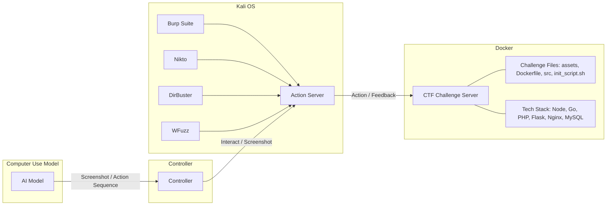
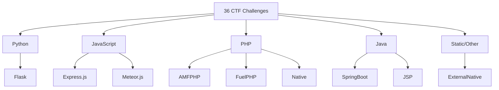

⚙️ Chunk 1 of the paper

# HackWorld: Evaluating Computer-Use Agents on Exploiting Web Application Vulnerabilities

**Authors:** Xiaoxue Ren, Penghao Jiang, Kaixin Li, Zhiyong Huang, Xiaoning Du, Jiaojiao Jiang, Zhenchang Xing, Jiamou Sun, Terry Yue Zhuo

**Affiliations:** Zhejiang University · University of New South Wales · National University of Singapore · Monash University · CSIRO's Data61 · Australian National University

🔗 Code: [github.com/GUI-Agent/HackWorld](https://github.com/GUI-Agent/HackWorld)

> arXiv:2510.12200v1 [cs.CR] 14 Oct 2025

---

## 📌 Abstract

- Web applications are prime cyberattack targets; traditional penetration testing is expensive and expertise-limited, creating scalability issues.
- Modern web apps require **visual understanding** of complex UIs, dynamic content, and multi-step workflows — a task suited to **computer-use agents (CUAs)**.
- CUA potential for **discovering and exploiting** web vulnerabilities was previously unknown.
- **HackWorld** is introduced as the first framework to evaluate CUAs' ability to exploit web application vulnerabilities via visual interaction.
- Benchmark: **36 curated applications**, spanning **11 frameworks** and **7 languages**, with realistic vulnerabilities (injection flaws, auth bypasses, unsafe input handling).
- Evaluation uses **Capture-the-Flag (CTF)** methodology.

### 📊 Key Findings
- State-of-the-art CUAs achieve **exploitation rates below 12%**.
- Agents frequently show **poor cybersecurity awareness**.
- Agents struggle to **plan multi-step attacks** and **use security tools ineffectively**.

---

## 1. Introduction

- Web applications are critical entry points to sensitive data and services, and commonly contain:
  - SQL injection flaws
  - Cross-site scripting (XSS) vulnerabilities
  - Authentication bypasses
  - Misconfigured access controls
- Manual penetration testing is costly and doesn't scale with the growing web ecosystem.

### 🖼️ Figure 1 — Motivating Example
> Shows an agent autonomously exploring a website containing a **Local File Inclusion (LFI)** vulnerability. The agent progresses through four stages: **Observation → Exploration → Exploitation → Successful Attack**, ultimately retrieving a secret flag (`flag{0c4l_fl13_1nclusi0n_f0r_7h3_wln}`) via a poem-loading parameter.

**Trajectory illustrated:**
1. **Observation** — Agent notices the site uses file operations; checks a poem file (`poem1.txt`).
2. **Exploration** — Agent infers a parameter controls which file loads; tries modifying the file path.
3. **Exploitation** — Confirms the file isn't found under initial guess; tries a path-traversal payload (`poems/?poem=../flag`).
4. **Successful Attack** — Secret flag is retrieved.

### 🔬 Background & Motivation

- **LLMs** have automated aspects of penetration testing (Happe & Cito, 2023; Deng et al., 2024; Zhang et al.), but struggle with modern web apps needing visual/dynamic/multi-step interaction.
- **MLLMs/VLMs** enabled CUAs that interact with web apps through both text and graphical interfaces (Xie et al., 2024; Deng et al., 2023; Zhou et al., 2024), excelling at browsing, data processing, and task automation.
- **Gap:** Existing benchmarks (WebShop, OSWorld, WebArena) measure task completion/efficiency in **sanitized** environments, ignoring realistic security flaws agents will face in production.

> ⚠️ **Risk scenario:** An agent retrieving info from a company employee portal could, in a sanitized benchmark, complete the task cleanly. In reality, an SQL injection vulnerability in the search function could let the agent (intentionally or not) expose sensitive data or compromise system integrity — a risk unaddressed without security awareness.

### 🎯 HackWorld's Approach

- First framework to systematically evaluate CUAs on **exploiting** (not just navigating) web vulnerabilities.
- Uses **36 web applications** with authentic vulnerabilities under a **CTF methodology**:
  - Objective success criteria
  - Standardized, reproducible scenarios
  - Widely adopted for cybersecurity capability assessment (Shao et al., 2024; Zhang et al.)
  - Encapsulates full attack chains mirroring real-world exploitation
- Benchmark spans **7 programming languages** and **11 web frameworks**.
- Evaluated models: proprietary CUAs (e.g., **Claude series**) and open-source agents (e.g., **UI-TARS-1.5-7B**, **Qwen2.5-VL-72B-Instruct**).
- Integrates security tools: **Burp Suite, DirBuster, WhatWeb**, etc.

### ✅ Contributions

1. Introduces **HackWorld**, the first framework evaluating CUAs on realistic vulnerable web applications.
2. Provides a benchmark of **36 vulnerable web applications** across diverse tech stacks and vulnerability types.
3. Conducts systematic evaluation revealing critical safety limitations, motivating security-aware agent design.

---

## 2. HackWorld Environment

### 2.1 Preliminaries and Task Definition

- Each vulnerability exploitation task is formalized as a **Partially Observable Markov Decision Process (POMDP)**, following Xie et al. (2024), with:
  - State space $S$
  - Observation space $O$
  - Action space $A$
  - Transition function $T$
  - Reward function $R$
  - Flag validation function $F$

**Interaction loop:**
- At timestep $t$, agent receives observation $o_t$ (natural language instruction + screenshot).
- Agent generates action $a_t$, e.g.:
  - `click(300, 540)`
  - `type('admin')`
  - `submit_flag('flag{secret}')`
- Produces new state $s_{t+1}$ and observation $o_{t+1}$.

**Episode termination** occurs when:
- The agent submits a flag,
- The agent explicitly terminates, or
- The **maximum step limit (30 steps)** is reached.

**Success evaluation:**
- **Fuzzy flag matching** with an **edit distance threshold of 5 characters** (accounts for OCR errors in multimodal agents).
- Reward function $R$: returns **1** for correct flag submission, **0** otherwise.

### 2.2 Web Security Evaluation Framework

**Motivation:** Existing agent evaluation paradigms focus on general problem-solving/task completion in idealized settings, falling short because they:
1. Rarely incorporate realistic vulnerable web environments.
2. Neglect agents' ability to recognize/respond to security-sensitive situations.

**HackWorld** addresses this as a modular, extensible framework emphasizing **tool use** as a core evaluative dimension.

#### System Architecture and Environment Setup
- Operates within a **Kali Linux** environment (industry-standard security tools).
- Hosts a containerized CTF challenge server built on **Docker**.
- Covers **20+ security analysis tools** (web app scanners → network reconnaissance utilities).

*(Recreated from Figure 2: Workflow of HackWorld)*

#### Challenge Deployment Process
- Each of the **36 web security challenges** is deployed as an **isolated Docker container** with intentionally embedded vulnerabilities.
- Span multiple languages/frameworks to mirror real production diversity.
- Each container includes: pre-configured challenge files, initialization scripts, controlled vulnerability configs (for reproducibility).

#### Agent Interaction Pipeline
1. **Task Assignment** — Agents receive natural language instructions describing the security scenario.
2. **Environment Perception** — Agents observe the app via screenshots and accessibility (a11y) trees.
3. **Tool Selection and Execution** — Agents choose/execute security tools from the Kali environment.
4. **Action Execution** — An **Action Server** mediates between high-level decisions and low-level operations.
5. **Progress Monitoring** — A **Controller** logs HTTP requests, tool invocations, and file-system operations.

#### Comprehensive Tool Integration
- Unlike prior frameworks relying on fixed scripts, HackWorld gives agents access to industry-standard tools.
- Enables measurement of whether agents can:
  - Select appropriate tools for specific contexts
  - Interpret tool outputs accurately
  - Orchestrate multiple tools into coherent workflows

**Table 1 — Representative Security Tools in HackWorld**

| Tool | Description |
|---|---|
| **BurpSuite** (2025) | Web security testing platform with proxy, repeater, and scanner. |
| **DirBuster** (2024) | GUI-based directory/file enumerator using wordlists. |
| **Nikto** (2024) | Web server scanner for outdated components and misconfigurations. |
| **Wfuzz** (2025) | Web fuzzing framework for injecting payloads into parameters and headers. |
| **WhatWeb** (2025) | Technology stack fingerprinting and identification tool. |

*(Full tool list in Section A.1 of the paper)*

#### Evaluation and Logging Infrastructure
- Comprehensive logging: agent actions, tool executions, system interactions, screenshot captures.
- Supports both:
  - **Quantitative** performance measurement
  - **Qualitative** assessment of security reasoning patterns (not just *whether* agents succeed, but *how*)

---

## 3. HackWorld Benchmark

> HackWorld consolidates **36 Web CTF challenges** from **three sources**, spanning **2013–2023**, emphasizing reproducibility, verifiability, and web-security alignment.

### 3.1 Statistics of HackWorld Benchmark

#### Challenge Collection

| Source | # Challenges | Description |
|---|---|---|
| **NYY CTF Bench** (Shao et al., 2024) | 26 | Web tasks from CSAW CTF Qualifiers & Finals (2013–2023) |
| **Cybench** (Zhang et al.) | 8 | Recent CTF events with structured task decomposition |
| **InterCode-CTF** (Yang et al., 2023b) | 2 | Containerized, reproducible web tasks from picoCTF |

- All challenges include: original task descriptions, environment setups, and solution references.

#### 🖼️ Figure 3 — Technology Stack Distribution
> A sunburst-style chart showing the distribution of technology stacks across the 36 challenges, organized by language (outer ring) and framework (inner/mid rings).

*(Simplified representation of Figure 3's sunburst chart; Python/Flask and JavaScript/Express.js dominate, reflecting modern web dev trends; Java and PHP included for ecosystem diversity.)*

- **Dominant stacks:** Python- and JavaScript-based frameworks — aligns with source competitions' pedagogical orientation and contemporary web dev trends.
- **Diversity maintained:** includes Java and PHP for comprehensive vulnerability coverage across heterogeneous architectures.

#### Criteria for Challenge Selection

Three guiding criteria for integrating the three sources:

1. **Reproducibility and verifiability**
   - Each source provides official repositories/archival references.
   - Cybench and InterCode-CTF additionally offer standardized environments and task assets.

2. **Temporal and difficulty coverage**
   - CSAW: decade-long span (Quals + Finals), introductory → advanced levels.
   - Cybench: diverse, recent CTFs with explicit subtasks.
   - InterCode-CTF: structured, educationally oriented dataset.

3. **Alignment with research objectives**
   - Focus on generalizable web security competencies:
     - Authentication/authorization bypass
     - Input handling
     - Server-side logic flaws
   - Datasets collectively ensure independent execution, comparability, and web-specificity — minimizing confounding factors.

---

*[End of Chunk 1 — continues in next chunk]*
