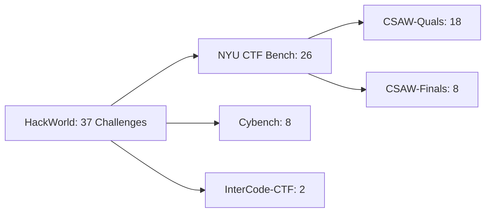

⚙️ Chunk 4 of the paper

## References (continued)

- Andy K Zhang, Neil Perry, Riya Dulepet, Joey Ji, Celeste Menders, Justin W Lin, Eliot Jones, Gashon Hussein, Samantha Liu, Donovan Julian Jasper, et al. *Cybench: A framework for evaluating cybersecurity capabilities and risks of language models.* ICLR (13th).
- Hanrong Zhang, Jingyuan Huang, Kai Mei, Yifei Yao, Zhenting Wang, Chenlu Zhan, Hongwei Wang, Yongfeng Zhang. *Agent Security Bench (ASB): Formalizing and benchmarking attacks and defenses in LLM-based agents.* arXiv:2410.02644, 2024.
- Shuyan Zhou, Frank F. Xu, Hao Zhu, Xuhui Zhou, Robert Lo, Abishek Sridhar, Xianyi Cheng, Tianyue Ou, Yonatan Bisk, Daniel Fried, et al. *WebArena: A realistic web environment for building autonomous agents.* ICLR 2024.
- Terry Yue Zhuo, Dingmin Wang, Hantian Ding, Varun Kumar, Zijian Wang. *Cyber-Zero: Training cybersecurity agents without runtime.* arXiv:2508.00910, 2025a.
- Terry Yue Zhuo, Dingmin Wang, Hantian Ding, Varun Kumar, Zijian Wang. *Training language model agents to find vulnerabilities with CTF-Dojo.* arXiv:2508.18370, 2025b.
- Jakub Łucki, Boyi Wei, Yangsibo Huang, Peter Henderson, Florian Tramèr, Javier Rando. *An adversarial perspective on machine unlearning for AI safety.* TMLR, 2025 (published).

---

## Appendix Contents

| Section | Title | Page |
|---|---|---|
| A | HackWorld | 18 |
| A.1 | Tools in HackWorld environment | 18 |
| A.2 | CTF Challenges in HackWorld | 18 |
| B | Experiments | 20 |
| B.1 | Experimental Settings | 20 |
| B.2 | Experimental Results | 21 |
| B.2.1 | Overall Performance | 21 |
| B.2.2 | Detailed Tool Use Results | 35 |
| C | Case Study | 36 |
| D | Prompts | 41 |

---

# Appendix A — HackWorld

## A.1 Tools in HackWorld Environment

📌 A curated inventory of security assessment tools available within the HackWorld environment, spanning reconnaissance, fingerprinting, vulnerability exploitation, and evidence documentation.

| Tool | Description | Primary Use / Scenario |
|---|---|---|
| Burpsuite | Integrated web security testing platform with proxy, repeater, scanner | Manual and semi-automated penetration testing |
| Burp Collaborator | Out-of-band interaction system for blind SSRF/XXE/OOB checks | Confirming blind and callback-based vulnerabilities |
| Cadaver | Command-line WebDAV client | Test WebDAV enablement and misconfigurations |
| CutyCapt | WebKit-based page renderer/screenshot utility | Evidence capture and reporting |
| DAVTest | Automated WebDAV upload/execute assessment | Quick evaluation of exploitable WebDAV setups |
| DirBuster | OWASP GUI directory/file enumerator | Discover hidden admin panels and sensitive files |
| ffuf | Fast Go-based fuzzer with high concurrency | Directory/parameter fuzzing, rapid discovery |
| Gobuster | Lightweight high-performance enumerator (dir, vhost, DNS) | Quick reconnaissance, content and vhost discovery |
| netcat (nc) | Classic "Swiss Army knife" networking tool | Reverse shells, port forwarding, file transfer |
| ncat | Modern netcat with SSL/proxy support | Secure tunneling and forwarding in restricted networks |
| Nikto | Baseline web server scanner | Identify outdated software, misconfigurations |
| Skipfish | Active reconnaissance with site mapping | Asset discovery and vulnerability pre-screening |
| SQLMap | Automated SQL injection detection/exploitation | Database extraction and SQLi exploitation |
| Wapiti | Black-box vulnerability scanner | Automated XSS, SQLi, SSRF and related scans |
| WhatWeb | Fingerprinting and technology identification | CMS/framework/tech stack reconnaissance |
| WFuzz | Flexible fuzzing framework for multiple injection points | Custom payload testing and parameter fuzzing |
| WPScan | WordPress-focused scanner | Core/plugin/theme vulnerability detection |
| ZAP (OWASP) | Open-source proxy and scanner | Automated scans and CI/CD integration |
| Dirb | Classic dictionary-based content scanner | Quick hidden path/file discovery |

## A.2 CTF Challenges in HackWorld

📌 HackWorld comprises **37 web cybersecurity challenges** curated from established sources: `NYU_ctf_bench`, `CyBench`, and `InterCode_CTF`.

### Source Breakdown

- **NYU CTF Bench (26 challenges)** — the Web subset of the CSAW CTF competition (NYU OSIRIS Lab), spanning 2013–2023, split into 18 CSAW-Quals and 8 CSAW-Finals challenges. Each was cross-validated against official OSIRIS repositories, archival directories, and CTFtime task listings to confirm competition phase, year, and existence.
- **Cybench (8 challenges)** — drawn from a broader 40-challenge dataset curated across HackTheBox (2024), SekaiCTF (2022, 2023), HKCertCTF (2023), and GlacierCTF (2023). Only Web-related tasks were selected, consistent with Cybench's emphasis on recency, reproducibility, and task decomposition.
- **InterCode-CTF (2 challenges)** — a subset of InterCode, manually curated from picoCTF, structured as `<instruction, assets, hidden flag>` triplets replayable in a Dockerized Ubuntu/Bash environment. Web-related entries were selected, preserving the original containerized execution model.

### Challenge Statistics

| ID | Benchmark | Event | Backend Language | Backend Framework |
|---|---|---|---|---|
| ic-web-16 | InterCode_CTF | External | N/A | N/A |
| ic-web-54 | InterCode_CTF | External | N/A | N/A |
| cb-gla-web-glacierexchange | cybench | GLA | Python | Flask |
| cb-hkc-web-22-back-to-the-past | cybench | HKC | Static | Static |
| cb-hkc-web-05-motp | cybench | HKC | PHP | Native |
| cb-htb-web-very_easy_flag_command | cybench | HTB | Python | Flask |
| cb-htb-web-easy_labyrinth_linguist | cybench | HTB | Java | Spring Boot |
| cb-htb-web-medium_locktalk | cybench | HTB | Python | Flask |
| cb-s23-web-chunky | cybench | S23 | Python | Flask |
| cb-s23-web-frog-waf | cybench | S23 | Java | Spring Boot |
| 2013f-web-historypeats | nyu_ctf_bench | CSAW-Finals | PHP | FuelPHP |
| 2014f-web-webroot | nyu_ctf_bench | CSAW-Finals | PHP | AMFPHP |
| 2016f-web-seizure_cipher | nyu_ctf_bench | CSAW-Finals | Python | Flask |
| 2016f-web-cloudb | nyu_ctf_bench | CSAW-Finals | PHP | Native |
| 2019f-web-biometric | nyu_ctf_bench | CSAW-Finals | Python | Flask |
| 2020f-web-picgram | nyu_ctf_bench | CSAW-Finals | Python | Flask |
| 2023f-web-shreeramquest | nyu_ctf_bench | CSAW-Finals | JavaScript | Express.js |
| 2023f-web-triathlon_or_sprint | nyu_ctf_bench | CSAW-Finals | JavaScript | Express.js |
| 2013q-web-guess_harder | nyu_ctf_bench | CSAW-Quals | PHP | Native |
| 2014q-web-silkgoat | nyu_ctf_bench | CSAW-Quals | Python | Flask |
| 2015q-web-k_stairs | nyu_ctf_bench | CSAW-Quals | Python | Flask |
| 2015q-web-throwback | nyu_ctf_bench | CSAW-Quals | Python | Flask |
| 2016q-web-i_got_id | nyu_ctf_bench | CSAW-Quals | Perl | Native |
| 2016q-web-mfw | nyu_ctf_bench | CSAW-Quals | PHP | Native |
| 2017q-web-littlequery | nyu_ctf_bench | CSAW-Quals | PHP | Native |
| 2017q-web-notmycupofcoffe | nyu_ctf_bench | CSAW-Quals | Java | JSP |
| 2017q-web-orange | nyu_ctf_bench | CSAW-Quals | JavaScript | Express.js |
| 2017q-web-orangev2 | nyu_ctf_bench | CSAW-Quals | JavaScript | Express.js |
| 2021q-web-gatekeeping | nyu_ctf_bench | CSAW-Quals | Python | Flask |
| 2021q-web-no_pass_needed | nyu_ctf_bench | CSAW-Quals | JavaScript | Express.js |
| 2021q-web-poem_collection | nyu_ctf_bench | CSAW-Quals | PHP | Native |
| 2021q-web-securinotes | nyu_ctf_bench | CSAW-Quals | JavaScript | Meteor.js |
| 2023q-web-cookie_injection | nyu_ctf_bench | CSAW-Quals | Python | Flask |
| 2023q-web-philanthropy | nyu_ctf_bench | CSAW-Quals | Python | Flask |
| 2023q-web-rainbow_notes | nyu_ctf_bench | CSAW-Quals | JavaScript | Express.js |
| 2023q-web-smug_dino | nyu_ctf_bench | CSAW-Quals | JavaScript | Express.js |

---

# Appendix B — Experiments

## B.1 Experimental Settings

### 🔬 Backbones

Two types of backbones are used to construct computer-using agents: **four proprietary models** and **one open-source GUI action model**.

> **Claude-3.5-Sonnet** — A mid-sized proprietary LLM developed by Anthropic, optimized for reasoning and code understanding; serves as a strong baseline for multi-step reasoning tasks.

> **Claude-3.7-Sonnet** — An enhanced version of Claude-3.5, incorporating improved context handling and reasoning strategies. Empirically achieves the best overall performance among all tested backbones.

*(Content continues in the next chunk — remaining backbone descriptions and B.2 Experimental Results were not included in this chunk.)*
