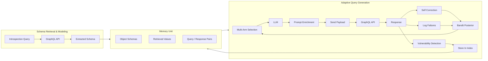

⚙️ Chunk 1 of the paper

# PrediQL: Automated Testing of GraphQL APIs with LLMs

**Authors:** Shaolun Liu¹, Sina Marefat², Omar Tsai¹, Yu Chen¹, Zecheng Deng¹, Jia Wang¹, Mohammad A. Tayebi¹
¹ Simon Fraser University, Canada · ² K. N. Toosi University of Technology, Iran

> **Keywords:** GraphQL Security, API Fuzzing, Large Language Models, Retrieval-Augmented Generation, Multi-Armed Bandit Learning

## 📌 Abstract

- GraphQL's flexible, nested query model exposes APIs to context-dependent vulnerabilities that conventional fuzzers struggle to find.
- Existing fuzzers rely on random payloads or rigid mutation heuristics and don't adapt to dynamic schema/response structures.
- **PrediQL** — the first retrieval-augmented, LLM-guided GraphQL fuzzer:
  - Frames fuzzing-strategy choice as a **multi-armed bandit** problem (explore vs. exploit).
  - Retrieves/reuses execution traces, schema fragments, and prior errors for self-correction and progressive learning.
  - Uses a context-aware LLM vulnerability detector to interpret responses (data values, errors, status codes) and flag injection flaws, access-control bypasses, and information disclosure.
- Evaluation on open-source/benchmark GraphQL APIs shows significantly higher coverage and vulnerability-discovery rates than state-of-the-art baselines.

## 1. Introduction

- Modern systems built from microservices communicating via APIs; **GraphQL** has grown popular for letting clients request exactly the data they need (mitigates REST/gRPC over-fetching).
- Adoption stats: a 2024 industry survey found ~61% of respondents used GraphQL in production, and ~10% were replacing REST with GraphQL.
- Security cost of that adoption: a separate study found ~69% of scanned public GraphQL API services suffered from unrestricted resource-consumption vulnerabilities, leaving them susceptible to DoS via deep-nested or costly queries.
- GraphQL-specific risks: unbounded query depth, schema exposure via introspection, injection in nested arguments, inconsistent access control across linked queries/mutations.

### ⚠️ Gaps in existing tools
| Category | Examples | Limitation |
|---|---|---|
| Black-box fuzzers | — | Explore randomly, ignore GraphQL structure |
| Schema-aware fuzzers | EvoMaster | Use schema but rely on simple template mutations; ignore cross-field/cross-operation dependencies |
| Dependency-aware | GraphQLer | Models producer–consumer relations between queries/mutations, but generation logic is still static — doesn't adapt to execution feedback |

- LLMs offer a path to feedback-driven fuzzing: they can reason over structured formats, infer valid parameters from schema fragments, and (combined with retrieval over past traces/errors) refine future inputs.
- Related LLM-assisted work exists for binary/protocol fuzzing, DoS pattern detection in GraphQL via deep RL, and malicious-query detection — but **no prior work applies LLM-based fuzzing to GraphQL itself**.

### 🔬 PrediQL approach
Joins schema introspection, retrieval-augmented LLM prompting, multi-armed bandit learning, and self-correction into one closed feedback loop. The LLM acts as a *guided component*, not an oracle: it extracts schema via introspection, retrieves relevant examples/past errors, and a bandit selector chooses between prompting strategies (balancing exploration/exploitation).

### 📊 Headline results
- Average coverage improvement: **16%** (max **50%**) over baselines.
- **GPT-5 Mini** achieved the highest coverage among tested models; **Llama-3-8B** offered competitive results at lower compute cost.
- Accurately identifies injection flaws, access-control bypasses, and information-disclosure cases existing tools often miss.

### Contributions
1. **PrediQL** — first retrieval-augmented, LLM-guided GraphQL fuzzer with adaptive strategy selection (modeled as a multi-armed bandit) to improve efficiency and reduce redundant requests.
2. A **context-aware vulnerability detector** using LLM reasoning to interpret responses and classify vulnerabilities beyond static rule-based detection.
3. **Extensive evaluation** on open-source/benchmark GraphQL APIs showing higher coverage and more context-dependent vulnerabilities found vs. existing tools.

---

## 2. Background & Related Work

### 2.1 GraphQL Fundamentals

Three key features:
- **Data as a graph** — interconnected objects retrievable in a single request; mitigates under-/over-fetching.
- **Strong typing** — schema defines object types and operations (queries/mutations); predictable responses, explicit field selection.
- **Single endpoint** — one unified endpoint for both retrieval and modification.

**Schema data types:**
- *Scalars* — atomic values: `Int`, `Float`, `String`, `Boolean`, `ID`.
- *Objects* — user-defined entities composed of fields (which may themselves be scalars, objects, or lists), forming a nested graph structure.

**Operation types:**
- **Queries** — retrieve data (like HTTP GET). A special *introspection query* lets clients inspect the schema itself.
- **Mutations** — modify data (create/update/delete).

Both support fine-grained field selection and field arguments. An operation is parsed → validated against schema → executed by resolving each field independently.

### 2.2 GraphQL Vulnerabilities

Three main categories:

> **Query Abuse Vulnerabilities**
> Flexible queries can be abused to overload/explore the system — e.g., misusing introspection to reveal the full schema (aiding targeted attacks), or DoS via deeply nested/repetitive queries that exhaust server resources.

> **Injection Vulnerabilities**
> Unsanitized inputs enable SQL Injection (data theft/manipulation), Path Injection, and Cross-Site Scripting (XSS) — risking stolen sessions, leaked data, or malicious code execution.

> **Access Control Vulnerabilities**
> Failure to properly restrict data access — e.g., **IDOR** (changing object identifiers to reach restricted data) and **batched attacks** (combining multiple operations in one request to bypass individual security checks). Hard to fix because GraphQL schemas have many linked fields/relationships requiring context-aware, dependency-based testing.

### 2.3 Related Work

**GraphQL Security Testing**
- Early tools (GraphQL-Cop, GraphCrawler, CrackQL, Schemathesis) — introspection-based single-request mutations, no systematic dependency reasoning.
- **EvoMaster** — evolutionary/random testing, black-box + white-box modes.
- **OWASP ZAP / BurpSuite** (Auto GQL Scanner) — GraphQL modules, but mostly generic payload fuzzing / introspection attacks, not multi-step workflows.
- **GraphQLer** — first context-aware GraphQL security framework: infers producer–consumer dependencies, builds a dependency graph, generates chained payloads; improves coverage and finds previously unknown vulnerabilities, but remains static (no adaptation to execution feedback).

**LLM-Assisted Fuzzing**
- Coverage-guided fuzzers (AFL++, libFuzzer, OSS-Fuzz) are effective but struggle with highly structured/constrained inputs and deep execution paths.
- **Fuzz4All** — LLMs for input generation/mutation across formats via an autoprompting loop.
- **EL-Fuzz** — LLM-driven synthesis over input spaces for generation-based fuzzers.
- ML-based malicious-query detection: deep RL for DoS pattern detection in GraphQL; LLMs + sentence transformers + CNNs for malicious query detection.
- Prior text-to-GraphQL LLM work doesn't target specific API schemas.
- **Gap:** no prior work applies LLM-assisted fuzzing to GraphQL's schema-rich, multi-operation design — PrediQL is positioned as the first to do so.

---

## 3. Methodology

PrediQL is a modular, LLM-driven GraphQL fuzzing framework built as a closed-loop pipeline integrating: LLM-based query generation, schema introspection, semantic retrieval, adaptive arm selection, and self-correction.

🖼️ **Figure 1 (workflow of PrediQL)** — represented below as a flowchart:

The closed loop: schema modeling constrains the search space → bandit-based selector picks a prompting strategy → retrieval grounds prompts in real execution history → self-correction incorporates prior errors → prompt construction assembles an evidence-gated LLM input → executed queries update schema, memory, and bandit posteriors.

### 3.1 Schema Modeling

- Pipeline begins with a standard **GraphQL introspection query** against the target API, revealing the complete schema (queries, mutations, input parameters, return types).
- Parsed into a structured intermediate representation (operations, argument specs, object definitions); serialized into lightweight YAML files (queries / mutations / type definitions separated) for reuse and automation.
- Unlike tools that treat introspection as a flat listing, PrediQL **recursively follows links** between objects to capture nested/cross-referenced types → graph-structured view of responses.
- This normalized representation lets PrediQL generate queries that are syntactically valid, semantically consistent, and structurally diverse, avoiding type mismatches or missing arguments.

### 3.2 Adaptive Query Generation

**Adaptive Arm Selection** — query generation is framed as a **multi-armed bandit** problem. Each arm = a prompting strategy defined by four parameters:

| Parameter | Description |
|---|---|
| **Schema** | Whether the full GraphQL schema is included in the LLM prompt |
| **Arg Mode** | `known` = reuse previously successful RAG values · `real` = synthesize realistic type-appropriate literals · `nulls` = test optional fields with null values |
| **Depth** | Max nesting level of GraphQL selections |
| **Top-k** | Number of similar examples retrieved from the RAG system as grounding |

- Uses **Thompson Sampling** to balance exploration/exploitation, rewarding arms only when generated queries both (i) return HTTP 200 and (ii) expand coverage.
- Rewards are exponentially discounted over time to down-weight outdated strategies for non-stationary environments — prevents over-commitment to one strategy while amplifying genuinely useful ones.

**Retrieval-Augmented Generation (RAG)**
- All prior queries/responses embedded into a **FAISS index**.
- During generation, retrieves top-*k* (k = 0, 3, or 5, depending on selected arm) most semantically relevant traces and injects them into the prompt.
- Grounds the LLM in real execution history → improves syntactic fidelity, reduces repetition, promotes diversity.

**Prompt Engineering** — four design goals: prompts must be evidence-gated, deterministic, schema-constrained, and context-aware.

🖼️ **Figure 2 (curated prompt structure)** — represented as a table:

| Block | Description |
|---|---|
| **Header Block** | Domain knowledge about GraphQL query generation based on targeted vulnerabilities and restricted reasoning |
| **Schema Block** | Introspection query result based on selected arm for the specific node |
| **Context Block** | Real values from previous responses (RAG) and previous query/error pairs |
| **Format Block** | Response template description for bulk query generation with vulnerability label |

At runtime, prompt $P$ is automatically assembled from five modular components:

$$P = [B \,\|\, S \,\|\, R \,\|\, E \,\|\, D]$$

- $B$ — Basic restricting header (evidence-gating)
- $S$ — Schema fragments from introspection
- $R$ — Retrieved execution examples (RAG)
- $E$ — Prior error–query pairs (self-correction)
- $D$ — Strategy-specific directives (bandit arm)

Exploration happens primarily through $D$ (arm choice), while $S$, $R$, $E$ stabilize performance across strategies.

### 3.3 Execution and Feedback

**Self Correction**
- Failed queries aren't discarded — PrediQL records schema errors and associates them with the causing queries.
- These error–query pairs are injected into subsequent prompts as corrective signals, turning schema violations into supervision and accelerating convergence toward valid, schema-compliant queries.

**Context-Aware Vulnerability Detection**
- An LLM analyzes each response *in context* (rather than predefined signatures/static rules), using execution metadata (status codes, error messages).
- Structured analysis prompt directs the LLM to identify evidence of injection flaws, access-control bypasses, information disclosure.
- Analyses parsed into JSON records: vulnerability type, severity, confidence, evidence — stored/aggregated for granular findings and system-level trends.
- By conditioning on schema knowledge + execution context, PrediQL generalizes across diverse APIs and finds subtle, context-dependent flaws that rule-based detectors miss.

### 3.4 Closed-Loop Integration

Schema knowledge constrains the LLM → adaptive generation explores diverse query strategies → execution feedback continuously refines prompts and strategy selection. This iterative design expands coverage systematically while maintaining robustness and precision in vulnerability discovery.

---

## 4. Evaluation

Implementation is open-source (repo linked in paper). Research questions:

- **RQ1.** Can LLMs be guided to synthesize valid yet adversarial GraphQL queries that systematically expand schema coverage vs. schema-only or random fuzzing?
- **RQ2.** How do prompt engineering and context enrichment contribute to improved schema coverage?
- **RQ3.** To what extent can this pipeline discover meaningful GraphQL vulnerabilities over existing rule-based methods?

### 4.1 Experimental Setup

**API Selection** — mix of self-hosted open-source APIs and openly hosted reference APIs:

**Table 1 — GraphQL APIs used in baseline testing**

| API | #Queries | #Mutations | #Objects |
|---|---|---|---|
| UserWallet | 11 | 15 | 5 |
| Countries | 6 | 0 | 5 |
| Rick&Morty | 9 | 0 | 7 |
| GraphQLZero | 13 | 19 | 18 |
| EHRI | 19 | 0 | 46 |
| TCGDex | 6 | 0 | 12 |

**Baselines**
- **EvoMaster** — only prior academic framework supporting GraphQL testing in both white-box/black-box modes; black-box config used for fair comparison; evolutionary heuristics mutate payloads dynamically.
- **ZAP** — OWASP open-source black-box scanner; GraphQL module does introspection-based payload generation and common attack simulations.
- **BurpSuite** — commercial platform (PortSwigger); Auto GQL Scanner extension auto-identifies GraphQL endpoints and injects predefined payloads for injection/schema-disclosure detection.
- **GraphQLer** — context-aware framework building a producer–consumer dependency graph for realistic chained requests; strongest baseline in this comparison.

**Model Selection** — four LLMs spanning developers/sizes/philosophies:

**Table 2 — Technical specifications of LLMs used**

| Model | Developer | Year | Size | Focus |
|---|---|---|---|---|
| LLaMA 3.1 | Meta | 2024 | 8B | Open-source, efficient inference |
| Gemini 2.5 Flash | Google DeepMind | 2025 | Undisclosed | Cost-efficient reasoning |
| GPT-5 Mini | OpenAI | 2025 | Undisclosed | Optimized for speed |
| DeepSeek R1 | DeepSeek AI | 2025 | 671B | Reasoning and efficiency |

**Bandit Configuration Details** — eight bandit arms, each a prompting strategy over four parameters (Schema, Arg Mode, Depth, Top-k):

**Table 3 — Parameters defining adaptive arms in PrediQL's prompt generation**

| Arm Name | Schema | Arg Mode | Depth | Top-k |
|---|---|---|---|---|
| schema_min_known | True | known | 1 | 3 |
| schema_min_real | True | real | 1 | 3 |
| schema_mod_known | True | known | 2 | 5 |
| noschema_min_known | False | known | 1 | 3 |
| noschema_min_real | False | real | 1 | 0 |
| schema_min_nulls | True | nulls | 1 | 3 |
| schema_deep_known | True | known | 3 | 5 |
| schema_deep_real | True | real | 3 | 5 |

- Conservative arms (e.g., `schema_min_known`) prioritize syntactic validity via known parameter reuse + shallow nesting.
- Aggressive arms (e.g., `schema_deep_real`) promote deeper traversal and synthesis of new argument values.
- Non-schema variants probe the LLM's ability to generalize without explicit schema guidance.
- The bandit dynamically reallocates probability mass toward arms maximizing successful, coverage-expanding executions.

**Evaluation Metric** — a coverage metric is defined to address RQ1/RQ2 *(definition continues in the next chunk)*.
