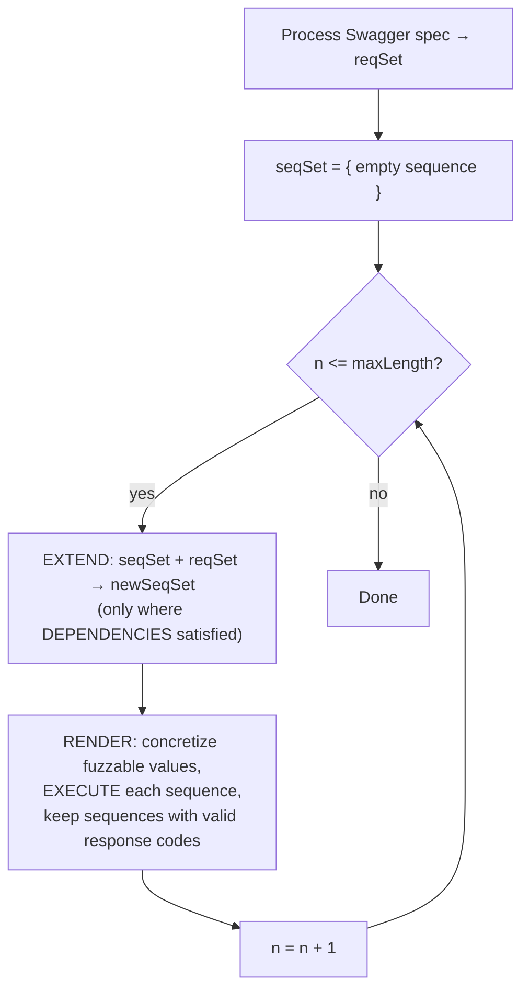

⚙️ Chunk 1 of the paper

# RESTler: Stateful REST API Fuzzing

**Authors:** Vaggelis Atlidakis (Columbia University), Patrice Godefroid (Microsoft Research), Marina Polishchuk (Microsoft Research)

## 📌 Abstract

- Introduces **RESTler**, the first *stateful* REST API fuzzer.
- Analyzes a service's Swagger (OpenAPI) specification and generates sequences of requests to test it.
- Builds test sequences using two techniques:
  1. **Dependency inference** — infers producer-consumer relationships between request types (e.g., request `B` needs a resource id `x` produced by request `A`, so `A` must run before `B`).
  2. **Dynamic feedback analysis** — learns from response history (e.g., "request `C` after sequence `A;B` gets refused") and avoids bad combinations going forward.
- Both techniques are shown to be **necessary** for thorough testing while pruning the huge space of possible request sequences.
- Tested against **GitLab** plus several **Microsoft Azure** and **Office365** cloud services.
- **28 bugs** found in GitLab; multiple bugs found in each Azure/Office365 service — all confirmed and fixed by the owners.

---

## I. Introduction

> Cloud services (SaaS, PaaS, IaaS) are overwhelmingly accessed via **REST APIs**, typically described using **Swagger/OpenAPI** specifications.

🔬 **Problem:** Tools for automatically testing REST APIs for reliability/security are immature. Existing tools mostly:
- Capture live API traffic
- Parse, fuzz, and replay it
- Hope to find bugs

These tools are recent, not widely used, and their real-world bug-finding effectiveness is largely unknown.

### What RESTler Does Differently

RESTler performs **lightweight static analysis** of an entire Swagger spec, then generates and executes tests that exercise the service **statefully** — i.e., it explores states only reachable via *sequences* of multiple requests (not just one request at a time).

Each test = a sequence of requests + responses, generated by:

1. **Inferring dependencies** from the Swagger spec — e.g., a resource in response of `A` is needed as input to `B`, so `A` runs before `B`.
2. **Analyzing dynamic feedback** from prior executions — e.g., learning that `C` after `A;B` is refused, and avoiding that path later.

### 🔑 Key Contributions

- First automatic, **stateful** fuzzing tool for REST APIs (infers dependencies + uses response feedback).
- Experimental evidence that both core techniques are necessary for effective fuzzing.
- Comparison of **three search strategies** for navigating the request-sequence search space.
- Detailed **GitLab case study** — 28 new bugs found.
- Preliminary results fuzzing several **Microsoft public cloud services**.

### Paper Roadmap

| Section | Content |
|---|---|
| II | How Swagger specs are processed |
| III–IV | Main test-generation algorithm + implementation |
| V | Evaluation of techniques and search strategies |
| VI | New bugs found in GitLab |
| VII | Experience fuzzing public cloud services |
| VIII | Related work |
| IX | Conclusion |

---

## II. Processing API Specifications

- A **Swagger specification** describes a REST API: what requests are handled, expected responses, and response formats.
- Open-source Swagger tooling can auto-generate a browsable web UI from the spec.

### 🖼️ Example: Blog Posts Service (Figure 1)

A simple service with five request types:

| Method | Endpoint | Description |
|---|---|---|
| `GET` | `/blog/posts/` | Returns list of blog posts |
| `POST` | `/blog/posts/` | Creates a new blog post |
| `DELETE` | `/blog/posts/{id}` | Deletes a blog post matching `id` |
| `GET` | `/blog/posts/{id}` | Returns a blog post matching `id` |
| `PUT` | `/blog/posts/{id}` | Updates a blog post matching `id` and `checksum` |

### From Spec to Grammar (Figure 2)

RESTler converts a Swagger YAML snippet into an **executable Python grammar**:

- `restler_static(x)` → appends the literal string `x` unchanged.
- `restler_fuzzable(type)` → substitutes a value of that type from a small dictionary (e.g., dictionary for `string` might contain `"sampleString"`).

Example: the `POST /blog/posts/` schema requires `body` (string) and optionally returns `id` (integer). RESTler auto-generates a `parse_posts` function that extracts the returned `id` and registers it as a **dynamic object** for reuse.

```python
def parse_posts(data):
    post_id = data["id"]
    dependencies.set_var(post_id)

request = requests.Request(
    restler_static("POST"),
    restler_static("/api/blog/posts/"),
    restler_static("HTTP/1.1"),
    restler_static("{"),
    restler_static("body:"),
    restler_fuzzable("string"),
    restler_static("}"),
    {
        'post_send': {
            'parser': parse_posts,
            'dependencies': [post_id.writer()]
        }
    }
)
```

📌 **Key Point:** By analyzing all request types in the spec this way, RESTler automatically infers that the `id` produced by `POST` is required by the other three request types (`GET/{id}`, `PUT/{id}`, `DELETE/{id}`). These **producer-consumer dependencies** drive later test generation.

---

## III. Test Generation Algorithm

🔬 **Method overview** (Figure 3, python-like pseudocode):



### Core Functions

- **`EXTEND(seqSet, reqSet)`** — for every existing sequence, tries appending every request type whose dependencies are satisfied; builds the length-`n` candidate set.
- **`DEPENDENCIES(seq, req)`** — true if every object `req` *consumes* is already *produced* somewhere in `seq`.
- **`CONSUMES(req)`** — object types required as input by `req`.
- **`PRODUCES(seq)`** — all dynamic objects produced by responses across the sequence so far.
- **`RENDER(seqSet)`** — for each candidate sequence's newly appended request, enumerates combinations of concrete dictionary values for its fuzzable fields, **executes** the resulting sequence, and keeps it only if the final response has a valid (2xx) status code; otherwise logs the error and discards it.

> A **valid sequence** = one where every response in it falls in the 200 range.

### Execution Semantics (`EXECUTE`)

- Runs requests in a sequence one at a time.
- Validates each response, memoizes any dynamic objects created.
- Feeds memoized objects into later requests that need them, in the **order they were produced** (no reordering/permutation attempted).
- If a dynamic object becomes stale/unusable (detected via a non-2xx response when reused), the whole sequence is discarded.

⚠️ **Limitation:** Default `RENDER` tries *all* combinations of dictionary values per request — for large dictionaries this can explode combinatorially. Mitigations mentioned: random sampling of dictionary values, or combinatorial-testing techniques (e.g., pairwise coverage). The paper's experiments used small dictionaries with the default exhaustive `RENDER`.

### 🔎 Search Strategies

The main loop (`EXTEND`) as described performs **breadth-first search (BFS)** over the request-sequence space. Two additional strategies are introduced and compared later (Section V):

| Strategy | Behavior |
|---|---|
| **BFS** | Extends *every* sequence with *every* eligible request — full coverage, most sequences generated. |
| **BFS-Fast** | Appends each eligible request to *at most one* sequence — still covers every request type per iteration (full grammar coverage) but with far fewer sequences, so it goes deeper faster. |
| **RandomWalk** | Randomly picks one existing sequence + one eligible request, repeating until dependencies are satisfied; restarts from an empty sequence when it can't extend further. Explores deeper, faster, but doesn't memoize past sequences (may repeat work). |

---

## IV. Implementation

- **~3,151 lines** of modular Python, split into three modules:
  1. **Parser & compiler** — parses the Swagger spec, generates the RESTler grammar (a raw grammar can also be supplied directly if no Swagger spec exists).
  2. **Core fuzzing runtime** — implements the Figure 3 algorithm and its variants; renders requests, processes responses, extracts dynamic objects, and uses feedback to guide future sequence generation.
  3. **Garbage collector (GC)** — a separate thread that tracks created dynamic objects over time and deletes aging ones past a user-defined limit.

### Using RESTler (CLI tool)

**Inputs:**
- Swagger specification
- Service access parameters (IP, port, authentication)
- Mutations dictionary
- Search strategy choice

**Workflow:**
1. Compiles the spec → reports number of endpoints found and resolved/unresolved dependencies.
2. If dependencies are unresolved, user can add annotations/resource-specific mutations and recompile — *or* just start fuzzing, in which case unresolved consumer parameters are treated as `restler_fuzzable` string primitives.
3. During fuzzing, reports each **bug** — defined as an HTTP **500** ("Internal Server Error") — as soon as found.

### ⚠️ Current Limitations

- No support for server-side redirects (`301`, `303`, `307`).
- Bug detection is limited to unexpected HTTP status codes — **cannot** detect vulnerabilities invisible at the status-code level (e.g., Information Exposure).

---

## V. Evaluation

Three research questions drive the evaluation:

- **Q1:** Are *both* dependency-inference and dynamic-feedback analysis necessary for effective fuzzing? *(→ §V-B)*
- **Q2:** Does test depth (service-side logic exercised) increase with sequence length? *(→ §V-C)*
- **Q3:** How do the three search strategies compare across different APIs? *(→ §V-D)*

Q1 is answered using the simple **Blog Posts** service; Q2 and Q3 use **GitLab**.

### A. Experimental Setup

**🖼️ Blog Posts Service**
- 189 lines of Python (Flask).
- 5 request types (see Figure 1 table above).
- A deliberately planted **subtle bug**: on `PUT` update, if the request's `checksum` matches the *currently recorded* checksum, an uncaught exception fires.
  - This bug is only reachable if the fuzzer tracks dynamic-object dependencies across requests (i.e., needs the real checksum from a prior `GET`, not a guessed one).

**🖼️ GitLab**
- Open-source self-hosted Git service; backend >376K lines of Ruby (Ruby on Rails), REST API front end.
- Deployment config: Nginx → Unicorn (15 workers, 2GB cap each), PostgreSQL (pool of 10), default Sidekiq/Redis setup.
- Rated to scale to ~4,000 concurrent users per GitLab's own guidance.
- Used by 100,000+ organizations; ~2/3 market share of self-hosted Git.

**Fuzzing dictionaries used:**

| Type | Values |
|---|---|
| `string` | `"sampleString"`, `""` |
| `integer` | `0`, `1` |
| `boolean` | `true`, `false` |

**Hardware:** Ubuntu 16.04 Azure VMs, 8× Intel Xeon E5-2673 v3 @ 2.40GHz, 56GB RAM.

### B. Techniques for Effective REST API Fuzzing (Q1)

Compared three algorithm variants on the Blog Posts service, generating all sequences up to length 3:

1. **No dependencies** — treats dynamic objects (`post_id`, `checksum`) as plain fuzzable strings; still uses dynamic feedback.
2. **No dynamic feedback** — infers dependencies and generates valid sequences by type, but doesn't prune using response feedback.
3. **Full RESTler** — both dependencies *and* dynamic feedback (Figure 3 algorithm).

📊 **Results (Figure 4):**

- **Code coverage:**
  - Without dependency-tracking: coverage capped at **~130 lines**, flat over time — random/guessed ids and checksums can't drive the service deeper.
  - With dependency-tracking (with or without feedback): coverage rises to **~150 lines**.
- **Test volume / time:**
  - Without dynamic feedback: **4,600+ tests**, **1,750 seconds**, ~150 lines covered.
  - With dynamic feedback: same ~150-line coverage reached with **<800 tests** in **179 seconds** — a large efficiency gain.
- **HTTP status code distribution:**
  - Ignoring feedback → high rate of 40X responses (~60%).
  - Using feedback, no dependencies → 40X drops to ~26%.
  - Using feedback + dependencies → 40X drops further to ~20%, with ~80% of responses in the 20X range (best exercise of service logic).
- **Bug detection:**
  - The planted checksum bug (500 error) is **only found** when dependencies among request types are used (to supply the real checksum from a prior `GET`).
  - Adding dynamic feedback on top preserves this bug detection while needing the fewest tests overall.

✅ **Conclusion for Q1:** Dependency-inference and dynamic-feedback analysis are **complementary** — both are needed for effective, efficient REST API fuzzing.

### C. Deeper Service Exploration (Q2) — *[continues into next chunk]*

- Uses GitLab, split into six API groups: commits, branches, issues/notes, repositories/repo files, groups/group membership, projects.
- (Table I and further results referenced but not shown in this excerpt.)
