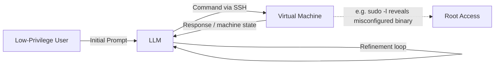

⚙️ Chunk 1 of the paper

# Getting Pwn'd by AI: Penetration Testing with Large Language Models

**Authors:** Andreas Happe, Jürgen Cito (TU Wien, Austria)
**Venue:** ESEC/FSE '23, Dec 3–9 2023, San Francisco, CA, USA

> 📌 **Abstract (paraphrased):** The paper investigates whether large language models (e.g. GPT-3.5) can serve as "AI sparring partners" for penetration testers. Two scenarios are examined: high-level planning of a security-testing engagement, and low-level vulnerability discovery inside a deliberately vulnerable VM via a closed feedback loop over SSH. The authors report encouraging early results, note directions for future work, and close with a discussion of the ethics of AI sparring partners.

---

## 1. Introduction

- 🔬 **Motivation:** Cybersecurity — and penetration testing specifically — faces a severe and *growing* talent shortage: workforce grew ~11% year-over-year but the skills gap grew faster (~26% YoY), citing the ISC2 2022 workforce study.
- A prior interview study of pen-testers found that human "sparring partners" (colleagues who can suggest alternative approaches) are valuable, and that intuition — often built through CTF experience — is central to finding vulnerabilities. The authors ask whether this intuition can be partly outsourced to an AI.
- The framing throughout is **augmentation, not replacement**: pairing a human operator with an AI creates new capability rather than simply cloning existing human skill, and keeping a human in the loop reduces ethical risk. The authors also note that AI-driven efficiency gains tend to be largest for less-experienced workers, suggesting AI pairing could particularly help novice testers.

> 🎯 **Research Question:** *To what extent can penetration testing be automated using LLMs?*

- **Approach:** The MITRE ATT&CK framework (a structured knowledge base of adversary Tactics, Techniques, and Procedures — "TTPs") is used as a scaffold for evaluating LLM capability. A good AI sparring partner should, in principle, be able to help across the whole TTP spectrum.
- Two experiment types were run:
  1. **High-level guidance** — asking an LLM/agent to plan a penetration test, both generically and against a real target organization.
  2. **Low-level guidance** — hooking GPT-3.5 up to a vulnerable VM to analyze system state and propose concrete attack steps.

### ⚠️ Scope / Ethical Boundaries Set by the Authors
- They deliberately did **not** explore LLM-generated phishing/vishing content, citing ethical concerns.
- They flag automated penetration-test **report generation** as another promising (and comparatively low-risk) application area, noting anecdotal evidence that testers are already using generative AI for this.

---

## 2. Background

### MITRE ATT&CK
- A curated, hierarchical knowledge base of adversary behavior, commonly abbreviated **TTP**:
  - **Tactics** — high-level adversary goals (e.g., reconnaissance, privilege escalation, collection).
  - **Techniques** — general ways of achieving a tactic (e.g., abusing `sudo` caching, Kerberoasting).
  - **Procedures** — the concrete, technique-specific implementation details.
- The authors' working assumption: an effective AI sparring partner needs to help at both the tactic/technique level (high-level) and the technique/procedure level (low-level).

### Large Language Models
- Neural networks trained via self-supervised learning on very large corpora; capability scales roughly with parameter count (from single-digit billions up to trillions in the largest contemporary models).
- Whether ever-larger scale keeps paying off is described as an open debate in the field at the time of writing.
- Training a frontier model from scratch is prohibitively costly for most researchers, which has driven the rise of reusable **"foundation models"** that can be adapted/fine-tuned relatively cheaply.

### GPT-3.5 / ChatGPT
- Interaction happens via natural-language "prompts," giving rise to the practice of **prompt engineering**.
- Smaller, locally-runnable model tooling (e.g., `llama.cpp`, supporting models up to ~13B parameters) has enabled research and use without cloud costs or provider-side moderation.

### Pre-trained Autonomous AI Agents
Three examples of early autonomous-agent frameworks are discussed:

| Framework | Core Idea |
|---|---|
| **AutoGPT** | Auto-generates its own instruction sequences from a concise user goal, reducing manual prompt engineering; can incorporate web queries and optional human feedback; breaks a goal into a task list delegated to sub-agents. |
| **BabyAGI** | Splits a user-given task into subtasks held in a task queue; a *Task Execution Agent* runs tasks and updates a memory store, a *Task Creation Agent* adds new subsequent tasks, a *Context Agent* supplies memory-based context before execution, and a *Prioritization Agent* orders the queue. All roles are instances of GPT-4. A minimal ~100-line Python version also exists. |
| **Jarvis** | Coordinates multiple agents built on different underlying models to form a multi-modal, multi-agent system. |

---

## 3. LLM-Based Penetration Testing

The authors split their evaluation into two complementary levels:

- **High level:** questions like *"what is a good attack methodology against Active Directory?"* — the LLM should surface relevant tactics and techniques.
- **Low level:** questions like *"given a privilege-escalation tactic, what concrete attack vectors apply to this specific Linux system?"* — the LLM should surface actionable techniques/procedures.

*🖼️ Figure 1 (redrawn as a diagram): a low-level closed feedback loop — the LLM issues shell commands over SSH to a target VM, reads the response, and iteratively refines its next command (illustrated in the original with a `sudo -l` misconfiguration leading to a root shell via a Perl exec trick).*

### 3.1 High-Level: Task-Planning Systems

- **AgentGPT experiment:** prompted to *"become domain admin in an Active Directory."* It produced a plan citing realistic, industry-standard techniques — password spraying, Kerberoasting, AS-REP roasting, abusing AD Certificate Services, unconstrained delegation abuse, and group-policy abuse. The authors judged all of these realistic and commonly used in real engagements.
- **AutoGPT experiment:** after obtaining the target company's approval, the authors asked AutoGPT to build an external penetration-test plan. It proposed standard methodology — network vulnerability scanning, OSINT/user enumeration, and phishing against identified users.
  - When pushed further, AutoGPT **was willing** to crawl the target's website to enumerate real employee names/emails (OSINT), but it **declined**, citing its own ethical safeguards, to actually run a live network scan or execute phishing.
  - The authors' takeaway: both the plan and the refusals were realistic and would give a human tester genuinely useful directional feedback.

---
*End of Chunk 1.*
