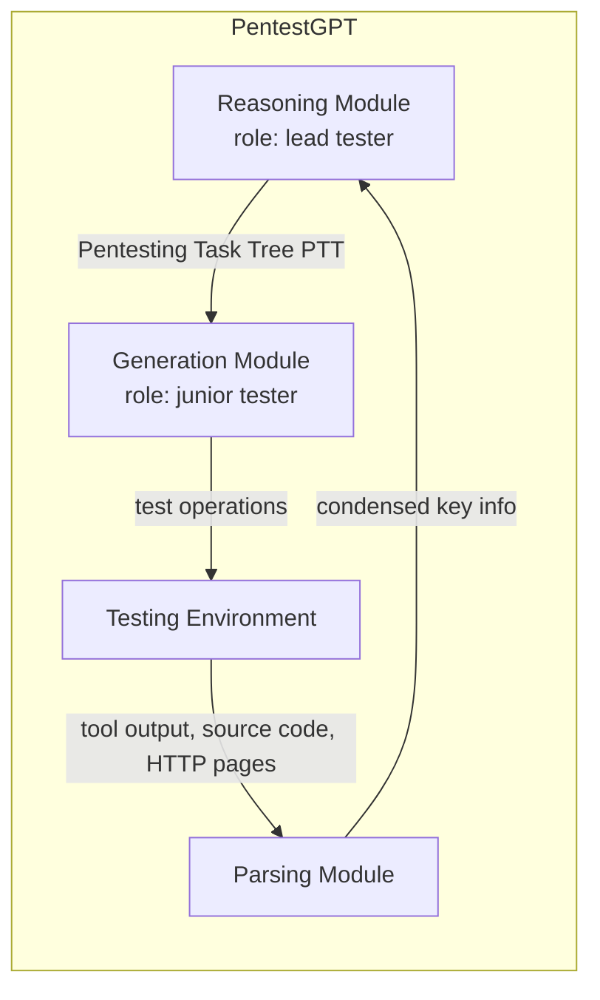
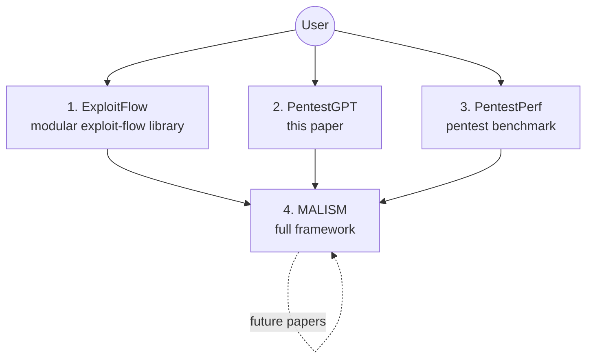
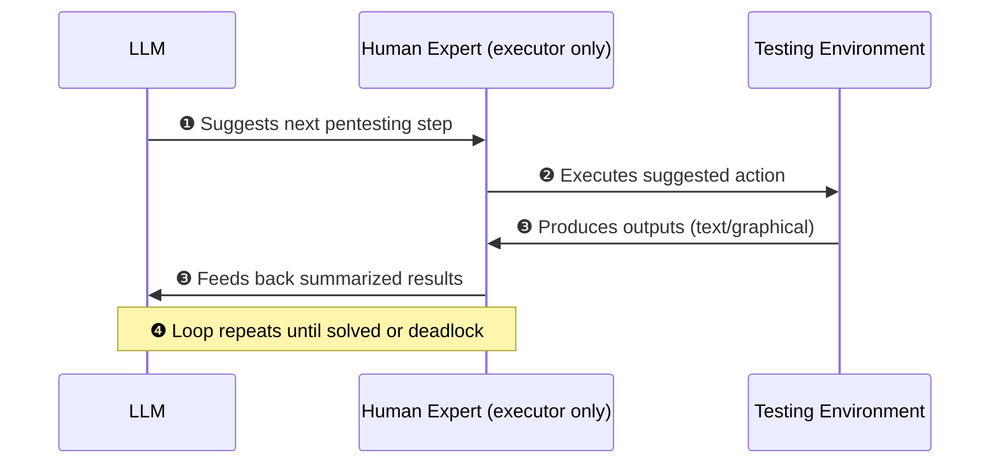

⚙️ Chunk 1 of the paper

# PENTESTGPT: Evaluating and Harnessing Large Language Models for Automated Penetration Testing

**Authors:** Gelei Deng¹, Yi Liu¹, Víctor Mayoral-Vilches²³, Peng Liu⁴, Yuekang Li⁵, Yuan Xu¹, Tianwei Zhang¹, Yang Liu¹, Martin Pinzger³, Stefan Rass⁶

**Affiliations:**
1. Nanyang Technological University
2. Alias Robotics
3. Alpen-Adria-Universität Klagenfurt
4. Institute for Infocomm Research (I²R), A*STAR, Singapore
5. University of New South Wales
6. Johannes Kepler University Linz

> arXiv:2308.06782v2 [cs.SE] 2 Jun 2024

## 📌 Abstract

- Penetration testing has traditionally resisted automation due to the deep expertise it requires from human professionals.
- LLMs show promise across domains; this work builds a **comprehensive benchmark** using real-world pentesting targets to explore LLM capabilities.
- **Findings:** LLMs are proficient at specific sub-tasks (using tools, interpreting outputs, proposing next actions) but struggle to **maintain context** of the overall testing scenario.
- Based on these insights, the authors introduce **PentestGPT** — an LLM-empowered automated pentesting framework with three self-interacting modules addressing individual sub-tasks to mitigate context loss.
- **Results:**
  - +228.6% task-completion rate vs. GPT-3.5 on benchmark targets
  - Effective on real-world pentesting targets and CTF challenges
  - Open-sourced on GitHub — 6,200+ stars in 9 months, active community engagement

---

## 1. Introduction

- Securing systems is difficult; offensive techniques like **penetration testing** and **red teaming** are essential to the security lifecycle.
- Per Applebaum, offensive teams attempt breaches to reveal vulnerabilities — an advantage over defenses that rely on incomplete system knowledge/modeling.
- Guiding principle: *"the best defense is a good offense."*

### 🔬 Why Penetration Testing Needs Automation
- Pentesting is proactive: identifies, assesses, and mitigates vulnerabilities via targeted attacks.
- Traditionally **manual and expertise-heavy** → labor-intensive → gap between demand and supply of skilled testers.

### Why LLMs?
- LLMs demonstrate strong text comprehension and **emergent abilities** (reasoning, summarization, domain-specific problem solving) without task-specific fine-tuning.
- Prior work hints at LLM potential in cybersecurity, but **no systematic, quantitative assessment** existed for penetration testing specifically.

> **Motivating Question:** *To what extent can LLMs automate penetration testing?*

### 📊 Benchmark Construction
Existing benchmarks were insufficient (not comprehensive, don't track incremental progress), so the authors built a new one:

| Property | Detail |
|---|---|
| Sources | HackTheBox, VulnHub |
| Targets | 13 |
| Sub-tasks | 182 |
| Coverage | All OWASP Top 10 vulnerabilities, 18 CWE items |

### Study Design
- Models tested: **GPT-3.5, GPT-4, Bard**
- Process: interactive/iterative — LLM given prompts + target info → generates pentesting operations → operations executed in controlled environment → results fed back to LLM → repeat until completion.
- Evaluation: compared LLM output against baseline walkthroughs from official sources and certified penetration testers.

### 🔑 Key Findings from the Exploratory Study
- LLMs handle specific sub-tasks well: using tools, interpreting outputs, suggesting next steps.
- LLMs are especially strong at executing **complex commands/options** with testing tools; GPT-4 excels at **source code comprehension** and vulnerability identification.
- LLMs can craft valid test commands and describe GUI operations needed for tasks; they can devise creative testing procedures.

> ⚠️ **Limitation:** LLMs struggle to maintain a coherent grasp of the overarching testing scenario. As dialogue progresses, they lose track of earlier discoveries, over-weight recent conversation turns, and neglect previously exposed attack surfaces — causing failure to complete the overall task.

### Introducing PentestGPT
Inspired by the collaborative structure of real-world human pentesting teams, PentestGPT uses a **tripartite architecture**:

- **Reasoning Module** — maintains a high-level overview of testing status via a novel **Pentesting Task Tree (PTT)**, built on the cybersecurity attack tree concept. Translatable into natural language for the LLM to interpret and act on.
- **Generation Module** — constructs detailed procedures for sub-tasks, translating strategy into exact operations.
- **Parsing Module** — processes diverse text (tool outputs, source code, HTTP pages), condensing and extracting essential information.

### 📊 PentestGPT Results
| Metric | Result |
|---|---|
| Sub-task completion increase vs. GPT-3.5 | +228.6% |
| Sub-task completion increase vs. GPT-4 | +58.6% |
| HackTheBox active-machine challenges solved | 4 of 10 |
| Total OpenAI API cost (HTB tests) | $131.5 USD |
| picoMini CTF score | 1500 / 4200 |
| picoMini CTF rank | 24th of 248 teams |
| GitHub stars | 6,200+ (9 months) |

### 🎯 Long-Term Vision: MALISM
The authors' broader goal is a fully automated pentesting framework producing **"cybersecurity cognitive engines"** — usable without deep security domain knowledge.

**Components:**
1. **ExploitFlow** — modular library composing exploits from multiple sources/frameworks (e.g. Metasploit); captures system state after each action to enable learning of attack trees; supports Game Theory/AI research in cybersecurity.
2. **PentestGPT** *(this paper)* — LLM-driven system producing testing guidance/intuition at each discrete state; core component of MALISM.
3. **PentestPerf** — comprehensive benchmark for evaluating human and automated pentesting performance.
4. **MALISM** — the overarching framework integrating the above into an automated, self-evolving pentesting system ("cybersecurity cognitive engines").

### 📌 Contributions
1. **Comprehensive Penetration Testing Benchmark** — 13 targets, 182 sub-tasks, 26 categories, 18 CWE items, covering OWASP Top 10; first benchmark supporting progressive-accomplishment assessment.
2. **Comprehensive Evaluation of LLMs for Pentesting** — first systematic, quantitative study of GPT-3.5, GPT-4, and Bard on pentesting tasks.
3. **PentestGPT System** — tripartite LLM-powered architecture; open-sourced with 6,500+ GitHub stars and industry collaborators including **AWS, Huawei, and ByteDance**.

---

## 2. Background & Related Work

### 2.1 Penetration Testing
- Security professionals analyze target systems, often using automated tools.
- Standard process (five phases): **Reconnaissance → Scanning → Vulnerability Assessment → Exploitation → Post-Exploitation (reporting)**.
- Full automation remains elusive — requires deep vulnerability understanding and strategic planning.
- Testers typically combine **depth-first** and **breadth-first** search: first scope the environment broadly, then drill into specific vulnerabilities.
- The sheer diversity of specialized tools further complicates automation.

### 2.2 Large Language Models
- LLMs (e.g., GPT-3.5, GPT-4) are applied to cybersecurity tasks such as code analysis and vulnerability repair.
- Strengths: broad general knowledge, elementary reasoning, human-like text comprehension/generation, contextual pattern recognition.
- These traits make LLMs promising for enhancing pentesting — but realizing this potential requires a rigorous, purpose-built benchmark.

---

## 3. Penetration Testing Benchmark

### 3.1 Motivation
Existing benchmarks (e.g., OWASP Juice Shop) have limitations:
- **Narrow scope** — e.g., Juice Shop omits privilege escalation, an essential pentesting aspect.
- **Final-outcome-only evaluation** — ignores incremental progress value across stages, giving an incomplete performance picture.

**Design criteria for the new benchmark:**
- **Task Variety** — diverse tasks across operating systems, reflecting real-world scenario diversity.
- **Challenge Levels** — varying difficulty for novice through expert testers.
- **Progress Tracking** — scoring incremental progress at each stage, not just success/failure.

### 3.2 Benchmark Design

**Step 1 — Task Selection**
- Sourced from **HackTheBox** and **VulnHub**.
- Selected to cover all OWASP Top 10 vulnerabilities.
- Mixed difficulty: easy / medium / hard.
- Note: no benign targets included (focus is true-vulnerability identification, not false-positive testing).

**Step 2 — Task Decomposition**
- Each target's walkthrough is parsed into sub-tasks following **NIST 800-115** (Technical Guide to Security Testing).
- Each sub-task = one guide-defined step (e.g., network discovery, password cracking) or one CWE-categorized exploit (e.g., SQL injection — CWE-89).
- Full sub-task list provided in Appendix Table 7.

**Step 3 — Benchmark Validation**
- Three certified penetration testers independently solved the targets and wrote walkthroughs.
- Task decomposition adjusted to account for multiple valid solution paths.

### 📊 Final Benchmark Stats
| Property | Value |
|---|---|
| Targets | 13 |
| Sub-tasks | 182 |
| Categories | 26 |
| CWE items covered | 18 |
| OWASP Top 10 coverage | Complete |

Benchmark made publicly available at the authors' project website.

---

## 4. Exploratory Study

**Goal:** assess how well LLMs adapt to real-world pentesting complexity.

**Research Questions:**
- **RQ1 (Capability):** To what extent can LLMs perform penetration testing tasks?
- **RQ2 (Comparative Analysis):** How do LLM problem-solving strategies differ from human penetration testers?

### 4.1 Testing Strategy

Since LLMs cannot directly execute actions, a **human-in-the-loop** strategy is used — the human acts purely as an executor, without adding independent expert judgment.

**Steps:**
1. Target details presented to the LLM; LLM proposes a pentesting step.
2. Human expert executes exactly what the LLM recommends.
3. Results are captured — textual outputs (terminal, source code) recorded directly; non-textual results (e.g., graphical UI) manually summarized into text — then fed back to the LLM.
4. Loop continues until a solution is found or a deadlock occurs; final record captures successful sub-tasks, failed actions, and failure reasons.

Illustrative prompt/output examples (GPT-4, one benchmark target) are provided in Appendix Section A.
