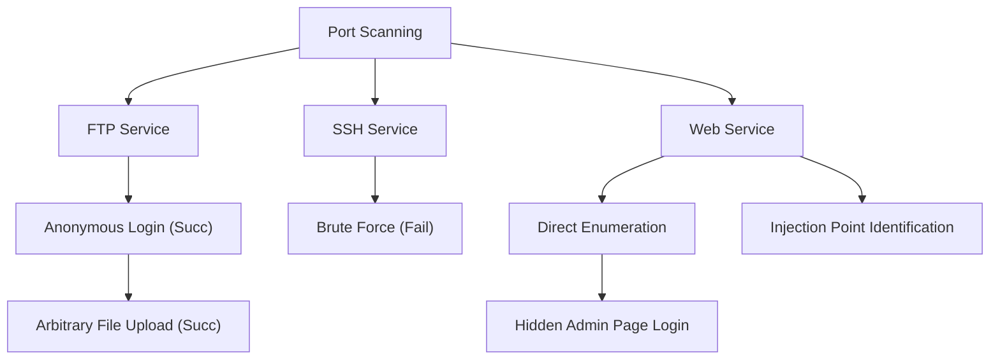

⚙️ Chunk 2 of the paper

## 🔬 Evaluation Strategy for LLM-based Penetration Testing


*Figure 2: Overview of strategy to use LLMs for penetration testing — an interactive loop between the LLM and the testing environment, mediated by a human expert.*

To ensure fairness and accuracy in evaluation, three strategies were employed:

1. **Expert human testers** — OSCP-certified penetration testers execute LLM-generated operations, ensuring accurate assessment of LLM capabilities.
2. **Strict, unaltered execution** — Testers execute LLM commands exactly as given (even if clearly erroneous) and report results back without added commentary.
3. **Handling GUI-based operations** — LLMs are told to minimize GUI tool use. For unavoidable GUI tools (e.g., BurpSuite), testers:
   - Perform the GUI operation using their own expertise
   - Provide detailed step-by-step textual descriptions of actions/results back to the LLM
   - Repeat the operation if the LLM raises objections

> This protocol preserves the integrity of the feedback loop, ensuring the LLM has a full understanding of testing results.

---

## ⚗️ Evaluation Settings

### Model Selection
Three LLMs were evaluated:

| Model | Token Limit | Provider | Interface |
|---|---|---|---|
| GPT-3.5 | 8k | OpenAI | ChatGPT |
| GPT-4 | 32k | OpenAI | ChatGPT |
| LaMDA | — | Google | Bard |

Models were chosen based on prominence in the research community and consistent availability.

### Experimental Setup
- Target and testing machines on the same **private network**
- Testing machine: **Kali Linux 2023.1**

### 🛠️ Tool Usage
- LLMs were **explicitly instructed not to use** end-to-end automated vulnerability scanners (e.g., Nexus, OpenVAS), to isolate *innate* LLM capability.
- LLMs' recommendations for specific validation tools (e.g., `sqlmap` for SQL injection) were followed.
- Versioning issues in LLM-suggested tool commands were manually corrected by pentesting experts when instructions would have worked for an older tool version.

---

## 📊 Capability Evaluation (RQ1)

Performance of **GPT-4**, **Bard**, and **GPT-3.5** was assessed across easy, medium, and hard targets.

### Table 1: Overall Performance on Penetration Testing Benchmark

| Tool | Easy Overall (7) | Easy Sub-task (77) | Medium Overall (4) | Medium Sub-task (71) | Hard Overall (2) | Hard Sub-task (34) | Avg Overall (13) | Avg Sub-task (182) |
|---|---|---|---|---|---|---|---|---|
| GPT-3.5 | 1 (14.29%) | 24 (31.17%) | 0 (0.00%) | 13 (18.31%) | 0 (0.00%) | 5 (14.71%) | 1 (7.69%) | 42 (23.07%) |
| GPT-4 | 4 (57.14%) | 55 (71.43%) | 1 (25.00%) | 30 (42.25%) | 0 (0.00%) | 10 (29.41%) | 5 (38.46%) | 95 (52.20%) |
| Bard | 2 (28.57%) | 29 (37.66%) | 0 (0.00%) | 16 (22.54%) | 0 (0.00%) | 5 (14.71%) | 2 (15.38%) | 50 (27.47%) |
| **Average** | 2.3 (33.33%) | 36 (46.75%) | 0.33 (8.33%) | 19.7 (27.70%) | 0 (0.00%) | 6.7 (19.61%) | 2.7 (20.5%) | 62.3 (34.25%) |

**Key observations:**
- Each LLM completes **at least one** end-to-end penetration test.
- **GPT-4** performs best: 4 easy + 1 medium target solved; 55/77 easy and 30/71 medium sub-tasks.
- **Bard**: 2 easy targets; **GPT-3.5**: 1 easy target.
- All models **decline sharply on hard targets** — they can start reconnaissance but fail to exploit vulnerabilities.
- Hard targets often contain **"rabbit holes"** — seemingly vulnerable but non-exploitable services — requiring unique, unpredictable exploitation paths.
- Example: target *Falafel* has SQL injection vulnerabilities resistant to `sqlmap`, requiring human expert input.

> 📌 **Finding 1:** LLMs show proficiency in conducting end-to-end penetration testing tasks but struggle with more difficult targets.

### Table 2: Top 10 Types of Sub-tasks Completed by Each Tool

| Sub-Task | WT (Walkthrough) | GPT-3.5 | GPT-4 | Bard |
|---|---|---|---|---|
| Web Enumeration | 18 | 4 (22.2%) | 8 (44.4%) | 4 (22.2%) |
| Code Analysis | 18 | 4 (22.2%) | 5 (27.2%) | 4 (22.2%) |
| Port Scanning | 12 | 9 (75.0%) | 9 (75.0%) | 9 (75.0%) |
| Shell Construction | 11 | 3 (27.3%) | 8 (72.7%) | 4 (36.4%) |
| File Enumeration | 11 | 1 (9.1%) | 7 (63.6%) | 1 (9.1%) |
| Configuration Enumeration | 8 | 2 (25.0%) | 4 (50.0%) | 3 (37.5%) |
| Cryptanalysis | 8 | 2 (25.0%) | 3 (37.5%) | 1 (12.5%) |
| Network Enumeration | 7 | 1 (14.3%) | 3 (42.9%) | 2 (28.6%) |
| Command Injection | 6 | 1 (16.7%) | 4 (66.7%) | 2 (33.3%) |
| Known Exploits | 6 | 2 (33.3%) | 3 (50.0%) | 1 (16.7%) |

**Strengths observed:**
- All three LLMs successfully complete **9/9 Port Scanning** sub-tasks — configuring `nmap`, interpreting scan results, and formulating next actions.
- LLMs show a **deep understanding of prevalent vulnerability types**, correctly linking them to services on the target system.
- LLMs are **effective at code analysis and generation** (Code Analysis, Shell Construction) — reading/generating code in multiple languages, identifying vulnerabilities, and crafting exploits.
- **GPT-4 outperforms** GPT-3.5 and Bard in code interpretation/generation, making it the most suitable candidate for pentesting tasks.

> 📌 **Finding 2:** LLMs can efficiently use penetration testing tools, identify common vulnerabilities, and interpret source code to identify vulnerabilities.

---

## 🔍 Comparative Analysis (RQ2)

Compares LLM problem-solving strategies against human penetration testers, focusing on:
1. Unnecessary operations LLMs prompt (vs. standard walkthrough)
2. Specific factors preventing successful test execution

### Table 3: Top Unnecessary Operations Prompted by LLMs

| Unnecessary Operation | GPT-3.5 | GPT-4 | Bard | Total |
|---|---|---|---|---|
| Brute-Force | 75 | 92 | 68 | 235 |
| Exploit Known Vulnerabilities (CVEs) | 29 | 24 | 28 | 81 |
| SQL Injection | 14 | 21 | 16 | 51 |
| Command Injection | 18 | 7 | 12 | 37 |

- **Brute-force** is the most prevalent unnecessary operation — LLMs default to recommending it for any password-authenticated service, despite being an ineffective general strategy.
  - *Hypothesis:* LLMs learn this bias from training data (real-world breach reports commonly citing password cracking/brute force).
- LLMs also over-recommend CVE studies, SQL injection, and command injection — techniques common in real-world pentesting but not always applicable to the specific target.

### Table 4: Top Causes for Failed Penetration Testing Trials

| Failure Reason | GPT-3.5 | GPT-4 | Bard | Total |
|---|---|---|---|---|
| Session context lost | 25 | 18 | 31 | 74 |
| False Command Generation | 23 | 12 | 20 | 55 |
| Deadlock operations | 19 | 10 | 16 | 45 |
| False Scanning Output Interpretation | 13 | 9 | 18 | 40 |
| False Source Code Interpretation | 16 | 11 | 10 | 37 |
| Cannot craft valid exploit | 11 | 15 | 8 | 34 |

#### ⚠️ Primary Failure Causes

1. **Loss of session context** (top cause)
   - LLMs lose awareness of previous test outcomes due to fixed token windows (e.g., GPT-4 at 8,000 tokens in this context).
   - Trimming context to fit the window causes loss of critical details, harming performance on intricate, multi-service tests.

   > 📌 **Finding 3:** LLMs struggle to maintain long-term memory, which is vital to link vulnerabilities and develop exploitation strategies effectively.

2. **Depth-first, recency-biased search behavior**
   - LLMs strongly prefer the most recently discussed task, deeply pursuing it before branching to new targets.
   - Consistent with research showing LLMs concentrate attention at the prompt's beginning and end.
   - Contrasts with experienced human testers, who take a holistic view and prioritize moves with highest potential outcome.
   - Combined with session context loss, this causes LLMs to become **over-anchored** to one service, forgetting prior discoveries and reaching an impasse.

   > 📌 **Finding 4:** LLMs strongly prefer recent tasks and a depth-first search approach, often resulting in an over-focus on one service and forgetting previous findings.

3. **Inaccurate results / hallucination**
   - Second most frequent failure cause.
   - LLMs often identify the correct tool but misconfigure its settings, or invent **non-existent tools/modules**.

   > 📌 **Finding 5:** LLMs may generate inaccurate operations or commands, often stemming from inherent inaccuracies and hallucinations.

### 🧭 Summary
The exploratory study shows LLMs are capable of completing sub-tasks but face three core issues:
- Long-term memory retention
- Reliance on depth-first strategy
- Operation accuracy

These findings motivate the design of **PENTESTGPT**, described in the next section.

---

## 🏗️ Methodology

### Overview

PENTESTGPT integrates **three LLM-powered modules**, each maintaining its own conversation/context:

```mermaid
flowchart LR
    subgraph Parsing Module
    TC["Token Compression"] --> CI["Condensed Information"]
    end
    subgraph Reasoning Module
    TTU["① Task Tree Update"] --> TTV["② Task Tree Verification"]
    TTV --> TI["③ Task Identification"]
    TI --> CT["Candidate Tasks"]
    CT --> TD["④ Task Decision"]
    TD --> ST["Subsequent Task"]
    end
    subgraph Generation Module
    TE["⑤ Task Expansion"] --> OG["⑥ Operation Generation"]
    end
    UserIntention["User Intention"] --> Parsing Module
    TestingOutputs["Testing Outputs"] --> Parsing Module
    CI --> TTU
    ST --> TE
    OG --> Operations["Operations"]
    Operations --> TestingTools["Testing Tools / Targets"]
    TestingTools --> TestingOutputs
    Operations -.->|Optional User Verification| UserIntention
```
*Figure 3: Overview of PENTESTGPT — Parsing, Reasoning, and Generation Modules operating over the testing environment.*

The user interacts with PENTESTGPT; distinct modules process different message types, culminating in a recommended next step for the penetration test.

### 🧩 Design Rationale

Three challenges from the exploratory study directly shaped the design:

| Challenge | Source Finding | Design Response |
|---|---|---|
| Penetration testing context loss | Finding 3 | Persistent task tree structure |
| Over-emphasis on recent conversation content | Finding 4 | Separation of task identification from execution |
| Inaccurate result generation | Finding 5 | Two-step Chain-of-Thought command generation |

**Inspiration:** Real-world pentesting teams, where a *director* plans overarching procedures and subdivides them into subtasks; individual testers execute tasks independently and report back without needing full context; the director then decides next steps.

This maps to PENTESTGPT's approach:
- Splits penetration testing into two processes, each powered by a separate LLM session:
  1. **Identifying the next task** (retains full context of testing status)
  2. **Generating the concrete operation** to complete that task (isolated from full context)

This division preserves overarching context while enabling focused, effective task execution.

Prompts are designed using **Chain-of-Thought (CoT)** methodology — dissecting pentesting tasks into micro-steps with an *input → chain-of-thought → output* format, guided by examples. (Full prompts available in the paper's open-source project.)

---

## 🧠 Reasoning Module

Acts as a **"team lead"** overseeing the pentest from a macro perspective — obtains testing results/intentions from the user and prepares strategy for the next step, passed to the Generation Module.

### 🌳 Pentesting Task Tree (PTT)

Inspired by the concept of an **attack tree**, and formally rooted in the concept of an **attributed tree**.

> **Definition 1 (Attributed Tree):** An attributed tree is an edge-labeled, attributed polytree $G = (V, E, \lambda, \mu)$ where $V$ is a set of nodes (vertices), $E$ is a set of directed edges, $\lambda: E \to \Sigma$ is an edge labeling function assigning a label from alphabet $\Sigma$ to each edge, and $\mu: (V \cup E) \times K \to S$ is a function assigning key (from $K$)–value (from $S$) pairs of properties to edges and nodes.

> **Definition 2 (Pentesting Task Tree):** A PTT $T$ is a pair $(N, A)$, where:
> 1. $N$ is a set of nodes organized in a tree structure. Each node has a unique identifier; there is a special **root** node with no parent. Every other node has exactly one parent and zero or more children.
> 2. $A$ is a function assigning to each node $n \in N$ a set of attributes $A(n)$. Each attribute is a pair $(a, v)$ where $a$ is the attribute name and $v$ is its value. Attribute sets can differ per node.

### Reasoning Module Operation (4 Steps over the PTT)

1. **① Task Tree Update** — Interprets user objectives to create/update an initial PTT in natural language, using designed prompts containing the PTT definition and real-world examples. LLM outputs are parsed to verify correct tree structure (representable as layered bullet points). This overcomes the memory-loss issue by maintaining a task tree spanning the *entire* pentest process.
2. **② Task Tree Verification** — Checks that only **leaf nodes** were modified in the update (atomic operations should only affect lowest-level sub-tasks), guarding against hallucination-driven structural changes. Discrepancies are sent back to the LLM for correction.
3. **③ Task Identification** — Evaluates the current tree state and identifies viable sub-tasks as **candidate tasks** for further testing.
4. **④ Task Decision** — Evaluates likelihood of candidate sub-tasks leading to success, and recommends the top task, forwarding expected results to the Generation Module.

> This procedural approach directly counters LLMs' tendency to concentrate only on the most recent task. Testers can also manually revise the PTT via an interactive handle (see later section) if a recommended task is incorrect.

Four prompt sets guide the Reasoning Module sequentially through these stages, refined using a **hint generation** technique for reproducibility. LLMs were found to be adept at interpreting and updating tree-structured pentesting information accurately.

### 🖼️ Figure 4: Pentesting Task Tree Example



**Natural-language PTT representation (as encoded for the LLM):**
```
Task Tree:
1. Perform port scanning (completed)
   - Port 21, 22 and 80 are open.
   - Services are FTP, SSH, and Web Service.
2. Perform the testing
   2.1 Test FTP Service
       2.1.1 Test Anonymous Login (success)
             2.1.1.1 Test Anonymous Upload (success)
   2.2 Test SSH Service
       2.2.1 Brute-force (failed)
   2.3 Test Web Service (ongoing)
       2.3.1 Directory Enumeration
             2.3.1.1 Find hidden admin (to-do)
       2.3.2 Injection Identification (todo)
```

---

## ⚙️ Generation Module

Translates specific sub-tasks from the Reasoning Module into **concrete commands/instructions**. A fresh LLM session is initiated per sub-task, isolating the overarching pentest context from the immediate execution task, so the LLM can focus purely on generating specific commands.

### Two-Step CoT Process

1. **⑤ Task Expansion** — Upon receiving a concise sub-task, expands it into a sequence of detailed steps, considering tools/operations available in the testing environment.
2. **⑥ Operation Generation** — Transforms each expanded step into:
   - Precise terminal commands ready for execution, **or**
   - Detailed descriptions of specific GUI operations to perform.

> This two-step, stage-by-stage translation reduces ambiguity and **prevents the LLM from generating infeasible operations**, improving overall pentest success rate.

The Generation Module bridges strategic insight (from the Reasoning Module) and actionable execution steps, while also producing human-readable documentation of the full testing process. A detailed PTT generation process is provided in the paper's Appendix (Figure 9).

### 🖼️ Illustrative Example: HackTheBox "Carrier" (medium difficulty)

Demonstrates a single iteration of PENTESTGPT:
- The PTT (natural-language format) encodes testing status: open ports 21, 22, 80.
- Reasoning Module identifies available tasks — **service scanning** is the only available leaf-node task.
- This task is forwarded to the Generation Module for command generation.
- *(Continues into next section of the paper — command execution and results.)*
