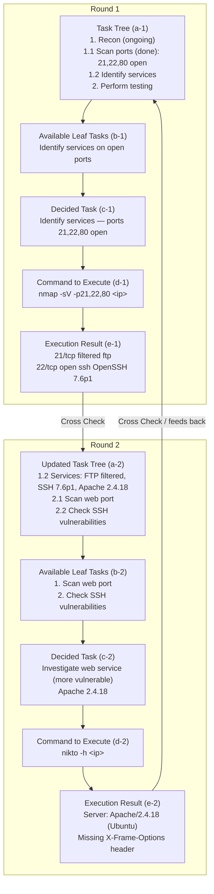
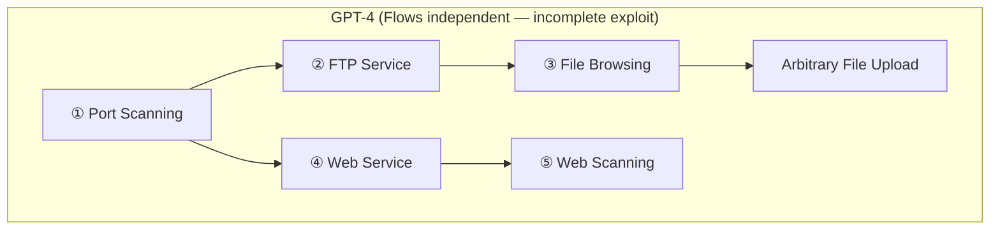
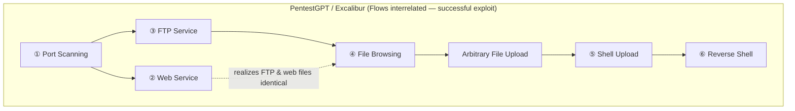

⚙️ Chunk 3 of the paper

## 🔬 Task-Tree Update Process — Worked Example (*HTB-Carrier*)

The system operates through repeated cycles between three modules: **Reasoning Module**, **Generation Module**, and **Testing Environment**, cross-checked at each step.

> 📌 **Key Point:** After each tool execution, the Reasoning Module cross-references new results against the prior Pentesting Task Tree (PTT), updating only the relevant leaf nodes rather than rebuilding the whole tree. The LLM then judges which newly available task is most promising (e.g., choosing to probe the web service over the SSH service because it is "often seen as more vulnerable").

---

## 5.5 Parsing Module

The **Parsing Module** is a supportive interface that streamlines natural-language exchange between the user and the Reasoning/Generation Modules. It exists to solve two problems:

1. **Verbosity/cost** — raw security tool output (e.g., `dirbuster`) is long and expensive to feed directly into an LLM.
2. **Accessibility** — non-expert users struggle to extract key insights from raw tool output.

It handles four categories of information, each paired with dedicated prompts:

| # | Information Type | Description |
|---|---|---|
| 1 | User intentions | Directives from the user dictating next steps |
| 2 | Security testing tool outputs | Raw output from testing tools |
| 3 | Raw HTTP web information | Raw data from HTTP web interfaces |
| 4 | Source code | Code extracted during testing (analyzed via GPT-4 code interpreter) |

Users must explicitly specify which category their input belongs to.

---

## 5.6 Active Feedback

An interactive mechanism letting users query or steer the Reasoning Module directly.

- 📌 The reasoning context (including the PTT) is stored as a **fixed token chunk**, supplied fresh to a new LLM session during feedback.
- Users can **ask questions** about the context without altering the original session.
- Users can **explicitly instruct updates** to the reasoning history if changes are needed.

> This decouples *querying* from *modifying* — the original session stays untouched unless the user deliberately asks for a change.

---

## 5.7 Discussion — Design Alternatives Considered

### ⚠️ Addressing Context Loss with Larger Token Windows
- Simply using bigger-context LLMs (e.g., GPT-4 32k) is insufficient:
  1. Even 32k tokens can be exhausted by a single verbose tool output (e.g., `dirbuster`).
  2. Even within the limit, APIs tend to **skew toward recent content**, losing sight of broader context.
- This motivated the Reasoning + Parsing Module design.

### ⚠️ Vector Database for Extended Context
- Theoretically could archive tool outputs as embeddings for long-term memory.
- **Problem:** many pentesting results are highly similar with only subtle differences, causing **confused retrieval**.
- Not sufficient alone to solve context loss — flagged as future work.

### 📌 Precision in Information Extraction
- Rule-based extraction is accurate but **engineering-expensive** given natural language complexity and diverse info types.
- The Parsing Module offers a more feasible, efficient general-purpose alternative.

### ⚠️ Limitations of LLMs
- LLMs still **hallucinate** and carry **outdated knowledge**.
- Task-tree verification mitigates but doesn't eliminate errors.
- A **human-in-the-loop** remains essential to inject expertise and guidance.

---

## 6. Evaluation

Four research questions guide the evaluation:

- **RQ3 (Performance):** How does PENTESTGPT compare to native LLMs and human experts?
- **RQ4 (Strategy):** Does PENTESTGPT solve problems differently than LLMs/humans?
- **RQ5 (Ablation):** How much does each module contribute?
- **RQ6 (Practicality):** Is it effective in real-world settings?

### 6.1 Evaluation Settings
- Implementation: **1,900 lines of Python3** + **740 lines of prompts** (available on anonymized project site).
- Evaluated on the benchmark from Section 3, plus real-world machines (Section 6.5).
- Two variants tested: **PentestGPT-GPT-3.5** and **PentestGPT-GPT-4** (no Bard due to lack of API access).
- Only **non-automated** penetration testing tools permitted, consistent with prior experiments.

---

## 📊 6.2 Performance Evaluation (RQ3)

**Overall target completion:**

| Difficulty | GPT-3.5 | GPT-4 | PentestGPT-GPT-3.5 | PentestGPT-GPT-4 |
|---|---|---|---|---|
| Easy | 1 | 4 | 2 | 6 |
| Medium | 0 | 1 | 0 | 2 |
| Hard | 0 | 0 | 0 | 0 |

**Sub-task completion:**

| Difficulty | GPT-3.5 | GPT-4 | PentestGPT-GPT-3.5 | PentestGPT-GPT-4 |
|---|---|---|---|---|
| Easy | 24 | 52 | 31 | 69 |
| Medium | 13 | 27 | 14 | 57 |
| Hard | 5 | 8 | 5 | 12 |

- 📌 **PentestGPT-GPT-4** solved **6/7 easy** and **2/4 medium** targets — the strongest of all four setups.
- **PentestGPT-GPT-3.5** solved only 2 easy challenges, limited by GPT-3.5's weaker pentesting knowledge.
- PentestGPT-GPT-4 achieved **111% more sub-tasks** than naive GPT-4 (57 vs. 27) and solved one more medium target.
- ⚠️ All approaches struggled on **hard** targets — these require deep understanding and often modifying existing tools/scripts, which is outside what the framework's design (context management) can fix, since it doesn't expand the LLM's underlying vulnerability knowledge.

---

## 🔬 6.3 Strategy Evaluation (RQ4)

PentestGPT breaks tasks down similarly to human experts, prioritizing key sub-tasks rather than only the most recently identified one.

### Case study: VulnHub *Hackable II*
Requires chaining two vulnerabilities: an FTP upload flaw and a web service that serves FTP files.

- **GPT-4:** starts with FTP (①–③), finds the upload vulnerability, but never links it to the web service → incomplete exploit.
- **PentestGPT:** shifts between FTP and web (①–②), then focuses on FTP (③–④), realizes FTP and web files are identical, uploads a shell (⑤), and achieves a reverse shell (⑥) — matching the official solution guide.

> 📌 This demonstrates PentestGPT's strength at **integrating multiple testing aspects** rather than pursuing a single linear path.

### ⚠️ Non-human-like quirks
- PentestGPT still sometimes **prioritizes brute-force attacks before vulnerability scanning** (e.g., always trying to brute-force SSH first).

### ⚠️ Observed Failure Modes (3 primary limitations)
1. **Image interpretation:** LLMs can't process images, which are sometimes essential in pentesting scenarios — would need multimodal models.
2. **Social engineering / subtle cues:** e.g., a human can build a brute-force wordlist from names found on a target service; PentestGPT can retrieve the names but fails to apply tools to turn them into a wordlist.
3. **Exploitation code construction:** the LLM struggles to produce accurate, detailed exploit code (especially low-level bytecode operations) within a limited number of trials.

---

## 📊 6.4 Ablation Study (RQ5)

Three ablated variants (all using GPT-4 API):

1. **PentestGPT-no-Parsing** — Parsing Module deactivated; raw data fed directly into the system.
2. **PentestGPT-no-Generation** — Generation Module deactivated; task generation happens within the Reasoning Module itself (same prompts).
3. **PentestGPT-no-Reasoning** — Reasoning Module disabled; falls back to the plain LLM methodology from the Exploratory Study (no PTT).

**Overall completion status:**

| Difficulty | no-Parsing | no-Reasoning | no-Generation | Full PentestGPT |
|---|---|---|---|---|
| Easy | 5 | 4 | 4 | 6 |
| Medium | 1 | 0 | 1 | 2 |
| Hard | 0 | 0 | 0 | 0 |

**Sub-task completion status:**

| Difficulty | no-Parsing | no-Reasoning | no-Generation | Full PentestGPT |
|---|---|---|---|---|
| Easy | 62 | 44 | 56 | 69 |
| Medium | 44 | 23 | 35 | 57 |
| Hard | 9 | 7 | 9 | 12 |

**Findings:**
- 📌 Full PentestGPT **outperforms all ablations** on both target and sub-task completion.
- **no-Parsing:** only a slight drop — the Reasoning Module's full-context retention compensates for the missing Parsing step (32k limit generally still covers diverse outputs).
- **no-Reasoning:** **worst performer**, achieving only **53.6%** of full PentestGPT's sub-tasks — even below basic GPT-4. Generation Module's extra sub-tasks without reasoning-driven context management distort and cloud the LLM's context.
- **no-Generation:** slightly beats basic GPT-4; without it, the process mirrors standard LLM usage. Its main role is guiding *precise* testing operations — without it, testers may lack info to operate essential tools/scripts correctly.

---

## 🌍 6.5 Practicality Study (RQ6)

Real-world deployment beyond the standardized benchmark, using the **GPT-4 32k** API. Success = capturing the root/target flag at least once across 5 trials per target.

### HackTheBox (HTB) — 10 active machines (5 easy, 5 medium)

| Machine | Difficulty | Completions | Completed Users (community) | Cost (USD) |
|---|---|---|---|---|
| Sau | Easy | 5/5 ✓ | 4798 | 15.2 |
| Pilgramage | Easy | 3/5 ✓ | 5474 | 12.6 |
| Topology | Easy | 0/5 ✗ | 4500 | 8.3 |
| PC | Easy | 4/5 ✓ | 6061 | 16.1 |
| MonitorsTwo | Easy | 3/5 ✓ | 8684 | 9.2 |
| Authority | Medium | 0/5 ✗ | 1209 | 11.5 |
| Sandworm | Medium | 0/5 ✗ | 2106 | 10.2 |
| Jupiter | Medium | 0/5 ✗ | 1494 | 6.6 |
| Agile | Medium | 2/5 ✓ | 4395 | 22.5 |
| OnlyForYou | Medium | 0/5 ✗ | 2296 | 19.3 |
| **Total** | — | **17/50 (6 machines)** | — | **131.5** |

- 📌 Completed **4 easy + 1 medium** machine overall, at an average of **$21.9/target**.

### picoMini CTF (jeopardy-style, CMU + redpwn, 21 challenges, 248 teams)

| Challenge | Category | Score | Completions |
|---|---|---|---|
| login | web | 100 | 5/5 ✓ |
| advance-potion-making | forensics | 100 | 3/5 ✓ |
| spelling-quiz | crypto | 100 | 4/5 ✓ |
| caas | web | 150 | 2/5 ✓ |
| XtrOrdinary | crypto | 150 | 5/5 ✓ |
| tripplesecure | crypto | 150 | 3/5 ✓ |
| clutteroverflow | binary | 150 | 1/5 ✓ |
| not crypto | reverse | 150 | 0/5 ✗ |
| scrambled-bytes | forensics | 200 | 0/5 ✗ |
| breadth | reverse | 200 | 0/5 ✗ |
| notepad | web | 250 | 1/5 ✓ |
| college-rowing-team | crypto | 250 | 2/5 ✓ |
| fermat-strings | binary | 250 | 0/5 ✗ |
| corrupt-key-1 | crypto | 350 | 0/5 ✗ |
| SaaS | binary | 350 | 0/5 ✗ |
| riscy business | reverse | 350 | 0/5 ✗ |
| homework | binary | 400 | 0/5 ✗ |
| lockdown-horses | binary | 450 | 0/5 ✗ |
| corrupt-key-2 | crypto | 500 | 0/5 ✗ |
| vr-school | binary | 500 | 0/5 ✗ |
| MATRIX | reverse | 500 | 0/5 ✗ |

- 📌 Solved **9/21** challenges; average cost **$5.1/attempt**.
- Accumulated **1,400 points**, ranking **24th of 248 teams** with valid submissions.

> These results suggest solid real-world applicability for easy-to-intermediate pentesting/CTF tasks.

---

## 7. Discussion

- ⚠️ **Benchmark contamination risk:** LLMs might have been trained on walkthroughs of benchmark machines, invalidating results. Mitigations:
  1. Verified via direct queries that the LLM lacks prior familiarity with test machines.
  2. Benchmark machines were launched **post-2021**, after the OpenAI models' training cutoff.
  - Confirmed via recent HackTheBox challenges that PentestGPT can solve targets without pre-existing knowledge.
- ⚠️ **Model alignment friction:** Some LLMs (e.g., OpenAI's GPT models) are aligned to refuse generating malicious exploitation content. The authors used **jailbreak techniques** to bypass this and obtain relevant output — reproducibility remains an open challenge.
- ⚠️ **Hallucination:** LLMs occasionally produce outputs deviating from training data/reality, hurting reliability; ongoing research aims to reduce this.
- ⚠️ **Ethical implications:** PentestGPT's dual-use nature (defense vs. misuse) is acknowledged. Mitigations mentioned:
  - Promoting ethical-use guidelines.
  - Collaborating with cybersecurity communities to deter misuse.
  - Incorporating monitoring modules to track tool usage.

---

## 8. Conclusion

- LLMs handle basic pentesting tasks and tool usage but struggle with **task-specific context retention** and **attention** over long testing sessions.
- **PentestGPT** emulates human penetration-testing behavior via three cooperating modules: **Reasoning**, **Generation**, and **Parsing**, enabling a segmented problem-solving strategy.
- Comprehensive evaluation shows strong promise, while also revealing areas (hard targets, exploit code generation, social engineering, image interpretation) where **human expertise still exceeds current LLM capability**.
- The work is positioned as a step toward future advances in AI-assisted cybersecurity.
