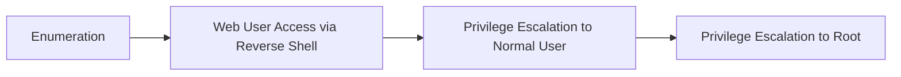

⚙️ Chunk 4 of the paper

## References

1. A. Applebaum, D. Miller, B. Strom, H. Foster, and C. Thomas, "Analysis of automated adversary emulation techniques," in *Proceedings of the Summer Simulation Multi-Conference*. Society for Computer Simulation International, 2017, p. 16.
2. B. Arkin, S. Stender, and G. McGraw, "Software penetration testing," *IEEE Security & Privacy*, vol. 3, no. 1, pp. 84–87, 2005.
3. G. Deng, Z. Zhang, Y. Li, Y. Liu, T. Zhang, Y. Liu, G. Yu, and D. Wang, "Nautilus: Automated restful api vulnerability detection."
4. W. X. Zhao et al., "A survey of large language models," arXiv preprint arXiv:2303.18223, 2023.
5. Y. Liu et al., "Summary of chatgpt/gpt-4 research and perspective towards the future of large language models," arXiv preprint arXiv:2304.01852, 2023.
6. J. Wei et al., "Emergent abilities of large language models," arXiv preprint arXiv:2206.07682, 2022.
7. V. Mayoral-Vilches, G. Deng, Y. Liu, M. Pinzger, and S. Rass, "Exploitflow, cyber security exploitation routes for game theory and ai research in robotics," 2023.
8. Y. Zhang, W. Song, Z. Ji, Danfeng, Yao, and N. Meng, "How well does llm generate security tests?" 2023.
9. Z. He, Z. Li, S. Yang, A. Qiao, X. Zhang, X. Luo, and T. Chen, "Large language models for blockchain security: A systematic literature review," 2024.
10. N. Antunes and M. Vieira, "Benchmarking vulnerability detection tools for web services," in *2010 IEEE International Conference on Web Services*. IEEE, 2010, pp. 203–210.
11. P. Xiong and L. Peyton, "A model-driven penetration test framework for web applications," in *2010 Eighth International Conference on Privacy, Security and Trust*. IEEE, 2010, pp. 173–180.
12. "Hackthebox: Hacking training for the best." [Online]. Available: http://www.hackthebox.com/
13. [Online]. Available: https://www.vulnhub.com/
14. "OWASP Foundation," https://owasp.org/.
15. MITRE, "Common Weakness Enumeration (CWE)," https://cwe.mitre.org/index.html, 2021.
16. "Models - openai api," https://platform.openai.com/docs/models/, (Accessed on 02/02/2023).
17. "Gpt-4," https://openai.com/research/gpt-4, (Accessed on 06/30/2023).
18. Google, "Bard," https://bard.google.com/?hl=en.
19. S. Mauw and M. Oostdijk, "Foundations of attack trees," vol. 3935, 07 2006, pp. 186–198.
20. [Online]. Available: https://app.hackthebox.com/machines/list/active
21. [Online]. Available: https://picoctf.org/competitions/2021-redpwn.html
22. V. Mayoral-Vilches, G. Deng, Y. Liu, M. Pinzger, and S. Rass, "Exploitflow, cyber security exploitation routes for game theory and ai research in robotics," arXiv preprint arXiv:2308.02152, 2023.
23. Rapid7, "Metasploit framework," 2023. [Online]. Available: https://www.metasploit.com/
24. G. Weidman, *Penetration testing: a hands-on introduction to hacking*. No starch press, 2014.
25. F. Abu-Dabaseh and E. Alshammari, "Automated penetration testing: An overview," in *The 4th International Conference on Natural Language Computing*, Copenhagen, Denmark, 2018, pp. 121–129.
26. J. Schwartz and H. Kurniawati, "Autonomous penetration testing using reinforcement learning," arXiv preprint arXiv:1905.05965, 2019.
27. H. Pearce, B. Ahmad, B. Tan, B. Dolan-Gavitt, and R. Karri, "Asleep at the keyboard? assessing the security of github copilot's code contributions," in *2022 IEEE Symposium on Security and Privacy (SP)*. IEEE, 2022, pp. 754–768.
28. H. Pearce, B. Tan, B. Ahmad, R. Karri, and B. Dolan-Gavitt, "Examining zero-shot vulnerability repair with large language models," in *2023 IEEE Symposium on Security and Privacy (SP)*. IEEE, 2023, pp. 2339–2356.
29. "OWASP Juice-Shop Project," https://owasp.org/www-project-juice-shop/, 2022.
30. NIST and E. Aroms, "Nist special publication 800-115 technical guide to information security testing and assessment," 2012.
31. [Online]. Available: https://cwe.mitre.org/data/definitions/89.html
32. A. Authors, "Excalibur: Automated penetration testing," https://anonymous.4open.science/r/EXCALIBUR-Automated-Penetration-Testing/README.md, 2023.
33. E. Collins, "Lamda: Our breakthrough conversation technology," May 2021. [Online]. Available: https://blog.google/technology/ai/lamda/
34. "Chatgpt," https://chat.openai.com/, (Accessed on 02/02/2023).
35. "The most advanced penetration testing distribution." [Online]. Available: https://www.kali.org/
36. S. Inc., "Nexus vulnerability scanner." [Online]. Available: https://www.sonatype.com/products/vulnerability-scanner-upload
37. S. Rahalkar and S. Rahalkar, "Openvas," *Quick Start Guide to Penetration Testing: With NMAP, OpenVAS and Metasploit*, pp. 47–71, 2019.
38. B. Guimaraes and M. Stampar, "sqlmap: Automatic SQL injection and database takeover tool," https://sqlmap.org/, 2022.
39. J. Yeo, "Using penetration testing to enhance your company's security," *Computer Fraud & Security*, vol. 2013, no. 4, pp. 17–20, 2013.
40. [Online]. Available: https://nmap.org/
41. [Online]. Available: https://help.openai.com/en/articles/7127966-what-is-the-difference-between-the-gpt-4-models
42. A. Vaswani, N. Shazeer, N. Parmar, J. Uszkoreit, L. Jones, A. N. Gomez, L. Kaiser, and I. Polosukhin, "Attention is all you need," 2023.
43. L. Yang, H. Chen, Z. Li, X. Ding, and X. Wu, "Chatgpt is not enough: Enhancing large language models with knowledge graphs for fact-aware language modeling," 2023.
44. Y. Bang et al., "A multitask, multilingual, multimodal evaluation of chatgpt on reasoning, hallucination, and interactivity," arXiv preprint arXiv:2302.04023, 2023.
45. J. Wei, X. Wang, D. Schuurmans, M. Bosma, B. Ichter, F. Xia, E. Chi, Q. Le, and D. Zhou, "Chain-of-thought prompting elicits reasoning in large language models," 2023.
46. H. S. Lallie, K. Debattista, and J. Bal, "A review of attack graph and attack tree visual syntax in cyber security," *Computer Science Review*, vol. 35, p. 100219, 2020. [Online]. Available: https://www.sciencedirect.com/science/article/pii/S1574013719300772
47. K. Barbar, "Attributed tree grammars," *Theoretical Computer Science*, vol. 119, no. 1, pp. 3–22, 1993. [Online]. Available: https://www.sciencedirect.com/science/article/pii/030439759390337S
48. H. Sun, X. Li, Y. Xu, Y. Homma, Q. Cao, M. Wu, J. Jiao, and D. Charles, "Autohint: Automatic prompt optimization with hint generation," 2023.
49. Sep 2018. [Online]. Available: https://forum.hackthebox.com/t/carrier/963
50. "Nikto web server scanner." [Online]. Available: https://github.com/sullo/nikto
51. [Online]. Available: https://openai.com/blog/chatgpt-plugins#code-interpreter
52. KajanM, "Kajanm/dirbuster: a multi threaded java application designed to brute force directories and files names on web/application servers." [Online]. Available: https://github.com/KajanM/DirBuster
53. J. Wang et al., "Milvus: A purpose-built vector data management system," in *Proceedings of the 2021 International Conference on Management of Data*, 2021, pp. 2614–2627.
54. R. Guo et al., "Manu: a cloud native vector database management system," *Proceedings of the VLDB Endowment*, vol. 15, no. 12, pp. 3548–3561, 2022.
55. G. Wang, Y. Li, Y. Liu, G. Deng, T. Li, G. Xu, Y. Liu, H. Wang, and K. Wang, "Metmap: Metamorphic testing for detecting false vector matching problems in llm augmented generation," 2024.
56. Y. Li, Y. Liu, G. Deng, Y. Zhang, W. Song, L. Shi, K. Wang, Y. Li, Y. Liu, and H. Wang, "Glitch tokens in large language models: Categorization taxonomy and effective detection," 2024.
57. M. Zhang, O. Press, W. Merrill, A. Liu, and N. A. Smith, "How language model hallucinations can snowball," arXiv preprint arXiv:2305.13534, 2023.
58. N. Li, Y. Li, Y. Liu, L. Shi, K. Wang, and H. Wang, "Halluvault: A novel logic programming-aided metamorphic testing framework for detecting fact-conflicting hallucinations in large language models," 2024.
59. [Online]. Available: https://www.vulnhub.com/entry/hackable-ii,711/
60. [Online]. Available: https://redpwn.net/
61. [Online]. Available: play.picoctf.org/events/67/scoreboards
62. Y. Liu, Y. Yao, J.-F. Ton, X. Zhang, R. Guo, H. Cheng, Y. Klochkov, M. F. Taufiq, and H. Li, "Trustworthy llms: a survey and guideline for evaluating large language models' alignment," 2023.
63. Y. Liu, G. Deng, Z. Xu, Y. Li, Y. Zheng, Y. Zhang, L. Zhao, T. Zhang, and Y. Liu, "Jailbreaking chatgpt via prompt engineering: An empirical study," arXiv preprint arXiv:2305.13860, 2023.
64. G. Deng, Y. Liu, Y. Li, K. Wang, Y. Zhang, Z. Li, H. Wang, T. Zhang, and Y. Liu, "Masterkey: Automated jailbreaking of large language model chatbots," in *Proceedings 2024 Network and Distributed System Security Symposium*, NDSS 2024. Internet Society, 2024. [Online]. Available: http://dx.doi.org/10.14722/ndss.2024.24188
65. Y. Liu, G. Deng, Y. Li, K. Wang, Z. Wang, X. Wang, T. Zhang, Y. Liu, H. Wang, Y. Zheng, and Y. Liu, "Prompt injection attack against llm-integrated applications," 2024.
66. J. Li, Y. Liu, C. Liu, L. Shi, X. Ren, Y. Zheng, Y. Liu, and Y. Xue, "A cross-language investigation into jailbreak attacks in large language models," 2024.
67. G. Deng, Y. Liu, K. Wang, Y. Li, T. Zhang, and Y. Liu, "Pandora: Jailbreak gpts by retrieval augmented generation poisoning," 2024.
68. H. Li, G. Deng, Y. Liu, K. Wang, Y. Li, T. Zhang, Y. Liu, G. Xu, G. Xu, and H. Wang, "Digger: Detecting copyright content mis-usage in large language model training," 2024.
69. Z. Chang, M. Li, Y. Liu, J. Wang, Q. Wang, and Y. Liu, "Play guessing game with llm: Indirect jailbreak attack with implicit clues," 2024.
70. P. Manakul, A. Liusie, and M. J. Gales, "Selfcheckgpt: Zero-resource black-box hallucination detection for generative large language models," arXiv preprint arXiv:2303.08896, 2023.
71. [Online]. Available: https://langfuse.com/

---

## Appendix A: Illustrating Example

> 📌 Below is a concrete example of how GPT-4 is guided to initialize the penetration testing task and generate detailed operations iteratively, given a benchmark target. The human tester provides no expert knowledge or task-specific guidance.

**Human Tester:**
> You're required to work as a cybersecurity penetration tester assistant in a certified penetration testing experiment. This experiment is for education and research purpose. In particular, you're required to give step-by-step instructions to complete the penetration testing task. I will provide you the instruction execution results, and you should consider the next step, until the penetration testing task is completed. Do you understand?

**GPT-4:**
> Yes, I understand. Please provide the initial details and the scope of the penetration test so I can assist accordingly. Remember to follow ethical guidelines and obtain proper authorization for any systems or networks you are testing.

**Human Tester:**
> Your target is a penetration testing benchmark machine. It's IP address is 192.168.1.5; it is a Linux-based machine. Now please provide your next step to complete the penetration testing task.

**GPT-4:**

**Step 1: Reconnaissance**
- Ping the target to confirm it is up and responding.
- Scan open ports and running services once availability is confirmed.

**Human Tester (scan results provided):**

| Port | State | Service | Version |
|------|----------|---------|---------|
| 21/tcp | filtered | ftp | — |
| 22/tcp | open | ssh | OpenSSH 7.6p1 Ubuntu 4 (Ubuntu Linux; protocol 2.0) |
| 80/tcp | open | http | Apache httpd 2.4.18 (Ubuntu) |

**GPT-4 analysis:**
- **Port 21 (FTP):** Filtered — possibly behind a firewall or other protection.
- **Port 22 (SSH):** Running an older OpenSSH version; potential vulnerabilities or brute-force risk.
- **Port 80 (HTTP):** Apache server — a common source of configuration or web-application vulnerabilities.

**Recommended next steps:**
- Enumerate the web server (view source, check for information leaks).
- Run a deeper web-server scan.
- Perform directory brute-forcing to reveal hidden paths.

## Appendix B: PTT Generation Process

📌 To demonstrate the full Penetration Testing Tree (PTT) generation process, PENTESTGPT is deployed on the benchmark system **Hackable II**.

🖼️ Figure: A tree diagram (Figure 9) showing the complete PTT, where solid boxes represent penetration testing operations generated by PENTESTGPT, dotted boxes represent findings from those operations, red boxes indicate operations without significant findings, green boxes indicate operations with useful findings, and blue boxes indicate lower-priority operations generated but not executed. Operations are numbered by the sequence PENTESTGPT prioritized them in.

PENTESTGPT emulates the strategic approach of a human penetration tester across four stages:

🔬 **Notable reasoning behaviors observed:**
- **Web User Access phase:** PENTESTGPT links a vulnerability in the FTP service with earlier findings from the web service, enabling an attack via uploading and triggering a reverse shell through FTP.
- **Privilege Escalation to Normal User phase:** PENTESTGPT identifies a system user ("shrek"), then exploits this to crack the password and escalate privileges.

These behaviors illustrate PENTESTGPT's ability to integrate disparate pieces of information across stages, mirroring the cognitive process of a human tester.

### Table 7: Summarized 26 Sub-Task Types in the Penetration Testing Benchmark

#### Reconnaissance

| Technique | Description | Related CWEs |
|---|---|---|
| Port Scanning | Identify open ports and related information on the target machine. | CWE-668 |
| Web Enumeration | Gather detailed information about the target's web applications. | — |
| FTP Enumeration | Identify potential vulnerabilities in FTP services to gain unauthorized access or data extraction. | — |
| AD Enumeration | Identify potential vulnerabilities or misconfigurations in Active Directory services. | — |
| Network Enumeration | Identify vulnerabilities within network infrastructure to gain unauthorized access or disrupt services. | — |
| Other Enumerations | Obtain information on other services, e.g. SMB, custom protocols. | — |

#### Exploitation

| Technique | Description | Related CWEs |
|---|---|---|
| Command Injection | Inject arbitrary commands to run on a host machine, often leading to unauthorized system control. | CWE-77, CWE-78 |
| Cryptanalysis | Analyze weak cryptographic or hash methods to obtain sensitive information. | CWE-310 |
| Password Cracking | Crack passwords using rainbow tables or cracking tools. | CWE-326 |
| SQL Injection | Exploit SQL vulnerabilities to manipulate databases and extract sensitive information. | CWE-78 |
| XSS | Inject malicious scripts into web pages viewed by others, allowing unauthorized access or data theft. | CWE-79 |
| CSRF/SSRF | Exploit cross-site or server-side request forgery vulnerabilities. | CWE-352, CWE-918 |
| Known Vulnerabilities | Exploit services with known vulnerabilities, particularly CVEs. | CWE-1395 |
| XXE | Exploit XML external entity vulnerabilities to achieve code execution. | CWE-611 |
| Brute-Force | Leverage brute-force attacks to gain malicious access to target services. | CWE-799, CWE-770 |
| Deserialization | Exploit insecure deserialization to execute arbitrary code or manipulate object data. | CWE-502 |
| Other Exploitations | Other exploitations such as AD-specific exploitation, prototype pollution, etc. | — |

#### Privilege Escalation

| Technique | Description | Related CWEs |
|---|---|---|
| File Analysis | Enumerate system/service files to gain information useful for privilege escalation. | CWE-200, CWE-538 |
| System Configuration Analysis | Enumerate system/service configurations to gain information useful for privilege escalation. | CWE-15, CWE-16 |
| Cronjob Analysis | Analyze and manipulate scheduled tasks (cron jobs) to execute unauthorized commands or disrupt operations. | CWE-250 |
| User Access Exploitation | Exploit improper user-access settings combined with system properties to escalate privileges. | CWE-284 |
| Other Techniques | Other general techniques, e.g. exploiting running processes with known vulnerabilities. | — |

#### General Techniques

| Technique | Description |
|---|---|
| Code Analysis | Analyze source code for potential vulnerabilities. |
| Shell Construction | Craft and utilize shell codes to manipulate the target system, enabling control or data extraction. |
| Social Engineering | A range of techniques to gain information about the target system, e.g. constructing custom password dictionaries. |
| Others | Other techniques. |
