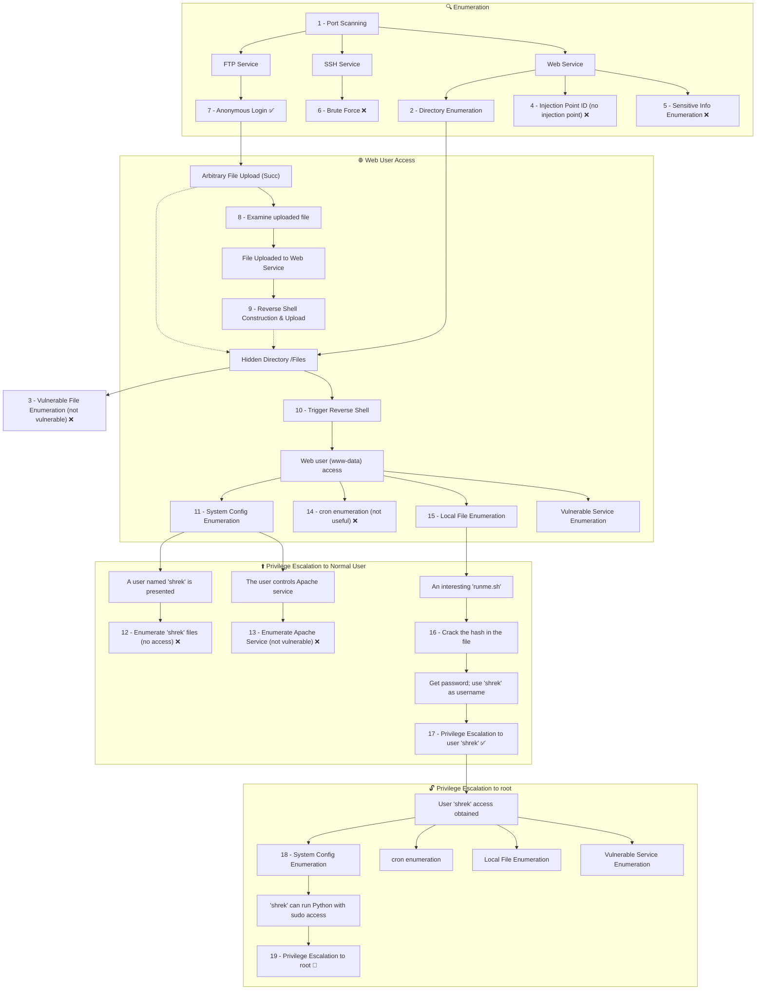

# Figure 9: PTT Example — Vulnhub-Hackable II

```mermaid
flowchart TD
    subgraph ENUM["🔍 Enumeration"]
        S1["1 - Port Scanning"]
        S1 --> FTP["FTP Service"]
        S1 --> SSH["SSH Service"]
        S1 --> WEB["Web Service"]

        FTP --> S7["7 - Anonymous Login ✅"]
        SSH --> S6["6 - Brute Force ❌"]
        WEB --> S2["2 - Directory Enumeration"]
        WEB --> S4["4 - Injection Point ID (no injection point) ❌"]
        WEB --> S5["5 - Sensitive Info Enumeration ❌"]
    end

    S7 --> AFU["Arbitrary File Upload (Succ)"]
    S2 --> HD["Hidden Directory /Files"]
    HD --> S3["3 - Vulnerable File Enumeration (not vulnerable) ❌"]
    HD --> S10["10 - Trigger Reverse Shell"]
    AFU -.-> HD

    subgraph WUA["🌐 Web User Access"]
        S8["8 - Examine uploaded file"]
        FU["File Uploaded to Web Service"]
        S9["9 - Reverse Shell Construction & Upload"]
        AFU --> S8 --> FU --> S9
        S9 -.-> HD
        S10 --> WWW["Web user (www-data) access"]
        WWW --> S11["11 - System Config Enumeration"]
        WWW --> S14["14 - cron enumeration (not useful) ❌"]
        WWW --> S15["15 - Local File Enumeration"]
        WWW --> VSE1["Vulnerable Service Enumeration"]
    end

    subgraph PEN["⬆️ Privilege Escalation to Normal User"]
        S11 --> SHR["A user named 'shrek' is presented"]
        S11 --> APA["The user controls Apache service"]
        SHR --> S12["12 - Enumerate 'shrek' files (no access) ❌"]
        APA --> S13["13 - Enumerate Apache Service (not vulnerable) ❌"]
        S15 --> RUN["An interesting 'runme.sh'"]
        RUN --> S16["16 - Crack the hash in the file"]
        S16 --> PW["Get password; use 'shrek' as username"]
        PW --> S17["17 - Privilege Escalation to user 'shrek' ✅"]
    end

    subgraph PER["🔓 Privilege Escalation to root"]
        S17 --> SHRA["User 'shrek' access obtained"]
        SHRA --> S18["18 - System Config Enumeration"]
        SHRA --> CRON2["cron enumeration"]
        SHRA --> LFE2["Local File Enumeration"]
        SHRA --> VSE2["Vulnerable Service Enumeration"]
        S18 --> SUDO["'shrek' can run Python with sudo access"]
        SUDO --> S19["19 - Privilege Escalation to root 🏁"]
    end
```
