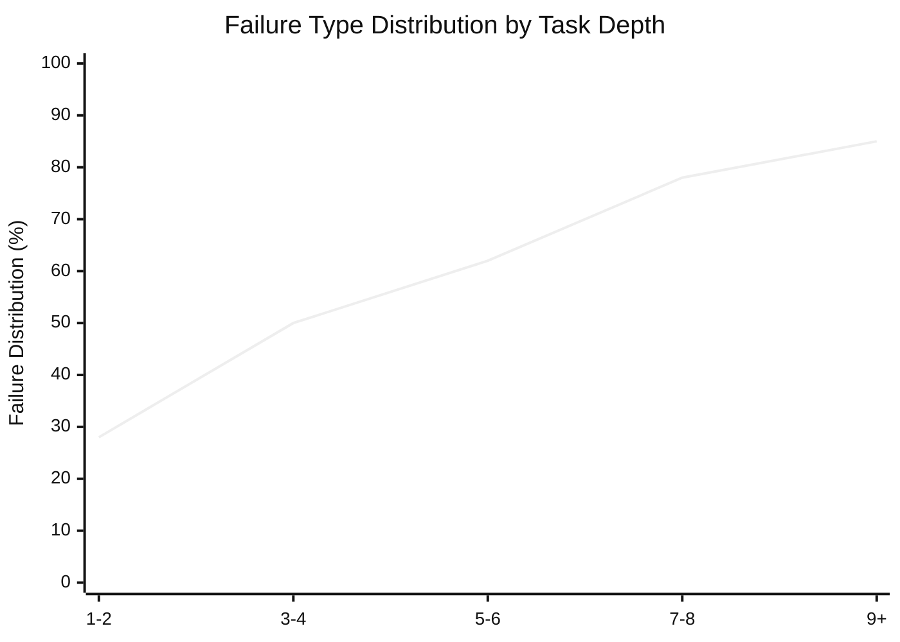

⚙️ Chunk 1 of the paper

# What Makes a Good LLM Agent for Real-world Penetration Testing?

**Authors:** Gelei Deng, Yi Liu, Yuekang Li, Ruozhao Yang, Xiaofei Xie, Jie Zhang, Han Qiu, Tianwei Zhang
**Affiliations:** Nanyang Technological University · University of New South Wales · Singapore Management University · CFAR, A*STAR, Singapore · Tsinghua University

## 📌 Abstract

LLM-based agents show promise for automating penetration testing, but reported performance varies widely across systems and benchmarks. This work:

- Analyzes **28 LLM-based penetration testing systems**
- Evaluates **5 representative implementations** across **3 benchmarks** of increasing complexity

> **Two distinct failure modes identified:**
> - **Type A failures** — capability gaps (missing tools, inadequate prompts), readily addressed through engineering
> - **Type B failures** — persist regardless of tooling, due to planning and state-management limitations

🔬 **Key insight:** Type B failures share a root cause largely invariant to the underlying LLM — agents lack **real-time task difficulty estimation**. This causes agents to misallocate effort, over-commit to low-value branches, and exhaust context before completing attack chains.

### PENTESTGPT V2

A penetration testing agent coupling strong tooling with difficulty-aware planning:

- **Tool and Skill Layer** — eliminates Type A failures via typed interfaces + retrieval-augmented knowledge
- **Task Difficulty Assessment (TDA)** — addresses Type B failures by estimating tractability across four measurable dimensions:
  1. Horizon estimation
  2. Evidence confidence
  3. Context load
  4. Historical success
- **Evidence-Guided Attack Tree Search (EGATS)** — uses TDA estimates to guide exploration-exploitation decisions

📊 **Results:**
- Up to **91%** task completion on CTF benchmarks with frontier models (39–49% relative improvement over baselines)
- Compromises **4 of 5** hosts on the GOAD Active Directory environment vs. **2** by prior systems

**Conclusion:** Difficulty-aware planning yields consistent end-to-end gains across models, addressing a limitation that model scaling alone does not eliminate.

---

## 1. Introduction

Penetration testing is essential for assessing organizational security, but demand for skilled practitioners far exceeds supply — the ISC2 Cybersecurity Workforce Study estimates a global shortfall of **4.7 million** cybersecurity professionals.

This gap, combined with the labor-intensive nature of manual testing, has driven interest in LLM-based automation. Recent systems report strong results on CTF and Hack The Box (HTB) benchmarks, and emerging work shows real-world impact (e.g., discovering exploitable vulnerabilities in production software). However, reported task completion rates range widely — from single digits under naive prompting to 40–80% with more sophisticated architectures — raising the central question:

> What drives these performance differences, and what limitations remain?

### 🔬 Method: Systematic Analysis

The authors conducted a systematic analysis of 28 LLM-based penetration testing systems, evaluating five representative solutions across three benchmarks of increasing complexity. Two findings emerged:

**Finding 1 — Optimization target mismatch:** Existing systems are optimized to address limitations of *specific* LLMs (e.g., context summarization and RAG-augmented tooling compensate for transient constraints like limited context windows and poor tool knowledge). These benefits diminish as models improve — performance gaps across solutions compress by **over half** when backbone models upgrade from GPT-4o to GPT-5.

**Finding 2 — Two failure categories:**
- **Type A (capability gaps):** missing tools/knowledge, addressable via engineering
- **Type B (complexity barriers):** persist regardless of tooling, due to planning and state-management limitations

Existing systems predominantly target Type A failures — strong on simple tasks, but fail on multi-step scenarios where Type B failures dominate. Their architectures are not designed to complement LLM improvements; contributions **erode** rather than **compound** as models advance.

### Root Cause of Type B Failures

Existing pentest agent designs cannot assess task difficulty in real time. This manifests as:

- Committing prematurely to unproductive branches (can't estimate if a path needs 3 or 30 steps)
- Failing to transition from reconnaissance to exploitation (no metrics for evidence sufficiency)
- Context forgetting (no monitoring of context consumption)

> Human pentesters handle these problems through experience-built intuition. LLM agents lack equivalent difficulty-aware decision-making mechanisms.

**Validation:** Augmenting agents with difficulty assessment reduced the Type B failure rate from **58% → 27%**, while the Type A rate remained unchanged — confirming this addresses the root cause.

### PENTESTGPT V2 Design

Built around the two findings above:

| Failure Type | Solution |
|---|---|
| Type A | Extensible Tool and Skill Layer — typed interfaces for **38 security tools** + skill compositions encoding expert attack patterns |
| Type B | Task Difficulty Assessment (TDA) — estimates tractability via horizon estimation, evidence confidence, context load, historical success rate; integrated into Evidence-Guided Attack Tree Search |

Additional component: a **retrieval-augmented Memory Subsystem** maintains structured state external to the LLM context, preventing context forgetting during extended attack campaigns.

### 📊 Evaluation Results (Three Benchmarks)

| Benchmark | Description | Result |
|---|---|---|
| **XBOW** | 104 web security tasks | 91% peak task completion (89% mean) with Claude Opus 4.5 — 49% relative improvement over best baseline (61%) |
| **PentestGPT Benchmark** | 13 HTB/VulnHub machines | Roots 12 of 13 machines, including Hard-rated targets where baselines got stuck at initial steps |
| **GOAD** | 5-host Active Directory environment | Compromises 4 of 5 hosts (vs. ≤2 for prior systems), with successful lateral movement and credential chaining across domain boundaries |

**Ablation findings:** Tool Layer dominates gains on short-horizon tasks; TDA-EGATS and Memory drive gains on multi-step scenarios.

### ⚠️ Limitations

Hard challenges remain beyond current LLM capabilities:
- Novel exploitation requiring creative reasoning
- Adversarial environments with deceptive defenses
- Extended multi-week campaigns

Fully autonomous penetration testing remains distant. The paper discusses these boundaries and proposes evaluation methodologies distinguishing tractable from intractable challenges.

### Contributions Summary

1. **Systematic analysis (§3):** 28 systems analyzed, 5 implementations evaluated across 3 benchmarks; identifies Type A/Type B failure taxonomy
2. **PENTESTGPT V2 (§4):** Tool and Skill Layer (Type A) + TDA within Evidence-Guided Attack Tree Search (Type B)
3. **Evaluation (§5):** 91% on CTF benchmarks (49% improvement), 12/13 machines rooted, 4/5 AD hosts compromised (doubling baseline)
4. **Design principles (§6):** Analysis of remaining barriers + proposed Type A/Type B-aware evaluation methodologies
5. **Open-source artifacts:** Implementation, tool interfaces, and evaluation scripts released

---

## 2. Background

### 2.1 Penetration Testing

Penetration testing identifies security vulnerabilities by simulating real-world attackers in blackbox/greybox scenarios. Standard methodology phases:

This follows a characteristic search pattern: **breadth-first exploration** over attack surfaces, followed by **depth-first exploitation** along promising paths. Testers continuously decide which paths to pursue, when to abandon unproductive avenues, and how to integrate new discoveries — this exploration/exploitation interleaving motivates the paper's design (§4).

### 2.2 Benchmarking Penetration Testing

Evaluating pentest capabilities is methodologically challenging: real-world engagements involve social engineering, multi-target recon, and complex business logic that's hard to replicate; commercial tests produce confidential reports tied to proprietary systems.

**Standardized benchmarks used:**
- **VulnHub** — downloadable vulnerable VMs
- **HTB (Hack The Box)** — curated machines spanning difficulty levels
- **CTF competitions** — web exploitation, cryptography, binary exploitation challenges

⚠️ **Benchmark vs. reality gap:** CTF challenges are designed to be solvable via a single attack path, whereas real systems may have no exploitable vulnerabilities or require broad discovery across a large attack surface. **GOAD** (Game of Active Directory) is the closest approximation to realistic enterprise environments among current benchmarks — requiring chained attack techniques across multi-domain Windows networks — though it still abstracts away social engineering and time pressure.

> Benchmark results should be interpreted as measuring specific technical capabilities rather than predicting overall real-world effectiveness.

### 2.3 LLM-Based Agents

Standard approach: augment LLMs with **tool use** (invoking shell commands/APIs) + **agentic scaffolding** (structuring the interaction loop).

Penetration testing is a natural fit for such agents — it requires combining extensive domain knowledge with sequential decision-making, tool orchestration, and adaptive strategy.

- **Early work:** LLMs as copilots suggesting next steps to human operators
- **Recent work:** LLMs as autonomous agents executing recon, exploitation, and post-exploitation workflows

These agents must handle heterogeneous tool outputs, maintain coherent strategies across many steps, and decide when to pivot between attack paths — challenges that push against current LLM capability limits. Similar limitations appear in software engineering and web navigation agents, suggesting the barriers are **not specific to penetration testing**.

---

## 3. Understanding LLM Agent Failures

**Central question:** How far are we from real-world penetration testing with LLM agents?

**Goals of the empirical analysis:**
1. Understand what drives reported performance improvements
2. Identify failure modes through controlled evaluation
3. Establish a framework distinguishing tractable tasks from intractable challenges

### 3.1 Taxonomy and Evaluation of LLM-based Penetration Testing Systems

**Survey scope:** 28 candidate systems published 2023–2025. Inclusion criteria: must use LLMs as a core component and target penetration testing or CTF challenges; excludes vulnerability detection without exploitation and commercial systems without published details. **10 of 28** met criteria (full list in Appendix A).

#### 3.1.1 Taxonomy

Systems summarized along four dimensions: **architecture** (multi-agent, human-in-the-loop), **tool integration** (function calls, MCP), **knowledge sources** (RAG, fine-tuned), **planning** (reactive, task trees, state machines, memory trees).

**Table 1: Taxonomy of LLM-based penetration testing systems**

| System | Year | Arch. | Tools | Knowledge | Planning |
|---|---|---|---|---|---|
| PentestGPT | 2024 | Workflow | Shell | Prompt | Task tree |
| AutoPT | 2024 | Single | Shell | Prompt | State machine |
| RapidPen | 2025 | Single | Shell | RAG | ReAct |
| PentestAgent | 2024 | Multi | Function | RAG | Phase |
| VulnBot | 2025 | Multi | Shell | Prompt | Tri-phase |
| xOffense | 2024 | Multi | Shell | Fine-tune | Multi-phase |
| TermiAgent | 2024 | Multi | Shell | RAG | Memory tree |
| Cochise | 2025 | Multi | Shell | Prompt | Hierarchical |

Three representative architectural families: human-in-the-loop copilots (PentestGPT), single-agent systems (AutoPT), and multi-agent systems (PentestAgent, VulnBot, Cochise).

#### 3.1.2 Evaluation Setup

**Five representative open-source systems evaluated:**
- **PentestGPT** (copilot)
- **AutoPT** (single-agent)
- **PentestAgent** (multi-agent with RAG)
- **VulnBot** (multi-agent, tri-phase)
- **Cochise** (Active Directory-focused)

**Three benchmarks, increasing realism:**
- **XBOW** — 104 web challenges (SQLi, XSS, auth bypass)
- **PentestGPT Benchmark** — 13 machines from HTB/VulnHub, end-to-end pentesting
- **GOAD** — 5-host multi-domain AD requiring chained attacks

**Models used for §3 evaluation:** GPT-4o, GPT-5, Gemini-3-Flash, Claude Sonnet 4 — chosen to assess model vs. architecture contributions. GPT-4o included as the generation most existing systems were optimized for, alongside newer models to examine how architectural advantages evolve with capability.

*Note: §5 evaluates PENTESTGPT V2 with a different model set (GPT-5.2, Opus 4.5, Gemini 3 Pro), selected specifically for thinking-mode support, to enable controlled comparison of extended reasoning.*

**Protocol:** Temperature set to zero; best-of-three trials reported (following prior work), since penetration testing is inherently non-deterministic.

### 3.2 Findings

Table 2 summarizes task completion rates across all system-model-benchmark combinations (see below).

#### 3.2.1 Agent Architecture Convergence

Despite two years of agent design innovation, **performance differences between systems compress with state-of-the-art models**:

- On XBOW with GPT-4o: completion rates range **27%–39%** across five systems (44% relative spread — reflects meaningful architectural distinctions)
- With GPT-5: gap narrows to **22.5%** (40–49%)
- Similar convergence on PentestGPT Benchmark: spread shrinks from 2 points with GPT-4o (4–6 machines) to 1 point with GPT-5 (7–8 machines)

**Why this happens:** Existing agents were designed to address *transient* model constraints, not *persistent* task challenges:

| Technique | Compensates for | Status as models improve |
|---|---|---|
| PentestGPT's summarization module | Limited context windows | Dissolves with native million-token support |
| Multi-agent role separation (recon/exploit agents) | Weak instruction-following | Frontier models handle complex multi-step prompts without decomposition |
| RAG pipelines for tool documentation | Poor parametric knowledge of security tools | Recent models have much stronger baseline tool/technique knowledge |

> These "innovations" are workarounds for 2023-era model limitations, not solutions to persistent penetration testing challenges.

**Transient vs. persistent challenges:**
- *Transient* (diminish as models improve): context capacity, instruction adherence, tool-use reliability, domain knowledge
- *Persistent* (remain regardless of raw model power): long-horizon planning across 10+ steps, principled exploration-exploitation decisions, state maintenance external to degrading context, real-time task-difficulty assessment

Persistent challenges arise from the **structure of penetration testing tasks**, not model limitations — requiring architectural solutions that *complement* rather than *compensate for* underlying models.

**🔬 The Cochise case study:** Cochise's AD-specific attack primitives (Kerberoasting, NTLM relay, BloodHound integration) are capability additions models can't replicate through reasoning alone — but this specialization costs generality:

- Cochise underperforms on XBOW and PentestGPT Benchmark (34%, 4/13 with GPT-4o) vs. general-purpose VulnBot (39%, 6/13)
- Cochise leads on GOAD by leveraging domain-specific knowledge unavailable to other systems

Neither compensating for model limitations nor adding domain-specific capabilities addresses the persistent challenge of navigating complex attack graphs.

> **Finding 1:** Existing penetration testing agents address transient model limitations rather than persistent task challenges. As models evolve, benefits from architectural distinctions compress. Durable agent value should address challenges that persist across model evolution.

#### 🖼️ Figure 1: Failure type distribution by task depth

Measured as the number of distinct exploitation steps required for task completion. Type A (capability gaps) failures concentrate at shallow depth (~72% of failures at depth 1–2); Type B (complexity barriers) dominates at greater depth, reaching **85%** of failures at depth 9+. A "complexity threshold" appears around depth 4–5 where Type B overtakes Type A as the dominant failure source.

#### 3.2.2 Two Distinct Failure Categories

**Goal:** Understand *why* systems fail, not just how often.

**Method:** Analyzed 200 execution traces from unsuccessful attempts (40 per system), sampled proportionally across benchmarks. Two researchers independently coded failure modes via open coding, then reconciled disagreements through discussion. Failures were classified based on observable trace characteristics *before* any intervention, into two categories:

**Type A failures (capability gaps):** Trace shows the agent correctly reasons about the attack vector but fails at execution — articulates the right approach, then issues malformed commands or uses incorrect tool syntax.
- *Example:* Agent correctly identifies a SQL injection vulnerability ("I will use SQL injection to extract data") but fails because it lacks `sqlmap` or correct documentation.
- **Validation:** Augmenting PentestGPT with missing tool documentation/usage instructions improved XBOW completion from 27% → 38% (41% relative improvement) — confirming Type A failures respond to capability engineering.

**Type B failures (complexity barriers):** Trace shows the agent has adequate tools/knowledge (evidenced by successful tool invocations earlier in the session) but fails to navigate the task space effectively. Three recurring patterns:

1. **Context forgetting** — credentials discovered during recon are lost by exploitation time, forcing redundant discovery or causing auth failures
2. **Premature commitment** — agents dive deep into a single attack path without adequate recon, missing easier alternatives
3. **Exploration-exploitation imbalance** (inverse of #2) — exhaustive recon that never transitions to exploitation, accumulating info without acting on it

These cascade into **chain errors**: agents complete individual attack stages successfully but fail to integrate them into coherent attack chains, losing state between phases.

**Failure distribution vs. task complexity:**
- **XBOW** (typically 1–3 steps): Type A dominates — 68% of failures resolve with improved tooling
- **GOAD** (5–10 chained steps across hosts): Type B dominates — 79% of failures persist regardless of tooling improvements

**Table 3: Failure mode analysis (200 traces)**

| Failure Category | Frequency (%) | Resolved by tooling? |
|---|---|---|
| **Type A: Capability Gaps (42% total)** | | |
| Missing tool / Incorrect syntax | 26 | ✓ |
| Output parsing / Knowledge gap | 16 | ✓ |
| **Type B: Complexity Barriers (58% total)** | | |
| Context forgetting | 18 | – |
| Premature commitment | 16 | – |
| Exploration-exploitation imbalance | 12 | – |
| Multi-step chain failures | 12 | – |

> **Finding 2:** Failures partition into (a) **Type A: capability gaps** — missing tools/knowledge addressable through engineering, and (b) **Type B: complexity barriers** — search strategy and state-management failures persisting despite adequate capabilities. These require different solutions.

### 3.3 Analysis and Design Implications

#### 3.3.1 Root Cause: Missing Difficulty Assessment

Type B failures share a common root cause: **agents cannot distinguish tractable from intractable tasks in real time.**

| Type B pattern | Root cause |
|---|---|
| Premature commitment | Can't estimate whether a path requires 3 or 30 steps → persists on unproductive branches indefinitely |
| Exploration-exploitation imbalance | Lacks metrics for recon sufficiency → can't determine whether evidence justifies transitioning to exploitation |
| Chain / context-forgetting failures | Can't assess whether accumulated context remains adequate → critical info lost/degraded without the agent's awareness, leading to silent reasoning degradation |

**Four measurable dimensions for difficulty assessment** (identified as practically implementable, unlike abstract "difficulty" which is only knowable post-hoc):

1. **Horizon estimation** — remaining steps to goal
2. **Evidence confidence** — certainty about current state
3. **Context load** — fraction of context window consumed
4. **Historical success** — past performance on similar branches

An agent tracking these signals can decide when to persist, when to pivot, and when to prune.

**Current systems uniformly lack this capability:**
- PentestGPT's Penetration Testing Tree (PTT) tracks attack structure but provides no difficulty metrics to guide search
- AutoPT's Pentesting State Machine (PSM) enforces phase transitions [continues in next chunk]

---

*[End of Chunk 1 — content continues with §3.3.1 in the next chunk]*
